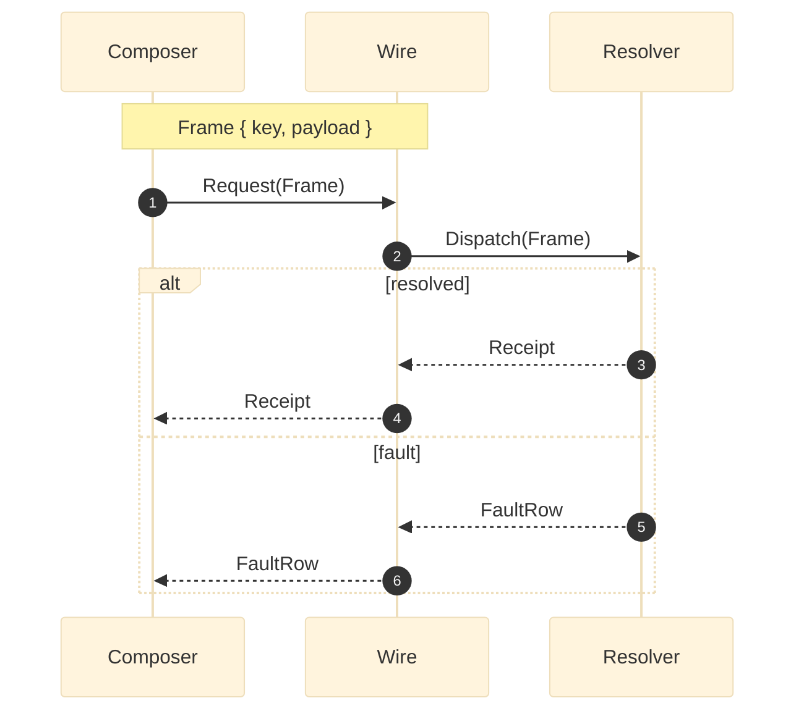

# [WIRE_SEQUENCE]

Draw an ordered exchange across a wire or process boundary. Use `sequenceDiagram` with 3-4 participants, `autonumber`, one `alt` block splitting success from fault, and one `Note over` the wire naming the frame shape. `sequenceDiagram` supports neither ELK nor `look` — keep only `theme: base`.

