# [WIRE_SEQUENCE]

Draw an ordered exchange across a wire or process boundary. Template law bakes in the wire discipline an unassisted attempt drops — the frame shape is named ON the wire in a note, so both sides visibly share one contract; every request has its visible return in both the success and fault arms, keeping causality auditable; the resolver's activation brackets exactly the work it owns; and the timeout escape is a `break` block, because a timeout aborts the exchange rather than branching it. Five region kinds carry the exchange grammar: `alt` splits mutually exclusive outcomes, `opt` guards a single conditional step, `par` runs concurrent arms, `critical`/`option` marks a mandatory step with its fault escape, and `loop` carries repetition — a reply stream drains in a `loop`, a retry re-opens in one, and every loop states its bound on the frame label so the exchange provably terminates. A resolver's owned exchange sits on a `rect` background and the in-process pair sits in a `box`; a bare lifeline outside every box reads as external — sequence has no per-actor class, so containment is the externality encoding. Use `sequenceDiagram` with `autonumber` for citable steps; the participant floor is a branch or fault split, not a headcount, though 3-4 participants is the common shape. `sequenceDiagram` takes no ELK. An unordered ownership structure is a spine or seam-graph, never a sequence.

```mermaid
sequenceDiagram
    accTitle: Bridge wire exchange
    accDescr: The app host dispatching a certified frame through the bridge wire to the host app, with a timeout break, a bounded reply-stream loop, a mandatory trailer drain with its fault option, a rejected alternative, an async telemetry send, and the frame shape noted over the wire.
    autonumber
    box transparent APP PROCESS
        participant C as AppHost composer
        participant W as Bridge wire
    end
    participant R as Host app
    Note over C,W: Frame { contentKey, payload }
    C->>W: Request(Frame)
    break wire timeout
        W-->>C: TimeoutFault
    end
    rect rgb(33, 34, 44)
        W->>R: Dispatch(Frame)
        activate R
        alt resolved
            loop reply stream [chunk <= max]
                R-->>W: FrameChunk
                W-->>C: FrameChunk
            end
            critical drain trailer
                R-->>W: EvidenceCertificate
                W-->>C: EvidenceCertificate
            option trailer fault
                R-->>W: FaultRow
                W-->>C: FaultRow
            end
        else rejected
            R-->>W: FaultRow
            W-->>C: FaultRow
        end
        deactivate R
    end
    R--)C: telemetry(receipt)
```

Refill by renaming the participants to the real boundary pair; an async fire-and-forget rides `--)` and expects no return, and a unary exchange drops the stream loop while keeping the trailer's `critical`/`option` pair wherever a mandatory step can fault.
