# [WIRE_SEQUENCE]

Draw an ordered exchange across a wire or process boundary. The template bakes in the wire discipline an unassisted attempt drops — the frame shape is named ON the wire in a note, so both sides visibly share one contract; every request has its visible return in both the success and fault arms, keeping causality auditable; the resolver's activation brackets exactly the work it owns; and the timeout escape is a `break` block, because a timeout aborts the exchange rather than branching it. The resolver's owned exchange sits on a `rect` background — the container is sequence's one styling lever, so the region a participant owns is tinted, never inferred. Use `sequenceDiagram` with 3-4 participants, `autonumber` for citable steps, and one `alt` splitting success from fault. `sequenceDiagram` takes no ELK; `look: neo` applies. An unordered ownership structure is a spine or seam-graph, never a sequence.

```mermaid
---
config:
  theme: base
  themeCSS: "text.actor tspan{font-size:14px;font-weight:600}.messageText{font-size:12.5px;font-weight:500}.noteText{font-size:12.5px}.loopText,.labelText{font-size:12px;font-weight:500}"
  themeVariables:
    darkMode: true
    background: "#282A36"
    primaryColor: "#44475A"
    primaryTextColor: "#F8F8F2"
    actorBkg: "#44475A"
    actorBorder: "#BD93F9"
    actorTextColor: "#F8F8F2"
    actorLineColor: "#6272A4"
    signalColor: "#FF79C6"
    signalTextColor: "#F8F8F2"
    noteBkgColor: "#44475A"
    noteTextColor: "#F8F8F2"
    noteBorderColor: "#6272A4"
    activationBkgColor: "#6272A4"
    activationBorderColor: "#BD93F9"
    loopTextColor: "#F8F8F2"
    labelBoxBkgColor: "#21222C"
    labelBoxBorderColor: "#6272A4"
    labelTextColor: "#F8F8F2"
    fontFamily: "SF Mono, Menlo, Cascadia Mono, Segoe UI Mono, Consolas, monospace"
---
sequenceDiagram
    accTitle: Wire exchange
    accDescr: Ordered request and response across a process boundary with a success versus fault alternative, a timeout break, and the frame shape noted over the wire.
    autonumber
    participant C as Composer
    participant W as Wire
    participant R as Resolver
    Note over C,W: Frame { key, payload }
    C->>W: Request(Frame)
    break wire timeout
        W-->>C: TimeoutFault
    end
    rect rgb(33, 34, 44)
        W->>R: Dispatch(Frame)
        activate R
        alt resolved
            R-->>W: Receipt
            W-->>C: Receipt
        else fault
            R-->>W: FaultRow
            W-->>C: FaultRow
        end
        deactivate R
    end
```

Refill by renaming the participants to the real boundary pair and keep the invariants — one named frame shape, a return in every arm, a break for the abort path, activation only around owned work, and the owned region on its `rect` background. The frontmatter micro-scale `themeCSS` stamp and the ruled mono stack are fixed law — a refill renames participants, never strips the fidelity surface.
