# [WIRE_SEQUENCE]

Draw an ordered exchange across a wire or process boundary. The template bakes in the wire discipline an unassisted attempt drops — the frame shape is named ON the wire in a note, so both sides visibly share one contract; every request has its visible return in both the success and fault arms, keeping causality auditable; the resolver's activation brackets exactly the work it owns; and the timeout escape is a `break` block, because a timeout aborts the exchange rather than branching it. The resolver's owned exchange sits on a `rect` background and the in-process pair sits in a `box` — the containers are sequence's styling levers, so ownership reads as surface, never inference. Use `sequenceDiagram` with 3-4 participants, `autonumber` for citable steps, and one `alt` splitting success from fault. `sequenceDiagram` takes no ELK. An unordered ownership structure is a spine or seam-graph, never a sequence.

```mermaid
---
config:
  theme: base
  look: classic
  themeVariables:
    darkMode: true
    fontFamily: "SF Mono, Menlo, Cascadia Mono, Segoe UI Mono, Consolas, monospace"
    useGradient: false
    dropShadow: "none"
    background: "#282A36"
    primaryColor: "#44475A"
    primaryTextColor: "#F8F8F2"
    noteBkgColor: "#44475A"
    noteTextColor: "#F8F8F2"
    noteBorderColor: "#6272A4"
    actorBkg: "#44475A"
    actorBorder: "#BD93F9"
    actorTextColor: "#F8F8F2"
    actorLineColor: "#6272A4"
    signalColor: "#FF79C6"
    signalTextColor: "#F8F8F2"
    sequenceNumberColor: "#282A36"
    activationBkgColor: "#44475A"
    activationBorderColor: "#BD93F9"
    loopTextColor: "#F8F8F2"
    labelBoxBkgColor: "#21222C"
    labelBoxBorderColor: "#D6BCFA"
    labelTextColor: "#F8F8F2"
  themeCSS: "text.actor tspan{font-size:13px;font-weight:600}.messageText{font-size:12px;font-weight:500}.noteText{font-size:12px}.loopText,.labelText{font-size:12px;font-weight:500}.messageLine0{stroke-width:2px}.messageLine1{stroke-width:1.5px;stroke-dasharray:4 6}.actor{stroke-width:1.5px}rect.actor{filter:none!important}[id$='-filled-head'] path{fill:#FF79C6;stroke:#FF79C6}"
---
sequenceDiagram
    accTitle: Bridge wire exchange
    accDescr: The app host dispatching a certified frame through the bridge wire to the Rhino host, with a timeout break, a success versus fault alternative, an async telemetry send, and the frame shape noted over the wire.
    autonumber
    box rgb(33, 34, 44) APP PROCESS
        participant C as AppHost composer
        participant W as Bridge wire
    end
    participant R as Rhino host
    Note over C,W: Frame { contentKey, payload }
    C->>W: Request(Frame)
    break wire timeout
        W-->>C: TimeoutFault
    end
    rect rgb(33, 34, 44)
        W->>R: Dispatch(Frame)
        activate R
        alt resolved
            R-->>W: EvidenceCertificate
            W-->>C: EvidenceCertificate
        else fault
            R-->>W: FaultRow
            W-->>C: FaultRow
        end
        deactivate R
    end
    R--)C: telemetry(receipt)
```

Refill by renaming the participants to the real boundary pair and keep the invariants — one named frame shape, a return in every arm, a break for the abort path, activation only around owned work, the in-process pair boxed, and the owned region on its `rect` background; an async fire-and-forget rides `--)` and expects no return. The frontmatter micro-scale `themeCSS` stamp, the ruled mono stack, and the `-filled-head` marker stamp are fixed law — a refill renames participants, never strips the fidelity surface.
