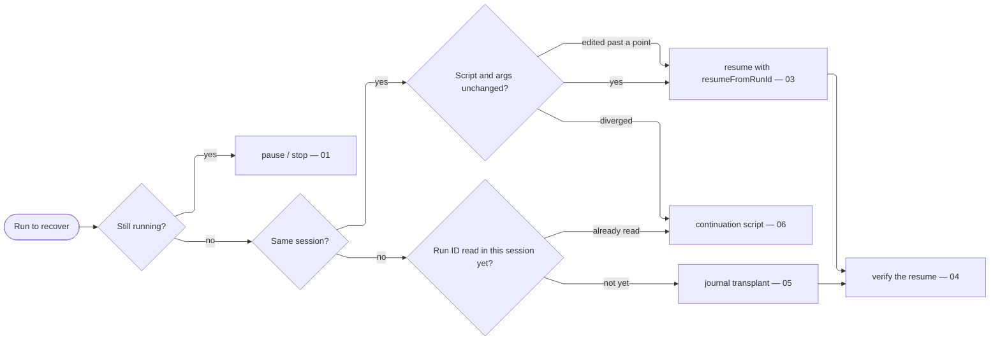

# Run Recovery

Stop, resume, transplant, and reconstruct workflow runs without losing completed work. Completed work is never lost: every agent's result is journaled the instant it finishes, so a pause or stop only ever discards agents still in flight, which re-run on resume. One expensive failure is operator-made — a resumable run re-run from zero. Recovery routes as one dispatch — every edge a condition, every leaf the owning section:



## [01]-[CONTROLS]

A run is a background task. A launch call returns a run ID immediately; progress streams to `/workflows`; a `<task-notification>` lands in the conversation on completion.

| [INDEX] | [ACTION]          | [MECHANISM]                                                                             |
| :-----: | :---------------- | :-------------------------------------------------------------------------------------- |
|  [01]   | Pause             | `p` in `/workflows` — the gentle hold, nothing discarded                                |
|  [02]   | Stop              | `x` with focus on the run, or `TaskStop` programmatically; completed agents stay cached |
|  [03]   | Restart one agent | `r` on the selected running agent — without stopping the run                            |
|  [04]   | Resume            | `p` in `/workflows`, or `Workflow({ scriptPath, resumeFromRunId })`                     |

Stop a still-running prior run before relaunching its script. Never kill a live session or server to force a workflow's hand — fix and redeploy, then let the owner restart on its own schedule.

## [02]-[JOURNAL]

Each run owns a directory under `~/.claude/projects/<project>/<session>/subagents/workflows/wf_<id>/`, and `journal.jsonl` inside it is the resume cache: every `agent()` call appends `{type:"started", key, agentId}` at start and `{type:"result", key, agentId, result}` with the validated result at finish. Each `key` is `v2:<sha256>` over the call's prompt and its `schema`/`model`/`isolation`/`agentType`, never `label`/`phase`/`effort`. Each agent's transcript is a separate `agent-<id>.jsonl`; resume reads the journal, never the transcripts, written by the runtime automatically.

Resume replays the journal by key: `Workflow({ scriptPath, resumeFromRunId })` re-executes the deterministic script and, per `agent()` call, recomputes the key — a `result` record returns instantly with no model call; a `started`-only record (in-flight at the stop) or no record runs live. Same script + same `args` = a full cache hit; an edited script replays every unchanged call before the edit.

## [03]-[RESUME]

Resume is one specific call, and each of these mistakes silently turns it into a fresh run:

- No `resumeFromRunId`. A bare `Workflow({ scriptPath })` or `Workflow({ name })` is a NEW run with an empty journal — it never consults a prior run's cache. Most common cause of an unexpected restart.
- A different session. That journal lives under the launching session's directory; a plain resume from a new session (or after a process restart) finds an empty journal and re-runs from zero. Recover with the transplant at [05].
- A changed cache key from the top. Script edits or changed `args` miss the cache at the affected call and rerun from there; keep launched scripts stable while resumable.
- A changed file behind a path argument. Cache keys carry the path string, not file content, so freeze referenced briefs during resumable runs; changed content requires a fresh run.
- An unstable launch source. Launch from a stable on-disk `scriptPath` so the exact bytes that ran stay on disk to replay against; an inline `script` string leaves nothing stable to resume from.

A run ledger makes the first rule reliable: the moment `Workflow` returns, write the run ID, launched `scriptPath`, `args`, and resume command to the session scratchpad (never the repo) — copy `assets/templates/run-ledger.template.md`, updated on every resume or restart. That ledger is not the journal — the journal is the automatic result cache that DOES the resuming; the ledger is the run-ID note a later turn passes back.

A lost run ID is recoverable in-session: the launch result prints it, the completion notification repeats it, `/workflows` lists every run, and the run directory is named `wf_<id>`.

## [04]-[VERIFY]

Resume-cache keys may change across sessions, harness builds, or sibling calls across stop/resume. Verify every resume immediately: classify fresh `started` records against agent transcript task lines; the correct outcome is the next pending stage. Fresh `started` records for completed work signal a key mismatch, so stop the run and diff against the bytes that ran.

Stop a run re-executing cached work the moment drift is confirmed; otherwise stop only at stage boundaries (journal `result` count equals the stage's agent total), so the journal holds complete stages a continuation script reconstructs cleanly.

## [05]-[TRANSPLANT]

Cache keys are content-addressed with no session component, so a journal moves between sessions intact as long as the script bytes and `args` are unchanged. Cross-session there is ONE transplant window: the journal must land in the new session's run directory before the FIRST in-session read of that run ID — only the first read is honored, and records appended or rewritten after it fail internal validation and are ignored.

1. If the new session already relaunched the workflow, stop that run first (`TaskStop`) — a resume call adopts the old run ID and creates `wf_<id>` under the new session even when it finds no journal there.
2. Locate both run directories under `~/.claude/projects/<project>/<session>/subagents/workflows/wf_<id>/` — the old session's holds the populated `journal.jsonl`.
3. Back up the new directory's `journal.jsonl` if one exists, then concatenate old journal + new journal into the new directory's `journal.jsonl`. Resume matches `result` records by key; duplicate or stale `started` records are inert.
4. Resume with `Workflow({ scriptPath, resumeFromRunId: 'wf_<id>' })` — unchanged calls return cached, only genuinely-unfinished calls run live.
5. Run the [04] verification before walking away.

A transplant carries only the result cache; per-agent transcripts stay in the old directory and are not needed. When the script or `args` HAVE changed, the transplant still replays every call before the first edit; for a diverged script, fall back to the continuation script at [06].

## [06]-[CONTINUATION]

Recover a failed, cancelled, or quit run with a CONTINUATION SCRIPT, never journal surgery: copy the workflow, delete the completed stages, reconstruct their outputs from the journal's `result` records, bake them in as a data literal, and launch as a NEW run.

```js conceptual
// --- [INPUTS] --------------------------------------------------------------------------
// Stage 1 completed in wf_a1b2c3; its outputs reconstructed from the journal's `result`
// records and baked in as a literal. The body below is the original stage 2 onward, unchanged.
const stage1 = [
    { lane: "s0", report: ".claude/scratch/rebuild-core-data-b7c42c/gov-s0-report.json", entries: 14 },
    { lane: "s1", report: ".claude/scratch/rebuild-core-data-b7c42c/api-s1-report.json", entries: 9 },
];
```

Author every workflow for this recovery from day one: each stage writes its product to a disk file and returns a `{path, summary}` receipt, so any stage is re-enterable at zero cache dependence — the receipt roster IS the data literal a continuation script bakes in, and the product files are already on disk. A workflow whose stages hand heavy products through memory alone is unrecoverable past its own run.

## [07]-[TRUTH]

Receipts are claims; disk artifacts are truth. An agent's failure report is not ground truth: before re-running or discarding a lane, check its deterministic artifact paths — product file present and valid, process liveness, stderr tail. Forced returns can record a false failure while the real work completes; a stale leftover artifact reads as false success — hence the stale-purge law in the patterns reference. Design every lane so its truth is checkable from disk alone, and reconcile the roster against disk before acting on it.

## [08]-[COMMIT_TRAIL]

Journals cache agent RESULTS; git commits durably land FILES — complementary recovery axes. A stage that writes to a repo commits its own scoped work as it completes: explicit pathspecs, signed, `[scope]: action`, `git status` first so a concurrent stage's or a sibling wave's hunks stay frozen, never `git add -A`/`-u`. A run that dies between stages then loses no landed files even where the journal lost its tail, and a successor run or a fresh agent reconstructs where work stopped from the commit trail. Recovery reads BOTH: the journal for cached results, the git log for landed files.

That commit trail is a RECOVERY signal, never a JUDGMENT input. A stage scopes its work from the current tree as-found, not from the history of how the tree got there — this binds the stations hardest: a cold critique and a red-team read the files AS THEY ARE and improve, extend, or rebuild ground-up, never diffing the git log to scope their pass or to defer to a prior commit's intent. Cold means the tree, not the changelog.
