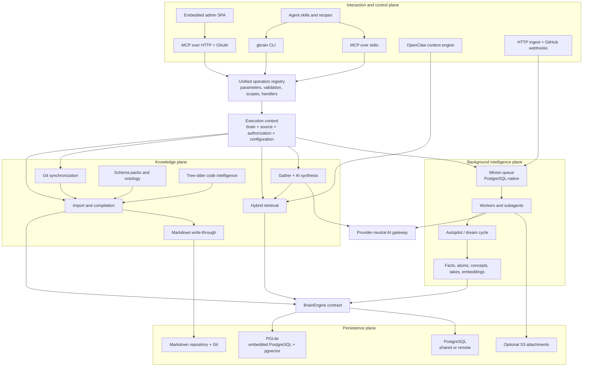
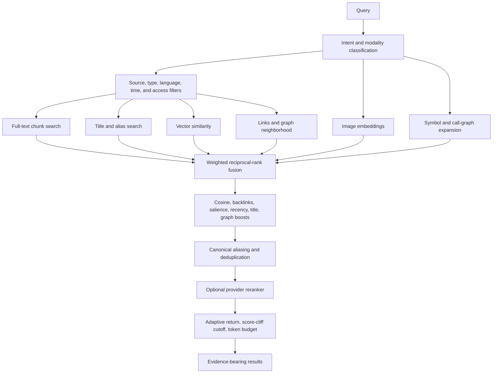

Local project copy: [`/Users/bardiasamiee/Documents/99.Github/gbrain`](/Users/bardiasamiee/Documents/99.Github/gbrain)

Local report: [`/Users/bardiasamiee/Documents/99.Github/Rasm/GBRAIN-ARCHITECTURE-REPORT.md`](/Users/bardiasamiee/Documents/99.Github/Rasm/GBRAIN-ARCHITECTURE-REPORT.md)

# gbrain: architecture and execution model

Complete system rather than taking the README at face value: current default-branch code, configuration, schema and migrations, CLI/MCP surfaces, retrieval and ingestion paths, background machinery, deployment topologies, admin UI, integration layer, CI invariants, and the live remote-branch set.

Snapshot: [`master` at `1f319e6d5aff7674d8f48f289768ff75911a9ea8`](https://github.com/garrytan/gbrain/tree/1f319e6d5aff7674d8f48f289768ff75911a9ea8), package version `0.42.65.0`. The repository is moving quickly, so all implementation references below are pinned to that commit.

## Bottom line

gbrain is a programmable knowledge-system runtime for humans and AI agents.

It combines:

- Markdown and Git for inspectable, portable knowledge.
- PostgreSQL or embedded PGLite for the operational index.
- Full-text, vector, graph, temporal, image, and code retrieval.
- An AI gateway spanning multiple model providers.
- CLI and MCP interfaces generated from one operation registry.
- A PostgreSQL-native background job system.
- Scheduled “autopilot” knowledge maintenance.
- An OAuth-protected remote server and operator dashboard.
- An OpenClaw context engine that injects live personal context and memory pointers into agent turns.
- Skills and recipes that teach agents how to use the system and connect external sources.

It is therefore neither “a folder of Markdown” nor “a vector database with a chatbot.” Its real model is:

> Git-backed documents for recovery and audit, a PostgreSQL-compatible database for execution, a unified operation layer for clients, and background agents that continuously derive richer knowledge from the stored material.

The package definition reflects that breadth: Bun runtime and compiled binary, PGLite, pgvector, MCP, AWS S3, multiple AI providers, Tree-sitter parsers, tokenizers, image decoders, Express, and PostgreSQL clients all live in the runtime dependency graph. See [`package.json`](https://github.com/garrytan/gbrain/blob/1f319e6d5aff7674d8f48f289768ff75911a9ea8/package.json).

## System architecture



The architecture is divided into four practical planes:

1. Interaction and control: CLI, MCP, HTTP, OAuth, OpenClaw, admin, webhooks.
2. Knowledge: import, synchronization, schema interpretation, search, synthesis, code analysis.
3. Persistence: PGLite/PostgreSQL, Markdown/Git, optional object storage.
4. Background intelligence: database queue, workers, extraction, consolidation, maintenance.

## Core concepts

The most important hierarchy is:

```text
installation
└── brain                         one database boundary
    ├── source                    one repository, tenant, or namespace
    │   ├── page                  canonical knowledge object
    │   │   ├── chunks            retrieval units
    │   │   ├── tags
    │   │   ├── links
    │   │   ├── versions
    │   │   ├── facts / atoms
    │   │   └── code symbols
    │   └── source configuration
    └── brain-global derived state
        ├── schema packs
        ├── takes and calibration
        ├── jobs
        ├── telemetry
        └── model/provider configuration
```

### Brain

A brain is a database boundary. It can be:

- A local embedded PGLite database.
- A shared PostgreSQL database.
- A remote brain reached through MCP.
- One member of an agent-side federated arrangement.

`GBRAIN_HOME`, CLI flags, environment variables, project markers, and mounted paths participate in brain selection. The topology documentation explicitly distinguishes local, remote, and split-engine arrangements in [`docs/architecture/topologies.md`](https://github.com/garrytan/gbrain/blob/1f319e6d5aff7674d8f48f289768ff75911a9ea8/docs/architecture/topologies.md).

### Source

A source is the namespace and security boundary inside a brain. Slugs are unique per source rather than globally. Nearly every knowledge query must carry or resolve a `source_id`.

That enables:

- One database containing multiple repositories or organizations.
- Cross-source retrieval inside a brain.
- Source-specific ontology, credentials, webhooks, sync state, and grants.
- Application-level source scoping on remote operations.

Cross-brain federation does not become a giant SQL query. It happens at the agent/client layer. The distinction is described in [`docs/architecture/brains-and-sources.md`](https://github.com/garrytan/gbrain/blob/1f319e6d5aff7674d8f48f289768ff75911a9ea8/docs/architecture/brains-and-sources.md).

### Page

A page is the durable knowledge object. Markdown frontmatter supplies structural metadata, but the importer compiles that page into:

- The page record.
- Search chunks.
- Embeddings.
- Tags.
- Explicit and inferred links.
- Timeline events.
- Code symbols and call edges.
- Version history.
- Schema-derived projections.
- Later facts, atoms, concepts, and takes.

### Schema pack

A schema pack is the active vocabulary and policy for a source or brain. It defines page types, link types, aliases, extraction behavior, synthesis behavior, and ontology constraints.

Configuration resolution follows a precedence stack:

1. Explicit trusted invocation.
2. Environment.
3. Per-source database configuration.
4. Brain-level database configuration.
5. Repository `gbrain.yml`.
6. Home configuration.
7. Bundled default.

Packs can inherit or borrow from other packs, with bounded recursion and cached invalidation. The canonical implementation is [`src/core/schema-pack/index.ts`](https://github.com/garrytan/gbrain/blob/1f319e6d5aff7674d8f48f289768ff75911a9ea8/src/core/schema-pack/index.ts).

## Runtime entry and dispatch

[`src/cli.ts`](https://github.com/garrytan/gbrain/blob/1f319e6d5aff7674d8f48f289768ff75911a9ea8/src/cli.ts#L213-L501) is the executable entry point. It performs five jobs:

1. Parses global CLI configuration.
2. Separates CLI-only commands from shared operations.
3. Chooses remote thin-client execution or a local engine.
4. Resolves brain, source, model, and authentication context.
5. Dispatches the operation and drains any bounded background work.

Local startup roughly follows:

```text
load configuration
→ configure AI gateway
→ create PGLite or PostgreSQL engine
→ connect
→ apply database migrations
→ merge database-held configuration
→ reconfigure provider gateway
→ resolve source
→ execute operation
→ render result
→ drain bounded background work
→ disconnect
```

Remote thin-client mode skips local database ownership and sends supported operations to the remote MCP server. Commands that intrinsically require a local filesystem or local database remain CLI-only and are refused in thin-client mode.

### One operation registry

The architectural center is not the CLI switch statement. It is [`src/core/operations.ts`](https://github.com/garrytan/gbrain/blob/1f319e6d5aff7674d8f48f289768ff75911a9ea8/src/core/operations.ts#L5537-L5622).

Each operation owns:

- Public name.
- Parameter schema.
- Validation.
- Scope requirement.
- Whether it is local-only.
- Whether it mutates state.
- Handler.
- CLI rendering hints.

That same registry drives:

- CLI execution.
- MCP tool definitions.
- MCP argument validation.
- JSON tool introspection.
- Authorization and source-context decisions.

The operation families include:

- Page CRUD, soft deletion, restoration, and versioning.
- Search, query, image search, and think.
- Tags, links, graph traversal, timeline, and ontology.
- Raw content, chunks, files, logs, and synchronization.
- Skills and advisor operations.
- Jobs, agents, messages, and subagents.
- Takes, grading, drift, and calibration.
- Facts, recall, forgetting, contradictions, experts, and trajectories.
- Code definitions, references, callers, callees, flow, and blast radius.
- Sources, identities, health, diagnostics, and migrations.
- Salience, anomalies, transcripts, chronicle, and context.
- Schema-pack inspection and mutation.

This is one of the strongest choices in the project: public behavior is defined once and projected into multiple transports.

## Storage engines

[`BrainEngine`](https://github.com/garrytan/gbrain/blob/1f319e6d5aff7674d8f48f289768ff75911a9ea8/src/core/engine.ts#L659-L900) is the large internal persistence contract.

Two implementations exist:

- `PGLiteEngine`: embedded PostgreSQL compiled to WebAssembly, including pgvector and trigram support.
- `PostgresEngine`: regular PostgreSQL with pooling, direct lock sessions, concurrency, and remote/shared deployment support.

The selection is made by [`src/core/engine-factory.ts`](https://github.com/garrytan/gbrain/blob/1f319e6d5aff7674d8f48f289768ff75911a9ea8/src/core/engine-factory.ts).

Important: local mode is not SQLite. PGLite lets the same PostgreSQL-oriented schema and most query behavior run in-process.

### PGLite consequences

PGLite is convenient for a personal brain but has operational constraints:

- One process effectively owns the database connection.
- A process/file lock prevents unsafe concurrent writers.
- A long-running MCP server can own the database, forcing other consumers to route through it.
- Worker parallelism is deliberately lower than PostgreSQL.
- The OpenClaw retrieval reflex prefers a host-provided resolver or server IPC rather than casually opening another PGLite instance.

### PostgreSQL consequences

PostgreSQL supports:

- Multi-process workers.
- Shared brains.
- Remote access.
- Connection pooling.
- `FOR UPDATE SKIP LOCKED` job claims.
- Advisory locking.
- Parallel sync/import workers.
- OAuth server deployments.
- Cross-source SQL retrieval within one brain.

## Database schema

[`src/schema.sql`](https://github.com/garrytan/gbrain/blob/1f319e6d5aff7674d8f48f289768ff75911a9ea8/src/schema.sql) defines the initial system. [`src/core/migrate.ts`](https://github.com/garrytan/gbrain/blob/1f319e6d5aff7674d8f48f289768ff75911a9ea8/src/core/migrate.ts) carries the accumulated evolution, currently through more than one hundred migrations.

The schema includes several categories.

### Knowledge records

- `sources`
- `pages`
- `chunks`
- `links`
- `tags`
- `raw_content`
- `timeline`
- `page_versions`
- `ingest_log`

### Code intelligence

- Code-symbol chunks.
- Symbol definitions and references.
- Call edges.
- Resolution state.
- Traversal caches.

### Derived intelligence

- Facts and fact aliases.
- Extraction queues and rollups.
- Takes and evidence.
- Calibration profiles.
- Drift and trajectories.
- Salience and emotional weight.
- Synthesis records.
- Query and traversal caches.

### Operations

- Job queue.
- Parent-child job state.
- Messages and attachments.
- Subagent messages.
- Tool executions.
- Rate leases.
- Budget and spend accounting.
- Cycle locks and freshness.
- Failure ledgers.
- Telemetry.

### Remote access

- Access tokens.
- OAuth clients, grants, codes, and refresh state.
- MCP request logs.
- Audit metadata.

Search-oriented indexes include:

- PostgreSQL full-text vectors.
- GIN indexes.
- Trigram matching.
- pgvector HNSW indexes.
- Recursive graph queries.
- Source-scoped uniqueness and lookup indexes.

The schema contains RLS-related hardening, but the system’s tenant boundary should primarily be understood as OAuth scopes plus application-enforced `source_id` scoping. It is not safe to reduce the architecture to “PostgreSQL RLS automatically isolates everything.”

## Ingestion and compilation

The main Markdown compiler is [`src/core/import-file.ts`](https://github.com/garrytan/gbrain/blob/1f319e6d5aff7674d8f48f289768ff75911a9ea8/src/core/import-file.ts#L231-L942).

A content import follows this flow:

```mermaid
flowchart LR
    Input["Markdown, text, code, image, or event"]
    Validate["Validate size, path, slug, trust, and content"]
    Parse["Parse frontmatter and active schema pack"]
    Guard["Apply observe-only and untrusted-content guardrails"]
    Hash["Compute stable identity and content hashes"]
    Compile["Compile chunks, links, tags, timeline, symbols"]
    Contextualize["Optionally generate contextual retrieval synopsis"]
    Embed["Embed retrieval payload"]
    Transaction["Persist page, chunks, edges, versions, aliases"]
    Verify["Read-after-write verification"]
    Filesystem["Atomic Markdown write-through"]
    Git["Optional Git commit and push"]

    Input --> Validate --> Parse --> Guard --> Hash --> Compile
    Compile --> Contextualize --> Embed --> Transaction --> Verify
    Transaction --> Filesystem --> Git
```



Notable details:

- Slug/path traversal and frontmatter spoofing are rejected.
- Symlinks and oversized files receive explicit treatment.
- Untrusted payloads can be quarantined, rejected, or stripped of privileged metadata.
- Canonical chunk text remains unchanged even when a generated contextual synopsis is prepended to the embedding input.
- Exact embeddings can be reused when chunks are unchanged.
- Page versions and search indexes change in one database transaction.
- Code files use Tree-sitter to derive symbols and call relationships.
- Images support several formats and can flow through OCR or multimodal interpretation.
- Alias projections are updated with the page.

### Generic ingestion daemon

The repository also has a source-adapter framework under [`src/core/ingestion`](https://github.com/garrytan/gbrain/tree/1f319e6d5aff7674d8f48f289768ff75911a9ea8/src/core/ingestion).

An `IngestionSource` emits a normalized event. It does not write directly. The daemon performs:

```text
validate event
→ overwrite claimed identity with registered source identity
→ deduplicate trickle-mode content
→ apply per-source rate limit
→ dispatch to the Minion queue
→ worker runs the canonical ingestion operation
```

Migration-mode sources bypass the short dedup window because they are expected to own permanent checkpoint/idempotency behavior.

Built-in adapters include:

- Inbox-folder ingestion.
- File watching.
- Greenfield Markdown migration.
- gstack learning logs.

External skill packs can register in-process ingestion modules through `GBRAIN_PLUGIN_PATH`. That extension surface is currently trust-on-first-use: requested permissions are informational, and the plugin executes inside the daemon process. The loader enforces absolute local paths, plugin-root containment, API compatibility, first-wins kind collision handling, and manifest validation in [`src/core/ingestion/skillpack-load.ts`](https://github.com/garrytan/gbrain/blob/1f319e6d5aff7674d8f48f289768ff75911a9ea8/src/core/ingestion/skillpack-load.ts).

## Git synchronization

[`src/commands/sync.ts`](https://github.com/garrytan/gbrain/blob/1f319e6d5aff7674d8f48f289768ff75911a9ea8/src/commands/sync.ts) is not a trivial “scan files and upsert them” command. It is a resumable repository reconciler.

### Incremental path

```text
acquire per-source lock
→ safely obtain/pull repository
→ inspect stored Git anchor
→ pin target commit
→ calculate adds, modifications, deletions, and renames
→ process files with checkpoints
→ inline bounded extraction/embedding work
→ record per-path failures
→ update bookmark only after the safe boundary
```

Specific behavior includes:

- Commit-pinned checkpoints prevent a resumed job from crossing Git histories.
- History rewrites trigger restart/reconciliation rather than unsafe continuation.
- Chunker-version changes can force a full rebuild.
- Rename handling preserves page identity.
- Large deltas defer expensive embeddings and extraction.
- PostgreSQL can use parallel workers; PGLite stays serial.
- Repeated poison files can be skipped after a failure threshold without losing the ledger.
- The source bookmark advances only after the failure gate permits it.

### Full reconciliation

A full sync compares the authoritative file set with database pages and applies deletion only after several guards:

- The path belongs to the synchronized scope.
- It is absent from the authoritative file set.
- It is eligible for filesystem ownership.
- A mass-delete valve prevents accidental deletion of most of a source.
- DB-only pages created by write-through but never committed are re-exported rather than deleted.

That last behavior matters because it exposes the project’s actual system-of-record semantics.

## The system-of-record tension

The documentation says Markdown/Git is the sole durable system of record. See [`docs/architecture/system-of-record.md`](https://github.com/garrytan/gbrain/blob/1f319e6d5aff7674d8f48f289768ff75911a9ea8/docs/architecture/system-of-record.md).

The runtime write path is more nuanced.

[`src/core/write-through.ts`](https://github.com/garrytan/gbrain/blob/1f319e6d5aff7674d8f48f289768ff75911a9ea8/src/core/write-through.ts) performs the database mutation first, then renders and atomically writes Markdown. Optional hardened-repository behavior commits and pushes the resulting file.

Therefore:

- Git/Markdown is the intended portable and recoverable canonical representation.
- The database is immediately authoritative for online execution.
- A filesystem or Git failure can temporarily leave a database record without a committed source file.
- Full sync explicitly detects that condition and re-exports rather than deleting the record.

The accurate mental model is:

> Git is the recovery and audit authority; the database is the live operational authority; reconciliation is responsible for restoring agreement.

Calling the system purely Git-first would hide a real durability window.

Write-through still contains substantial protection:

- Source-local path construction.
- Traversal rejection.
- Cross-source guards.
- Symlink rejection.
- Case-collision checks.
- Temporary file plus atomic rename.
- Optional Git hardening.

## Retrieval

The retrieval engine lives primarily in [`src/core/search/hybrid.ts`](https://github.com/garrytan/gbrain/blob/1f319e6d5aff7674d8f48f289768ff75911a9ea8/src/core/search/hybrid.ts#L826-L1922).

It is a multi-arm retrieval and ranking pipeline, not plain nearest-neighbor search.



### Retrieval branches

The engine conditionally follows several paths:

- If embeddings are unavailable or fail under the deadline, keyword/title/relational retrieval still returns results.
- Text, image, combined, and unified multimodal search have separate handling.
- Code-like queries add symbol and call-graph expansion.
- Explicit aliases can inject or redirect canonical pages.
- Low-detail requests can auto-escalate when confidence is insufficient.
- A provider reranker is optional and failure-tolerant.
- A semantic query cache is used only when the request shape is safe to cache.
- Adaptive return and token budgeting constrain output for agent context windows.

Fusion uses weighted reciprocal-rank fusion, then adds post-fusion signals such as backlinks, salience, recency, title phrases, graph relationships, and cosine similarity.

### `search`, `query`, and `think`

These are distinct levels:

- `search`: cheaper discovery-oriented hybrid retrieval with relatively constrained expansion.
- `query`: full retrieval control, filtering, multimodal behavior, evidence metadata, and advanced ranking.
- `think`: retrieval plus AI synthesis.

## Think and synthesis

[`src/core/think/gather.ts`](https://github.com/garrytan/gbrain/blob/1f319e6d5aff7674d8f48f289768ff75911a9ea8/src/core/think/gather.ts) gathers evidence through four fail-soft streams:

1. Hybrid page retrieval.
2. Keyword retrieval over takes.
3. Vector retrieval over takes when a question embedding exists.
4. Graph walking when the query resolves to an anchor.

[`src/core/think/index.ts`](https://github.com/garrytan/gbrain/blob/1f319e6d5aff7674d8f48f289768ff75911a9ea8/src/core/think/index.ts) then:

```text
resolve model tier
→ optionally embed question
→ gather pages, takes, and graph evidence
→ render bounded evidence blocks
→ inject calibration and trajectory context
→ ask provider for structured answer/citations/gaps
→ resolve citations back to stored evidence
→ optionally save synthesis and evidence
```

Synthesis can degrade gracefully when no model is configured.

One material limitation: the public shape allows multiple rounds, but the current implementation does not perform genuinely gap-driven iterative retrieval. It warns and terminates after the first effective round. Multi-round reasoning is represented in the interface ahead of full behavior.

## AI gateway

[`src/core/ai/gateway.ts`](https://github.com/garrytan/gbrain/blob/1f319e6d5aff7674d8f48f289768ff75911a9ea8/src/core/ai/gateway.ts) is the provider-neutral model boundary.

Its recipe registry supports providers and compatibility layers including:

- OpenAI.
- Anthropic.
- Google.
- OpenRouter.
- Azure.
- Ollama.
- LiteLLM.
- Voyage.
- Mistral.
- NVIDIA.
- Groq.
- Together.
- DeepSeek.
- Perplexity.
- DashScope.
- MiniMax.
- Moonshot.
- Zhipu.
- Local llama-server-compatible endpoints.
- Several reranking services.

The gateway handles:

- Provider/model resolution.
- Tier defaults.
- Authentication and base URLs.
- Embeddings.
- Query/document asymmetric embedding.
- Adaptive batching by token count.
- Recursive batch reduction after provider token-limit errors.
- Exact embedding-dimension validation.
- Chat and structured output.
- Multimodal/image interpretation.
- OCR.
- Query expansion.
- Reranking.
- Retries and fallback.
- Prompt caching.
- Budget reservation and spend accounting.
- Observe-only restrictions.

### Tool-loop durability

The agent tool loop uses persistence callbacks around side effects:

```text
persist assistant tool request
→ persist pending tool execution
→ execute tool
→ settle execution state
→ persist tool result
→ continue model loop
```

This supports crash replay using gbrain-owned execution IDs:

- Completed executions can be reused.
- Failed executions can be reported without repeating the side effect.
- A pending, non-idempotent execution is treated as unrecoverable rather than blindly replayed.

A few gateway facade methods remain explicitly unimplemented and throw `NotMigratedYet`, including some chunking/transcription/enrichment surfaces. Those methods should not be mistaken for completed capability simply because they exist on the class.

## Code intelligence

Code files enter a separate semantic path inside the importer:

1. Detect language.
2. Parse with Tree-sitter.
3. Derive definitions and symbols.
4. Chunk around semantic boundaries.
5. Infer call/reference edges.
6. Embed content.
7. Store symbols and edges.
8. Resolve cross-file references.
9. Support callers, callees, references, flow, and blast-radius operations.

Retrieval recognizes code-shaped intent and performs bounded structural expansion after text/vector fusion. This lets a query begin with a symbol match and then expand to callers, callees, or related definitions.

It is useful code intelligence, but it is not a complete compiler-semantic model. Tree-sitter supplies syntax structure; cross-file resolution remains a derived best-effort graph.

## MCP and remote serving

### MCP over stdio

[`src/mcp/server.ts`](https://github.com/garrytan/gbrain/blob/1f319e6d5aff7674d8f48f289768ff75911a9ea8/src/mcp/server.ts) exposes the operation registry as MCP tools.

[`src/mcp/tool-defs.ts`](https://github.com/garrytan/gbrain/blob/1f319e6d5aff7674d8f48f289768ff75911a9ea8/src/mcp/tool-defs.ts) projects operation parameters into tool definitions. [`src/mcp/dispatch.ts`](https://github.com/garrytan/gbrain/blob/1f319e6d5aff7674d8f48f289768ff75911a9ea8/src/mcp/dispatch.ts) performs shared validation and context construction.

The server assumes an untrusted/remote caller posture:

- Source context must resolve.
- Parameter and type validation happen at the boundary.
- Errors become structured JSON envelopes.
- Tool metadata can include hot-memory hints.
- PGLite retrieval can use the local server socket rather than opening the embedded database twice.

### HTTP MCP server

The production HTTP path is [`src/commands/serve-http.ts`](https://github.com/garrytan/gbrain/blob/1f319e6d5aff7674d8f48f289768ff75911a9ea8/src/commands/serve-http.ts). The older bearer transport remains in the tree but is superseded.

The full server contains:

- MCP Streamable HTTP.
- OAuth 2.1-style authorization.
- Client credentials.
- Authorization-code flow.
- Refresh and revocation.
- Scoped access.
- Dynamic client registration controls.
- Default-deny CORS.
- Rate limiting.
- Redacted audit logging.
- Server-sent events.
- Embedded admin application.
- Engine-aware PGLite/PostgreSQL access.

Dynamic client registration is disabled by default because enabling it changes the security posture.

### HTTP ingestion

`POST /ingest`:

- Requires write authorization.
- Accepts bounded text, Markdown, HTML, or JSON payloads.
- Treats input as untrusted.
- Hashes the event.
- Submits an `ingest_capture` Minion job.
- Uses idempotency and backpressure.
- Returns asynchronous acceptance rather than processing everything in the request.

The GitHub webhook endpoint:

- Validates per-source HMAC signatures.
- Filters event/ref combinations.
- Resolves the target source.
- Enqueues a high-priority synchronization job.

## Minions: the background job system

gbrain does not depend on Redis/BullMQ. It implements a BullMQ-like queue in PostgreSQL under [`src/core/minions`](https://github.com/garrytan/gbrain/tree/1f319e6d5aff7674d8f48f289768ff75911a9ea8/src/core/minions).

[`queue.ts`](https://github.com/garrytan/gbrain/blob/1f319e6d5aff7674d8f48f289768ff75911a9ea8/src/core/minions/queue.ts) owns submission and claiming. [`worker.ts`](https://github.com/garrytan/gbrain/blob/1f319e6d5aff7674d8f48f289768ff75911a9ea8/src/core/minions/worker.ts) owns execution.

### Submission

Job insertion includes:

- Name and queue.
- Source scope.
- Priority and delay.
- Retry and backoff policy.
- Idempotency key.
- Parent relationship.
- Child limit.
- Protected-job authorization.
- Model-capability checks for subagent jobs.
- Backpressure under an advisory lock.
- Optional rate and budget constraints.

### Claim

Workers claim through an atomic pattern equivalent to:

```sql
UPDATE jobs
SET state = 'active', ...
WHERE id = (
  SELECT id
  FROM jobs
  WHERE ...
  FOR UPDATE SKIP LOCKED
  LIMIT 1
)
RETURNING ...
```

A claim token fences later completion, failure, and heartbeat operations. This prevents a stale worker from finalizing a job after ownership has transferred.

### Execution

Workers provide:

- Configured concurrency.
- Quiet-hours behavior.
- Job timeouts.
- Lock renewal.
- Stall detection.
- Memory/RSS health checks.
- Database health checks.
- Graceful drain.
- Abort propagation.
- Registered-handler filtering.
- Rate leases.
- Budget tracking.
- S3 attachment support.
- Audited shell/tool execution.

### Parent-child behavior

Parent jobs can wait for children. Child completion updates the parent dependency state and sends an inbox notification. Failure policy can:

- Fail the parent.
- Remove the failed dependency.
- Ignore failure.
- Continue while recording it.

Retries consume attempts only for actual job failures. Infrastructure outcomes such as exhausted rate leases can requeue without burning an attempt. Lock-loss recovery intentionally leaves reclamation to the stall detector.

## Autopilot and dream cycles

[`src/core/cycle.ts`](https://github.com/garrytan/gbrain/blob/1f319e6d5aff7674d8f48f289768ff75911a9ea8/src/core/cycle.ts) is the continuous knowledge-maintenance orchestrator.

Its phases cover:

- Structural hygiene: linting, backlinks, synchronization.
- Extraction: general extraction, facts, atoms, symbol-edge resolution.
- Synthesis: page synthesis, patterns, concepts.
- Weighting and consolidation: emotional weight, consolidation.
- Epistemic state: proposing takes, grading takes, calibration profiles, drift.
- Conversation processing: conversation-fact backfill.
- Enrichment: thin-page enrichment and skill optimization.
- Index maintenance: embeddings and orphan processing.
- Schema maintenance: schema suggestions.
- Retention: purge.

Phases are classified as source-local, brain-global, or mixed. Global maintenance is deliberately separated into a single job rather than being repeated for every source.

Per-source scheduling uses:

- Stale-first ordering.
- Fan-out limits.
- Source-specific idempotency slots.
- Failure cooldown.
- Single-flight global work.
- TTL-backed cycle locks.
- Lock refresh between and during phases.
- Deadline and abort propagation.
- Success-only freshness updates.

`autopilot` fans this work through Minions. `dream` invokes the same cycle machinery directly from the CLI. A bounded drain option can process accumulated atom work without turning the command into an unbounded daemon.

## OpenClaw context engine

[`src/core/context-engine.ts`](https://github.com/garrytan/gbrain/blob/1f319e6d5aff7674d8f48f289768ff75911a9ea8/src/core/context-engine.ts#L635-L713) is a separate integration from general MCP memory access.

On every agent assembly it deterministically builds a system-prompt addition containing:

- Current time and timezone.
- Current location.
- Home time when traveling.
- Active travel.
- Awake/quiet-hours state.
- Current and upcoming calendar events.
- Open tasks.
- Calendar-staleness warnings.

It sanitizes external calendar/task values before prompt injection and refuses to invent a local time when an airport-to-timezone mapping is unknown.

It then runs a Retrieval Reflex:

- Examines the current and recent conversational window.
- Detects salient named entities without an LLM.
- Resolves those entities through a host resolver, local-server IPC, or PostgreSQL.
- Injects compact pointers to existing pages.
- Avoids dumping page bodies automatically.
- Fails open under error or time pressure.

The context engine does not own message persistence or compaction. It passes messages through and delegates compaction to the host runtime. Its `ingest()` is intentionally a no-op.

## Admin application

The repository embeds a React/Vite operator application served from the HTTP process.

Its principal surfaces are:

- Dashboard.
- Agent status and control.
- Calibration.
- Live job watch.
- MCP/request logs.
- Authentication and bootstrap.

The HTTP server provides:

- Cookie-backed admin sessions.
- Bootstrap/magic-link handling.
- Admin API endpoints.
- SSE activity streams.
- Server-rendered calibration SVGs.

This is an operations console, not the primary knowledge-authoring interface.

## Skills, recipes, and integrations

The repository contains dozens of skills plus integration recipes. These need to be interpreted correctly:

- A skill is often an instruction/policy layer for an AI agent.
- A recipe describes how to deploy or connect a capability.
- Neither necessarily means that a first-class daemon for that service exists in core.
- Native code integrations are concentrated around generic MCP, HTTP ingestion, Git sync, file ingestion, OpenClaw, AI providers, PostgreSQL, and S3.
- Email, calendar, meeting, voice, social, and archive capabilities can be composed through skills, plugins, or recipes.

This keeps the core relatively generic, but it also means the README’s apparent breadth combines shipped runtime capability with agent instruction packs and deployment guidance.

## Git branch architecture

I exhaustively enumerated the live remote refs and classified their deltas.

At the snapshot there were:

- `master` as the default and canonical product branch.
- 506 non-`master` remote branch refs.
- Only three non-default refs already fully merged into current `master`.
- Hundreds of branches based on older master states.
- A small current landing set carrying changes beyond current master.

This sounds like 506 product variants, but it is not. The branches are overwhelmingly development workflow state.

| Family | Meaning in practice |
|---|---|
| `garrytan/*` | Original feature/fix development branches and larger working lines |
| `fix/*` | Focused correction branches |
| `feat/*` | Feature branches |
| `reland/*` | Rebased or reconstructed changes intended for another landing attempt |
| `rp/*`, `rp2/*` | Replacement/republication waves |
| `takeover/*`, `*-takeover` | Ownership transfer or rebuilt landing branches |
| `pile/*` | Stacked dependent changes |
| `codex/*`, `emdash/*`, `wintermute/*` | Agent- or workflow-originated work lanes |
| `fix-wave/*`, `time-attack/*` | Batch repair campaigns |

The branch set changes even during a short inspection because reland/takeover refs are force-updated. It is best understood as a large PR staging and repair queue.

### Current branch-only direction

The live current-based branch deltas were mostly narrow next-release work:

- Conversation-parser fallback logic.
- Durable conversation-backfill outcomes.
- Slack Markdown parsing.
- Hybrid-search recency and configuration corrections.
- Fact/atom extraction repairs.
- Reference-link and basename behavior.
- Take idempotency.
- Search-list truncation.
- Autopilot timeout floors.
- Source-configuration shape cleanup.

Some of those branches bump toward `0.42.66`, but none introduces a competing system architecture. Current `master` remains the correct architectural baseline.

The practical concern is branch hygiene rather than runtime branching: many overlapping reland and takeover branches make it difficult to determine which historical implementation is intended to survive without comparing each tip to current master.

## What is particularly strong

### One contract across transports

The operation registry prevents CLI and MCP from evolving into separate products.

### PostgreSQL parity

Using PGLite locally and PostgreSQL remotely avoids maintaining unrelated SQLite and PostgreSQL data models.

### Retrieval depth

Keyword, vector, title, graph, code, image, alias, temporal, salience, and reranking signals are composed in one pipeline with graceful degradation.

### Source scoping

Source identity is carried through schema, operations, sync, remote authorization, jobs, retrieval, and webhooks rather than being attached only at the HTTP layer.

### Real job durability

The Minion system accounts for atomic claim, stale ownership, lock renewal, parent-child jobs, idempotency, retry policy, rate limits, budgets, and crash recovery.

### Operational safeguards

The code contains concrete protections against:

- Path traversal.
- Symlink surprises.
- SSRF during repository acquisition.
- Untrusted frontmatter.
- Prompt injection from external calendar/task content.
- Accidental mass deletion.
- Replayed non-idempotent tools.
- Source spoofing by ingestion modules.
- Unsafe dynamic client registration.
- Cross-source operation mistakes.

### Tests encode architecture

The corpus has roughly 172,000 lines under `src` and 205,000 lines under `test`. Tests and static gates cover source scoping, system-of-record behavior, privacy, lock renewal, worker isolation, gateway routing, embedded WASM, JSONB access patterns, admin drift, and other architectural invariants.

That does not prove every invariant holds at runtime, but it demonstrates that the project treats architecture as enforceable behavior rather than documentation only.

## Important limitations and architectural debt

### Git authority is aspirationally cleaner than the write path

The documentation presents Git/Markdown as sole system of record, while online writes are database-first with best-effort filesystem reconciliation. Recovery exists, but the semantic distinction should be made explicit.

### Large owners concentrate complexity

Several files are exceptionally large:

- CLI.
- Operations registry.
- Both engines.
- Synchronizer.
- HTTP server.
- AI gateway.
- Doctor/diagnostics.
- Migration ledger.

The system is cohesive, but understanding or changing one behavior often requires reading a very large owner with many operational edge cases.

### Migration accumulation is substantial

The schema has grown through a long sequence of migrations covering extraction, facts, caches, telemetry, conversations, agents, budgets, and maintenance state. A fresh installation is straightforward; long-lived upgrade behavior is a significant part of the product.

### PGLite is not a miniature shared server

Embedded mode is excellent for local use but has real single-owner constraints. Running CLI, MCP, workers, and OpenClaw as independent processes requires coordination or routing through the owning server.

### Multi-round think is not fully implemented

The interface implies iterative reasoning, but present behavior effectively performs one retrieval/synthesis round.

### Gateway surface is ahead of implementation

Some methods exist as contract placeholders and throw explicit migration errors.

### Plugin ingestion is trusted in-process execution

Skillpack permissions describe requested capabilities but do not sandbox them in the current version.

### Security is layered, not magically guaranteed by RLS

Remote safety depends on OAuth scopes, source resolution, operation metadata, handler discipline, SQL scoping, and audit behavior. The schema includes database hardening, but there is no single universal enforcement layer that makes source leakage impossible by construction.

### Documentation contains some drift

A few architectural documents describe smaller historical interfaces or table counts than the present code. The source, schema, and migration ledger are the authoritative representation of current complexity.

### Branch proliferation obscures product state

The canonical code is understandable; the delivery graph is noisy. Reland, replacement, takeover, and stacked branches repeatedly carry closely related versions of the same change.

## Best source map

| Concern | Canonical owner |
|---|---|
| Executable lifecycle | [`src/cli.ts`](https://github.com/garrytan/gbrain/blob/1f319e6d5aff7674d8f48f289768ff75911a9ea8/src/cli.ts) |
| Public operations | [`src/core/operations.ts`](https://github.com/garrytan/gbrain/blob/1f319e6d5aff7674d8f48f289768ff75911a9ea8/src/core/operations.ts) |
| Persistence contract | [`src/core/engine.ts`](https://github.com/garrytan/gbrain/blob/1f319e6d5aff7674d8f48f289768ff75911a9ea8/src/core/engine.ts) |
| Engine selection | [`src/core/engine-factory.ts`](https://github.com/garrytan/gbrain/blob/1f319e6d5aff7674d8f48f289768ff75911a9ea8/src/core/engine-factory.ts) |
| Initial schema | [`src/schema.sql`](https://github.com/garrytan/gbrain/blob/1f319e6d5aff7674d8f48f289768ff75911a9ea8/src/schema.sql) |
| Schema evolution | [`src/core/migrate.ts`](https://github.com/garrytan/gbrain/blob/1f319e6d5aff7674d8f48f289768ff75911a9ea8/src/core/migrate.ts) |
| Markdown/code compilation | [`src/core/import-file.ts`](https://github.com/garrytan/gbrain/blob/1f319e6d5aff7674d8f48f289768ff75911a9ea8/src/core/import-file.ts) |
| Filesystem projection | [`src/core/write-through.ts`](https://github.com/garrytan/gbrain/blob/1f319e6d5aff7674d8f48f289768ff75911a9ea8/src/core/write-through.ts) |
| Git reconciliation | [`src/commands/sync.ts`](https://github.com/garrytan/gbrain/blob/1f319e6d5aff7674d8f48f289768ff75911a9ea8/src/commands/sync.ts) |
| Retrieval | [`src/core/search/hybrid.ts`](https://github.com/garrytan/gbrain/blob/1f319e6d5aff7674d8f48f289768ff75911a9ea8/src/core/search/hybrid.ts) |
| Synthesis | [`src/core/think`](https://github.com/garrytan/gbrain/tree/1f319e6d5aff7674d8f48f289768ff75911a9ea8/src/core/think) |
| Model providers | [`src/core/ai`](https://github.com/garrytan/gbrain/tree/1f319e6d5aff7674d8f48f289768ff75911a9ea8/src/core/ai) |
| Job system | [`src/core/minions`](https://github.com/garrytan/gbrain/tree/1f319e6d5aff7674d8f48f289768ff75911a9ea8/src/core/minions) |
| Maintenance cycle | [`src/core/cycle.ts`](https://github.com/garrytan/gbrain/blob/1f319e6d5aff7674d8f48f289768ff75911a9ea8/src/core/cycle.ts) |
| MCP stdio | [`src/mcp/server.ts`](https://github.com/garrytan/gbrain/blob/1f319e6d5aff7674d8f48f289768ff75911a9ea8/src/mcp/server.ts) |
| OAuth HTTP server | [`src/commands/serve-http.ts`](https://github.com/garrytan/gbrain/blob/1f319e6d5aff7674d8f48f289768ff75911a9ea8/src/commands/serve-http.ts) |
| Context injection | [`src/core/context-engine.ts`](https://github.com/garrytan/gbrain/blob/1f319e6d5aff7674d8f48f289768ff75911a9ea8/src/core/context-engine.ts) |
| Generic ingestion | [`src/core/ingestion`](https://github.com/garrytan/gbrain/tree/1f319e6d5aff7674d8f48f289768ff75911a9ea8/src/core/ingestion) |
| Ontology/schema packs | [`src/core/schema-pack`](https://github.com/garrytan/gbrain/tree/1f319e6d5aff7674d8f48f289768ff75911a9ea8/src/core/schema-pack) |
| Deployment topology | [`docs/architecture/topologies.md`](https://github.com/garrytan/gbrain/blob/1f319e6d5aff7674d8f48f289768ff75911a9ea8/docs/architecture/topologies.md) |
| Retrieval design | [`docs/architecture/RETRIEVAL.md`](https://github.com/garrytan/gbrain/blob/1f319e6d5aff7674d8f48f289768ff75911a9ea8/docs/architecture/RETRIEVAL.md) |

The shortest accurate characterization is:

> gbrain is a Bun/TypeScript knowledge operating system whose live execution state is PostgreSQL-compatible, whose recoverable representation is Markdown/Git, whose public API is a shared operation registry exposed through CLI and MCP, and whose intelligence comes from hybrid retrieval plus a durable background-agent pipeline.
