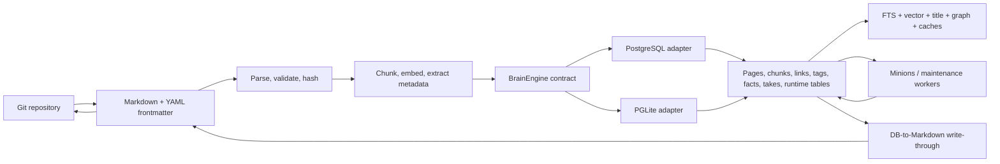
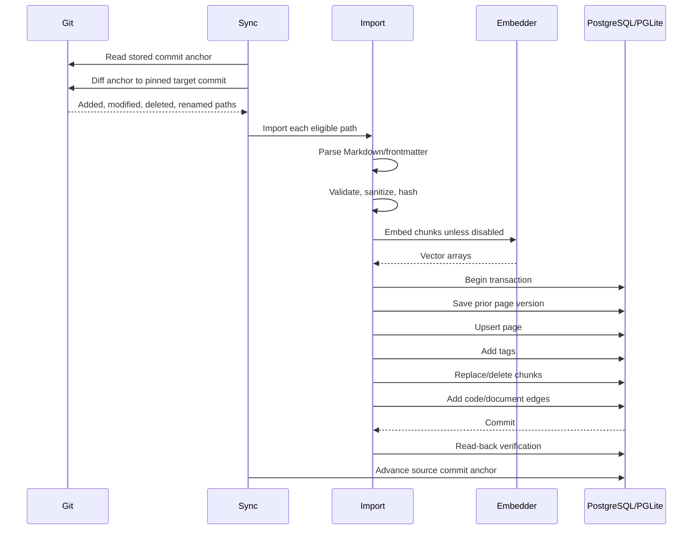
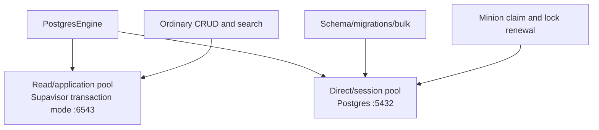
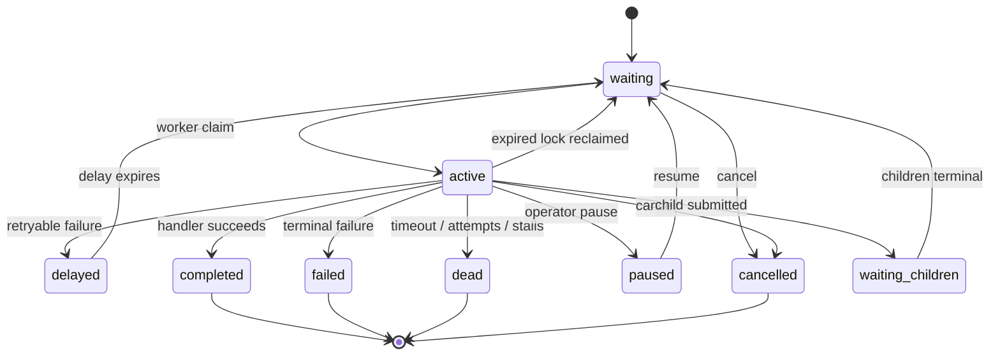
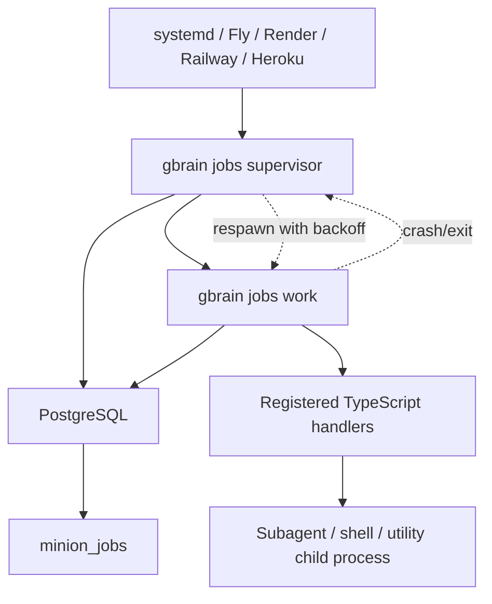

# PostgreSQL + PGLite deep dive

Analysis is based on the pinned local source copy at [gbrain](/Users/bardiasamiee/Documents/99.Github/gbrain). The earlier whole-project analysis remains at [GBRAIN-ARCHITECTURE-REPORT.md](/Users/bardiasamiee/Documents/99.Github/Rasm/GBRAIN-ARCHITECTURE-REPORT.md).

The shortest accurate answer is:

> gbrain has two data planes but one pipeline. Markdown/Git is the canonical knowledge plane; PostgreSQL or PGLite is the indexed operational plane. PostgreSQL and PGLite are alternative implementations of the same database contract—not two databases that normally run together.

A brain selects exactly one engine:

- `postgres`: external PostgreSQL, commonly Supabase.
- `pglite`: embedded PostgreSQL compiled to WebAssembly and stored locally.

It does not use SQLite. PGLite speaks PostgreSQL SQL and loads pgvector and `pg_trgm`, allowing most of the application to preserve PostgreSQL semantics in both modes.

The more precise description is:

> gbrain is an asymmetric, dual-plane architecture implemented as a unified reconciliation pipeline.

“Asymmetric” matters because Markdown and PostgreSQL do not have equal authority.

---

## 1. The fundamental model



There are two independent axes:

| Axis | Choice | Meaning |
|---|---|---|
| Knowledge representation | Markdown/Git + database index | Two representations with different authority |
| Database engine | PostgreSQL or PGLite | One active implementation of the same `BrainEngine` interface |

Therefore:

- Markdown versus database is not the same distinction as PostgreSQL versus PGLite.
- PostgreSQL and PGLite do not ordinarily feed one another.
- Markdown feeds whichever database engine is configured.
- Some database-backed mutations feed Markdown back through write-through and later reconciliation.
- `gbrain migrate` can explicitly copy one database engine into the other, but this is an engine migration operation, not continuous replication.

The engine choice is made in [engine-factory.ts](/Users/bardiasamiee/Documents/99.Github/gbrain/src/core/engine-factory.ts:8). Both engines implement the large interface in [engine.ts](/Users/bardiasamiee/Documents/99.Github/gbrain/src/core/engine.ts:659).

---

# 2. Is it dual paradigm or unified?

## Conceptually: unified

A single `BrainEngine` contract owns page CRUD, chunks, search, graph traversal, facts, takes, files, configuration, migrations, raw SQL, and runtime state. Callers normally receive a `BrainEngine`; they do not implement separate application workflows for PostgreSQL and PGLite.

The two implementations are:

- [postgres-engine.ts](/Users/bardiasamiee/Documents/99.Github/gbrain/src/core/postgres-engine.ts)
- [pglite-engine.ts](/Users/bardiasamiee/Documents/99.Github/gbrain/src/core/pglite-engine.ts)

They have deliberately parallel methods:

| Operation | PostgreSQL | PGLite |
|---|---:|---:|
| Connect | `PostgresEngine.connect()` | `PGLiteEngine.connect()` |
| Schema initialization | `initSchema()` | `initSchema()` |
| Transactions | `transaction()` | `transaction()` |
| Page upsert | `putPage()` | `putPage()` |
| Keyword search | `searchKeyword()` | `searchKeyword()` |
| Vector search | `searchVector()` | `searchVector()` |
| Chunk replacement | `upsertChunks()` | `upsertChunks()` |
| Raw SQL | `executeRaw()` | `executeRaw()` |
| Queue lock SQL | `executeRawDirect()` | same as ordinary raw SQL |

There is a substantial cross-engine parity suite in [engine-parity.test.ts](/Users/bardiasamiee/Documents/99.Github/gbrain/test/e2e/engine-parity.test.ts). I did not execute it; it is evidence of the intended contract.

## Operationally: dual-plane

Markdown/Git and the database are separate physical planes:

- Markdown is portable, mergeable, reviewable, and rebuildable.
- The database provides indexed retrieval, vectors, graphs, locks, queues, authentication state, telemetry, and caches.
- Some information is canonical in Markdown.
- Some information is derived from Markdown.
- Some runtime information exists only in the database.

That classification is explicitly documented in [system-of-record.md](/Users/bardiasamiee/Documents/99.Github/gbrain/docs/architecture/system-of-record.md).

## The important implementation tension

The documentation says:

> Markdown/Git is the system of record; PostgreSQL/PGLite is a derived cache.

That is the architectural contract, but the interactive mutation order is frequently:

1. Write the database.
2. Commit the database transaction.
3. Re-read the resulting database row.
4. Render that row to Markdown.
5. Atomically rename the Markdown file into place.
6. Optionally commit it to Git when repository durability hardening is installed.
7. Push may happen through a Git hook or explicit durability helper.

This is implemented in [write-through.ts](/Users/bardiasamiee/Documents/99.Github/gbrain/src/core/write-through.ts:82).

So the honest interpretation is:

- Long-term authority: Markdown/Git.
- Immediate online mutation sink: often the database.
- Filesystem projection: best-effort after the database commit.
- Reconciliation: the mechanism that restores agreement.
- Git durability: conditional unless the repository has been hardened.

The write-through helper itself states that the database row is the durable sink for that immediate operation, while the Markdown file is reconciled later if writing fails. This creates a temporary divergence window.

It is therefore not two unrelated paradigms. It is one reconciliation system with imperfect atomicity across database, filesystem, and Git. No distributed transaction spans all three.

---

# 3. How Markdown/Git feeds PostgreSQL or PGLite

## Incremental synchronization

The principal Git-facing path is [sync.ts](/Users/bardiasamiee/Documents/99.Github/gbrain/src/commands/sync.ts).

For a configured source, sync tracks a Git commit anchor:

- `sources.last_commit` for source-aware brains.
- Older/global configuration keys for legacy/default paths.
- `sources.local_path` identifies the working tree.
- `sources.newest_content_at` records the newest commit time at the last sync.

The high-level incremental flow is:



`sync` determines which files qualify, resolves paths to slugs, handles Git roots and scoped subdirectories, maintains failure/checkpoint state, and advances the commit anchor only when its failure gate permits it.

Core path classification and slug formation are in [core/sync.ts](/Users/bardiasamiee/Documents/99.Github/gbrain/src/core/sync.ts).

## Full synchronization

A full sync:

1. Walks the working tree.
2. Imports every eligible Markdown, code, or image file according to the selected strategy.
3. Reconciles missing file-backed pages.
4. Advances the source anchor only after the failure gate allows it.

Deletion reconciliation has explicit safety conditions. It considers a page removable only when:

- `source_path` is present, meaning it was file-backed.
- Its path belongs to the active sync strategy.
- The backing file is absent.
- The page belongs to the source being synchronized.
- Scoped sync boundaries are respected.
- A mass-delete safety valve does not detect a suspiciously large sweep.

Manual/MCP-created pages with no `source_path` are not swept merely because no matching file was found.

---

# 4. The Markdown import transaction

The central ingestion function is [importFromContent()](/Users/bardiasamiee/Documents/99.Github/gbrain/src/core/import-file.ts:231). Disk files enter through [importFromFile()](/Users/bardiasamiee/Documents/99.Github/gbrain/src/core/import-file.ts:1014), which delegates to the same content pipeline.

The pipeline is:

## 4.1 Parse

[markdown.ts](/Users/bardiasamiee/Documents/99.Github/gbrain/src/core/markdown.ts:100) parses:

- YAML frontmatter.
- Title.
- Page type.
- Tags.
- `compiled_truth`.
- Timeline section.
- Slug/type inference from path and active schema pack.

The parser is built around `gray-matter`, while Markdown tokenization for fenced code extraction uses `marked`.

## 4.2 Validate and classify

Before database persistence, the importer applies:

- A 5 MB payload bound.
- Slug validation.
- Trust-boundary handling for remote content.
- Guardrails.
- Content-sanity classification.
- Quarantine or content-flag frontmatter markers.
- Embedding suppression for quarantined or oversized material.
- Duplicate checks by content hash and optional external frontmatter identity.

## 4.3 Produce a stable content hash

The hash covers meaningful page state:

- Title.
- Type.
- Compiled truth.
- Timeline.
- Meaningful frontmatter.
- Tags.

Timestamp-like ingestion fields and gate-generated markers are removed from the hash so re-importing unchanged content does not cause continuous re-chunking and embedding.

An identical hash normally short-circuits the import.

## 4.4 Chunk

Markdown is divided into chunks by [chunkers/recursive.ts](/Users/bardiasamiee/Documents/99.Github/gbrain/src/core/chunkers/recursive.ts).

The importer creates chunks from:

- Compiled truth.
- Timeline text.
- Recognized fenced code blocks.

Fenced code is passed through language-aware code chunking. Actual source-code files use the Tree-sitter-backed code path.

Private facts and takes are removed from untrusted/search chunks by the fence/chunker layer, preventing private fence contents from entering embeddings.

## 4.5 Embed outside the transaction

Embedding is intentionally performed before opening the database transaction.

That avoids holding database locks or transaction-pool connections while waiting on an external model provider.

Vectors are then attached to `ChunkInput` records.

## 4.6 Commit one page transaction

The transaction in [import-file.ts](/Users/bardiasamiee/Documents/99.Github/gbrain/src/core/import-file.ts:770) performs:

1. `createVersion()` if an existing page is being changed.
2. `putPage()` using `(source_id, slug)` as the identity.
3. Contextual-retrieval provenance update.
4. Idempotent tag additions.
5. Chunk replacement or deletion.
6. Embedding provenance update.
7. Document-to-code edge creation when the Markdown cites source paths.

`putPage()` uses:

```sql
INSERT ... ON CONFLICT (source_id, slug) DO UPDATE
```

The PostgreSQL implementation is at [postgres-engine.ts](/Users/bardiasamiee/Documents/99.Github/gbrain/src/core/postgres-engine.ts:1066), and the PGLite implementation is at [pglite-engine.ts](/Users/bardiasamiee/Documents/99.Github/gbrain/src/core/pglite-engine.ts:1008).

After committing:

- Aliases are projected into `page_aliases`.
- The page is read back.
- Its hash is checked.
- The importer refuses to report success if the page is not immediately readable.

## 4.7 Tag caveat

Current tag synchronization is add-only.

A frontmatter tag appearing in Markdown is inserted into `tags`, but removing it from frontmatter does not necessarily delete it from the database. This is intentional because the table does not distinguish frontmatter tags from tags created by enrichment. Without provenance, destructive reconciliation would delete enrichment tags too.

This is one place where the “database is entirely rebuildable byte-for-byte from Markdown” statement is weaker than the idealized architecture document suggests.

---

# 5. How the database feeds Markdown and Git

Database-to-Markdown projection is centralized in [write-through.ts](/Users/bardiasamiee/Documents/99.Github/gbrain/src/core/write-through.ts).

It is called from at least:

- MCP/local `put_page` handling in [operations.ts](/Users/bardiasamiee/Documents/99.Github/gbrain/src/core/operations.ts:1023).
- Saved brainstorm output in [brainstorm.ts](/Users/bardiasamiee/Documents/99.Github/gbrain/src/commands/brainstorm.ts:376).
- Sync reconciliation in [sync.ts](/Users/bardiasamiee/Documents/99.Github/gbrain/src/commands/sync.ts:3777).

The helper:

1. Resolves the correct source working tree.
2. Refuses to write into another source’s repository.
3. Resolves the page file path.
4. Confines it to the source root.
5. Reads the database row and tags.
6. Serializes the row to Markdown.
7. Creates parent directories.
8. Writes a uniquely named temporary sibling.
9. Renames it atomically.
10. Optionally creates a Git commit if repository durability hardening is present.

Serialization is in [serializePageToMarkdown()](/Users/bardiasamiee/Documents/99.Github/gbrain/src/core/markdown.ts:705).

Git durability machinery is in [brain-repo-durability.ts](/Users/bardiasamiee/Documents/99.Github/gbrain/src/core/brain-repo-durability.ts). It can install:

- A local post-commit background push hook.
- A committed synchronous commit-and-push helper.
- Push retry/rebase handling.
- Audit logs.

The default write-through itself is best-effort. The hardened repository path improves this but still cannot create a single atomic transaction across PostgreSQL, the filesystem, Git’s object database, and a remote Git server.

---

# 6. What remains database-only

The database is not purely a throwaway search index. It also contains operational state with no Markdown equivalent.

Important database-only categories include:

- Minion jobs, locks, inboxes, attachments, retry state.
- Subagent messages and tool-execution ledgers.
- OAuth clients, codes, tokens, and bearer-token hashes.
- Request logs and spend records.
- Runtime configuration.
- Sync/checkpoint state.
- Evaluation captures and telemetry.
- Search caches.
- Dream verdict caches.
- Cycle locks.
- Rate and budget leases.
- Migration/version state.
- Raw ingestion sidecars.

Consequently, wiping the database and rebuilding from Git restores the knowledge corpus, chunks, and reconcilable semantic material, but not every piece of historical runtime/audit/queue state.

---

# 7. PostgreSQL versus PGLite

| Property | PostgreSQL | PGLite |
|---|---|---|
| Process model | Server with concurrent clients | Embedded WASM database inside the Bun process |
| Storage | External PostgreSQL/Supabase database | Local PGLite data directory |
| Default locator | `database_url` | `database_path` |
| Normal local path | N/A | `~/.gbrain/brain.pglite` |
| Query driver | `postgres` / postgres.js | `@electric-sql/pglite` |
| pgvector | Server extension | PGLite vector extension |
| Trigram search | `pg_trgm` server extension | PGLite `pg_trgm` extension |
| RLS | Supported; selectively enabled | Omitted |
| Multi-process access | Supported | Explicitly prohibited for the same data directory |
| Persistent worker daemon | Supported | Refused |
| Parallel sync engines | Supported | Clamped to serial |
| Long-lived remote service | Natural fit | Possible in one process, but blocks other local processes |
| DDL pool | Dedicated direct pool when useful | Single embedded connection |
| Queue claim/heartbeat pool | Direct session pool on Supabase topology | Same embedded connection |
| Engine migration | Can be target/source | Can be target/source |

PGLite is not a separate schema philosophy. It is a local PostgreSQL runtime with a few topology limitations.

The package dependency is pinned to `@electric-sql/pglite` `0.4.3` in [package.json](/Users/bardiasamiee/Documents/99.Github/gbrain/package.json:107).

---

# 8. Configuration and connection selection

Configuration is owned by [config.ts](/Users/bardiasamiee/Documents/99.Github/gbrain/src/core/config.ts).

The default configuration directory is:

```text
~/.gbrain/
```

The default configuration file is:

```text
~/.gbrain/config.json
```

`GBRAIN_HOME` can relocate the parent, while gbrain still appends `.gbrain`.

The engine configuration is deliberately small:

```ts
interface EngineConfig {
  database_url?: string;
  database_path?: string;
  engine?: 'postgres' | 'pglite';
}
```

Runtime database URL precedence includes:

1. `GBRAIN_DATABASE_URL`.
2. Deliberately exported `DATABASE_URL`.
3. Configuration file `database_url`.

There is a defensive rule against Bun automatically loading an unrelated project’s `.env` `DATABASE_URL`. gbrain re-parses local dotenv files and ignores a matching automatically loaded value so running gbrain inside another application does not accidentally initialize that application’s database.

---

# 9. PGLite provisioning

PGLite is genuinely provisioned by the application.

The path starts in [init.ts](/Users/bardiasamiee/Documents/99.Github/gbrain/src/commands/init.ts:874):

1. Choose the local path, normally `~/.gbrain/brain.pglite`.
2. Resolve embedding model and dimensions.
3. Configure the AI gateway before schema creation.
4. Check for a dimension mismatch against an existing database.
5. Construct `PGLiteEngine`.
6. Acquire the local PGLite file lock.
7. Call `PGlite.create()`.
8. Register the `vector` and `pg_trgm` PGLite extensions.
9. Run forward-reference bootstrap.
10. Execute the PGLite schema template.
11. Run migrations.
12. Save the engine and model configuration.

The relevant construction is in [pglite-engine.ts](/Users/bardiasamiee/Documents/99.Github/gbrain/src/core/pglite-engine.ts:285):

```ts
PGlite.create({
  dataDir,
  loadDataDir,
  extensions: { vector, pg_trgm },
})
```

## PGLite locking

[pglite-lock.ts](/Users/bardiasamiee/Documents/99.Github/gbrain/src/core/pglite-lock.ts) creates a lock directory beside the PGLite store using atomic `mkdir`.

It records:

- PID.
- Command/subcommand.
- Acquisition time.
- Refresh/heartbeat state.
- Ownership token.

A live PID is never reaped merely because its heartbeat appears stale. That protects against long synchronous PGLite/WASM work temporarily blocking the JavaScript event loop.

This has major operational consequences:

- `gbrain serve` and `gbrain sync` cannot independently open the same PGLite database.
- A long-running `serve` process must usually be stopped before a separate sync.
- A persistent multi-process worker supervisor is refused.
- Inline `--follow` job execution is supported because the temporary worker uses the already-open engine in the same process.

## PGLite recovery

[reinit-pglite.ts](/Users/bardiasamiee/Documents/99.Github/gbrain/src/commands/reinit-pglite.ts) provides the destructive recovery/model-dimension change path:

1. Rename the current data directory to `.bak`.
2. Re-run PGLite initialization.
3. Optionally rebuild from the Markdown/Git repository through sync.

This is especially important because changing pgvector column dimensions inside the embedded WASM environment is more constrained than performing an in-place PostgreSQL migration.

## PGLite snapshot

[build-pglite-snapshot.ts](/Users/bardiasamiee/Documents/99.Github/gbrain/scripts/build-pglite-snapshot.ts) creates a post-schema PGLite dump keyed by a hash of the schema and migrations.

This is primarily a test/bootstrap optimization. It is not the normal user persistence mechanism and is never authoritative.

---

# 10. PostgreSQL provisioning

gbrain does not provision a PostgreSQL server, Supabase project, networking, credentials, backups, or managed database infrastructure.

Its “PostgreSQL provisioning” means:

- Accept a connection URL for an existing server.
- Establish pools.
- Install required extensions when permissions allow.
- create tables/functions/triggers/indexes.
- run migrations.
- verify/heal schema columns.
- save the connection configuration.

The Supabase wizard in [init.ts](/Users/bardiasamiee/Documents/99.Github/gbrain/src/commands/init.ts:1368) detects the Supabase CLI and explains how to create a project, but it does not create one itself.

## PostgreSQL initialization sequence

[initPostgres()](/Users/bardiasamiee/Documents/99.Github/gbrain/src/commands/init.ts:1097) does the following:

1. Resolve and validate embedding dimensions.
2. Configure the AI gateway.
3. Warn if the supplied Supabase URL is a direct IPv6-only address.
4. Create `PostgresEngine`.
5. Connect.
6. Probe for the `vector` extension and attempt `CREATE EXTENSION`.
7. Reject an existing embedding-column dimension mismatch.
8. Call `engine.initSchema()`.
9. Save `engine: postgres` and `database_url` in configuration.

## PostgreSQL driver

[db.ts](/Users/bardiasamiee/Documents/99.Github/gbrain/src/core/db.ts:217) owns the module-level postgres.js connection.

The package is `postgres` 3.4.x, commonly called postgres.js.

Important connection behavior includes:

- Default pool size of 10.
- `GBRAIN_POOL_SIZE` override.
- 20-second idle timeout.
- 10-second connection timeout.
- Startup `statement_timeout`, defaulting to five minutes.
- Startup `idle_in_transaction_session_timeout`, defaulting to five minutes.
- Prepared statements disabled automatically for port `6543`, the Supabase transaction-pooler convention.
- `GBRAIN_PREPARE` and URL query parameters can override detection.
- Pool shutdown is wrapped in a hard bound so a wedged PgBouncer drain does not hang CLI teardown.

## The Supabase dual-pool topology

[connection-manager.ts](/Users/bardiasamiee/Documents/99.Github/gbrain/src/core/connection-manager.ts) manages two logical pools when the primary URL looks like a Supabase transaction pooler:



The read pool handles ordinary operations. The direct pool handles:

- Schema initialization.
- Long-running DDL.
- Bulk maintenance.
- Minion claim and heartbeat SQL.

The direct pool defaults to three connections and uses a longer DDL timeout plus increased `maintenance_work_mem`.

The manager can derive a direct URL from a Supabase pooler URL by:

- Extracting the project reference from the pooler username.
- Changing the hostname to `db.<project-ref>.supabase.co`.
- Changing the user to `postgres`.
- Changing the port to `5432`.

If the derived direct host is unreachable—common on networks without IPv6 support—it can fall back to the primary pooler. Operators can set:

- `GBRAIN_DIRECT_DATABASE_URL`
- `GBRAIN_DISABLE_DIRECT_POOL`
- `GBRAIN_DIRECT_POOL_SIZE`

This is one of the few places where “dual” is literal: a PostgreSQL deployment may have two connection pools. It still has one underlying database.

---

# 11. Extensions

The canonical PostgreSQL schema begins in [schema.sql](/Users/bardiasamiee/Documents/99.Github/gbrain/src/schema.sql:1):

```sql
CREATE EXTENSION IF NOT EXISTS vector;
CREATE EXTENSION IF NOT EXISTS pg_trgm;
CREATE EXTENSION IF NOT EXISTS pgcrypto;
```

## `vector`

Used for:

- Text embeddings.
- Image embeddings.
- Unified multimodal embeddings.
- Facts embeddings.
- Semantic query-cache keys.
- Cosine distance operators.
- HNSW indexes.

Migrations check pgvector versions before using features such as partial HNSW or `halfvec`.

[vector-index.ts](/Users/bardiasamiee/Documents/99.Github/gbrain/src/core/vector-index.ts) owns index policy, including dimension limits:

- HNSW `vector`: up to 2,000 dimensions.
- HNSW `halfvec`: up to 4,000 dimensions.

If a selected dimension exceeds the supported HNSW limit, exact vector scans remain possible while the incompatible index is omitted.

The same file detects and drops invalid “zombie” indexes left by failed concurrent PostgreSQL builds.

## `pg_trgm`

Used for:

- Fuzzy title matching.
- Slug/title resolution.
- GIN trigram index over page titles.
- PostgreSQL-like fuzzy behavior in PGLite.

## `pgcrypto`

Used mainly as a compatibility source for functions such as `gen_random_uuid()` on older PostgreSQL versions.

PGLite explicitly registers `vector` and `pg_trgm` in JavaScript. Its schema does not request `pgcrypto`; current PostgreSQL-compatible UUID functionality is handled without that explicit embedded extension.

---

# 12. Schema ownership and creation

## Canonical PostgreSQL schema

[src/schema.sql](/Users/bardiasamiee/Documents/99.Github/gbrain/src/schema.sql) is the canonical fresh-install PostgreSQL schema.

[scripts/build-schema.sh](/Users/bardiasamiee/Documents/99.Github/gbrain/scripts/build-schema.sh) embeds that file into [schema-embedded.ts](/Users/bardiasamiee/Documents/99.Github/gbrain/src/core/schema-embedded.ts) for compiled binaries.

At runtime, [getPostgresSchema()](/Users/bardiasamiee/Documents/99.Github/gbrain/src/core/postgres-engine.ts:77) substitutes:

- Configured embedding dimensions.
- Configured embedding model.
- Dimension-dependent vector index policy.

## PGLite schema

[pglite-schema.ts](/Users/bardiasamiee/Documents/99.Github/gbrain/src/core/pglite-schema.ts) carries a parallel schema template.

Its intended differences are:

- No PostgreSQL RLS block.
- No server-side role system.
- No PostgreSQL-only Minion `NOTIFY` trigger.
- No external connection/session assumptions.
- Same primary content, graph, vector, FTS, auth, HTTP-serving, and Minion table shapes where supported.

This file is manually mirrored rather than generated directly from `schema.sql`. A drift test exists to detect divergence.

## Schema initialization sequence

`PostgresEngine.initSchema()` performs:

1. Acquire PostgreSQL advisory lock `42`.
2. Apply forward-reference bootstrap for older schemas.
3. Execute the full fresh-install schema idempotently.
4. Run every pending versioned migration.
5. Verify expected columns.
6. Self-heal selected missing columns.
7. Sweep invalid HNSW indexes.
8. Release the advisory lock.

PGLite performs the same conceptual sequence without the server advisory lock because its process-level file lock already serializes access.

---

# 13. Migrations

All versioned migrations live in [migrate.ts](/Users/bardiasamiee/Documents/99.Github/gbrain/src/core/migrate.ts).

The snapshot inspected has `LATEST_VERSION = 125`.

There is no conventional `schema_migrations` table containing one row per migration. The authoritative migration watermark is:

```text
config['version']
```

The runner:

1. Reads `config.version`.
2. Sorts migrations by numeric version.
3. Selects versions greater than the current watermark.
4. Chooses common SQL or engine-specific SQL.
5. Executes DDL.
6. Executes an optional TypeScript handler.
7. Runs an optional postcondition verifier.
8. Writes the new version to `config`.
9. Continues.

Some migrations run in transactions. PostgreSQL migrations requiring `CREATE INDEX CONCURRENTLY` use `transaction: false` and a reserved backend connection.

The runner includes:

- Extended migration statement timeouts.
- Retry handling for statement timeouts and connection resets.
- Inspection of old `idle in transaction` connections.
- Invalid concurrent-index cleanup.
- Optional engine-specific SQL.
- Idempotence classification.
- Postcondition verification.
- Selected schema-drift repairs that execute even when the version watermark is current.

[apply-migrations.ts](/Users/bardiasamiee/Documents/99.Github/gbrain/src/commands/apply-migrations.ts) is the operator-facing orchestration command.

---

# 14. Table design

The fresh schema currently declares 42 tables. Migrations add further tables introduced after the baseline design, so the effective latest schema is larger.

The central design principle is:

```text
sources
  └── pages
       ├── content_chunks
       ├── tags
       ├── links
       ├── timeline_entries
       ├── page_versions
       ├── raw_data
       ├── files
       ├── facts / takes projections
       └── graph/code-edge projections
```

## 14.1 Source and content spine

### `sources`

Logical multi-repository tenancy.

Key fields:

- `id`: immutable source identity.
- `name`: display name.
- `local_path`: Git working tree root.
- `last_commit`: sync anchor.
- `last_sync_at`.
- `config JSONB`: federation and source configuration.
- archive/recovery fields.
- contextual-retrieval configuration.
- `newest_content_at`.

One PostgreSQL database can therefore host multiple logical source repositories.

### `pages`

Core content entity.

Identity is:

```text
(source_id, slug)
```

Important fields include:

- Type and `page_kind`.
- Title.
- `compiled_truth`.
- Timeline body.
- Frontmatter JSONB.
- Content hash.
- Soft-deletion timestamp.
- Effective date and salience fields.
- Retrieval/extraction watermarks.
- Contextual-retrieval provenance.
- Source path and ingestion provenance.
- Generation counters for cache invalidation.

`source_id` cascades from `sources`.

### `page_generation_clock`

Global mutation clock for query-cache invalidation.

A sequence-backed statement trigger advances the global clock on page insert, update, or delete. Individual pages also maintain per-page generations, giving the cache both a fast global “anything changed?” check and a more precise page snapshot check.

### `content_chunks`

The retrieval grain.

Important fields include:

- `page_id`.
- `chunk_index`.
- Canonical chunk text.
- Chunk source.
- Text embedding.
- Model and token metadata.
- Tree-sitter/code metadata.
- `TSVECTOR` search vector.
- Image embedding.
- Unified multimodal embedding.
- Contextual-retrieval and stale-state metadata.

A unique index enforces one chunk per `(page_id, chunk_index)`.

Indexes include:

- Page lookup.
- GIN full-text index.
- HNSW text vector.
- Partial image/vector indexes.
- Language/symbol indexes.
- Stale-embedding work indexes.

## 14.2 Graph and semantic structure

### `links`

Page-to-page graph edges:

- From page.
- To page.
- Label/type.
- Link provenance.
- Origin page.
- Origin section.

The engine exposes backlinks, paths, neighborhood traversal, and recursive graph queries.

### `code_edges_chunk`

Resolved code edge from one chunk to another chunk.

### `code_edges_symbol`

Unresolved edge whose target is still a qualified symbol name.

This split allows ingestion to record an unresolved reference immediately and resolve it later when the target source has been indexed.

### `tags`

Normalized page-tag relation, unique by page and tag.

### `timeline_entries`

Structured dated events, with an optional reference to an event-shaped page.

### `page_aliases` and `slug_aliases`

Migration-added lookup projections for alternate identifiers and normalized aliases.

## 14.3 Canonical-fence projections

### `facts`

Structured fact rows reconstructed from Markdown fact fences.

Typical concerns include:

- Source and entity/page identity.
- Claim text.
- Kind and visibility.
- Validity interval.
- Embedding.
- Provenance.
- Consolidation state.

### `takes`

Claims, beliefs, hunches, bets, and gradeable assertions reconstructed from Markdown take fences.

### `synthesis_evidence`

Evidence relationships from synthesis content to source take rows.

### `drift_decisions`, `take_proposals`, `take_grade_cache`, `take_nudge_log`

Operational/calibration projections built around takes.

These tables are not intended to replace the Markdown fence. Reconciliation phases parse the fence and rebuild the structured representation.

## 14.4 Files and raw data

### `files`

Metadata for file/image assets:

- Source.
- Relative path.
- Content hash.
- MIME type.
- Storage location.
- Optional page relation.

Binary data normally remains on disk or external storage; the database indexes metadata and paths.

### `file_migration_ledger`

Tracks file-storage migration work.

### `raw_data`

JSONB sidecars keyed to a page and source type.

## 14.5 Runtime configuration and checkpoints

- `config`
- `ingest_log`
- `op_checkpoints`
- `op_checkpoint_paths`
- `context_volunteer_events`
- `migration_impact_log`

## 14.6 Authentication and audit

- `access_tokens`
- `oauth_clients`
- `oauth_tokens`
- `oauth_codes`
- `mcp_request_log`
- `mcp_spend_log`
- `mcp_spend_reservations`

Secrets are not stored as plaintext bearer values where token hashing is expected.

## 14.7 Search and retrieval caches

Migration-added runtime tables include:

- `query_cache`
- `search_telemetry`
- `code_traversal_cache`
- `conversation_parser_llm_cache`
- contradiction/evaluation caches

These accelerate or observe retrieval but are not canonical knowledge.

## 14.8 Evaluation and calibration

- `eval_candidates`
- `eval_capture_failures`
- `eval_takes_quality_runs`
- `eval_contradictions_cache`
- `eval_contradictions_runs`
- `calibration_profiles`
- `think_ab_results`

## 14.9 Minion and subagent runtime

- `minion_jobs`
- `minion_inbox`
- `minion_attachments`
- `subagent_messages`
- `subagent_tool_executions`
- `subagent_rate_leases`
- budget and lease-pressure ledgers
- self-fix audit tables

---

# 15. Retrieval

## Direct reads

Both engines expose methods for:

- Get page by slug and source.
- List/filter pages.
- Get chunks.
- List tags.
- Get timeline entries.
- Read graph neighbors and paths.
- Read facts and takes.
- Read aliases.
- Read configuration.
- Read queue and runtime state.

Soft-deleted pages are excluded unless explicitly requested.

Source scoping is carried in SQL, normally as:

```sql
source_id = $1
```

or:

```sql
source_id = ANY($1::text[])
```

Federated reads pass arrays of allowed source IDs.

## Full-text search

Page and chunk full-text search use PostgreSQL `TSVECTOR`, GIN indexes, and `websearch_to_tsquery()`.

The important retrieval path is chunk-grain:

1. Search `content_chunks.search_vector`.
2. Join the owning page/source.
3. Rank with `ts_rank`.
4. Apply source-path boosts/exclusions.
5. Deduplicate to the best chunk per page for page-shaped callers.

Search language is configurable, and keyword SQL is shared conceptually across both engines.

## Vector search

Vector search:

1. Embeds the query.
2. Converts it to the vector-column representation.
3. Filters by source, type, language, time, visibility, and modality.
4. Uses cosine distance.
5. Preserves a pure distance ordering in the inner candidate query so PostgreSQL can use HNSW.
6. Applies source and metadata reranking outside the index-eligible inner query.

Multiple embedding columns can coexist:

- Default text embedding.
- Image embedding.
- Unified multimodal embedding.
- Additional registered embedding columns.

## Title search

Exact and fuzzy title search uses:

- Exact title/slug matching.
- `pg_trgm` similarity.
- Title GIN trigram index.
- Alias projection.

## Hybrid search

[hybrid.ts](/Users/bardiasamiee/Documents/99.Github/gbrain/src/core/search/hybrid.ts:826) orchestrates retrieval.

Its current pipeline is broader than simple keyword plus vector:

1. Keyword arm.
2. Title arm.
3. One or more vector arms.
4. Optional image/multimodal arm.
5. Relational/typed-edge recall arm.
6. Reciprocal Rank Fusion, with `K = 60`.
7. Normalization.
8. Compiled-truth boost.
9. Query-specific cosine re-score.
10. Exact-match/title boosts.
11. Backlink, salience, recency, and graph-signal stages.
12. Alias/evidence stamping.
13. Optional two-pass graph expansion.
14. Deduplication.
15. Reranking.
16. Token-budget enforcement.
17. Optional semantic query-cache write.
18. Search telemetry.

The old simplified formula still visible at the file top is:

```text
RRF score = Σ 1 / (60 + rank)
```

The practical result is that PostgreSQL is not merely storage. It is the principal retrieval execution engine.

---

# 16. Mutation and deletion semantics

## Page update

`putPage()` is an upsert. Existing content is replaced while selected provenance and effective-date fields are preserved when the caller omits them.

Updating meaningful content increments page generation, invalidating affected search caches.

## Version history

Before changing an existing page through import, the current content is copied into `page_versions`.

## Soft deletion

Public page deletion normally stamps:

```text
deleted_at = now()
```

Search and normal reads hide the page.

A later purge phase hard-deletes pages after the configured recovery window, documented as 72 hours in the current schema.

## Cascades

Hard deletion of a page cascades to dependent content such as:

- Chunks.
- Tags.
- Raw data.
- Versions.
- Relevant links.
- File/page references according to their FK action.

## Forgetting facts

Forgetting a fact is not primarily a database delete. The Markdown fact-fence row is rewritten with:

- Strikethrough.
- Validity end.
- A “forgotten” context.

The structured `facts` table is then reconstructed from the fence. That preserves audit history in Git.

---

# 17. Source isolation and RLS

Application-level source filters are the primary isolation mechanism.

The PostgreSQL schema conditionally enables RLS only when the current role is a superuser or inherits `BYPASSRLS`. It enables RLS on many tables without installing ordinary anonymous read policies, preventing accidental anon access.

There is an additional opt-in mechanism controlled by:

```text
GBRAIN_RLS_SCOPE_BINDING=1
```

When enabled, selected read methods begin a transaction and issue:

```sql
SELECT set_config('app.scopes', $1, true)
```

The application expects an operator-defined policy to read `current_setting('app.scopes', true)`.

Important limitations:

- gbrain does not install those source-filtering policies itself.
- Only read paths routed through the scoped helper receive this binding.
- Writes, migrations, administrative operations, and unwrapped reads use role defaults.
- Application SQL filters remain mandatory.
- PGLite has no equivalent role/RLS layer.

The implementation is in [postgres-engine.ts](/Users/bardiasamiee/Documents/99.Github/gbrain/src/core/postgres-engine.ts:169).

---

# 18. What is a Minion?

A Minion is a durable job stored in PostgreSQL, together with a TypeScript worker runtime that claims and executes it.

It is gbrain’s PostgreSQL-native replacement for a Redis/BullMQ-style queue.

The Minion system does not require Redis, RabbitMQ, Kafka, or a separate queue database. It uses the same PostgreSQL database as the brain.

The primary files are:

- [types.ts](/Users/bardiasamiee/Documents/99.Github/gbrain/src/core/minions/types.ts)
- [queue.ts](/Users/bardiasamiee/Documents/99.Github/gbrain/src/core/minions/queue.ts)
- [worker.ts](/Users/bardiasamiee/Documents/99.Github/gbrain/src/core/minions/worker.ts)
- [jobs.ts](/Users/bardiasamiee/Documents/99.Github/gbrain/src/commands/jobs.ts)
- [supervisor.ts](/Users/bardiasamiee/Documents/99.Github/gbrain/src/core/minions/supervisor.ts)

A Minion job contains:

- Name.
- Queue.
- Status.
- Priority.
- JSONB payload.
- Retry policy.
- Delay.
- Lock token and expiration.
- Attempt counters.
- Timeout.
- Parent/child relationship.
- Child failure policy.
- Progress.
- Result.
- Error and stack trace.
- Token usage.
- Idempotency key.
- Retention behavior.

---

# 19. Minion state machine



The actual schema status vocabulary includes:

- `waiting`
- `active`
- `completed`
- `failed`
- `delayed`
- `dead`
- `cancelled`
- `waiting-children`
- `paused`

---

# 20. Submission

[MinionQueue.add()](/Users/bardiasamiee/Documents/99.Github/gbrain/src/core/minions/queue.ts:77) wraps submission in a transaction.

It provides:

## Idempotency

A partial unique index enforces uniqueness for non-null `idempotency_key`.

If the same key is submitted again:

- A live existing job is returned.
- Dead/cancelled jobs release the key, permitting a fresh run.
- A concurrent insert race is handled with `ON CONFLICT ... DO NOTHING`, followed by a read of the winner.

## Backpressure

Named jobs may set `maxWaiting`.

Submission uses a transaction advisory lock derived from:

```text
job name + queue + source
```

It then counts waiting jobs and coalesces into an existing waiting job if the cap has been reached.

## Parent/child enforcement

When a child references a parent:

1. The parent row is locked `FOR UPDATE`.
2. Depth is checked.
3. Maximum children are checked.
4. The child is inserted.
5. The parent becomes `waiting-children`.

Parent/child relationships are therefore durable database relationships, not merely in-memory promises.

---

# 21. Claiming and locking

The central claim query is at [queue.ts](/Users/bardiasamiee/Documents/99.Github/gbrain/src/core/minions/queue.ts:654):

```sql
UPDATE minion_jobs
SET
  status = 'active',
  lock_token = $1,
  lock_until = now() + ...,
  ...
WHERE id = (
  SELECT id
  FROM minion_jobs
  WHERE queue = $3
    AND status = 'waiting'
    AND name = ANY($4)
  ORDER BY priority ASC, created_at ASC
  FOR UPDATE SKIP LOCKED
  LIMIT 1
)
RETURNING *
```

This gives multiple PostgreSQL workers safe concurrent claims:

- `FOR UPDATE` locks a candidate.
- `SKIP LOCKED` lets competing workers move to another candidate.
- The update and selection happen in one statement.
- Only registered handler names are claimable.
- Priority and creation time provide ordering.

A random worker-specific token fences every active job.

Every update that matters during execution includes:

```sql
WHERE id = $id
  AND status = 'active'
  AND lock_token = $token
```

If a job was reclaimed by another worker, an old worker cannot complete, fail, or mutate it using its stale token.

---

# 22. Lock renewal, stalls, retries, and completion

## Heartbeat

`renewLock()` extends `lock_until`, but only while the token still matches.

PostgreSQL/Supabase routes claim and renewal through `executeRawDirect()` so the transaction-mode pooler does not recycle the underlying session during a long job.

## Stalled jobs

The stall detector finds active jobs with expired locks using `FOR UPDATE SKIP LOCKED`.

It then atomically divides them into:

- Requeued jobs, with an incremented stall count.
- Dead jobs, when the maximum stall count is reached.

## Timeouts

A claimed job stamps an absolute `timeout_at`.

Timeout sweepers dead-letter jobs that remain active past this time. Workers also carry per-job `AbortController`s so cooperative handlers can stop promptly.

## Failure and retry

A retryable failure moves a job to `delayed` with backoff. The worker supports fixed or exponential backoff plus jitter.

Some infrastructure failures do not consume an attempt:

- Lock renewal failure.
- Lock loss.
- Rate-lease saturation.

These are treated as coordination/provider pressure rather than defects in the job payload.

## Completion

Completion is one database transaction:

1. Lock parent if present.
2. Token-fenced child update to `completed`.
3. Roll token counts into parent.
4. Insert a `child_done` inbox message.
5. Resolve `waiting-children` parent if no nonterminal children remain.
6. Optionally delete the completed child.

Failure performs the corresponding parent failure policy in the same transaction.

This avoids a process-crash window between child completion and parent resolution.

---

# 23. Worker process

[MinionWorker](/Users/bardiasamiee/Documents/99.Github/gbrain/src/core/minions/worker.ts) is a concurrent TypeScript/Bun promise-pool worker.

Each in-flight job gets:

- Independent lock token.
- Abort controller.
- Lock-renewal timer.
- Timeout timer.
- Progress callback.
- Token-usage callback.
- Logging callback.
- Inbox reader.
- “still active?” probe.
- Shutdown signal.

The main loop:

1. Promotes due delayed jobs.
2. Claims until the concurrency limit.
3. Enforces quiet hours.
4. Dispatches registered handlers.
5. Polls while idle.
6. Runs stall and timeout detection.
7. Runs database-liveness probes.
8. Monitors process RSS.
9. Drains in-flight jobs during shutdown.

The worker uses polling. Although PostgreSQL installs a `pg_notify('minion_jobs', ...)` trigger for status changes, arbitrary CLI followers and the normal worker loop do not consume a general LISTEN/NOTIFY stream. [wait-for-completion.ts](/Users/bardiasamiee/Documents/99.Github/gbrain/src/core/minions/wait-for-completion.ts) explicitly polls job state.

Therefore, “live” Minion behavior means:

- Durable rows are updated immediately.
- PostgreSQL emits notifications.
- Current application consumers primarily poll.
- Status/progress is visible across processes through the database.

---

# 24. Why persistent workers require PostgreSQL

`gbrain jobs work` explicitly refuses PGLite in [jobs.ts](/Users/bardiasamiee/Documents/99.Github/gbrain/src/commands/jobs.ts:904).

Reason:

- PGLite locks its data directory for one process.
- A persistent worker process would own that lock.
- CLI, MCP server, sync, and other workers would be unable to open the same database.

For PGLite, job submission with `--follow` can run a temporary in-process worker using the already-connected engine.

For PostgreSQL:

- Multiple workers can connect.
- `SKIP LOCKED` distributes work.
- Supervisor and worker can be separate processes.
- MCP, sync, workers, and search can coexist.

---

# 25. Supervisor and process topology

The production process arrangement is:



[supervisor.ts](/Users/bardiasamiee/Documents/99.Github/gbrain/src/core/minions/supervisor.ts) intentionally runs the worker in a child process so:

- A broken handler cannot take down the supervisor.
- A dead connection pool can be replaced by respawning the process.
- Memory watchdog exits can trigger a clean rebuild.
- Crash loops receive backoff.
- Deployment managers only need to keep the supervisor alive.

The supervisor has two singleton controls:

- A local PID file.
- A queue-scoped PostgreSQL TTL lock in `gbrain_cycle_locks`.

The database lock prevents two supervisors with different home directories or PID-file paths from silently managing the same queue.

[child-worker-supervisor.ts](/Users/bardiasamiee/Documents/99.Github/gbrain/src/core/minions/child-worker-supervisor.ts) owns child spawn, exit classification, restart, exponential backoff, and termination escalation.

Deployment examples are in:

- [minions-deployment.md](/Users/bardiasamiee/Documents/99.Github/gbrain/docs/guides/minions-deployment.md)
- [systemd.service](/Users/bardiasamiee/Documents/99.Github/gbrain/docs/guides/minions-deployment-snippets/systemd.service)
- [Procfile](/Users/bardiasamiee/Documents/99.Github/gbrain/docs/guides/minions-deployment-snippets/Procfile)
- [fly.toml.partial](/Users/bardiasamiee/Documents/99.Github/gbrain/docs/guides/minions-deployment-snippets/fly.toml.partial)

---

# 26. What jobs run?

Built-in handler registration is in [jobs.ts](/Users/bardiasamiee/Documents/99.Github/gbrain/src/commands/jobs.ts:1365).

Important job families include:

- `sync`
- `import`
- `embed`
- `embed-backfill`
- `extract`
- `extract_facts`
- `extract-takes-from-pages`
- `backlinks`
- `lint`
- `lint-fix`
- `integrity-auto`
- `sync-retry-failed`
- `autopilot-cycle`
- `synthesize`
- `patterns`
- `consolidate`
- conversation fact extraction
- atom extraction/drain
- contextual reindex
- enrichment
- subagent
- optional shell execution

Gateway-backed handlers refresh database-backed model configuration before running so a long-lived worker does not retain stale AI-provider settings indefinitely.

Custom job handlers can be loaded through [plugin-loader.ts](/Users/bardiasamiee/Documents/99.Github/gbrain/src/core/minions/plugin-loader.ts).

---

# 27. Autopilot and cycle relationship

[cycle.ts](/Users/bardiasamiee/Documents/99.Github/gbrain/src/core/cycle.ts) is the shared maintenance primitive.

It is used by:

- One-shot `gbrain dream`.
- Long-running `gbrain autopilot`.
- The Minion `autopilot-cycle` handler.

Current cycle phases include:

- Lint/fix.
- Backlink repair.
- Sync.
- Synthesis.
- Link/timeline extraction.
- Fact-fence reconciliation.
- Atom extraction.
- Symbol-edge resolution.
- Pattern synthesis.
- Concept synthesis.
- Emotional-weight recomputation.
- Fact consolidation.
- Take proposal/grading/calibration.
- Drift analysis.
- Conversation-fact backfill.
- Thin-page enrichment.
- Skill optimization.
- Embedding.
- Orphan reporting.
- Schema suggestion.
- Purging expired soft-deleted content.

Cycle coordination uses:

- PostgreSQL TTL rows in `gbrain_cycle_locks`.
- A filesystem lock for PGLite or filesystem-only runs.

The cycle deliberately writes filesystem content before sync where appropriate, then sync imports those changes into the database.

That is another concrete expression of the unified pipeline:

```text
filesystem repair/synthesis
    → sync
    → database extraction
    → embeddings/search state
    → reports or further Markdown artifacts
    → later sync
```

---

# 28. External libraries and languages

## Languages

- TypeScript: application, engine adapters, workers, migration handlers, sync, search.
- SQL/PostgreSQL PL/pgSQL: schema, triggers, functions, queue operations, retrieval queries.
- Bash: schema embedding and deployment/durability helpers.
- YAML/TOML: deployment and schema-pack configuration.
- Markdown/YAML frontmatter: canonical user knowledge representation.

Runtime is Bun.

## Core database dependencies

From [package.json](/Users/bardiasamiee/Documents/99.Github/gbrain/package.json):

- `postgres`: PostgreSQL client/pool.
- `@electric-sql/pglite`: embedded PostgreSQL WASM.
- `@electric-sql/pglite/vector`: embedded pgvector.
- `@electric-sql/pglite/contrib/pg_trgm`: embedded trigram extension.
- `pgvector`: pgvector JavaScript helpers/types.

## Content/index dependencies

- `gray-matter`: frontmatter parsing.
- `marked`: Markdown lexer, including fenced-code discovery.
- `web-tree-sitter`
- `tree-sitter-wasms`
- AI-provider SDKs/gateway abstractions for embeddings, reranking, synthesis, extraction, and subagents.
- AWS S3 client for optional storage paths.
- MCP SDK for remote serving.

No Redis queue library is involved in Minions.

---

# 29. PostgreSQL/PGLite file map

## Engine contract and configuration

| File | Purpose |
|---|---|
| [engine.ts](/Users/bardiasamiee/Documents/99.Github/gbrain/src/core/engine.ts) | Full engine interface: lifecycle, CRUD, search, graph, facts, takes, raw SQL |
| [types.ts](/Users/bardiasamiee/Documents/99.Github/gbrain/src/core/types.ts) | Engine configuration, page/search/result types |
| [engine-factory.ts](/Users/bardiasamiee/Documents/99.Github/gbrain/src/core/engine-factory.ts) | Selects PostgreSQL or PGLite |
| [config.ts](/Users/bardiasamiee/Documents/99.Github/gbrain/src/core/config.ts) | Config file/env precedence and active gbrain home |
| [engine-constants.ts](/Users/bardiasamiee/Documents/99.Github/gbrain/src/core/engine-constants.ts) | Shared database-operation constants |

## PostgreSQL engine

| File | Purpose |
|---|---|
| [postgres-engine.ts](/Users/bardiasamiee/Documents/99.Github/gbrain/src/core/postgres-engine.ts) | PostgreSQL implementation of the complete engine contract |
| [db.ts](/Users/bardiasamiee/Documents/99.Github/gbrain/src/core/db.ts) | Module-level postgres.js pool, connection options, teardown, transaction helper |
| [connection-manager.ts](/Users/bardiasamiee/Documents/99.Github/gbrain/src/core/connection-manager.ts) | Read/direct pool routing and Supabase URL derivation |
| [supabase-admin.ts](/Users/bardiasamiee/Documents/99.Github/gbrain/src/core/supabase-admin.ts) | Supabase project/pooler discovery helpers |
| [storage/supabase.ts](/Users/bardiasamiee/Documents/99.Github/gbrain/src/core/storage/supabase.ts) | Optional Supabase-backed object-storage path |

## PGLite engine

| File | Purpose |
|---|---|
| [pglite-engine.ts](/Users/bardiasamiee/Documents/99.Github/gbrain/src/core/pglite-engine.ts) | Embedded implementation of the engine contract |
| [pglite-schema.ts](/Users/bardiasamiee/Documents/99.Github/gbrain/src/core/pglite-schema.ts) | PGLite-adapted schema |
| [pglite-lock.ts](/Users/bardiasamiee/Documents/99.Github/gbrain/src/core/pglite-lock.ts) | Cross-process exclusion for the PGLite data directory |
| [build-pglite-snapshot.ts](/Users/bardiasamiee/Documents/99.Github/gbrain/scripts/build-pglite-snapshot.ts) | Test/bootstrap snapshot generator |

## Schema and migrations

| File | Purpose |
|---|---|
| [schema.sql](/Users/bardiasamiee/Documents/99.Github/gbrain/src/schema.sql) | Canonical PostgreSQL fresh-install schema |
| [schema-embedded.ts](/Users/bardiasamiee/Documents/99.Github/gbrain/src/core/schema-embedded.ts) | Generated embedded schema constant |
| [build-schema.sh](/Users/bardiasamiee/Documents/99.Github/gbrain/scripts/build-schema.sh) | Generates the embedded schema |
| [migrate.ts](/Users/bardiasamiee/Documents/99.Github/gbrain/src/core/migrate.ts) | Versioned migrations and migration runner |
| [schema-verify.ts](/Users/bardiasamiee/Documents/99.Github/gbrain/src/core/schema-verify.ts) | Post-migration schema verification/self-healing |
| [vector-index.ts](/Users/bardiasamiee/Documents/99.Github/gbrain/src/core/vector-index.ts) | HNSW policy, limits, and invalid-index cleanup |
| [sql-query.ts](/Users/bardiasamiee/Documents/99.Github/gbrain/src/core/sql-query.ts) | Parameterized raw/JSONB SQL helpers |

## Initialization and engine migration

| File | Purpose |
|---|---|
| [init.ts](/Users/bardiasamiee/Documents/99.Github/gbrain/src/commands/init.ts) | PGLite/PostgreSQL initialization |
| [apply-migrations.ts](/Users/bardiasamiee/Documents/99.Github/gbrain/src/commands/apply-migrations.ts) | Operator migration workflow |
| [migrate-engine.ts](/Users/bardiasamiee/Documents/99.Github/gbrain/src/commands/migrate-engine.ts) | Copies sources, pages, chunks, tags, timeline, and raw data between engines |
| [reinit-pglite.ts](/Users/bardiasamiee/Documents/99.Github/gbrain/src/commands/reinit-pglite.ts) | Backup, rebuild, and resync PGLite |

## Markdown/Git/database reconciliation

| File | Purpose |
|---|---|
| [markdown.ts](/Users/bardiasamiee/Documents/99.Github/gbrain/src/core/markdown.ts) | Markdown parse/serialize and file-path resolution |
| [import-file.ts](/Users/bardiasamiee/Documents/99.Github/gbrain/src/core/import-file.ts) | Parse, hash, chunk, embed, transactional persistence |
| [core/sync.ts](/Users/bardiasamiee/Documents/99.Github/gbrain/src/core/sync.ts) | Path classification and slug mapping |
| [commands/sync.ts](/Users/bardiasamiee/Documents/99.Github/gbrain/src/commands/sync.ts) | Git diff, checkpoints, import orchestration, deletion reconciliation |
| [write-through.ts](/Users/bardiasamiee/Documents/99.Github/gbrain/src/core/write-through.ts) | Database-to-Markdown atomic projection |
| [brain-repo-durability.ts](/Users/bardiasamiee/Documents/99.Github/gbrain/src/core/brain-repo-durability.ts) | Git commit/push durability hardening |
| [operations.ts](/Users/bardiasamiee/Documents/99.Github/gbrain/src/core/operations.ts) | MCP/local operation layer and write-through call sites |

## Retrieval

| File | Purpose |
|---|---|
| [search/hybrid.ts](/Users/bardiasamiee/Documents/99.Github/gbrain/src/core/search/hybrid.ts) | Hybrid orchestration and RRF |
| [search/query-cache.ts](/Users/bardiasamiee/Documents/99.Github/gbrain/src/core/search/query-cache.ts) | Semantic query cache |
| [search/relational-recall.ts](/Users/bardiasamiee/Documents/99.Github/gbrain/src/core/search/relational-recall.ts) | Typed-edge recall arm |
| [search/two-pass.ts](/Users/bardiasamiee/Documents/99.Github/gbrain/src/core/search/two-pass.ts) | Graph expansion and chunk hydration |
| [search/sql-ranking.ts](/Users/bardiasamiee/Documents/99.Github/gbrain/src/core/search/sql-ranking.ts) | Shared ranking/filter SQL construction |
| [embedding.ts](/Users/bardiasamiee/Documents/99.Github/gbrain/src/core/embedding.ts) | Query/document embeddings |

## Minions and process control

| File | Purpose |
|---|---|
| [minions/types.ts](/Users/bardiasamiee/Documents/99.Github/gbrain/src/core/minions/types.ts) | Job, handler, queue, worker types |
| [minions/queue.ts](/Users/bardiasamiee/Documents/99.Github/gbrain/src/core/minions/queue.ts) | Durable queue SQL and state transitions |
| [minions/worker.ts](/Users/bardiasamiee/Documents/99.Github/gbrain/src/core/minions/worker.ts) | Concurrent claim/dispatch/heartbeat runtime |
| [minions/supervisor.ts](/Users/bardiasamiee/Documents/99.Github/gbrain/src/core/minions/supervisor.ts) | Long-lived worker supervisor |
| [minions/child-worker-supervisor.ts](/Users/bardiasamiee/Documents/99.Github/gbrain/src/core/minions/child-worker-supervisor.ts) | Child spawn/restart/backoff |
| [minions/lock-renewal-tick.ts](/Users/bardiasamiee/Documents/99.Github/gbrain/src/core/minions/lock-renewal-tick.ts) | Bounded lock-renewal state machine |
| [minions/rate-leases.ts](/Users/bardiasamiee/Documents/99.Github/gbrain/src/core/minions/rate-leases.ts) | Provider concurrency leases |
| [minions/budget-tracker.ts](/Users/bardiasamiee/Documents/99.Github/gbrain/src/core/minions/budget-tracker.ts) | Parent/child spending reservations |
| [minions/attachments.ts](/Users/bardiasamiee/Documents/99.Github/gbrain/src/core/minions/attachments.ts) | Job attachment handling |
| [minions/wait-for-completion.ts](/Users/bardiasamiee/Documents/99.Github/gbrain/src/core/minions/wait-for-completion.ts) | Poll-until-terminal helper |
| [commands/jobs.ts](/Users/bardiasamiee/Documents/99.Github/gbrain/src/commands/jobs.ts) | Queue/worker/supervisor CLI and built-in handler registration |
| [cycle.ts](/Users/bardiasamiee/Documents/99.Github/gbrain/src/core/cycle.ts) | Shared maintenance cycle |
| [autopilot.ts](/Users/bardiasamiee/Documents/99.Github/gbrain/src/commands/autopilot.ts) | Scheduled durable maintenance daemon |
| [autopilot-fanout.ts](/Users/bardiasamiee/Documents/99.Github/gbrain/src/commands/autopilot-fanout.ts) | Per-source cycle job fan-out |

## Coordination and pressure control

| File | Purpose |
|---|---|
| [db-lock.ts](/Users/bardiasamiee/Documents/99.Github/gbrain/src/core/db-lock.ts) | PostgreSQL TTL locks for cycles/supervisors/sync |
| [db-pacer.ts](/Users/bardiasamiee/Documents/99.Github/gbrain/src/core/db-pacer.ts) | Cooperative PostgreSQL write pacing |
| [worker-pool.ts](/Users/bardiasamiee/Documents/99.Github/gbrain/src/core/worker-pool.ts) | Bounded in-process concurrency |
| [retry.ts](/Users/bardiasamiee/Documents/99.Github/gbrain/src/core/retry.ts) | Retry/backoff infrastructure |
| [connection-audit.ts](/Users/bardiasamiee/Documents/99.Github/gbrain/src/core/connection-audit.ts) | Connection pool event auditing |

## PostgreSQL test infrastructure

| File | Purpose |
|---|---|
| [docker-compose.test.yml](/Users/bardiasamiee/Documents/99.Github/gbrain/docker-compose.test.yml) | Single pgvector PostgreSQL test server |
| [docker-compose.ci.yml](/Users/bardiasamiee/Documents/99.Github/gbrain/docker-compose.ci.yml) | Sharded PostgreSQL CI plus transaction-mode PgBouncer |
| [postgres-bootstrap.test.ts](/Users/bardiasamiee/Documents/99.Github/gbrain/test/e2e/postgres-bootstrap.test.ts) | PostgreSQL forward-bootstrap evidence |
| [fresh-install-pglite.test.ts](/Users/bardiasamiee/Documents/99.Github/gbrain/test/e2e/fresh-install-pglite.test.ts) | Fresh PGLite initialization evidence |
| [engine-parity.test.ts](/Users/bardiasamiee/Documents/99.Github/gbrain/test/e2e/engine-parity.test.ts) | Cross-engine behavior parity |
| [postgres-engine-rls-scope.test.ts](/Users/bardiasamiee/Documents/99.Github/gbrain/test/postgres-engine-rls-scope.test.ts) | Opt-in source-scope binding |
| [migrate-extensions.test.ts](/Users/bardiasamiee/Documents/99.Github/gbrain/test/migrate-extensions.test.ts) | Extension/migration behavior |
| [pglite-workers-clamp.test.ts](/Users/bardiasamiee/Documents/99.Github/gbrain/test/pglite-workers-clamp.test.ts) | PGLite serial-worker constraint |

---

# 30. Final architectural judgment

gbrain’s PostgreSQL/PGLite design is coherent around one idea:

> Git stores durable human-readable knowledge; PostgreSQL semantics turn that knowledge into a live searchable, relational, vectorized, and executable system.

PostgreSQL and PGLite are unified at the application layer:

- Same engine contract.
- Nearly identical schemas.
- Same migrations.
- Same SQL-oriented table model.
- Same retrieval abstractions.
- Same Minion queue data model.
- Explicit parity coverage.

Markdown and the database are unified through reconciliation rather than shared transactions:

- Git changes feed sync.
- Sync feeds the importer.
- The importer feeds pages, chunks, vectors, tags, and graph edges.
- Reconcilers feed facts/takes/timeline/link projections.
- Search and workers consume those projections.
- Interactive database mutations can render back to Markdown.
- Git then distributes the canonical artifacts to other machines.
- Another machine rebuilds its own PostgreSQL/PGLite index from the repository.

The system’s principal operational distinction is not SQL compatibility; both engines are PostgreSQL-oriented. It is process topology:

- PGLite is a strong local, embedded, single-process brain.
- PostgreSQL is the concurrent, remotely served, multi-worker brain.
- Minions, supervisors, parallel synchronization, and production automation are structurally PostgreSQL-first.
- Git remains the cross-machine knowledge replication mechanism in either mode.
