# [RASM]

Rasm is a polyglot monorepo with macOS-first development and portable code and tooling for Linux and Windows.

## [01]-[LAYOUT]

```text
Rasm/
├── apps/                     # One product per directory
├── libs/                     # Packages, one directory per language
├── tests/                    # Shared test support per language and suites outside libs/
├── eng/                      # Engineering projects per language, outside `Workspace.slnx` and the task graph
│   └── dotnet/               # Catalog project referencing every central package row
├── infra/                    # Pulumi program declaring repository resources
├── tools/
│   ├── ast-grep/             # Outlines and rules per language
│   └── nx/                   # Nx plugin adding a project per manifest to the task graph
├── mise.toml                 # Tool binaries and process environment
├── global.json               # .NET SDK version
├── nx.json                   # Task graph
├── package.json              # Development dependencies and root Nx targets
├── pnpm-workspace.yaml       # TypeScript workspace globs and dependency catalog
├── pyproject.toml            # Python dependency groups and tool tables
├── Directory.Packages.props  # .NET central package versions
├── Directory.Build.props     # .NET build defaults and project classification by tree position
├── Directory.Build.targets   # .NET items, host package references, and policy targets
├── NuGet.config              # NuGet source and package folder
├── Workspace.slnx            # .NET solution
├── tsconfig.base.json        # Compiler options every TypeScript project extends
├── tsconfig.json             # Root TypeScript project over files outside every package
├── vitest.config.ts          # Vitest configuration each project config imports
├── biome.json                # TypeScript and JSON formatting and lint
├── sgconfig.yml              # ast-grep rule directories and language parsing
├── .editorconfig             # Editor settings and .NET analyzer severity
├── .yamllint.yaml, .yamlfmt  # YAML lint and format
├── .github/                  # Continuous integration and repository automation
├── .claude/                  # Agent harness knowledge and settings
├── .mcp.json                 # Agent harness MCP servers
├── CLAUDE.md                 # Agent standards, AGENTS.md is its symlink
└── README.md
```

## [02]-[FLOW]

```mermaid
flowchart LR
    subgraph toolchain ["Toolchain"]
        direction TB
        mise_tools["mise.toml [tools], global.json"] --> binaries["Tool binaries"]
        mise_env["mise.toml [env]"] --> processes["Every process"]
        xcode["xcode-select"] --> apple_tools["Xcode toolchain and macOS SDK"]
    end

    subgraph dependencies ["Dependencies"]
        direction TB
        catalog_ts["pnpm-workspace.yaml catalog"] --> lock_ts["pnpm-lock.yaml"]
        catalog_py["pyproject.toml groups"] --> lock_py["uv.lock, .venv/bin on PATH"]
        catalog_net["Directory.Packages.props"] --> restore["rasm:restore"]
        catalog_net --> catalog_project["eng/dotnet/Rasm.Catalog"] --> upgrade["rasm:upgrade"]
    end

    subgraph taskgraph ["Task graph"]
        direction TB
        plugins["nx.json plugins"] --> projects["Project per manifest: language and host tags, empty targets"]
        target_defaults["nx.json targetDefaults by tag:language:*"] --> bodies["Target body per language"]
        root_nx["package.json nx"] --> root_targets["Root targets rasm:*"]
    end

    subgraph commands ["Commands"]
        direction TB
        lint["nx run rasm:lint"] --> checkers["Every portable checker, one process each over the tree"]
        format_tree["nx run rasm:format"] --> writers["Every portable writer, then dotnet format"]
        check_all["nx run-many -t check"] --> project_check["Build, typecheck, or test per project"]
        check_affected["nx affected -t check"] --> project_check
        ci["ci.yml"] --> setup["setup action"] --> ci_steps["rasm:check, affected check per host runner, format with git diff --exit-code"]
    end

    toolchain --> dependencies --> taskgraph --> commands
```



## [03]-[TASKS]

- Targets call one tool, arguments on the command, configuration in the tool's own file
- `nx run rasm:check` runs lint and root typecheck
- `nx run <project>:<target>` runs one target of one project
- `nx run rasm:upgrade` moves every catalog and tool binary to its newest release, `--configuration <language>` one catalog, `tools` the binaries
- `nx run rasm:rewrite -- --filter='^<id>$' <path>` applies one rule's fix across a path
- `nx run rasm:outline -- <path>` lists a path's declarations, `--items` selects local, exported, imported, or all items, `--view` the depth
- Workspace plugin names each project's tags and empty targets by manifest, `@nx/dotnet` and `@nx/vitest` infer their own
- Root targets hold operations with no owning project
- Inputs name the files a tool reads and its version as `runtime`, outputs name the files it writes
- Caches and outputs sit under `.cache/` and `.artifacts/`, each tool relocated through its own setting

## [04]-[OWNERS]

| [INDEX] | [CONCERN]                      | [OWNER]                                                                               |
| :-----: | :----------------------------- | :------------------------------------------------------------------------------------ |
|  [01]   | Tool binary                    | `mise.toml` `[tools]` at `latest`, prereleases included                               |
|  [02]   | Process variable               | `mise.toml` `[env]`                                                                   |
|  [03]   | SDK version                    | `global.json` for .NET, `xcode-select` for Swift                                      |
|  [04]   | Package version                | `pnpm-workspace.yaml` catalog, `pyproject.toml` group, `Directory.Packages.props` row |
|  [05]   | .NET tool package              | `dotnet dnx <id>` on the command                                                      |
|  [06]   | Task graph                     | `nx.json`, root `package.json` `nx`                                                   |
|  [07]   | Checker configuration          | Tool's own file, `pyproject.toml` `[tool.*]` for every Python tool                    |
|  [08]   | Secret                         | Doppler, read through `doppler run` around the command                                |
|  [09]   | Resource or repository setting | Typed row of the program under `infra/`, applied by `nx run rasm:up`                  |
|  [10]   | Tool no target runs            | Machine profile                                                                       |

- Package rows and `.editorconfig` rows hold a one-line purpose comment, every other file holds section dividers alone
- Tool rows name a release candidate where `latest` resolves a development build
- Facts sit once in their owning file, other files name the owner
- Mini configs, wrappers, and aliases beside an owner are corrected at the owner

## [05]-[QUALITY]

- .NET: Roslyn analyzers at `latest-all`, warnings as errors, code style enforced in build
- Python: `ruff`, `ty`, and `mypy` at zero findings
- TypeScript: `biome check` at zero findings, `tsc --build` under strict options
- Swift: warnings as errors and upcoming features, `swift-format lint --strict` at zero findings
- Tree: `yamllint`, `actionlint`, and ast-grep rule families
- Writers: `dotnet format`, `ruff format`, Biome, yamlfmt, `swift-format` per Xcode project
- Failing checks are fixed in the code or the rule, severity stays as configured

## [06]-[HARNESS]

- `.claude/settings.json` holds allow list, one entry per tool or server, and `mise env` hooks
- `.mcp.json` runs each stdio server under `mise exec`
- `function-hooks` plugin policies refuse destructive git commands, shell waits, written files run in one call, hand timing, and second config files
- Skills hold knowledge of one subject, agents hold one role with its procedure and gate, memory holds facts no file covers
- `nx run rasm:browsers` installs the Chromium build the Playwright commands launch

## [07]-[STRUCTURE]

- Every `libs/` package is independently consumable, references siblings through declared dependencies, and points down an acyclic graph
- `RhinoHost` tokens add the `RhinoCommon` and `Grasshopper2` packages, the bundle serves launch alone
- Manifests define projects, no `project.json`: `.csproj` in `Workspace.slnx`, `package.json` beside `tsconfig.json`, `pyproject.toml`, `.xcodeproj`
- `.xcodeproj` basenames name the Nx project, its scheme, and its product
- Project files sit at the project root, with no `src/` directory at any depth and no directory adding a level of nesting alone
- Each language area builds and runs without another present
- Python and TypeScript files declare their exports at the end
- Changes replace structure in place, one commit holds change and removal, new structure keeps its predecessor's name
- Packages, namespaces, routes, contracts, and directories carry no version suffix or `v1` folder
- Schema libraries apply the delta from owning types to the live database, with no migration file or history table
