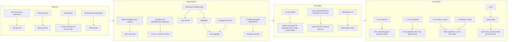

# [RASM]

Rasm is a polyglot monorepo with macOS-first development and portable code and tooling for Linux and Windows.

## [01]-[LAYOUT]

```text
Rasm/
├── apps/                     # One directory per app or group of related apps
├── libs/                     # Packages, one directory per language
│   ├── dotnet/
│   ├── python/
│   └── typescript/
├── tests/                    # Shared test support per language and suites outside libs/
├── eng/
│   ├── dotnet/
│   ├── python/
│   └── typescript/
├── infra/                    # Pulumi program declaring repository resources
├── tools/
│   ├── ast-grep/             # Outlines, rules, and utilities per language
│   ├── bridge/               # Streamable HTTP bridge every stdio MCP server's launchd agent runs through
│   ├── interface/            # Desktop application interfaces, one directory per application
│   └── nx/                   # Nx plugin inferring a project from each project file
├── plugins/                  # Agent harness marketplace, one directory per plugin
├── mise.toml                 # Tool binaries and process environment
├── global.json               # .NET SDK versions
├── nx.json                   # Task graph
├── package.json              # Catalog rows except tool plugins, root Nx targets
├── pnpm-workspace.yaml       # TypeScript workspace globs and dependency catalog
├── pyproject.toml            # Python wheel project, dependency groups, and tool tables
├── Directory.Packages.props  # .NET central package versions
├── Directory.Build.props     # .NET build defaults and project classification by tree position
├── Directory.Build.targets   # .NET items, host package references, and build targets
├── NuGet.config              # NuGet source and package folder
├── Workspace.slnx            # .NET solution
├── Xcode.xcconfig            # Build settings every Xcode project inherits at project level
├── tsconfig.base.json        # Compiler options every TypeScript project extends
├── tsconfig.json             # Root TypeScript project over files outside every package
├── vitest.config.ts          # Test and coverage options every project config imports
├── vite.config.ts            # Bundling options every UXP build target runs from its project directory
├── biome.json                # TypeScript and JSON formatting and lint
├── pmd.xml                   # Java lint rules
├── sgconfig.yml              # ast-grep rule directories and language parsing
├── .editorconfig             # Editor settings and .NET analyzer severity
├── .swift-format             # Swift lint and format rules
├── .swiftlint.yml            # Swift lint rules swift-format lacks
├── .lldbinit                 # LLDB MCP server start every Xcode scheme's Run loads
├── .yamllint.yaml, .yamlfmt  # YAML lint and format
├── .github/                  # Continuous integration and repository workflows
├── .claude/                  # Agent harness knowledge and settings
├── .mcp.json                 # Agent harness MCP servers
├── .codex/                   # Codex harness knowledge and settings
├── CLAUDE.md                 # Agent standards, AGENTS.md is its symlink
└── README.md
```

## [02]-[FLOW]


```mermaid
flowchart LR
    subgraph toolchain ["Toolchain"]
        direction TB
        mise_tools["mise.toml [tools], global.json"] --> binaries["Tool binaries"]
        mise_env["mise.toml [env]"] --> processes["Every process"]
        xcode["xcode-select"] --> apple_tools["Xcode toolchain and macOS SDK"]
        brew["Homebrew formula ghidra"] --> ghidra_tool["Ghidra install"]
    end

    subgraph dependencies ["Dependencies"]
        direction TB
        catalog_ts["pnpm-workspace.yaml catalog"] --> lock_ts["pnpm-lock.yaml"]
        catalog_py["pyproject.toml dependencies and groups"] --> lock_py["uv.lock, .venv/bin on PATH"]
        catalog_net["Directory.Packages.props"] --> restore["rasm:restore"]
        catalog_net --> eng_net["eng/dotnet"] --> upgrade["rasm:upgrade"]
        packages["packages.toml rows"] --> upgrade
        catalog_swift[".xcodeproj package requirements"] --> lock_swift["Package.resolved"]
    end

    subgraph taskgraph ["Task graph"]
        direction TB
        plugins["nx.json plugins"] --> projects["Project per project file: language and host tags, empty targets"]
        target_defaults["nx.json targetDefaults by language and host tag"] --> bodies["Target body per language and host"]
        root_nx["package.json nx"] --> root_targets["Root targets rasm:*"]
    end

    subgraph commands ["Commands"]
        direction TB
        lint["nx run rasm:lint"] --> checkers["One cached target per portable checker"]
        format_tree["nx run rasm:format"] --> writers["Every portable writer, then dotnet format"]
        check_all["nx run-many -t check"] --> project_check["Build, typecheck, or test per project"]
        check_affected["nx affected -t check"] --> project_check
        ci["ci.yml"] --> setup["setup action"] --> ci_steps["rasm:check, affected check per host runner"]
    end

    toolchain --> dependencies --> taskgraph --> commands
```

## [03]-[TASKS]

- Targets call one tool, arguments on the command, configuration in the tool's own file
- `nx run rasm:check` runs every `lint:<checker>` and `typecheck:<checker>` root target, `nx run rasm:lint:<checker>` one checker
- `nx run <project>:<target>` runs one target of one project
- `nx run <project>:build -- <switch>` forwards MSBuild switches to a .NET build beside the target's `-bl`
- `--skip-nx-cache` runs a build in place of an Nx cache replay
- `nx run <project>:install` installs built products, packing Rhino and Blender projects first
- `nx run <project>:pack` builds a Rhino Yak package or one Blender extension ZIP under `.artifacts/<host>/<project>/`
- `nx run rasm:upgrade` moves catalogs, Swift package locks, tool binaries, and application packages to their newest builds
- `mise exec -- node eng/typescript/cleanup/main.ts` removes disposable files and orphaned tool processes outside the task graph
- `nx run rasm:rewrite -- --filter='^<id>$' <path>` applies one rule's fix across a path
- `nx run rasm:outline -- <path>` lists a path's declarations, `--items` selects local, exported, imported, or all items, `--view` the depth
- `nx run rasm:interface` applies each `tools/interface/<app>/apply.py`, `-- <app>` one, and prints every outcome as one JSON document
- Workspace plugin names each project's tags and empty targets by project file and Python edges by import, `@nx/dotnet` and `@nx/vitest` infer theirs
- Project `vite.config.ts` infers `build`, run from that project, and its `serve` configuration runs the Vite development server
- Tools one host supplies join a project's target, root targets hold commands no project owns
- Inputs name the files a tool reads and its version as `runtime`, outputs name the files it writes
- Caches and outputs sit under root `.cache/` and `.artifacts/`, each tool relocated through one setting every run reads, or its skill states why not

## [04]-[OWNERS]

| [INDEX] | [CONCERN]                      | [OWNER]                                                                                              |
| :-----: | :----------------------------- | :--------------------------------------------------------------------------------------------------- |
|  [01]   | Tool binary                    | `mise.toml` `[tools]` at `latest`, prereleases included                                              |
|  [02]   | Process variable               | `mise.toml` `[env]`                                                                                  |
|  [03]   | SDK version                    | `global.json` for .NET, `xcode-select` for Swift                                                     |
|  [04]   | Package version                | `pnpm-workspace.yaml` catalog, `pyproject.toml` `[project]` or group, `Directory.Packages.props` row |
|  [05]   | .NET tool package              | `dotnet dnx <id>` on the command                                                                     |
|  [06]   | Task graph                     | `nx.json`, root `package.json` `nx`                                                                  |
|  [07]   | Checker configuration          | Tool's own file, `pyproject.toml` `[tool.*]` for every Python tool                                   |
|  [08]   | Secret                         | Doppler, `mise.toml` `[env]` `exec` row for every process, `doppler run` around one command          |
|  [09]   | Resource or repository setting | Typed row of the program under `infra/`, applied by `nx run rasm:infra:up`                           |
|  [10]   | Tool with no consumer          | Machine setup                                                                                        |
|  [11]   | Application package            | `packages.toml` row beside the script installing it                                                  |
|  [12]   | Ghidra install                 | Homebrew formula `ghidra`, path named in `mise.toml` `[env]`                                         |
|  [13]   | Xcode build setting            | `Xcode.xcconfig`, per-product rows in the `.xcodeproj` target                                        |
|  [14]   | Swift package version          | `.xcodeproj` package requirement                                                                     |
|  [15]   | Agent harness plugin           | `plugins/<name>`                                                                                     |
|  [16]   | Local MCP service              | `mise.toml` launchd agent row, applied by `mise bootstrap macos launchd-agents apply`                |
|  [17]   | MCP tool a skill replaces      | `--hide <tool>` on server's `mise.toml` launchd agent row                                            |

- Tool rows name a release where `latest` resolves a development build
- Tool consumers are targets, MCP rows, skills, `.gitattributes` filters, and CLAUDE.md `[CLI_TOOLING]` rows
- Facts sit once in their owning file, other files name the owner
- Mini configs, wrappers, and aliases beside an owner are corrected at the owner

## [05]-[QUALITY]

- .NET: `dotnet build` and `dotnet format style --verify-no-changes` at zero findings
- Python: `ruff`, `ty`, and `mypy` at zero findings
- TypeScript: `biome check` at zero findings, `tsc --build` under strict options
- Swift: warnings as errors, strict memory safety, every supported upcoming feature, `swift-format lint --strict` and `swiftlint lint` at zero findings
- Java: `google-java-format --aosp` and `pmd check` at zero findings
- Checker decisions: PMD `AvoidAccessibilityAlteration` skips `use-ghidra` `Headers.run`, Ghidra's `PreProcessor` takes a `DefineTable` through package-private field `defs` alone
- Tree: `yamllint`, `yamlfmt -lint`, `actionlint` with `shellcheck` over workflow run steps, and ast-grep rule families
- Writers: `dotnet format`, `ruff format`, Biome, yamlfmt, `google-java-format`, `swiftlint lint --fix` then `swift-format` per Xcode project
- Checks run through Nx targets alone, each target with every command, dependency, and path the target declares
- .NET targets write `.artifacts/dotnet/binlog/<purpose>-{}.binlog` for the `binlog` MCP to read a failed or slow run
- Failing checks are fixed in the code or the rule, severity stays as configured

## [06]-[STRUCTURE]

- `eng/<language>/` owns engineering workflows over repository projects and artifacts
- `tools/` provides capabilities for development tools and applications
- Apps group by product under `apps/<product>/`, with a `<host>/` folder per host application
- Libraries group by language under `libs/<language>/`, with host-bound packages under a `<host>/` folder
- Build and task graph read a project's host from the `<host>/` folder on its path
- `libs/` packages point down an acyclic graph, each .NET and TypeScript package consumable alone through declared dependencies
- Python packages import siblings absolutely and build into the one `rasm` wheel
- Projects under a `rhino` folder compile against `RhinoCommon`, `RhinoHost` token `grasshopper` adds `Grasshopper2`
- Installed Rhino supplies host assemblies at runtime, build output holds none
- Project files define projects, never `project.json`
- Project files are `.csproj`, `package.json` with `tsconfig.json`, `pyproject.toml`, `py.typed`, `blender_manifest.toml`, and `.xcodeproj`
- `Workspace.slnx` lists every project `.csproj`
- `.xcodeproj` basenames name the Nx project, its scheme, and its product
- Projects hold no `src/` directory and no folder with one file, folders group by domain per language
- Changes replace structure in place, one commit holds change and removal, new structure keeps its predecessor's name
- Packages, namespaces, routes, contracts, and directories carry no version suffix or `v1` folder
- Schema libraries apply the delta from owning types to the live database, with no migration file or history table
- Displays, documents, and defaults show imperial units, domain values hold SI quantities converted at the boundary
