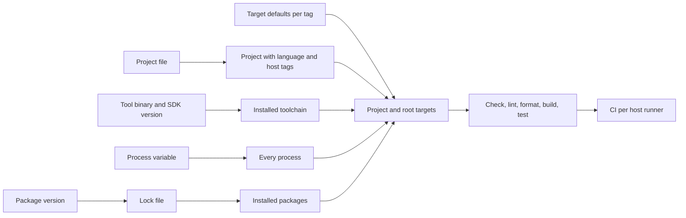

# [RASM]

Rasm is a polyglot monorepo with macOS-first development and portable code and tooling for Linux and Windows.

## [01]-[LAYOUT]

```text
Rasm/
├── apps/                     # Products, one directory per host
│   ├── blender/
│   ├── creative-cloud/
│   ├── macos/
│   ├── rhino/
│   └── web/
├── libs/                     # Packages, one directory per language
│   ├── dotnet/
│   ├── python/
│   ├── rust/
│   ├── swift/
│   └── typescript/
├── tests/                    # Shared test support per language and suites outside libs/
├── eng/
│   ├── dotnet/
│   ├── python/
│   └── typescript/
├── infra/                    # Pulumi program declaring repository resources
├── docs/                     # Research sheets, ignored under docs/research
├── tools/
│   ├── ast-grep/             # Outlines, rules, and utilities per language
│   ├── bridge/               # rasm-mcp-bridge binary serving a stdio MCP server over Streamable HTTP
│   ├── dylint/               # Rust lints reading types and resolved paths Clippy lacks
│   ├── nx/                   # Nx plugin inferring a project from each project file
│   └── refurb/               # Python checks reading mypy types Ruff lacks
├── plugins/                  # Agent harness marketplace, one directory per plugin
├── mise.toml                 # Tool binaries and process environment
├── global.json               # .NET SDK versions
├── nx.json                   # Task graph
├── package.json              # Catalog rows except tool plugins, root Nx targets
├── pnpm-workspace.yaml       # TypeScript workspace globs and dependency catalog
├── pyproject.toml            # Python wheel project, dependency groups, and tool tables
├── Directory.Packages.props  # .NET central package versions
├── Directory.Build.props     # .NET build defaults and project classification by tree position
├── Directory.Build.targets   # .NET items, host package references, and build targets
├── Directory.Build.rsp       # MSBuild switches every command-line build under the root reads
├── Workspace.slnx            # .NET solution
├── NuGet.config              # NuGet source
├── Xcode.xcconfig            # Build settings every Xcode project inherits at project level
├── tsconfig.base.json        # Compiler options every TypeScript project extends
├── tsconfig.json             # Root TypeScript project over files outside every package
├── vitest.config.ts          # Test and coverage options every project config imports
├── vite.config.ts            # Bundling options every project config imports
├── biome.json                # TypeScript and JSON formatting and lint
├── pmd.xml                   # Java lint rules
├── sgconfig.yml              # ast-grep rule directories and language parsing
├── rust-toolchain.toml       # Rust toolchain channel and components
├── rustfmt.toml              # Rust format rules
├── clippy.toml               # Clippy lint options Cargo.toml lint tables lack
├── Cargo.toml                # Rust workspace and dependency catalog
├── .editorconfig             # Editor settings and .NET analyzer severity
├── .gitattributes            # Line endings, diff drivers, and LFS filters per extension
├── .gitignore                # Generated, secret, and machine-local paths
├── .swift-format             # Swift lint and format rules
├── .swiftlint.yml            # Swift lint rules swift-format lacks
├── .lldbinit                 # LLDB MCP server start every Xcode scheme's Run loads
├── .yamllint.yaml, .yamlfmt  # YAML lint and format
├── .cargo/                   # Build settings every Cargo command reads
├── .config/                  # Configuration of tools that search .config/
├── .playwright/              # Playwright CLI workspace and browser options every CLI session reads
├── .github/                  # Continuous integration and repository workflows
├── .claude/                  # Claude Code knowledge and settings
├── .mcp.json                 # Claude Code MCP servers
├── .codex/                   # Codex knowledge and settings
├── .vscode/                  # VS Code settings and recommended extensions
├── CLAUDE.md                 # Agent standards, AGENTS.md is its symlink
└── README.md
```

## [02]-[FLOW]


```mermaid
flowchart LR
    tools["Tool binary and SDK version"] --> toolchain["Installed toolchain"]
    variables["Process variable"] --> processes["Every process"]
    packages["Package version"] --> locks["Lock file"] --> installed["Installed packages"]
    project_files["Project file"] --> projects["Project with language and host tags"]
    defaults["Target defaults per tag"] --> targets["Project and root targets"]
    projects --> targets
    toolchain & processes & installed --> targets
    targets --> checks["Check, lint, format, build, test"]
    checks --> ci["CI per host runner"]
```

## [03]-[TASKS]

- Targets call one tool with its arguments on the command
- `nx run rasm:check` runs every `lint:<tool>` and `typecheck:<tool>` root target, `nx run rasm:lint:<tool>` one checker
- `nx run rasm:<target> -- <paths>` runs a root target over named paths when its tool takes paths in place of a default file set
- `nx run <project>:<target>` runs one target of one project
- `nx run <project>:build -- <switch>` forwards MSBuild switches to a .NET build
- `nx run <project>:install` builds or packs a project, then installs its product into its host
- `nx run <project>:pack` writes a project's product as the package its host installs
- `nx run rasm:upgrade` moves catalogs, locks, the Rust toolchain, and tool binaries to newest builds, then restarts every launchd agent onto them
- `nx run rasm:clean` removes declared outputs and tool residue, prunes unused installations and caches, and recovers stale macOS processes
- `nx run rasm:rewrite -- --filter='^<id>$' <path>` applies one rule's fix across a path
- `nx run rasm:outline -- <path>` lists a path's declarations
- Workspace plugin derives project edges from project files and Python imports
- `@nx/dotnet` infers .NET targets and project reference edges
- File-based app directories are one project each, named by path, `build`, `format`, and `lint` run one `<target>:<file>` target per entry file
- `nx run rasm:format` runs every app's `format` and `nx run rasm:lint:dotnet-format` every app's `lint`
- `nx run rasm:format:files -- <paths>` runs each portable writer over the named paths it formats
- Project `vite.config.ts` infers `build` and continuous `serve` for the Vite development server, both run from that project
- Project `uxp.config.ts` configures inferred Vite `build` and infers `install` into each host the manifest names
- Project `cloudflare.config.ts` adds the Cloudflare Build Output under `.cloudflare/output` to inferred Vite `build` outputs
- Tools one host supplies join a project's target, root targets hold commands no project owns
- Inputs name the files a tool reads and its version as `runtime`, outputs name the files it writes
- Caches and outputs sit under root `.cache/` and `.artifacts/`, each tool relocated through one setting every run reads, or its guidance file states why not
- Caches shared with projects outside the repository sit where Parametric Forge or the tool's default puts them
- Logs sit flat in `.artifacts/logs/` as one `<producer>.log` per launchd label or tool name, each moved there through its producer's setting

## [04]-[OWNERS]

| [INDEX] | [CONCERN]                      | [OWNER]                                                                                              |
| :-----: | :----------------------------- | :--------------------------------------------------------------------------------------------------- |
|  [01]   | Tool binary                    | `mise.toml` `[tools]` at `latest`                                                                    |
|  [02]   | Process variable               | `mise.toml` `[env]`                                                                                  |
|  [03]   | SDK version                    | `global.json` for .NET, `xcode-select` for Swift, `rust-toolchain.toml` for Rust                     |
|  [04]   | Package version                | `pnpm-workspace.yaml` catalog, `pyproject.toml` `[project]` or group, `Directory.Packages.props` row |
|  [05]   | .NET tool package              | `dotnet dnx <id>` on the command                                                                     |
|  [06]   | Task graph                     | `nx.json`, root `package.json` `nx`                                                                  |
|  [07]   | Checker configuration          | Tool's own file, `pyproject.toml` `[tool.*]` for every Python tool                                   |
|  [08]   | Secret                         | Doppler, through consuming commands with `doppler run`                                               |
|  [09]   | Resource or repository setting | Typed row of the program under `infra/`, applied by `nx run rasm:infra:up`                           |
|  [10]   | Tool with no consumer          | Machine setup                                                                                        |
|  [11]   | Ghidra install                 | Homebrew formula `ghidra`, path named in `mise.toml` `[env]`                                         |
|  [12]   | Xcode build setting            | `Xcode.xcconfig`, per-product rows in the `.xcodeproj` target                                        |
|  [13]   | Swift package version          | `.xcodeproj` or `Package.swift` package requirement                                                  |
|  [14]   | Rust package version           | `Cargo.toml` `[workspace.dependencies]` row                                                          |
|  [15]   | Agent harness plugin           | `plugins/<name>`                                                                                     |
|  [16]   | Local MCP service              | `mise.toml` launchd agent row, applied by `mise bootstrap macos launchd-agents apply`                |
|  [17]   | Python runtime version         | `mise.toml` `python` row, nested `pyproject.toml` `requires-python` in a host folder for its host    |
|  [18]   | Native library an sdist links  | `mise.toml` `conda:` row, its series keyed in the package's `[tool.uv.extra-build-variables]` row    |

- Tool rows name a release where `latest` resolves a development build

## [05]-[QUALITY]

- Failing checks are fixed in the code or the rule, severity stays as configured
- .NET: compiler, analyzers, BuildCheck, and `dotnet format` at zero findings
- Python: Ruff, ty, mypy, refurb, and deptry at zero findings
- TypeScript: Biome and `tsc` with `@effect/tsgo` at zero findings
- Rust: Clippy, rustfmt, Dylint, and cargo-modules at zero findings
- Swift: compiler, swift-format, and SwiftLint at zero findings
- Java: google-java-format and PMD at zero findings
- TOML: Tombi at zero findings
- Tree: yamllint, yamlfmt, actionlint with ShellCheck over workflow run steps, ast-grep rule families, and PMD CPD at zero findings

## [06]-[STRUCTURE]

- `eng/<language>/` owns engineering workflows over repository projects and artifacts
- `tools/` provides capabilities for development tools and applications
- Apps group by host under `apps/<host>/`, with one folder per product holding its sources and assets
- Product assets sit in the folder their build reads: `Assets/` for .NET, `Resources/` for Xcode, `icons/` for Blender, `public/` for Vite
- Libraries group under `libs/<language>/<group>/` by domain or by host
- Rust library crates sit at `libs/rust/<domain>/`
- Swift libraries are one local package per group at `libs/swift/<group>/`
- TypeScript libraries are packages at `libs/typescript/<group>/<package>/`
- Host groups hold every project built against the host's API
- Task graph takes the host list from `apps/<host>/` folders and tags a project by the host name in its path
- .NET build takes Rhino hosts from the `rhino/` path folder
- Python packages build into one `rasm` wheel
- First-party Python imports use `from <import root>.<module> import <member>` for private Blender extension relocation
- `Grasshopper2` package references add Grasshopper 2 global usings
- Installed Rhino supplies host assemblies at runtime, build output holds none
- Project files are the language manifests and markers Nx plugins read, never `project.json`
- `Workspace.slnx` lists every project `.csproj`
- Projects hold no `src/` directory and no folder with one file, folders group by domain per language
- Schema libraries apply the delta from owning types to the live database, with no migration file or history table
