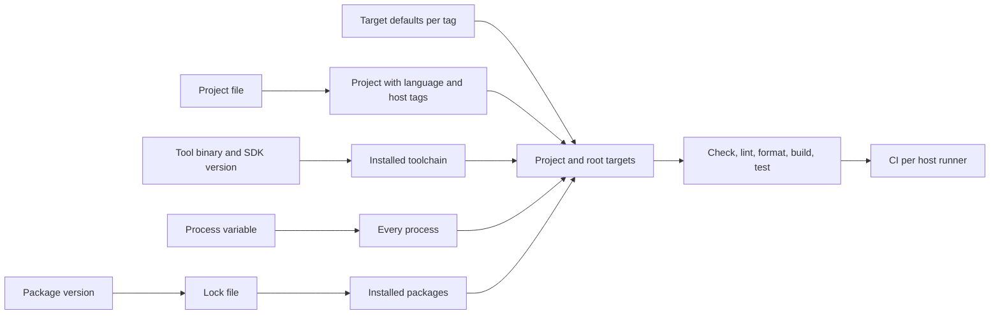

# [RASM]

Rasm is a polyglot monorepo with macOS-first development and portable code and tooling for Linux and Windows.

## [01]-[LAYOUT]

```text
Rasm/
├── apps/
│   ├── blender/
│   ├── creative-cloud/
│   ├── macos/
│   ├── rhino/
│   └── web/
├── libs/
│   ├── dotnet/
│   ├── python/
│   ├── rust/
│   ├── swift/
│   └── typescript/
├── assets/                   # Reusable assets no one app or plugin owns, each app or plugin keeps its own assets in its folder
├── tests/
├── eng/
├── infra/                    # IaC programs for repository and app hosting resources
├── docs/                     # Research sheets, ignored under docs/research
├── tools/
│   ├── ast-grep/             # Per-language support ast-grep lacks for reading repository code and enforcing syntax-level standards
│   ├── bridge/               # rasm-mcp-bridge binary serving a stdio MCP server over Streamable HTTP
│   ├── dylint/               # Rust lints reading types and resolved paths Clippy lacks
│   ├── foundry/              # CLI over the typography library, a declared font set reconciled, built, shaped, verified, published
│   ├── nx/                   # Nx plugin inferring a project from each project file
│   ├── refurb/               # Python checks reading mypy types Ruff lacks
│   ├── roslyn/               # C# analyzers, code fixes, and BannedSymbols*.txt bans
│   └── watch-apps/           # CLI for agents observing and driving desktop apps in the background
├── plugins/                  # Agent harness marketplace
├── mise.toml                 # Tool binaries, process environment, and local daemons
├── mise.lock                 # Tool versions, URLs, and digests per platform
├── mise.ci.toml              # Tool rows no CI job calls
├── .mise/                    # Native lockfiles for Python tools
├── nx.json                   # Task graph
├── package.json              # Packages root programs use
├── pnpm-workspace.yaml       # TypeScript workspace globs and dependency catalog
├── tsconfig.base.json        # Compiler options every TypeScript project extends
├── tsconfig.json             # Root TypeScript project over files outside every package
├── vitest.config.ts          # Test and coverage options every project config imports
├── vite.shared.ts            # Bundling options every project config imports
├── biome.json                # TypeScript and JSON formatting and lint
├── pyproject.toml            # Python environment, dependency groups, and checker settings
├── global.json               # .NET SDK versions
├── Workspace.slnx            # .NET solution
├── Directory.Packages.props  # .NET central package versions
├── Directory.Build.props     # .NET build defaults and project classification by tree position
├── Directory.Build.targets   # .NET items, host package references, and build targets
├── Directory.Build.rsp       # MSBuild switches every command-line build under the root reads
├── Directory.Solution.props  # Solution restore settings
├── NuGet.config              # NuGet source
├── Package.swift             # Swift modules, executables, and remote package catalog
├── Xcode.xcconfig            # Build settings every Xcode project inherits
├── sgconfig.yml              # ast-grep rule directories and language parsing
├── Cargo.toml                # Rust workspace and dependency catalog
├── clippy.toml               # Clippy lint options Cargo.toml lint tables lack
├── rust-toolchain.toml       # Rust toolchain channel and components
├── rustfmt.toml              # Rust format rules
├── .editorconfig             # Editor settings and .NET formatting options
├── .gitattributes            # Line endings, diff drivers, and LFS filters per extension
├── .gitignore                # Generated, secret, and machine-local paths
├── .shellcheckrc             # ShellCheck checks off where an ast-grep rule owns the form
├── .swift-format             # Swift lint and format rules
├── .swiftlint.yml            # Swift lint rules swift-format lacks
├── .cargo/                   # Cargo build settings and compiler source link
├── .config/                  # Files tools find in .config/ or read through a path setting
├── .playwright/              # Playwright CLI workspace and browser options every CLI session reads
├── .github/                  # Continuous integration and repository workflows
├── .claude/                  # Claude Code knowledge and settings
├── .mcp.json                 # Claude Code MCP servers
├── .codex/                   # Codex knowledge and settings
├── .vscode/                  # VS Code settings and recommended extensions
├── CLAUDE.md                 # Agent standards, AGENTS.md is its symlink
└── README.md
```

## [02]-[FLOW]


```mermaid
flowchart LR
    tools["Tool binary and SDK version"] --> toolchain["Installed toolchain"]
    variables["Process variable"] --> processes["Every process"]
    packages["Package version"] --> locks["Lock file"] --> installed["Installed packages"]
    project_files["Project file"] --> projects["Project with language and host tags"]
    defaults["Target defaults per tag"] --> targets["Project and root targets"]
    projects --> targets
    toolchain & processes & installed --> targets
    targets --> checks["Check, lint, format, build, test"]
    checks --> ci["CI per host runner"]
```

## [03]-[TASKS]

Targets run tools with their arguments on the command, a pipeline or command list joins tools for work no single tool does.

Before starting Claude Code or Codex:
1. Run `mise install`, `pnpm install --frozen-lockfile`, and `pixi run --locked uv sync --locked`
2. Run `nx run grammars:grammar` to build parsers direct `ast-grep` commands load
3. On macOS, run `mise daemons register`, `mise bootstrap macos launchd-agents apply`, then `nx run rasm-mcp-bridge:install`
4. For Codex, install `argus@rasm` and `playwright@rasm` with `codex plugin add`

- `nx run rasm:check` runs every root checker and type checker, `nx run rasm:lint:<tool>` runs one checker
- `nx run <project>:check` runs project checks and tests `rasm:check` leaves to each project
- `nx run <project>:<target> -- <arguments>` appends to the command, paths in place of a root tool's default file set, switches to `dotnet build`
- `nx:run-commands` targets use `--args='<shell fragment>'` for literal shell characters; the value replaces configured argument defaults
- `nx run rasm:format` runs `nx sync`, `dotnet format` over the solution and file-based apps, then `hk fix --all`
- `nx run rasm:format:files -- <paths>` runs `hk fix` over named paths, or modified files with no path
- `nx run <project>:test:integration` runs cases `test` leaves out: Vitest and Rust `#[ignore]` after `rasm:docker`, Swift `<Module>IntegrationTests`
- `nx run <project>:install` builds or packs a product and installs it into its host
- `nx run rasm:release` on a clean tree tags and creates a GitHub release for each product Conventional Commits bump, then runs its `publish`
- `nx run <project>:publish --tag=<tag>` pushes a released product to its host's channel
- `git submodule update --init --checkout assets` fills `assets/` for font builds and publishing
- With `assets/` checked out, `nx run rasm:fonts:<build|check>` runs `foundry` over `assets/fonts/rasm.toml` into `.artifacts/fonts/<set>`, a check failing on each finding
- `nx run rasm:fonts:publish --destination=<folder> [<name>]` copies faces passing that check into a folder
- `nx run rasm:infra:<preview|up|refresh>` runs a Pulumi operation on repository resources
- `nx run <project>:hosting -- <cloudflare|docker> <preview|up|refresh|destroy> [--disposable] [--tag <tag>]` builds a web app and runs a Pulumi operation on its stack
- `nx run rasm:upgrade` moves tool binaries, catalogs, locks, and action tags to newest releases
- `mise run clean` removes build outputs and prunes tool caches
- `nx run rasm:rewrite:tree -- --filter='^<id>$' <path>` applies one rule's fix across a path, `ast-grep outline <path>` lists its declarations
- `pixi run --locked uv sync` builds Python distributions against Pixi libraries
- `pixi run --locked python` supplies the library search path for `magic` and `weasyprint`
- Projects with `.storybook/` run each story as a Chromium `test` case that fails on an axe violation
- `nx run <project>:e2e` gives each Playwright worker its own app instance with empty stores
- Xcode apps holding a UXP script build in a folder reference build that script first
- Caches sit under root `.cache/` and a project's generated output under `.artifacts/`, each tool moved by one setting every run reads, or its guidance file states why not
- Libraries name no log location: processes stream to stderr or stdout for pitchfork, a container, or the shell (Rust binaries take `LOG_DIRECTORY`), plug-ins write where their host states, and Swift writes to the unified log
- Tool logs sit flat in `.artifacts/logs/` as one `<producer>.log`, a tool with one partition per run or session holds a folder there, daemon and supervisor output sit in pitchfork's log store

## [04]-[DELIVERY]

Products reach a person through separate levels:
- Repository tooling serves development alone, installing builds over a host's previous install and running local services from the checkout
- Each product's versioned tag and GitHub release mark one release and hold a packaged product's files as an alternative install path
- Each host's install and update channel receives published products

## [05]-[OWNERS]

| [INDEX] | [CONCERN]                        | [OWNER]                                                                                              |
| :-----: | :------------------------------- | :--------------------------------------------------------------------------------------------------- |
|  [01]   | Tool binary                      | `mise.toml` `[tools]`, exact versions in `mise.lock`                                                   |
|  [02]   | Process variable                 | `mise.toml` `[env]`                                                                                  |
|  [03]   | SDK version                      | `global.json` for .NET, `xcode-select` for Swift, `rust-toolchain.toml` for Rust                     |
|  [04]   | Package version                  | `pnpm-workspace.yaml` catalog, `pyproject.toml` `[project]` or group, `Directory.Packages.props` row |
|  [05]   | .NET tool package                | `mise.toml` `[tools]` `dotnet:<id>` row at `latest`, its command called by name                      |
|  [06]   | Task graph                       | `nx.json`, inference in `tools/nx`                                                                   |
|  [07]   | Checker configuration            | Tool's own file, `pyproject.toml` `[tool.*]` for every Python tool                                   |
|  [08]   | Secret                           | `mise.toml` `DOPPLER_PROJECT` and `DOPPLER_CONFIG`, named in a target's `doppler run` prefix         |
|  [09]   | Resource or repository setting   | Typed row of an `infra/` program, `rasm:infra:up` for the repository, `<project>:hosting` per app    |
|  [10]   | Tool with no consumer            | Machine setup                                                                                        |
|  [11]   | Ghidra install                   | Official distribution through mise                                                                   |
|  [12]   | Xcode build setting              | `Xcode.xcconfig`, per-product rows in the `.xcodeproj` target                                        |
|  [13]   | Swift package version            | Root `Package.swift` `dependencies` row, `.xcodeproj` `remote` row for a package only an app imports |
|  [14]   | Rust package version             | `Cargo.toml` `[workspace.dependencies]` row                                                          |
|  [15]   | Agent harness plugin             | `plugins/<name>`                                                                                     |
|  [16]   | Persistent local process         | `mise.toml` `[daemons]` row                                                                          |
|  [17]   | Python runtime                   | Mise defaults to 3.15, Blender declares 3.13 in its project manifests                                |
|  [18]   | Native libraries for sdists      | Pixi `default` environment in `pyproject.toml`, exact builds in `pixi.lock`                            |
|  [19]   | Container runtime                | Mise clients, `[daemons]` `docker` row for Colima on macOS, Docker Engine on Linux                   |
|  [20]   | Shared Vite configuration        | `vite.shared.ts`                                                                                     |
|  [21]   | Shared Vitest configuration      | `vitest.config.ts`, browser settings and the story project every package derives                     |
|  [22]   | Shared Storybook settings        | `@rasm/test-support/main` and `@rasm/test-support/preview` entries                                   |
|  [23]   | Playwright settings and suites   | `tests/typescript/playwright.config.ts`                                                              |
|  [24]   | App fixture and axe matcher      | `@rasm/test-support/playwright` entry                                                                |
|  [25]   | Agent browser options            | `.playwright/cli.config.json`                                                                        |
|  [26]   | GitHub Action version            | Published tag on each `uses:` row under `.github/`                                                   |
|  [27]   | Product version                  | Release tag `rasm:release` creates, MinVer reads it into builds and packages                         |
|  [28]   | Reusable asset                   | `assets/<kind>/<name>/` in `bsamiee/Rasm-Assets`, `.gitattributes` row per source extension          |
|  [29]   | Verify maintenance-fee exemption | `Directory.Build.props` `Verify_Sponsorship*` rows, the owner renews within Verify's 12-month term   |

- Tool rows name a release where `latest` resolves a development build

## [06]-[QUALITY]

- Every compiler, analyzer, checker, and formatter a target runs stays at zero findings
- Failing checks are fixed in the code or the rule, severity stays as configured
- Mistakes no check reports become checks, held to the standards of the code they check

## [07]-[STRUCTURE]

- Libraries group under `libs/<language>/<group>/`
- Tests sit under `tests/<language>/` at their source path without the language folder, Playwright suites in `tests/typescript/e2e-<app>/`
- Task graph tags a project `host:<host>` for each `apps/<host>/` folder name in its path, a Swift module also for each `Package.swift` platform naming an `apps/` folder
- .NET build takes Rhino hosts from the `rhino/` path folder
- Installed Rhino supplies host assemblies at runtime, build output holds none
- Project files are the language manifests and markers Nx plugins read, never `project.json`
- `Workspace.slnx` lists every project `.csproj`
- Swift modules are root `Package.swift` targets, each in its own folder under `libs/swift/<group>/`, executables under `tools/`
- Projects hold no `src/` directory
- Schema libraries reconcile the live database to owning types, with no migration file or history table
- Reconciles drop or retype only what owning types declare retired or retyped
