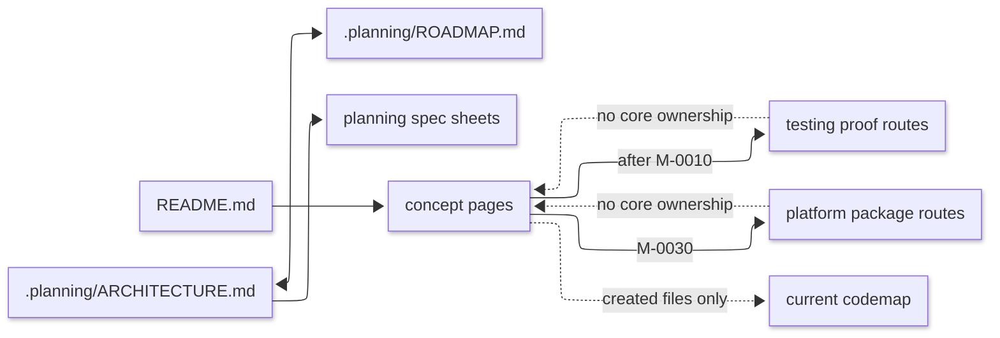

# [PYTHON_STACK_ARCHITECTURE]

This planning architecture records `docs/stacks/python/` as the Python stack documentation topology. The codemap lists current files, the planned view keeps uncreated concept pages and spec sheets out of current truth, and [ROADMAP](ROADMAP.md) owns sequence and task status.

## [1]-[CODEMAP]

```text conceptual
docs/stacks/python/                              # Python stack decision atlas
├── README.md                                    # stack chooser and planned route orientation
├── language.md                                  # current Python language surface
├── pep-standards.md                             # PEP-backed action index and family contracts
└── .planning/                                   # scope-local planning state
    ├── ARCHITECTURE.md                          # current topology and planned topology
    ├── ROADMAP.md                               # milestone sequencing and task status
    └── SPEC.aot-first-decorator.md              # AOT-first and decorator-first planning material
```

Planned files appear only in `Planned view` until created.

## [2]-[SCOPE_BOUNDARY]

Included: `docs/stacks/python/`, its README chooser, language decision page, PEP standards page, and scope-local planning files.

Excluded: Python source implementation, exact package version tables, generated outputs, runtime validation logs, and durable coding doctrine after concept pages exist.

Adjacent routes: `pyproject.toml` carries current Python package and tool graph truth until the platform route exists; the root instruction route carries stack-parent work order; `docs/standards/` carries documentation form.

Reader rule: edits under `docs/stacks/python/` must keep the README chooser, roadmap, and planned architecture aligned.

## [3]-[PROJECT_IDENTITY]

Package or export surface: not applicable; this scope is documentation, not a Python package.

Build target: none owned here.

Generated outputs: none owned here.

Current owner lookup:

| [INDEX] | [SURFACE]                               | [ROLE]           |
| :-----: | :-------------------------------------- | :--------------- |
|   [1]   | `README.md`                             | stack chooser    |
|   [2]   | `language.md`                           | language surface |
|   [3]   | `pep-standards.md`                      | PEP action index |
|   [4]   | `.planning/ROADMAP.md`                  | sequence owner   |
|   [5]   | `.planning/ARCHITECTURE.md`             | topology owner   |
|   [6]   | `.planning/SPEC.aot-first-decorator.md` | planning source  |

[OWNER_BOUNDARIES]:
- Surface: `README.md`
  - Owns: stack chooser and planned route orientation.
  - Route-away: language doctrine and concept-page bodies.
- Surface: `language.md`
  - Owns: current Python language surface.
  - Route-away: data-shape taxonomy, dispatch, rails, boundaries, runtime, algorithms, and proof.
- Surface: `pep-standards.md`
  - Owns: PEP-backed action index, row inclusion law, and cross-cutting PEP family contracts.
  - Route-away: PEP prose, platform package graph truth, native extension policy, and concept-page doctrine.
- Surface: `.planning/ROADMAP.md`
  - Owns: milestone sequencing and task status.
  - Route-away: durable coding law.
- Surface: `.planning/ARCHITECTURE.md`
  - Owns: current topology and planned topology.
  - Route-away: roadmap progress and implementation doctrine.
- Surface: `.planning/SPEC.aot-first-decorator.md`
  - Owns: AOT-first and decorator-first planning material.
  - Route-away: active doctrine after concept pages exist.

## [4]-[CONTRACTS_GENERATED_TRUTH]

This scope owns no generated contract. If a future Python stack page represents generated output or parser-owned Markdown, route generated-truth fields to the relevant concept page and keep generator mechanics out of this planning architecture.

## [5]-[ENTRYPOINTS_AND_FLOWS]

| [INDEX] | [ENTRYPOINT]                            | [KIND]       | [NEXT]       |
| :-----: | :-------------------------------------- | :----------- | :----------- |
|   [1]   | `README.md`                             | chooser      | concept page |
|   [2]   | `.planning/ROADMAP.md`                  | roadmap      | active task  |
|   [3]   | `.planning/ARCHITECTURE.md`             | architecture | planned view |
|   [4]   | `.planning/SPEC.aot-first-decorator.md` | spec sheet   | future owner |

[ENTRYPOINT_EFFECTS]:
- Entrypoint: `README.md`
  - Input: Python stack decision.
  - Effect: routes reader action to the owning page.
- Entrypoint: `.planning/ROADMAP.md`
  - Input: planned stack buildout.
  - Effect: preserves sequence and task status.
- Entrypoint: `.planning/ARCHITECTURE.md`
  - Input: planned topology.
  - Effect: separates active files from planned promotion paths.
- Entrypoint: `.planning/SPEC.aot-first-decorator.md`
  - Input: AOT-first planning detail.
  - Effect: remains source material until referenced rules land.

The README chooser selects the concept page for the coding decision and uses the roadmap only when the concept page is planned but not yet promoted.

## [6]-[DEPENDENCY_DIRECTION]

Stack concept pages may consume `pyproject.toml`, source, generated contracts, maintained Python documentation, and trusted instruction overlays as proof. Current graph facts flow from manifests into platform or concept owners; target capability stays in the concept page that owns the decision.

Allowed direction:



Text equivalent: `README.md` routes reader decisions toward concept owners and roadmap-backed planned pages; `.planning/ARCHITECTURE.md` and `.planning/ROADMAP.md` keep topology and sequence synchronized; planning spec sheets feed future concept owners; core concept pages feed testing in M-0020 and platform in M-0030; testing and platform routes must not own core concept doctrine; planned labels enter the current codemap only after their files exist.

## [7]-[INVARIANTS]

[CORE_FLATNESS]:
- Rule: core Python coding doctrine stays in flat root concept pages.
- Forbids: category folders for core value, surface, rail, boundary, runtime, or algorithm pages before multiple peer leaves need a chooser.
- Check: M-0010 planned structure has root files only.

[TESTING_FOLDER_GATE]:
- Rule: testing becomes a folder only in M-0020.
- Forbids: putting proof-tool decisions into core concept pages or platform package pages.
- Check: `testing/README.md` appears after M-0010 in the roadmap.

[PLATFORM_FOLDER_GATE]:
- Rule: platform becomes a folder only in M-0030.
- Forbids: package graph, tool graph, and build truth leaking into core coding doctrine.
- Check: `platform/README.md` and `platform/build-and-packages.md` appear after testing in the roadmap.

[PLANNING_TOPOLOGY]:
- Rule: planned files stay out of the current codemap until they exist.
- Forbids: treating planned concept pages as current paths or durable doctrine.
- Check: codemap lists only files present under `docs/stacks/python/`.

[PROMOTION_MODEL]:
- Rule: promote planned files only after the active roadmap task reaches them.
- Forbids: moving rule bodies into planning once an active owner exists.
- Check: README chooser links current pages, and planned-view records close when promoted.

[OWNER_SHAPE]:
- Rule: concept pages are named by domain, category, or concept, not external libraries.
- Forbids: package-specific pages, helper taxonomies, and skill-shaped documentation buckets.
- Check: planned owners use concept-page names and keep package, tool, and proof claims in platform or testing routes.

[EXAMPLE_SHAPE]:
- Rule: examples stay dense, neutral, and multi-law.
- Forbids: single-feature snippets that train surface-level adoption.
- Check: promoted concept pages carry example bodies only under the owning concept.

## [8]-[STATUS_AND_ROADMAP]

[ROADMAP_RELATION]:
- Changed fact: `.planning/ROADMAP.md` milestone sequencing and task status.
- Consumed by: `Planned view`, `Dependency direction`, and `Invariants`.
- Use in this document: planned pages become current only when roadmap tasks promote them and README links them.
- Update when: task status, planned filename, owner scope, promotion target, folder gate, or README chooser row changes.
- Close when: all planned pages are current and no planned route changes agent action.
- Route-away: task order, progress, dependencies, and task exit proof stay in [ROADMAP](ROADMAP.md).

Current status: seed files are the active buildout surface. Planned concept pages become current only when created and linked from the README chooser.

## [9]-[PLANNED_VIEW]

Planned core topology:

```text conceptual
docs/stacks/python/
├── data-shapes.md
├── surfaces-and-dispatch.md
├── rails-and-effects.md
├── boundaries.md
├── runtime.md
└── algorithms.md
```

Planned spec sheets:

```text conceptual
docs/stacks/python/.planning/
├── SPEC.core-modeling-composition.md
├── SPEC.runtime-algorithms.md
├── SPEC.testing-proof-rails.md
├── SPEC.platform-package-graph.md
└── SPEC.planning-route-closure.md
```

Planned testing topology:

```text conceptual
docs/stacks/python/testing/
├── README.md
├── managed-laws.md
├── evidence-rails.md
└── specialized-rails.md
```

Planned platform topology:

```text conceptual
docs/stacks/python/platform/
├── README.md
└── build-and-packages.md
```

[CORE_CONCEPT_PAGES]:
- Planned structure: `data-shapes.md`, `surfaces-and-dispatch.md`, `rails-and-effects.md`, `boundaries.md`, `runtime.md`, and `algorithms.md`.
- Current anchor: [README](../README.md) future chooser rows, [ROADMAP](ROADMAP.md), and `.planning/SPEC.aot-first-decorator.md`.
- Source: [ROADMAP](ROADMAP.md) M-0010.
- Use now: reserve decision-based names and prevent operational, package-shaped, proof-shaped, or skill-shaped docs.
- Promotion target: files under `docs/stacks/python/`.
- Promote when: the concept page exists, README links it, and the page owns at least one durable coding decision.
- Remove when: all planned core concept pages are current and no planned route changes agent action.

[SPEC_SHEETS]:
- Planned structure: `SPEC.core-modeling-composition.md`, `SPEC.runtime-algorithms.md`, `SPEC.testing-proof-rails.md`, `SPEC.platform-package-graph.md`, and `SPEC.planning-route-closure.md`.
- Current anchor: [ROADMAP](ROADMAP.md) phase research/spec tasks.
- Source: [ROADMAP](ROADMAP.md) P-0020 through P-0060.
- Use now: keep deep research handoff out of roadmap task bodies and active concept pages until each spec sheet is created.
- Promotion target: files under `docs/stacks/python/.planning/`.
- Promote when: the phase research/spec task completes.
- Remove when: the corresponding spec sheet has been consumed by active concept pages or planning closure.

[TESTING_PAGES]:
- Planned structure: `testing/README.md`, `testing/managed-laws.md`, `testing/evidence-rails.md`, and `testing/specialized-rails.md`.
- Current anchor: [ROADMAP](ROADMAP.md) M-0020.
- Source: [ROADMAP](ROADMAP.md) M-0020.
- Use now: keep testing out of core doctrine until core owners define the behaviors to protect.
- Promotion target: files under `docs/stacks/python/testing/`.
- Promote when: the testing folder exists, README routes it, and testing leaves own proof decisions.
- Remove when: planned testing rows become current topology.

[PLATFORM_PAGES]:
- Planned structure: `platform/README.md` and `platform/build-and-packages.md`.
- Current anchor: [ROADMAP](ROADMAP.md) M-0030 and `pyproject.toml`.
- Source: [ROADMAP](ROADMAP.md) M-0030.
- Use now: keep package and tool graph truth out of core doctrine until the platform route exists.
- Promotion target: files under `docs/stacks/python/platform/`.
- Promote when: the platform folder exists, README routes it, and platform leaves own package graph truth.
- Remove when: planned platform rows become current topology.

Planned owners:

| [INDEX] | [FILE]                           | [FUTURE_OWNER_SCOPE]                                                                      | [MILESTONE] |
| :-----: | :------------------------------- | :---------------------------------------------------------------------------------------- | :---------- |
|   [1]   | `data-shapes.md`                 | Object families, records, enums, immutable data, sentinels, payloads, and nesting.        | M-0010      |
|   [2]   | `surfaces-and-dispatch.md`       | Decorator-first architecture, typed registries, pattern dispatch, and callable surfaces.  | M-0010      |
|   [3]   | `rails-and-effects.md`           | `Option` / `Result`, error transport, effect composition, recovery, retry, and resources. | M-0010      |
|   [4]   | `boundaries.md`                  | Validation, codecs, structured templates, external sinks, and dynamic execution.          | M-0010      |
|   [5]   | `runtime.md`                     | Import-time evaluation, annotation cost, concurrency, free-threading, JIT, and lifetime.  | M-0010      |
|   [6]   | `algorithms.md`                  | Traversal, folds, vectorized work, parsing trees, complexity, and data strategy.          | M-0010      |
|   [7]   | `testing/README.md`              | Python proof-rail chooser.                                                                | M-0020      |
|   [8]   | `testing/managed-laws.md`        | Pytest, Hypothesis, property laws, model checks, fixtures, and assertion shape.           | M-0020      |
|   [9]   | `testing/evidence-rails.md`      | Coverage, mutation, snapshots, benchmark evidence, and deterministic artifacts.           | M-0020      |
|  [10]   | `testing/specialized-rails.md`   | Async, socket, filesystem, process, parser, and benchmark-specialized proof rails.        | M-0020      |
|  [11]   | `platform/README.md`             | Python platform chooser.                                                                  | M-0030      |
|  [12]   | `platform/build-and-packages.md` | Package graph, dependency groups, tool graph, adoption gates, and package-policy routes.  | M-0030      |

## [10]-[PROOF]

Representation: codemap.
Evidence: repository path inspection of `docs/stacks/python/` and current planning files.
Generated from: manual path review.
Controlling source: repository paths, README chooser, roadmap, and planning spec.
Last verified: 2026-06-08.
Review trigger: path, planned filename, README chooser row, roadmap task, planning spec, testing folder gate, or platform folder gate changes.
Element match: codemap nodes map to files present under `docs/stacks/python/`.
Result: current codemap lists active files, and planned files remain in `Planned view`.

Proof gap: planned spec sheets plus planned core, testing, and platform pages do not exist yet; the roadmap owns their execution sequence.

## [11]-[BOUNDARIES]

Architecture carries current and planned topology. Roadmap carries task order and progress. README carries reader orientation. AGENTS carries local maintenance behavior. Spec sheets carry task-ready synthesis until promoted. Concept pages carry coding decisions. Testing pages carry proof decisions. Platform pages carry package graph and build truth.

Do not preserve this planning architecture as current structure after the planned pages become ordinary docs.

## [12]-[VALIDATION]

- [ ] Codemap lists only current paths.
- [ ] Report source material stays out of current doctrine, roadmap progress, and concept-page ownership.
- [ ] Planned spec sheets appear only in `Planned view` until created.
- [ ] Planned core pages appear only in `Planned view`.
- [ ] Planned testing folder appears only in M-0020 planned topology until created.
- [ ] Planned platform folder appears only in M-0030 planned topology until created.
- [ ] Every planned path has a promotion target and removal trigger.
- [ ] README chooser, roadmap, and planned architecture agree.
- [ ] No core planned page is named after an external library.
