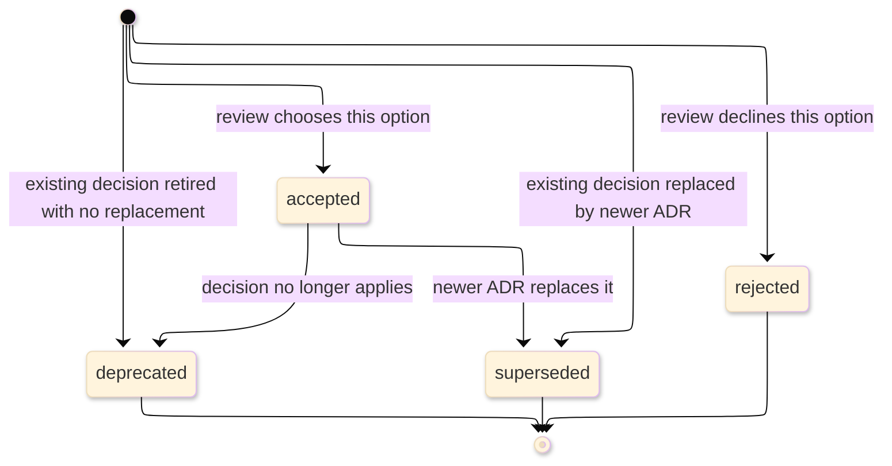

# [ADR_STANDARDS]

An architecture decision record captures one durable architectural decision after review has selected, rejected, retired, or replaced an option. It names the forces, the decision disposition, the alternatives a current owner could defend, the accepted downside where a choice remains binding, and the status-specific evidence that lets a future maintainer trust the record. Route pre-acceptance proposal discussion to design documents, current structure to architecture documents, build sequence to roadmaps, and operational recovery to runbooks.

The controlling rule: one ADR holds exactly one durable decision, carries exactly one decision class, names at least one real alternative or rejected proposal, states the consequence of the disposition, and closes with evidence appropriate to its `Status`. A record that uses accepted-decision confirmation for `rejected`, `deprecated`, or `superseded` status is wrong.

## [1][USE_WHEN]

Use an ADR when a decision meets at least one trigger:

- it binds two or more owners, packages, runtime boundaries, or long-lived contracts;
- it accepts a trade-off a future maintainer must understand before reversing it;
- it rejects an option likely to return;
- it supersedes, deprecates, or amends an earlier accepted architectural decision.

Do not use an ADR to run a proposal review. While an option is still under debate, use a design document; when the decision becomes durable policy, derive the ADR from the selected option, rejected alternatives, consequences, and status-specific evidence.

## [2][ADR_BASELINES]

Use ADR community sources for vocabulary and lifecycle anchors, then apply the local hardening rules in this file. MADR supplies the Markdown ADR section model and `Confirmation` vocabulary, Michael Nygard's ADR practice supplies small records, one significant decision, monotonic numbering, and supersession, and the Y-statement supplies a compact rationale field set. These sources do not own this repository's placement, decision-class taxonomy, accepted-record immutability, required downside field, status-specific proof receipts, or conditional-section discipline; those are local hardening rules.

Source of truth: [MADR 4.0.0 release](https://github.com/adr/madr/releases/tag/4.0.0), [MADR 4.0.0 templates](https://github.com/adr/madr/tree/4.0.0/template), [Michael Nygard's ADR practice](https://cognitect.com/blog/2011/11/15/documenting-architecture-decisions), and [Y-statement form](https://socadk.github.io/design-practice-repository/artifact-templates/DPR-ArchitecturalDecisionRecordYForm.html).
Last verified: 2026-06-04
Review trigger: MADR section model, ADR lifecycle practice, or Y-statement source changes.

## [3][DECISION_CLASSES]

Pick one decision class per ADR. The class controls accepted-decision confirmation evidence; `Status` controls whether confirmation, rejection, retirement, or supersession evidence is required.

| [INDEX] | [CLASS]       | [DECISION_SCOPE]              | [ACCEPTED_CONFIRM_WITH] | [SUPERSEDE_WHEN]    |
| :-----: | :------------ | :---------------------------- | :---------------------- | :------------------ |
|   [1]   | structural    | boundary or ownership         | diagram or codemap      | boundary moves      |
|   [2]   | contract      | API, schema, wire, error      | generated diff          | contract breaks     |
|   [3]   | dependency    | library or SDK choice         | manifest and version    | replaced or removed |
|   [4]   | process       | binding engineering rule      | analyzer or gate        | policy changes      |
|   [5]   | cross-cutting | security, perf, data, runtime | measurement or audit    | posture is retuned  |

Accepted confirmation evidence must match the class: structural ADRs cite a refreshed architecture model or codemap, contract ADRs cite generated contract proof, dependency ADRs cite manifest truth, process ADRs cite the enforcing gate, and cross-cutting ADRs cite a measured check or audit. A prose review does not confirm a class that has a stronger artifact.

## [4][PLACEMENT_NUMBERING]

Place ADRs where the decision log first looks, and never reuse a number.

Default placement:

- Directory: `docs/decisions/`.
- File name: `NNNN-short-title.md`, where `NNNN` is a four-digit monotonic number and `short-title` is lowercase and dash-separated.
- Decision log index: `docs/decisions/README.md`.

Use one decision corpus per repository unless an owner-local decision log already exists. Keep an existing corpus's filename pattern unchanged. Numbers increase monotonically; gaps are allowed and need no filler record.

The decision-log index is a finite enumerable set of trackable records, so render it as a status-tagged record table. One row per ADR, ordered by number, each carrying the fields below. Use conceptual examples in standards files; project decisions belong only in the actual decision log.

| [INDEX] | [NUMBER] | [TITLE]                 | [STATUS]     | [CLASS]    |     [DATE] | [SUPERSEDES] | [SUPERSEDED_BY] |
| :-----: | :------- | :---------------------- | :----------- | :--------- | ---------: | :----------- | :-------------- |
|   [1]   | `0001`   | Adopt event envelope    | `accepted`   | contract   | 2026-01-12 | none         | none            |
|   [2]   | `0007`   | Replace plugin boundary | `superseded` | structural | 2026-03-04 | none         | `0023`          |

Keep ADR metadata status in the lowercase vocabulary below. Use bracketed lifecycle markers only in compact indexes when filtering helps: `accepted` maps to `[DONE]`, and `rejected`, `deprecated`, and `superseded` map to `[DROPPED]`.

## [5][STATUS_LIFECYCLE]

Set `Status` to exactly one lowercase value from the fixed set below:

- `accepted`: reviewed, binding, and ready to implement or enforce.
- `rejected`: considered and declined, retained so the rejection is not rediscovered.
- `deprecated`: no longer relevant, with no replacement.
- `superseded`: replaced by a newer ADR named in `Superseded by`.

The lifecycle is intentionally post-review. Drafts and proposed options belong in design documents; ADRs begin when a decision has a durable disposition. The conceptual diagram shows the permitted status transitions.



Text equivalent: an ADR enters only as `accepted`, `rejected`, `deprecated`, or `superseded`; only `accepted` can later become `deprecated` or `superseded`; rejected, deprecated, and superseded records are terminal except for link repair and non-semantic clarification.

An accepted ADR body is immutable except for typo fixes, broken-link repairs, or context clarifications that leave the decision, drivers, and outcome unchanged. Change a decision by superseding it: the superseded record links forward through `Superseded by`, and the replacing record links back through `Supersedes`.

Do not retrofit old accepted ADRs into a newer template. Existing records may receive lifecycle metadata, forward or back links, broken-link repairs, typo fixes, and non-semantic clarification only; new structure belongs in the replacing ADR or in a current architecture document.

Distinguish supersession from amendment. A supersession replaces the decision and flips the original to `superseded`; an amendment extends the original with a new record while the original stays `accepted`. Record amendment links in `More information`, not in `Status`.

## [6][REQUIRED_STRUCTURE]

Use the metadata block and heading set below for every new ADR. Copy the required headings, replace placeholders, and add conditional sections only when their trigger holds.

```markdown template
# [DECISION_TITLE]

Status: accepted | rejected | deprecated | superseded
Class: structural | contract | dependency | process | cross-cutting
Supersedes: <NNNN list, or none>
Superseded by: <NNNN, or none>
Date: YYYY-MM-DD
Decision makers: <names, teams, or owner roles>
Consulted: <reviewed owners, or none>
Informed: <affected owners, or none>

## [1][CONTEXT_PROBLEM]

## [2][DECISION_DRIVERS]

## [3][CONSIDERED_OPTIONS]

## [4][DECISION_OUTCOME]

### [4.1][CONSEQUENCES]

### [4.2][STATUS_EVIDENCE]

## [5][BOUNDARIES]

## [6][REVIEW_CHECKLIST]
```

Conditional additions:

```markdown template
## [N][DECISION_BASIS_MATRIX]

<Insert after `Considered options` only when a matrix clarifies comparison better than the required options section.>

## [N][MORE_INFORMATION]

<Insert before `Boundaries` only for external links, amendment records, supersession chains, or source contracts that govern the decision.>
```

Metadata cardinality:

- `Status`, `Class`, `Date`, `Decision makers`, `Consulted`, and `Informed` are required.
- `Supersedes` is required and names every replaced ADR or `none`.
- `Superseded by` is required and names the replacing ADR for `superseded` records or `none`.

Section cardinality:

- `Context and problem`, `Decision drivers`, `Considered options`, `Decision outcome`, `Consequences`, `Status evidence`, `Boundaries`, and `Review checklist` are required.
- `Decision basis matrix` and `More information` are conditional and appear only from the conditional additions block.

## [7][SECTION_RULES]

Each section carries specific facts, not generic prose:

- `Context and problem`: name the forces that make a decision necessary and stay value-neutral. A context with no tension does not justify an ADR.
- `Decision drivers`: list criteria the selected or rejected option was judged against. A driver is never a restatement of the outcome.
- `Considered options`: name at least two concrete choices a current owner could defend, unless the ADR records a single rejected proposal; include a do-nothing baseline when inaction was plausible.
- `Decision outcome`: name the selected, rejected, deprecated, or superseding disposition and state the rationale with the Y-statement field set: context, concern, chosen or rejected option, alternatives, quality sought, and downside accepted or reason declined. Render it as one sentence only when readability holds; otherwise use the field-block shape below. Full option-analysis history remains in the design document; the ADR carries only the final decision basis.
- `Consequences`: record at least one positive and one negative effect for `accepted` and `superseded` decisions; for `rejected` and `deprecated`, record the avoided downside and any residual cost of the disposition.
- `Status evidence`: use the status-specific receipt shape below.
- `Boundaries`: link adjacent document types instead of copying their rules.
- `More information`: link only sources that explain or govern the decision.

The decision-outcome field block is the safer shape when one sentence would become overloaded:

```markdown template
Context: <force or constraint that made the decision necessary>
Concern: <quality, boundary, contract, or risk being optimized>
Disposition: <accepted | rejected | deprecated | superseded> <option>
Alternatives: <other defensible options or rejected proposal>
Quality sought: <quality goal or policy served>
Accepted downside: <cost accepted, or reason declined for non-accepted statuses>
```

The consequence shape is deliberately small and status-aware:

```markdown template
- Benefit: <effect> (driver: <driver name>)
- Accepted downside: <cost or constraint> (driver: <driver name>)
- Residual cost: <cost that remains after rejection, deprecation, or supersession> (driver: <driver name>)
- Avoided downside: <cost avoided by rejection or retirement> (driver: <driver name>)
```

## [8][STATUS_EVIDENCE]

Status determines the evidence receipt. Put the receipt inside `Status evidence` and keep it close to the outcome it proves.

| [INDEX] | [STATUS]     | [REQUIRED_EVIDENCE]                         |
| :-----: | :----------- | :------------------------------------------ |
|   [1]   | `accepted`   | class confirmation surface                  |
|   [2]   | `rejected`   | rejection rationale and declined option     |
|   [3]   | `deprecated` | retirement reason and no-replacement proof  |
|   [4]   | `superseded` | forward link and replacing-record back link |

Accepted receipt:

```markdown template
Surface: <diagram, codemap, generated contract, manifest, gate, command, measurement, or audit>
Evidence: <source path, command, generated artifact, or status check>
Last verified: YYYY-MM-DD
Review trigger: <event that can make the evidence stale>
```

Rejected, deprecated, and superseded receipts replace `Surface` with the disposition-specific field:

```markdown template
Disposition evidence: <review record, removal proof, supersession link, or governing source>
Evidence: <source path, command, generated artifact, or status check>
Last verified: YYYY-MM-DD
Review trigger: <event that can make the disposition stale>
```

For `superseded`, `Evidence` names both directions: this record's `Superseded by` value and the replacing record's `Supersedes` value. A one-way link is an incomplete supersession.

Rejected evidence example:

```markdown template
Disposition evidence: review declined direct storage access because it bypasses the owner boundary.
Evidence: design review record and rejected option in `docs/design/<proposal>.md`.
Last verified: YYYY-MM-DD
Review trigger: storage owner boundary or rejected option returns.
```

Superseded evidence example:

```markdown template
Disposition evidence: ADR `0023` replaces this boundary decision.
Evidence: this record says `Superseded by: 0023`; ADR `0023` says `Supersedes: 0007`.
Last verified: YYYY-MM-DD
Review trigger: replacement ADR, decision-log index, or owner boundary changes.
```

## [9][OPTION_COMPARISON]

Use a decision-basis matrix only when it improves final-decision reconstruction. Two or three options with parallel facts compare cleanly in a table; asymmetric trade-offs read better as labeled prose under `Considered options`. The matrix is not a proposal-review transcript and must not reopen design discussion.

```markdown conceptual
| [INDEX] | [OPTION]        | [DRIVER]        | [ACCEPTED_COST]  | [REJECTED_RISK] | [VERDICT] |
| :-----: | :-------------- | :-------------- | :--------------- | :-------------- | :-------- |
|   [1]   | Adopt library A | schema contract | larger binary    | —               | selected  |
|   [2]   | Build in-house  | ownership       | maintenance load | slower delivery | rejected  |
|   [3]   | Defer           | short-term cost | decision remains | risk compounds  | rejected  |
```

The columns name the decision facts an ADR preserves: the driver served, the cost the selected option accepts, the risk a rejected option leaves, and the final verdict.

The rejected shape below hides the decision basis inside prose:

```markdown rejected
Option A is good because it has schema support but it adds a dependency, and option B avoids the dependency though it is slower, and deferring costs nothing now but compounds risk later.
```

## [10][DESIGN_HANDOFF]

Promote a design document to an ADR only when an accepted decision becomes durable architecture policy. Derive the ADR from the final drivers, selected option, rejected alternatives, consequences, and status evidence. Do not copy the full design body; the design retains proposal and review history while the ADR owns the durable decision.

Use this handoff record when a produced ADR is derived from an accepted design:

```markdown template
Origin design: <path, or none>
Accepted direction: <selected option from final design review>
Target ADR: <this ADR path or number>
Architecture fact: <codemap, diagram proof, generated contract, or none>
Roadmap milestone: <milestone anchor, or none>
```

Omit a field only when it is genuinely inapplicable and would not help a future maintainer trace the decision.

## [11][BOUNDARIES]

- [design-doc.md](design-doc.md) owns proposal discussion and review history before acceptance; link it when an ADR derives from a reviewed design.
- [architecture.md](architecture.md) owns current structure and invariants; link it when the ADR confirms, changes, or supersedes a structural boundary.
- [roadmap.md](roadmap.md) owns build sequence and milestone exit proof; link it only when implementation sequencing remains active.
- [runbook.md](../task/runbook.md) owns symptom-to-fix operational recovery.
- [README.md](../README.md) owns document-type routing, placement, and lifecycle.

## [12][REVIEW_CHECKLIST]

- [ ] The ADR records one durable accepted, rejected, deprecated, or superseded decision.
- [ ] Existing accepted ADRs were not backfilled into a newer template during lifecycle maintenance.
- [ ] `Status`, `Class`, `Supersedes`, `Superseded by`, `Date`, `Decision makers`, `Consulted`, and `Informed` are present.
- [ ] Exactly one decision class is set, and accepted confirmation matches the class lookup row.
- [ ] Context names forces in tension and stays value-neutral.
- [ ] Drivers are criteria, and options name at least two defensible choices or one clearly rejected proposal.
- [ ] Decision outcome carries the Y-statement field set and an accepted downside or disposition reason.
- [ ] Consequences include the disposition's positive, negative, or avoided effects without pretending every status is accepted.
- [ ] Status evidence uses the receipt shape for `accepted`, `rejected`, `deprecated`, or `superseded`.
- [ ] Supersession links are bidirectional through `Supersedes` and `Superseded by`.
- [ ] Conditional `More information` and `Decision basis matrix` sections appear only when their triggers hold.
- [ ] The decision-log index is a status-tagged record table, not flat prose.
- [ ] Option matrices use decision-specific fields, not generic praise or criticism columns.
