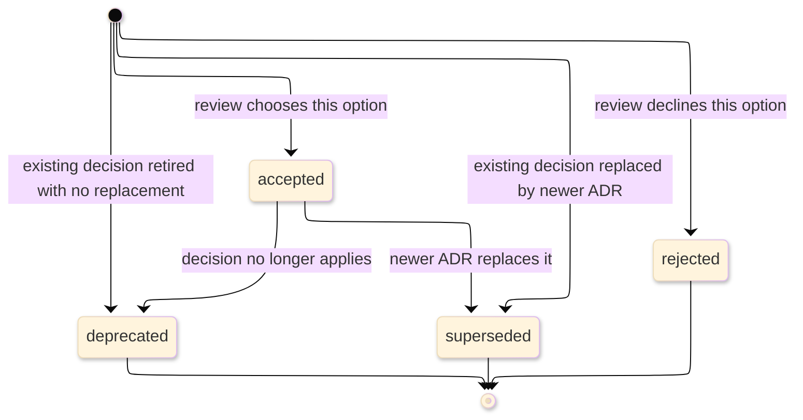

# [ADR_STANDARDS]

An architecture decision record captures one durable architectural decision after evaluation has selected, rejected, retired, or replaced an option. It names the forces, the disposition, the alternatives a current route could still defend, the accepted downside where a choice remains binding, and the status-specific evidence that lets a future agent trust the record. Route pre-acceptance proposal discussion to design documents, current structure to architecture documents, build sequence to roadmaps, and operational recovery to runbooks.

The controlling rule: one ADR holds exactly one durable decision, carries exactly one decision class, names at least one real alternative or rejected proposal, states the consequence of the disposition, and closes with evidence appropriate to its `Status`. A record that uses accepted-decision confirmation for `rejected`, `deprecated`, or `superseded` status is wrong.

## [1][USE_WHEN]

Use an ADR when a decision meets at least one trigger:
- it binds two or more routes, packages, runtime boundaries, or long-lived contracts;
- it accepts a trade-off a future agent must understand before reversing it;
- it rejects an option likely to return;
- it supersedes, deprecates, or amends an earlier accepted architectural decision.

Do not use an ADR to run a proposal review. While an option is still under debate, use a design document; when the decision becomes durable policy, derive the ADR from the selected option, rejected alternatives, consequences, and status-specific evidence.

[AUTHORING_CONTRACT]:
- Agent use: classify one durable decision, preserve its disposition, and decide whether source, roadmap, architecture, or generated contracts must change.
- Required produced structure: lead lifecycle facts, context/problem, drivers, considered options, outcome, consequences, status evidence, boundaries, and validation.
- Section cardinality: one durable decision, one decision class, one status, one outcome, and one status-evidence section; optional comparison and more-information sections appear only when they change the decision record.
- Adjacent checks: design doc for proposal source, architecture for current structure, roadmap for implementation sequence, API/reference/code docs for public contracts, support matrix for lifecycle.
- Maintenance triggers: decision status, supersession link, accepted downside, generated contract, architecture boundary, or enforcing gate changes.
- Stale prevention: amend or supersede decisions instead of re-templating accepted ADR bodies.

## [2][DECISION_CLASSES]

Pick one decision class per ADR. The class controls accepted-decision confirmation evidence; `Status` controls whether confirmation, rejection, retirement, or supersession evidence is required.

| [INDEX] | [CLASS]       | [DECISION_SCOPE]              | [ACCEPTED_CONFIRM_WITH] | [SUPERSEDE_WHEN]    |
| :-----: | :------------ | :---------------------------- | :---------------------- | :------------------ |
|   [1]   | structural    | boundary or routing           | diagram or codemap      | boundary moves      |
|   [2]   | contract      | API, schema, wire, error      | generated diff          | contract breaks     |
|   [3]   | dependency    | library or SDK choice         | manifest and version    | replaced or removed |
|   [4]   | process       | binding engineering rule      | analyzer or gate        | policy changes      |
|   [5]   | cross-cutting | security, perf, data, runtime | measurement or audit    | posture is retuned  |

Accepted confirmation evidence must match the class: structural ADRs cite a refreshed architecture model or codemap, contract ADRs cite generated contract proof, dependency ADRs cite manifest truth, process ADRs cite the enforcing gate, and cross-cutting ADRs cite a measured check or audit. A prose review does not confirm a class that has a stronger artifact.

## [3][PLACEMENT_NUMBERING]

Place ADRs where the decision log first looks, and never reuse a number.

[DEFAULT_PLACEMENT]:
- Directory: `docs/decisions/`.
- File name: `NNNN-short-title.md`, where `NNNN` is a four-digit monotonic number and `short-title` is lowercase and dash-separated.
- Decision log index: `docs/decisions/README.md`.

Use one decision corpus per repository unless a scope-local decision log already exists. Keep an existing corpus's filename pattern unchanged. Numbers increase monotonically; gaps are allowed and need no filler record.

The decision-log index is a finite enumerable set of trackable records, so render it as a status-tagged record table. One row per ADR, ordered by number, each carrying the fields below. Use conceptual examples in standards files; project decisions belong only in the actual decision log.

| [INDEX] | [NUMBER] | [TITLE]              | [STATUS]     | [CLASS]    |     [DATE] | [SUPERSEDES] | [SUPERSEDED_BY] |
| :-----: | :------- | :------------------- | :----------- | :--------- | ---------: | :----------- | :-------------- |
|   [1]   | `NNNN`   | Adopt `<contract>`   | `accepted`   | contract   | YYYY-MM-DD | —            | —               |
|   [2]   | `NNNN`   | Replace `<boundary>` | `superseded` | structural | YYYY-MM-DD | —            | `NNNN`          |

Keep ADR status in the lowercase vocabulary below. Use bracketed lifecycle markers only in compact indexes when filtering helps: `accepted` maps to `[COMPLETE]`. `rejected`, `deprecated`, and `superseded` may render as terminal compact markers only when the row still carries the original lowercase `Status` value; never collapse those three dispositions into one lifecycle meaning.

## [4][STATUS_LIFECYCLE]

Set `Status` to exactly one lowercase value from the fixed set below:
- `accepted`: reviewed, binding, and ready to implement or enforce.
- `rejected`: considered and declined, retained so the rejection is not rediscovered.
- `deprecated`: no longer relevant, with no replacement.
- `superseded`: replaced by a newer ADR named in `Superseded by`.

Lifecycle categories: `accepted` is the only active/binding state. ADRs have no blocked or returnable status because proposal uncertainty belongs in design documents. `rejected`, `deprecated`, and `superseded` are terminal except for link repair and non-semantic clarification. Canonical ADR records stay in the decision log; only duplicate index rows or generated mirrors may be removed after the canonical ADR and supersession links remain discoverable.

ADR disposition is type-local vocabulary, not the shared roadmap lifecycle. `rejected` preserves a declined option, `deprecated` retires an accepted decision without a replacement, and `superseded` points to the replacing ADR. A compact marker may help filtering, but the lowercase status remains the semantic source.

The lifecycle is intentionally post-review. Drafts and proposed options belong in design documents; ADRs begin when a decision has a durable disposition. The conceptual diagram shows the permitted status transitions.



Text equivalent: an ADR enters only as `accepted`, `rejected`, `deprecated`, or `superseded`; only `accepted` can later become `deprecated` or `superseded`; rejected, deprecated, and superseded records are terminal except for link repair and non-semantic clarification.

An accepted ADR body is immutable except for typo fixes, broken-link repairs, or context clarifications that leave the decision, drivers, and outcome unchanged. Change a decision by superseding it: the superseded record links forward through `Superseded by`, and the replacing record links back through `Supersedes`.

Do not retrofit old accepted ADRs into a newer template. Existing records may receive lifecycle facts, forward or back links, broken-link repairs, typo fixes, and non-semantic clarification only; new structure belongs in the replacing ADR or in a current architecture document.

Distinguish supersession from amendment. A supersession replaces the decision and flips the original to `superseded`; an amendment extends the original with a new record while the original stays `accepted`. Record amendment links in `More information`, not in `Status`.

Maintenance action follows the change, not the author's desire to refresh formatting:

| [INDEX] | [CHANGE]                         | [ACTION]                 | [RECORD_EFFECT]                                       |
| :-----: | :------------------------------- | :----------------------- | :---------------------------------------------------- |
|   [1]   | typo, broken link, route wording | edit existing ADR        | decision, drivers, and outcome stay unchanged         |
|   [2]   | decision changes or replacement  | create superseding ADR   | old ADR becomes `superseded`; links are bidirectional |
|   [3]   | missing lifecycle/index fact     | update index or fields   | no body rewrite beyond lifecycle fact                 |
|   [4]   | option still under review        | route to design document | no ADR until durable disposition exists               |

Do not re-template an accepted ADR while performing lifecycle maintenance. If the existing body cannot safely express the new policy, write the replacing ADR and link the old record forward.

## [5][REQUIRED_STRUCTURE]

Use the heading set below for every new ADR. State status, class, supersession links, date, decision source, and evidence source in the lead or lifecycle/status sections; add conditional sections only when their trigger holds.

```markdown template
# [DECISION_TITLE]

<Lead: name the decision status, class, supersession links, date, decision source, and evidence source.>

## [1][CONTEXT_PROBLEM]

## [2][DECISION_DRIVERS]

## [3][CONSIDERED_OPTIONS]

## [4][DECISION_OUTCOME]

### [4.1][CONSEQUENCES]

### [4.2][STATUS_EVIDENCE]

## [5][BOUNDARIES]

## [6][VALIDATION]
```

Add these conditional sections only when their trigger applies:

```markdown template
## [N][DECISION_BASIS_MATRIX]

<Insert after `Considered options` only when a matrix clarifies comparison better than the required options section.>

## [N][MORE_INFORMATION]

<Insert before `Boundaries` only for maintained links, amendment records, supersession chains, or source contracts that govern the decision.>
```

ADR cardinality splits into these groups:

[LIFECYCLE_FACTS]:
- `Status`, `Class`, `Date`, `Decision source`, and `Evidence` are required.
- `Supersedes` is required and names every replaced ADR or `none`.
- `Superseded by` is required and names the replacing ADR for `superseded` records or `none`.

[SECTIONS]:
- `Context and problem`, `Decision drivers`, `Considered options`, `Decision outcome`, `Consequences`, `Status evidence`, `Boundaries`, and `Validation` are required.
- `Decision basis matrix` and `More information` are conditional and appear only from the conditional additions block.

The H1 names the decision only; the lead carries the lifecycle facts and top-level reader promise.

Accepted title: `# [ADOPT_CONTRACT]`
Accepted fields:
    Status: accepted
    Class: contract
    Date: YYYY-MM-DD
    Supersedes: none
    Superseded by: none
    Decision source: accepted design `<design-doc>`
    Evidence: generated contract diff and release gate receipt
Accepted lead: This ADR accepts `<contract>` as the durable cross-scope contract. It records the trade-off, rejected alternatives, accepted downside, and contract confirmation evidence; implementation sequencing stays in the roadmap.
Rejected title: `# [CONTRACT]`
Rejected lead: This document discusses whether we should probably standardize events and lists some implementation steps.
Reason: the rejected lead hides lifecycle facts and mixes proposal work into the ADR.

## [6][SECTION_RULES]

Each section carries specific facts, not generic prose:

[DECISION_BODY]:
- `Context and problem`: name the forces that make a decision necessary and stay value-neutral. A context with no tension does not justify an ADR.
- `Decision drivers`: list criteria the selected or rejected option was judged against. A driver is never a restatement of the outcome.
- `Considered options`: name at least two concrete choices a current route could defend, unless the ADR records a single rejected proposal; include a do-nothing baseline when inaction was plausible.
- `Decision outcome`: name the selected, rejected, deprecated, or superseding disposition and state the rationale with the Y-statement field set: context, concern, chosen or rejected option, alternatives, quality sought, and downside accepted or reason declined. Render it as one sentence only when readability holds; otherwise use the field-block shape below. Full option-analysis history remains in the design document; the ADR carries only the final decision basis.
- `Consequences`: record at least one positive and one negative effect for `accepted` and `superseded` decisions; for `rejected` and `deprecated`, record the avoided downside and any residual cost of the disposition.
- `Status evidence`: use the status-specific receipt shape below.

[ROUTES]:
- `Boundaries`: link adjacent document types instead of copying their rules.
- `More information`: link only sources that explain or govern the decision.

The decision-outcome field block is the safer shape when one sentence would become overloaded:

```text template
Context: <force or constraint that made the decision necessary>
Concern: <quality, boundary, contract, or risk being optimized>
Disposition: <accepted | rejected | deprecated | superseded> <option or prior decision>
Alternatives: <other defensible options or rejected proposal>
Quality sought: <quality goal or policy served>
Accepted downside: <cost accepted; accepted records only>
Disposition reason: <reason declined, retired, or replaced; rejected, deprecated, and superseded records only>
```

Use this small status-aware consequence shape:

```markdown template
- Benefit: <effect> (driver: <driver name>)
- Accepted downside: <cost or constraint> (driver: <driver name>)
- Residual cost: <cost that remains after rejection, deprecation, or supersession> (driver: <driver name>)
- Avoided downside: <cost avoided by rejection or retirement> (driver: <driver name>)
```

## [7][STATUS_EVIDENCE]

Status determines the evidence receipt. Put the receipt inside `Status evidence` and keep it close to the outcome it proves.

| [INDEX] | [STATUS]     | [REQUIRED_EVIDENCE]                         |
| :-----: | :----------- | :------------------------------------------ |
|   [1]   | `accepted`   | class confirmation surface                  |
|   [2]   | `rejected`   | rejection rationale and declined option     |
|   [3]   | `deprecated` | retirement reason and no-replacement proof  |
|   [4]   | `superseded` | forward link and replacing-record back link |

Use one status-aware receipt shape. Include only fields that apply to the status, but keep proof fields when the claim can drift:

```text template
Status: <accepted | rejected | deprecated | superseded>
Confirmation surface: <accepted-status diagram, codemap, generated contract, manifest, gate, measurement, or audit>
Disposition evidence: <rejection rationale, retirement proof, or supersession link>
Evidence: <source path, generated artifact, command, review record, or maintained policy>
Generated from: <generator, command, or source model>
Controlling source: <contract, manifest, ADR, design, support row, or architecture path>
Last verified: YYYY-MM-DD
Review trigger: <contract, manifest, architecture, support, gate, or supersession change that makes the receipt stale>
```

Omit inapplicable fields entirely; do not write `omitted` into a produced receipt.

The next examples are complete because the fields match the status:

```text template
Status: accepted
Confirmation surface: generated contract diff.
Evidence: `<contract-artifact>` generated output and contract gate.
Review trigger: contract generator, consumer contract, or contract gate change.
```

```text template
Status: rejected
Disposition evidence: review declined direct storage access because it bypasses the scope boundary.
Evidence: design review record for the storage-boundary proposal.
```

```text template
Status: deprecated
Disposition evidence: decision retired with no replacement because the controlling architecture or support fact no longer exists.
Evidence: retirement source or proof gap.
Review trigger: support, architecture, or replacement-policy change.
```

```text template
Status: superseded
Disposition evidence: ADR `NNNN` replaces this boundary decision and names this ADR in `Supersedes`.
Evidence: `Superseded by: NNNN` in this record and `Supersedes: <this ADR>` in ADR `NNNN`.
Review trigger: replacing ADR status, title, or link changes.
```

For `superseded`, disposition proof names both directions. A one-way link is an incomplete supersession.

## [8][OPTION_COMPARISON]

Use a decision-basis matrix only when it improves final-decision reconstruction. Two or three options with parallel facts compare cleanly in a table; asymmetric trade-offs read better as labeled prose under `Considered options`. The matrix is not a proposal-review transcript and must not reopen design discussion.

```markdown conceptual
| [INDEX] | [OPTION]        | [DRIVER]        | [ACCEPTED_COST]  | [REJECTED_RISK] | [VERDICT] |
| :-----: | :-------------- | :-------------- | :--------------- | :-------------- | :-------- |
|   [1]   | Adopt library A | schema contract | larger binary    | —               | selected  |
|   [2]   | Build in-house  | routing         | maintenance load | slower delivery | rejected  |
|   [3]   | Defer           | short-term cost | decision remains | risk compounds  | rejected  |
```

The columns name the decision facts an ADR preserves: the driver served, the cost the selected option accepts, the risk a rejected option leaves, and the final verdict.

Rejected shape: Option A is good because it has schema support but it adds a dependency, and option B avoids the dependency though it is slower, and deferring costs nothing now but compounds risk later.
Reason: prose hides the decision basis; the table preserves the driver served, the cost the selected option accepts, the risk a rejected option leaves, and the final verdict.

## [9][DESIGN_HANDOFF]

Promote a design document to an ADR only when the accepted direction becomes durable architecture policy. Derive the ADR from the final drivers, selected option, rejected alternatives, consequences, and status evidence. Do not copy the full design body; the design retains proposal history while the ADR carries the durable decision.

Use this handoff record when a produced ADR is derived from an accepted design:

ADR design-handoff records use local provenance fields first, then the shared relation fields in order.

```text template
Origin design: <path>
Accepted direction: <selected option from final design state>
Changed fact: <durable policy, architecture fact, generated contract, support fact, or implementation sequence accepted by the design>
Consumed by: <this ADR, architecture path, roadmap milestone, support matrix, API, reference, code documentation, runbook, or test strategy>
Use in this document: <why the ADR must preserve this accepted design fact>
Update when: <accepted direction, this ADR status, number, supersession link, consuming document, current structure, generated contract, milestone, support row, or proof gate changes>
Close when: <ADR records the decision and each consuming document updates or routes away the fact>
Route-away: <proposal history, implementation task body, milestone body, or proof taxonomy that stays in the adjacent document>
```

Omit optional adjacent fields when the link does not change future maintenance behavior. Keep the shared relation fields whenever a target remains, and close on the route-away body so proposal history does not leak into the ADR.

Class-specific adjacent updates keep the decision from drifting into the wrong route:

| [INDEX] | [ADR_CLASS]   | [UPDATE_ADJACENT_WHEN]                                    | [CONSUMING_DOCUMENT]                             |
| :-----: | :------------ | :-------------------------------------------------------- | :----------------------------------------------- |
|   [1]   | structural    | accepted boundary changes current directories or flows    | architecture                                     |
|   [2]   | contract      | generated contract, public API, or symbol surface changes | API, reference, or code documentation            |
|   [3]   | dependency    | support lifecycle or version policy changes               | support matrix                                   |
|   [4]   | process       | enforced gate or contribution rule changes                | test strategy or contributing                    |
|   [5]   | cross-cutting | runtime, security, data, or operational posture changes   | architecture, test strategy, runbook, or support |

## [10][BOUNDARIES]

[EXPLANATION_TYPES]:
- [design-doc.md](design-doc.md) carries proposal discussion before acceptance; link it when an ADR derives from an accepted design.
- [architecture.md](architecture.md) carries current structure and invariants; link it when the ADR confirms, changes, or supersedes a structural boundary.
- [roadmap.md](roadmap.md) carries build sequence and milestone exit proof; link it only when implementation sequencing remains active.
- [test-strategy.md](test-strategy.md) carries confirmation-gate taxonomy and reusable test proof policy.
- [api.md](../reference/api.md), [reference.md](../reference/reference.md), and [code-documentation.md](../reference/code-documentation.md) own public-contract, lookup, and source-symbol documentation.

[REFERENCE_TASK_ROUTES]:
- [support-matrix.md](../reference/support-matrix.md) carries lifecycle and support policy.
- [contributing.md](../task/contributing.md) carries contribution workflow when a process ADR changes it.
- [runbook.md](../task/runbook.md) carries symptom-to-fix operational recovery.
- [README.md](../README.md) carries document-type routing, placement, and lifecycle.

## [11][VALIDATION]

[DECISION_SCOPE]:
- [ ] The ADR records one durable accepted, rejected, deprecated, or superseded decision.
- [ ] Existing accepted ADRs were not backfilled into a newer template during lifecycle maintenance.
- [ ] `Status`, `Class`, `Supersedes`, `Superseded by`, `Date`, `Decision source`, and `Evidence` are present.
- [ ] Exactly one decision class is set, and accepted confirmation matches the class lookup row.
- [ ] Context names forces in tension and stays value-neutral.
- [ ] Drivers are criteria, and options name at least two defensible choices or one clearly rejected proposal.

[OUTCOME_EVIDENCE]:
- [ ] Decision outcome carries the Y-statement field set and an accepted downside or disposition reason.
- [ ] Consequences include the disposition's positive, negative, or avoided effects without pretending every status is accepted.
- [ ] Status evidence uses the receipt shape for `accepted`, `rejected`, `deprecated`, or `superseded`.
- [ ] Supersession links are bidirectional through `Supersedes` and `Superseded by`.

[ROUTES_INDEX]:
- [ ] Conditional `More information` and `Decision basis matrix` sections appear only when their triggers hold.
- [ ] The decision-log index is a status-tagged record table, not flat prose.
- [ ] Option matrices use decision-specific fields, not generic praise or criticism columns.
