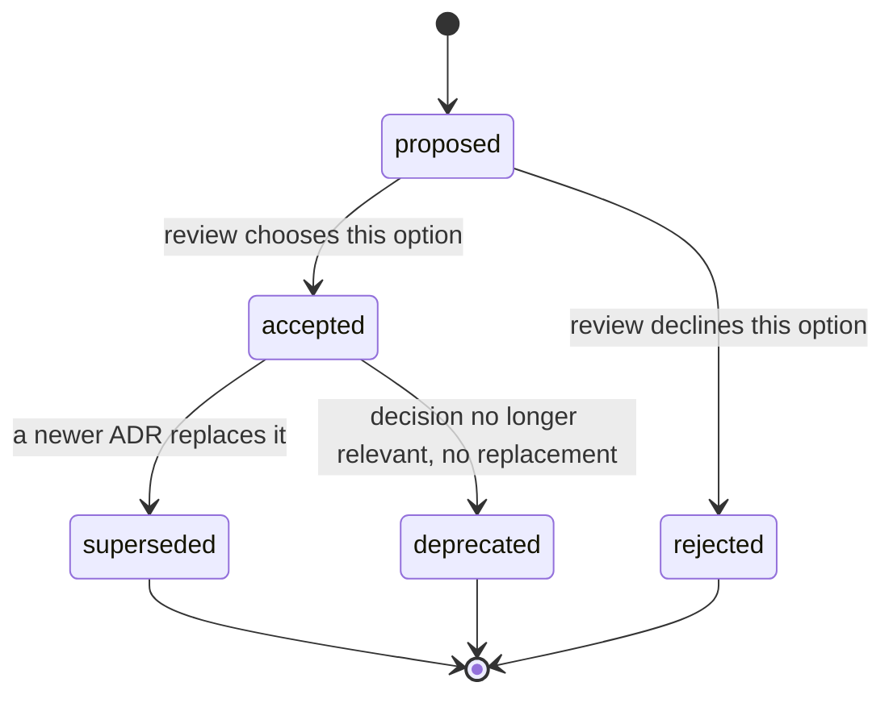

# [ADR_STANDARDS]

An architecture decision record captures one durable architectural decision after review has chosen an option, names the rejected alternatives, and states the future evidence that confirms the decision is being followed. Write an ADR when a decision outlives the change that made it; route proposal discussion, current structure, build sequence, and operational recovery to their owning types. Each accepted ADR is immutable: change a decision only by superseding it with a new record that links both ways, or extend it with an amending record that leaves the original `accepted`.

The controlling rule: one record holds exactly one decision, carries exactly one decision class, names at least one rejected alternative a current owner could defend, and states class-specific future evidence that an agent can later observe. A record that omits the rejected alternative, the class confirmation, or the negative consequence is incomplete and fails review.

## [1][USE_WHEN]

Use an ADR when a decision meets at least one trigger:

- it binds two or more owners, packages, runtime boundaries, or long-lived contracts;
- it accepts a trade-off a future maintainer must understand to avoid reversing it;
- it rejects an option a current owner can name and that is likely to return;
- it supersedes an earlier accepted architectural decision.

Route elsewhere when the artifact is pre-acceptance proposal discussion, current system structure and invariants, build sequence and milestone exit proof, or symptom-to-fix operational recovery. The README corpus map owns that document-type routing by topic.

## [2][DECISION_CLASSES]

Pick one decision class per ADR; the class sets which optional sections become required and how confirmation is proven. A record carries exactly one class. The table below stays compact by using short lookup cells; the paragraph after it owns the class-specific proof sentence.

| [INDEX] | [CLASS]       | [DECISION_SCOPE]              | [CONFIRM_WITH]       | [SUPERSEDE_WHEN]    |
| :-----: | :------------ | :---------------------------- | :------------------- | :------------------ |
|   [1]   | Structural    | Boundary or ownership         | diagram or codemap   | boundary moves      |
|   [2]   | Contract      | API, schema, wire, error      | generated diff       | contract breaks     |
|   [3]   | Dependency    | Library or SDK choice         | manifest and version | replaced or removed |
|   [4]   | Process       | Binding engineering rule      | analyzer or gate     | policy changes      |
|   [5]   | Cross-cutting | Security, perf, data, runtime | measurement or audit | posture is re-tuned |

Confirmation evidence is class-specific: a structural ADR cites the architecture model or codemap, a contract ADR cites the generated contract, a dependency ADR cites the manifest, a process ADR cites the enforcing gate, and a cross-cutting ADR cites a measured check. Do not state a class-mismatched confirmation, such as proving a contract decision with a prose review when a generated diff exists.

## [3][SOURCE_ORDER]

Use the ADR community vocabulary, the MADR section model, and Michael Nygard's decision lifecycle for section names, status names, supersession semantics, and immutable accepted records. The section template tracks MADR 4.0 (`Confirmation` is a sub-element of `Decision outcome`, `decision_makers` is the owner field). Use the Olaf Zimmermann Y-statement as the compact rationale form inside `Decision outcome`. When the local corpus already fixes a status set or file-name pattern, the established repository convention controls over the external default.

`Source of truth:` MADR 4.0.0 template (2024-09-17), Michael Nygard ADR practice, Olaf Zimmermann Y-statement. `Last verified:` 2026-06-04. `Review trigger:` MADR section or status model changes.

## [4][PLACEMENT_NUMBERING]

Place an ADR where the decision log first looks, and never reuse a number.

Default placement:

- Directory: `docs/decisions/`.
- File name: `NNNN-short-title.md`, where `NNNN` is a four-digit monotonic number and `short-title` is lowercase and dash-separated.
- Decision log index: `docs/decisions/README.md`.

Use one decision corpus per repository unless owner-local decision logs already exist, and keep an existing corpus's file-name pattern unchanged. Numbers increase monotonically and are never reused; a gap in the sequence is allowed and needs no filler record.

The decision-log index is a finite enumerable set of trackable records, so render it as a status-tagged record table, never as flat prose. One row per ADR, ordered by number, each carrying the fields below. A `superseded` row keeps its link to the replacing ADR so the chain is traversable from the index.

| [INDEX] | [NUMBER] | [TITLE]                          | [STATUS]     | [CLASS]    |     [DATE] | [SUPERSEDES_SUPERSEDED] |
| :-----: | :------- | :------------------------------- | :----------- | :--------- | ---------: | :---------------------- |
|   [1]   | `0001`   | Adopt central package management | `accepted`   | dependency | 2026-01-12 | —                       |
|   [2]   | `0007`   | Single session-state store       | `superseded` | structural | 2026-03-04 | superseded by `0023`    |

Map the lifecycle status to the bracketed lifecycle-marker set formatting.md owns when an agent filters the index inline: `proposed` reads as `[IN-PROGRESS]`, `accepted` as `[DONE]`, `rejected` and `deprecated` as `[DROPPED]`, and `superseded` as `[DROPPED]`. Keep the ADR front-matter `status` field in its own lowercase lifecycle vocabulary; the bracketed marker is for inline index scanning only.

## [5][STATUS_LIFECYCLE]

Set `status` to exactly one value, in lowercase, from the fixed set below. Record a replacement in `superseded_by`, never inside `status`.

- `proposed`: under review and not binding.
- `accepted`: agreed, binding, and ready to implement or enforce.
- `rejected`: considered and declined, retained as a record of the rejection.
- `deprecated`: no longer relevant, with no replacement.
- `superseded`: replaced by a newer ADR named in `superseded_by`.

The status diagram below is a `stateDiagram-v2` because the subject is a lifecycle with named transitions, which a flowchart would not model as cleanly.



An accepted ADR body is immutable except for typo fixes, broken-link repairs, or context clarifications that leave the decision, drivers, and outcome unchanged. Change a decision by superseding it: the superseded record links forward to its replacement, and the replacing record links back to every ADR it supersedes, so the supersession chain is bidirectional and traversable from either end.

Distinguish supersession from amendment. A supersession replaces the decision and flips the original to `superseded`; an amendment extends the original with a new record while the original stays `accepted`. Record the amendment as a bidirectional link in `More information`, not in `status`. Reserve `superseded` for a replaced decision, never for a decision that a later ADR merely extends.

## [6][REQUIRED_STRUCTURE]

The metadata block and heading template below are `template`; copy them and replace every placeholder. Cardinality is fixed: `required` appears once, `optional` zero or one time, `conditional` only when its trigger holds, and `repeatable` one or more times.

```markdown template
# [DECISION_TITLE]

Status: proposed | accepted | rejected | deprecated | superseded
Class: structural | contract | dependency | process | cross-cutting
Superseded by: <NNNN, or none>
Date: YYYY-MM-DD
Decision makers: <names, teams, or owner roles>
Consulted: <reviewed owners, or none>
Informed: <affected owners, or none>

## [1][CONTEXT_PROBLEM_STATEMENT]

## [2][DECISION_DRIVERS]

## [3][CONSIDERED_OPTIONS]

## [4][DECISION_OUTCOME]

### [4.1][CONSEQUENCES]

### [4.2][CONFIRMATION]

## [5][PROS_CONS_OPTIONS]

## [6][MORE_INFORMATION]

```

Metadata cardinality:

- `Status` is required and single-valued, from the lifecycle set.
- `Class` is required and single-valued, from the decision-class set.
- `Superseded by` is required and single-valued; it names the replacing `NNNN` for a `superseded` record and `none` otherwise.
- `Date` is required and single-valued; it records the acceptance or last status change.
- `Decision makers` is required and repeatable across named accountable owners.
- `Consulted` and `Informed` are optional and repeatable; use `none` when empty.

Section cardinality (`required` appears once, `optional` zero or one time, `conditional` when its trigger holds, `repeatable` one or more times):

- `Context and problem statement`, `Decision drivers`, `Considered options`, `Decision outcome`, and `Pros and cons of the options` are required H2 sections and appear once.
- `Consequences` and `Confirmation` are required H3 sub-elements of `Decision outcome`, each appearing once; `Consequences` holds repeatable positive, negative, and neutral effects with at least one negative effect.
- `More information` is conditional and appears once when external links, a supersession target, or an amendment record govern the decision.

## [7][SECTION_RULES]

Each section carries specific facts, not generic prose. The minimum content per section:

- Context names the forces that make a decision necessary — technological, ownership, contract, or runtime tension — and stays value-neutral, stating the problem and not the preferred answer. Name the forces in tension explicitly; a context with no tension does not justify a record.
- Decision drivers are the decision criteria, one per item, each a quality or constraint the chosen option must satisfy. A driver is never a restatement of the chosen outcome.
- Considered options list at least two plausible choices a current owner could defend, unless the record exists to document a single rejected proposal. Name each option concretely; a placeholder such as `the alternative` does not count as a considered option.
- Decision outcome names the selected or rejected option and states the rationale that the drivers and the option comparison support. Express the rationale as a compact Y-statement: `In the context of <use case>, facing <concern>, we chose <option> and rejected <alternatives>, to achieve <quality>, accepting <downside>.` The `accepting <downside>` clause is mandatory and seeds the negative consequence.
- Consequences record positive, negative, and neutral effects, each as a `Good`/`Bad`/`Neutral` bullet keyed to a driver. A record listing only positive effects is incomplete and fails review; at least one negative consequence is required. The `conceptual` block below shows the keyed-to-driver shape, including the mandatory `Bad` bullet:

```markdown template
- Good: <effect> (driver: <driver name>)
- Bad: <effect> (driver: <driver name>)
- Neutral: <effect> (driver: <driver name>)
```
- Confirmation states the single class-specific future evidence from the decision-class table that an agent can later observe — the named diagram, generated contract, manifest entry, enforcing gate, or measured check. State the artifact path or command, not a prose assurance.
- Pros and cons record trade-offs for each material option, using a `Good`/`Neutral`/`Bad` matrix only when that table is clearer than prose comparison.
- More information links designs, architecture documents, issues, source contracts, supersession targets, and amendment records only when each link explains or governs the decision.

## [8][PROS_CONS_FORMAT]

Choose the container by option count, not by habit. Two or three options with parallel `Good`, `Neutral`, `Bad` rows compare cleanly in a table; a single material option or asymmetric trade-offs read better as labeled prose blocks.

This `conceptual` matrix shows the accepted compact shape for three options:

```markdown conceptual
| [INDEX] | [OPTION]        | [GOOD]                     | [NEUTRAL]             | [BAD]          |
| :-----: | :-------------- | :------------------------- | :-------------------- | :------------- |
|   [1]   | Adopt library A | First-class schema support | Adds one dependency   | Larger binary  |
|   [2]   | Build in-house  | No new dependency          | Owns full maintenance | Slower to ship |
|   [3]   | Defer           | Zero cost now              | Decision stays open   | Risk compounds |
```

The `rejected` shape below buries the trade-off inside prose where a reader cannot compare options at a glance:

```markdown rejected
Option A is good because it has schema support but it adds a dependency, and
option B avoids the dependency though it is slower, and deferring costs nothing
now but compounds risk later.
```

## [9][DESIGN_HANDOFF]

Promote a design document to an ADR only when an accepted decision becomes durable architecture policy. Derive the ADR from the final drivers, the selected option, the rejected alternatives, the consequences, and the confirmation evidence. Do not copy the full design body; the design retains proposal and review history while the ADR owns the decision and its confirmation.

## [10][BOUNDARIES]

- For proposal discussion and review history before acceptance, current structure and invariants, build sequence and exit proof, or which document type owns a decision artifact, route by topic to [README.md](../README.md).

## [11][REVIEW_CHECKLIST]

- [ ] The metadata block carries `Status`, `Class`, `Superseded by`, `Date`, `Decision makers`, `Consulted`, and `Informed` with correct cardinality.
- [ ] Exactly one decision class is set and its confirmation surface matches the class lookup row.
- [ ] Context names the forces in tension and stays value-neutral.
- [ ] Drivers are criteria and options name at least two concrete, defensible choices.
- [ ] Decision outcome names the selected or rejected option and states the rationale as a Y-statement with an `accepting <downside>` clause.
- [ ] Consequences record positive, negative, and neutral effects, with at least one negative effect.
- [ ] Confirmation states class-specific, observable future evidence as an artifact path or command.
- [ ] Supersession links are bidirectional when the record supersedes or is superseded.
- [ ] An amendment that extends an `accepted` ADR links bidirectionally and leaves the original `accepted`.
- [ ] The decision-log index is a status-tagged record table, not flat prose.
- [ ] An accepted body changed only for typos, links, or neutral clarifications.
