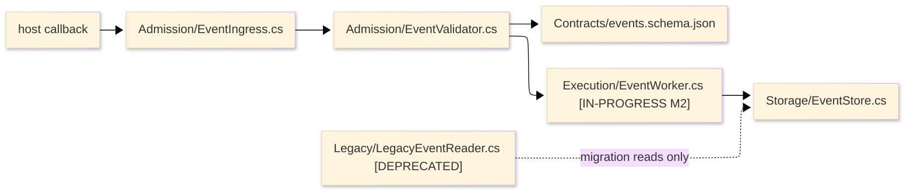
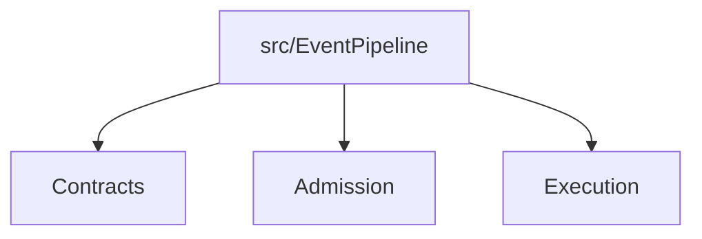

# [ARCHITECTURE_STANDARDS]

An architecture document helps an agent understand the code scope it is about to edit. The scope may be a repository, solution, package, project, module, feature folder, generated-contract boundary, or directory. The document explains current structure, manifests, entrypoints, dependency direction, logic flow, invariants, status-bearing paths, and proof that the representation still matches the repository.

The controlling rule: architecture starts from code. The primary representation is a dense text codemap built from real paths, project files, package manifests, generated outputs, public contracts, and entrypoints. Diagrams are secondary and show relationships that a directory tree cannot: how work enters the scope, how calls or data flow, what depends on what, which boundary is forbidden, and where a roadmap item temporarily changes the current reading.

## [1][USE_WHEN]

Use an architecture document when a future agent must understand a maintained code area before changing it:
- repository, solution, workspace, package, project, module, folder, or directory boundaries;
- project files, package manifests, generated artifacts, public contracts, exports, commands, host callbacks, routes, or UI entrypoints;
- dependency direction, allowed imports, forbidden couplings, routing boundaries, and current adjacent routes;
- code logic flow across entrypoints, validation, orchestration, adapters, storage, runtime hosts, or generated surfaces;
- invariants that protect the shape of the code and the checks that prove them;
- roadmap, design, ADR, support, or test-strategy facts that change how current paths must be read.

Route decision rationale to [adr.md](adr.md), proposed change review to [design-doc.md](design-doc.md), implementation sequence to [roadmap.md](roadmap.md), gate taxonomy to [test-strategy.md](test-strategy.md), operational recovery to [runbook.md](../task/runbook.md), generated API contracts to [api.md](../reference/api.md), and public symbol intent to [code-documentation.md](../reference/code-documentation.md). Link an adjacent document in the body only when it changes a path, entrypoint, dependency, invariant, status, or proof rule.

Authoring contract:
- Agent use: locate the code scope, decide whether a file belongs to the scope, preserve dependency direction, and verify that represented paths still match repository truth.
- Required produced structure: lead, scope boundary, project identity, contracts/generated truth, codemap, entrypoints and flows, dependency direction, invariants, status overlays, proof, boundaries, and checklist.
- Section cardinality: one scope boundary, one project identity, one codemap, one proof section, one boundaries section, and only diagrams or status overlays whose trigger changes code reading.
- Adjacent checks: roadmap for sequence and status, ADR/design for why or proposed changes, API/reference/code docs for public surfaces, support matrix for lifecycle, test strategy for proof gates, runbook for operations.
- Maintenance triggers: path move, project or manifest change, generated output change, public contract change, entrypoint change, dependency edge change, invariant change, support row change, or roadmap status change.
- Stale prevention: every status marker has a removal trigger; every diagram node maps to a path, contract, runtime boundary, generated artifact, or external route.

Architecture view discipline:
- arc42 informs useful categories; this local section order controls the produced document.
- C4 Context, Container, and Component are view levels, not required headings. A C4 Container is a deployable or executable runtime unit, not a package, library, or folder. A C4 Component appears only inside a named container.
- Structurizr or another checked-in model is the model source only when repository tooling already carries it. Mermaid is renderer source, not the canonical architecture model.

## [2][CODE_SCOPE_PLACEMENT]

Choose the narrowest code scope that lets the reader make a safe edit. This is placement, not a ranking.

| [INDEX] | [CODE_SCOPE]                                  | [PLACE_ARCHITECTURE_HERE]  | [MUST_EXPLAIN]                                              |
| :-----: | :-------------------------------------------- | :------------------------- | :---------------------------------------------------------- |
|   [1]   | repository or solution                        | root `ARCHITECTURE.md`     | project graph, package families, shared build/runtime flow  |
|   [2]   | package, app, library, tool, host integration | route `_ARCHITECTURE.md`   | project identity, public surface, entrypoints, dependencies |
|   [3]   | module or feature folder                      | folder `_ARCHITECTURE.md`  | local codemap, local flow, adjacent folders, invariants     |
|   [4]   | small directory with one entrypoint           | parent `README.md` section | compact codemap and one invariant record                    |

Keep one architecture route per code scope. If two documents explain the same package or folder, merge them or route one to the other. Promote a README section to `_ARCHITECTURE.md` when the directory gains a project file, package manifest, generated contract, more than one entrypoint, nontrivial flow, dependency rule, or roadmap-status overlay.

## [3][REQUIRED_STRUCTURE]

Use this heading order for a standalone architecture file. Embedded architecture uses the same content under the parent README.

```markdown template
# [<CODE_SCOPE>_ARCHITECTURE]

<Lead: name the code scope, current route promise, project or package identity, primary codemap proof, and route-away for decisions and future sequence.>

## [1][SCOPE_BOUNDARY]

## [2][PROJECT_IDENTITY]

## [3][CONTRACTS_GENERATED_TRUTH]

## [4][CODEMAP]

## [5][ENTRYPOINTS_AND_FLOWS]

## [6][DEPENDENCY_DIRECTION]

## [7][INVARIANTS]

## [8][STATUS_AND_ROADMAP]

## [9][PROOF]

## [10][BOUNDARIES]

## [11][CHECKLIST]
```

Add these conditional sections only when their trigger applies:

```markdown template
## [N][RUNTIME_BOUNDARY]

<Insert after `Entrypoints and flows` only when process, host, device, worker, generated runtime, or resource placement changes code routing or proof.>

## [N][GLOSSARY]

<Insert before `Boundaries` only when names cannot be inferred from paths, manifests, contracts, or public symbols.>
```

Required sections are required because agents need them in order: identify scope, locate project truth, read the codemap, follow work through entrypoints, understand dependency constraints, preserve invariants, handle current status, verify drift-prone claims, and route adjacent concerns.

An accepted lead is concrete enough to start work:

```markdown conceptual
# [EVENT_PIPELINE_ARCHITECTURE]

This architecture explains `src/EventPipeline/` as the `EventPipeline.csproj` package that carries host event admission, generated event contracts, worker execution, and persistence boundaries. The codemap was refreshed from repository paths and the project file; ADRs own why the public schema exists, and the roadmap carries unfinished contract-freeze work.
```

Reject a lead that describes a system without code anchors:

```markdown rejected
# [EVENT_SYSTEM]

This document describes the event system at a high level.
```

## [4][SECTION_RULES]

Each section carries one agent action:

| [SECTION]                       | [AGENT_ACTION]                                                                             | [UPDATE_TRIGGER]                                                                                  |
| :------------------------------ | :----------------------------------------------------------------------------------------- | :------------------------------------------------------------------------------------------------ |
| `Scope boundary`                | decide whether this page covers the file being edited                                      | path, route, generated directory, host boundary, or exclusion changes                             |
| `Project identity`              | locate manifests, build targets, package exports, generated outputs, and command surfaces  | project file, package manifest, build target, export, or generated path changes                   |
| `Contracts and generated truth` | identify public contracts, generators, generated artifacts, edit rule, and reference route | schema, generator, source comments, generated artifact, API reference, or public contract changes |
| `Codemap`                       | understand the current directory and routing shape                                         | path moves, new entrypoint, deleted folder, generated output, or status-bearing path changes      |
| `Entrypoints and flows`         | trace how work enters and moves through code                                               | route, command, callback, public type, worker, adapter, or validation path changes                |
| `Dependency direction`          | preserve allowed import/call direction                                                     | dependency, reference, package edge, layer rule, or forbidden coupling changes                    |
| `Invariants`                    | know what must remain true and how to check it                                             | invariant, proof gate, architecture rule, support row, or test strategy gate changes              |
| `Status and roadmap`            | interpret provisional, planned, blocked, deprecated, or dropped paths                      | milestone, design, ADR, support row, or status resolution changes                                 |
| `Proof`                         | verify that representations still match code                                               | any represented path, manifest, diagram node, contract, flow, or invariant changes                |

Do not add a section for a concern that has no current reader action. Do not keep a status note after the path becomes ordinary current structure or pure release history.

## [5][SCOPE_BOUNDARY_AND_PROJECT_IDENTITY]

`Scope boundary` states what this architecture covers and what it refuses to cover. Name real paths, project files, package manifests, generated directories, public contracts, commands, host references, adjacent routes, and exclusions.

```markdown template
Included: `src/EventPipeline/`, `EventPipeline.csproj`, `Contracts/events.schema.json`, generated event reference.
Excluded: legacy export retirement after the compatibility window; support matrix carries timing.
Adjacent routes: `src/HostAdapter/` admits host callbacks; `docs/reference/api/` carries generated contract reference.
Reader rule: edits under `Admission/`, `Execution/`, or `Contracts/` must check this architecture first.
```

`Project identity` lets an agent locate the build/package truth before editing. Include only identities that exist for the scope.

```markdown template
Project file: `src/EventPipeline/EventPipeline.csproj`
Package or export surface: `EventPipeline` public contract API
Build target: `EventPipeline.csproj`
Generated outputs: `Contracts/events.schema.json`, generated reference page
Primary commands: `<exact build/test/doc command when this architecture carries one>`
Host or runtime boundary: host callback enters through `Admission/EventIngress.cs`
```

Do not invent a manifest, command, export, or generated output to fill the section. Absence is useful only when it changes behavior, such as "this folder has no project file; build proof comes from the parent project."

`Contracts and generated truth` is required when the scope exposes a public contract, generated file, generated reference, command output contract, host metadata surface, schema, or source-generated public symbol family. It prevents architecture from becoming an API catalog while still showing which generated artifacts make the code safe to edit.

```markdown template
Surface: `EventPipeline` event contract.
Public contract: `Contracts/events.schema.json`.
Generated artifact: generated event reference page.
API/reference route: generated API page under the reference route.
Code-documentation route: public `EventEnvelope` comments.
Edit rule: edit the source contract and regenerate; do not hand-edit generated output.
Evidence: generated contract path or generation proof.
Generated from: contract generator command or build target.
Source of truth: schema source and contract generator configuration.
Last verified: YYYY-MM-DD
Review trigger: schema, generator, public envelope type, generated artifact path, or API reference route changes.
Route-away: operation details, parameters, fields, and generated symbol catalog stay in [api.md](../reference/api.md) and [code-documentation.md](../reference/code-documentation.md).
```

When the architecture needs a compact routing map, use this order:

Architecture-local structure records may lead with identity and routing fields; once they carry adjacent-document facts, use the shared relation fields in order: `Changed fact`, `Consumed by`, `Use in this document`, `Update when`, `Close when`, `Route-away`.

```markdown template
Path or surface: `<path, contract, command, generated output, or public surface>`
Carries: `<current architecture responsibility>`
Does not own: `<body routed away>`
Changed fact: `<boundary, public contract, command, generated output, or route edge>`
Consumed by: `<document or code scope>`
Use in this document: `<route, preserve, avoid, or verify action this architecture performs>`
Update when: `<fact that makes the consuming route authoritative>`
Close when: `<routing edge no longer affects architecture or the consuming standard routes it away>`
Route-away: `<body that stays in the consuming route>`
```

## [6][CODEMAP]

The codemap is the controlling representation. Derive it from repository paths, project files, package manifests, generated artifacts, public contracts, and host references. Include two or three directory levels by default. Include a leaf only when it is an entrypoint, public contract, manifest, generated source, central algorithm, public export, adapter, invariant route, or status-bearing path.

Path routes should be compact and current: package boundary, public contract, generated artifact, entrypoint, adapter, invariant route, public export, central algorithm, or support-controlled legacy path. A planned, dropped, or deleted path never appears in the codemap; represent it only as a status relation when it changes how current paths are read.

Architecture path-state markers use this closed vocabulary when bracketed inline markers change editing behavior:
- `[IN-PROGRESS]`: path exists or is moving and current edits must check the linked roadmap or design.
- `[BLOCKED]`: path or surface cannot become current until a named dependency, decision, or proof gap closes.
- `[PROVISIONAL]`: path is current but not yet stable enough to treat as ordinary structure.
- `[DEPRECATED]`: path remains readable or callable only under a support, migration, or compatibility rule.

A useful codemap shows structure, route, project identity, and status in one place:

```text conceptual
src/EventPipeline/
├── EventPipeline.csproj              package boundary; exports event contract API
├── Directory.Packages.props          package version truth when this package carries it
├── Contracts/
│   ├── events.schema.json            generated public contract; ADR-0007 controls shape
│   └── EventEnvelope.cs              public typed envelope; code docs own caller semantics
├── Admission/
│   ├── EventIngress.cs               host callback entrypoint into validation
│   └── EventValidator.cs             rejects schema drift before queue admission
├── Execution/
│   ├── EventWorker.cs                [IN-PROGRESS M2] executes accepted events
│   └── RetryPolicy.cs                transient host-failure policy
├── Storage/
│   └── EventStore.cs                 persistence boundary; no direct caller writes
└── Legacy/
    └── LegacyEventReader.cs          [DEPRECATED] migration reads only; support row controls removal
```

When status appears in the tree, add a path-state record and codemap source block beside the codemap. The record gives agents a single place to update or delete the status, and the proof block keeps the tree from becoming decorative structure.

| [INDEX] | [PATH]                     | [STATE]       | [WHY_IT_CHANGES_READING]       | [ADJACENT_SOURCE] | [UPDATE_WHEN]                     | [REMOVAL_TRIGGER]             |
| :-----: | :------------------------- | :------------ | :----------------------------- | :---------------- | :-------------------------------- | :---------------------------- |
|   [1]   | `Execution/EventWorker.cs` | [IN-PROGRESS] | M2 still moves execution route | roadmap M2        | M2 status or worker path changes  | M2 reaches `DONE`             |
|   [2]   | `Legacy/`                  | [DEPRECATED]  | migration reads remain allowed | support row       | compatibility support row changes | support row reaches `Retired` |

```markdown template
Representation: codemap
Evidence: repository path inspection, project file, manifest, generated artifact, review, or proof gap.
Generated from: <tree command, manifest query, generated output, or omitted when hand-reviewed>
Source of truth: repository paths, project files, package manifests, generated contract, and host references.
Last verified: YYYY-MM-DD
Review trigger: path, project, manifest, generated contract, support row, or roadmap status changes.
```

Use path-state markers only for facts that change editing behavior. Remove them when the state no longer changes code reading.

## [7][ENTRYPOINTS_AND_FLOWS]

Entrypoints name how work enters the code scope. Use records or a table when the reader must compare entrypoint type, input contract, data carrier, failure carrier, next route, public effect, and proof.

| [INDEX] | [ENTRYPOINT]                | [KIND]        | [INPUT_OR_CONTRACT]  | [DATA_CARRIER]           | [FAILURE_CARRIER] | [NEXT_ROUTE]                  | [PUBLIC_EFFECT]             |
| :-----: | :-------------------------- | :------------ | :------------------- | :----------------------- | :---------------- | :---------------------------- | :-------------------------- |
|   [1]   | `Admission/EventIngress.cs` | host callback | `events.schema.json` | raw host event           | validation result | `Admission/EventValidator.cs` | rejects invalid event input |
|   [2]   | `Execution/EventWorker.cs`  | worker loop   | `EventEnvelope`      | validated event envelope | worker fault      | `Storage/EventStore.cs`       | persists accepted event     |

For record-shaped entrypoints, keep fields in this order:

```markdown template
Entrypoint: `<file, command, callback, route, public type, host hook, generated surface, or worker>`
Kind: `<command | host callback | public type | generated surface | route | worker | adapter>`
Input or contract: `<schema, DTO, command args, callback payload, source path, or none>`
Data carrier: `<value, envelope, event, request, stream, receipt, or state object>`
Failure carrier: `<typed result, fault, exception, status, validation, diagnostic, or none>`
Next route: `<path, package, generated artifact, external route, or terminal>`
Public effect: `<caller-visible behavior, emitted artifact, persisted state, or side effect>`
Update trigger: `<entrypoint, contract, carrier, failure mode, next route, or public effect changes>`
```

Use Mermaid for logic flow only when it clarifies ordering or boundary crossing. Every node must map to a codemap path, public contract, project/package surface, host boundary, generated artifact, or external route. Status and roadmap labels are allowed only when they change how the flow is read.



Text equivalent: host callbacks enter `Admission/EventIngress.cs`, validation checks the generated contract, accepted events move through `Execution/EventWorker.cs`, persisted state passes through `Storage/EventStore.cs`, and deprecated legacy reads remain isolated from the admission path.

Reject diagrams that redraw folders:



The rejected diagram adds boxes around the codemap without showing flow, dependency, boundary, state, or proof.

Use C4 or topology diagrams only when a simpler codemap, table, or Mermaid flow loses reader action:
- C4 Context: multiple systems or external actors cross the code scope boundary.
- C4 Container: deployment or process containers decide safe edits or proof.
- C4 Component: one container has multiple code components whose dependency direction matters.
- Deployment or resource topology: runtime placement, host process, storage, device, bridge, or generated resource placement changes routing or verification.

Every C4 or topology node maps to a codemap path, manifest, runtime boundary, generated artifact, public contract, or external route. Each diagram carries a nearby text equivalent plus representation proof: source or proof gap, element match, and review trigger. If a diagram cannot name that mapping, use prose or a table instead.

## [8][DEPENDENCY_DIRECTION]

Dependency representation answers what may import, call, reference, or generate what. Use the smallest structure that prevents wrong edits. For a tiny scope, a monospace edge list is enough:

```text conceptual
Allowed direction:
Admission -> Contracts
Admission -> Execution
Execution -> Storage
Legacy -/-> Admission
Storage -/-> Admission
```

Use a matrix when several folders or packages have comparable dependency rules:

| [FROM]       | [MAY_DEPEND_ON]            | [MUST_NOT_DEPEND_ON]       | [CHECK]                |
| :----------- | :------------------------- | :------------------------- | :--------------------- |
| `Admission/` | `Contracts/`, `Execution/` | `Storage/` direct writes   | dependency gate        |
| `Execution/` | `Contracts/`, `Storage/`   | `Legacy/`                  | review gate            |
| `Storage/`   | package primitives only    | `Admission/`, `Execution/` | build or analyzer gate |

Use one representation for one edge set. Use the monospace list for a tiny boundary, a matrix for comparable folders or packages, and Mermaid only when relationship shape is easier to scan visually than either text form.

## [9][INVARIANTS]

Write invariants as records when the rule has a forbidden shape, proof gate, or adjacent route.

```markdown template
### [N.M][NO_DIRECT_STORAGE_WRITES]

Rule: event writes pass through `Execution/EventWorker.cs`.
Forbids: `Admission/` calling `Storage/EventStore.cs` write APIs directly.
Check: dependency gate or review check rejects `Admission/ -> Storage/` write paths.
Adjacent relation:
    Changed fact: M2 moves execution routing while the dependency gate is being wired.
    Consumed by: roadmap M2 and test-strategy dependency gate.
    Use in this document: the invariant is enforced as a current architecture boundary while work is in progress.
    Update when: M2 closes, defers, or the dependency gate changes.
    Close when: the architecture invariant no longer depends on roadmap or test-strategy status.
    Route-away: milestone tasks and gate taxonomy stay in roadmap and test strategy.
```

Reject invariants that cannot guide an edit:

```markdown rejected
Invariant: the package stays clean and modular.
```

## [10][STATUS_AND_ROADMAP]

Architecture may include roadmap and status only when those facts change current code reading. It is not a task tracker, progress report, or release log. When a linked milestone exists, architecture maintenance must check whether the milestone still changes a codemap path, flow node, dependency edge, or invariant; remove the overlay when it closes, defers without current effect, or moves to release history.

Use this record when a status-bearing fact affects a codemap path, flow node, dependency edge, or invariant:

```markdown template
Changed fact: <path, project, package, entrypoint, contract, flow, dependency, or invariant>
Consumed by: <codemap, flow, dependency matrix, invariant, or proof section>
Use in this document: <edit, avoid, preserve, route, verify, or remove once complete>
Update when: <path, milestone, support row, ADR, design, or gate changes>
Close when: <event that deletes the status note from architecture>
Route-away: <task, progress, proposal, incident, support body, or proof taxonomy that stays in the adjacent route>
```

If a milestone changes both structure and flow, show it in both representations only when each representation carries a distinct reader job: the codemap path-state row carries removal and adjacent proof, and the flow label carries behavior reading. Do not repeat task counts, progress, dates, or proof in both places. Progress, task counts, dates, and completed history stay in the roadmap or release route.

## [11][PROOF]

Architecture proof is representation-level. Place proof beside each drift-prone codemap, path-state row, entrypoint table, diagram, dependency matrix, invariant, generated contract, or status record.

```markdown template
Representation: <codemap, entrypoint table, flow diagram, dependency matrix, invariant, or status record>
Evidence: <repo paths, project file, package manifest, generated contract, command, review, or proof gap>
Generated from: <tree, manifest query, model, generated contract, or command; omit when hand-reviewed>
Source of truth: <repo paths, project files, manifests, generated outputs, public contracts, or host references>
Last verified: YYYY-MM-DD
Review trigger: <path, project, manifest, contract, roadmap, support, or gate change>
Element match: <how represented nodes, paths, edges, or records map to repository truth>
Result: <what was verified>
```

Do not claim a representation reflects code unless its paths, manifests, contracts, nodes, and edges were checked against the current repository during the change. If proof is human review rather than a configured command, state that gap.

## [12][BOUNDARIES]

- [adr.md](adr.md) carries why a durable architecture choice was made.
- [design-doc.md](design-doc.md) carries proposed architecture changes before acceptance.
- [roadmap.md](roadmap.md) carries implementation sequence, task IDs, progress, dependencies, and exit proof.
- [test-strategy.md](test-strategy.md) carries gate taxonomy, flake policy, and test proof vocabulary.
- [runbook.md](../task/runbook.md) carries operational recovery and incident response.
- [api.md](../reference/api.md) carries generated endpoint and contract reference.
- [code-documentation.md](../reference/code-documentation.md) carries public symbol intent and caller semantics.
- [readme.md](../reference/readme.md) carries adoption entrypoints and navigation.
- External-library adoption pages may name current paths only as relation records unless they own a codemap, entrypoint flow, dependency direction, invariant, or generated-contract boundary.
- [README.md](../README.md) carries document-type routing, placement, and lifecycle.

## [13][CHECKLIST]

- [ ] The document explains a repository, solution, package, project, module, folder, or directory that an agent may edit.
- [ ] Placement is the narrowest code scope that makes editing safe.
- [ ] The lead names code scope, project or package identity, codemap proof, and adjacent routes for decisions or future work.
- [ ] `Scope boundary` names included paths, generated directories, project files, package manifests, host references, adjacent routes, and exclusions.
- [ ] `Project identity` names manifests, build targets, package surfaces, generated outputs, commands, and public exports when they exist.
- [ ] Contracts and generated truth name public contract, source of truth, generated artifact, edit rule, API/reference route, and update trigger.
- [ ] The codemap is the primary representation and derives from current repository paths and manifests.
- [ ] Path-state markers come from the declared architecture marker set, change editing behavior, and carry a removal trigger.
- [ ] Entrypoints name input contracts, data carriers, failure carriers, next routes, public effects, and update triggers.
- [ ] Flow diagrams show logic flow, dependency direction, state, boundary crossing, or runtime placement, never a directory tree in boxes.
- [ ] Every diagram node maps to a codemap path, contract, project/package surface, host boundary, generated artifact, or external route.
- [ ] C4 or topology diagrams appear only when runtime, container, component, actor, or deployment placement changes reader action or proof.
- [ ] Every architecture diagram has a visible text equivalent and representation proof beside it.
- [ ] Dependency direction states allowed and forbidden edges.
- [ ] Invariants are observable, forbid a concrete shape, and name the check that proves them.
- [ ] Roadmap and status facts use shared relation fields and appear only where they change current code reading.
- [ ] Drift-prone representations carry evidence and review triggers.
