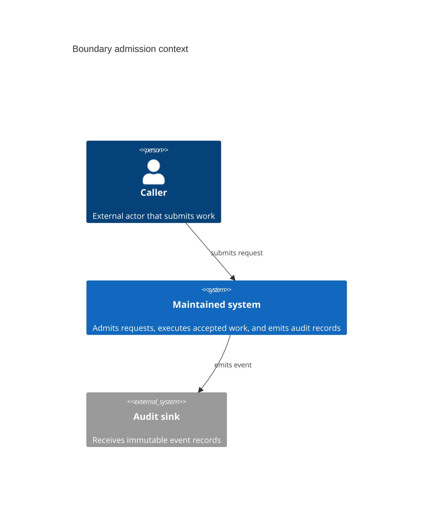
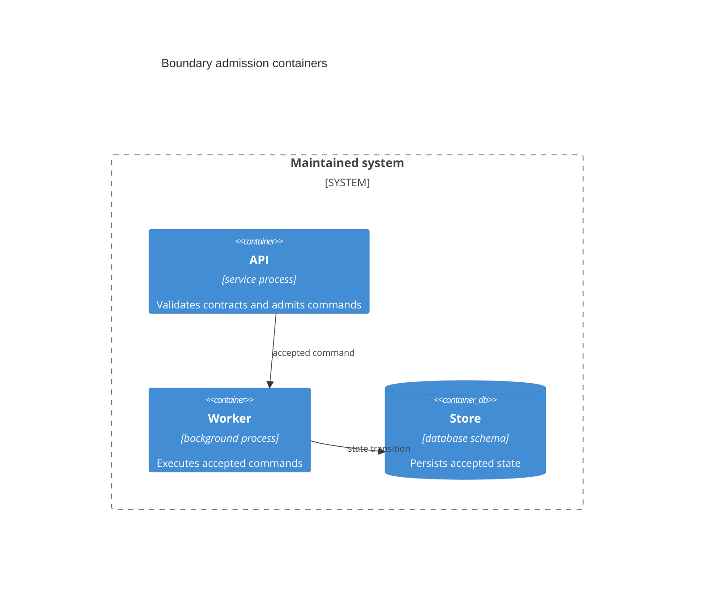

# [ARCHITECTURE_STANDARDS]

An architecture document explains the current structure of a maintained scope: its boundaries, building blocks, relationships, invariants, runtime or deployment shape when those explain a constraint, and the proof that keeps the explanation matched to repository truth. It is an explanation artifact. It states what the system is now and which shapes are forbidden; it does not record why a durable decision was made, sequence unbuilt work, drive incident response, or catalog an API surface.

## [1][USE_WHEN]

Use an architecture document when a reader must understand current structure rather than complete a task. Reach for it when the reader needs:

- system, package, owner, host, or runtime boundaries and what each owns;
- building blocks, their relationships, and the codemap that grounds them;
- invariants, constraints, quality trade-offs, and shapes the system rejects;
- current topology, runtime flow, or deployment placement that explains an invariant.

Route decision rationale to ADRs, build sequence and exit criteria to roadmaps, operational recovery to runbooks, and generated endpoint or symbol surfaces to API or reference documentation. When a draft mixes current structure with those concerns, split it and keep the architecture page to current structure and invariants.

## [2][ARCHITECTURE_BASELINES]

This standard defines local architecture-document profiles grounded in arc42 and C4; it does not claim the local profiles are the external templates verbatim. arc42 supplies architecture explanation categories, C4 supplies runtime-oriented diagram abstraction levels and supporting diagram types, Structurizr supplies a model-as-code option when the repository already uses it, and Mermaid supplies Markdown renderer syntax only.

- arc42 owns the architecture-section vocabulary: Introduction and goals, Constraints, Context and scope, Solution strategy, Building-block view, Runtime view, Deployment view, Crosscutting concepts, Architecture decisions, Quality requirements, Risks and technical debt, and Glossary. This local standard routes decision rationale out to ADRs even though arc42 names architecture decisions as an architecture-document category.
- C4 owns static diagram levels: Context, Container, Component, and Code. C4 Container means a deployable or executable runtime unit such as an application, data store, or service boundary; a package, library, assembly, or module is not a C4 Container merely because it contains code.
- Structurizr DSL owns authored-model consistency only when repository tooling or an existing architecture corpus already uses it.
- Mermaid C4 and Mermaid architecture syntax are renderer sources, not architecture models. Mermaid C4 is acceptable only with an explicit renderer-stability proof gap; Mermaid `architecture-beta` is for deployment or resource topology, not a generic substitute for C4.

Source of truth: [arc42 template overview](https://arc42.org/overview), [C4 diagram model](https://c4model.com/diagrams), [C4 Container abstraction](https://c4model.com/abstractions/container), [C4 notation guidance](https://c4model.com/diagrams/notation), [Structurizr DSL](https://docs.structurizr.com/dsl), [Mermaid C4 diagrams](https://mermaid.js.org/syntax/c4), and [Mermaid architecture diagrams](https://mermaid.js.org/syntax/architecture).
Last verified: 2026-06-04
Review trigger: arc42 section set, C4 diagram semantics, Structurizr DSL, Mermaid C4, or Mermaid architecture syntax changes.

## [3][SCALE_PROFILES]

Select one profile by the scope the document governs. A profile fixes placement, minimum structural proof, and diagram floor. Use one architecture owner per scope; subordinate architecture scopes live in child directories or link clearly from the parent rather than competing at the same level.

| [INDEX] | [PROFILE]      | [SCOPE]                         | [FILE_NAME]            | [DIAGRAM_FLOOR]                         | [PROOF_FLOOR]       |
| :-----: | :------------- | :------------------------------ | :--------------------- | :-------------------------------------- | :------------------ |
|   [1]   | Landscape      | system, tool, host, or runtime  | `ARCHITECTURE.md`      | C4 Context + Container                  | codemap + diagrams  |
|   [2]   | Owner-contract | package or sub-concern boundary | `_ARCHITECTURE.md`     | none; C4 Component only inside runtime  | codemap + contracts |
|   [3]   | Embedded       | single directory, one entry     | section in `README.md` | none; codemap text only                 | local paths         |

Profile selection rules:

- Use `Landscape` when the scope crosses two or more owners, hosts, deployable units, or runtimes.
- Use `Owner-contract` when the scope is one package or sub-concern with a public contract consumers depend on. Do not draw it as a C4 Container unless it is itself a runtime container; use a C4 Component only when the package is inside a named container.
- Use `Embedded` only when the directory has one entry point, exposes no cross-owner contract, and is readable from a small codemap. Promote it when a second owner or cross-package contract appears.

## [4][REQUIRED_STRUCTURE]

Use the required template for the selected profile as the base heading set. The opening definition block makes profile selection, ownership, source paths, and proof freshness visible before a reader sees diagrams or codemaps. Add conditional sections only from the addition blocks when their trigger holds, then renumber headings in document order.

Landscape template:

```markdown template
# [SCOPE_ARCHITECTURE]

Profile: Landscape
Scope: <system, tool, host, or runtime boundary>
Owner: <owner role or group>
Source paths: <repo paths, manifests, or generated contracts>
Diagram floor: C4 Context + Container
Proof floor: codemap + diagrams
Last verified: YYYY-MM-DD
Review trigger: <event that makes the architecture stale>

## [1][SCOPE_GOALS]

## [2][CONTEXT_SCOPE]

## [3][SOLUTION_STRATEGY]

## [4][BUILDING_BLOCKS]

## [5][INVARIANTS]

## [6][DIAGRAM_CODEMAP_PROOF]

## [7][BOUNDARIES]

## [8][REVIEW_CHECKLIST]
```

Landscape conditional additions:

```markdown template
## [N][RUNTIME_SCENARIOS]

<Insert after `Invariants` when flow order proves a current invariant.>

## [N][DEPLOYMENT_VIEW]

<Insert after `Runtime scenarios`, or after `Invariants` when no runtime section exists, when placement or topology proves a current invariant.>

## [N][RISKS]

<Insert before `Diagram and codemap proof` when open architectural risks exist.>
```

Owner-contract template:

```markdown template
# [PACKAGE_ARCHITECTURE]

Profile: Owner-contract
Scope: <package or sub-concern boundary>
Owner: <owner role or group>
Source paths: <repo paths, manifests, or generated contracts>
Diagram floor: none, or C4 Component inside <runtime container>
Proof floor: codemap + contracts
Last verified: YYYY-MM-DD
Review trigger: <event that makes the architecture stale>

## [1][PURPOSE_BOUNDARY]

## [2][PUBLIC_CONTRACTS]

## [3][OWNED_BLOCKS]

## [4][INVARIANTS]

## [5][DIAGRAM_CODEMAP_PROOF]

## [6][BOUNDARIES]

## [7][REVIEW_CHECKLIST]
```

Owner-contract conditional additions:

```markdown template
## [N][BUILD_SUPPORT_STATUS]

<Insert after `Purpose and boundary` when build posture or support state changes the architecture boundary.>

## [N][CAPABILITY_CATALOG]

<Insert after `Owned blocks` only when current capabilities explain ownership or invariants.>
```

Shared conditional addition:

```markdown template
## [N][GLOSSARY]

<Insert before `Boundaries` when a first-time reader cannot infer terms from common domain vocabulary.>
```

Embedded template inside an owner README:

```markdown template
## [N][ARCHITECTURE]

Profile: Embedded
Scope: <single-directory concern>
Owner: <owner role or group>
Source paths: <local paths>
Proof floor: local paths
Last verified: YYYY-MM-DD
Review trigger: <event that makes the section stale>

### [N.1][PURPOSE_BOUNDARY]

### [N.2][CODEMAP]

### [N.3][INVARIANTS]

Rule: <observable architectural rule>
Forbids: <direct dependency, ownership leak, or shape this rule rejects>
Check: <path check, contract gate, review gate, or proof gap>
Proof: <current evidence path, command, or owner-reviewed source>
Linked gate: <test strategy gate, or none>
```

Section cardinality:

| [INDEX] | [PROFILE]      | [REQUIRED]                                                                                                      | [CONDITIONAL]                                                   |
| :-----: | :------------- | :-------------------------------------------------------------------------------------------------------------- | :-------------------------------------------------------------- |
|   [1]   | Landscape      | metadata, scope, context, strategy, blocks, invariants, proof, boundaries, checklist                             | runtime, deployment, risks, glossary                            |
|   [2]   | Owner-contract | metadata, purpose, contracts, owned blocks, invariants, proof, boundaries, checklist                             | build/support, capability catalog, glossary, C4 Component view  |
|   [3]   | Embedded       | metadata, purpose, codemap, invariants                                                                          | glossary only when the parent README can carry it without noise |

## [5][LANDSCAPE_SECTIONS]

Use an arc42-grounded order and keep each section tied to current repository truth:

1. Scope and goals: state the system boundary, top quality goals as falsifiable attributes, and hard constraints. A constraint names the bound and the consequence of crossing it.
2. Context and scope: name external actors and systems and the data or contract crossing the boundary. Use a record table when three or more actors share fields.
3. Solution strategy: state top architectural choices and the quality goal each serves. A strategy that serves no stated goal is decoration.
4. Building blocks: decompose into C4 Containers only for deployable or executable runtime units; otherwise use owner blocks bound to current repository paths. The codemap and C4 Container view must describe the same runtime decomposition.
5. Invariants: state each invariant as an observable, falsifiable rule with the boundary and check that proves it. Rejected shapes name the forbidden construction and failure mode.
6. Risks: include only when open architectural risks exist; record them as status-tagged records with `Status`, `Exit`, `Owner`, and `Proof` or mitigation.
7. Runtime scenarios: include only when ordered cross-container behavior proves a current invariant; use one Dynamic view per scenario.
8. Deployment view: include only when host placement, runtime boundary, or topology proves a current invariant.
9. Diagram and codemap proof: close on how codemap, diagrams, contracts, and drift-prone facts were refreshed against repository truth.

Architecture documents may link ADRs, roadmaps, design documents, and test strategies where a reader needs rationale, future sequence, proposal context, or gate ownership, but they do not summarize those bodies.

## [6][OWNER_CONTRACT_SECTIONS]

Use the compact profile for a package or sub-concern boundary:

1. Purpose and boundary: state the one concern the package owns and the adjacent concerns it explicitly does not.
2. Public contracts: list exported contracts consumers depend on. Each contract record names the signature, schema, generated reference, or documented surface and the consumer boundary.
3. Owned blocks: list internal blocks that implement the public contracts and bind each to current paths. These are repository blocks unless they are components inside a named runtime container.
4. Invariants: use the same observable rule and rejected-shape contract as the landscape profile.
5. Diagram and codemap proof: name how paths, contracts, and any optional diagram were refreshed.

Future contracts and sequencing belong in design documents or roadmaps. A current provisional contract may appear only when the architecture already exposes it and the record carries evidence plus a review trigger.

For `Embedded`, the parent README owns document-level boundaries and review checklist unless the embedded architecture section becomes large enough to promote to its own architecture file.

## [7][REQUIRED_STRUCTURES]

These structures are mandatory wherever the matching content appears; flat prose for any of them is a defect.

| [INDEX] | [CONTENT_KIND]                 | [REQUIRED_STRUCTURE]                      | [WHERE_IT_APPLIES]                 |
| :-----: | :----------------------------- | :---------------------------------------- | :--------------------------------- |
|   [1]   | Open architectural risks       | status-tagged records                     | risks section                      |
|   [2]   | Glossary terms                 | definition block                          | conditional glossary               |
|   [3]   | External actors and data       | record table or grouped definition blocks | context and scope                  |
|   [4]   | Runtime containers             | record table plus C4 Container view       | Landscape building blocks          |
|   [5]   | Owner blocks and contracts     | record table plus text codemap            | Owner-contract and Embedded blocks |
|   [6]   | Invariants and rejected shapes | one observable rule per record            | invariants                         |
|   [7]   | Diagram-type selection         | decision table by reader question         | C4 view selection                  |
|   [8]   | Cross-document anchors         | relationship records                      | boundaries and handoff notes       |
|   [9]   | Review gates                   | verification checklist                    | review checklist                   |

Render open risks with the shared `Status` vocabulary (`PLANNED`, `IN-PROGRESS`, `BLOCKED`, `DONE`, `DROPPED`). A risk that lacks an `Exit` condition is an architectural worry, not a tracked risk:

```markdown template
### [N.M][CHECKPOINT_FORMAT]

Status: IN-PROGRESS
Exit: checkpoint headers carry a version byte; the loader rejects unknown versions.
Owner: runtime maintainers
Proof: loader fixture output.
```

When three or more external actors cross a boundary, use an actor record table; when one actor needs proof or caveats, use a grouped definition block instead:

```markdown conceptual
| [INDEX] | [ACTOR]              | [DIRECTION] | [DATA_CONTRACT]                    |
| :-----: | :------------------- | :---------- | :--------------------------------- |
|   [1]   | Client application   | inbound     | request envelope; auth context     |
|   [2]   | Notification service | outbound    | event envelope; delivery contract  |
|   [3]   | Audit sink           | outbound    | serialized payload; retention rule |
```

Render runtime containers only for deployable or executable runtime units, and keep this table aligned with the Container view:

```markdown conceptual
| [INDEX] | [CONTAINER] | [RUNTIME_UNIT]       | [OWNS]                  | [SOURCE_PATH]       |
| :-----: | :---------- | :------------------- | :---------------------- | :------------------ |
|   [1]   | API         | service process      | request admission       | `service/api/`      |
|   [2]   | Worker      | background process   | async policy execution  | `service/worker/`   |
|   [3]   | Store       | database schema      | durable state contract  | `service/storage/`  |
```

Render owner contracts and owner blocks as field records when proof or rejected shape matters:

```markdown template
### [N.M][PUBLIC_CONTRACT_NAME]

Contract: <signature, schema, generated reference, or documented surface>
Consumer: <owner or boundary that depends on it>
Source path: <current path or generated contract>
Boundary: <what this contract admits or rejects>
Evidence: <path, command, generated reference, or proof gap>
Linked block: <block path and invariant served, or none>
Rejected shape: <adjacent concern or direct dependency this contract must not own>
```

Render invariants as records by default. Use the compact table only when every invariant stays short:

```markdown conceptual
Invariant: every cross-owner call enters through `api/`.
Forbids: direct `domain/ -> storage/` dependency.
Check: configured dependency check fails on `domain/ -> storage/`.
Proof: dependency-check output or proof gap.
Linked gate: test strategy gate, or none.
```

```markdown conceptual
| [INDEX] | [RULE]       | [FORBIDS]          | [CHECK]          | [PROOF]       | [GATE] |
| :-----: | :----------- | :----------------- | :--------------- | :------------ | :----- |
|   [1]   | enter `api/` | direct persistence | dependency check | gate output   | TS-1   |
|   [2]   | isolate jobs | sync caller wait   | scenario review  | proof gap     | none   |
```

The rejected shape states intent with no observable check:

```markdown rejected
Invariant: the system is cleanly layered and well decoupled.
```

Use a relationship record when an architecture page links adjacent explanation owners:

```markdown template
Decision source: <ADR anchor, or none>
Design source: <design doc anchor, or none>
Architecture fact: <boundary, block, invariant, or path-status fact>
Roadmap milestone: <milestone anchor, or none>
Test strategy gate: <gate or proof owner, or none>
Support record: <support-matrix anchor, or none>
Why linked: <one sentence naming the architecture fact the adjacent document owns>
```

## [8][C4_VIEWS_DIAGRAMS]

C4 owns diagram semantics; the renderer does not. Select the diagram type from the reader question, and cap each top-level view at 7 boxes as a local readability and maintenance rule, not as a C4 requirement. Split a crowded view into a parent view and a drill-down rather than crowding one canvas. Keep level consistency: every element inside a Component view belongs to the container it drills into.

| [INDEX] | [READER_QUESTION]                     | [C4_VIEW]  | [WHEN_IT_IS_USED]                                            |
| :-----: | :------------------------------------ | :--------- | :----------------------------------------------------------- |
|   [1]   | Who and what does the system talk to? | Context    | `Landscape` profile                                          |
|   [2]   | What deployable units are inside?     | Container  | `Landscape` profile only                                     |
|   [3]   | How do parts of one container fit?    | Component  | `Owner-contract` only inside a named runtime container       |
|   [4]   | In what order does a flow execute?    | Dynamic    | flow order proves a current invariant                        |
|   [5]   | Where do units run and connect?       | Deployment | topology or placement proves an invariant                    |
|   [6]   | What code implements a component?     | Code       | generated reference or codemap, not hand-drawn architecture  |

Code-level diagrams stay out of hand-written architecture documents by local maintainability rule. When class or call structure is the subject, generated symbol reference or codemap proof carries it; hand-drawn code diagrams go stale too quickly.

Use a checked-in architecture model when repository tooling, a manifest, or the existing architecture corpus configures one. When no model tool is configured, authored Mermaid source is acceptable as a lightweight sketch only if the proof record names the source, renderer, source of truth, and proof gap. Mermaid C4 is renderer syntax with experimental-status risk; Mermaid `architecture-beta` is appropriate for deployment or resource topology, not generic component modeling.

Treat generated SVG, PNG, PlantUML, exported Mermaid, and static-site output as generated artifacts: edit the model or authored source, not the export.

The conceptual C4 Context and Container sources below are acceptable only when paired with the visible text equivalent and proof receipt that follow them:



Text equivalent: the Context view shows one external caller submitting work to the maintained system, and the maintained system emitting audit records to an external audit sink.



Text equivalent: the Container view drills into the maintained system as API, Worker, and Store runtime units, matching the runtime-container table and codemap.

```markdown template
Model/source: authored Mermaid C4 source in this document.
Renderer: Mermaid C4 rendered by `pnpm exec mmdc -i <markdown-file> -a .artifacts/mermaid -q`, or proof gap when that command is not run.
Codemap source: `service/api/`, `service/worker/`, `service/storage/`, and audit contract path.
Result: diagram, text equivalent, and codemap describe the same boundary.
Last verified: YYYY-MM-DD
Review trigger: boundary path, actor contract, renderer, or architecture model change.
```

## [9][CODEMAP]

Derive the codemap from the repository tree, never from intent. Include real paths at two or three directory levels, state the owner boundary each path holds, and omit a leaf file unless it is a public contract or central algorithm. Use lifecycle markers only when path state changes architecture reading; otherwise keep the tree unmarked.

```text conceptual
service/
├── api/        [DONE] owns HTTP contract and request admission
├── worker/     [IN-PROGRESS] owns async policy execution for M2
├── storage/    [DONE] owns persistence boundary and migrations
└── legacy/     [DROPPED] deprecated path retained only for migration reads
```

When path state matters, pair the tree with a compact path-state table rather than expanding tree comments:

```markdown conceptual
| [INDEX] | [PATH]      | [STATE]       | [OWNS]          | [PROOF]     | [ANCHOR] |
| :-----: | :---------- | :------------ | :-------------- | :---------- | :------- |
|   [1]   | `api/`      | [DONE]        | admission       | path check  | ADR-7    |
|   [2]   | `worker/`   | [IN-PROGRESS] | async execution | issue/112   | M2       |
|   [3]   | `legacy/`   | [DROPPED]     | migration reads | support row | none     |
```

A codemap entry that no longer resolves to a current path is a defect. Fix the path or remove the entry in the same change. For `Landscape`, the codemap and Container view must describe the same runtime decomposition; for `Owner-contract`, the codemap and public-contract records must describe the same owner boundary.

## [10][DIAGRAM_CODEMAP_PROOF]

Architecture proof is claim-level: name how each drift-prone fact was refreshed against repository truth beside the fact. Use one proof receipt for the document, and add claim-level evidence fields near any fact that needs stronger local proof.

```markdown template
Model/source: <checked-in model, authored diagram source, or none>
Renderer: <renderer or none>
Codemap source: <repo paths or manifest sources>
Path check: <command, local review, or proof gap>
Element match: <how diagram elements match codemap paths and contracts>
Result: <what was verified>
Proof gap: <none, or human-reviewed path match when no tool gate exists>
Last verified: YYYY-MM-DD
Review trigger: <source path, model, renderer, contract, or owner-boundary change>
```

Do not claim a diagram reflects the system unless its elements were checked against current paths during the change. When that check is human review rather than a tool gate, state the proof gap. Use `Evidence:`, `Last verified:`, `Review trigger:`, `Generated from:`, and `Source of truth:` only where the claim needs them, and place them beside the claim rather than in a page footer.

## [11][BOUNDARIES]

- [adr.md](adr.md) owns why a durable architectural choice was made; link it through a relationship record when a decision explains a current boundary.
- [design-doc.md](design-doc.md) owns proposal review before the current shape is accepted.
- [roadmap.md](roadmap.md) owns build sequence, milestones, and exit criteria; link it only for active future work or incomplete proof.
- [test-strategy.md](test-strategy.md) owns gate taxonomy when an invariant's check is a test gate.
- [runbook.md](../task/runbook.md) owns operational recovery and incident response.
- [api.md](../reference/api.md) owns generated endpoint and symbol surfaces.
- [readme.md](../reference/readme.md) owns entry points and adoption links.
- [README.md](../README.md) owns document-type routing, placement, and lifecycle.

## [12][REVIEW_CHECKLIST]

- [ ] Exactly one architecture profile is named in metadata, and placement matches the profile.
- [ ] One architecture owner governs the scope; subordinate scopes live in child directories or link clearly.
- [ ] The document's headings match the selected profile and omit conditional sections whose triggers do not hold, including `Risks` when no open architectural risk exists.
- [ ] Quality goals are falsifiable, and each solution-strategy choice binds to one.
- [ ] C4 Container appears only for deployable or executable runtime units; owner-contract documents use codemap and contracts unless an optional C4 Component view sits inside a named runtime container.
- [ ] Open risks are status-tagged records, and glossary terms appear only when needed.
- [ ] Context actors, runtime containers, owner blocks, contracts, diagram facts, and optional capability facts use the required structures.
- [ ] Required C4 views exist for the profile, meet the local 7-box cap or split the view, and carry visible text equivalents.
- [ ] Mermaid C4 and Mermaid architecture syntax are treated as renderer sources with proof gaps where needed.
- [ ] Every codemap path resolves to a current repository path, and codemap proof matches diagrams or contracts.
- [ ] Each invariant is observable and falsifiable with the check that proves it.
- [ ] Future work, proposal review, release sequence, and test-gate ownership are routed through relationship records to their owning documents.
- [ ] Drift-prone facts carry claim-level evidence and freshness fields.
