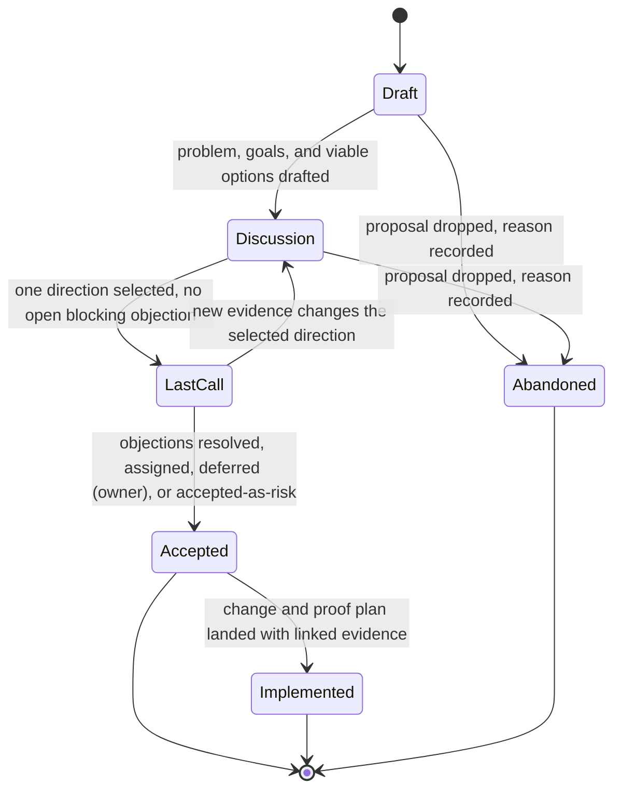

# Design document standards

A design document is a collaborative pre-implementation proposal that frames a problem, compares options, collects owner feedback, splits the change into reviewable slices, and states the proof plan before any durable decision or implementation change lands. It owns proposal and review history; it does not own the accepted decision, the build sequence, or the current structure. Route those to their owners by topic.

The canonical structure derives from Google's "Design Docs at Google" practice and IETF RFC review: context and scope, goals and non-goals, the actual design where the trade-offs are the point, alternatives considered with the deciding trade-off recorded, and the cross-cutting concerns a team standardizes. A design document carries exactly what a reviewer needs to challenge the trade-offs and no more — as short as possible and as long as necessary.

## Use when

Use a design document when work needs any of these before code lands:

- pre-code consensus across two or more owners or boundaries;
- comparison of two or more viable options with recorded trade-offs;
- a change split into independently reviewable, revertible slices;
- a bounded final-objection window after discussion converges;
- a proof plan that names the commands, contracts, and gates before merge.

Do not use a design document when there is no real trade-off to capture. A change with one obvious approach, no competing options, and no cross-boundary consequence does not earn a design document — write the code and route the rationale to a commit message or an inline comment. Do not use a design document for an already-accepted durable decision, milestone sequence and exit proof, operational symptom-to-fix response, lookup catalogs, generated contract truth, or contributor workflow. Reduce the draft to its single primary reader need; route the other needs to the owning type through the index.

## Requirement keywords

The words `must`, `should`, and `may` in this standard and in any design document carry their requirement, recommendation, and permission force in lowercase prose, following the craft standard's modal discipline and the intent of IETF BCP 14. Do not introduce bracketed, all-caps, or per-item requirement tags such as `[MUST]` or `[ALWAYS]` to mark normativity; that notation belongs to instruction files, not to this prose type, and reviving it here is notation spam this corpus rejects. Status, result, and lifecycle markers remain the only bracketed tokens, and only in the record and table cells the form standard assigns them.

## Variant profiles

One design-document type carries three review modes. Pick the profile from the decision's blast radius, then apply the shared required structure plus the profile's added obligations. A profile raises the bar; it never removes a required section.

| Profile | Trigger | Owner approval | Final-objection window | ADR handoff | Added obligation |
| --- | --- | --- | --- | --- | --- |
| Lightweight | One owner, one package, reversible in one slice | One accountable owner | Optional | Not required | May fold `Alternatives considered` into `Proposed approach` when only one option survived triage; `Cross-cutting implications` is not required (it is conditional on `Standard`/`RFC-wide`) |
| Standard | Two or more owners or packages, multi-slice | Each accountable owner | Required `Last Call` | Required when it sets durable architecture policy | Full `Review slices` table with dependency order and rollback boundary, and `Cross-cutting implications` in table form |
| RFC-wide | Cross-runtime, external contract, or public-surface change | Each owner plus a named final-comment driver | Required `Last Call` with a dated deadline and a notification channel | Required | `Cross-cutting implications` covers every applicable concern with an owner or an explicit `n/a` reason |

RFC-style review is a mode of this type, not a separate artifact. Do not fork content into a parallel RFC file unless an external hosting or governance process demands a distinct one; when it does, name that process and link the canonical copy.

## Authority

Source order decides a wording or scope question when sources disagree:

1. Current repository source, manifests, generated contracts, and prior accepted decisions that the proposal must respect.
2. This design-document standard for proposal shape, lifecycle, and review slices.
3. The five shared standards for position, form, craft, evidence, and notation.

A design document proposes; it never overrides an accepted decision. When a slice contradicts a prior accepted decision, the design must either supersede that decision through the decision-record handoff or narrow its own scope.

## Front matter and identity

Every design document opens with one definition block, one `label: value` per line. Field cardinality is fixed; an optional field is omitted, never left blank.

```markdown conceptual
Status: Draft | Discussion | Last Call | Accepted | Implemented | Abandoned
Profile: Lightweight | Standard | RFC-wide
Date: YYYY-MM-DD
Authors: <names or owner roles>
Reviewers: <consulted owners or review groups>
Last Call deadline: YYYY-MM-DD
Supersedes design: <path or none>
```

- `Status` required, single value, from the closed set above.
- `Profile` required, single value, from the closed set above; restate it in the lead sentence so a reader who lands mid-document knows the blast radius.
- `Date` required, single value, last substantive edit.
- `Authors` required, repeatable.
- `Reviewers` required at `Discussion` and later, repeatable.
- `Last Call deadline` required at `Last Call` and later for `Standard` and `RFC-wide`, single value; omit otherwise.
- `Supersedes design` optional, repeatable; present only when this proposal replaces an earlier one.

`Status` and `Profile` are the document's discriminants: an agent reads them to route the document to its lifecycle obligations and to gate the conditional sections. Keep both to a single value from the closed set so the routing stays drift-free.

## Required structure

The body uses the H2 order in the skeleton below. Each H2 is a standalone retrieval unit: it opens with what it controls and closes on its boundary or owner. Copy the skeleton, keep the headings verbatim, and fill each section with the structure the section rules require — not flat prose where a record, checklist, or table is mandated.

```markdown conceptual
Status: Draft
Profile: Lightweight | Standard | RFC-wide
Date: YYYY-MM-DD
Authors: <name or owner role>            # repeatable
Reviewers: <consulted owner or group>    # required at Discussion+, repeatable
Last Call deadline: YYYY-MM-DD           # required at Last Call+ for Standard / RFC-wide
Supersedes design: <path or omit>        # optional, repeatable

# <Change named as an outcome>

## Problem
<the controlling pressure and who feels it; one pressure per paragraph>

## Goals
- [ ] <outcome> — proven by <metric, threshold, or observable pass condition>
- [ ] <outcome> — proven by <...>

## Non-goals
- <plausible candidate scope declined> — declined because <reason>

## Context
- Current source: <path>
- Respects decision: <ADR link>
- Related: <issue or standard link>

## Proposed approach
<chosen design shape and load-bearing decisions; close on the one constraint a reviewer must accept>

## Alternatives considered
| Option | Good | Neutral | Bad | Verdict |
| --- | --- | --- | --- | --- |
| <chosen> | … | … | … | Selected: <deciding trade-off> |
| <rejected> | … | … | … | Rejected on <deciding trade-off> |
| Do nothing | … | … | … | Rejected because <cost of inaction> |

## Review slices
| Slice | Kind | Depends on | Reviewer focus | Rollback boundary |
| --- | --- | --- | --- | --- |
| S1 | Preparatory refactor | none | Behavior parity | Revert commit |
| S2 | Contract or schema | S1 | Contract compatibility | Versioned or expand-contract |
| S3 | Implementation | S2 | Algorithm and ownership | Feature flag off |
| S4 | Tests and validation | S3 | Coverage and proof | Drop artifacts, keep code |
| S5 | Rollout or cleanup | S3 | Operational safety | Halt rollout, restore prior |

## Cross-cutting implications
| Concern | Applies? | Owner | Treatment or n/a reason |
| --- | --- | --- | --- |
| Security | yes / n/a | <owner> | <treatment or one-line reason> |
| Privacy | … | … | … |
| Accessibility | … | … | … |
| Internationalization | … | … | … |
| Data | … | … | … |
| Operational | … | … | … |
| Compatibility | … | … | … |
| Runtime | … | … | … |

## Risks and open questions
### <Risk or open question, named>
Owner: <name>
Disposition: open | assigned | deferred (owner) | accepted-as-risk | resolved
Tracking: <issue link>

## Last Call record
Selected direction: <one-line summary>
Deadline: YYYY-MM-DD
Channel: <notification surface>

| Owner | Approval | Date |
| --- | --- | --- |
| <accountable owner> | approved / objecting / pending | YYYY-MM-DD |

Open objections: <objection — owner — disposition>
Final disposition: <accepted / returned to Discussion>

## Validation and proof plan
| Gate | Command or contract | Acceptance signal | Enforcement |
| --- | --- | --- | --- |
| <name> | `<exact command or contract path>` | <pass signal> | enforced / review-only |

## Decision-record handoff
Derive ADR from drivers, selected option, rejected alternatives, consequences,
and confirmation evidence. Target: <docs/decisions/NNNN-...>

## Boundaries
- adr.md — accepted durable decision and confirmation.
- roadmap.md — build sequence when slices grow into a dated plan.
- architecture.md — current structure the proposal must respect.
- README.md — document-type routing.
```

Section cardinality:

| Section | Cardinality | Notes |
| --- | --- | --- |
| Front matter | required, once | Definition block; cardinality fixed per field |
| `# <Title>` | required, once | H1, sentence-style, names the outcome |
| `## Problem` | required, once | From `Discussion` onward |
| `## Goals` | required, once | Checklist; each item names its measurable condition |
| `## Non-goals` | required, once | Each item is a declined candidate scope |
| `## Context` | required, once | Live links; background facts only |
| `## Proposed approach` | required, once | Closes on the one constraint to accept |
| `## Alternatives considered` | required, once | Table when two or more options survive; may fold at Lightweight |
| `## Review slices` | required, once | Fixed-kind table; rows collapse, kinds do not |
| `## Cross-cutting implications` | conditional | Required at `Standard` and `RFC-wide`; table form; omitted at `Lightweight` |
| `## Risks and open questions` | required, once | One record per item; each carries owner and disposition |
| `## Last Call record` | conditional | Required at `Last Call` status and later |
| `## Validation and proof plan` | required, once | Per-gate record with enforcement flag |
| `## Decision-record handoff` | conditional | Required on acceptance when it binds two or more owners or supersedes |
| `## Boundaries` | required, once | One link per adjacent owner |

`Last Call record` and `Decision-record handoff` are omitted while the document is `Draft` or `Discussion`, and `Cross-cutting implications` is required only at the `Standard` and `RFC-wide` profiles; every other section is required from `Discussion` onward. A `Draft` may carry placeholder headings with a one-line gap note.

## Section rules

State the controlling content of each section first and the binding constraint last. Where a section names a finite set of trackable items — goals, alternatives, slices, concerns, risks, gates, approvals — render that set as the mandated structure, never as flat prose.

- `Problem`: name the specific user, product, operational, or engineering pressure and who feels it. One controlling pressure per paragraph. An abstract "we want to add X" with no named pressure and no affected party is non-conforming.
- `Goals`: write each goal as a checklist item that states an observable, measurable condition — a metric, a threshold, or a pass/fail signal that proves the goal met. A goal phrased as a direction, such as "improve latency," with no condition is non-conforming; write "reduce P95 profile-view load from 2.1 s to under 1 s" instead.
- `Non-goals`: name each tempting scope the proposal declines, and make each a plausible candidate goal a reader might expect, not a restated failure mode. Write "ACID compliance" or "real-time sync," not "the system should not crash."
- `Context`: link the actual current source paths, prior accepted decisions, issues, and standards the proposal must respect, as live links rather than descriptions. Body prose names adjacent topics; it does not carry the proposal's argument.
- `Proposed approach`: describe the design shape and the load-bearing decisions, not every implementation task. Lead with the chosen shape; close with the single constraint a reviewer must accept to approve.
- `Alternatives considered`: record the strongest rejected options, each with the trade-off that rejected it, plus an explicit do-nothing baseline. An alternative with no recorded trade-off is not a real alternative. Use the comparison table when two or more options survive triage; the `Lightweight` profile may fold the section to prose bullets when only one option survived.
- `Review slices`: define self-contained, ordered, revertible changes. Use the slice table below; every row carries a rollback boundary with no blank cell.
- `Cross-cutting implications`: required at `Standard` and `RFC-wide` only; omit the section at `Lightweight`, where one owner and one package keep the cross-boundary surface narrow. When present, cover security, privacy, accessibility, internationalization, data, operational, compatibility, and runtime concerns in table form, where the concern set is large enough that prose lets a concern disappear. Mark a non-applicable concern `n/a` with a one-line reason rather than dropping the row, so no concern silently vanishes.
- `Risks and open questions`: render one record per item, each carrying an owner and a disposition from the closed set `open | assigned | deferred (owner) | accepted-as-risk | resolved`. A newly raised item enters `open`; it stays `open` until it is `resolved`, `assigned` to an owner, `deferred` with an owner, or `accepted-as-risk`, which are the terminal values the readiness gate reads. A flat prose risk list with no owner per item is non-conforming.
- `Last Call record`: summarize the selected direction, record each accountable owner's approval status in the sign-off table, and list the unresolved objections with their owners, the deadline, the notification channel, and the final disposition.
- `Validation and proof plan`: name the exact commands, contracts, runtime checks, review gates, and acceptance criteria that will prove the design, one record per gate. Mark a gate enforced only when a command or status check runs it, and mark a review-only gate `review-only`. A review gate that no command enforces is stated as a gate, not a passed check.

## Goals checklist

Render `Goals` as a checklist of measurable conditions, because the checkbox shape makes a missing metric visible per item. A bare prose goal with no pass condition is the primary low-value failure mode, and a checkbox without a proof clause exposes it.

```markdown conceptual
## Goals

- [ ] Cold profile-view P95 under 1 s — proven by `bench profile-view --p95` in CI.
- [ ] Zero write-amplification regression — proven by the storage contract diff.
- [ ] Rollback in one slice — proven by the S5 feature-flag-off path.
```

Each item pairs the outcome with the metric, threshold, or observable signal that proves it. Carry the contrapositive into `Non-goals`: a declined scope is a real candidate the reader might expect, stated as a bullet with the reason it is out of scope.

## Alternatives considered

Record at least the chosen option, the strongest rejected option, and an explicit do-nothing baseline, with the deciding trade-off on every row. The baseline row is mandatory: a reviewer cannot judge a proposal without seeing the cost of inaction. Use the `Good`, `Neutral`, `Bad`, `Verdict` matrix when two or more options survive triage, mirroring the sibling ADR option matrix so a reviewer compares options at a glance and verifies each carries its deciding trade-off.

| Option | Good | Neutral | Bad | Verdict |
| --- | --- | --- | --- | --- |
| Sharded writers | Meets 5k-event/s target | New rebalance path | Shard-loss failure mode | Selected: throughput, rebalance risk tracked |
| Single-writer queue | Simplest ownership | One core | Caps at one core | Rejected on throughput |
| Do nothing | No new code | — | Misses the target | Rejected because the pressure persists |

When only one option survived and the trade-off is asymmetric, the `Lightweight` profile may fold this section into `Proposed approach` as labeled prose bullets, but the deciding trade-off and the do-nothing baseline still appear.

## Review slices

A review slice is one self-contained change that a reviewer can understand, validate, and revert without the rest of the proposal landing first. Slices separate the kinds of change so each carries one reviewer focus, and each row names what it depends on and its rollback boundary.

| Slice | Kind | Depends on | Reviewer focus | Rollback boundary |
| --- | --- | --- | --- | --- |
| S1 | Preparatory refactor or migration | none | Behavior parity | Revert commit; no schema change |
| S2 | Contract or schema change | S1 | Contract compatibility | Versioned rollback or expand-contract |
| S3 | Implementation | S2 | Algorithm and ownership | Feature flag off |
| S4 | Tests and validation artifacts | S3 | Coverage and proof | Drop artifacts, keep code |
| S5 | Rollout, cleanup, or removal | S3 | Operational safety | Halt rollout; restore prior path |

The slice kinds are fixed; the row count is not. Collapse rows that do not apply and keep dependency order honest. Every row that remains carries a rollback boundary; a blank rollback cell is non-conforming. When the slice sequence turns into a milestone plan with dates and exit gates, it has left this type: keep only the review shape here and route the sequence to the roadmap owner by topic.

## Risks, proof, and sign-off records

Three sections carry trackable record sets. Render each as a structured record, never as a prose list, so an agent can filter on the discriminant field and compute readiness from the structure.

`Risks and open questions` carries one record per item, each with an owner and a disposition from the closed set `open | assigned | deferred (owner) | accepted-as-risk | resolved`. A live item carries `open`, `assigned`, or `deferred (owner)`; a settled item carries the terminal `resolved` or `accepted-as-risk`. The two records below show one risk carried as an accepted residual and one open question driven to a terminal `resolved` answer:

```markdown conceptual
### Shard rebalance under shard loss
Owner: runtime-maintainers
Disposition: accepted-as-risk
Tracking: issues/482

### Should writers fan out per partition or per key?
Owner: storage-owner
Disposition: resolved
Tracking: issues/487 — resolved per-key; benchmark in issues/487 settled the contention question
```

`Validation and proof plan` carries one record per gate, with the exact command or contract and an enforcement flag that an agent can read to tell a real gate from a review intention:

| Gate | Command or contract | Acceptance signal | Enforcement |
| --- | --- | --- | --- |
| Unit laws | `uv run python -m tools.quality test run` | suite green | enforced |
| Storage contract | `contracts/storage.schema.json` diff | no breaking change | enforced |
| Owner design review | — | two owner approvals | review-only |

`Last Call record` carries the sign-off table so readiness-to-accept is computable from the structure rather than reconstructed from discussion prose:

| Owner | Approval | Date |
| --- | --- | --- |
| runtime-maintainers | approved | 2026-06-01 |
| storage-owner | pending | — |

The document is ready to accept only when every accountable owner's row reads `approved` and every risk and objection reads a terminal disposition — `resolved`, `assigned`, `deferred (owner)`, or `accepted-as-risk` — with no record left `open`.

## Lifecycle

Statuses advance in one direction except for a documented return to `Discussion`. Each transition has an observable entry condition.



- `Draft`: authors are shaping the problem, goals, and viable approaches.
- `Discussion`: reviewers test trade-offs, alternatives, scope, and slices.
- `Last Call`: the selected direction is fixed and remaining objections must reach a terminal disposition — `resolved`, `assigned`, `deferred (owner)`, or `accepted-as-risk` — before acceptance.
- `Accepted`: every accountable owner approves implementation.
- `Implemented`: implementation and validation landed, with evidence linked.
- `Abandoned`: the proposal will not continue, with the reason recorded.

Enter `Last Call` only when a reviewer can evaluate the final direction without rediscovering the discussion. When evidence changes the selected direction after `Last Call` opens, return the document to `Discussion`, update the trade-off summary, and open a new `Last Call`; do not edit the decision under an open window.

## Examples

Show one accepted and one rejected shape where misuse is common.

Alternatives must carry the trade-off that rejected each option:

```markdown conceptual
## Alternatives considered

- Single-writer queue: simplest ownership, but caps throughput at one core and
  fails the 5k-event/s target. Rejected on throughput.
- Sharded writers: meets throughput, adds rebalance complexity and a new
  failure mode under shard loss. Selected with the rebalance risk tracked in
  Risks and open questions.
- Do nothing: no new code, but the throughput pressure persists. Rejected.
```

A rejected alternatives section records options without the deciding trade-off, so a reviewer cannot tell why the choice held:

```markdown rejected
## Alternatives considered

- We also looked at a single-writer queue and a sharded design.
- The sharded one seemed better.
```

## Decision-record handoff

After acceptance, a design must yield a decision record when acceptance binds two or more owners, packages, or runtime boundaries, or when it supersedes a prior durable decision. The decision-record standard owns the derivation mechanics; route them there by topic.

## Boundaries

- [adr.md](adr.md) owns the accepted durable decision and its confirmation evidence after this proposal is approved.
- [roadmap.md](roadmap.md) owns build sequence, milestones, and exit proof when slices grow into a dated plan.
- [architecture.md](architecture.md) owns current structure and invariants the proposal must respect.
- [README.md](../README.md) routes document-type choice, placement, and lifecycle questions, and links to the lookup and API owners for generated contract truth.

## Review checklist

- [ ] `Status` and `Profile` are set to a single closed-set value and the profile's added obligation is met.
- [ ] Front-matter cardinality holds: required fields present, optional fields omitted rather than blank.
- [ ] The body follows the required-structure skeleton and section cardinality.
- [ ] `Problem` names a specific pressure and who feels it.
- [ ] Each goal is a checklist item naming its metric, threshold, or pass condition.
- [ ] Each non-goal is a declined candidate scope, not a restated failure mode.
- [ ] `Goals` and `Non-goals` bound scope before the solution.
- [ ] `Context` links live source paths, decisions, issues, and standards.
- [ ] Reviewers or consulted owners are listed at `Discussion` and later.
- [ ] Each alternative records its deciding trade-off, and a do-nothing baseline row is present.
- [ ] The alternatives comparison uses table form when two or more options survive.
- [ ] Review slices are self-contained, ordered, and carry a non-blank rollback boundary.
- [ ] `Cross-cutting implications` is present in table form at `Standard` and `RFC-wide`, with each concern covered or marked `n/a` with a reason, and is omitted at `Lightweight`.
- [ ] Each risk carries an owner and a disposition from the closed set `open | assigned | deferred (owner) | accepted-as-risk | resolved`, and no record left for acceptance reads `open`.
- [ ] The proof plan names exact commands, contracts, gates, and acceptance criteria per gate, and marks any review-only gate as unenforced.
- [ ] `Last Call` records every accountable owner's approval and resolves each objection.
- [ ] The decision-record handoff names the target ADR when acceptance binds two or more owners or supersedes a durable decision.
