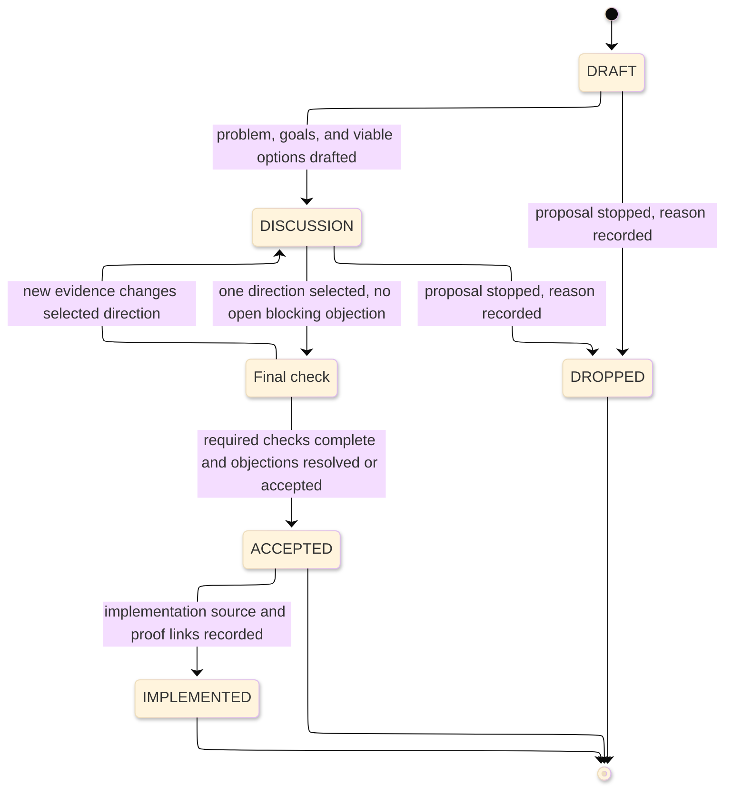

# [DESIGN_DOCUMENT_STANDARDS]

A design document is a pre-implementation proposal for a change with real design ambiguity. It frames the pressure, compares viable options, records trade-offs, gathers source evidence, splits the selected direction into checkable slices, and states the proof plan before durable decision or implementation work lands. It carries proposal history; it does not carry the accepted decision, current architecture, milestone sequence, operational response, or generated contract truth.

The entry gate is ambiguity: write a design document only when at least two plausible approaches, cross-boundary consequences, or unresolved trade-offs need evaluation. Convergence, change slices, final checks, and proof planning raise the check profile; they do not justify a design document by themselves.

## [1][USE_WHEN]

Use a design document when the change has design ambiguity and needs any of these before code lands:
- pre-code convergence across two or more routes or boundaries;
- comparison of viable options with recorded trade-offs;
- a change split into independently checkable, revertible slices;
- a bounded final-check window after discussion converges;
- a proof plan that names commands, contracts, checks, evidence, or risks before merge or release.

Do not use a design document for one obvious approach with no meaningful trade-off. Route accepted durable decisions to ADRs, current structure to architecture documents, dated build sequence to roadmaps, operational symptom response to runbooks, lookup catalogs to reference, generated contracts to API documentation, and contributor workflow to contributing guides.

[AUTHORING_CONTRACT]:
- Agent use: confirm ambiguity, choose the profile, and write only the sections required by the lifecycle state and profile.
- Required produced structure: lead with status/profile/source facts, then `Problem`, goals or draft gaps, context, approach, alternatives, risks/questions, proof plan, boundaries, and validation.
- Section cardinality: required sections appear once; conditional slices, cross-cutting checks, final-check, and ADR handoff sections appear only when their trigger holds.
- Adjacent checks: use handoff records only when an accepted design changes another document's reader action, proof, or maintenance route.
- Maintenance triggers: update the design when status, selected option, change slice, risk disposition, final-check result, proof gate, handoff target, or supersession changes.

## [2][PROFILES]

Pick one profile from blast radius. The profile raises source and proof obligations; it never removes the ambiguity gate.

| [INDEX] | [PROFILE]       | [TRIGGER]                 | [CHECK_SCOPE]        | [FINAL_CHECK] | [ADR_HANDOFF] |
| :-----: | :-------------- | :------------------------ | :------------------- | :------------ | :------------ |
|   [1]   | Lightweight     | one route or package      | controlling source   | optional      | no            |
|   [2]   | Standard        | 2+ routes or packages     | each affected route  | required      | if policy     |
|   [3]   | Public-contract | runtime, contract, public | routes plus contract | required      | yes           |

`If policy` means acceptance binds durable architecture policy. `Public-contract` means the change has enough public, runtime, or contract blast radius that every concern gets a check source or a stated `n/a` reason.

Local final check is a document state inside this type. It defines check source, deadline, open objections, and final disposition. Fork a parallel review artifact only when another maintained route requires it; when that happens, name the controlling route and link the canonical copy.

## [3][LIFECYCLE_FIELDS]

Every design document states lifecycle facts where they route source and proof obligations: status and profile in the lead, check-scope and final-check facts in the matching sections, and supersession in the handoff or boundaries section.

`Status` uses uppercase values from this closed set. State groups first, then individual status meanings:

[LIFECYCLE_GROUPS]:
- Active proposal states: `DRAFT`, `DISCUSSION`, `FINAL-CHECK`.
- Returnable state: `DISCUSSION`; return here when new evidence changes the selected direction after `FINAL-CHECK`.
- Post-check states: `ACCEPTED`, `IMPLEMENTED`.
- Terminal states: `IMPLEMENTED`, `DROPPED`; `ACCEPTED` is terminal for proposal checking but may advance to `IMPLEMENTED` when implementation and proof links are recorded.

[STATUS_MEANINGS]:
- `DRAFT`: problem, rough goals, and gaps are being shaped; do not evaluate a final approach yet.
- `DISCUSSION`: viable options and trade-offs are ready for route checks.
- `FINAL-CHECK`: one direction is selected and only final objections remain.
- `ACCEPTED`: required checks passed or accepted the residual risks.
- `IMPLEMENTED`: implementation source, proof, and adjacent handoff links are recorded.
- `DROPPED`: proposal stopped, with reason and supersession if one exists.

Replacement behavior: keep a replaced or dropped design when it preserves rationale an agent still needs; delete only when the accepted ADR, roadmap, replacement design, or implementation evidence preserves the rationale and links back to the replaced design. There is no design-level blocked status; blockers stay in risk/open-question records with `Depends`.

Multiple status vocabularies are allowed only when they are scoped to separate record families. Design `Status`, final-check disposition, change-slice state, risk disposition, and handoff lifecycle must each declare casing, active or returnable values, terminal values, omitted shared states, and removal behavior before the first record that uses that family. Do not mix values from two families in one `Status` field.

[LIFECYCLE_FACTS]:
- `Status`, `Profile`, `Date`, and `Source` are required in the lead.
- `Check scopes` is required at `DISCUSSION` and later.
- `Final check deadline` and `Final check source` are required at `FINAL-CHECK` and later for `Standard` and `Public-contract`.
- `Supersedes design` appears only when this proposal replaces an earlier design.

`Status` and `Profile` are discriminants: an agent reads them to route lifecycle obligations and conditional sections. Keep both to one value from the closed set.

## [4][REQUIRED_STRUCTURE]

Use the base skeleton for every status, then apply the lifecycle deltas. Conditional sections are omitted until their trigger holds; when they appear, insert them at the named position and renumber headings in document order.

```markdown template
# [CHANGE_NAMED_OUTCOME]

<Lead: name status, profile, date, source, check scopes when required, proposal outcome, and the adjacent document that will receive accepted truth.>

## [1][PROBLEM]

## [2][GOALS]

## [3][NON_GOALS]

## [4][CONTEXT]

## [5][PROPOSED_APPROACH]

## [6][ALTERNATIVES_CONSIDERED]

## [7][RISKS_OPEN_QUESTIONS]

## [8][PROOF_PLAN]

## [9][BOUNDARIES]

## [10][VALIDATION]
```

Use this draft-delta skeleton before checkable options exist:

```markdown template
## [2][ROUGH_GOALS]

## [3][GAPS]

<Omit `Non-goals`, `Context`, `Proposed approach`, `Alternatives considered`, `Risks and open questions`, and `Proof plan` until checkable options exist.>
```

Add these conditional sections only when their trigger applies:

```markdown template
## [N][CHANGE_SLICES]

<Insert after `Alternatives considered` for `Standard`, `Public-contract`, or a `Lightweight` design whose selected direction must land in separate checkable changes.>

## [N][CROSS_CUTTING_IMPLICATIONS]

<Insert after `Change slices` for `Standard` and `Public-contract`.>

## [N][FINAL_CHECK_RECORD]

<Insert after `Risks and open questions` at `FINAL-CHECK` and later.>

## [N][DECISION_RECORD_HANDOFF]

<Insert after `Proof plan` when acceptance binds durable policy or supersedes an ADR.>
```

Use this lifecycle/profile decision table:

| [INDEX] | [CONDITION]                              | [REQUIRED_OUTPUT]                                           |
| :-----: | :--------------------------------------- | :---------------------------------------------------------- |
|   [1]   | `Status: DRAFT`                          | draft skeleton; visible gap note                            |
|   [2]   | `Status: DISCUSSION` or later            | discussion skeleton; check-scope lifecycle facts            |
|   [3]   | `Profile: Standard` or `Public-contract` | change slices and cross-cutting implications                |
|   [4]   | `Status: FINAL-CHECK` or later           | final-check record, deadline, and objection disposition     |
|   [5]   | acceptance binds durable policy          | decision-record handoff                                     |
|   [6]   | `Status: IMPLEMENTED`                    | implemented evidence linking the implementation source path |

[SECTION_CARDINALITY]:
- Lifecycle facts, `Boundaries`, and `Validation` are required for every status.
- `Problem`, `Rough goals`, and `Gaps` are enough for `DRAFT`; they replace `Goals`, `Non-goals`, and the checkable proposal body until viable options exist.
- `Goals`, `Non-goals`, `Context`, `Proposed approach`, `Alternatives considered`, `Risks and open questions`, and `Proof plan` are required at `DISCUSSION` and later.
- `Change slices` is required for `Standard` and `Public-contract`; it is optional for `Lightweight` and appears only when separate checkable changes are real.
- Conditional sections appear only when their trigger row applies.

The H1 names the proposed outcome only. The lead carries lifecycle and source facts:

Accepted title: `# [FREEZE_CONTRACT]`
Accepted fields: `Status: DISCUSSION`; `Profile: Public-contract`; `Date: YYYY-MM-DD`; `Source: <design-source>`; `Check scopes: <platform>, <consumers>, <release-route>`.
Accepted lead: This design proposes freezing `<contract>` so downstream consumers can validate integration before release. It compares generated and maintained contract options, records change slices, and, if accepted, hands durable policy to an ADR and current boundary changes to architecture.

## [5][SECTION_RULES]

State each section's controlling content first and its boundary last. Where a section names a finite set of trackable items, render that set as the mandated structure.

[DRAFT_AND_CONTEXT]:
- `Problem`: name the specific operational, source, runtime, or engineering pressure and the affected behavior. One controlling pressure per paragraph.
- `Rough goals`: list tentative outcomes while the proposal is still in `DRAFT`; each item states the signal that would make it a real goal or the uncertainty that must be resolved.
- `Gaps`: name missing evidence, route decisions, source paths, contract facts, or proof gates that prevent evaluation. A gap closes by becoming `Context`, `Alternatives considered`, `Proof plan`, or an explicit route-away.
- `Goals`: write each goal as a checklist item with an observable metric, threshold, or pass/fail signal.
- `Non-goals`: name tempting scopes the proposal declines and the reason each is out of scope.
- `Context`: link current source paths, prior accepted decisions, issues, and standards as live links. Drift-prone context claims follow [proof.md](../proof.md).

[PROPOSAL_CHECKS]:
- `Proposed approach`: lead with the selected shape and close with the constraint an agent must verify.
- `Alternatives considered`: record the chosen option, strongest rejected option, and do-nothing baseline unless inaction was impossible. Every option states its deciding trade-off.
- `Change slices`: define self-contained, ordered, revertible changes. Each slice has one check focus, rollback boundary, and milestone handoff only when it becomes dated work.
- `Cross-cutting implications`: cover security, privacy, accessibility, internationalization, data, operational, compatibility, and runtime concerns as records; mark non-applicable concerns `n/a` with a reason and route only when source or proof changes behavior.
- `Risks and open questions`: render one record per item using `ID`, `Status`, `Changed fact`, `Consumed by`, `Use in this document`, `Exit`, `Depends`, `Evidence`, `Update when`, `Close when`, `Route-away`, then `Risk` or `Question`.
- `Final check record`: summarize the selected direction, deadline, check source, open objections, and final disposition.
- `Proof plan`: name exact commands, contracts, runtime checks, manual gates, and acceptance criteria. Mark a gate `enforced` only when a command or status check runs it; otherwise mark it `manual`.

Use stable local IDs only for records another section or adjacent document references. Change slices use `S<N>`, risks use `R<N>`, open questions use `Q<N>`, and cross-cutting concern records use their concern label. Do not add IDs to every paragraph; an ID exists so a dependency, handoff, acceptance gate, or proof receipt can point to one record without copying it.

## [6][GOALS_CHECKLIST]

Render `Goals` as a checklist of measurable conditions. A bare prose goal with no pass condition is the primary low-value failure mode.

```markdown template
## [2][GOALS]

- [ ] Generated contract accepts the seeded payload — proven by `<contract-validation command or status check>`.
- [ ] No direct `Admission/ -> Storage/` writes remain — proven by `<dependency gate or manual check>`.
- [ ] Rollback stays inside one change slice — proven by `<rollback boundary or feature flag check>`.
```

Each item pairs outcome with the metric, threshold, or signal that proves it. Carry the same scope boundary into `Non-goals`: a declined scope is a plausible candidate the reader might expect.

## [7][ALTERNATIVES_CONSIDERED]

Use a comparison table when two or more options survive triage. The baseline row is mandatory when inaction was plausible. Name columns after the deciding facts agents need, not generic sentiment.

| [INDEX] | [OPTION]            | [DRIVER]    | [COST]      | [RISK]          | [VERDICT]         |
| :-----: | :------------------ | :---------- | :---------- | :-------------- | :---------------- |
|   [1]   | Sharded writers     | throughput  | rebalance   | shard-loss mode | selected          |
|   [2]   | Single-writer queue | routing     | one core    | caps throughput | rejected          |
|   [3]   | Do nothing          | no new code | drift stays | misses pressure | rejected baseline |

When only one option survived and the trade-off is asymmetric, a `Lightweight` design may render this section as labeled prose instead of a table. The deciding trade-off and baseline still appear inside `Alternatives considered`; do not hide them under `Proposed approach`.

Rejected alternatives: `Single-writer queue` and `sharded design`, with no selected-option trade-off.
Reason: the rejected shape records options without the deciding trade-off.

## [8][CHANGE_SLICES]

A change slice is one self-contained change that an agent can understand, validate, and revert without the rest of the proposal landing first. Use a compact table only while rollback and handoff facts stay short:

| [INDEX] | [ID] | [SLICE]           | [KIND]   | [DEPENDS] | [CHECK_FOCUS]        | [ROLLBACK]   |
| :-----: | :--- | :---------------- | :------- | :-------- | :------------------- | :----------- |
|   [1]   | S1   | Contract freeze   | contract | —         | break shape          | schema diff  |
|   [2]   | S2   | Runtime admission | behavior | S1        | integration boundary | feature flag |

Promote slices to records when proof, rollback, or adjacent handoff needs more than a short cell:

```markdown template
### [N.M][CONTRACT_FREEZE]

ID: S1
Kind: contract
Depends: —
Check focus: breaking-change shape
Rollback boundary: revert generated schema diff
Roadmap milestone: roadmap M<N> when this slice becomes dated work
Proof gate: contract gate evidence, or proof gap
```

Slice kinds are local labels, not a closed global sequence. Keep dependency order honest and leave no blank rollback boundary. Use `Roadmap milestone` only to point at an existing or same-change roadmap milestone; when slices become dated milestones with exit gates, move the sequence to the roadmap route.

Rejected slice table: `S1 refactor -> S2 implementation -> S3 tests`.
Reason: the rejected shape invites fixed-sequence copying.

## [9][TRACKABLE_RECORDS]

`Cross-cutting implications` carries one record per concern for `Standard` and `Public-contract` designs:

```markdown template
### [N.M][SECURITY]

Concern: security
Applies: yes | no
Proof route: <proof source, gate, or escalation route; or n/a reason when no route is needed>
Decision: <constraint, mitigation, or n/a reason>
```

`Risks and open questions` carries one record per item. Use uppercase status values: `OPEN`, `ASSIGNED`, and `DEFERRED` are active or returnable; `RESOLVED`, `ACCEPTED-AS-RISK`, and `DROPPED` are terminal. A `DEFERRED` item must name the return trigger or adjacent route that can reopen it. `DROPPED` records may be deleted only when no design, ADR, roadmap, proof receipt, or adjacent document references them. `ACCEPTED-AS-RISK` persists until an ADR, roadmap, support row, or proof receipt carries the residual risk.

```markdown template
### [N.M][SHARD_REBALANCE]

ID: R1
Status: ACCEPTED-AS-RISK
Changed fact: shard rebalance may strand work during route failover.
Consumed by: selected approach, proof plan, and final check.
Use in this document: acceptance may proceed only because the residual risk is explicit.
Exit: failover benchmark lands or ADR accepts the residual risk.
Depends: failover benchmark or ADR risk acceptance.
Evidence: route check record or stated proof gap.
Update when: selected write path, route failover behavior, or proof gate changes.
Close when: failover benchmark lands or ADR accepts the residual risk.
Route-away: implementation issue discussion and benchmark procedure stay in their documents.

### [N.M][WRITER_FANOUT]

ID: Q1
Status: RESOLVED
Changed fact: writer fanout may exceed the target resource budget.
Consumed by: selected approach and proof plan.
Use in this document: rejected alternatives remain rejected because benchmark evidence settled the trade-off.
Exit: benchmark settles per-key contention.
Depends: per-key contention benchmark.
Evidence: benchmark check record.
Update when: latency target, writer fanout shape, or benchmark fixture changes.
Close when: benchmark settles per-key contention.
Route-away: benchmark command and runtime tuning stay in test strategy or implementation proof.
```

`Proof plan` carries one row per gate, with an enforcement flag that separates a real gate from manual intent:

| [INDEX] | [GATE]             | [COMMAND_CONTRACT]     | [ACCEPTANCE_SIGNAL] | [ENFORCEMENT] |
| :-----: | :----------------- | :--------------------- | :------------------ | :------------ |
|   [1]   | Unit laws          | unit test status check | suite green         | enforced      |
|   [2]   | Storage contract   | generated schema diff  | no breaking change  | enforced      |
|   [3]   | Route design check | —                      | two route checks    | manual        |

At `ACCEPTED` and `IMPLEMENTED`, add proof receipt fields beside completed gates rather than rewriting planned gates as if they already ran:

```text template
Gate: <gate name>
Proof route: <route required for access, proof, or escalation>
Evidence: <command, status check, generated contract, check record, or proof gap>
Generated from: <generator, command, fixture, or check process>
Controlling source: <path, contract, manifest, source document, or status check>
Last verified: YYYY-MM-DD
Review trigger: <gate, contract, check source, or route-boundary change>
Result: <accepted signal or remaining gap>
```

When a design proof gate depends on an existing test strategy, name that route instead of restating the strategy:

```text template
Gate: <gate name from test strategy>
Strategy gate route: <test strategy path and gate anchor>
```

`Final check record` carries acceptance readiness. Check values are `satisfied`, `pending`, `blocked`, and `n/a`; risk/open-question disposition values use the uppercase risk vocabulary above.

| [INDEX] | [CHECK_SCOPE] | [STATE]   |     [DATE] |
| :-----: | :------------ | :-------- | ---------: |
|   [1]   | runtime route | satisfied | YYYY-MM-DD |
|   [2]   | storage route | pending   |          — |

The design is ready to accept only when every required check reads `satisfied`, every objection reads `RESOLVED` or `ACCEPTED-AS-RISK`, and no live risk remains `OPEN`.

## [10][LIFECYCLE]

Statuses advance in one direction except for a documented return to `DISCUSSION`. Each transition has an observable entry condition. The conceptual diagram shows the proposal lifecycle.



Text equivalent: a design starts in `DRAFT`, moves to `DISCUSSION` when the problem, goals, and options are drafted, enters `FINAL-CHECK` only after one direction is selected, returns to `DISCUSSION` when new evidence changes that direction, and ends as `ACCEPTED`, `IMPLEMENTED`, or `DROPPED`.

Enter `FINAL-CHECK` only when an agent can evaluate the final direction without rediscovering the discussion. If evidence changes the selected direction after `FINAL-CHECK` opens, return to `DISCUSSION`, update the trade-off summary, and open a new `FINAL-CHECK`.

`IMPLEMENTED` is a handoff status, not implementation routing. It records that the implementation source, ADR, roadmap milestone, release note, or proof receipt is linked; active implementation state belongs to those routes.

## [11][DECISION_RECORD_HANDOFF]

After acceptance, create an ADR when the design binds two or more routes, packages, runtime boundaries, or durable contracts, or when it supersedes a prior durable decision. The design names the handoff targets; adjacent document standards own derivation mechanics, current architecture proof, milestone exit, and gate policy.

Use this record when any handoff target exists. Omit untriggered fields; keep shared relation fields in the same order so the record explains maintenance behavior instead of listing adjacent documents.

```text template
ID: <handoff id only when another record references it>
Status: <QUEUED | ACTIVE | BLOCKED | DEFERRED | COMPLETE | DROPPED | CANCELED>
Changed fact: <accepted policy, current-structure change, public contract, gate policy, support fact, or reader route>
Consumed by: <ADR, architecture, roadmap, test strategy, support matrix, API, reference, README, tutorial, how-to, runbook, contributing, onboarding, or code-documentation path>
Use in this document: <why this design cannot close without the consuming route>
Exit: consuming route updates, explicitly routes away, or design is dropped.
Depends: <proof gate, milestone, support row, contract, or n/a>
Evidence: <proof plan receipt, implemented evidence, check record, or proof gap>
Update when: <selected direction, accepted policy, implementation path, generated contract, gate, support row, or route changes>
Close when: <consuming document updates, explicitly routes away, or the design is dropped>
Route-away: <body content that stays in the adjacent route>
```

Use this handoff decision table:

| [INDEX] | [CONDITION]                   | [HANDOFF_TARGET]             |
| :-----: | :---------------------------- | :--------------------------- |
|   [1]   | durable policy accepted       | ADR                          |
|   [2]   | current structure changes     | architecture                 |
|   [3]   | dated or sequenced work       | roadmap                      |
|   [4]   | proof gate changes            | test strategy                |
|   [5]   | implementation evidence lands | implementation source or PR  |
|   [6]   | support lifecycle changes     | support matrix               |
|   [7]   | public contract docs change   | API, reference, or code docs |
|   [8]   | adoption or task path changes | README, tutorial, or how-to  |
|   [9]   | operational readiness changes | runbook                      |

## [12][MODAL_LANGUAGE]

Use lowercase `must`, `should`, and `may` with the local craft standard's ordinary prose meanings: requirement, recommendation, and permission. Do not use bracketed all-caps tags such as `[MUST]`, `[SHOULD]`, or `[ALWAYS]` in a design document.

## [13][PRECEDENCE]

Source order decides a wording or scope question when sources disagree:
1. Current repository source, manifests, generated contracts, and accepted decisions the proposal must respect.
2. This design-document standard for proposal shape, lifecycle, change slices, and final check.
3. The four shared standards for form, craft, evidence, and notation.

A design document proposes; it never overrides an accepted decision. When a slice contradicts an accepted ADR, the design must either narrow scope or plan the ADR supersession handoff.

## [14][BOUNDARIES]

[EXPLANATION_TYPES]:
- [adr.md](adr.md) carries the accepted durable decision and its confirmation evidence after this proposal is accepted.
- [roadmap.md](roadmap.md) carries build sequence, milestones, and exit proof when slices grow into a dated plan.
- [architecture.md](architecture.md) carries current structure and invariants the proposal must respect.
- [test-strategy.md](test-strategy.md) carries gate taxonomy and reusable proof policy that a proof plan consumes.
- [support-matrix.md](../reference/support-matrix.md) carries support and lifecycle rows consumed by the proposal.

[REFERENCE_TASK_LEARNING]:
- [api.md](../reference/api.md), [reference.md](../reference/reference.md), and [code-documentation.md](../reference/code-documentation.md) own public-contract, lookup, and source-symbol documentation.
- [runbook.md](../task/runbook.md) carries operational response paths affected by the proposal.
- [tutorial.md](../learning/tutorial.md), [how-to.md](../task/how-to.md), and [onboarding.md](../learning/onboarding.md) own learning, task, and ramp bodies that consume the accepted shape.
- [contributing.md](../task/contributing.md) carries contribution workflow when a design changes it.
- [README.md](../README.md) routes document-type choice, placement, and lifecycle questions.

## [15][VALIDATION]

[GATE_PROFILE]:
- [ ] The document has real ambiguity: at least two plausible approaches, cross-boundary consequences, or unresolved trade-offs.
- [ ] `Status` and `Profile` are single closed-set values, and profile obligations are met.
- [ ] Lifecycle field cardinality holds; conditional fields appear only when their trigger holds.
- [ ] A `DRAFT` uses the draft skeleton, and `DISCUSSION` or later uses the full proposal skeleton without optional `Change slices` unless its trigger holds.
- [ ] Conditional sections appear only when their trigger holds.

[PROBLEM_OPTIONS]:
- [ ] `Problem` names a specific pressure and which behavior or scope it affects.
- [ ] Each goal is a checklist item naming a metric, threshold, or pass condition.
- [ ] Each non-goal is a declined candidate scope, not a restated failure mode.
- [ ] `Context` links live source paths, decisions, issues, and standards, with proof details for drift-prone claims.
- [ ] Check scopes are listed at `DISCUSSION` and later.
- [ ] Each alternative records its deciding trade-off, and a do-nothing baseline appears when plausible.
- [ ] Alternatives use table form when two or more options survive and the columns name real decision axes.

[SLICES_RECORDS]:
- [ ] Change slices are self-contained, ordered, and carry a non-blank rollback boundary.
- [ ] Change-slice tables stay narrow; proof, rollback, and handoff details promote to records when cells become prose.
- [ ] Cross-cutting concerns are covered at `Standard` and `Public-contract`, with each concern local or marked `n/a` with a reason.
- [ ] Each risk or open question follows the shared relation field order, and no acceptance-ready record remains `OPEN`, `ASSIGNED`, or `DEFERRED` without a return trigger.

[PROOF_HANDOFF]:
- [ ] The proof plan names exact commands, contracts, gates, and acceptance criteria, marks manual gates as unenforced, and adds proof receipts only when gates have run or landed.
- [ ] `FINAL-CHECK` records check source, deadline, every required check state, and each objection's disposition.
- [ ] `IMPLEMENTED` links the implementation source, ADR, roadmap, release, or proof receipt rather than implementation source state.
- [ ] Handoff records use `Status`, `Changed fact`, `Consumed by`, `Use in this document`, `Exit`, `Depends`, `Evidence`, `Update when`, `Close when`, and `Route-away` where lifecycle is tracked; non-trackable relation records omit `Status`, `Exit`, `Depends`, and `Evidence`.
