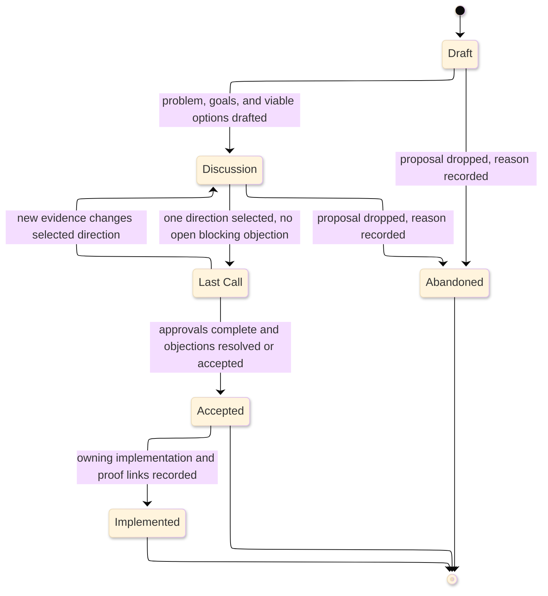

# [DESIGN_DOCUMENT_STANDARDS]

A design document is a collaborative pre-implementation proposal for a change with real design ambiguity. It frames the pressure, compares viable options, records trade-offs, gathers owner feedback, splits the selected direction into reviewable slices, and states the validation plan before durable decision or implementation work lands. It owns proposal and review history; it does not own the accepted decision, current architecture, milestone sequence, operational response, or generated contract truth.

The entry gate is ambiguity: write a design document only when at least two plausible approaches, cross-boundary consequences, or unresolved trade-offs need review. Owner consensus, review slices, Last Call, and proof planning raise the review profile; they do not justify a design document by themselves.

## [1][USE_WHEN]

Use a design document when the change has design ambiguity and needs any of these before code lands:

- pre-code consensus across two or more owners or boundaries;
- comparison of viable options with recorded trade-offs;
- a change split into independently reviewable, revertible slices;
- a bounded final-objection window after discussion converges;
- a proof plan that names commands, contracts, checks, reviews, or risks before merge or release.

Do not use a design document for one obvious approach with no meaningful trade-off. Route accepted durable decisions to ADRs, current structure to architecture documents, dated build sequence to roadmaps, operational symptom response to runbooks, lookup catalogs to reference, generated contracts to API documentation, and contributor workflow to contributing guides.

## [2][DESIGN_BASELINES]

This standard derives its shape from collaborative software design-doc practice and RFC-style final review, but it applies them as local documentation rules. Google's design-doc discussion supports collaborative pre-code review, goals, alternatives, trade-offs, cross-cutting concerns, and archival value. RFC 2026 supports open review, consensus, and Last Call as a final-objection pattern; local Last Call borrows only the bounded final-review pattern and does not claim to run the IETF process.

External basis: [Software Engineering at Google, Design Docs](https://abseil.io/resources/swe-book/html/ch10.html), [RFC 2026 Internet Standards Process](https://www.rfc-editor.org/rfc/rfc2026), [RFC 2119](https://www.rfc-editor.org/rfc/rfc2119.html), and [RFC 8174](https://www.rfc-editor.org/rfc/rfc8174.html). This standard owns the enforceable local template, status vocabulary, profile model, and handoff records.

## [3][MODAL_LANGUAGE]

Use lowercase `must`, `should`, and `may` with the local craft standard's ordinary prose meanings: requirement, recommendation, and permission. Do not use bracketed all-caps tags such as `[MUST]`, `[SHOULD]`, or `[ALWAYS]` in a design document. RFC 2119 and RFC 8174 normative keywords apply only when a document explicitly invokes them with uppercase keyword semantics; this corpus does not use that notation for design docs.

## [4][PROFILES]

Pick one profile from blast radius. The profile raises review obligations; it never removes the ambiguity gate.

| [INDEX] | [PROFILE]       | [TRIGGER]                 | [REVIEW]            | [LAST_CALL]        | [ADR_HANDOFF] |
| :-----: | :-------------- | :------------------------ | :------------------ | :----------------- | :------------ |
|   [1]   | Lightweight     | one owner or package      | owning reviewer     | optional           | no            |
|   [2]   | Standard        | 2+ owners or packages     | each affected owner | local Last Call    | if policy     |
|   [3]   | Public-contract | runtime, contract, public | owners plus driver  | audience + channel | yes           |

`If policy` means acceptance binds durable architecture policy. `Public-contract` means the change has enough public, runtime, or contract blast radius that every concern gets an accountable owner or a stated `n/a` reason.

Local Last Call is a review state inside this document type, not a separate RFC artifact and not the IETF process. It must define audience, channel, deadline, accountable approvals, objection handling, and final disposition. Fork a parallel RFC only when an external hosting or governance process demands it; when that happens, name the process and link the canonical copy.

## [5][PRECEDENCE]

Source order decides a wording or scope question when sources disagree:

1. Current repository source, manifests, generated contracts, and accepted decisions the proposal must respect.
2. This design-document standard for proposal shape, lifecycle, review slices, and Last Call.
3. The five shared standards for position, form, craft, evidence, and notation.
4. External design-doc or RFC practice for background only.

A design document proposes; it never overrides an accepted decision. When a slice contradicts an accepted ADR, the design must either narrow scope or plan the ADR supersession handoff.

## [6][LIFECYCLE_FIELDS]

Every design document states lifecycle facts where they route review obligations: status and profile in the lead, reviewer and Last Call facts in review sections, and supersession in the handoff or boundaries section.

Lifecycle fact cardinality:

- `Status`, `Profile`, `Date`, and `Authors` are required in the lead.
- `Reviewers` is required at `Discussion` and later.
- `Last Call deadline` and `Last Call channel` are required at `Last Call` and later for `Standard` and `Public-contract`.
- `Supersedes design` appears only when this proposal replaces an earlier design.

`Status` and `Profile` are discriminants: an agent reads them to route lifecycle obligations and conditional sections. Keep both to one value from the closed set.

## [7][REQUIRED_STRUCTURE]

Use the `Draft` skeleton only while the problem is still being shaped. Use the `Discussion and later` skeleton when reviewers must evaluate the proposal. Conditional sections are omitted until their trigger holds; when they appear, insert them at the named position and renumber headings in document order.

Draft skeleton:

```markdown template
# [CHANGE_NAMED_OUTCOME]

<Lead: name status, profile, date, authors, and the proposal outcome.>

## [1][PROBLEM]

## [2][ROUGH_GOALS]

## [3][GAPS]

## [4][BOUNDARIES]

## [5][REVIEW_CHECKLIST]
```

Discussion and later skeleton:

```markdown template
# [CHANGE_NAMED_OUTCOME]

<Lead: name status, profile, date, authors, reviewers when required, and the proposal outcome.>

## [1][PROBLEM]

## [2][GOALS]

## [3][NON_GOALS]

## [4][CONTEXT]

## [5][PROPOSED_APPROACH]

## [6][ALTERNATIVES_CONSIDERED]

## [7][RISKS_OPEN_QUESTIONS]

## [8][VALIDATION_PROOF_PLAN]

## [9][BOUNDARIES]

## [10][REVIEW_CHECKLIST]
```

Conditional additions:

```markdown template
## [N][REVIEW_SLICES]

<Insert after `Alternatives considered` for `Standard`, `Public-contract`, or a `Lightweight` design whose selected direction must land in separate reviewable changes.>

## [N][CROSS_CUTTING_IMPLICATIONS]

<Insert after `Review slices` for `Standard` and `Public-contract`.>

## [N][LAST_CALL_RECORD]

<Insert after `Risks and open questions` at `Last Call` and later.>

## [N][DECISION_RECORD_HANDOFF]

<Insert after `Validation and proof plan` when acceptance binds durable policy or supersedes an ADR.>
```

Lifecycle/profile decision table:

| [INDEX] | [CONDITION]                              | [REQUIRED_OUTPUT]                                           |
| :-----: | :--------------------------------------- | :---------------------------------------------------------- |
|   [1]   | `Status: Draft`                          | draft skeleton; visible gap note                            |
|   [2]   | `Status: Discussion` or later            | discussion skeleton; reviewer lifecycle facts               |
|   [3]   | `Profile: Standard` or `Public-contract` | review slices and cross-cutting implications                |
|   [4]   | `Status: Last Call` or later             | Last Call record, deadline, channel, approval disposition   |
|   [5]   | acceptance binds durable policy          | decision-record handoff                                     |
|   [6]   | `Status: Implemented`                    | implemented evidence linking the owning implementation path |

Section cardinality:

- Lifecycle facts, `Boundaries`, and `Review checklist` are required for every status.
- `Problem`, `Rough goals`, and `Gaps` are enough for `Draft`.
- `Goals`, `Non-goals`, `Context`, `Proposed approach`, `Alternatives considered`, `Risks and open questions`, and `Validation and proof plan` are required at `Discussion` and later.
- `Review slices` is required for `Standard` and `Public-contract`; it is optional for `Lightweight` and appears only when separate reviewable changes are real.
- Conditional sections appear only when their trigger row applies.

## [8][SECTION_RULES]

State each section's controlling content first and its boundary last. Where a section names a finite set of trackable items, render that set as the mandated structure.

- `Problem`: name the specific user, product, operational, or engineering pressure and who feels it. One controlling pressure per paragraph.
- `Goals`: write each goal as a checklist item with an observable metric, threshold, or pass/fail signal.
- `Non-goals`: name tempting scopes the proposal declines and the reason each is out of scope.
- `Context`: link current source paths, prior accepted decisions, issues, and standards as live links. Drift-prone context claims follow [proof.md](../proof.md).
- `Proposed approach`: lead with the selected shape and close with the constraint a reviewer must accept to approve.
- `Alternatives considered`: record the chosen option, strongest rejected option, and do-nothing baseline unless inaction was impossible. Every option states its deciding trade-off.
- `Review slices`: define self-contained, ordered, revertible changes. Each slice has one reviewer focus, rollback boundary, and milestone handoff only when it becomes dated work.
- `Cross-cutting implications`: cover security, privacy, accessibility, internationalization, data, operational, compatibility, and runtime concerns as records; mark non-applicable concerns `n/a` with a reason and owner.
- `Risks and open questions`: render one record per item, each with question or risk, impact, owner, disposition, exit, and tracking.
- `Last Call record`: summarize the selected direction, deadline, notification channel, accountable approvals, open objections, and final disposition.
- `Validation and proof plan`: name exact commands, contracts, runtime checks, review gates, and acceptance criteria. Mark a gate `enforced` only when a command or status check runs it; otherwise mark it `review-only`.

## [9][GOALS_CHECKLIST]

Render `Goals` as a checklist of measurable conditions. A bare prose goal with no pass condition is the primary low-value failure mode.

```markdown template
## [2][GOALS]

- [ ] Cold profile-view P95 under 1 s - proven by `<exact benchmark command or status check>`.
- [ ] Zero write-amplification regression - proven by `<contract diff or storage check>`.
- [ ] Rollback in one slice - proven by `<rollback boundary or feature flag check>`.
```

Each item pairs outcome with the metric, threshold, or signal that proves it. Carry the same scope boundary into `Non-goals`: a declined scope is a plausible candidate the reader might expect.

## [10][ALTERNATIVES_CONSIDERED]

Use a comparison table when two or more options survive triage. The baseline row is mandatory when inaction was plausible. Name columns after the deciding facts reviewers need, not generic sentiment.

| [INDEX] | [OPTION]            | [DRIVER]    | [COST]      | [RISK]          | [VERDICT]         |
| :-----: | :------------------ | :---------- | :---------- | :-------------- | :---------------- |
|   [1]   | Sharded writers     | throughput  | rebalance   | shard-loss mode | selected          |
|   [2]   | Single-writer queue | ownership   | one core    | caps throughput | rejected          |
|   [3]   | Do nothing          | no new code | drift stays | misses pressure | rejected baseline |

When only one option survived and the trade-off is asymmetric, a `Lightweight` design may render this section as labeled prose instead of a table. The deciding trade-off and baseline still appear inside `Alternatives considered`; do not hide them under `Proposed approach`.

The rejected shape below records options without the deciding trade-off:

```markdown rejected
## [6][ALTERNATIVES_CONSIDERED]

- We looked at a single-writer queue and a sharded design.
- The sharded one seemed better.
```

## [11][REVIEW_SLICES]

A review slice is one self-contained change that a reviewer can understand, validate, and revert without the rest of the proposal landing first. Use a compact table only while rollback and handoff facts stay short:

| [INDEX] | [SLICE]           | [KIND]   | [DEPENDS] | [REVIEW]       | [ROLLBACK]   |
| :-----: | :---------------- | :------- | :-------- | :------------- | :----------- |
|   [1]   | Contract freeze   | contract | none      | break shape    | schema diff  |
|   [2]   | Runtime admission | behavior | freeze    | owner boundary | feature flag |

Promote slices to records when proof, rollback, or adjacent handoff needs more than a short cell:

```markdown template
### [N.M][CONTRACT_FREEZE]

Kind: contract
Depends: none
Reviewer focus: breaking-change shape
Rollback boundary: revert generated schema diff
Roadmap milestone: roadmap M2, or none
Validation receipt: contract gate, or proof gap
```

Slice kinds are local labels, not a closed global sequence. Keep dependency order honest and leave no blank rollback boundary. Use `Roadmap milestone` only to point at an existing or same-change roadmap milestone; when slices become dated milestones with exit gates, move the sequence to the roadmap owner.

The rejected shape below invites fixed-sequence copying:

```markdown rejected
| [INDEX] | [SLICE] | [KIND]         | [DEPENDS] |
| :-----: | :------ | :------------- | :-------- |
|   [1]   | S1      | refactor       | none      |
|   [2]   | S2      | implementation | S1        |
|   [3]   | S3      | tests          | S2        |
```

## [12][TRACKABLE_RECORDS]

`Cross-cutting implications` carries one record per concern for `Standard` and `Public-contract` designs:

```markdown template
### [N.M][SECURITY]

Concern: security
Applies: yes | no
Owner: <owner role, or n/a reason when no>
Decision: <constraint, mitigation, or n/a reason>
```

`Risks and open questions` carries one record per item. A live item is `open`, `assigned`, or `deferred (owner)`; a settled item is `resolved` or `accepted-as-risk`.

```markdown template
### [N.M][SHARD_REBALANCE]

Question or risk: shard rebalance may strand work during owner failover.
Impact: release gate cannot prove throughput under failover.
Owner: runtime-maintainers
Disposition: accepted-as-risk
Exit: failover benchmark lands or ADR accepts the residual risk.
Tracking: issues/482

### [N.M][WRITER_FANOUT]

Question or risk: writer fanout may exceed the target resource budget.
Impact: proposed throughput gain may cost the latency goal.
Owner: storage-owner
Disposition: resolved
Exit: benchmark settles per-key contention.
Tracking: issues/487 - benchmark settled per-key contention.
```

`Validation and proof plan` carries one row per gate, with an enforcement flag that separates a real gate from review intent:

| [INDEX] | [GATE]              | [COMMAND_CONTRACT]     | [ACCEPTANCE_SIGNAL] | [ENFORCEMENT] |
| :-----: | :------------------ | :--------------------- | :------------------ | :------------ |
|   [1]   | Unit laws           | unit test status check | suite green         | enforced      |
|   [2]   | Storage contract    | generated schema diff  | no breaking change  | enforced      |
|   [3]   | Owner design review | none                   | two owner approvals | review-only   |

At `Accepted` and `Implemented`, add proof receipt fields beside completed gates rather than rewriting planned gates as if they already ran:

```markdown template
Gate: <gate name>
Owner: <owner role>
```

When a design proof gate depends on an existing test strategy, name that owner instead of restating the strategy:

```markdown template
Gate: <gate name from test strategy>
Strategy gate source: <test strategy path and gate anchor>
```

`Last Call record` carries sign-off readiness:

| [INDEX] | [OWNER]             | [APPROVAL] |     [DATE] |
| :-----: | :------------------ | :--------- | ---------: |
|   [1]   | runtime-maintainers | approved   | 2026-06-01 |
|   [2]   | storage-owner       | pending    |       none |

The design is ready to accept only when every accountable owner reads `approved`, every objection reads `resolved` or `accepted-as-risk`, and no live risk remains `open`.

## [13][LIFECYCLE]

Statuses advance in one direction except for a documented return to `Discussion`. Each transition has an observable entry condition. The conceptual diagram shows the proposal review lifecycle.



Text equivalent: a design starts in `Draft`, moves to `Discussion` when the problem, goals, and options are drafted, enters `Last Call` only after one direction is selected, returns to `Discussion` when new evidence changes that direction, and ends as `Accepted`, `Implemented`, or `Abandoned`.

Enter `Last Call` only when a reviewer can evaluate the final direction without rediscovering the discussion. If evidence changes the selected direction after `Last Call` opens, return to `Discussion`, update the trade-off summary, and open a new `Last Call`.

`Implemented` is a handoff status, not implementation ownership. It records that the owning implementation, ADR, roadmap milestone, release note, or validation receipt is linked; ongoing implementation state belongs to those owners.

## [14][DECISION_RECORD_HANDOFF]

After acceptance, create an ADR when the design binds two or more owners, packages, runtime boundaries, or durable contracts, or when it supersedes a prior durable decision. The design names the handoff targets; adjacent document standards own derivation mechanics, current architecture proof, milestone exit, and gate policy.

Use this record when any handoff target exists:

```markdown template
Target ADR: <ADR path, planned number, or none>
Architecture fact: <architecture path and fact to refresh, or none>
Roadmap milestone: <milestone anchor, or none>
Test strategy gate: <gate anchor, or none>
Validation receipt: <proof plan receipt, implemented evidence, or proof gap>
```

Handoff decision table:

| [INDEX] | [CONDITION]                   | [HANDOFF_OWNER]             |
| :-----: | :---------------------------- | :-------------------------- |
|   [1]   | durable policy accepted       | ADR                         |
|   [2]   | current structure changes     | architecture                |
|   [3]   | dated or sequenced work       | roadmap                     |
|   [4]   | proof gate changes            | test strategy               |
|   [5]   | implementation evidence lands | owning implementation or PR |

## [15][BOUNDARIES]

- [adr.md](adr.md) owns the accepted durable decision and its confirmation evidence after this proposal is approved.
- [roadmap.md](roadmap.md) owns build sequence, milestones, and exit proof when slices grow into a dated plan.
- [architecture.md](architecture.md) owns current structure and invariants the proposal must respect.
- [test-strategy.md](test-strategy.md) owns gate taxonomy and reusable proof policy that a validation plan consumes.
- [README.md](../README.md) routes document-type choice, placement, and lifecycle questions.

## [16][REVIEW_CHECKLIST]

- [ ] The document has real ambiguity: at least two plausible approaches, cross-boundary consequences, or unresolved trade-offs.
- [ ] `Status` and `Profile` are single closed-set values, and profile obligations are met.
- [ ] Lifecycle field cardinality holds; conditional fields appear only when their trigger holds.
- [ ] A `Draft` uses the draft skeleton, and `Discussion` or later uses the full proposal skeleton without optional `Review slices` unless its trigger holds.
- [ ] Conditional sections appear only when their trigger holds.
- [ ] `Problem` names a specific pressure and who feels it.
- [ ] Each goal is a checklist item naming a metric, threshold, or pass condition.
- [ ] Each non-goal is a declined candidate scope, not a restated failure mode.
- [ ] `Context` links live source paths, decisions, issues, and standards, with proof details for drift-prone claims.
- [ ] Reviewers or consulted owners are listed at `Discussion` and later.
- [ ] Each alternative records its deciding trade-off, and a do-nothing baseline appears when plausible.
- [ ] Alternatives use table form when two or more options survive and the columns name real decision axes.
- [ ] Review slices are self-contained, ordered, and carry a non-blank rollback boundary.
- [ ] Review-slice tables stay narrow; proof, rollback, and handoff details promote to records when cells become prose.
- [ ] Cross-cutting concerns are covered at `Standard` and `Public-contract`, with each concern owned or marked `n/a` with a reason.
- [ ] Each risk or open question carries question/risk, impact, owner, disposition, exit, and tracking, and no acceptance-ready record remains `open`.
- [ ] The proof plan names exact commands, contracts, gates, and acceptance criteria, marks review-only gates as unenforced, and adds proof receipts only when gates have run or landed.
- [ ] `Last Call` records audience, channel, deadline, every accountable owner's approval, and each objection's disposition.
- [ ] `Implemented` links the owning implementation, ADR, roadmap, release, or validation receipt rather than owning implementation state.
- [ ] Handoff records name the target ADR, architecture fact, roadmap milestone, test strategy gate, and validation receipt when those owners apply.
