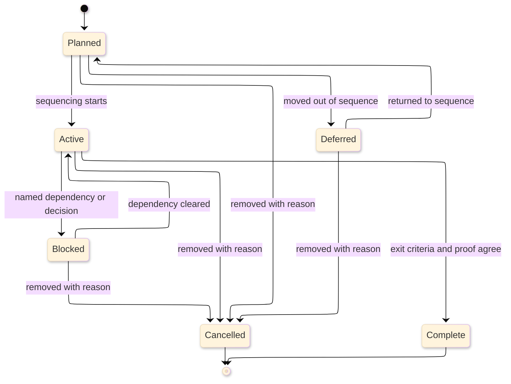
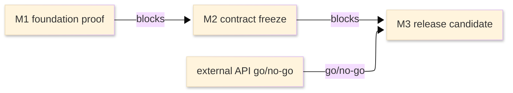

# [ROADMAP_STANDARDS]

A roadmap states planned sequence, milestone intent, the measurable outcome each milestone serves, dependencies, exit criteria, and the proof that closes each milestone. It answers what must happen next, what outcome the work moves, what has cleared its exit bar, and what evidence shows the work is done. Live dates, status, blocker state, and shipped history belong to the planning, release, or changelog system when one exists; Markdown summarizes and links that truth rather than becoming a second tracker.

This standard uses local outcome and horizon framing: milestones ladder up to measurable outcomes rather than shipped artifacts, and certainty decreases with horizon so far-dated work is not written as commitment. The durable structures are lifecycle facts, status vocabulary, milestone records, binary exit checklists, dependency edges, public-reader framing rules, and completion proof.

## [1][USE_WHEN]

Use a roadmap when readers need planned sequence across milestones, the outcome each milestone serves, dependency and blocker visibility, exit criteria for a build or release or capability sequence, or the proof surfaces that close those milestones.

Route elsewhere when the reader needs current structure, durable decision rationale, pre-code proposal review, test taxonomy, supported-version lifecycle, command or API lookup, release history, or a repeatable procedure.

## [2][PLANNING_PRECEDENCE]

Use the nearest live source for mutable planning facts and this standard for local roadmap shape:

1. Owner-maintained milestone, issue, release, project, or planning system for mutable status, dates, blockers, and completion evidence.
2. Current repository source, manifests, generated contracts, and release artifacts for proof surfaces.
3. This standard for milestone record shape, exit proof, dependency edges, and public-reader boundaries.
4. Common Changelog only when a project adopts `CHANGELOG.md` release-history formatting.

When Markdown and a live planning system disagree, the live system controls the mutable fact. If no external planner exists, the Markdown roadmap may be the controlling planning source; claim-level verification still follows [proof.md](../proof.md).

External basis: [Common Changelog](https://common-changelog.org/) for `CHANGELOG.md` release-history boundaries only. `Now` / `Next` / `Later` and `directional` / `committed` / `historical` are local public-roadmap framing vocabularies, not an external standard.

## [3][PROFILES]

Pick exactly one real profile and name it in the lead paragraph. `No roadmap` is a route-away verdict, not a profile.

| [INDEX] | [PROFILE]         | [READER]         | [UNIT]             | [HORIZON]      | [PROOF]           | [FRAMING]                       |
| :-----: | :---------------- | :--------------- | :----------------- | :------------- | :---------------- | :------------------------------ |
|   [1]   | Phased build      | builders         | capability layer   | phased         | path, build, test | internal                        |
|   [2]   | Concern spec      | concern owners   | scoped outcome     | phased         | contract/scenario | internal                        |
|   [3]   | Foundation status | extension owners | extension sequence | snapshot       | invariant/codemap | internal                        |
|   [4]   | Release train     | release owners   | release/iteration  | release cycle  | check/artifact/PR | internal or external            |
|   [5]   | Public product    | external readers | theme              | Now/Next/Later | release evidence  | directional, committed, history |

If architecture and ADRs already carry the truth, do not author a roadmap. Record the `No roadmap` verdict in the owner's README index with links to the controlling architecture and ADRs:

```markdown template
Roadmap: none.
Reason: current architecture and accepted ADRs already carry the active owner truth.
Architecture: `<architecture path>`
Decision source: `<ADR path or none>`
```

`Foundation status` is valid only when the extension point still has a coordinated sequence to close. A pure support snapshot routes to support matrix, and a current structural snapshot routes to architecture.

## [4][PLACEMENT]

Place a roadmap next to the owner that can refresh it. Use the narrowest scope that still covers one coordinated sequence.

- Owner-local roadmap: `{owner}/ROADMAP.md`.
- Concern roadmap: `{owner}/{concern}/ROADMAP.md`.
- Repo-wide roadmap: root `ROADMAP.md`, only when one coordinated sequence spans the whole repository.
- Published product roadmap: the maintained product documentation or planning surface when the roadmap is external-facing.

## [5][STATUS_VOCABULARY]

Use the default status set below, and define only the subset that appears in the roadmap instance. If a live planning system owns a different status vocabulary, map its statuses in the roadmap's `Status vocabulary` section rather than inventing local synonyms.

Default status set:

- `Planned`: accepted for sequencing, not yet executing.
- `Active`: in progress and still inside milestone scope.
- `Blocked`: a named dependency or decision prevents progress.
- `Complete`: exit criteria passed and proof is linked.
- `Deferred`: intentionally moved outside the current sequence.
- `Cancelled`: removed from the plan, with the reason stated.

The `Release train` and `Public product` profiles may add exploration, design, preview, and general-availability stages only when the product or release process already assigns those meanings. The status lifecycle is a state subject, so a conceptual state diagram is appropriate when the instance uses most transitions.



Text equivalent: roadmap items start as `Planned`, move to `Active` when sequencing starts, may become `Blocked`, `Deferred`, or `Cancelled`, return from `Blocked` or `Deferred` only when the named dependency or sequencing decision changes, may be cancelled from blocked or deferred with a stated reason, and reach `Complete` only when exit criteria and proof agree.

## [6][REQUIRED_STRUCTURE]

Use this required heading order. Omit conditional sections until their trigger holds; when they appear, insert them at the named position and renumber headings in document order.

```markdown template
# [SCOPE_ROADMAP]

<Lead: name the roadmap state, profile, coordinated sequence, and public framing when external-facing.>

## [1][SCOPE]

## [2][STATUS_VOCABULARY]

## [3][MILESTONES]

## [4][EXIT_PROOF_RULES]

## [5][BOUNDARIES]

## [6][REVIEW_CHECKLIST]
```

Conditional additions:

```markdown template
## [N][CURRENT_STATUS]

<Insert after `Scope` when a snapshot table adds value over the live planner.>

## [N][PRINCIPLES_CONSTRAINTS]

<Insert before `Milestones` when a constraint shapes sequence beyond mechanical order.>

## [N][DEPENDENCIES_BLOCKERS]

<Insert after `Milestones` when prerequisites, external dependencies, or go/no-go gates exist.>

## [N][DEFERRED_OUT_SCOPE]

<Insert after `Dependencies and blockers` when anything is excluded or deferred outside milestone records.>

## [N][PUBLIC_ROADMAP_RULES]

<Insert before `Boundaries` for `Public product` and external-facing `Release train`.>
```

Lifecycle fact cardinality:

- `Roadmap state` and `Profile` are required.
- `Framing` is required for public or external roadmaps and optional for internal roadmaps.

Section cardinality:

- `Scope`, `Status vocabulary`, `Milestones`, `Exit proof rules`, `Boundaries`, and `Review checklist` are required.
- `Current status` is conditional; include it only when a snapshot table adds value over the live planner and every row links its live source.
- `Dependencies and blockers` is conditional; include it when any milestone has a prerequisite, external dependency, or go/no-go gate.
- `Deferred or out-of-scope work` is conditional; include it when an exclusion is not already clear in milestone `Deferred work`.
- `Public roadmap rules` is conditional; include it for `Public product` and any external-facing `Release train`.
- `Principles and constraints` is conditional; include it only when a constraint shapes sequence beyond mechanical order.

## [7][CURRENT_STATUS]

Render current status as a snapshot table only when the table adds a useful cross-milestone scan. The table links live source per row; it never copies a mutable date or status without claim-level proof beside it.

Open the section with one sentence explaining why this snapshot adds value over the live planner. If the live planner already gives the same cross-milestone scan, omit this section and link the planner from `Scope`.

| [INDEX] | [MILESTONE] | [STATUS] | [OUTCOME_IT_SERVES]   | [LIVE_SOURCE] |
| :-----: | :---------- | :------- | :-------------------- | :------------ |
|   [1]   | M1          | Complete | reduce contract drift | issue/101     |
|   [2]   | M2          | Active   | shorten review cycle  | issue/112     |

If a planning system already gives the same view, link it from the lead or `Scope` section and omit this section.

When the live planning system uses a different vocabulary, map it before first milestone use:

```markdown template
| [INDEX] | [LIVE_STATUS] | [ROADMAP_STATUS] | [RULE]                                     |
| :-----: | :------------ | :--------------- | :----------------------------------------- |
|   [1]   | `Todo`        | Planned          | accepted but not executing                 |
|   [2]   | `Doing`       | Active           | owner is executing inside milestone scope  |
|   [3]   | `Done`        | Complete         | exit criteria and proof surface both agree |
```

## [8][MILESTONES]

Treat each milestone as one repeatable record. Render it as a field/value block so outcome, intent, proof, deferred work, and dependencies stay separate.

Outcome anchoring is mandatory. Each milestone names the objective or OKR it serves and the observable result that proves the outcome moved. A milestone whose only stated value is `ship X` is rejected; the deliverable is the means, the outcome is the point.

Required fields:

- `Status`: one value from the roadmap's status vocabulary.
- `Goal`: one sentence stating the intended change.
- `Outcome`: the measurable result or OKR link the milestone serves.
- `Deliverables`: concrete artifacts or scoped outcomes.
- `Exit criteria`: a binary checklist of observable, falsifiable conditions.
- `Proof surface`: the smallest evidence that demonstrates exit.

Conditional fields:

- `Dependencies`: required when prerequisites, blockers, or external dependencies exist.
- `Off-ramp`: required for experiments or exploratory milestones; state the criterion that ends the experiment and the action taken when it fails.
- `Owner`: include when the milestone owner differs from the roadmap owner.
- `Deferred work`: include when the milestone intentionally excludes a related outcome; state the reason, successor, and return event when the deferred work is not self-evident.
- `Architecture fact`: include when current structure, path state, or an invariant controls the milestone boundary.
- `Decision source`: include when an ADR controls the milestone boundary or exit.
- `Design source`: include when an accepted design defines the selected approach.
- `Proof gate`: include when a test strategy, quality gate, or review gate owns milestone proof.
- `Support record`: include when supported-version, lifecycle, or compatibility truth controls the milestone.

Separate intent from proof. A milestone reaches `Complete` only when every exit-criterion checkbox is checked, its proof surface agrees, and completed proof follows [proof.md](../proof.md). A passing build with an unchecked criterion, or all criteria met with no linked proof, leaves the milestone `Active`.

For `Public product` and external `Release train` roadmaps, group milestones by horizon: `Now`, `Next`, and `Later`. `Now` carries committed active work, `Next` carries likely near-term outcomes with partial confidence, and `Later` carries directional outcomes only.

Accepted milestone record:

```markdown template
### [N.M][M2_CONTRACT_FREEZE]

Status: Active
Goal: Freeze the public event contract for downstream consumers.
Outcome: integration failures from contract drift drop to zero for the release cycle.
Deliverables: `contracts/events.schema.json`, generated reference page.
Exit criteria:
    - [ ] schema diff shows no breaking changes
    - [ ] downstream owner review is approved
Proof surface: `contracts/events.schema.json` generated diff and owner review link.
Dependencies: blocked by M1 (`issue/101`)
Architecture fact: API boundary codemap, or none
Decision source: ADR `0007`, or none
Design source: accepted design doc, or none
Proof gate: contract compatibility gate in test strategy, or none
```

The next block collapses goal into proof and omits outcome and exit criteria:

```markdown rejected
### [N.M][M2_CONTRACT]

Status: Active
Goal: Make the contract pass.
Proof surface: it works.
```

## [9][DEPENDENCIES_BLOCKERS]

Expose sequencing risk as a dependency edge table that links live source, not as task tracking. Each row names a relationship and points to the system that owns current state.

| [INDEX] | [EDGE]             | [RELATIONSHIP]      | [OWNER_SOURCE]     | [LIVE_SOURCE] | [GATE_DECISION]          |
| :-----: | :----------------- | :------------------ | :----------------- | :------------ | :----------------------- |
|   [1]   | M2 <- M1           | blocked by          | internal milestone | issue/101     | go when dependency lands |
|   [2]   | M3 <- external API | external dependency | provider contract  | contract doc  | go/no-go on evidence     |

- Name the relationship from a fixed set: `blocks`, `blocked by`, `prerequisite`, `external dependency`, or `go/no-go`.
- Link the issue, pull request, epic, milestone, release, design, ADR, or support record that owns the live dependency.
- State each external dependency by owner, contract, or vendor source.
- Record a go/no-go decision point when the next milestone depends on evidence.
- Move tactical subtasks to the tracker or design document; a roadmap holds the dependency edge, not task breakdown.

Use a dependency flow diagram only when three or more dependency edges are easier to scan visually than the table. Keep the edge table as the text equivalent and controlling source for owner and live-source fields.



Text equivalent: M1 blocks M2; M2 blocks M3; the external API go/no-go also blocks M3. The dependency edge table carries the live source and gate decision for each edge.

## [10][DEFERRED_OUT_SCOPE]

Use this section only when exclusions or deferred work are not clear enough inside milestone records. Each item is a record, not a sentence list:

```markdown template
### [N.M][LEGACY_EXPORT]

Status: Deferred
Reason: depends on downstream contract owner decision.
Successor: M4 or retirement ADR.
```

Cancelled work states the successor or that the need retired. Deferred work states the event that can return it to the sequence.

## [11][EXIT_PROOF_RULES]

Roadmap proof is milestone-level. Exit criteria are binary checklist items: each item is independently true or false, captured as a GFM task-list item, not a vague sentence.

```markdown template
Exit criteria:
    - [ ] public contract generated and linked
    - [ ] migration rollback path reviewed by owner
```

The proof surface is one concrete artifact a reader can open or one command a reader can run, not a description of done. Choose the proof type that matches the milestone outcome:

- source path, manifest, generated contract, or release artifact;
- exact command, build, test, documentation build, link check, or preview build;
- status check or pull-request review gate;
- operational verification, runtime run, screenshot, or captured artifact;
- product metric, support signal, adoption threshold, or owner sign-off when the milestone is rollout-oriented.

Attach proof beside the milestone it proves, using [proof.md](../proof.md) for claim-level proof details. State an unrun gate honestly rather than implying it passed.

## [12][PUBLIC_ROADMAP_RULES]

A `Public product` roadmap or external-facing `Release train` carries stronger reader boundaries because external readers treat published items as commitments. Apply these rules in addition to the shared milestone rules.

Framing values:

- `directional`: communicates intent and relative priority; dates and exact scope are not committed.
- `committed`: communicates work accepted for a named release, cycle, or launch window; proof source owns the commitment.
- `historical`: communicates shipped work only; release notes or changelog own canonical history.

Rules:

- Declare framing in the lead paragraph.
- Group by `Now` / `Next` / `Later`; use `directional`, `committed`, or `historical` framing instead of inventing confidence labels.
- Size `Now` to actual capacity and keep `Later` bounded to current outcomes or strategic bets.
- Omit fixed dates on `Next` and `Later` unless the controlling source maintains them; use cycle or quarter granularity for noncommitted horizons.
- Distinguish shipped work from planned work by evidence link, not status color.
- Hand shipped-history tails to the project release mechanism, such as `CHANGELOG.md` or release notes.
- When a project adopts Common Changelog, `CHANGELOG.md` release entries are sorted SemVer-latest first and use `VERSION - YYYY-MM-DD`; otherwise the project release mechanism owns history.
- Move supported-version and end-of-life truth to a support matrix once those facts outgrow one milestone note.

Public roadmap horizon example:

```markdown template
### [N.M][NOW_CONTRACT_STABILITY]

Status: Active
Goal: stabilize the public event contract for the current release cycle.
Outcome: downstream integration failures from contract drift drop to zero.
Deliverables: generated event reference and owner approval.
Exit criteria:
    - [ ] generated reference is published
    - [ ] downstream owner review is approved
Proof surface: release PR and generated reference link.
Framing: committed

### [N.M][NEXT_ONBOARDING_FLOW]

Status: Planned
Goal: reduce first integration setup time.
Outcome: new integrator setup completes inside the target onboarding window.
Deliverables: maintained tutorial and support-matrix link.
Exit criteria:
    - [ ] tutorial path is verified
    - [ ] support status is linked
Proof surface: tutorial verification receipt.
Framing: directional
```

## [13][BOUNDARIES]

- [architecture.md](architecture.md) owns current structure, invariants, and owner boundaries.
- [adr.md](adr.md) owns durable decisions and their confirmation.
- [design-doc.md](design-doc.md) owns pre-code proposals and validation plans.
- [test-strategy.md](test-strategy.md) owns gate taxonomy and flake policy.
- [support-matrix.md](../reference/support-matrix.md) owns supported versions and lifecycle status.
- [reference.md](../reference/reference.md) owns release lookup facts; release history belongs to the project release mechanism.
- [runbook.md](../task/runbook.md) owns operational procedures and recovery.
- [README.md](../README.md) owns document-type routing, placement, and lifecycle.

## [14][REVIEW_CHECKLIST]

- [ ] Exactly one real profile is named in the lead; `No roadmap` is used only as a route-away verdict.
- [ ] Lifecycle facts carry `Roadmap state` and `Profile`.
- [ ] Scope states what the sequence covers and excludes.
- [ ] Current status appears only when a lead sentence explains its value over the live planner and each row links live source.
- [ ] Status values come from the roadmap vocabulary or are mapped from the live system.
- [ ] Every milestone names a measurable outcome or OKR it serves.
- [ ] Every milestone record carries `Status`, `Goal`, `Outcome`, `Deliverables`, an exit-criteria checklist, and a proof surface, plus conditional anchor fields where adjacent owners apply.
- [ ] Each exit criterion is binary, and the proof surface is one openable artifact or runnable command.
- [ ] A milestone is `Complete` only when every exit checkbox is checked and linked proof agrees.
- [ ] Dependencies use the dependency edge table, name the relationship, and link live source.
- [ ] Public or external profiles declare `directional`, `committed`, or `historical` framing in the lead.
- [ ] Far-horizon items avoid fixed dates unless the planning source owns them.
- [ ] Deferred work is explicit when anything is excluded, and cancelled items state the successor or that the need retired.
- [ ] Common Changelog is cited only for adopted `CHANGELOG.md` release-history format, not roadmap horizon practice.
- [ ] Adjacent owners are linked once in Boundaries.
