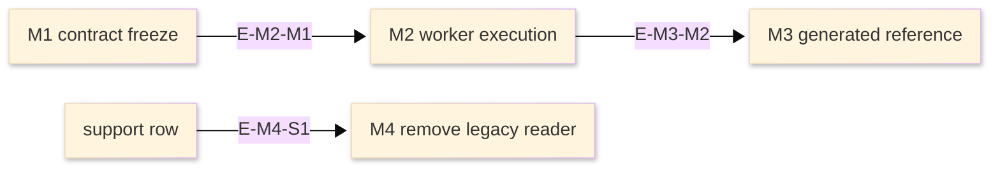

# [ROADMAP_STANDARDS]

A roadmap sequences code work for a concrete route: a repository, package, project, feature folder, integration, migration, refactor, or new module. It states the mission, ordered milestones, task and dependency references, exit criteria, progress rule, documentation handoffs, and proof that closes each milestone. It is not a generic product promise, status diary, release-history tail, or second copy of a live planning system.

The controlling rule: a roadmap exists to help agents decide what to build next, what must not be started yet, what proof closes the current step, and which adjacent documents must move when code structure, public contracts, tests, tutorials, runbooks, or support policy change.

## [1][USE_WHEN]

Use a roadmap when a code scope has a coordinated sequence that cannot be understood from architecture, ADRs, or an issue tracker alone:
- building a new package, project, tool, feature folder, generated contract, integration, or runtime surface;
- sequencing a refactor, collapse, migration, removal, compatibility window, or stabilization effort;
- coordinating architecture changes with implementation milestones and proof gates;
- tracking which documentation routes must update as code surfaces become real;
- defining binary exit criteria and progress for a milestone before it is complete.

Route current structure to [architecture.md](architecture.md), durable decisions to [adr.md](adr.md), pre-code proposal review to [design-doc.md](design-doc.md), gate taxonomy to [test-strategy.md](test-strategy.md), supported-version lifecycle to [support-matrix.md](../reference/support-matrix.md), release history to the project release mechanism, and repeatable procedures to [runbook.md](../task/runbook.md) or how-to/tutorial documents.

Authoring contract:
- Agent use: decide next implementation work, blocked work, required proof, and adjacent document updates.
- Required produced structure: lead, scope, status vocabulary, ID/progress rules, milestone records, exit proof rules, boundaries, and checklist.
- Section cardinality: one scope, one status vocabulary, one ID/progress rule set, one milestone list, and optional current status, constraints, dependencies, handoffs, issue/risk register, or deferred-work sections only when referenced.
- Adjacent checks: architecture for current structure, ADR/design for decision source, API/reference/code docs for public surfaces, support matrix for compatibility, test strategy for gates, task/learning docs for procedures and adoption.
- Maintenance triggers: changed code scope, milestone state, proof gate, dependency edge, public contract, support row, generated output, or live-planner source.
- Stale prevention: remove duplicated mutable task state when a live planner carries it; close or route away handoffs before marking a milestone complete.

## [2][PLANNING_TRUTH]

Use the nearest live source for mutable planning facts and the Markdown roadmap for durable sequencing shape:
1. Route-maintained issue, milestone, release, project board, or planning system carries live status, dates, blockers, assignments, and task comments.
2. Repository source, manifests, generated contracts, architecture, ADRs, tests, and release artifacts own proof.
3. This standard carries roadmap structure: mission, milestone records, task ID policy, progress calculation, dependency edges, documentation handoffs, and closure rules.
4. Common Changelog applies only when a project adopts `CHANGELOG.md` release-history formatting.

When Markdown and a live planner disagree, the live planner controls mutable facts. If no live planner exists, the Markdown roadmap may control task IDs and status, but every completion claim still needs proof under [proof.md](../proof.md).

Maintenance follows the route of the changed fact:

| [INDEX] | [EVENT]                                              | [ROADMAP_ACTION]                                                   |
| :-----: | :--------------------------------------------------- | :----------------------------------------------------------------- |
|   [1]   | live planner status, blocker, or route changes       | refresh the linked snapshot or remove duplicated mutable facts     |
|   [2]   | exit proof lands                                     | check the matching exit criterion, update progress, and link proof |
|   [3]   | architecture path, invariant, or flow changes        | update milestone architecture links and documentation handoffs     |
|   [4]   | ADR or design changes milestone boundary             | update dependency, decision, or design fields before editing tasks |
|   [5]   | sequence completes or is canceled                    | close, archive, or route history to release notes or changelog     |
|   [6]   | architecture and ADRs already carry all active truth | replace the roadmap with a `No roadmap` verdict in the route index |

`No roadmap` is a route-away verdict:

```markdown template
Roadmap: not authored.
Reason: current architecture and accepted ADRs already carry the active route truth.
Architecture: `<architecture path>`
Decision source: `<ADR path when one controls the verdict>`
```

## [3][SEQUENCE_TYPE]

Pick the code sequence type that matches the work. The type guides emphasis; it is not a status level and it does not add fields by itself.

| [INDEX] | [TYPE]                   | [USE_FOR]                                                                           | [PRIMARY_PROOF]                                                    |
| :-----: | :----------------------- | :---------------------------------------------------------------------------------- | :----------------------------------------------------------------- |
|   [1]   | Package build            | new package, app, library, tool, or generated-contract route                        | project file, package manifest, build/test gate, generated output  |
|   [2]   | Feature build            | feature folder, user-facing capability, public command, component, or workflow      | source path, route/command, scenario, screenshot, acceptance gate  |
|   [3]   | Refactor or collapse     | routing move, surface consolidation, dead-path removal, dependency reduction        | diff, architecture invariant, build/test gate, deleted stale paths |
|   [4]   | Integration or migration | host integration, external contract, storage move, compatibility window             | contract proof, adapter path, support row, runtime or bridge proof |
|   [5]   | Hardening sequence       | stabilization, performance, reliability, documentation readiness, release candidate | test strategy gate, benchmark, support evidence, release artifact  |

Name the sequence type in the lead because it tells the reader which proof matters most. Do not invent custom types when one of these covers the work; add a local subtype in prose only when the route already uses that vocabulary.

## [4][STATUS_VOCABULARY]

`Roadmap state` describes the document as a planning source. Use exact casing:
- `ACTIVE`: the roadmap controls the current coordinated sequence.
- `SNAPSHOT`: the roadmap summarizes a live planner and every mutable row links to that route.
- `PAUSED`: the sequence is intentionally stopped and names the return condition.
- `CLOSING`: remaining items are being completed, canceled, or moved.
- `ARCHIVED`: the roadmap is not active and points to release history, architecture, ADRs, or the live planner that replaced it.

Milestone `Status` uses this closed set unless a live planner controls a different vocabulary and the roadmap maps it before first use:
- `PLANNED`: accepted for sequencing, not yet executing.
- `IN-PROGRESS`: active inside milestone scope.
- `BLOCKED`: a named dependency, decision, access gap, or proof gap prevents progress.
- `DEFERRED`: moved outside the current sequence with a return event.
- `DONE`: all exit criteria are checked, proof agrees, and required handoffs are closed.
- `DROPPED`: removed before accepted execution because it is duplicate, invalid, superseded outside this roadmap, or has no remaining dependency or handoff reference.
- `CANCELED`: accepted work stopped; successor, rollback, or retired need is stated.

Lifecycle categories: active states are `PLANNED` and `IN-PROGRESS`; the blocked state is `BLOCKED`; the returnable state is `DEFERRED`, and it keeps the original ID if a return event moves it back into sequence; terminal states are `DONE`, `DROPPED`, and `CANCELED`. Keep a terminal record while any milestone, dependency, proof receipt, documentation handoff, README status, architecture overlay, or support row references its ID. Delete or archive it only after the live planner, release route, or replacement roadmap preserves the needed history.

Avoid vague status labels such as `ongoing`, `soon`, `almost complete`, `waiting`, or `docs later`. If the status cannot be mapped to one value, split the milestone or move mutable task detail to the live planner.

## [5][REQUIRED_STRUCTURE]

Use this heading order for a standalone roadmap:

```markdown template
# [<CODE_SCOPE>_ROADMAP]

<Lead: name roadmap state, sequence type, mission, code scope, live planning route, and proof route.>

## [1][SCOPE]

## [2][STATUS_VOCABULARY]

## [3][ID_PROGRESS_RULES]

## [4][MILESTONES]

## [5][EXIT_PROOF_RULES]

## [6][BOUNDARIES]

## [7][CHECKLIST]
```

Add these conditional sections only when they change sequencing or maintenance behavior:

```markdown template
## [N][CURRENT_STATUS]

<Insert after `Scope` only when a compact snapshot adds value over the live planner and every row links its live source.>

## [N][CONSTRAINTS]

<Insert before `Milestones` only when a build, host, compatibility, package, performance, or support constraint shapes sequence.>

## [N][DEPENDENCIES_AND_BLOCKERS]

<Insert after `Milestones` only when prerequisites, blockers, external dependencies, or go/no-go gates exist.>

## [N][DOCUMENTATION_HANDOFFS]

<Insert after `Dependencies and blockers` when milestone completion changes another document route. If no dependencies section exists, insert after `Milestones`.>

## [N][WORK_REGISTER]

<Insert after `Dependencies and blockers` when roadmap sequencing depends on tasks, blockers, issues, risks, or proof gaps. If no dependencies section exists, insert after `Milestones`.>

## [N][DEFERRED_DROPPED_CANCELED_WORK]

<Insert after `Dependencies and blockers` when that section exists; otherwise insert after `Milestones`. Use only when exclusions are not already clear in milestone records.>
```

Required sections are required because agents need them in order: understand mission and code scope, map statuses, use stable IDs and progress, execute milestones, prove closure, route adjacent concerns, and review for drift. Conditional sections appear only when they change sequencing or maintenance behavior.

Section cardinality:
- `Lead`, `Scope`, `Status vocabulary`, `ID/progress rules`, `Milestones`, `Exit proof rules`, `Boundaries`, and `Checklist`: required, single.
- `Milestones`: repeatable records under one required section.
- `Current status`, `Constraints`, `Dependencies and blockers`, `Documentation handoffs`, `Work register`, and `Deferred/dropped/canceled work`: conditional.
- Handoff, blocker, issue, risk, task, and proof-gap records: repeatable only when referenced by a milestone, dependency, proof rule, or adjacent document.

An accepted lead is implementation-specific:

```markdown conceptual
# [EVENT_PIPELINE_ROADMAP]

Roadmap state: ACTIVE. Sequence type: Package build. This roadmap sequences `src/EventPipeline/` from contract admission to worker execution and generated reference readiness. The live planner carries mutable task status; this file carries milestone IDs, exit criteria, dependency edges, documentation handoffs, and proof links.
```

Reject a lead that makes a vague commitment:

```markdown rejected
# [EVENT_ROADMAP]

This roadmap lists future improvements for the event system.
```

## [6][SCOPE]

`Scope` opens with the mission statement: the durable code outcome the sequence exists to move. A mission is not `ship the roadmap`; it states the capability, package, migration, refactor, or integration outcome that will be true when the sequence closes.

The `Scope` section names:
- included paths, project files, packages, generated outputs, commands, public contracts, and runtime or host boundaries;
- excluded paths or work streams that must not be inferred from the roadmap;
- live planning route when mutable task status lives outside Markdown;
- architecture route for current structure and invariants;
- release-history route for shipped history.

This example shows a scope mission and boundary record:

```markdown conceptual
Mission: make `src/EventPipeline/` a standalone package with stable generated contracts, one worker execution path, and documented public caller semantics.
Included: `src/EventPipeline/EventPipeline.csproj`, `Contracts/`, `Admission/`, `Execution/`, generated reference page.
Excluded: legacy export retirement after the compatibility support row ends.
Live planner: project board `event-pipeline`.
Architecture: `src/EventPipeline/_ARCHITECTURE.md`.
Release history: package release notes.
```

## [7][CURRENT_STATUS]

Use `Current status` only when the roadmap is a useful snapshot over several milestones. The opening sentence states why the snapshot adds value over the live planner. Each row links the live source and avoids copying mutable details that the live source already displays. Do not include progress, dates, blockers, or assignments in this table unless the cell links the live source that carries the mutable fact.

| [INDEX] | [MILESTONE] | [STATUS]    | [LIVE_SOURCE] | [CURRENT_READER_ACTION]                            |
| :-----: | :---------- | :---------- | :------------ | :------------------------------------------------- |
|   [1]   | M1          | DONE        | issue/101     | build M2 on frozen schema                          |
|   [2]   | M2          | IN-PROGRESS | issue/112     | do not edit worker API without architecture update |

Omit this section when the live planner already provides the same scan.

## [8][ID_PROGRESS_RULES]

IDs exist so milestones, dependencies, architecture notes, ADRs, designs, proof receipts, and documentation handoffs can reference the same implementation unit without copying text.

- Milestone IDs are stable `M<N>` anchors. Do not assign a completed, deferred, dropped, or canceled ID to unrelated work; a `DEFERRED` item keeps its ID when its return event moves it back into sequence.
- Task IDs use `M<N>.T<N>` only when Markdown is the controlling task planner and the task needs a dependency, proof, milestone, or handoff reference.
- Issue and risk IDs exist only when dependencies, proof, milestones, tasks, or adjacent documents reference them.
- If a live planner carries tasks, link the live source from the milestone and keep task breakdown out of Markdown.
- If tasks are design change slices, route them to the design doc as `S<N>` slices.
- If tasks are proof subchecks for one exit criterion, keep them nested under that criterion and do not assign task IDs.

Progress defaults to unweighted checked exit criteria with proof agreement:

```text template
Progress: 3/6 exit criteria proven
```

The numerator is checked exit criteria whose proof surface agrees. The denominator is total exit criteria for that milestone. Nested checklist items are proof subchecks and do not enter the progress denominator unless the roadmap explicitly promotes them to top-level exit criteria. Adding, deleting, or rewriting an exit criterion after a milestone enters `IN-PROGRESS` is a scope change; recalculate progress, state the changed denominator, and link the source that changed the exit rule. Percentages, weights, complexity points, cross-milestone rollups, and date-based bars require a named calculation route and rule before first use. A progress marker without a calculation rule is unsupported and must be removed.

### [8.1][WORK_RECORD_MODEL]

Roadmap-local records declare their field order before examples:
- Milestones are outcome records. Use `ID`, `Status`, `Progress`, `Goal`, `Mission contribution`, `Code scope`, `Deliverables`, `Exit criteria`, `Proof surface`, then conditional fields.
- Tasks exist only when Markdown controls task planning. Use `ID`, `Status`, `Milestone`, `Goal`, `Code scope`, `Depends`, `Exit`, `Proof surface`, `Documentation handoff`, `Route-away`.
- Blockers use `ID`, `Status`, `Blocks`, `Blocked by`, `Source route`, `Go/no-go rule`, `Evidence`, `Close when`, `Route-away`.
- Issues, risks, and proof gaps use kind-specific statuses under `Work register`; when they carry lifecycle, include `Exit` before `Depends`.
- Documentation handoffs use `ID` and `Status` only when closure is tracked by the roadmap; otherwise use the shared adjacent-document relation record.

## [9][CONSTRAINTS]

Use `Constraints` only when a build, package, host, compatibility, performance, support, or runtime fact shapes sequence. `Phase 0` and similar phase labels are not statuses. They must be milestone names, milestone IDs, or live-planner labels mapped before first use.

```markdown template
Constraint: <build, package, host, compatibility, performance, support, or runtime constraint>
Applies to: <milestone, task, code scope, support row, or README status row>
Sequence effect: <blocks start, blocks exit, constrains proof, or constrains handoff>
Proof gate: <command, source path, support row, or stated gap>
Update when: <constraint source changes>
Route-away: <architecture, support matrix, test strategy, README, or runbook body>
```

## [10][MILESTONES]

Each milestone is one field/value record. It separates implementation intent from proof so an agent can update one field without rewriting the plan.

Milestone records split fields into required and conditional sets:

Required fields:
- `ID`: stable `M<N>` identifier.
- `Status`: one value from the roadmap status vocabulary.
- `Progress`: count calculated by `ID_PROGRESS_RULES`, unless a live planner carries progress.
- `Goal`: one sentence stating the implementation change.
- `Mission contribution`: how the milestone moves the roadmap mission.
- `Code scope`: paths, project files, package manifests, generated outputs, commands, or public contracts touched.
- `Deliverables`: concrete code or documentation artifacts.
- `Exit criteria`: binary checklist of observable conditions.
- `Proof surface`: smallest evidence that demonstrates exit.
- `Proof map`: required when `Progress` is nonzero or when one `Proof surface` covers multiple gates; map each checked exit criterion to the exact evidence, generated artifact, command, status check, review, or stated proof gap.

Conditional fields:
- `Live task source`: required when a live planner carries tasks.
- `Tasks`: allowed only when Markdown controls tasks; use stable `M<N>.T<N>` IDs.
- `Dependencies`: required when prerequisites, blockers, or external dependencies exist.
- `Architecture link`: required when current structure, path state, dependency direction, or invariant controls the milestone.
- `Decision source`: required when an ADR controls boundary or exit.
- `Design source`: required when an accepted design defines the selected approach.
- `Proof gate`: required when test strategy, quality, runtime, review, or support proof carries exit.
- `Documentation handoff`: required when milestone completion changes architecture, ADR, design, API, reference, code documentation, README, how-to, tutorial, runbook, support, or test strategy.
- `Deferred work`: required when related work is intentionally excluded and may return later.
- `Off-ramp`: required for exploratory or risky implementation; state the stop condition and action.

Use this accepted milestone record shape:

```markdown template
### [4.1][M2_WORKER_EXECUTION]

ID: M2
Status: IN-PROGRESS
Progress: 2/6 exit criteria proven
Goal: move validated events through the new worker execution path.
Mission contribution: replaces split execution paths with one package-local worker boundary.
Code scope: `Execution/EventWorker.cs`, `Execution/RetryPolicy.cs`, `EventPipeline.csproj`.
Deliverables: worker execution path, retry policy, architecture flow update.
Live task source: issue/112
Exit criteria:
    - [x] worker entrypoint compiles inside `EventPipeline.csproj`
    - [x] retry policy carries transient host-failure behavior
    - [ ] direct `Admission/ -> Storage/` writes are absent
        - [ ] dependency gate passes
        - [ ] architecture dependency matrix is updated
    - [ ] generated contract still validates accepted event envelopes
        - [ ] code documentation names caller-visible worker semantics
        - [ ] roadmap handoff records are closed
Proof surface: build output, dependency gate, generated contract diff, and code-documentation review.
Proof map:
    - worker entrypoint compiles: build output from `EventPipeline.csproj`.
    - retry policy carries transient host-failure behavior: review of `Execution/RetryPolicy.cs`.
Depends: M1: DONE; support row: compatibility window open.
Architecture link: `Execution/EventWorker.cs [IN-PROGRESS M2]` and flow node.
Proof gate: dependency and contract gates in test strategy.
Documentation handoff: architecture flow, code documentation, generated reference.
```

Reject this milestone shape because it has no calculated progress or proof:

```markdown rejected
### [4.1][M2_WORKER]

Status: vague
Goal: finish worker.
Progress signal: uncalculated.
Proof surface: unverified.
```

The rejected record has no stable ID, no calculation rule, no binary exit criteria, no code scope, and no proof.

## [11][DEPENDENCIES_AND_BLOCKERS]

Dependencies are sequencing edges, not task lists. Use the edge table as the controlling text representation when one milestone cannot start, complete, or prove exit until another fact changes. Dependent work is the milestone or task that cannot start, complete, or prove exit; `Requires` is the prerequisite fact, milestone, support row, decision, gate, or external contract.

| [INDEX] | [EDGE_ID] | [DEPENDENT] | [REQUIRES]  | [RELATIONSHIP]      | [SOURCE_ROUTE]     | [LIVE_SOURCE] | [GO_NO_GO_RULE]                                             |
| :-----: | :-------- | :---------- | :---------- | :------------------ | :----------------- | :------------ | :---------------------------------------------------------- |
|   [1]   | E-M2-M1   | M2          | M1          | blocked by          | internal milestone | issue/101     | start M2 only after generated schema diff is approved       |
|   [2]   | E-M4-S1   | M4          | support row | external dependency | support matrix     | support row   | remove legacy reader only after compatibility window closes |

Use relationship names from this set: `blocks`, `blocked by`, `prerequisite`, `external dependency`, `go/no-go`, or `supersedes`. Link the route that controls the live dependency. Move tactical subtasks to the live planner, milestone `Tasks`, or design slices.

Use Mermaid only when three or more edges are easier to scan visually than the table. The diagram shows sequence; the table carries `SOURCE_ROUTE`, `LIVE_SOURCE`, and `GO_NO_GO_RULE`. Label derived graph edges with stable edge IDs so the table remains the update surface.



Text equivalent: the edge table controls dependency source and go/no-go fields; the graph only shows that M1 unblocks M2, M2 unblocks M3, and the support row gates M4.

Blocker records cover access blockers, proof blockers, decision blockers, and support blockers that are not clean milestone-to-milestone edges:

```markdown template
ID: B-M2-1
Status: BLOCKED
Blocks: M2 exit criterion `<criterion name>`
Blocked by: <decision, access, proof gate, support row, or external contract>
Source route: <path, ADR, design, support row, live issue, or gate route>
Go/no-go rule: <binary rule>
Evidence: <current source or stated proof gap>
Close when: <fact changes>
Route-away: <discussion, procedure, or support body that belongs elsewhere>
```

## [12][DOCUMENTATION_HANDOFFS]

Use a handoff record when milestone completion changes another document route. Omit absent routes; do not write `none`.

```markdown template
ID: H-M2-1
Status: PLANNED | IN-PROGRESS | BLOCKED | DONE | DROPPED | CANCELED
Milestone: M2
Destination path: <architecture, ADR, design, API, reference, code documentation, README, how-to, tutorial, runbook, support, or test-strategy path>
Changed fact: `Execution/EventWorker.cs` becomes the single execution path.
Consumed by: architecture codemap, code-documentation public semantics, and test-strategy gate mapping.
Use in this document: M2 cannot close until linked document routes consume or route away the fact.
Update when: worker entrypoint, flow, generated contract, or proof gate changes.
Close when: linked documents are updated or explicitly route the fact away.
Route-away: architecture body, source-comment content, and gate taxonomy stay in their routes.
```

Every `Documentation handoff` listed in a milestone must have a matching handoff record or an explicit route-away note that explains why the adjacent route does not change.

Use these common handoff triggers:

| [TRIGGER]                                                                     | [UPDATE_TARGET]             |
| :---------------------------------------------------------------------------- | :-------------------------- |
| path, project, package, generated output, flow, dependency, invariant changes | architecture                |
| durable decision is accepted or superseded                                    | ADR                         |
| proposal slices become accepted implementation                                | design doc                  |
| public endpoint, generated contract, CLI, or package surface changes          | API or reference            |
| public symbol, caller semantics, failure mode, or extension point changes     | code documentation          |
| adoption path, setup command, or navigation changes                           | README, how-to, or tutorial |
| recovery, rollback, operator action, or incident path changes                 | runbook                     |
| supported version, compatibility window, or lifecycle changes                 | support matrix              |
| proof gate, flake policy, or test taxonomy changes                            | test strategy               |

## [13][WORK_REGISTER]

Use a register only when a roadmap-local issue, risk, task, or proof gap changes sequence, dependencies, or adjacent updates. Live issue bodies stay in the live planner; the roadmap carries only the fact that changes agent action.

Register kinds define status semantics before records:
- `Kind: issue` uses `OPEN`, `ASSIGNED`, `CLOSED`, `DROPPED`.
- `Kind: risk` uses `OPEN`, `MITIGATED`, `ACCEPTED-AS-RISK`, `CLOSED`, `DROPPED`.
- `Kind: blocker` and `Kind: proof-gap` may use roadmap lifecycle states only when they directly block a milestone or task.

Field order is fixed: `ID`, `Kind`, `Status`, `Changed fact`, `Consumed by`, `Use in this document`, `Exit`, `Depends`, `Evidence`, `Update when`, `Close when`, `Route-away`, then local detail fields.

```markdown template
### [12.1][RISK_CONTRACT_DRIFT]

ID: R-M2-1
Kind: risk
Status: OPEN
Changed fact: generated event contract may change after M2 worker code lands.
Consumed by: M2 exit criteria and M3 generated-reference milestone.
Use in this document: M2 cannot close until contract drift is either proven absent or routed to M3.
Exit: contract drift is proven absent, mitigated, or accepted by M3.
Depends: M1: DONE
Evidence: generated contract diff or stated unrun gap.
Update when: contract generator, schema source, or consumer compatibility gate changes.
Close when: contract diff is reviewed or M3 accepts the remaining work.
Route-away: design discussion and issue comments stay in the live planner.
Risk: worker semantics and generated reference may describe different payload shape.
```

## [14][DEFERRED_DROPPED_CANCELED_WORK]

Use this section only when exclusions are not clear enough inside milestone records.

```markdown template
### [13.1][LEGACY_EXPORT_RETIREMENT]

Status: DEFERRED
Reason: compatibility window is controlled by support matrix.
Successor: M4 after support row closes.
Return event: support row changes from maintained to retired.
```

CANCELED work states the successor, rollback, or retired need. DEFERRED work states the event that can return it to the sequence. DROPPED work states why the item no longer belongs in this roadmap and removes dependency references to it.

## [15][EXIT_PROOF_RULES]

A milestone reaches `DONE` only when every exit criterion is checked, the proof surface agrees, and adjacent handoffs required for that milestone are closed or explicitly routed away.

Exit criteria are binary GFM task-list items. Each item is independently true or false. Nested checklists are allowed only as proof subchecks for a single exit criterion.

```markdown template
Exit criteria:
    - [ ] public contract generated and linked
    - [ ] worker boundary has no direct storage writes
        - [ ] dependency gate passes
        - [ ] architecture matrix reflects the rule
```

Choose the smallest proof surface that proves the exit criterion:
- source path, project file, package manifest, generated contract, generated reference, or release artifact;
- exact build, test, quality, documentation, link, runtime, or preview command;
- status check, pull-request review, architecture review, or manual route check;
- runtime capture, scenario output, benchmark, support signal, or adoption evidence when the milestone carries that proof.

State an unrun gate honestly. Do not infer completion from intention, elapsed time, unchecked tasks, or a broad build that does not prove the exit criterion.

## [16][BOUNDARIES]

- [architecture.md](architecture.md) carries current code structure, project identity, path states, flows, dependency direction, and invariants.
- [adr.md](adr.md) carries durable decisions and their confirmation.
- [design-doc.md](design-doc.md) carries pre-code proposals, risks, validation slices, and accepted approach.
- [test-strategy.md](test-strategy.md) carries gate taxonomy, flake policy, and proof vocabulary.
- [support-matrix.md](../reference/support-matrix.md) carries supported versions, compatibility windows, and lifecycle status.
- [reference.md](../reference/reference.md) carries lookup facts; release history belongs to the project release mechanism.
- [runbook.md](../task/runbook.md) carries operational procedures and recovery.
- External product roadmap commitments belong to the maintained product planning or release surface; this standard applies only when a code scope needs implementation sequence, exit proof, dependency edges, or documentation handoffs.
- [README.md](../README.md) carries document-type routing, placement, and lifecycle.

## [17][CHECKLIST]

- [ ] The roadmap sequences a concrete code scope: repository, package, project, feature folder, integration, migration, refactor, or new module.
- [ ] The lead names roadmap state, sequence type, mission, code scope, live planning route, and proof route.
- [ ] `Scope` states mission, included paths, excluded work, live planner, architecture route, and release-history route.
- [ ] Status values come from the closed vocabulary or are mapped from the live planner before first use.
- [ ] Milestone IDs are stable `M<N>` anchors and are not reused after completion, deferral, drop, or cancellation.
- [ ] Task IDs appear only when Markdown controls tasks and the task needs dependency, proof, or handoff references.
- [ ] Progress is calculated from checked exit criteria with proof agreement, or the roadmap states another calculation route and rule.
- [ ] Every milestone names code scope, mission contribution, deliverables, binary exit criteria, proof surface, and conditional adjacent routes.
- [ ] Nested checklists appear only as proof subchecks under one exit criterion.
- [ ] Tasks, blockers, issues, risks, proof gaps, constraints, and handoffs use their declared local record family and field order.
- [ ] Deferred work keeps its ID when it returns; dropped and canceled work name removal, successor, rollback, or retired need.
- [ ] Dependencies use edge records, name a relationship, and link the live route source.
- [ ] Mermaid appears only for multi-edge sequence clarity, never as unsupported status art.
- [ ] Issue, risk, and task IDs appear only when dependencies, proof, milestones, or adjacent documents reference them.
- [ ] Documentation handoffs use the shared relation fields and appear only when milestone completion changes another document route.
- [ ] Deferred work states the return event; dropped work removes dependency references; canceled work states successor, rollback, or retired need.
- [ ] A milestone is `DONE` only when exit criteria, proof surface, and required handoffs agree.
- [ ] Shipped history is moved to the release route instead of kept as roadmap tail.
