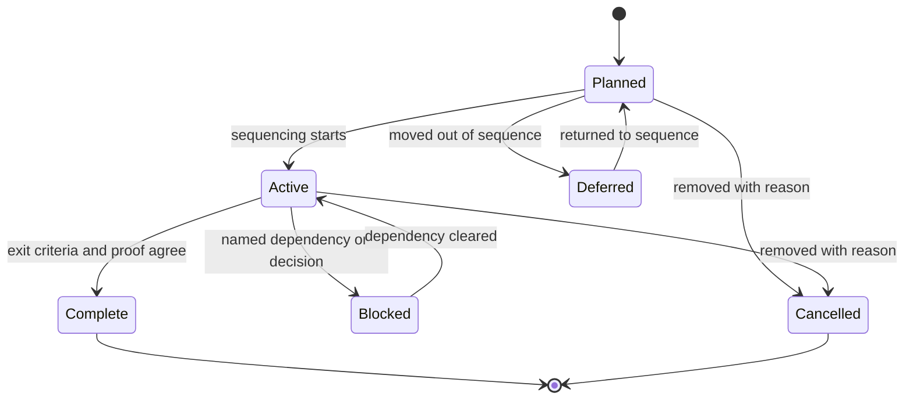

# [ROADMAP_STANDARDS]

A roadmap states planned sequence, milestone intent, the measurable outcome each milestone serves, dependencies, exit criteria, and the proof that closes each milestone. It answers what must happen next, what outcome the work moves, what has cleared its exit bar, and what evidence shows the work is done. It carries intent, outcome, and proof surfaces, not the live dates, status, or blocker state that a planning system owns.

This standard uses an outcome-based, horizon-aware roadmap: every milestone ladders up to a measurable objective rather than a shipped feature, and certainty decreases with horizon so far-dated work is never promised as committed. It binds that form to the agent-facing structures — machine-scannable frontmatter, status-tagged milestone records, binary exit checklists, and a live-source dependency table — that keep a roadmap honest and refreshable.

## [1][USE_WHEN]

Use a roadmap when readers need planned sequence across milestones, the outcome each milestone serves, dependency and blocker visibility, exit criteria for a build or release or capability sequence, or the proof surfaces that close those milestones.

Route elsewhere when the reader's real need is current structure, a durable decision, a pre-code proposal, test taxonomy, supported-version lifecycle, a command or API lookup, or a repeatable procedure. Each of those needs has its own owner named in Boundaries.

## [2][SOURCE_TRUTH]

Maintained milestone, linked-issue, release, and pull-request systems own dates, status, blocker state, and exit evidence whenever they exist. A Markdown roadmap summarizes that contract and links the live source; it never restates a date or status the planning system can change underneath it.

When the Markdown and the planning system disagree, the planning system controls the live fact and the Markdown is stale. Carry the live link, not a copy, for any field the source can change.

`Source of truth:` the owner's milestone, issue, and release systems.

## [3][PROFILES]

Pick exactly one profile and name it in the opening metadata block and the lead paragraph. A profile fixes the milestone granularity, the proof surface, the horizon axis, and the reader-boundary rules; mixing two profiles in one page splits the proof model, so split the document instead. Keep the profile facts together, with short cells and a note only where a token needs interpretation.

| [INDEX] | [PROFILE]         | [READER]           | [UNIT]            | [HORIZON]      | [PROOF]           | [COMMITMENT]  |
| :-----: | :---------------- | :----------------- | :---------------- | :------------- | :---------------- | :------------ |
|   [1]   | Phased build      | builders           | capability layer  | phased         | path, build, test | no            |
|   [2]   | Concern spec      | concern owners     | scoped outcome    | phased         | contract/scenario | no            |
|   [3]   | Foundation status | extension owners   | extension point   | snapshot       | invariant/codemap | no            |
|   [4]   | Release train     | release owners     | release/iteration | release cycle  | check/artifact/PR | external only |
|   [5]   | Public product    | external readers   | theme             | Now/Next/Later | release evidence  | yes           |
|   [6]   | No roadmap        | mature-scope owner | none              | none           | architecture/ADR  | n/a           |

The `No roadmap` profile is a routing verdict, not a document: when architecture and ADRs already carry the truth, do not author a roadmap. Record the verdict in the owner's README index instead.

## [4][PLACEMENT]

Place a roadmap next to the owner that can refresh it. Use the narrowest scope that still covers one coordinated sequence.

- Owner-local roadmap: `{owner}/ROADMAP.md`.
- Concern roadmap: `{owner}/{concern}/ROADMAP.md`.
- Repo-wide roadmap: root `ROADMAP.md`, only when one coordinated sequence spans the whole repository.
- Published product roadmap: the maintained product documentation or planning surface when the roadmap is external-facing.

## [5][STATUS_VOCABULARY]

Define only the statuses the roadmap actually uses, and use each one with the exact meaning below. A roadmap that introduces a status outside this set defines it inline before first use.

Status: Planned | Active | Blocked | Complete | Deferred | Cancelled

- `Planned`: accepted for sequencing, not yet executing.
- `Active`: in progress and still inside its milestone scope.
- `Blocked`: a named dependency or decision prevents progress.
- `Complete`: exit criteria passed and proof is linked.
- `Deferred`: intentionally moved outside the current sequence.
- `Cancelled`: removed from the plan, with the reason stated.

The `Release train` and `Public product roadmap` profiles may add exploration, design, preview, and general-availability stages only when the product or release process already assigns those meanings. The status set forms a lifecycle whose transitions are the subject, so render it as a state diagram.



## [6][REQUIRED_STRUCTURE]

Use this template. The opening metadata block is an in-body definition block so an agent can triage profile, status, ownership, source of truth, and freshness without parsing YAML. Each section carries a cardinality: `required` sections always appear, `conditional` sections appear only when their condition holds, `optional` sections appear at author discretion, and `repeatable` records appear once per item.

```markdown template
# [SCOPE_ROADMAP]

Id: <scope-slug>-roadmap
Status: Planned | Active | Blocked | Complete | Deferred | Cancelled
Profile: Phased build | Concern spec | Foundation status | Release train | Public product roadmap
Owner: <owner role or group>
Source of truth: <link to the owner milestone, issue, or release system>
Last reviewed: <YYYY-MM-DD>
Horizon axis: phased | now-next-later | release-cycle | status-snapshot

<Lead: name the one profile; for external profiles declare directional, committed, or historical; state the one coordinated sequence this covers.>

## [1][SCOPE]

## [2][CURRENT_STATUS]

## [3][STATUS_VOCABULARY]

## [4][PRINCIPLES_CONSTRAINTS]

## [5][MILESTONES]

## [6][DEPENDENCIES_BLOCKERS]

## [7][EXIT_PROOF]

## [8][DEFERRED_OUT_SCOPE]

## [9][PUBLIC_ROADMAP_RULES]

## [10][BOUNDARIES]

## [11][REVIEW_CHECKLIST]

```

Section cardinality:

- Metadata fields `Id`, `Status`, `Profile`, `Owner`, `Source of truth`, `Last reviewed`, and `Horizon axis` — required, one each.
- `Scope`, `Current status`, `Status vocabulary`, `Milestones`, `Exit proof` — required.
- `Dependencies and blockers` — conditional; required when any milestone has a prerequisite, external dependency, or go/no-go gate; omit only when every milestone is independent.
- `Deferred or out-of-scope work` — conditional; required when any item is excluded; omit only when nothing is deferred.
- `Public roadmap rules` — conditional; required for the `Public product roadmap` profile and any external-facing `Release train`; omit for internal profiles.
- `Principles and constraints` — optional; include only when a constraint shapes the sequence beyond the mechanical order of the milestones.
- `Boundaries`, `Review checklist` — required.

## [7][METADATA_RULES]

Carry the machine-scannable header as an opening definition block, one `label: value` field per line, so an agent triages relevance, ownership, and freshness before reading the body. Every field below is required; a roadmap missing `Source of truth` or `Last reviewed` is rejected.

- `Id`: a stable `<scope-slug>-roadmap` identifier an index or generator can reference.
- `Status`: one value from the status vocabulary, naming the roadmap's own lifecycle state.
- `Profile`: exactly one profile, matching the lead paragraph.
- `Owner`: the role or group accountable for refreshing the roadmap.
- `Source of truth`: a link to the owning milestone, issue, or release system, never a copied status.
- `Last reviewed`: the date the roadmap was last reconciled against its source, in ISO-8601 (`YYYY-MM-DD`).
- `Horizon axis`: the certainty axis the milestones use — `phased`, `now-next-later`, `release-cycle`, or `status-snapshot` — matching the profile.

## [8][CURRENT_STATUS]

Render the at-a-glance lifecycle view as a snapshot table, never as prose narration, so a reader sees every milestone's state and the live source in one scan. One row per milestone; the `Status` cell carries a value from the closed vocabulary, and the live-source cell links the system that owns the current state.

| [INDEX] | [MILESTONE] | [STATUS] | [OUTCOME_IT_SERVES] | [LIVE_SOURCE] | [LAST_REVIEWED] |
| :-----: | :---------- | :------- | :------------------ | :------------ | --------------: |
|   [1]   | M1          | Complete | `<metric or OKR>`   | `<link>`      |      2026-05-20 |
|   [2]   | M2          | Active   | `<metric or OKR>`   | `<link>`      |      2026-06-04 |

Link the live source per row; never copy a date or status the planning system can change without the live-source link and review date beside it. Use an em-dash for a cell with no applicable value, and keep dates in ISO-8601.

## [9][OUTCOME_ANCHORING]

Anchor every milestone to a measurable outcome, not to the artifact it ships. Each milestone names the business objective or OKR it ladders up to and the observable result that proves the outcome moved — a metric, a threshold, or a verifiable condition. A milestone whose only stated value is "ship X" is rejected; the deliverable is the means, the outcome is the point.

State the outcome as the `Outcome` field on the milestone record and again as the `Outcome it serves` column in the Current-status table, so the output-versus-outcome separation holds in both the index and the detail.

## [10][MILESTONES]

Treat each milestone as one `repeatable` record. Render it as a field/value record block so every milestone carries the same load-bearing fields and an author cannot collapse goal into proof or omit exit criteria. Every milestone carries the fields below; mark a field absent only when the cardinality permits it.

- Goal — required, one sentence stating the intended change.
- Status — required, one value from the status vocabulary.
- Outcome — required, the measurable result or OKR link the milestone serves.
- Deliverables or scoped outcomes — required, one or more concrete artifacts.
- Exit criteria — required, a binary checklist of observable, falsifiable conditions; see Exit proof.
- Proof surface — required, the smallest evidence that demonstrates exit.
- Dependencies, blockers, or prerequisite milestones — repeatable; required when any exist, absent when the milestone is independent.
- Confidence — conditional; required on `Next`, `Later`, directional, and exploratory milestones where certainty is genuinely partial; carry `Low`, `Med`, `High` or a percentage.
- Off-ramp — conditional; required on exploratory or controlled-experiment milestones; state the criterion that ends the experiment and the action taken when it fails.
- Owner or accountable review group — optional; include when the milestone owner differs from the opening metadata `Owner`.
- Deferred work — optional; include when this milestone intentionally excludes a related outcome.

Separate intent from proof. A milestone reaches `Complete` only when every exit-criterion checkbox is checked and its proof surface agrees; a passing build with an unchecked criterion, or all criteria met with no linked proof, leaves the milestone `Active`.

For the `Public product roadmap` profile and any external `Release train`, group milestones by horizon — `### [N.M][NOW]`, `### [N.M][NEXT]`, `### [N.M][LATER]` — and shift content type with the horizon: `Now` carries committed solutions in active development, `Next` carries validated opportunities not yet committed to a solution, and `Later` carries target outcomes only. See Public roadmap rules.

## [11][DEPENDENCIES_BLOCKERS]

Expose sequencing risk as a decision table that links the live source, not as task tracking, so each dependency edge and its go/no-go gate is explicit instead of buried in prose. Each row names a relationship and points to the system that owns the current state.

| [INDEX] | [EDGE]  | [RELATIONSHIP] | [LIVE_SOURCE]     | [GATE_DECISION]              |
| :-----: | :------ | :------------- | :---------------- | :--------------------------- |
|   [1]   | M2 ← M1 | blocked by     | `<issue link>`    | go when host bundle resolves |
|   [2]   | M3 ext  | vendor         | `<contract link>` | go/no-go on `<evidence>`     |

- Name the relationship from a fixed set: `blocks`, `blocked by`, `prerequisite`, `external-vendor`, or `go/no-go`.
- Link the issue, pull request, epic, milestone, release, design, ADR, or support record that owns the live dependency; never copy its status.
- State each external dependency by owner, contract, or vendor source.
- Record a go/no-go decision point in the `Gate decision` column when the next milestone depends on evidence.
- Move tactical subtasks to the tracker or design document; a roadmap holds the dependency edge, not the task breakdown.

## [12][EXIT_PROOF]

Roadmap proof is milestone-level, and each milestone names the smallest evidence that demonstrates exit. Exit criteria are a binary checklist: each item is an observable, falsifiable condition that is independently true or false, captured as a GFM task-list item, not a single vague sentence. A criterion such as "improve performance" is rejected; "`- [ ] p95 latency < 200 ms verified by <command>`" is accepted. The checklist captures completion conditions beyond linked tasks — `design approved`, `beta feedback complete`, `legal review` — so closure is checkable item by item.

```markdown template
Exit criteria:
- [ ] all public scenarios run through the in-process bridge
- [ ] no scenario marked skip without a linked issue
```

The proof surface is one concrete artifact a reader can open or one command a reader can run, not a description of done. Choose the proof type that matches the milestone outcome:

- a source path, manifest, generated contract, or release artifact;
- an exact command, build, test, documentation build, link check, or preview build;
- a status check or pull-request review gate;
- an operational verification, runtime run, screenshot, or captured artifact;
- a product metric, support signal, adoption threshold, or owner sign-off when the milestone is rollout-oriented.

Attach the evidence beside the milestone it proves, using the freshness fields the evidence owner defines. State an unrun gate honestly rather than implying it passed.

## [13][PUBLIC_ROADMAP_RULES]

A `Public product roadmap` or external-facing `Release train` carries stronger reader boundaries because external readers treat a published item as a commitment. Apply these rules in addition to the shared milestone rules.

- Declare the framing — `directional`, `committed`, or `historical` — as a single explicit statement in the lead paragraph, not buried in a later bullet.
- Group milestones by the `Now` / `Next` / `Later` horizon and shift content type per horizon: `Now` holds committed solutions in active development sized to actual capacity; `Next` holds validated opportunities not yet committed to a solution; `Later` holds target outcomes only.
- Size `Now` to actual capacity and keep `Later` bounded: `Later` holds only items serving a current outcome or strategic bet, never an open backlog.
- Omit fixed dates on `Next` and `Later` unless the source of truth maintains them; use cycle or quarter granularity, and use ISO-8601 for any date that does appear.
- Distinguish shipped work from planned work by evidence link, not by status color alone, and link each shipped item to release notes, an issue closure, or a changelog entry.
- Hand the shipped-history tail to a Keep-a-Changelog-style source: link the changelog or release notes that own the canonical history rather than restating it, and keep that history in ISO-8601, latest first.
- Move supported-version and end-of-life truth to a support matrix once those facts outgrow a single milestone note.

## [14][EXAMPLES]

Show one milestone record beside the rules it follows, because the goal/outcome/exit/proof separation is the field set most often collapsed in practice.

```markdown template
### [N.M][M3_BRIDGE_SCENARIO]

Status: Active
Goal: Every public scenario runs through the in-process bridge.
Outcome: Scenario coverage of public surface reaches 100% (host-parity OKR).
Deliverables: scenario suite under `tests/csharp/scenarios/`, bridge verify route.
Exit criteria:
- [ ] all public scenarios run through the in-process bridge
- [ ] no scenario marked skip without a linked issue
Proof surface: `uv run python -m tools.quality bridge verify "tests/csharp/scenarios/**"`
Dependencies: blocked by M2 (host bundle resolution) -> `<live link>`
```

The next block collapses goal into proof, omits the outcome, and states exit criteria as an unverifiable phrase, so a reader cannot tell what the milestone moves or when it closes.

```markdown rejected
### [N.M][M3_BRIDGE_COVERAGE]

Status: Active
Goal: Make the bridge pass.
Proof surface: it works.
```

The first block is a `template`; the second is `rejected` and exists only to show the failure.

## [15][BOUNDARIES]

- [architecture.md](architecture.md) owns current structure, invariants, and owner boundaries.
- [adr.md](adr.md) owns durable decisions and their confirmation.
- [design-doc.md](design-doc.md) owns pre-code proposals and validation plans.
- [test-strategy.md](test-strategy.md) owns gate taxonomy and flake policy.
- [support-matrix.md](../reference/support-matrix.md) owns supported versions and lifecycle status.
- [reference.md](../reference/reference.md) owns command, release, and compatibility lookup.
- [runbook.md](../task/runbook.md) owns operational procedures and recovery.
- [README.md](../README.md) owns document-type routing, placement, and lifecycle.

## [16][REVIEW_CHECKLIST]

- [ ] Opening metadata carries `Id`, `Status`, one `Profile`, `Owner`, `Source of truth`, ISO-8601 `Last reviewed`, and `Horizon axis`.
- [ ] Exactly one profile is named in opening metadata and the lead, and it matches `Horizon axis`.
- [ ] Scope states what the sequence covers and what it excludes.
- [ ] Current status is a snapshot table linking the live source per milestone, not prose.
- [ ] Every milestone names a measurable outcome or OKR it serves, not only the artifact shipped.
- [ ] Status values come from the defined vocabulary and are used consistently.
- [ ] Every milestone record carries goal, status, outcome, deliverables, an exit-criteria checklist, and a proof surface, plus dependencies when any exist.
- [ ] Each exit criterion is a binary task-list item, and the proof surface is one openable artifact or runnable command per milestone.
- [ ] A milestone is `Complete` only when every exit checkbox is checked and the linked proof agrees.
- [ ] Dependencies use the decision table, name the relationship, and link the live source; subtask breakdowns are excluded.
- [ ] Exploratory or far-horizon milestones carry a confidence indicator and, for experiments, an off-ramp condition.
- [ ] Deferred work is explicit when anything is excluded, and Cancelled items state the successor or that the need was retired.
- [ ] Public or external profiles declare directional, committed, or historical framing in the lead; `Now` is sized to capacity, `Later` is bounded, far-horizon items carry no fixed dates, and shipped items link evidence in ISO-8601.
- [ ] Each adjacent owner is linked once in Boundaries and nowhere else.
