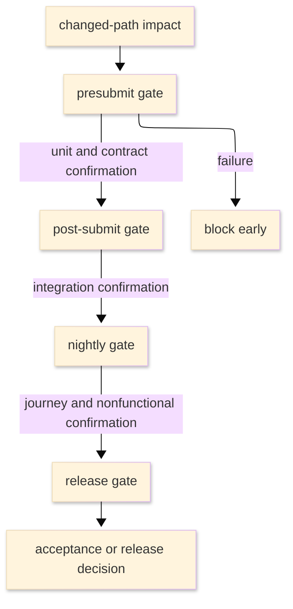

# [TEST_STRATEGY_STANDARDS]

A test strategy document fixes the test portfolio, risk model, gate placement, routing, required confirmation by change type, flaky-test handling when the scope carries it, and entry or exit criteria when the scope gates releases or manual acceptance. It is a testing-risk policy: it states which test levels exist, where each gate runs, how risk selects test depth, which diagnosis path handles failures, and what confirmation closes a change. It is not a contributor command list, framework reference, confirmation-strength catalog, test plan, runbook, or implementation history.

Name one profile and one primary strategy archetype in the opening paragraph. Secondary archetype influences are allowed only when they change gate selection and are named explicitly.

## [1]-[USE_WHEN]

Use a test strategy when a maintained scope must state any of these:
- which test levels exist and which risk each covers;
- how a risk tier selects test depth and the minimum gate;
- where each gate runs and which changes trigger it;
- which entry criteria precede a gate or which exit criteria close an acceptance or release class;
- which route or source carries a failed, noisy, or quarantined test;
- which confirmation is required to approve, merge, release, or manually accept each change family;
- how cost, speed, fidelity, and reliability trade off across the portfolio.

Do not use a test strategy to list every command a contributor runs, catalog runner flags or framework APIs, record milestone sequence, or prescribe incident recovery from a failing production gate.

[AUTHORING_CONTRACT]:
- Agent use: identify the maintained scope, choose one profile and one primary archetype, then map risk tiers to real local gates without turning the page into a command manual.
- Required produced structure: lead, `Scope`, `Principles`, `Risk model`, `Test levels`, `Gate mapping`, `Required confirmation by change`, `Diagnosis and repair`, `Boundaries`, and `Result check`.
- Section cardinality: required sections appear once; entry/exit, flaky-test, metrics, and maintenance sections appear only when their trigger changes gate behavior.
- Adjacent checks: check architecture for invariants, API and code documentation for generated contracts or public symbols, support matrix for supported targets, roadmap for exit confirmation, contributing/how-to for command paths, and runbook for production gate recovery only when those facts choose or close a gate.
- Maintenance triggers: update the strategy when a risk tier, gate, status check, runner, artifact, maintained scope boundary, support target, generated contract, quarantine rule, entry/exit threshold, or confirmation requirement changes.

## [2]-[REQUIRED_STRUCTURE]

Use this required section order. Conditional sections are omitted until their trigger holds; when they appear, insert them at the named position and renumber headings in document order.

```markdown template
# [SCOPE_TEST_STRATEGY]

<Lead: name the one profile, the primary archetype, any secondary influence, and the single risk class this scope carries.>

## [1]-[SCOPE]

## [2]-[PRINCIPLES]

## [3]-[RISK_MODEL]

## [4]-[TEST_LEVELS]

## [5]-[GATE_MAPPING]

## [6]-[REQUIRED_CONFIRMATION_BY_CHANGE]

## [7]-[DIAGNOSIS_REPAIR]

## [8]-[BOUNDARIES]

## [N]-[ENTRY_EXIT_CRITERIA]

## [N]-[FLAKY_TEST_POLICY]

## [N]-[METRICS]

## [N]-[MAINTENANCE_EVENTS]
```

[SECTION_CARDINALITY]:
- Opening paragraph, `Scope`, `Principles`, `Risk model`, `Test levels`, `Gate mapping`, `Required confirmation by change`, `Diagnosis and repair`, `Boundaries`, and `Result check` are required.
- Conditional sections appear only when their decision-table trigger holds.
- Produced strategies contain no placeholders, template gate names, generic gate classes, or unnamed repair paths in place of a code path, status check, contract, or confirmation gate.

## [3]-[LOCAL_TRUTH]

Separate local executable truth from testing vocabulary. Repository truth carries gate names, commands, runners, status-check identifiers, artifacts, repair paths, and release policy. Produced strategies claim only local policy and local confirmation.

Use shared testing terms as local labels only when the strategy defines their meaning before use. If a project must claim compliance with a nonlocal policy, route that policy to the maintained policy document and keep this strategy focused on executable gates.

## [4]-[PROFILES_ARCHETYPES]

Pick one profile for scope and one primary archetype for depth selection. Split the document when one page needs more than one profile.

| [INDEX] | [PROFILE]           | [SCOPE_LEVELS]                      | [DOMINANT_TRIGGER]           | [PRIMARY_RISK_OWNED]                  |
| :-----: | :------------------ | :---------------------------------- | :--------------------------- | :------------------------------------ |
|   [1]   | Library unit-heavy  | unit, property, contract            | presubmit                    | logic regression                      |
|   [2]   | Service integration | unit, integration, contract         | presubmit, post-submit       | integration-boundary and schema drift |
|   [3]   | End-to-end journey  | integration, e2e, smoke             | release, nightly             | cross-boundary journey break          |
|   [4]   | Host runtime        | unit, scenario, visual              | manual runtime gate, release | host or device behavior drift         |
|   [5]   | Nonfunctional       | load, soak, security, accessibility | nightly, release             | budget or compliance breach           |

Use the archetype vocabulary below as local strategy labels. These labels are selection aids; they are not compliance claims.

| [INDEX] | [ARCHETYPE]                  | [DEPTH_DRIVER]          | [DECLARE_WHEN]                     |
| :-----: | :--------------------------- | :---------------------- | :--------------------------------- |
|   [1]   | Analytical                   | risk analysis           | risk register governs              |
|   [2]   | Model-based                  | behavior or state model | model carries input space          |
|   [3]   | Methodical                   | fixed checklist         | method checklist binds             |
|   [4]   | Process- or policy-compliant | maintained process      | policy or regulation applies       |
|   [5]   | Reactive                     | failures or findings    | volatile scope responds to defects |
|   [6]   | Consultative                 | expert advice           | domain experts select coverage     |
|   [7]   | Regression-averse            | reusable regression     | churn risk outweighs novelty       |

Prefer `Analytical` when a risk register governs the scope. If a produced strategy combines archetypes, declare one primary archetype and list secondary influences in `Principles` with the gate-selection rule they change.

## [5]-[TESTING_VOCABULARY]

Use testing vocabulary only after the strategy binds it to local executable truth. The strategy names the level, risk, trigger, and selection rule, then links the live source for commands, runner config, status checks, artifacts, and repair paths beside the claim it proves.

Testing vocabulary supplies these concepts:

[SIZE_SCOPE]:
- Test size is the resource and isolation boundary: process, machine, network, data store, external service, host runtime, or production-like system.
- Test scope is the behavior surface verified: function, module, component integration boundary, workflow, system, or user journey.
- Hermeticity is the degree of isolation from external state; record it as a level field because it controls continuous-integration eligibility.

[PORTFOLIO_POLICY]:
- Portfolio shape favors a wide deterministic base, a thinner contract and integration-boundary tier, and capped high-fidelity tests for critical journeys.
- Gate placement runs fast deterministic checks early and defers expensive or less deterministic checks to later triggers.
- Risk tier is the likelihood-by-impact or locally defined risk score that selects test depth and minimum gate.
- Entry criteria open a gate; exit criteria close a release, manual, or manually accepted class.
- Flaky-test policy requires detection, measurement, mitigation, quarantine, and repair or deletion criteria when the scope can quarantine tests.

[FIELD_VALUES]:
- `Trigger`: `presubmit`, `post-submit`, `nightly`, `release`, `manual runtime gate`, `incident follow-up`.
- `Blocking`: `blocks merge`, `blocks release`, `blocks acceptance`, `reports only`.
- `Quarantine status`: active `suspected`, `quarantined`, `repairing`; returnable `re-enabled`; terminal `deleted`. There is no blocked quarantine status: if repair is blocked, the record carries the blocker as confirmation and remains `quarantined` or `repairing`. A deleted test is removed from the strategy only when duplicate coverage or retired behavior is proven and the deletion confirmation remains in the controlling change record.

These field-value vocabularies are not lifecycle `Status` unless the record explicitly carries lifecycle. `Trigger` names when a gate runs, `Blocking` names merge or release effect, and quarantine terms name test-row handling. If a strategy also tracks lifecycle work, use the shared record vocabulary or declare a separate lifecycle family before the first record.

## [6]-[PLACEMENT]

Place test strategies at the nearest scope that owns the policy:
- Shared scope strategy: `docs/test-strategy.md`.
- Test-corpus strategy: `docs/testing-strategy.md` or a maintained test-docs hub.
- Scope-local strategy: `<source-area>/TEST_STRATEGY.md` when the policy binds inside one maintained material area only.

Keep one strategy per scope. Link a lower-level strategy instead of copying its gate map into a shared document.

## [7]-[SCOPE]

State the maintained scope boundary, what is in and out, and the single primary risk class the scope carries. A strategy that carries unrelated risk classes is two strategies; split it. Name the scope in the H1 and the risk class in the opening paragraph so both stand alone in retrieval.

## [8]-[PRINCIPLES]

State the trade-off rules the portfolio obeys with these required rules:

[PORTFOLIO_SHAPE]:
- Prefer the smallest test that proves behavior at acceptable fidelity.
- Separate test size from test scope; never let a runner directory stand in for either.
- Treat hermeticity as the continuous-integration gate: a less hermetic level runs later and records residual risk.
- Hold a pyramid distribution unless the scope documents why an alternate shape is cheaper to maintain and more reliable.
- Replace a duplicated end-to-end test with a smaller integration or contract test when the smaller gate catches the same failure class.
- Reserve high-fidelity gates for critical journeys, cross-boundary behavior, host runtime confirmation, or nonfunctional budgets.

[DEPTH_SELECTION]:
- Select test depth from risk tier or the declared primary archetype, not author preference.
- Treat coverage percentage as a signal, never confirmation of correctness.
- Add a nonfunctional level only when the scope carries that risk.

[EVIDENCE_RAILS]:
- Keep static analysis, build/type checking, unit/property tests, integration gates, runtime scenario checks, mutation, fuzzing, benchmark, and snapshot/visual confirmation as separate rail classes unless local policy proves that one gate fully consumes another. A strategy may route commands away, but it must not collapse static-managed confirmation and runtime bridge confirmation into one unnamed confirmation bucket.

## [9]-[RISK_MODEL]

Bind test depth and gate selection to an auditable risk tier. State the scoring model the scope actually uses, the tier buckets, and the rule mapping each tier to test depth and minimum gate. Use a decision table so an agent resolves a tier deterministically.

The table below is a default likelihood-by-impact template, not a universal rule. Replace ranges when the local risk register uses a different scale, and replace every confirmation cell with a real local gate, contract, status check, or confirmation path in produced strategies.

| [INDEX] | [TIER]  | [DEFAULT_SCORE] | [TEST_DEPTH]              | [MINIMUM_CONFIRMATION]                  |
| :-----: | :------ | --------------: | :------------------------ | :-------------------------------------- |
|   [1]   | Extreme |           20-25 | full plus nonfunctional   | release gate from local policy          |
|   [2]   | High    |           13-19 | integration plus property | post-submit status check or contract    |
|   [3]   | Medium  |            5-12 | unit plus contract        | presubmit status check or contract diff |
|   [4]   | Low     |             1-4 | unit or source check      | deterministic unit gate or source check |

Define likelihood and impact scales before using numeric scores. Link the risk register from repository truth, and name at least the High and Extreme risks currently local. Require traceability: each High or Extreme risk back-links to the level or gate that covers it through a register field or `Covered-by:` line.

## [10]-[TEST_LEVELS]

Define only levels the scope runs or reviews. Render each level as a definition block; the template below is the authoritative field order. `Size` carries the resource and isolation boundary, `Scope` carries the behavior surface, and `Hermeticity` controls continuous-integration eligibility.

Do not name a level after a runner directory, filename, or framework unless that name also fixes risk and isolation boundary.

```text template
Level: <level-name>
Purpose: <risk class and behavior covered>
Risk: <tier and risk-register item>
Size: <resource and isolation boundary>
Scope: <behavior surface>
Hermeticity: <isolation level and CI eligibility>
Diagnosis path: <source, artifact, or procedure used for failure triage>
Budget: <runtime and resource class>
Isolation: <fixture, environment, and test-data policy>
Artifacts: <diagnostic artifacts>
Trigger: <presubmit, post-submit, nightly, release, or manual runtime gate>
```

[LEVEL_CONTRAST]:
- Rejected level: framework-tests
- Rejected trigger: CI
- Reason: the rejected form names a framework and omits source, risk, tier, size, hermeticity, trigger, and diagnosis path.

Local rail classes stay distinct from test levels. Use this table as a selection checklist, then replace every row a produced strategy uses with the repository's current gate name, status check, or generated artifact:

| [INDEX] | [RAIL_CLASS]                | [TYPICAL_LOCAL_SOURCE]                                  | [CONFIRMATION_FUNCTION]                               |
| :-----: | :-------------------------- | :------------------------------------------------------ | :---------------------------------------------------- |
|   [1]   | static/type/build           | maintained analyzer, formatter, compiler, or build gate | source-shape and compilation confirmation             |
|   [2]   | unit and property           | maintained unit/property runner or local testkit        | small deterministic behavior confirmation             |
|   [3]   | coverage                    | maintained coverage report                              | exercised-line signal, never correctness confirmation |
|   [4]   | mutation                    | maintained mutation receipt                             | assertion strength for selected behavior              |
|   [5]   | snapshot or manual artifact | maintained artifact diff                                | stable rendered or serialized artifact comparison     |
|   [6]   | architecture                | maintained architecture gate                            | dependency and layering invariant confirmation        |
|   [7]   | fuzz                        | maintained fuzz harness                                 | crash and parser robustness confirmation              |
|   [8]   | benchmark                   | maintained budget gate                                  | performance-budget confirmation                       |
|   [9]   | host/runtime scenario       | simulator, device, or host scenario                     | integration with external host behavior               |

## [11]-[GATE_MAPPING]

A gate map connects a level to automation without becoming a runner manual. Link commands, status checks, and runner configuration; do not list runnable command recipes. Render each gate as one definition block:

```text template
Gate: <local-gate-name>
Trigger: <presubmit, post-submit, nightly, release, manual runtime gate, or incident follow-up>
Selection: <changed-path, risk label, release target, or full-suite cadence>
Blocking: <blocks merge, blocks release, blocks acceptance, or reports only>
Resource policy: <timeout, retry, shard, or concurrency limit when signal quality changes>
Status check: <artifact or check location from repository truth>
Escalation path: <source, command, artifact, or procedure required for triage>
Residual risk if returnable: <risk left unproven>
Observed result: <status check, report artifact, generated receipt, or review record>
Owner: <runner config, workflow, quality tool, generated contract, or maintained policy>
Review trigger: <gate, runner, status check, support target, risk tier, or contract change>
```

Order gates by trigger latency. Fast deterministic gates block early. Slower or less hermetic gates run later; each returnable gate states residual risk.

When adjacent truth changes gate selection, confirmation escalation, support scope, command routing, or recovery routing, add one adjacent confirmation record beside the gate record:

```text template
Changed fact: <invariant, generated contract, support row, public symbol, contributor command, confirmation path, or recovery route>
Consumed by: <gate, test level, risk tier, or required-confirmation row>
Use in this document: <select gate, escalate confirmation, defer confirmation, block acceptance, or route recovery>
Update when: <adjacent fact, gate selection, command path, support target, or generated contract changes>
Close when: <gate record consumes the fact, or this strategy routes the fact away>
Route-away: <architecture body, API catalog, support policy, command procedure, or runbook recovery body>
```

Use architecture when topology or invariants select the gate; API or code documentation when generated contracts or public symbols supply confirmation; support matrix when supported-version truth controls test scope; contributing or how-to when the executable command path belongs outside strategy; runbook only for production gate recovery. Omit background-only links that do not change gate choice, confirmation strength, or recovery path.

The diagram below is conceptual, not universal. A produced strategy may include a gate diagram only when it names real local gate IDs, status checks, trigger classes, and the text equivalent that proves the same ordering:



Text equivalent: changed-path impact selects the presubmit gate first; unit and contract confirmation can defer broader integration to post-submit and nightly gates; release acceptance waits for high-fidelity and nonfunctional confirmation; presubmit failure blocks early, and any returnable gate must state residual risk in the gate record.

## [12]-[ENTRY_EXIT_CRITERIA]

Include entry and exit criteria when the strategy carries release gates, manual runtime gate, regulated gate, hotfix tailoring, or locally defined phase vocabulary. State conditions that open each gate and thresholds that close each class; if phases appear, define the phase vocabulary before the first criterion that uses it.

[CRITERIA_FIELDS]:
- `Gate`: the gate or release class.
- `Entry`: conditions that must hold before the gate runs.
- `Exit`: concrete thresholds tied to risk tier or acceptance class.
- `Tailored class`: optional reduced path such as hotfix, manual runtime gate, or emergency release.

```text template
Gate: <local-gate-name>
Entry: <preconditions before the gate runs>
Exit (standard release): <risk-tiered thresholds from local policy>
Exit (hotfix): <tailored thresholds and affected risk areas>
```

Do not require pass-rate, critical-flow, defect-bound, or escape-budget fields unless the local release policy uses them. An unstated tailored release or gate path is an ungated path.

## [13]-[REQUIRED_CONFIRMATION_BY_CHANGE]

Map each change family to the smallest sufficient confirmation surface. The table below is a template: produced strategies replace every confirmation cell with repository gate names, contracts, or source checks and link [proof.md](../proof.md) for confirmation strength rather than restating the confirmation hierarchy.

| [INDEX] | [CHANGE]             | [CONFIRMATION]                         | [ESCALATE_WHEN]                         |
| :-----: | :------------------- | :------------------------------------- | :-------------------------------------- |
|   [1]   | behavior             | unit/property gate                     | public contract                         |
|   [2]   | integration boundary | contract gate or diff                  | cross-scope integration boundary        |
|   [3]   | journey/deploy       | e2e, smoke, or scenario                | critical journey                        |
|   [4]   | host runtime         | runtime/manual confirmation            | host output changes                     |
|   [5]   | generated contract   | generated diff or API gate             | callable or serialized contract changes |
|   [6]   | visual/snapshot      | snapshot or manual artifact gate       | user-visible artifact changes           |
|   [7]   | nonfunctional        | benchmark, fuzz, budget, or audit gate | budget or robustness breach             |
|   [8]   | docs/config          | review, generated, or link             | documented contract                     |

When an escalation trigger fires, the change also clears the broader gate the row escalates into. A produced strategy that leaves a placeholder, generic gate class, or unowned review path in this table is incomplete.

[CONFIRMATION_ROW_CONTRAST]:
- Rejected confirmation row: `behavior | generic gate | if risky`
- Reason: the rejected row names no repository gate, contract, source check, or escalation condition.

## [14]-[DIAGNOSIS_REPAIR]

Every test level, gate, and quarantine path states how failures are diagnosed and repaired:
- source or artifact used to diagnose failure;
- repair path for flaky or broken tests;
- quarantine, re-enable, and deletion criteria;
- fixture or environment cost that changes gate placement;
- update trigger when maintained scope boundaries move.

A large or cross-scope test with no diagnosis path is a defect in the strategy.

## [15]-[FLAKY_TEST_POLICY]

Define a flaky test as one that both passes and fails against the same relevant code and environment state. Include this section when the scope has reruns, quarantine, noisy tests, or deletion/re-enable decisions.

Use these policy fields:

[DETECTION_REPAIR]:
- detection signal with a concrete threshold;
- severity classes and rerun policy;
- quarantine criteria;
- quarantine repair path;
- quarantine status vocabulary as field values;

[RESIDUAL_EXIT]:
- maximum quarantine duration;
- residual signal lost while quarantined;
- re-enable criteria;
- deletion criteria when the flaky test duplicates stronger coverage.

Thresholds such as retry-pass rate or maximum quarantine duration are examples until a local strategy adopts them from policy. Quarantine suppresses signal; it is never repair. A quarantined test past its maximum duration follows the repair path named in `Diagnosis and repair`.

Use this policy record:

```text template
Detection: <signal and threshold from local gate history>
Severity: <class and rerun policy>
Quarantine criteria: <conditions that permit quarantine>
Repair path: <source, command, artifact, or procedure used for repair>
Quarantine status: suspected | quarantined | repairing | re-enabled | deleted
Maximum duration: <local threshold>
Residual signal lost: <risk no longer proven while quarantined>
Re-enable criteria: <green runs or source fix required>
Deletion criteria: <duplicated stronger coverage or retired behavior>
```

[FLAKY_POLICY_CONTRAST]:
- Rejected policy: Flaky tests can be quarantined until they are fixed.
- Reason: the rejected form has no detection threshold, repair path, status, maximum duration, residual risk, or re-enable rule.

## [16]-[METRICS]

Include metrics only when each metric changes a decision. Bind every metric to the named decision it drives:
- pass, fail, flake, retry, quarantine, and re-enable rate per level: portfolio rebalance and level retirement;
- gate duration and queue time per trigger: gate placement and trigger latency;
- failure-localization quality: level granularity and artifact requirements;
- risk-weighted or critical-journey coverage: test depth per risk tier;
- behavior-level coverage per named risk: traceability completeness and gap detection;
- defect-escape confirmation from production or release feedback: gate sufficiency and entry or exit thresholds.

Do not publish a metric the scope cannot act on, and do not present raw coverage percentage as confirmation of correctness.

## [17]-[MAINTENANCE_EVENTS]

Add this section only when several maintenance events need explanation. Events beat calendar dates unless a maintained policy requires a scheduled review.

Use these common maintenance events:

[GATE_MODEL]:
- gate, runner, or status check added, renamed, or removed;
- test level changes size, scope, or hermeticity boundary;
- risk tier, scoring scale, or tier-to-gate mapping changes;
- entry or exit threshold changes for any release or acceptance class;
- maintained scope boundary moves;

[POLICY_SIGNAL]:
- quarantine or flaky-test policy changes;
- architecture, runtime, or deployment topology changes;
- flake-rate, gate-duration, or release-escape threshold is breached;
- maintained testing policy the strategy reuses is revised.

## [18]-[BOUNDARIES]

[EXPLANATION_TYPES]:
- [architecture.md](architecture.md) carries architecture topology, runtime boundaries, and invariant checks that select test levels.
- [adr.md](adr.md) carries process decisions that bind gate policy or quarantine policy.
- [design-doc.md](design-doc.md) carries proposal confirmation plans that consume strategy gates.
- [roadmap.md](roadmap.md) carries delivery sequence and milestone exit criteria.

[TASK_REFERENCE_TYPES]:
- [contributing.md](../task/contributing.md) carries contributor workflow and per-task commands.
- [runbook.md](../task/runbook.md) carries operational recovery from a failing gate in production.
- [reference.md](../reference/reference.md) carries test-tool and framework API lookup.
- [README.md](../README.md) carries document-type routing, placement, and lifecycle.
- [proof.md](../proof.md) carries confirmation strength, confirmation details, and verification gates.
