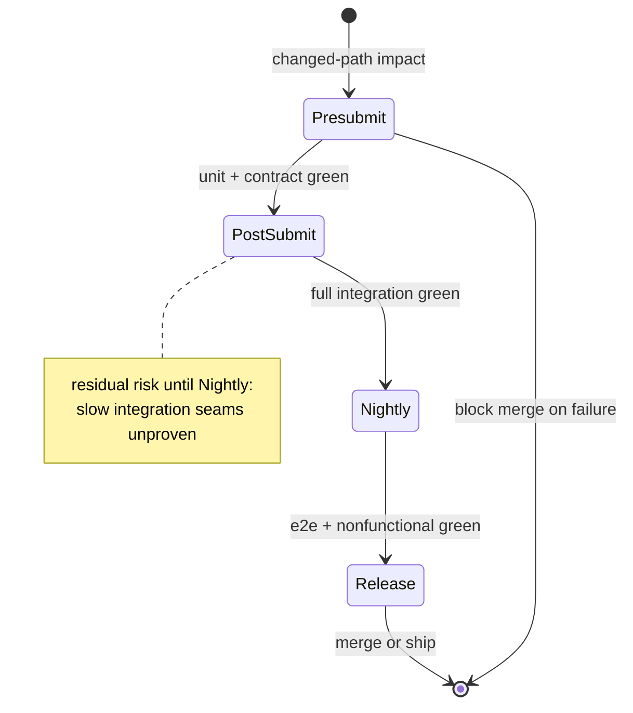

# [TEST_STRATEGY_STANDARDS]

A test strategy document fixes the test portfolio, risk model, gate placement, ownership, required proof by change type, entry and exit criteria, and flaky-test policy for one maintained scope. It is a testing-risk policy: it states which test levels exist, where each gate runs, how risk selects test depth, who owns a failure, and what evidence closes a change. It is not a contributor command list, a framework reference, a proof-strength catalog, or an implementation history. Name one profile and one strategy archetype in the opening paragraph of every test strategy you write.

This standard anchors to ISO/IEC/IEEE 29119-3:2021 for test-documentation content, to the ISTQB test policy -> test strategy -> test plan hierarchy and its strategy archetypes, to Google's test-size and test-pyramid model for the size-versus-scope and hermeticity-versus-fidelity trade-offs, and to risk-based testing for the likelihood-by-impact risk model. `Source of truth:` ISO/IEC/IEEE 29119-3:2021; ISTQB Foundation syllabus and glossary; "Software Engineering at Google" ch. 14. `Last verified:` 2026-06-04. `Review trigger:` ISO, ISTQB, or maintained testing-model guidance changes.

## [1][USE_WHEN]

Use a test strategy when a scope must state any of these:

- which test levels exist and which risk each one covers;
- how a likelihood-by-impact risk tier selects test depth and the minimum gate;
- where each gate runs and which changes trigger it;
- which entry criteria precede a gate and which exit criteria close a release class;
- who owns a failed, noisy, or quarantined test;
- which evidence is required to merge each change family;
- how cost, speed, fidelity, and reliability trade off across the portfolio.

Do not use a test strategy to list every command a contributor runs, to catalog runner flags or framework APIs, or to record milestone sequence.

## [2][PROFILES_ARCHETYPES]

Name exactly one profile and exactly one ISTQB strategy archetype in the opening paragraph. The profile fixes which sections carry weight and which test levels are in scope. The archetype fixes how the strategy selects test depth, so the reader knows the selection rule before reading the gates. Split the document when one page needs more than one profile.

| [INDEX] | [PROFILE]           | [SCOPE_LEVELS]              | [DOMINANT_GATE_TRIGGER]  | [PRIMARY_RISK_OWNED]          |
| :-----: | :------------------ | :-------------------------- | :----------------------- | :---------------------------- |
|   [1]   | Library unit-heavy  | unit, property, contract    | presubmit                | logic regression              |
|   [2]   | Service integration | unit, integration, contract | presubmit, post-submit   | seam and schema drift         |
|   [3]   | End-to-end journey  | integration, e2e, smoke     | release, nightly         | cross-boundary journey break  |
|   [4]   | Host-runtime bridge | unit, scenario, visual      | manual approval, release | host or device behavior drift |
|   [5]   | Nonfunctional       | load, soak, security, accessibility | nightly, release | budget or compliance breach   |

A scope may state a sixth row when it owns a level no profile above covers; the new row must declare an in-scope level set, a dominant trigger, and the single risk it owns.

| [INDEX] | [ARCHETYPE]     | [DEPTH_DRIVER]       | [DECLARE_WHEN]            |
| :-----: | :-------------- | :------------------- | :------------------------ |
|   [1]   | Risk-based      | risk tier            | risk register governs     |
|   [2]   | Standards-based | fixed checklist      | compliance standard binds |
|   [3]   | Process-bound   | external process     | regulated gates apply     |
|   [4]   | Reactive        | failures/findings    | scope is volatile         |
|   [5]   | Model-based     | behavior/state model | model owns input space    |
|   [6]   | Regression-led  | broad reuse          | churn outweighs novelty   |

Prefer the risk-based archetype unless the scope owns a reason another archetype fits better; it binds gate selection to an auditable risk tier.

## [3][SOURCE_TRUTH]

Repository truth owns the gate name, command, runner, status-check identifier, artifact path, and owner role. The strategy names the level, risk, trigger, and selection rule and links the live source for the executable detail. When a fact can drift, prove it from repository truth before any external example. Carry the owning gate config or CI workflow in the opening metadata `Source of truth` field so an indexer can reach it.

External testing vocabulary supplies the level semantics this document reuses:

- Test size is the resource and isolation boundary (process, machine, network, data store, external service, host runtime, production-like system).
- Test scope is the behavior surface verified (function, module, component seam, workflow, system, user journey).
- Hermeticity is the degree of isolation from external state; it gates continuous-integration eligibility, so a level records it as a field, not as prose.
- Portfolio shape favors a wide deterministic base, a thinner integration tier for seams, and a capped high-fidelity set for critical journeys.
- Gate placement runs fast deterministic checks at presubmit and defers expensive or less deterministic checks to later triggers.
- Risk tier is the likelihood-by-impact score that selects test depth and the minimum gate.
- Entry criteria are the conditions that must hold before a gate runs; exit criteria are the risk-tiered completion thresholds that close a release class.
- Flaky-test policy requires detection, measurement, mitigation, owner-backed quarantine, and a repair deadline.

## [4][PLACEMENT]

- Shared scope strategy: `docs/test-strategy.md`.
- Test-corpus strategy: `docs/testing-strategy.md` or a maintained test-docs hub.
- Owner-local strategy: `{owner}/TEST_STRATEGY.md` when the policy binds inside one owner boundary only.

Keep one strategy per scope. Link a lower-level owner strategy instead of copying its gate map into a shared document.

## [5][REQUIRED_STRUCTURE]

Use this section order. The opening metadata block and every H2 below are required (cardinality 1). `Principles` is required but may collapse to three bullets for a purely mechanical portfolio. `Boundaries` and `Review checklist` are the canonical closing pair, both required (cardinality 1 each); a `Boundaries` link to an adjacent owner is omitted only when the owner README already links that neighbor. The template below is the required shape.

```markdown template
# [SCOPE_TEST_STRATEGY]

Owner: <owner role or group>
Source of truth: <path to gate config or CI workflow>
Review trigger: <event, for example a gate added or renamed>

<Lead: name the one profile and the one ISTQB strategy archetype, and the single risk class this scope owns, in prose — e.g. "This is a Service integration strategy using the Risk-based archetype; it owns seam and schema drift across the persistence boundary.">

## [1][SCOPE]

## [2][PRINCIPLES]

## [3][RISK_MODEL]

## [4][TEST_LEVELS]

## [5][GATE_MAPPING]

## [6][ENTRY_EXIT_CRITERIA]

## [7][REQUIRED_PROOF_CHANGE]

## [8][OWNERSHIP]

## [9][FLAKY_TEST_POLICY]

## [10][METRICS]

## [11][REVIEW_TRIGGER]

## [12][BOUNDARIES]

## [13][REVIEW_CHECKLIST]

```

Per-section cardinality: opening metadata block (1), opening paragraph naming one profile and one archetype in prose (1), every H2 above (1 each, required, including the `Boundaries` and `Review checklist` closing pair). The `Risk model` section is required but collapses to the tier table plus the register link for a mechanical portfolio that owns no scored risk. A single `Boundaries` neighbor link is omitted only when the owner README already carries it; the section itself is never omitted.

## [6][SCOPE]

State the maintained scope boundary, what is in and out, and the single risk class the scope owns. A strategy that owns more than one risk class is two strategies; split it. Name the scope in the H1 and the owned risk class in the opening paragraph so both stand alone in retrieval.

## [7][PRINCIPLES]

State the trade-off rules the portfolio obeys. Required rules:

- Prefer the smallest test that proves the behavior at acceptable fidelity.
- Separate test size from test scope; never let a runner directory stand in for either.
- Treat hermeticity as the continuous-integration gate: a less hermetic level runs later and records the residual risk it defers.
- Hold a pyramid distribution unless the scope documents why an alternate shape is both cheaper to maintain and more reliable.
- Replace a duplicated end-to-end test with an integration test when the smaller gate catches the same failure class.
- Reserve end-to-end gates for critical journeys and cross-boundary behavior.
- Select test depth from the risk tier, not from author preference.
- Treat coverage percentage as a signal, never as proof of correctness.
- Add a nonfunctional level only when the scope owns that risk.

## [8][RISK_MODEL]

Bind test depth and gate selection to an auditable risk tier; this is the construct that makes "which gate" derivable rather than asserted. State the likelihood scale, the impact scale, the tier buckets with numeric ranges, and the rule mapping each tier to test depth and a minimum gate. Use a decision table so an agent resolves a tier to a gate deterministically.

| [INDEX] | [TIER]  | [SCORE_LIKELIHOOD_X] | [TEST_DEPTH]              | [MINIMUM_GATE]   |
| :-----: | :------ | -------------------: | :------------------------ | :--------------- |
|   [1]   | Extreme |                20-25 | full plus nonfunctional   | release plus e2e |
|   [2]   | High    |                13-19 | integration plus property | post-submit      |
|   [3]   | Medium  |                 5-12 | unit plus contract        | presubmit        |
|   [4]   | Low     |                  1-4 | unit or review gate       | presubmit        |

State the likelihood and impact scales as concrete bands, for example likelihood 1 (rare) to 5 (frequent) and impact 1 (cosmetic) to 5 (data loss or safety). Link the risk register from repository truth, and name at least the High-tier and Extreme-tier risks the scope currently owns; an empty matrix is a gap, not a strategy.

Require risk-to-test traceability: every register risk at High or Extreme back-links to the level or gate that covers it, and an uncovered High or Extreme risk is a defect in the strategy. State the back-link as a register field or as a `Covered-by:` line per risk, not as an unstated assumption.

## [9][TEST_LEVELS]

Define only the levels the scope runs or reviews. Render each level as a definition block carrying all nine fields, one `label: value` per line, so a missing field is visibly absent (all required, cardinality 1 per level):

- purpose and the risk class it covers, with the risk tier from the risk model;
- size boundary, from the chooser in `Source of truth`;
- scope boundary, from the chooser in `Source of truth`;
- hermeticity and continuous-integration eligibility;
- owner role accountable for maintenance and failure triage;
- runtime budget and resource class (for example, p95 under 200 ms in-process, or up to 90 s in a container);
- isolation and test-data policy;
- failure artifacts required for diagnosis;
- trigger that decides when the level runs.

Do not name a level after a runner directory, filename, or framework unless that name also fixes its risk and isolation boundary.

This definition block is one accepted level record:

```text conceptual
Level: integration
Risk: schema and seam drift across the persistence boundary (Tier: High)
Size: machine plus ephemeral data store, no external network
Scope: component seam (repository to database)
Hermeticity: high (no external network); CI-eligible
Owner: data-platform maintainer
Budget: p95 under 90 s, container resource class
Isolation: per-test schema, truncated between cases
Artifacts: query log, container stderr, failing fixture snapshot
Trigger: presubmit on changed-path impact, full set post-submit
```

Avoid the rejected form below: it names a framework, omits the risk and tier, and leaves size, hermeticity, and owner unstated.

```text rejected
# rejected: taxonomy by tool, no risk, no owner, no hermeticity

Level: xunit-tests
Trigger: CI
```

## [10][GATE_MAPPING]

A gate map connects a level to its automation without becoming a runner manual. Render each gate as a definition block carrying its required fields, one `label: value` per line (required fields cardinality 1; the resource policy field is optional, cardinality 0..1):

- trigger: presubmit, post-submit, nightly, release, manual approval, or incident follow-up;
- selection rule: changed-path impact, dependency impact, owner tag, release target, risk label, or full-suite cadence;
- blocking behavior: blocks merge, blocks release, or reports only;
- resource policy (optional): timeout, retry, shard, or concurrency limit, stated only when it changes signal quality;
- required artifact or status-check location, named from repository truth;
- escalation owner when the gate fails or turns noisy;
- residual risk left unproven until this gate passes, or `n/a (base gate)`.

This definition block is one accepted gate record:

```text template
Gate: post-submit-integration
Trigger: post-submit
Selection: dependency impact across changed seams
Blocking: blocks merge to the release branch
Status check: <ci-check-name from source_of_truth>
Escalation owner: data-platform maintainer
Residual risk if deferred: slow integration seams unproven until this gate
```

Order gates by trigger latency. Fast deterministic gates block at presubmit. Slower or less hermetic gates run later; for each deferred gate, state the risk that remains unproven until it passes.

The diagram below fixes gate ordering and the residual risk carried between triggers. A state diagram is the deliberate choice: gate progression is a sequence of trigger states with a terminal merge or release transition, not a table lookup or a component graph.



## [11][ENTRY_EXIT_CRITERIA]

State the conditions that open each gate and the risk-tiered thresholds that close each release class; this is the canonical phase gate that makes "when is testing complete" observable. Render entry and exit criteria as a definition block per gate and release class (all fields required, cardinality 1 per gate):

- entry: the conditions that must hold before the gate runs (for example, the prior gate green, the environment provisioned);
- exit per standard release: concrete numeric thresholds tied to risk tiers;
- exit per accelerated release class (for example, hotfix): the reduced thresholds and the risk areas they restrict to.

Exit thresholds must be concrete and risk-tiered, not "tests pass". State a pass rate, a critical-flow rate, a defect bound, and a defect-escape budget. This definition block is one accepted criteria record:

```text conceptual
Gate: post-submit-integration
Entry: presubmit green; ephemeral store provisioned; migrations applied
Exit (standard release): 100% pass on High and Extreme risk-linked tests;
  95% overall pass; zero open critical defects; defect-escape budget not breached
Exit (hotfix): 100% regression pass on the affected risk areas only;
  no new High or Extreme risk introduced
```

Tailoring of thresholds per release class is expected. State each tailored class explicitly; an unstated hotfix path is an ungated path.

## [12][REQUIRED_PROOF_CHANGE]

Map each change family to the smallest sufficient proof surface. The strategy names which proof is required; evidence-strength judgment belongs to the proof owner named in `Boundaries`. Every row resolves to a runnable gate name from repository truth.

| [INDEX] | [CHANGE_FAMILY]            | [SMALLEST_SUFFICIENT_GATE]              | [ESCALATION_TRIGGER]          |
| :-----: | :------------------------- | :-------------------------------------- | :---------------------------- |
|   [1]   | Behavior or algorithm      | narrow unit or property gate            | touches a public contract     |
|   [2]   | Integration or contract    | seam-level integration gate             | crosses an owner boundary     |
|   [3]   | User journey or deployment | high-fidelity e2e gate                  | alters a critical journey     |
|   [4]   | Host-runtime change        | scenario or visual gate                 | changes host or device output |
|   [5]   | Nonfunctional risk         | the specialized gate owning that risk   | breaches a stated budget      |
|   [6]   | Docs-only or config-only   | review gate or generated-evidence check | changes a documented contract |

When an escalation trigger fires, the change must also clear the broader gate the row escalates into, in addition to its base gate.

## [13][OWNERSHIP]

Every test level, gate, and quarantine path has one accountable owner role (cardinality: exactly 1 owner per level, gate, and quarantine path). Define who:

- maintains the tests at each level;
- diagnoses a cross-owner failure;
- approves a quarantine, re-enable, or deletion;
- pays the fixture and environment cost;
- updates ownership when an owner boundary moves.

A large or cross-owner test with no named diagnosis owner is a defect in the strategy, not an acceptable gap.

## [14][FLAKY_TEST_POLICY]

Define a flaky test as one that both passes and fails against the same relevant code and environment state. Render the policy as a definition block carrying each field (all required, cardinality 1):

- detection signal as a concrete threshold (for example, retry-pass rate above 1 percent over 50 runs);
- severity classes and the rerun policy for each;
- quarantine criteria;
- quarantine owner;
- quarantine status vocabulary carried as a field value (for example, `active`, `re-enabled`, `deleted`), not as inline decoration;
- maximum quarantine duration as a concrete bound (for example, 10 working days);
- residual signal lost while quarantined;
- re-enable criteria;
- deletion criteria when the flaky test duplicates stronger coverage.

Quarantine suppresses signal; it is never a repair. A quarantined test past its maximum duration escalates to the owner named in `Ownership`.

## [15][METRICS]

Use metrics to sharpen signal, never to replace owner judgment. Track only metrics that change a decision, and bind each metric to the named decision it drives so an unactionable metric is visibly orphaned. Use a lookup table from metric to decision:

| [INDEX] | [METRIC]                                                       | [DECISION_IT_DRIVES]                                     |
| :-----: | :------------------------------------------------------------- | :------------------------------------------------------- |
|   [1]   | Pass, fail, flake, retry, quarantine, re-enable rate per level | portfolio rebalance and level retirement                 |
|   [2]   | Gate duration and queue time per trigger                       | gate placement and trigger latency                       |
|   [3]   | Failure-localization quality                                   | level granularity and artifact requirements              |
|   [4]   | Risk-weighted and critical-journey coverage                    | test depth per risk tier                                 |
|   [5]   | Behavior-level coverage per named risk                         | risk-to-test traceability completeness and gap detection |
|   [6]   | Defect-escape evidence from production or release feedback     | gate sufficiency and entry/exit thresholds               |

Do not publish a metric the scope cannot act on, and do not present a raw coverage percentage as proof of correctness.

## [16][REVIEW_TRIGGER]

Refresh the strategy on any of these events. Use an event trigger, not a calendar date, unless an external testing standard changes on a schedule. Carry the dominant trigger in the opening metadata `Review trigger` field:

- a gate, runner, or status check is added, renamed, or removed;
- a test level changes its size, scope, or hermeticity boundary;
- a risk tier, scoring scale, or tier-to-gate mapping changes;
- an entry or exit threshold changes for any release class;
- an owner boundary moves;
- the quarantine or flaky-test policy changes;
- architecture, runtime, or deployment topology changes;
- a flake-rate, gate-duration, or release-escape threshold is breached;
- external testing guidance the strategy reuses is revised.

## [17][BOUNDARIES]

- Contributor workflow and per-task commands: [contributing.md](../task/contributing.md).
- Evidence strength, freshness fields, and verification gates: [proof.md](../proof.md).
- Operational recovery from a failing gate in production: [runbook.md](../task/runbook.md).
- Test-tool and framework API lookup: [reference.md](../reference/reference.md).
- Delivery sequence and milestone exit criteria: [roadmap.md](roadmap.md).
- Document-type routing, placement, and lifecycle: [README.md](../README.md).

## [18][REVIEW_CHECKLIST]

- [ ] Exactly one profile and one ISTQB strategy archetype are named in the opening paragraph.
- [ ] Opening metadata carries `Owner`, `Source of truth`, and `Review trigger`.
- [ ] Scope and owner boundaries are stated, and one risk class is owned.
- [ ] The risk model states a scoring scale, tier buckets, and a tier-to-gate mapping, and links the register.
- [ ] Each High or Extreme register risk back-links to the level or gate that covers it.
- [ ] Each test level carries purpose with tier, size, scope, hermeticity and CI eligibility, owner, budget, isolation, artifacts, and trigger.
- [ ] Each gate carries trigger, selection rule, blocking behavior, status check, escalation owner, and residual risk.
- [ ] Deferred gates state the risk that remains unproven.
- [ ] Entry criteria and concrete risk-tiered exit criteria are stated per release class.
- [ ] Each change family maps to its smallest sufficient gate and escalation trigger, resolving to a runnable gate name.
- [ ] Every large and cross-owner test has a named diagnosis owner.
- [ ] Flaky-test policy states detection, quarantine criteria, owner, status vocabulary, maximum duration, residual signal, re-enable, and deletion criteria with concrete bounds.
- [ ] Each metric binds to a named decision; no raw coverage percentage is presented as proof.
- [ ] Behavior-level coverage per named risk maps to a named risk in the register.
- [ ] Review trigger uses events, not a calendar date.
- [ ] Boundaries carry at most one link per adjacent owner.
