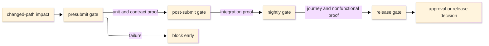

# [TEST_STRATEGY_STANDARDS]

A test strategy document fixes the test portfolio, risk model, gate placement, ownership, required proof by change type, flaky-test handling when the scope owns it, and entry or exit criteria when the scope gates releases or approvals. It is a testing-risk policy: it states which test levels exist, where each gate runs, how risk selects test depth, who owns failure diagnosis, and what evidence closes a change. It is not a contributor command list, framework reference, proof-strength catalog, test plan, runbook, or implementation history.

Name one profile and one primary strategy archetype in the opening paragraph. Secondary archetype influences are allowed only when they change gate selection and are named explicitly.

## [1][USE_WHEN]

Use a test strategy when a maintained scope must state any of these:

- which test levels exist and which risk each covers;
- how a risk tier selects test depth and the minimum gate;
- where each gate runs and which changes trigger it;
- which entry criteria precede a gate or which exit criteria close an approval or release class;
- who owns a failed, noisy, or quarantined test;
- which evidence is required to approve, merge, release, or manually accept each change family;
- how cost, speed, fidelity, and reliability trade off across the portfolio.

Do not use a test strategy to list every command a contributor runs, catalog runner flags or framework APIs, record milestone sequence, or prescribe incident recovery from a failing production gate.

## [2][LOCAL_TRUTH]

Separate local executable truth from external testing vocabulary. Repository truth owns gate names, commands, runners, status-check identifiers, artifacts, owner roles, and release policy. External standards and practice supply reusable concepts; no produced strategy claims external compliance unless a local policy explicitly requires it.

Source of truth: local gate config, CI workflow, quality command, test owner file, or release policy named by the produced strategy.

| [INDEX] | [CONCEPT]            | [USE]                     | [BASIS]                                      | [BOUNDARY]        |
| :-----: | :------------------- | :------------------------ | :------------------------------------------- | :---------------- |
|   [1]   | documentation shape  | strategy/plan/evidence    | ISO 29119-3                                  | vocabulary only   |
|   [2]   | strategy archetypes  | local planning labels     | ISTQB CTAL-TM                                | no compliance     |
|   [3]   | risk-based depth     | tier-to-gate mapping      | ISTQB CTFL + CTAL-TM                         | local register    |
|   [4]   | small-test base      | deterministic pyramid     | Google ch. 11                                | practice reference |
|   [5]   | large-test trade-off | size, fidelity, cost      | Google ch. 14                                | concepts only     |
|   [6]   | flaky-test pressure  | quarantine and ownership  | Google ch. 11/14 plus local truth            | local thresholds  |

Sources: [ISO 29119-3](https://www.iso.org/standard/79429.html), [ISTQB CTAL-TM](https://istqb.org/wp-content/uploads/2024/11/ISTQB_CTAL-TM_Syllabus_v3.0_zKjKsaN.pdf), [ISTQB CTFL](https://istqb.org/wp-content/uploads/2024/11/ISTQB_CTFL_Syllabus_v4.0.1.pdf), [Google chapter 11](https://abseil.io/resources/swe-book/html/ch11.html), and [Google chapter 14](https://abseil.io/resources/swe-book/html/ch14.html).

Last verified: 2026-06-04
Review trigger: local gate surface, ISO 29119-3, ISTQB syllabus, or maintained testing-model guidance changes.

## [3][PROFILES_ARCHETYPES]

Pick one profile for scope and one primary archetype for depth selection. Split the document when one page needs more than one profile.

| [INDEX] | [PROFILE]           | [SCOPE_LEVELS]                      | [DOMINANT_TRIGGER]       | [PRIMARY_RISK_OWNED]          |
| :-----: | :------------------ | :---------------------------------- | :----------------------- | :---------------------------- |
|   [1]   | Library unit-heavy  | unit, property, contract            | presubmit                | logic regression              |
|   [2]   | Service integration | unit, integration, contract         | presubmit, post-submit   | seam and schema drift         |
|   [3]   | End-to-end journey  | integration, e2e, smoke             | release, nightly         | cross-boundary journey break  |
|   [4]   | Host runtime        | unit, scenario, visual              | manual approval, release | host or device behavior drift |
|   [5]   | Nonfunctional       | load, soak, security, accessibility | nightly, release         | budget or compliance breach   |

Use the archetype vocabulary below as local strategy labels adapted from testing-practice vocabulary. These labels are selection aids; they are not a claimed current ISTQB closed set and are not external compliance claims.

| [INDEX] | [ARCHETYPE]                    | [DEPTH_DRIVER]          | [DECLARE_WHEN]                     |
| :-----: | :----------------------------- | :---------------------- | :--------------------------------- |
|   [1]   | Analytical                     | risk analysis           | risk register governs              |
|   [2]   | Model-based                    | behavior or state model | model owns input space             |
|   [3]   | Methodical                     | fixed checklist         | method checklist binds             |
|   [4]   | Process- or standard-compliant | external process        | standard or regulation applies     |
|   [5]   | Reactive                       | failures or findings    | volatile scope responds to defects |
|   [6]   | Consultative                   | expert advice           | domain experts select coverage     |
|   [7]   | Regression-averse              | reusable regression     | churn risk outweighs novelty       |

Prefer `Analytical` when a risk register governs the scope. If a produced strategy combines archetypes, declare one primary archetype and list secondary influences in `Principles` with the gate-selection rule they change.

## [4][FIELD_VOCABULARIES]

Repository truth owns executable details. The strategy names the level, risk, trigger, and selection rule, and it links the live source for commands, runner config, status checks, artifacts, and owner roles. When a fact can drift, prove it from repository truth before external examples.

Carry local executable truth in the opening metadata `Source of truth` field. Carry external taxonomy proof only in this standard or in a produced strategy's `External basis` note when the strategy explicitly depends on external compliance.

Produced strategies must replace every placeholder with local truth. A strategy is incomplete if it contains `LOCAL_*`, `*_GATE_NAME`, generic gate classes, or unnamed review owners in place of a source path, status check, contract, or accountable role.

External testing vocabulary supplies these concepts:

- Test size is the resource and isolation boundary: process, machine, network, data store, external service, host runtime, or production-like system.
- Test scope is the behavior surface verified: function, module, component seam, workflow, system, or user journey.
- Hermeticity is the degree of isolation from external state; record it as a level field because it controls continuous-integration eligibility.
- Portfolio shape favors a wide deterministic base, a thinner seam/integration tier, and capped high-fidelity tests for critical journeys.
- Gate placement runs fast deterministic checks early and defers expensive or less deterministic checks to later triggers.
- Risk tier is the likelihood-by-impact or locally defined risk score that selects test depth and minimum gate.
- Entry criteria open a gate; exit criteria close a release, approval, or manually accepted class.
- Flaky-test policy requires detection, measurement, mitigation, owner-backed quarantine, and repair or deletion criteria when the scope can quarantine tests.

Closed field vocabularies:

- `Trigger`: `presubmit`, `post-submit`, `nightly`, `release`, `manual approval`, `incident follow-up`.
- `Blocking`: `blocks merge`, `blocks release`, `blocks approval`, `reports only`.
- `Quarantine status`: `suspected`, `quarantined`, `repairing`, `re-enabled`, `deleted`.

## [5][PLACEMENT]

- Shared scope strategy: `docs/test-strategy.md`.
- Test-corpus strategy: `docs/testing-strategy.md` or a maintained test-docs hub.
- Owner-local strategy: `{owner}/TEST_STRATEGY.md` when the policy binds inside one owner boundary only.

Keep one strategy per scope. Link a lower-level owner strategy instead of copying its gate map into a shared document.

## [6][REQUIRED_STRUCTURE]

Use this required section order. Conditional sections are omitted until their trigger holds; when they appear, insert them at the named position and renumber headings in document order.

```markdown template
# [SCOPE_TEST_STRATEGY]

Owner: <owner role or group>
Source of truth: <path to gate config, CI workflow, quality command, or release policy>
Review trigger: <event, for example a gate added or renamed>

<Lead: name the one profile, the primary archetype, any secondary influence, and the single risk class this scope owns.>

## [1][SCOPE]

## [2][PRINCIPLES]

## [3][RISK_MODEL]

## [4][TEST_LEVELS]

## [5][GATE_MAPPING]

## [6][REQUIRED_PROOF_CHANGE]

## [7][OWNERSHIP]

## [8][BOUNDARIES]

## [9][REVIEW_CHECKLIST]
```

Conditional section decision table:

| [INDEX] | [SECTION]                 | [TRIGGER]              | [AFTER]        | [OMIT_WHEN]              |
| :-----: | :------------------------ | :--------------------- | :------------- | :----------------------- |
|   [1]   | `Entry and exit criteria` | release/approval gates | Gate mapping   | no open/close criteria   |
|   [2]   | `Flaky-test policy`       | rerun or quarantine    | Ownership      | scope cannot quarantine  |
|   [3]   | `Metrics`                 | decision-driving metric | Flaky/Ownership | observational only       |
|   [4]   | `Review trigger`          | multiple stale events  | before Boundaries | metadata is enough    |

Conditional addition template:

```markdown template
## [N][ENTRY_EXIT_CRITERIA]

## [N][FLAKY_TEST_POLICY]

## [N][METRICS]

## [N][REVIEW_TRIGGER]
```

Section cardinality:

- Opening metadata, opening paragraph, `Scope`, `Principles`, `Risk model`, `Test levels`, `Gate mapping`, `Required proof by change`, `Ownership`, `Boundaries`, and `Review checklist` are required.
- Conditional sections appear only when their decision-table trigger holds.

## [7][SCOPE]

State the maintained scope boundary, what is in and out, and the single primary risk class the scope owns. A strategy that owns unrelated risk classes is two strategies; split it. Name the scope in the H1 and the risk class in the opening paragraph so both stand alone in retrieval.

## [8][PRINCIPLES]

State the trade-off rules the portfolio obeys. Required rules:

- Prefer the smallest test that proves behavior at acceptable fidelity.
- Separate test size from test scope; never let a runner directory stand in for either.
- Treat hermeticity as the continuous-integration gate: a less hermetic level runs later and records residual risk.
- Hold a pyramid distribution unless the scope documents why an alternate shape is cheaper to maintain and more reliable.
- Replace a duplicated end-to-end test with a smaller integration or contract test when the smaller gate catches the same failure class.
- Reserve high-fidelity gates for critical journeys, cross-boundary behavior, host runtime proof, or nonfunctional budgets.
- Select test depth from risk tier or the declared primary archetype, not author preference.
- Treat coverage percentage as a signal, never proof of correctness.
- Add a nonfunctional level only when the scope owns that risk.

## [9][RISK_MODEL]

Bind test depth and gate selection to an auditable risk tier. State the scoring model the scope actually uses, the tier buckets, and the rule mapping each tier to test depth and minimum gate. Use a decision table so an agent resolves a tier deterministically.

The table below is a default likelihood-by-impact template, not a universal rule. Replace ranges when the local risk register uses a different scale, and replace every proof cell with a real local gate, contract, status check, or review owner in produced strategies.

| [INDEX] | [TIER]  | [DEFAULT_SCORE] | [TEST_DEPTH]              | [MINIMUM_PROOF]                         |
| :-----: | :------ | --------------: | :------------------------ | :-------------------------------------- |
|   [1]   | Extreme |           20-25 | full plus nonfunctional   | release gate from source truth          |
|   [2]   | High    |           13-19 | integration plus property | post-submit status check or contract    |
|   [3]   | Medium  |            5-12 | unit plus contract        | presubmit status check or contract diff |
|   [4]   | Low     |             1-4 | unit or review gate       | review owner or deterministic unit gate |

Define likelihood and impact scales before using numeric scores. Link the risk register from repository truth, and name at least the High and Extreme risks currently owned. Require traceability: each High or Extreme risk back-links to the level or gate that covers it through a register field or `Covered-by:` line.

## [10][TEST_LEVELS]

Define only levels the scope runs or reviews. Render each level as a definition block with these fields, one `label: value` per line:

- `Level`: level name.
- `Purpose`: behavior and risk class covered.
- `Risk`: tier or risk-register link.
- `Size`: resource and isolation boundary.
- `Scope`: behavior surface verified.
- `Hermeticity`: isolation and CI eligibility.
- `Owner`: role accountable for maintenance and failure triage.
- `Budget`: runtime and resource class.
- `Isolation`: fixture, environment, and test-data policy.
- `Artifacts`: failure evidence required for diagnosis.
- `Trigger`: when the level runs.

Do not name a level after a runner directory, filename, or framework unless that name also fixes risk and isolation boundary.

```text template
Level: <level-name>
Purpose: <risk class and behavior covered>
Risk: <tier and risk-register item>
Size: <resource and isolation boundary>
Scope: <behavior surface>
Hermeticity: <isolation level and CI eligibility>
Owner: <owner role>
Budget: <runtime and resource class>
Isolation: <fixture, environment, and test-data policy>
Artifacts: <diagnostic artifacts>
Trigger: <presubmit, post-submit, nightly, release, or manual approval>
```

Rejected:

```text rejected
Level: framework-tests
Trigger: CI
```

The rejected form names a framework and omits risk, tier, size, hermeticity, and owner.

## [11][GATE_MAPPING]

A gate map connects a level to automation without becoming a runner manual. Link commands, status checks, and runner configuration; do not list runnable command recipes. Render each gate as a definition block with these fields:

- `Gate`: gate name from repository truth.
- `Trigger`: presubmit, post-submit, nightly, release, manual approval, or incident follow-up.
- `Selection`: changed-path impact, dependency impact, owner tag, release target, risk label, or full-suite cadence.
- `Blocking`: blocks merge, blocks release, blocks approval, or reports only.
- `Resource policy`: optional timeout, retry, shard, or concurrency limit when it changes signal quality.
- `Status check`: required artifact or check location from repository truth.
- `Escalation owner`: owner when the gate fails or turns noisy.
- `Residual risk if deferred`: risk left unproven until this gate passes, or `n/a (base gate)`.

```text template
Gate: <local-gate-name>
Trigger: <presubmit, post-submit, nightly, release, manual approval, or incident follow-up>
Selection: <changed-path, risk label, release target, or full-suite cadence>
Blocking: <blocks merge, blocks release, blocks approval, or reports only>
Status check: <status check or artifact from source of truth>
Escalation owner: <owner role>
Residual risk if deferred: <risk left unproven>
```

Order gates by trigger latency. Fast deterministic gates block early. Slower or less hermetic gates run later; each deferred gate states residual risk.

The diagram below is conceptual, not universal:



Text equivalent: changed-path impact selects the presubmit gate first; unit and contract proof can defer broader integration to post-submit and nightly gates; release approval waits for high-fidelity and nonfunctional proof; presubmit failure blocks early, and any deferred gate must state residual risk in the gate record.

## [12][ENTRY_EXIT_CRITERIA]

Include entry and exit criteria when the strategy owns phase gates, release classes, manual runtime approval, regulated approval, or hotfix tailoring. State conditions that open each gate and thresholds that close each class.

Criteria fields:

- `Gate`: the gate or release class.
- `Entry`: conditions that must hold before the gate runs.
- `Exit`: concrete thresholds tied to risk tier or approval class.
- `Tailored class`: optional reduced path such as hotfix, manual runtime approval, or emergency release.

```text template
Gate: <local-gate-name>
Entry: <preconditions before the gate runs>
Exit (standard release): <risk-tiered thresholds from local policy>
Exit (hotfix): <tailored thresholds and affected risk areas>
```

Do not require pass-rate, critical-flow, defect-bound, or escape-budget fields unless the local release policy uses them. An unstated tailored release or approval path is an ungated path.

## [13][REQUIRED_PROOF_CHANGE]

Map each change family to the smallest sufficient proof surface. The table below is a template: produced strategies replace every proof cell with repository gate names, contracts, or review owners from source truth and link [proof.md](../proof.md) for evidence strength rather than restating the evidence hierarchy.

| [INDEX] | [CHANGE]          | [PROOF]                    | [ESCALATE_WHEN]       |
| :-----: | :---------------- | :------------------------- | :-------------------- |
|   [1]   | behavior          | unit/property gate         | public contract       |
|   [2]   | integration       | contract gate or diff      | owner boundary        |
|   [3]   | journey/deploy    | e2e, smoke, or scenario    | critical journey      |
|   [4]   | host runtime      | runtime/manual proof       | host output changes   |
|   [5]   | nonfunctional     | budget gate or audit       | budget breach         |
|   [6]   | docs/config       | review, generated, or link | documented contract   |

When an escalation trigger fires, the change also clears the broader gate the row escalates into. A produced strategy that leaves a placeholder, generic gate class, or unowned review path in this table is incomplete.

## [14][OWNERSHIP]

Every test level, gate, and quarantine path has one accountable owner role. Define who:

- maintains tests at each level;
- diagnoses cross-owner failure;
- approves quarantine, re-enable, or deletion;
- pays fixture and environment cost;
- updates ownership when owner boundaries move.

A large or cross-owner test with no named diagnosis owner is a defect in the strategy.

## [15][FLAKY_TEST_POLICY]

Define a flaky test as one that both passes and fails against the same relevant code and environment state. Include this section when the scope has reruns, quarantine, noisy tests, or deletion/re-enable decisions.

Policy fields:

- detection signal with a concrete threshold;
- severity classes and rerun policy;
- quarantine criteria;
- quarantine owner;
- quarantine status vocabulary as field values;
- maximum quarantine duration;
- residual signal lost while quarantined;
- re-enable criteria;
- deletion criteria when the flaky test duplicates stronger coverage.

Thresholds such as retry-pass rate or maximum quarantine duration are examples until a local strategy adopts them from policy. Quarantine suppresses signal; it is never repair. A quarantined test past its maximum duration escalates to the owner named in `Ownership`.

Policy record:

```markdown template
Detection: <signal and threshold from local gate history>
Severity: <class and rerun policy>
Quarantine criteria: <conditions that permit quarantine>
Quarantine owner: <owner role accountable for repair>
Quarantine status: suspected | quarantined | repairing | re-enabled | deleted
Maximum duration: <local threshold>
Residual signal lost: <risk no longer proven while quarantined>
Re-enable criteria: <green runs or source fix required>
Deletion criteria: <duplicated stronger coverage or retired behavior>
```

Rejected:

```text rejected
Flaky tests can be quarantined until they are fixed.
```

The rejected form has no detection threshold, owner, status, maximum duration, residual risk, or re-enable rule.

## [16][METRICS]

Include metrics only when each metric changes a decision. Bind every metric to the named decision it drives:

- pass, fail, flake, retry, quarantine, and re-enable rate per level: portfolio rebalance and level retirement;
- gate duration and queue time per trigger: gate placement and trigger latency;
- failure-localization quality: level granularity and artifact requirements;
- risk-weighted or critical-journey coverage: test depth per risk tier;
- behavior-level coverage per named risk: traceability completeness and gap detection;
- defect-escape evidence from production or release feedback: gate sufficiency and entry or exit thresholds.

Do not publish a metric the scope cannot act on, and do not present raw coverage percentage as proof of correctness.

## [17][REVIEW_TRIGGER]

Carry the dominant trigger in opening metadata. Add this section only when several triggers need explanation. Event triggers beat calendar dates unless an external standard changes on a schedule.

Common triggers:

- gate, runner, or status check added, renamed, or removed;
- test level changes size, scope, or hermeticity boundary;
- risk tier, scoring scale, or tier-to-gate mapping changes;
- entry or exit threshold changes for any release or approval class;
- owner boundary moves;
- quarantine or flaky-test policy changes;
- architecture, runtime, or deployment topology changes;
- flake-rate, gate-duration, or release-escape threshold is breached;
- external testing guidance the strategy reuses is revised.

## [18][BOUNDARIES]

- Architecture topology, runtime boundaries, and invariant checks that select test levels: [architecture.md](architecture.md).
- Process decisions that bind gate policy or quarantine authority: [adr.md](adr.md).
- Proposal validation plans that consume strategy gates: [design-doc.md](design-doc.md).
- Contributor workflow and per-task commands: [contributing.md](../task/contributing.md).
- Evidence strength, freshness fields, and verification gates: [proof.md](../proof.md).
- Operational recovery from a failing gate in production: [runbook.md](../task/runbook.md).
- Test-tool and framework API lookup: [reference.md](../reference/reference.md).
- Delivery sequence and milestone exit criteria: [roadmap.md](roadmap.md).
- Document-type routing, placement, and lifecycle: [README.md](../README.md).

## [19][REVIEW_CHECKLIST]

- [ ] One profile and one primary archetype are named in the opening paragraph; secondary influences are explicit and justified.
- [ ] Opening metadata carries `Owner`, local executable `Source of truth`, and `Review trigger`.
- [ ] Scope and owner boundaries are stated, and one primary risk class is owned.
- [ ] External taxonomy is separated from local executable gate truth through the local-truth section and concept table.
- [ ] Archetype labels are treated as local adaptations, not compliance claims.
- [ ] Produced strategies contain no placeholder proof cells, generic gate classes, or unnamed review owners.
- [ ] Conditional sections appear only when their decision-table trigger holds.
- [ ] The risk model states the scoring scale in use, tier buckets, tier-to-gate mapping, and risk-register link.
- [ ] Each High or Extreme register risk back-links to the level or gate that covers it.
- [ ] Each test level carries purpose, risk, size, scope, hermeticity and CI eligibility, owner, budget, isolation, artifacts, and trigger.
- [ ] Each gate carries closed-vocabulary trigger, selection rule, blocking behavior, status check or artifact, escalation owner, and residual risk.
- [ ] Deferred gates state the risk that remains unproven.
- [ ] Entry and exit criteria appear only when the strategy owns release, approval, manual runtime, regulated, or hotfix gates.
- [ ] Each change family maps to a local gate, contract, or review owner, not a generic gate class.
- [ ] Every large and cross-owner test has a named diagnosis owner.
- [ ] Flaky-test policy appears when rerun, quarantine, noisy-test, re-enable, or deletion decisions exist, and it carries the quarantine status vocabulary plus owner, duration, residual signal, and re-enable or deletion criteria.
- [ ] Each metric binds to a named decision; raw coverage percentage is not presented as proof.
- [ ] Review triggers use events, not calendar dates unless the external source changes on schedule.
- [ ] Boundaries carry at most one link per adjacent owner.
