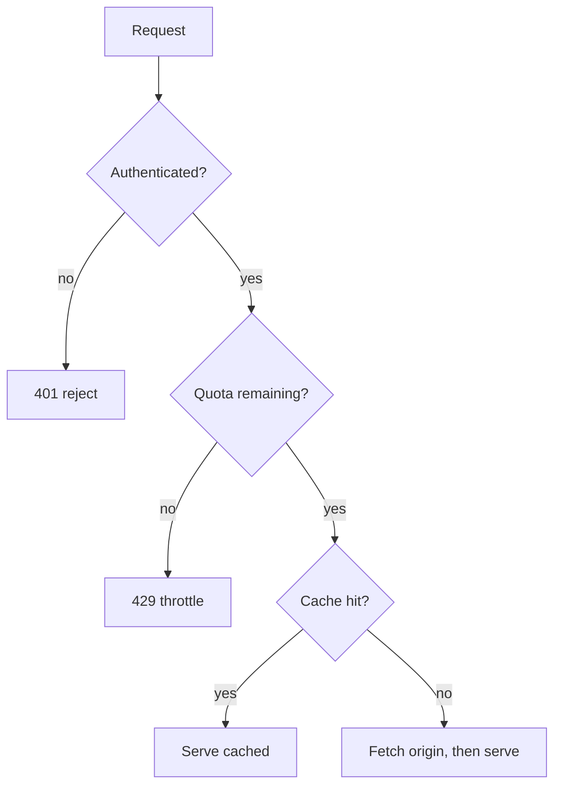

# [INFORMATION_STRUCTURE]

This standard owns form: which container carries a piece of information and how that container supports scanning, retrieval, and maintenance. Choose the container after the document type is known and before drafting long sections. This standard does not decide salience, prose, visual styling, or evidence strength.

## [1][USE_WHEN]

Apply this standard to choose and shape containers:

- prose, bullets, numbered lists, and checklists;
- definition blocks, status-tagged records, tables, decision tables, and lookup tables;
- code blocks, intent labels, examples, monospace text structures, Mermaid diagrams, and C4 architecture handoffs;
- callouts, collapsible blocks, footnotes, headings, section boundaries, line wrapping, retrieval chunks, and page anatomy.

Salience and ordering within a unit belong to the position standard, sentence mechanics to the craft standard, evidence strength to the proof standard, and visual styling (alignment, markers, whitespace) to the formatting standard.

## [2][CONTAINER_CHOOSER]

Use the smallest container that preserves meaning. Change container when the reader's question shifts from explanation to lookup, ordered action, relationship, or proof. Structured containers are not decoration: bullets and key-value blocks outperform prose for option selection and field extraction, and tables outperform both for dense factual lookup.

**Narrative and peer sets**
- Prose: one concept, decision, caveat, or transition where a sentence is clearer than a list.
- Bullets: peer facts, requirements, or unordered options.
- Numbered lists: ordered actions, ranked choices, lifecycle steps, or gates.
- Checklists (`- [ ]`): verification, acceptance, or status items whose completion is asserted and checked.

**Records and lookup**
- Definition blocks: terms, statuses, commands, roles, and short labeled facts, one `label: value` per line.
- Status-tagged records: finite enumerable sets whose items carry status over time, such as milestones, decisions, requirements, risks, or tasks.
- Tables: dense row-and-column comparison or lookup across a homogeneous set.
- Decision tables: an action or rule determined by a finite combination of conditions.

**Literal and visual forms**
- Code blocks: commands, literal files, config, schemas, or copyable snippets.
- Monospace text structures: hierarchy or short branching where raw-Markdown inspection matters more than rendered polish.
- Mermaid: multi-node workflows, sequences, states, or relationships that readers need rendered.
- Callouts, collapsible blocks, footnotes: constraint interrupts, low-salience reference, and inline provenance.

A single record read by field belongs in a definition block, not a one-row table. Sparse data compared across rows still belongs in a table, not flattened into prose. When no two items share a comparison question, abandon the table and give each item its own record.

## [3][TABLES]

Use a table when row-and-column comparison or lookup across a homogeneous set is the point. Keep it within bounds that agent readers and split-pane readers handle.

A table degrades past roughly 15 columns or 20 rows. Degradation is continuous, so these bounds mark the point where decomposition becomes mandatory. Tables are the most token-efficient structured format up to moderate size, but an oversized table suffers the same long-context degradation as any other oversized unit.

The formatting standard owns the bracketed table surface: enumerable Markdown tables carry `[INDEX]` first, bracketed uppercase rubrics in the header row, and `[1]` through `[n]` row identifiers.

Decompose by the dominant violation, never both at once:

- Row count over 20, columns 4 or fewer: split by a natural row axis — status, phase, platform, owner — into sibling tables each under the ceiling, and lead each sibling with one sentence naming the axis value it covers.
- Column count over 15, rows 4 or fewer: pivot — transpose so subjects become rows — then apply the row-split rule if the transposed table still exceeds 20 rows.
- Rows that are heterogeneous records rather than comparisons: abandon the single table for the summarize-then-detail form below.

When you pivot, name the output form in a one-sentence lead before it. The permitted pivot outputs are a transposed table (subjects to rows when attributes are many and subjects few), a profile-split into sibling tables (one per categorical value of the dominant column), and a key-value expansion (each former row becomes a definition block when no comparison question spans rows).

When a topic needs more rows than the ceiling across all axis values combined, use the summarize-then-detail form: a summary table of at most 5 columns with one row per axis value, where one column carries the heading anchor of the detail section, followed immediately by the detail tables or record sections. The summary table is the retrieval entry point; the detail sections are the lookup surface.

Avoid a table entirely when the content is a sequence of actions, when the first column repeats one long phrase, or when a single record is read by field rather than compared across rows.

## [4][TABLE_CONTENT_DISCIPLINE]

A cell holds one atomic fact: a single value, a short phrase, a status token, a compact marker, or a Markdown inline such as a code span or link. Keep cells to about 8 words. A column whose cells average more than 8 words is a prose column; a table may carry at most one prose column and it must be the last column. When two or more columns would be prose columns, the content is not a comparison — convert it to definition blocks or labeled subsections.

When a cell would need a constraint, exception, or version qualifier longer than the cell limit, place a short token in the cell and carry the qualification in a footnote or a notes block immediately after the table. Keep the stub column — the first column — a short, unique, scannable key: an identifier, command, proper noun, or status token, not a sentence.

## [5][TABLES_PROSE]

A table and its surrounding prose each own a distinct role; neither restates the other. Pair them deliberately:

- When a paragraph compares three or more items across two or more attributes, promote the prose to a table. Comparison prose that an agent must parse into an implicit table should have been a table.
- When the reader cannot act on the table alone — when a status value is contextual, when which row applies is not obvious, or when an invariant governs the whole set — frame the table with one or two sentences immediately before it. The framing carries what the table cannot; it never reads the cells back in sentences.
- Do not follow a complete table with prose that restates its cells. Follow-on prose may state a consequence or exception, nothing already in the grid.
- In a mixed block, assign each container one role and keep them disjoint: prose owns the decision criteria or invariant, the table owns the per-item values.

## [6][STRUCTURED_RECORDS]

Render a finite enumerable set whose items carry state as structured records, never as flat prose. Milestones, decisions, requirements, risks, tasks, and gates need status, dependency, and exit proof. Each item is a record with machine-readable fields.

Choose the record container by field shape. Use a table while items stay homogeneous and short-celled. Switch to a per-item record block once any field needs more than a cell.

Use this closed `Status` vocabulary so an agent can filter on exact strings: `PLANNED`, `IN-PROGRESS`, `BLOCKED`, `DONE`, `DROPPED`. A type standard may define a domain-specific status set in place of this default. It may also extend or rename recurring fields for its domain, such as roadmap `Exit criteria` and `Proof surface`. Each status set stays closed, each field stays one `label: value` per line, and both are defined before first use.

The recurring record fields carry fixed meanings:

- `Status`: the current lifecycle state, from the closed set above.
- `Exit`: the single observable, falsifiable condition that moves the item to `DONE` — a shipped artifact, a merged path, or a passing gate.
- `Depends`: the item titles or anchors whose `Status` must be `DONE` first; omit when there is no prerequisite.
- `Owner`: the role accountable for the item; include when more than one owner exists across the set.
- `Proof`: the artifact path, command output, or link that substantiates completion; required where `Exit` is not self-evident.

A per-item record block names the item, then carries its fields one `label: value` per line:

```markdown template
### [N.M][SINGLE_FILE_AST]

Status: PLANNED
Exit: every AST rule ships passing and failing fixtures; the suite is green.
Depends: Design corpus
Proof: tests/ fixture run output.
```

Escalate from a record table to per-item record blocks when any item has more than 5 fields, when any field needs a list or code block, or when items are updated independently over the document's life.

## [7][CHECKLISTS]

A checklist is the form for items whose completion is asserted and verified. Use a checkbox list (`- [ ]` / `- [x]`), not plain bullets, for acceptance gates, release readiness, onboarding steps, and author self-checks. Three forms differ by what each item carries:

- Verification checklist: an author self-check of observable, falsifiable conditions; item text only, no owner or proof. The review checklist closing each standard is this form.
- Acceptance checklist: an external gate; each item carries an `Owner` and an `Exit` condition, with `Proof` populated on completion.
- Status checklist: a living tracker; each item carries a `Status` and, where they exist, `Owner` and `Depends`.

The fields trail the item text after an em dash, so a checkbox item carrying them stays a single line and never widens into a record block:

```markdown template
- [ ] Migration applied to production — Owner: Platform; Exit: schema_version = 14; Proof: `<link>`
- [ ] AST tier fixtures green — Status: IN-PROGRESS; Owner: Runtime; Depends: #design-corpus
```

The first line is an acceptance item (`Owner` + `Exit`, `Proof` on completion); the second is a status item (`Status` plus `Owner` and `Depends`). A verification item carries item text alone. A checklist item may carry at most three trailing fields, all on the same line. When proof needs several lines, an item needs a list-valued field, or fields are updated independently, promote the item to a structured record rather than adding an indented proof block below a checkbox.

Whenever a document asserts that gates, steps, or criteria are complete, use a checklist rather than prose; prose cannot encode completion state, and a plain bullet cannot be checked.

## [8][LISTS]

- Use bullets for equivalent items and numbered lists only when order is real.
- Keep items parallel in grammar and scope, and avoid single-item lists.
- Limit nesting to two levels; split deeper structure into subsections.
- Split a list past seven items into named groups, each group introduced by a bold inline label on its own line followed by its sub-list.
- Do not mix ordered and unordered items in one logical block.

## [9][DEFINITION_BLOCKS]

Use one label per line when a label carries meaning a reader will scan, quote, or update independently:

```markdown conceptual
Owner: Runtime maintainers
Review trigger: Host SDK version changes
```

When several records share one schema, use a grouped definition block: a plain group-name line, then the shared `label: value` fields indented four spaces beneath it, with a blank line between groups. A list-valued field keeps the label on its own line and indents the child list four spaces beneath the label; a wrapped prose continuation also indents four spaces. Once a record exceeds 5 fields, two or more fields need continuations, or any field needs a code block, move to a subsection-per-record block — an H3 heading as the record identifier and a definition block as its body. Do not pack several labeled facts into one sentence, and do not widen a record into a one-row table.

```markdown template
Runtime maintainers
    Owner: Platform
    Review trigger: Host SDK version changes

Release criteria
    Exit criteria:
        - [ ] Contract generated.
        - [ ] Link check passes.
```

## [10][DECISION_LOOKUP_TABLES]

Two table forms answer a different question than a comparison table:

- Decision table: rows are condition combinations, left columns the inputs and right columns the resulting action or rule. Use it when two or more independent conditions jointly determine an outcome over a finite, enumerable combination space. Prefer prose for a single condition with one outcome, and a flowchart when the conditions are sequential rather than combinatorial.
- Lookup table: a flat mapping from a discrete key to a value, behavior, or next state, optimized for O(1) retrieval rather than cross-row comparison. Use it for command-to-effect, code-to-meaning, or status-to-policy maps.

A decision table carries one column per input condition on the left and the resolved action on the right, one row per combination in the enumerated space:

| [INDEX] | [AUTHENTICATED] | [QUOTA_REMAINING] | [ACTION]     |
| :-----: | :-------------- | :---------------- | :----------- |
|   [1]   | no              | —                 | 401 reject   |
|   [2]   | yes             | no                | 429 throttle |
|   [3]   | yes             | yes               | serve        |

A lookup table is a single key column mapping to its value, read by key rather than compared across rows:

| [INDEX] | [STATUS_TOKEN] | [RETRY_POLICY]      |
| :-----: | :------------- | :------------------ |
|   [1]   | `TRANSIENT`    | backoff, 3 attempts |
|   [2]   | `PERMANENT`    | fail fast, no retry |
|   [3]   | `RATE-LIMITED` | honor `Retry-After` |

## [11][CODE_BLOCKS]

Every fence carries a language tag in its info string, and the intent label follows the language. Fence every command, literal file, config, schema, or copyable snippet. Mark exactly one intent label so a reader knows whether the block is safe to run, study, fill in, or avoid.

**Reusable inputs**
- `copy-safe`: run or paste as written. For a config or data block, use this when the block is byte-equivalent to a named source-of-truth file, and name that file in the label (`copy-safe — config.yml`).
- `template`: copy the structure, then replace every placeholder before use. Use this for section templates, metadata blocks, and table shapes that contain placeholders.

**Explanatory or scoped blocks**
- `conceptual`: an illustrative or proposed shape, not a verbatim or runnable artifact.
- `test-only`: valid only in a test or fixture context.
- `generated`: produced by a generator; edit the source, not the block.
- `output-only`: sample output, not an input to run.

**Reuse warnings**
- `deprecated`: retained for recognition; do not adopt.
- `rejected`: a counter-example shown to prevent misuse.

Keep blocks short enough to review. Pair runnable commands and observed output as separate fences: `bash copy-safe` for the command a reader runs, then `text output-only` for the expected signal when the signal needs a block. Do not paste terminal transcripts into copy-safe fences. Use `diff output-only` for bounded generated-diff proof, and link the generated contract, manifest, or source file instead of pasting a long diff or machine output whole.

## [12][MONOSPACE_TEXT]

Use monospace text when raw-Markdown inspection matters more than a rendered image: file trees, repository layout, artifact placement, small stacks or matrices, and tiny flows embedded in code comments where no render step exists. UTF-8 box drawing is allowed when the repository and renderer preserve it; use plain ASCII only when the target surface cannot reliably render box-drawing characters. Alignment is the whole point: connectors and columns must line up exactly in a monospace font, because a misaligned text diagram reads harder than the prose it replaced.

A file tree uses box-drawing connectors, with `├──` on every child but the last and `└──` on the last, and a `│` riser carrying down through each open branch:

```text conceptual
project/
├── README.md
├── guide.md
└── reference/
    ├── api.md
    └── options.md
```

A small stack or box illustrates a layered or boxed relationship; the rules align to a single width so the frame reads as one shape:

```text conceptual
┌─────────────────┐
│  boundary (I/O) │
├─────────────────┤
│  domain (pure)  │
├─────────────────┤
│  ports (effect) │
└─────────────────┘
```

A small matrix aligns every column to a fixed width so values read down a column, not just across a row:

```text conceptual
state      enter  exit   retry
idle       yes    no     no
running    yes    yes    yes
failed     no     yes    yes
```

Keep monospace diagrams short, aligned, and labeled. When a flow needs multiple branches, actors, or states, it has outgrown monospace text; move it to Mermaid. Forcing a branching flow into monospace text produces the misaligned, hard-to-trace shape this rule rejects:

```text rejected
Request
  |
  +-- authenticated? --no--> 401 reject
  |        |
  |       yes
  |        v
  +-- quota? --no--> 429 throttle
           |
          yes
           v
        cache? --yes--> serve cached
           |
          no --> fetch origin, then serve
```

The same multi-branch flow renders cleanly as a Mermaid `flowchart`, which is where it belongs:



## [13][MERMAID_C4]

Use Mermaid when rendered structure adds value beyond bullets or monospace text. Mermaid source is compact, text-editable, and renderer-backed, so prefer it over embedded images for any diagram an agent may need to read or revise. Map the content shape to the diagram type:

- `flowchart`: branching workflow or data movement.
- `sequenceDiagram`: actor-to-actor interaction over time.
- `stateDiagram-v2`: lifecycle, statuses, or transitions.
- `erDiagram`: entities and relationships.
- `classDiagram`: type relationships when names alone are insufficient.
- `quadrantChart`, `sankey`, `architecture`, and C4 views: comparative positioning, flow volume, or system structure when a simpler type loses meaning.

Keep diagrams small enough to review in source. Use stable semantic node IDs (`Request`, `Quota`, `Recovery`) instead of one-letter IDs except in tiny examples where the rendered label is the whole subject. Keep IDs ASCII-safe and distinct from Mermaid keywords. Quote labels containing punctuation, parentheses, or reserved words inside the node label, not by making the node ID a sentence.

Add renderer-supported accessible titles and descriptions when available, but do not depend on renderer metadata alone. Every diagram, screenshot, badge cluster, or banner that carries meaning needs nearby visible text stating what the visual proves.

For architecture, a C4 Context and Container pair is the baseline. Add deeper Component, dynamic, or deployment views only where internal structure or runtime behavior is the subject. Choosing whether a diagram is needed is this standard's call; how an architecture model is structured belongs to the architecture type standard.

## [14][CALLOUTS_COLLAPSIBLE_FOOTNOTES]

Three forms separate special-purpose content from the reading path. Each carries a portability caveat, so use it only where the corpus renderer supports it:

- Callouts (`> [!NOTE]`, `> [!WARNING]`, `> [!IMPORTANT]`, `> [!CAUTION]`): a single constraint, safety boundary, or non-obvious invariant that must interrupt the reader. GitHub-flavored; one callout per concern, never as decoration. Do not nest callouts or stack consecutive callouts; use a short section instead.
- Collapsible blocks (`<details>` / `<summary>`): low-salience material referenced but off the primary path — full stack traces, exhaustive option dumps, long sample output. The summary line states what is inside. Required constraints, proof, safety warnings, and first-read procedures stay visible; do not hide them behind expansion. Put a blank line after `<summary>...</summary>` and before `</details>` so nested Markdown renders predictably.
- Footnotes (`[^label]`): provenance attached inline to a specific claim — a version, a behavioral source, a table-cell qualification — without breaking the sentence. Prefer a visible note block when the reader must see the qualification beside a table. Use footnotes for short qualifications only, label them locally and monotonically, and keep evidence fields in the visible proof block when the claim can drift.

Hidden HTML comments are source-only notation, not a reader-facing container. Use the formatting standard's `<!-- source-only: ... -->` shape for author or generator hints, and never use a comment as the only intent label for a table, example, generated block, or safety constraint.

## [15][LINE_WRAPPING]

Do not hard-wrap Markdown prose. Write each paragraph as one logical line and let the renderer and editor soft-wrap it. A fixed-width manual wrap inflates line count, churns reflow on every edit, and inserts newline tokens mid-sentence for no agent benefit; the repository sets no Markdown line-length limit, so the wrap is pure noise. Insert a manual line break only where it is structural — between list items, table rows, and definition-block fields, or inside fenced blocks. Do not use trailing spaces for hard breaks; if a hard break is truly part of rendered content, prefer a list, table row, definition field, or fence over inline hard-break syntax.

## [16][MARKDOWN_ECONOMY]

Carry meaning with structure, not ornament. Markdown structure is cheap, readable, and portable, so spend tokens on signal: meaningful headings, lists, records, and tables, not nested decoration. Avoid stacked emphasis and redundant rules, and let one structure own each section. Decorative markup consumes context budget without improving comprehension.

## [17][PAGE_ANATOMY]

Render the page shape as a template heading set, not a narrated list of section names. The template is the structure prescription.

```markdown template
# [TITLE]

<Lead: scope and promise in one short paragraph.>

## [1][USE_WHEN]

## [2][SOURCE_AUTHORITY]

## [3][<REQUIRED_SHAPE>]

## [4][EXAMPLES]

## [5][BOUNDARIES]

## [6][REVIEW_CHECKLIST]

```

Section cardinality:

- `Lead`, `Use when`, the rules section(s), `Boundaries`, `Review checklist` — required.
- `Source or authority` — conditional; include only where source order changes behavior.
- `Examples` — conditional; include only where misuse is likely.

Every long standard needs a chooser, boundaries, and a checklist. A type standard additionally carries a required-structure section: a template heading set plus a section-cardinality block. The cardinality block makes required, conditional, optional, and repeatable sections explicit.

```markdown template
# [SCOPE_TYPE]

<Lead.>

## [1][<SECTION_A>]

## [2][<SECTION_B>]

## [3][<CONDITIONAL_SECTION>]

## [4][BOUNDARIES]

## [5][REVIEW_CHECKLIST]

```

Tag each heading `required | conditional | optional | repeatable` in a cardinality block beneath the template — `required` sections always appear, `conditional` sections appear only when their condition holds, `optional` sections appear at author discretion, and `repeatable` records appear once per item.

## [18][HEADINGS_CHUNKS]

Treat headings as navigation and retrieval boundaries:

- Use one H1 and do not skip heading levels.
- Treat H2 sections as primary retrievable units that stand alone.
- Use H3 only to refine one H2 concern; avoid H4 and deeper unless a renderer or generated format requires them.
- Use the bracketed heading idiom the formatting standard owns, and do not put links in headings.
- Keep heading labels short: 1-2 semantic words by default, 3 words when needed, and more only when an official name or command family would become ambiguous.

Each H2 should carry enough context to be read out of order. When a section could be reused as a generated mirror, task template, or state artifact, state that artifact type where the distinction changes how an agent uses it.

## [19][METADATA_PLACEMENT]

Place metadata only when a renderer, indexer, generator, retrieval store, or review workflow consumes it. Use an in-body definition block for ordinary document metadata. Use YAML frontmatter only when a named consumer requires YAML specifically, and name that consumer in the document-type standard or generator contract. Do not add metadata for speculative ranking, fake summaries, or tooling that does not exist. This standard decides where page-level metadata sits; which fields exist and what they prove belongs to the position and evidence standards.

## [20][EXAMPLES]

Use examples to show shape, not to pad:

- Include an example only when the rule is easy to misapply.
- Put the example beside the rule it clarifies and keep its data realistic.
- Mark placeholders and omitted sections explicitly, and label any block a reader could copy, run, or mistake for current policy with its intent.

Do not publish interaction excerpts, nonpublic local paths, or local task notes as reusable patterns.

## [21][BOUNDARIES]

- [agentic-documentation.md](agentic-documentation.md) owns salience and the placement of content within the containers this standard shapes, plus metadata field ownership.
- [formatting.md](formatting.md) owns the visual styling of these containers — table alignment, status and invocation markers, whitespace, and the heading-label idiom.
- [style-guide.md](style-guide.md) owns the words inside every container.
- [proof.md](proof.md) owns evidence strength and freshness for the facts a table, record, diagram, or block presents.
- [README.md](README.md) owns document-type routing and links to type standards such as the architecture standard.

## [22][REVIEW_CHECKLIST]

- [ ] The page follows the prescribed anatomy: lead, use when, rules, examples, boundaries, checklist.
- [ ] One primary container owns each section, and mixed blocks assign disjoint roles.
- [ ] Tables stay within column and row bounds, hold no paragraph cells beyond one trailing prose column, and decompose by the dominant violation when over.
- [ ] A finite enumerable set of trackable items uses status-tagged records with `Status`, `Exit`, and `Depends`, never flat prose.
- [ ] Checklists use the checkbox form and carry the fields their checklist form requires.
- [ ] A single record uses a definition block; record clusters use grouped or subsection-per-record blocks.
- [ ] Decision and lookup tables are used for condition-action and key-value content respectively.
- [ ] Lists nest no deeper than two levels and group past seven items with bold labels.
- [ ] Code blocks carry exactly one intent label, and placeholder templates use `template`, not `copy-safe`.
- [ ] Monospace text is short and raw-Markdown readable; Mermaid is used only when rendering adds value.
- [ ] Callouts, collapsible blocks, and footnotes are used for their purpose and the renderer supports them.
- [ ] Hidden comments are source-only hints, and any reader-facing safety, proof, or intent text is visible.
- [ ] Prose is not hard-wrapped; manual breaks are structural only.
- [ ] Headings form standalone retrievable H2 units and carry no links.
- [ ] Examples sit beside the rule they clarify; metadata is present only where a consumer reads it.
