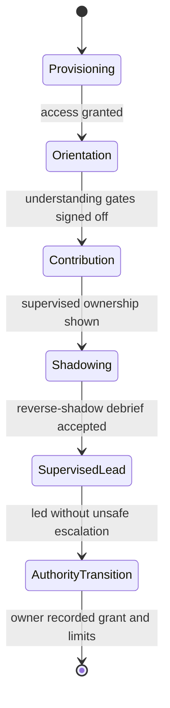

# [ONBOARDING_STANDARDS]

An onboarding document prepares one person to hold one role through guided reading, supervised practice, progressive access, and observable readiness gates. Lead it with the role, its observable readiness target, and the time-boxed ramp horizon; close it with the owner-recorded authority transition and remaining limits. Onboarding prepares people for responsibility. It is not a product lesson, a normal task procedure, an incident recovery path, a contribution workflow, or a lookup catalog.

## [1][USE_WHEN]

Use onboarding when a named person must become ready to hold a role that carries standing responsibility:

- contribution authority on a subsystem;
- maintainership, review, or merge authority;
- operational or on-call production responsibility;
- support or cross-functional review authority over work they do not own.

Route a single product lesson to tutorial, a one-time competent-reader task to how-to, incident recovery to runbook, the shared contribution workflow to contributing, and standalone facts to reference. When a draft needs two separate readiness targets, split it by role ramp before writing.

## [2][PROFESSIONAL_STANDARD]

Anchor every onboarding document to the canonical site-reliability and 30-60-90 onboarding model, and let repository truth own every factual claim. The model contributes ramp pattern only; it never supplies a command, version, or grant.

- Site reliability on-call onboarding contributes the ordered learning path, the comprehension-checked learning checklist with `Know before moving on` gates, shadow then reverse-shadow practice with a per-session debrief, tiered access earned as the learner closes gates, and a formal readiness assessment before independent authority.
- The 30-60-90 engineering framework contributes the time-boxed ramp spine: orientation, contribution, and independence phases, each with one measurable outcome, a check-in cadence, and an explicit exit criterion.
- Outcome-based readiness practice contributes the rule that a ramp is measured by outcome metrics — time to first owner-reviewed merge, time to first supervised production action, gate completion — never by activity metrics such as commit count, message volume, or hours.
- Access-provisioning practice contributes the rule that provisioning is a tracked, owned, dated gate before day one, because a hire idle awaiting access is the most-cited onboarding failure.
- Onboarding-as-product practice contributes the rule that the program captures the newcomer's fresh-eyes documentation contribution and a dated feedback point before the learner normalizes the team's gaps.

`Source of truth:` Google SRE on-call onboarding; 30-60-90 engineering onboarding framework; DORA and SHRM readiness-metric guidance. `Last verified:` 2026-06-04. `Review trigger:` the canonical onboarding model changes.

## [3][SOURCE_ORDER]

Use the first source that decides a readiness claim:

1. Current repository source, manifests, generated contracts, command output, permission grants, and recorded sign-off.
2. This onboarding standard for ramp shape, gate structure, and required sections.
3. Site reliability onboarding practice for ordered learning, shadowing, progressive access, and readiness gates; open-source maintainer practice for triage, review, release, and stale-document stewardship.

Repository truth owns every factual claim, prerequisite, command, permission, and piece of readiness proof. External practice owns ramp pattern only, never a specific command, version, or grant.

## [4][ROLE_RAMP_PROFILES]

Pick exactly one primary ramp; each ramp changes the readiness target, the access progression, the practice activities, and the sign-off owner. Split the document when two ramps need distinct readiness criteria rather than widening one document to cover both. Keep the ramp facts together and compact; if a ramp needs longer local policy, put that policy in the onboarding document that instantiates the ramp, not in this chooser.

| [INDEX] | [RAMP]           | [READINESS_TARGET]         | [PRACTICE]              | [ACCESS]           | [SIGN_OFF]      |
| :-----: | :--------------- | :------------------------- | :---------------------- | :----------------- | :-------------- |
|   [1]   | Contributor      | first owner-reviewed merge | build, change, PR       | read -> PR         | subsystem owner |
|   [2]   | Maintainer       | triage/review authority    | triage, review, release | labels -> merge    | maintainer lead |
|   [3]   | Operator         | scoped production action   | shadow, reverse-shadow  | dashboards -> prod | on-call lead    |
|   [4]   | Cross-functional | bounded support or review  | review tasks, triage    | read + task tool   | reviewing owner |

A ramp that grants production action or merge rights must define supervised practice before that grant. A cross-functional ramp must name the single review or support task it ends on, so readiness stays bounded.

## [5][PLACEMENT]

Route document-type, placement, and lifecycle questions to the standards index by topic. As a default, place repository-wide onboarding at `ONBOARDING.md`, maintainer onboarding at `docs/onboarding/maintainers.md`, operator onboarding at `docs/onboarding/operators.md`, and owner-local onboarding at `{owner}/ONBOARDING.md` when the learning path, boundary map, exercises, and readiness criteria are specific to that owner. Place the document beside the owner role that can refresh it when the role moves.

## [6][REQUIRED_STRUCTURE]

Every onboarding document carries the H2 sections below, in this order, plus the opening metadata block above them. Copy this template; the cardinality column states whether each section is required, optional, conditional, or repeatable per item.

```markdown template
# [ROLE_ONBOARDING]

Role: <single role this ramp confers>
Owner: <refresh owner role>
Ramp horizon: <expected duration, e.g. 90d>
Last reviewed: YYYY-MM-DD
Review trigger: <event that makes this ramp stale>

<Lead: the one role, its observable readiness target, the ramp horizon, the closing authority transition.>

## [1][AUDIENCE]

## [2][READINESS_TARGET]

## [3][PROVISIONING_PREREQUISITES]

## [4][BOUNDARY_MAP]

## [5][RAMP_PHASES]

## [6][LEARNING_CHECKLIST]

## [7][FIRST_SAFE_TASKS]

## [8][SHADOWING_REVIEW_PATH]

## [9][READINESS_CRITERIA]

## [10][OWNER_ROLES]

## [11][FEEDBACK_REFRESH]

## [12][RAMP_FLOW]

## [13][BOUNDARIES]

## [14][REVIEW_CHECKLIST]

```

Section cardinality:

- Opening metadata: required, one; holds `Role`, `Owner`, `Ramp horizon`, `Last reviewed`, and `Review trigger` consumed by a review workflow.
- Audience: required, one; holds the single role this ramp serves and the prior knowledge assumed.
- Readiness target: required, one; holds the observable end-state plus the time-boxed ramp horizon.
- Provisioning and prerequisites: required, one; holds a status-tracked provisioning gate plus the reading needed before step one.
- Boundary map: required, one; holds subsystem edges, ownership, failure modes, and critical-path components.
- Ramp phases: required, one; holds the time-boxed spine: phase, outcome, cadence, and exit criterion.
- Learning checklist: required, repeatable items; holds ordered units of understanding, each a status-tagged record.
- First safe tasks: required, repeatable items; holds supervised low-blast-radius tasks, including a fresh-eyes deliverable.
- Shadowing and review path: conditional, repeatable items; holds observed activity, mentor, abort, and per-session debrief; omit only when no authority transfers.
- Readiness criteria: required, repeatable items; holds observable, role-specific gates ending in the recorded transition.
- Owner roles: required, one; holds buddy, reviewer, and sign-off owner, named distinctly.
- Feedback and refresh: required, one; holds a dated feedback-capture point and the drift check, or the checklist that owns it.
- Ramp flow: optional, one; holds the gated lifecycle diagram when the forward-only gate order needs rendering.
- Boundaries: required, one; holds one route-away link per adjacent owner.
- Review checklist: required, one; holds observable author self-checks.

Omit `Shadowing and review path` only when the role transfers no authority and has no supervised practice. State `Feedback and refresh` as a named maintained checklist where one already owns the refresh, rather than dropping the section.

## [7][AUDIENCE]

Discharge two obligations and no more. Name the single role this ramp confers — the same role the opening metadata `Role` and the Readiness-target end-state carry, never a second role — so the document stays bounded to one ramp. Then list the prior knowledge the reader is assumed to already hold as canonical repository source paths, not prose summaries, consistent with the prerequisite-reading rule under Provisioning; the difference is that this list is what the reader needs *before opening the document*, while the Provisioning prerequisite list is what they read *before learning-checklist item one*.

```markdown template
This ramp confers: Contributor on the bridge subsystem.
Assumes prior knowledge:
- src/bridge/README.md — what the bridge is and the request it serves
- docs/standards/learning/onboarding.md — how a ramp is gated
```

## [8][READINESS_TARGET]

State the readiness target as the observable end-state that confers authority, paired with the opening metadata `Ramp horizon` so the ramp is time-boxed rather than open-ended. Measure the ramp by outcome metrics — time to first owner-reviewed merge, time to first supervised production action, gate completion — and never by activity metrics such as commit count, message volume, or hours logged. An open-ended ramp with no horizon and an activity-counting metric is the low-value shape this standard forbids.

## [9][PROVISIONING_PREREQUISITES]

Split this section into a tracked provisioning gate and the reading required before learning-checklist item one. Provisioning is a dated, owned gate, not an undated bullet, because a learner idle awaiting access is the most-cited onboarding failure.

Render the provisioning gate as status-tagged records so an owner can filter on exact state. Each grant carries `Access`, `Status` from the closed set `PLANNED`, `IN-PROGRESS`, `BLOCKED`, `DONE`, `DROPPED`, the gate that `Unlocks` it, and the `Owner` accountable for the grant. Access widens only as the prior gate closes.

```markdown template
### [N.M][REPOSITORY_READ_ACCESS]

Access: read-only repository and dashboard access
Status: DONE
Unlocks: learning-checklist item one
Owner: Subsystem owner

### [N.M][BRANCH_PULL_REQUEST]

Access: branch creation and pull-request open
Status: IN-PROGRESS
Unlocks: first safe tasks
Owner: Subsystem owner
```

List the reading and prior knowledge the learner needs before item one as canonical repository source paths, not prose summaries.

## [10][BOUNDARY_MAP]

Name the subsystem edges, the owning role for each edge, the failure modes, and the critical-path components the learner must hold. Each critical-path component named here is the anchor for a mandatory comprehension question in the learning checklist, so name them precisely.

Render the map as a C4 Container view when the learner must hold how the subsystem talks to its neighbors, because a list of edges loses the direction and protocol of each relationship. Keep the architecture-modeling rules with the architecture owner; this standard only requires that the map name edges, ownership, failure modes, and critical-path components.

## [11][RAMP_PHASES]

State the time-boxed spine as a phase table: the temporal container the gates hang on. Without it the document is a gate list with no horizon, no cadence, and no per-phase exit. Each phase names one measurable outcome, its check-in cadence, and its exit criterion. Use outcome metrics, never activity metrics.

| [INDEX] | [PHASE]      | [OUTCOME]             | [CADENCE]       | [EXIT]                    |
| :-----: | :----------- | :-------------------- | :-------------- | :------------------------ |
|   [1]   | Orientation  | reviewed change ships | weekly buddy    | env built; change shipped |
|   [2]   | Contribution | scoped area owned     | weekly reviewer | minimal support           |
|   [3]   | Independence | authority segment led | sign-off owner  | no unsafe escalation      |

Adapt the phase names to the ramp where orientation, contribution, and independence do not fit the role, but keep three properties per phase: a measurable outcome, a stated cadence, and an exit criterion.

## [12][LEARNING_CHECKLIST]

Order checklist items by how understanding builds, not by file tree: request flow, dependency chain, lifecycle stage, escalation path, or maintainer responsibility. Use the file tree as the order only when the tree is the learning path.

State each checklist item as a status-tagged record so a reviewer can scan, quote, close, and filter each field independently. Each item carries these fields, with the stated cardinality:

```markdown template
Scope: <boundary, subsystem, workflow, or responsibility being learned>      # required
Source: <canonical repository source path, not a prose summary>              # required
Understanding: <concept or behavior to hold before the next item>            # required
Proof: <exercise, comprehension question, review task, or trace-aloud>       # required
Owner: <role for questions and review>                                       # required
Access: <permission level this item needs>                                   # optional, when access matters
Status: <PLANNED | IN-PROGRESS | BLOCKED | DONE | DROPPED>                    # required
Sign-off: <evidence that closes the item, naming who recorded closure>       # required
```

Carry at least one observable comprehension question in the `Proof` field for every critical-path component named in the boundary map, in the `Know before moving on` form. A checklist item proves nothing until its `Proof` field names something a reviewer can observe and its `Sign-off` field names who recorded closure. `Proof: read the module and feel comfortable with it` is rejected because it names no observable result.

## [13][FIRST_SAFE_TASKS]

A first safe task gives the learner real ownership while keeping its blast radius contained to one reviewed unit and its supervision explicit. It is safe because its scope is bounded and its reviewer is named, not because it is low value.

Draw first safe tasks from this set, and include at least one fresh-eyes documentation deliverable so the newcomer's contribution is captured before they normalize team gaps:

- correct a stale onboarding or reference section, with owner review (fresh-eyes deliverable);
- draw the current boundary map and have an owner review it (fresh-eyes deliverable);
- answer one bounded comprehension question from source truth;
- reproduce one documented local verification path end to end;
- triage one non-urgent issue against existing policy;
- review one low-risk change behind a maintainer's second review;
- observe one operational event and write an owner-reviewed summary.

A task qualifies as a first safe task only when it touches no users, no production state, no release authority, and no repository-wide risk without a named reviewer gating the result. At least one selected task must be a fresh-eyes documentation deliverable.

## [14][SHADOWING_REVIEW_PATH]

Define, per shadowed activity, what the learner observes, what the mentor does, the abort signal, and the debrief artifact that closes every session. Render each activity as a status-tagged record:

```markdown template
Activity: <review, triage, release, support, incident response, or on-call>  # required
Prerequisite: <what the learner completes before the first session>          # required
Artifact: <debrief notes, questions, or summary produced every session>      # required, every session
Mentor: <owner role responsible for feedback>                                # required
Lead-under-supervision: <when the learner may reverse-shadow or lead>        # required
Abort: <signal that makes the activity too risky for training>               # required where production or users are reachable
Status: <PLANNED | IN-PROGRESS | BLOCKED | DONE | DROPPED>                    # required
Readiness signal: <observable proof before independent authority>            # required
```

Follow shadow then reverse-shadow ordering, and produce a debrief artifact after every session, because jumping from observation to solo without a debrief turns the shadow into an error factory. Operator ramps include live or realistic practice before any independent production action. Maintainer ramps include supervised triage, supervised review, release rehearsal, and at least one governance decision before elevated permissions. The `Abort` field is mandatory whenever the activity can affect production state or users, because the supervised session must have a defined stop before risk exceeds training value.

## [15][READINESS_CRITERIA]

State readiness criteria as observable, role-specific gates an owner can confirm, rendered as a checklist so a mentor can mark closure. A criterion that an owner cannot observe is not a gate. The closing criterion is always the recorded authority transition with the owner's recorded remaining limits.

Gate the transition on this ordered set:

- [ ] Learner closed every learning-checklist item that the role requires.
- [ ] Learner explained the boundary map and its failure modes to the sign-off owner.
- [ ] Learner completed first safe tasks, including the fresh-eyes deliverable, with accepted review.
- [ ] Learner shadowed and reverse-shadowed the required activities with accepted debriefs.
- [ ] Learner led one supervised review, drill, release rehearsal, or incident segment without unsafe escalation.
- [ ] Sign-off owner approved the authority transition and recorded the remaining limits.

Attach proof beside the gate it closes: the source path or maintained document, the exact command or exercise when runnable behavior is the gate, the owner sign-off, the access boundary when authority changes, and the freshness field for any drift-prone section. Use `Evidence:`, `Last verified: YYYY-MM-DD`, `Review trigger:`, `Generated from:`, and `Source of truth:` from the evidence standard, attached beside the gate rather than in a page footer; do not invent new staleness machinery.

A proof-bearing gate with several evidence fields is promoted to a record block, so the gate and its proof read as one unit without inventing a checklist continuation schema:

```markdown template
### [N.M][SIGN_OFF_AUTHORITY]

Status: PLANNED
Exit: sign-off owner approved the authority transition and recorded the remaining limits.
Evidence: docs/onboarding/sign-off/contributor-bridge.md — recorded grant and limits
Access: branch and pull-request access on the bridge subsystem; no merge rights
Source of truth: PERMISSIONS.md repository access table
Last verified: 2026-06-04
Review trigger: the bridge subsystem owner changes
```

## [16][OWNER_ROLES]

Name three owner roles distinctly so the learner knows who to ask, who reviews work, and who confers authority:

- Buddy: answers daily questions during the ramp.
- Reviewer: reviews first safe tasks and scoped work.
- Sign-off owner: assesses readiness and approves the authority transition.

One person may hold more than one role, but the document names all three so no responsibility is implicit.

## [17][FEEDBACK_REFRESH]

Name a dated feedback-capture point that feeds ramp improvement, and the drift check that keeps this document current. The feedback point captures the learner's experience while it is fresh — at week one, mid-ramp, or completion — because the program is a living product, not a one-time artifact. The drift check keeps the factual claims current.

State the refresh as a named maintained checklist where one already owns it, naming that checklist where the section would otherwise stand, rather than dropping the section.

## [18][RAMP_FLOW]



A `stateDiagram-v2` is the deliberate choice here: the ramp is a lifecycle of gated states with one forward transition each, which a flowchart or table would flatten. Access widens only as the prior gate closes; no transition skips a state.

## [19][EXAMPLES]

A learning-checklist item misfires when its proof is unobservable. Show one rejected and one accepted shape so the distinction is unambiguous:

```markdown rejected
Scope: request lifecycle through the bridge
Understanding: how a scenario reaches RhinoWIP
Proof: read the bridge module and feel comfortable with it
Sign-off: done
```

```markdown conceptual
Scope: request lifecycle through the bridge
Source: docs/standards/learning/onboarding.md and the bridge module
Understanding: how a scenario request reaches RhinoWIP and returns evidence
Proof: trace one scenario path aloud to the owner and answer two follow-ups
Owner: Runtime maintainers
Access: read-only repository access
Status: IN-PROGRESS
Sign-off: owner recorded the trace as accepted
```

## [20][BOUNDARIES]

- [tutorial.md](tutorial.md) owns teaching a learner through a first success; onboarding owns preparing a person for standing role responsibility.
- [README.md](../README.md) owns document-type routing, placement, lifecycle, and the boundary against how-to, reference, runbook, contributing, test-strategy, and support-matrix content; route those questions there by topic rather than embedding their bodies.

## [21][REVIEW_CHECKLIST]

- [ ] Opening metadata block carries `Role`, `Owner`, `Ramp horizon`, `Last reviewed`, and `Review trigger`.
- [ ] Audience names exactly one role and the prior knowledge assumed.
- [ ] One primary ramp profile is chosen and its readiness target is observable and time-boxed.
- [ ] Readiness target uses outcome metrics, never activity metrics.
- [ ] Provisioning grants are status-tagged records bound to the gate that unlocks each.
- [ ] Boundary map names edges, ownership, failure modes, and critical-path components.
- [ ] Ramp phases name a measurable outcome, a check-in cadence, and an exit criterion each.
- [ ] Learning checklist is ordered by how understanding builds.
- [ ] Each checklist item carries scope, source, understanding, proof, owner, status, and sign-off, with access where it matters.
- [ ] At least one comprehension question exists per critical-path component named in the boundary map.
- [ ] First safe tasks carry real ownership behind a named reviewer and include a fresh-eyes documentation deliverable.
- [ ] Shadowing follows shadow then reverse-shadow with a debrief artifact every session, and an abort signal where production or users are reachable.
- [ ] Readiness criteria are observable gates ending in a recorded transition with remaining limits.
- [ ] Owner roles name the buddy, reviewer, and sign-off owner distinctly.
- [ ] Feedback-capture point and drift check are both named.
- [ ] Proof beside each gate names evidence, access boundary, sign-off, and a freshness field for drift-prone sections.
