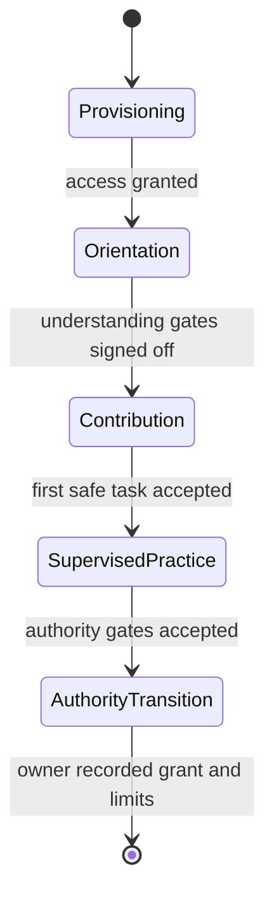

# [ONBOARDING_STANDARDS]

An onboarding document prepares one person to hold one role through guided reading, supervised practice, progressive access, and observable readiness gates. Lead it with the role, the observable readiness target, and the ramp horizon; close it with the owner-recorded authority transition and remaining limits. Onboarding prepares people for responsibility. It is not a product lesson, a normal task procedure, an incident recovery path, a contribution workflow, or a lookup catalog.

## [1][USE_WHEN]

Use onboarding when a named person must become ready to hold a role that carries standing responsibility:

- contribution authority on a subsystem;
- maintainership, review, or merge authority;
- operational or on-call production responsibility;
- support or cross-functional review authority over work they do not own.

Route a single product lesson to tutorial, a one-time competent-reader task to how-to, incident recovery to runbook, the shared contribution workflow to contributing, and standalone facts to reference. When a draft needs two separate readiness targets, split it by role ramp before writing.

## [2][SOURCE_AUTHORITY]

Use the first source that decides a readiness claim. Repository truth owns every factual claim, command, permission, grant, owner, source path, and sign-off; external practice supplies reusable ramp behavior only.

1. Current repository source, manifests, generated contracts, command output, permission grants, and recorded sign-off.
2. This onboarding standard for ramp shape, gate structure, and required sections.
3. Google SRE and SHRM onboarding practice for learning-checklist, shadowing, feedback, and readiness-measurement patterns.
4. DORA only for application or service delivery-flow metrics when the ramp explicitly measures software delivery performance.

Keep each external source scoped to the behavior it proves:

- [Google SRE on-call onboarding](https://sre.google/sre-book/accelerating-sre-on-call/) owns ordered learning, on-call learning checklists, `Know before moving on` gates, comprehension questions, shadow and reverse-shadow practice, mentor review, and documentation apprenticeship.
- [SHRM onboarding success metrics](https://www.shrm.org/topics-tools/topics/onboarding/measuring-success) owns feedback and success measures such as time to productivity, retention, new-hire surveys, employee satisfaction and engagement, performance measures, and informal feedback.
- 30/60/90-style cadence is a local scheduling convention for checkpoints and phase labels, not source authority for engineering readiness.
- [DORA metrics](https://dora.dev/guides/dora-metrics/) apply only when the ramp uses application or service delivery-flow measures such as change lead time, deployment frequency, failed deployment recovery time, change fail rate, or deployment rework rate. DORA is not a general readiness model, and first merge, first supervised production action, gate completion, and owner sign-off are local onboarding outcome metrics.

Source of truth: repository source, access records, commands, permission grants, and recorded sign-off for instantiated ramps; linked external sources for ramp-shape practices only.
Last verified: 2026-06-04.
Review trigger: Google SRE onboarding guidance, SHRM onboarding measurement guidance, DORA metric definitions, or local access/sign-off policy changes.

## [3][ROLE_RAMP_PROFILES]

Pick exactly one primary ramp; each ramp changes the readiness target, the access progression, the practice activities, and the sign-off owner. Split the document when two ramps need distinct readiness criteria rather than widening one document to cover both.

| [INDEX] | [RAMP]           | [READINESS_TARGET]         | [PRACTICE]              | [ACCESS]           | [SIGN_OFF]      |
| :-----: | :--------------- | :------------------------- | :---------------------- | :----------------- | :-------------- |
|   [1]   | Contributor      | first owner-reviewed merge | build, change, PR       | read to PR         | subsystem owner |
|   [2]   | Maintainer       | triage/review authority    | triage, review, release | labels to merge    | maintainer lead |
|   [3]   | Operator         | scoped production action   | shadow, reverse-shadow  | dashboards to prod | on-call lead    |
|   [4]   | Cross-functional | bounded support or review  | review tasks, triage    | read and task tool | reviewing owner |

A ramp that grants production action or merge rights must define supervised practice before that grant. A cross-functional ramp must name the single review or support task it ends on, so readiness stays bounded.

## [4][PLACEMENT]

Route document-type, placement, and lifecycle questions to the standards index by topic. Place onboarding beside the role owner that can refresh it when the role, learning path, boundary map, exercises, or readiness criteria move. Do not invent a corpus-wide onboarding path unless the repository already maintains that path.

## [5][REQUIRED_STRUCTURE]

Copy only the required skeleton below. Add conditional sections after the required section they support, and omit them when their condition is false.

```markdown template
# [ROLE_ONBOARDING]

Role: <single role this ramp confers>
Owner: <refresh owner role>
Ramp horizon: <expected duration>
Last reviewed: YYYY-MM-DD
Review trigger: <event that makes this ramp stale>

<Lead: the role, readiness target, ramp horizon, authority transition, and remaining limits.>

## [1][AUDIENCE]

## [2][READINESS_TARGET]

## [3][PROVISIONING_PREREQUISITES]

## [4][BOUNDARY_MAP]

## [5][RAMP_PHASES]

## [6][LEARNING_CHECKLIST]

## [7][FIRST_SAFE_TASKS]

## [8][READINESS_CRITERIA]

## [9][OWNER_ROLES]

## [10][FEEDBACK_REFRESH]

## [11][BOUNDARIES]

## [12][REVIEW_CHECKLIST]
```

Section cardinality:

**Identity and setup**
- Opening metadata: required, one; holds `Role`, `Owner`, `Ramp horizon`, `Last reviewed`, and `Review trigger`.
- Audience: required, one; holds the single role and prior knowledge assumed before opening the ramp.
- Readiness target: required, one; holds the observable end-state and ramp horizon.
- Provisioning and prerequisites: required, one; holds status-tracked, dated access gates plus reading needed before item one.

**Learning and practice**
- Boundary map: required, one; holds subsystem edges, ownership, failure modes, and critical-path components.
- Ramp phases: required, one; holds phase, outcome, cadence, and exit criterion.
- Learning checklist: required, repeatable H3 records; holds ordered units of understanding.
- First safe tasks: required, repeatable H3 records; holds supervised low-blast-radius tasks and any fresh-eyes deliverable the ramp selects.
- Readiness criteria: required, repeatable checklist items or H3 records; holds observable gates ending in the recorded transition.

**Ownership and closure**
- Owner roles: required, one; holds buddy, reviewer, and sign-off owner.
- Feedback and refresh: required, one; holds a dated feedback point and drift check, or names the maintained checklist that owns them.
- Boundaries: required, one; holds one route-away link per adjacent owner.
- Review checklist: required, one; holds observable author self-checks.

Conditional additions:

- `Shadowing and review path`: required when elevated authority, production access, user impact, merge rights, release authority, or cross-functional review authority transfers. Omit only when first safe tasks provide the complete supervised-practice gate and no elevated authority transfers.
- `Ramp flow`: optional; add only when branch states, access transitions, or authority gates are hard to recover from records alone.
- `Examples`: avoid a late examples section by default. Place an accepted/rejected example beside the rule it clarifies; add a section only when several rules need examples and each example cannot sit near its rule.

Generated onboarding documents must not include empty conditional headings. Add a conditional section only when its stated condition is true; otherwise keep the ramp on the required spine and let adjacent owners carry their own document types.

## [6][AUDIENCE]

Name the single role this ramp confers, matching opening metadata `Role` and the readiness-target end-state. Then list only the prior knowledge the reader is assumed to hold before opening the document, using canonical repository source paths where they exist. Reading required before learning-checklist item one belongs in `Provisioning and prerequisites`.

```markdown template
This ramp confers: Contributor on <subsystem>.
Assumes prior knowledge:
- <source-path> — <why this source is prerequisite knowledge>
- <source-path> — <why this source is prerequisite knowledge>
```

## [7][READINESS_TARGET]

State the readiness target as the observable end-state that confers authority, paired with opening metadata `Ramp horizon` so the ramp is time-boxed rather than open-ended. Measure the ramp by outcomes such as time to first owner-reviewed merge, time to first supervised production action, gate completion, or owner-recorded sign-off. Do not use activity metrics such as commit count, message volume, or hours logged as readiness proof.

## [8][PROVISIONING_PREREQUISITES]

Split this section into a tracked provisioning gate and the reading required before learning-checklist item one. Provisioning is a dated, owned gate when the role depends on tools or permissions, because onboarding must provide the access and information needed to become productive.

Render provisioning as status-tagged H3 records so an owner can filter state and update dates independently. Each grant carries `Access`, `Status` from `PLANNED`, `IN-PROGRESS`, `BLOCKED`, `DONE`, `DROPPED`, `Due before`, `Completed` when closed, `Unlocks`, and `Owner`. Access widens only as the prior gate closes.

```markdown template
### [N.M][READ_ACCESS]

Access: <read-only repository, dashboard, or source access>
Status: PLANNED
Due before: <YYYY-MM-DD or ramp day>
Completed: <YYYY-MM-DD or n/a>
Unlocks: learning-checklist item one
Owner: <grant owner role>
```

List prerequisite reading as canonical repository source paths, not prose summaries. A missing source path is a documentation gap; do not fill it with an invented path.

## [9][BOUNDARY_MAP]

Name the subsystem edges, the owning role for each edge, the failure modes, and the critical-path components the learner must hold. Each critical-path component named here is the anchor for a mandatory comprehension question in the learning checklist, so the facts must be recoverable even when no diagram is present.

Use prose, records, a small table, or a diagram according to the form standard. Add a C4 System Context or Container view only when relationship complexity makes the owner, external-system, deployable-unit, protocol, or data-store boundary hard to recover from text. Keep C4 modeling rules and current system structure with the architecture owner; onboarding only requires edges, ownership, failure modes, and critical-path components.

## [10][RAMP_PHASES]

State the time-boxed spine as a phase table: the temporal container the gates hang on. Without it the document is a gate list with no horizon, no cadence, and no per-phase exit. Each phase names one measurable outcome, its check-in cadence, and its exit criterion.

| [INDEX] | [PHASE]      | [OUTCOME]             | [CADENCE]       | [EXIT]                    |
| :-----: | :----------- | :-------------------- | :-------------- | :------------------------ |
|   [1]   | Orientation  | reviewed change ships | weekly buddy    | env built; change shipped |
|   [2]   | Contribution | scoped area owned     | weekly reviewer | minimal support           |
|   [3]   | Independence | authority segment led | sign-off owner  | no unsafe escalation      |

Adapt the phase names to the role, but keep the required shape: outcome, cadence, and exit criterion.

## [11][LEARNING_CHECKLIST]

Order checklist items by how understanding builds, not by file tree: request flow, dependency chain, lifecycle stage, escalation path, or maintainer responsibility. Use file-tree order only when the tree is the learning path.

Render each learning item as an H3 record block because it carries more than 5 fields and is updated independently:

```markdown template
### [N.M][ITEM_LABEL]

Scope: <boundary, subsystem, workflow, or responsibility being learned>
Source: <canonical repository source path>
Understanding: <concept or behavior to hold before the next item>
Proof: <observable exercise, comprehension question, review task, or trace-aloud>
Owner: <role for questions and review>
Access: <permission level this item needs, or n/a>
Status: <PLANNED | IN-PROGRESS | BLOCKED | DONE | DROPPED>
Sign-off: <evidence that closes the item, naming who recorded closure>
```

Carry at least one observable comprehension question in the `Proof` field for every critical-path component named in the boundary map, in the `Know before moving on` form. A checklist item proves nothing until `Proof` names something a reviewer can observe and `Sign-off` names who recorded closure.

The rejected shape below fails because its proof is unobservable:

```markdown rejected
Scope: request lifecycle through <subsystem>
Understanding: how the request reaches the runtime
Proof: read the module and feel comfortable with it
Sign-off: done
```

The accepted shape names source truth, an observable proof, an owner, state, and sign-off:

```markdown conceptual
Scope: request lifecycle through `<subsystem-path>`
Source: <subsystem-path>/README.md
Understanding: how a request reaches the runtime and returns evidence
Proof: trace one request path aloud to the owner and answer two follow-ups
Owner: <subsystem owner role>
Access: read-only repository access
Status: IN-PROGRESS
Sign-off: owner recorded the trace as accepted
```

## [12][FIRST_SAFE_TASKS]

A first safe task gives the learner real ownership while keeping its blast radius contained to one reviewed unit and its supervision explicit. It is safe because its scope is bounded and its reviewer is named, not because it is low value.

Render selected tasks as H3 records so the learner, reviewer, exit gate, and proof stay together:

```markdown template
### [N.M][TASK_LABEL]

Task: <supervised low-blast-radius task>
Scope: <single reviewed unit and forbidden blast radius>
Reviewer: <owner role gating the result>
Exit: <observable accepted result>
Proof: <link, command result, review note, or artifact that closes the task>
Status: <PLANNED | IN-PROGRESS | BLOCKED | DONE | DROPPED>
Fresh-eyes: <yes/no; if yes, name the documentation deliverable>
```

Draw first safe tasks from this set. Select a fresh-eyes documentation task when the ramp owns documentation stewardship or exposes a likely documentation gap; otherwise capture the learner's fresh perspective in `Feedback and refresh` instead of forcing a documentation deliverable into the task set.

- correct a stale onboarding or reference section, with owner review and `Fresh-eyes: yes`;
- draw the current boundary map and have an owner review it, with `Fresh-eyes: yes` when the map documents a current gap;
- answer one bounded comprehension question from source truth;
- reproduce one documented local verification path end to end;
- triage one non-urgent issue against existing policy;
- review one low-risk change behind a maintainer's second review;
- observe one operational event and write an owner-reviewed summary.

This section names supervised practice only. A task qualifies as first safe only when it touches no users, production state, release authority, or repository-wide risk without a named reviewer gating the result. Task procedure routes to how-to, contribution mechanics route to contributing, operational response routes to runbook, and lookup facts route to reference.

## [13][SHADOWING_REVIEW_PATH]

Add this section when elevated authority, production access, user impact, merge rights, release authority, or cross-functional review authority transfers. Define, per shadowed activity, what the learner observes, what the mentor does, the abort signal, and the debrief artifact that closes every session. Shadowing and reverse-shadowing come from onboarding practice; debrief artifacts and abort signals are local proof and risk controls.

Render each activity as an H3 record:

```markdown template
### [N.M][ACTIVITY_LABEL]

Activity: <review, triage, release, support, incident response, or on-call>
Prerequisite: <what the learner completes before the first session>
Artifact: <debrief notes, questions, or summary produced every session>
Mentor: <owner role responsible for feedback>
Lead-under-supervision: <when the learner may reverse-shadow or lead>
Abort: <signal that makes the activity too risky for training, or n/a>
Status: <PLANNED | IN-PROGRESS | BLOCKED | DONE | DROPPED>
Readiness signal: <observable proof before independent authority>
```

Follow shadow then reverse-shadow ordering, and produce a debrief artifact after every session. The `Abort` field is mandatory whenever the activity can affect production state or users, because the supervised session must have a defined stop before risk exceeds training value.

## [14][READINESS_CRITERIA]

State readiness criteria as observable, role-specific gates an owner can confirm, rendered as a checklist when each gate is short and proof-light. A criterion that an owner cannot observe is not a gate. The closing criterion is always the recorded authority transition with the owner's recorded remaining limits.

Gate the transition on this ordered set:

- [ ] Learner closed every learning-checklist item that the role requires.
- [ ] Learner explained the boundary map and its failure modes to the sign-off owner.
- [ ] Learner completed first safe tasks, including any selected fresh-eyes deliverable, with accepted review.
- [ ] Sign-off owner approved the authority transition and recorded the remaining limits.

Add the authority-transfer gates below only when the ramp includes `Shadowing and review path`:

- [ ] Learner completed required shadow and reverse-shadow activities with accepted debriefs.
- [ ] Learner led one supervised review, drill, release rehearsal, or incident segment without unsafe escalation.
- [ ] Sign-off owner confirmed that abort signals, remaining limits, and independent-authority boundaries are recorded.

Promote a proof-heavy gate to an H3 record so the gate and its proof read as one unit:

```markdown template
### [N.M][SIGN_OFF_AUTHORITY]

Status: PLANNED
Exit: sign-off owner approved the authority transition and recorded the remaining limits.
Evidence: <maintained sign-off record or review artifact>
Access: <granted authority and remaining limits>
Source of truth: <access table, owner record, or permission source>
Last verified: <YYYY-MM-DD or n/a for conceptual example>
Review trigger: <event that makes the grant stale>
```

Attach proof beside the gate it closes: the source path or maintained document, the exact command or exercise when runnable behavior is the gate, the owner sign-off, the access boundary when authority changes, and the freshness field for any drift-prone section. Use evidence fields from the evidence standard; do not invent new staleness machinery.

## [15][OWNER_ROLES]

Name three owner roles distinctly so the learner knows who to ask, who reviews work, and who confers authority:

- Buddy: answers daily questions during the ramp.
- Reviewer: reviews first safe tasks and scoped work.
- Sign-off owner: assesses readiness and approves the authority transition.

One person may hold more than one role, but the document names all three so no responsibility is implicit.

## [16][FEEDBACK_REFRESH]

Name a dated feedback-capture point that feeds ramp improvement and the drift check that keeps the document current. The feedback point captures the learner's experience while it is fresh — at week one, mid-ramp, or completion — and the drift check keeps factual claims current.

State the refresh as a named maintained checklist where one already owns it, naming that checklist where the section would otherwise stand rather than dropping the section.

## [17][RAMP_FLOW]

Add a diagram only when branch states, access transitions, or authority gates are hard to recover from records alone. Do not add a diagram to restate the required phase table, learning records, and readiness checklist.

Use `stateDiagram-v2` for a lifecycle of gated states, and include visible text explaining what the diagram proves:



The diagram proves only gate order. Optional shadowing and reverse-shadowing fit inside `SupervisedPractice` when authority transfer requires them. Access widens only as the prior gate closes; no transition skips a state.

## [18][BOUNDARIES]

- [tutorial.md](tutorial.md) owns teaching a learner through a first success; onboarding owns preparing a person for standing role responsibility.
- [architecture.md](../explanation/architecture.md) owns current structure, C4 modeling, and system-boundary explanation; onboarding may require a learner-facing boundary map but does not own architecture truth.
- [how-to.md](../task/how-to.md) owns repeatable competent-reader tasks; onboarding may assign a supervised practice task but does not embed the procedure.
- [runbook.md](../task/runbook.md) owns operational symptom response, mitigation, rollback, escalation, and verification.
- [contributing.md](../task/contributing.md) owns shared contribution workflow, pull-request evidence, and review mechanics.
- [reference.md](../reference/reference.md) owns standalone lookup facts, command catalogs, status vocabularies, and source-of-truth tables.
- [README.md](../README.md) owns document-type routing, placement, lifecycle, split/link decisions, and adjacent-type selection.

## [19][REVIEW_CHECKLIST]

**Identity and source**
- [ ] Opening metadata carries `Role`, `Owner`, `Ramp horizon`, `Last reviewed`, and `Review trigger`.
- [ ] Audience names exactly one role and the prior knowledge assumed.
- [ ] One primary ramp profile is chosen and its readiness target is observable and time-boxed.
- [ ] Readiness target uses outcome metrics, never activity metrics.
- [ ] Provisioning grants are dated H3 records with `Access`, `Status`, `Due before`, `Completed`, `Unlocks`, and `Owner`.
- [ ] Boundary map names edges, ownership, failure modes, and critical-path components.
- [ ] C4 views appear only when relationship complexity justifies a diagram, and architecture owns the modeling rules.

**Learning and practice**
- [ ] Ramp phases name a measurable outcome, a check-in cadence, and an exit criterion each.
- [ ] Learning checklist is ordered by how understanding builds.
- [ ] Each learning item carries scope, source, understanding, proof, owner, status, and sign-off, with access where it matters.
- [ ] At least one comprehension question exists per critical-path component named in the boundary map.
- [ ] First safe tasks carry real ownership behind a named reviewer, stay inside the blast-radius boundary, and mark any selected fresh-eyes deliverable.
- [ ] Shadowing appears only when authority transfers, follows shadow then reverse-shadow, carries debrief artifacts, and names abort signals where production or users are reachable.

**Proof and closure**
- [ ] Readiness criteria are observable gates ending in a recorded transition with remaining limits.
- [ ] Authority-transfer readiness gates appear only when shadowing or elevated authority applies.
- [ ] Owner roles name the buddy, reviewer, and sign-off owner distinctly.
- [ ] Feedback-capture point and drift check are both named.
- [ ] Proof beside each gate names evidence and sign-off; authority-changing gates also name the access boundary and freshness field.
- [ ] Boundaries route tutorial, architecture, how-to, runbook, contributing, reference, and README content away from onboarding.
