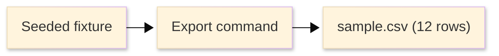

# [TUTORIAL_STANDARDS]

A tutorial teaches one learner outcome by guiding the learner through concrete action, visible results, and a primary path the author executed end to end before publication. The author owns reliability: a published lesson must be reproducible from the stated start state, and any unverified dependency must stay outside the core success path or mark the lesson as draft or blocked. A learning path orders three or more tested lessons so each later lesson reuses skill, vocabulary, or artifacts established earlier. The three-lesson threshold is a local taxonomy rule, not a Diátaxis requirement. This standard owns lesson shape, learner-path ordering, and execution proof; it does not own task procedure for a competent reader, role readiness, incident recovery, lookup facts, or conceptual explanation.

## [1][USE_WHEN]

Use a tutorial when every condition holds:

- the reader is learning the subject, not performing routine work.
- the path has fixed inputs and an observable result.
- one document can carry a complete first success.
- the exercise is repeatable, reversible, or disposable.

Use a learning path when three or more tested lessons build toward one broader skill and later lessons depend on earlier completion proof. Local rule: two related lessons can link to each other, but they are not a learning-path index until a third tested lesson makes ordered path maintenance useful.

Route elsewhere by topic when the reader is a competent operator completing a known task, a person becoming ready for a role, an operator recovering from an incident trigger, a reader looking up facts, or a reader seeking concepts and trade-offs.

## [2][AUTHORING_DOCTRINE]

External tutorial doctrine supplies the learning posture; this standard adds local structure, proof, and artifact rules. [Diátaxis tutorial doctrine](https://diataxis.fr/tutorials/) owns the tutorial type: guided action, visible progress, a concrete destination, few choices, minimal explanation, and reliability. [Refactoring English, "Rules for Writing Software Tutorials"](https://refactoringenglish.com/chapters/rules-for-software-tutorials/) supplies craft evidence for software tutorials: beginner-safe language, clear outcomes, early end-state preview, copyable examples, long flags, working-state checkpoints, one lesson focus, and demonstrable proof.


**Path discipline**
- Show the destination first: external doctrine requires the learner to know where they are going; local Rasm rule requires the final artifact before the first action, using screenshot plus text equivalent, exact output, or a small diagram.
- Deliver a visible, comprehensible result at every step; keep the example in a working state at every checkpoint.
- Keep a narrative of expectation: tell the learner what result to confirm before they run a step, and give exact example output where output is the signal.
- Point out what the learner should notice; never assume the result speaks for itself.
- Give the learner meaningful work before abstract explanation: the learner acts and sees a result, then any explanation follows.

**Scope discipline**
- Flag known learner traps inline at the step where they happen; consolidate only observed or source-backed recoverable failures into learner-trap recovery.
- Minimize explanation and options: one concrete path, with branches linked out after completion.
- Permit repetition: keep inputs reproducible, repeatable, and disposable so a learner can rerun from a clean start.
- Keep short lessons compact: for a lesson under about 15 minutes, keep `What we will build`, `Learning outcome`, `Prerequisites`, and `Start state` to one short block each unless proof requires more.

## [3][STRUCTURAL_CHOICES]

Choose one structure before writing. A single tutorial and a learning path have different closure surfaces, so do not blend them.

| [INDEX] | [STRUCTURE]     | [READER]     | [TITLE]  | [SPINE]      | [CLOSURE]                 |
| :-----: | :-------------- | :----------- | :------- | :----------- | :------------------------ |
|   [1]   | Single tutorial | first-timer  | artifact | lesson spine | stated end-state          |
|   [2]   | Learning path   | path learner | skill    | path spine   | composed final capability |

Treat audience, difficulty, tool family, and concept depth as entry context and prose constraints inside the chosen structure, not as additional variants. If two lessons need separate inputs, proof, or titles, split them.

## [4][TITLE_OUTCOME_RULES]

Lead the title with the observable artifact or skill outcome, not an internal abstraction:

```markdown template
# [BUILD_CSV_EXPORT]
```

Reject titles that promise cognition the path cannot show:

```markdown rejected
# [UNDERSTANDING_EXPORT_SUBSYSTEM]
```

The first is accepted because it names an artifact the lesson can produce. The second is rejected because it names cognition, which routes to explanation by topic. State the learning outcome as a specific capability the learner can perform: `you can configure and run a CSV export endpoint`, never `understand exports`.

## [5][REQUIRED_STRUCTURE]

A single tutorial uses this spine. `Learner-trap recovery` appears only when the author observed recoverable failures or can cite a documented learner trap that does not fit a step-local `If wrong` field.

```markdown template
# [BUILD_OBSERVABLE_ARTIFACT]

<Lead: one sentence naming the artifact, difficulty, estimated time, and tested stack.>

## [1][WHAT_WE_WILL_BUILD]

## [2][LEARNING_OUTCOME]

## [3][PREREQUISITES]

## [4][START_STATE]

## [5][STEPS]

## [6][RESULT]

## [7][WHAT_NOTICE]

## [8][NEXT_STEPS]

## [9][BOUNDARIES]

## [10][REVIEW_CHECKLIST]
```

**Entry and setup**
- `What we will build`: required, one paragraph naming exactly one artifact, plus a required artifact preview: screenshot path with alt text, exact final-output block, or small end-state diagram with a visible caption or description. A prose promise alone fails this section.
- `Learning outcome`: required; 1 to 3 bullets, each a specific capability the learner can perform afterward.
- `Prerequisites`: required; tools, versions, accounts, fixtures, and prior lessons as a bulleted list, each item independently checkable. Each version names the exact tested value, a verify command where one exists, and a drift condition when the value can drift.
- `Start state`: required; the exact repository state, named branch, commit, sample data, or fixture the learner begins from, reproducible without the author present.

**Execution and closure**
- `Steps`: required; an ordered list of 3 to 12 numbered checkpoint records with indented `label: value` continuation lines.
- `Result`: required; the final observable artifact compared against the stated end-state preview, plus a `Done when` exit gate.
- `What to notice`: required; 1 to 5 observations the learner should register after key results.
- `Learner-trap recovery`: conditional; add after `What to notice` only for observed recoverable failures or documented traps that cannot fit step-local `If wrong`.
- `Next steps`: required; one reinforcement exercise that reuses the new skill without introducing a new tool, subsystem, or second artifact, plus maintained adjacent links only when they exist.

**Routing and review**
- `Boundaries`: required; adjacent owners and route-away rules, one link per adjacent owner.
- `Review checklist`: required; observable author gates.

A learning path index uses this spine:

```markdown template
# [SKILL_OUTCOME_LEARNING]

<Lead: one sentence naming the skill outcome, difficulty, lesson count, and whether stack proof is lesson-owned or shared.>

## [1][AUDIENCE]

## [2][OUTCOME]

## [3][PREREQUISITES]

## [4][PATH]

## [5][COMPLETION]

## [6][BOUNDARIES]

## [7][REVIEW_CHECKLIST]
```

Each `Path` entry is a record carried as a subsection-per-record block, because entries are updated independently and order is load-bearing. Repeatable: the `Path` section holds three or more entries.

```markdown template
### [N.M][LESSON_TITLE_LINK]

Outcome: <skill, vocabulary, or artifact the lesson produces>
Prerequisite: <prior lesson or named starting condition>
Availability: AVAILABLE | DRAFT | BLOCKED
Estimated time: <duration>
Optional next: <branch lesson, when the path forks>
```

- `Outcome` and `Prerequisite`: required. `Outcome` names the lesson result, and `Prerequisite` names the prior completion signal when sequence matters.
- `Availability`: required; exactly one of `AVAILABLE`, `DRAFT`, `BLOCKED`. This is the lesson-publication axis, not the form owner's lifecycle `Status` vocabulary. The field is named `Availability`, not `Status`, so `BLOCKED` cannot be confused with the form owner's lifecycle state; do not substitute `PLANNED`, `IN-PROGRESS`, `DONE`, or `DROPPED`.
- `Estimated time`: required; the per-lesson completion cost.
- `Optional next`: optional; present only when the path forks.

Order entries so each later lesson consumes a prior lesson's result. If the entries read in any order without loss, the document is a hub index routed to README by topic, not a learning path.

Conditional additions:

- `Related`: add only when maintained adjacent documents exist after completion; omit when no maintained adjacent document exists.

Generated documents must not include empty conditional headings. If no observed or source-backed learner-trap condition exists, omit `Learner-trap recovery`; if no maintained adjacent document exists, omit `Related` or the adjacent link instead of creating a placeholder.

An end-state preview must show the final artifact, not decorate the opening. An exact output block is enough when the result is textual:

```text conceptual
id,name,status
1,alpha,active
2,beta,inactive
```

For a relationship-shaped artifact, use a small Mermaid diagram with a visible text equivalent:



Text equivalent: the seeded fixture feeds the export command, and the command produces `sample.csv` with 12 data rows.

The rejected preview is any generic success diagram that does not prove the artifact the learner will produce.

## [6][STEP_RECORDS]

Each step is a checkpoint record, not a bare instruction line. A step must leave the learner in a verified working state. Render each step as a numbered list item whose continuation lines carry one `label: value` per line, indented under the numbered item. The numbered item owns the checkpoint imperative; `Operation` owns the exact command, edit, UI action, fixture, or captured interaction.

Use numbered checkpoint records by default. Add H3 milestone groups inside `Steps` only when a longer tutorial needs skimmable milestone boundaries; the actual steps remain numbered checkpoint records under the group.

Each step carries:

- `Operation`: required; the exact command, file edit, UI action, fixture use, or captured interaction. For commands, state the copy-safe command first, then its expected signal.
- `Expected`: required; the exact output, a named file change with content or row count, a specific UI state, a captured screenshot path, or another observable signal. Never paraphrase success as `it should work`, `you should see something`, or `the result is correct`.
- `Working state`: required; what now compiles, runs, renders, or passes so the learner is provably not broken. Name stub or placeholder content where full implementation is deferred.
- `Action`: optional; present only when the numbered checkpoint title cannot carry the imperative clearly.
- `Execution`: optional; present only for optional side effects outside the core success path, or for draft/blocked lessons. Published tutorial primary paths carry no unverified execution tag.
- `Notice`: conditional; required when the learner must observe this result before the next step makes sense, optional when the observation is reinforcing rather than gating.
- `If wrong`: optional; the inline failure flag for this step's known trap, naming the cause and fix.

State each term in the step that first needs it, in one sentence, not in a glossary the learner must hold. Use fixed inputs, sample data, deterministic commands, and realistic unambiguous placeholder data. Defer variants to adjacent how-to or reference documents linked after completion.

```markdown conceptual
3. Run the export against the seeded fixture.
   Operation: `npm run export -- --output sample.csv`
   Expected: `sample.csv` appears with one header line and 12 data rows.
   Working state: the project still builds; `npm run build` exits 0.
   Notice: the header row is emitted before any data row.
   If wrong: no file means the `--output` flag was dropped in this step.
```

That block shows the runnable command shape a real tutorial step must earn: operation, row count, and build gate are checkable. Contrast the collapsed form a low-value author would otherwise leave:

```markdown rejected
3. Run the export command. It should work.
```

The second is rejected because it carries no exact signal and no working-state gate, so the learner cannot tell whether they finished the step or broke the build.

Keep every command copy-safe per the craft owner: no shell prompt in input lines, long flags over short flags, full file paths for edits, and realistic placeholders. Code-block intent labels and command mechanics route to the form and craft owners named in `Boundaries`.

## [7][EXECUTION_VOCABULARY]

A published tutorial's core success path must be author-run from start state to result. Use execution tags only for draft or blocked lessons, or for optional side effects outside the core path that depend on hardware, credentials, reviewer access, or live services the author could not exercise.

- `NEEDS-FIXTURE`: the lesson is draft or blocked because a fixture or seed must be staged before verification.
- `UNVERIFIED-REQUIRES-<X>`: an optional side effect or draft/blocked lesson depends on hardware, credentials, or a live service the author could not exercise; name the dependency in place of `<X>`.

The tag rides in the step record's optional `Execution` field. Define the set inline at first use and apply no tag beyond this closed set. A published tutorial with a tagged primary-path step is not publishable; it is draft or blocked until the primary path runs front to back.

```markdown conceptual
7. Send the generated report to the configured recipient.
   Operation: `npm run export -- --output sample.csv --send`
   Expected: the run logs `delivered to ops@example.com` and exits 0.
   Working state: the export still builds; `npm run build` exits 0 with delivery stubbed.
   Execution: UNVERIFIED-REQUIRES-SMTP
   If wrong: a connection error means no SMTP host was reachable in this optional step.
```

This shape is valid only when SMTP delivery is outside the core success path or the lesson is not published as available.

## [8][RESULT_EXIT_GATE]

State `Result` as the final artifact compared against the stated end-state proof: reference diff, exact output, screenshot plus text equivalent, or diagram plus caption. Close the section with a `Done when` gate so the learner and an agent validating the document know whether the lesson closed.

```markdown template
## [6][RESULT]

`sample.csv` matches the stated end-state preview: one header line and 12 data rows.

Done when:
- [ ] the artifact matches the expected output shown in `What we will build`
- [ ] `npm run build` exits 0 from a clean checkout
- [ ] you can run the export and reproduce the result without the author present.
```

Each `Done when` item is observable and falsifiable, and the final item proves the learning outcome capability, not just the last step.

## [9][LEARNER_TRAP_RECOVERY]

Add learner-trap recovery only for observed recoverable failures from front-to-back execution or source-backed learner traps that cannot fit in a step-local `If wrong` field. Do not invent symptom-cause-fix rows because a step could theoretically fail. Operational recovery routes to runbook, and routine task repair routes to how-to.

| [INDEX] | [SYMPTOM]                | [LIKELY_CAUSE]             | [FIX]                                 |
| :-----: | :----------------------- | :------------------------- | :------------------------------------ |
|   [1]   | Empty `sample.csv`       | Fixture not loaded         | Re-run the `Start state` seed step    |
|   [2]   | Build fails after step 3 | Stub handler left unfilled | Complete the handler body from step 4 |

Order rows by the step at which the symptom first appears, and keep each cell within the form owner's cell ceiling. Carry long qualifiers in a note after the table.

## [10][NEXT_STEPS]

Close a tutorial with one reinforcement exercise that reuses the new skill without introducing a second lesson. Link adjacent documents only when maintained adjacent content exists:

- how-to for a competent-reader variant or production procedure.
- reference for command, option, API, or status lookup.
- explanation for concepts, trade-offs, and architecture.
- onboarding only when the tutorial is part of a role-readiness ramp.

The reinforcement exercise fails when it introduces a new tool, subsystem, account, deployment surface, or second artifact. Move that work to another tutorial, a learning-path entry, or a how-to guide, then link it only if the adjacent document exists.

Do not invent links to satisfy a quadrant checklist. Missing adjacent content is a documentation gap, not a reason to embed another document type in the tutorial.

## [11][EXECUTION_CLOSURE]

Execute the primary path as written before publishing a tutorial as available. Claim support attaches to the drift-prone fact, not the page footer. Generic claim-support field mechanics route to [proof.md](../proof.md); this section names only tutorial-specific closure obligations.

Required closure surfaces:

- exact operations the path uses: commands, UI actions, repository paths, fixtures, or captured interactions.
- final observable result and its stated end-state preview.
- expected intermediate signals at any step where a learner could lose confidence.
- grouped checks for shared stack, toolchain, or fixture dependencies.
- step-local checks for any unique drift-prone command, fixture, account, service, captured interaction, or generated artifact.

A learning path additionally closes lesson order and composed capability: prerequisites exist, each lesson is independently testable from its own start state, no later lesson relies on unexplained state, an earlier lesson's completion result feeds the next lesson wherever the path claims it does, and the final lesson demonstrates the composed skill rather than only its own local step.

Learner-facing first person such as `We will build` is correct because the document tutors. Author notes, task history, interaction fragments, and local machine paths are not.

The minimal complete shape below is intentionally compact; it shows the section interlock without becoming a second lesson:

```markdown conceptual
# [BUILD_SAMPLE_EXPORT]

This beginner tutorial creates a CSV export from a seeded fixture in 10 minutes with Node 22.11.0 and export CLI 1.4.0.

## [1][WHAT_WE_WILL_BUILD]

We will build `sample.csv` with one header line and 12 data rows.

## [2][LEARNING_OUTCOME]

- You can generate a CSV export from one seeded fixture.

## [3][PREREQUISITES]

- Node 22.11.0 and export CLI 1.4.0 are installed.

## [4][START_STATE]

Start from the seeded fixture at `fixtures/export/basic.json`.

## [5][STEPS]

1. Generate the export.
   Operation: `npm run export -- --fixture fixtures/export/basic.json --output sample.csv`
   Expected: `sample.csv` exists with one header line and 12 data rows.
   Working state: `npm run build` exits 0.
2. Inspect the header.
   Operation: open `sample.csv`.
   Expected: the first line is `id,name,status`.
   Working state: the file still has 12 data rows.
   Notice: the header appears before data rows because consumers parse columns first.
3. Re-run from a clean output.
   Operation: remove `sample.csv`, then run the export command again.
   Expected: the regenerated file matches the first output.
   Working state: the export is repeatable from the stated fixture.

## [6][RESULT]

Done when:
- [ ] `sample.csv` matches the previewed row count
- [ ] the build still exits 0
- [ ] the export can be regenerated from the stated fixture.

## [7][WHAT_NOTICE]

Notice the export is repeatable from the same fixture.

## [8][NEXT_STEPS]

Reinforcement: change one fixture row value and regenerate the same artifact.

## [9][BOUNDARIES]

Use a how-to for production export variants, and use reference for CLI option lookup.

## [10][REVIEW_CHECKLIST]

- [ ] The three steps reproduce `sample.csv` from the stated fixture.
```

## [12][BOUNDARIES]

**Adjacent document types**
- Document-type choice, placement, splitting, and lifecycle route to the standards router: [README.md](../README.md).
- One repeatable task for a competent reader routes to the how-to owner: [how-to.md](../task/how-to.md).
- Role readiness, shadowing, and readiness gates route to the onboarding owner: [onboarding.md](onboarding.md).
- Concepts, trade-offs, and architecture the lesson references route to the explanation owner: [architecture.md](../explanation/architecture.md).
- Planned lesson sequence, milestone order, and future learning work route to the roadmap owner when a maintained roadmap exists: [roadmap.md](../explanation/roadmap.md).
- Lookup facts, command catalogs, option tables, and status vocabularies route to the reference owner: [reference.md](../reference/reference.md).
- Public-symbol comments and generated source-reference contracts route to the code-documentation owner: [code-documentation.md](../reference/code-documentation.md).

**Shared standards**
- Container choice, code-block intent labels, table decomposition, and diagram type route to the form owner: [information-structure.md](../information-structure.md).
- Command mechanics, terminology, and copy-safe Markdown route to the craft owner: [style-guide.md](../style-guide.md).
- Claim-level evidence and preservation route to the evidence owner: [proof.md](../proof.md).

## [13][REVIEW_CHECKLIST]

**Shape and setup**
- [ ] One structure is chosen: single tested tutorial or learning path.
- [ ] The lead names the artifact or skill outcome, difficulty, tested stack, and either estimated time for single tutorials or lesson count for learning paths.
- [ ] The title names the observable artifact or skill outcome, not an internal abstraction.
- [ ] The learning outcome states a specific capability, not a vague aspiration.
- [ ] `What we will build` shows the end state via screenshot plus text equivalent, exact output, or diagram plus caption before step one.
- [ ] Any end-state diagram shows the final artifact and has a visible text equivalent; decorative diagrams are absent.
- [ ] Prerequisites and start state are explicit and reproducible from a named fixture, branch, commit, account state, or prior lesson.
- [ ] The required spine is present and conditional learner-trap recovery appears only when observed or source-backed.

**Step quality**
- [ ] `Steps` holds 3 to 12 numbered checkpoint records, with H3 milestone groups only when they improve skimming.
- [ ] Each step record carries `Operation`, exact `Expected` signal, and verified `Working state`, with `Action` only where the numbered checkpoint title cannot carry the imperative.
- [ ] `Notice` appears when the learner must observe a result before the next step makes sense.
- [ ] Known learner traps are captured as `If wrong` fields or learner-trap recovery rows.
- [ ] Commands are copy-safe: no prompt, long flags, full paths where needed, realistic placeholders.
- [ ] Terminology is introduced at first use, beside the step that needs it.
- [ ] Inputs are fixed, deterministic, repeatable, or intentionally disposable.
- [ ] The result matches the stated end-state preview, and the `Done when` gate is observable.

**Closure and routing**
- [ ] The published primary path was executed front to back; unverified tags appear only on draft/blocked lessons or optional side effects outside the core path.
- [ ] Shared stack or toolchain checks are grouped in entry context, and unique drift-prone step facts carry local checks.
- [ ] `Next steps` includes one reinforcement exercise, introduces no new tool, subsystem, or second artifact, and only links maintained adjacent content.
- [ ] Path indexes carry three or more entries, and each entry has `Outcome`, `Prerequisite`, `Availability`, and `Estimated time`.
- [ ] `Related` appears only when maintained adjacent learning-path documents exist.
- [ ] Later path lessons consume earlier results, each lesson is independently testable from its own start state, and the final lesson demonstrates the composed skill; unordered lesson hubs route to README instead.
- [ ] How-to, reference, onboarding, roadmap, code-documentation, and explanation material is linked after completion or from `Related`, not embedded.
