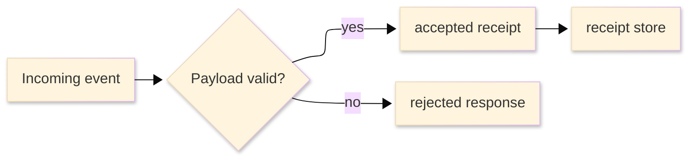

# [TUTORIAL_STANDARDS]

A tutorial teaches one learner outcome by guiding the learner through concrete action, visible results, and a primary path the author executed end to end before publication. The author carries reliability: a published lesson must be reproducible from the stated start state, and any unverified dependency must stay outside the core success path or mark the lesson as draft or blocked. A learning path orders three or more tested lessons so later lessons reuse skill, vocabulary, or artifacts established earlier. The three-lesson threshold is a local taxonomy rule, not a Diátaxis requirement. This standard carries lesson shape, learner-path ordering, and execution proof; it does not own competent-reader procedures, readiness, incident recovery, lookup facts, API contract truth, support policy, contribution workflow, or conceptual explanation.

## [1][USE_WHEN]

Use a tutorial when every condition holds:
- the reader is learning the subject, not performing routine work.
- the path has fixed inputs and an observable result.
- one document can carry a complete first success.
- the exercise is repeatable, reversible, or disposable.

Use a learning path when three or more tested lessons build toward one broader skill and later lessons depend on earlier completion proof. Two related lessons may link to each other, but they are not a learning-path index until a third tested lesson makes ordered path maintenance useful.

Route elsewhere by topic when the reader is a competent operator completing a known task, a person becoming ready for a route, an operator recovering from an incident trigger, a reader looking up facts, a contributor following PR workflow, or a reader seeking concepts and trade-offs.

[AUTHORING_CONTRACT]:
- Agent use: choose single tutorial or learning path, prove the start state, then write the executed learner path with visible working-state checkpoints.
- Required produced structure: for a tutorial, `What we will build`, `Learning outcome`, `Prerequisites`, `Start state`, `Steps`, `Result`, `What to notice`, `Next steps`, `Boundaries`, and `Checklist`; for a learning path, reader, outcome, prerequisites, ordered path, completion, boundaries, and checklist.
- Section cardinality: one observable outcome; 3 to 12 local-rule checkpoint steps for a lesson; at least three tested lessons for a learning path; conditional recovery appears only for observed or source-backed learner traps.
- Adjacent checks: check how-to, API, reference, support matrix, runbook, contributing, onboarding, roadmap, architecture, code documentation, and README only when a lesson consumes their fact after or inside the learning path.
- Maintenance triggers: update the tutorial when start state, fixture, command, tested stack, generated artifact, support target, lesson order, learner trap, result gate, or adjacent learning route changes.

## [2][AUTHORING_DOCTRINE]

External tutorial doctrine supplies the learning posture; this standard adds local structure, proof, and artifact rules. [Diátaxis tutorial doctrine](https://diataxis.fr/tutorials/) carries the tutorial type: guided action, visible progress, concrete destination, few choices, minimal explanation, and reliability. [Refactoring English, "Rules for Writing Software Tutorials"](https://refactoringenglish.com/chapters/rules-for-software-tutorials/) supplies stable craft evidence for software tutorials: beginner-safe language, clear outcomes, early end-state preview, copyable examples, long flags, working-state checkpoints, one lesson focus, and demonstrable proof.

Refresh external-source claims when a source revises the named practice or when this standard changes a source-backed behavior. Local defaults such as short-lesson compactness and step-count ranges are maintainability heuristics, not external doctrine.

Tutorial doctrine splits into these rule groups:
[PATH_DISCIPLINE]:
- Show the destination first. Local rule: the final artifact appears before step one as screenshot plus text equivalent, exact output, or a small diagram.
- Deliver a visible, comprehensible result at every step; keep the example in a working state at every checkpoint.
- Tell the learner what result to confirm before they run a step, and give exact example output where output is the signal.
- Point out what the learner should notice; never assume the result speaks for itself.
- Give the learner meaningful work before abstract explanation.

[SCOPE_DISCIPLINE]:
- Flag known learner traps inline at the step where they happen; consolidate only observed or source-backed recoverable failures into learner-trap recovery.
- Minimize explanation and options: one concrete path, with branches linked out after completion.
- Keep inputs reproducible, repeatable, and disposable so a learner can rerun from a clean start.
- Keep short lessons compact by local rule: when a lesson is under about 15 minutes, keep entry sections to short blocks unless proof requires more.

## [3][STRUCTURAL_CHOICES]

Choose one structure before writing. A single tutorial and a learning path have different closure surfaces, so do not blend them.

| [INDEX] | [STRUCTURE]     | [READER]     | [TITLE]  | [SPINE]      | [CLOSURE]                 |
| :-----: | :-------------- | :----------- | :------- | :----------- | :------------------------ |
|   [1]   | Single tutorial | first-timer  | artifact | lesson spine | stated end-state          |
|   [2]   | Learning path   | path learner | skill    | path spine   | composed final capability |

Treat reader, difficulty, tool family, and concept depth as entry context and prose constraints inside the chosen structure, not as additional variants. Split lessons that need separate inputs, proof, titles, or success artifacts.

## [4][TITLE_OUTCOME_RULES]

Lead the title with the observable artifact or skill outcome, not an internal abstraction:
```markdown template
# [VALIDATE_STANDARDS_DIFF]
```

Reject titles that promise cognition the path cannot show:
```markdown rejected
# [UNDERSTANDING_DOCUMENTATION_STANDARDS]
```

The accepted title names an artifact the lesson can produce. The rejected title names cognition, which routes to explanation. State the learning outcome as a specific capability the learner can perform: `you can validate a standards-only Markdown diff`, never `understand documentation standards`.

## [5][REQUIRED_STRUCTURE]

A single tutorial uses this spine. `Learner-trap recovery` appears only when the author observed recoverable failures or can cite a documented learner trap that does not fit a step-local `If wrong` field.

```markdown template
# [BUILD_OBSERVABLE_ARTIFACT]

<Lead: one sentence naming the artifact, difficulty, estimated time, and tested stack.>

## [1][WHAT_WE_WILL_BUILD]

## [2][LEARNING_OUTCOME]

## [3][PREREQUISITES]

## [4][START_STATE]

## [5][STEPS]

## [6][RESULT]

## [7][WHAT_NOTICE]

## [8][NEXT_STEPS]

## [9][BOUNDARIES]

## [10][CHECKLIST]
```

Section cardinality uses these groups:
[ENTRY_SETUP]:
- `What we will build`: required, one paragraph naming exactly one artifact, plus a required preview: screenshot with text equivalent, exact final-output block, or small end-state diagram with visible caption or description.
- `Learning outcome`: required; 1 to 3 bullets, each a specific capability the learner can perform afterward.
- `Prerequisites`: required; tools, versions, accounts, fixtures, prior lessons, and supported-version facts as independently checkable bullets. Each version names the exact tested value, a verify command where one exists, and a drift condition when the value can drift.
- `Start state`: required; exact repository state, branch, commit, sample data, account state, or fixture the learner begins from, reproducible without the author present.

[EXECUTION_CLOSURE]:
- `Steps`: required by local rule as 3 to 12 numbered checkpoint records with indented `label: value` continuation lines.
- `Result`: required; final observable artifact compared against the preview, plus a `Done when` exit gate.
- `What to notice`: required; 1 to 5 observations the learner should register after key results.
- `Learner-trap recovery`: conditional; add after `What to notice` only for observed recoverable failures or documented traps that cannot fit step-local `If wrong`.
- `Next steps`: required when a legitimate reinforcement exercise exists; otherwise state that no safe reinforcement exists and route to the next maintained lesson or adjacent route.
- `Boundaries` and `Checklist`: required.

Generated documents must not include empty conditional headings. Omit `Learner-trap recovery`, `Related`, or adjacent links when their trigger is false.

## [6][LEARNING_PATHS]

A learning path index uses this spine when three or more tested lessons compose one broader skill:
```markdown template
# [SKILL_OUTCOME_LEARNING]

<Lead: one sentence naming the skill outcome, difficulty, lesson count, and whether stack proof is lesson-local or shared.>

## [1][LEARNING_START]

## [2][OUTCOME]

## [3][PREREQUISITES]

## [4][PATH]

## [5][COMPLETION]

## [6][BOUNDARIES]

## [7][CHECKLIST]
```

Learning-path sections are authorable, not prose placeholders:
- `Reader`: names the learner state before lesson one and the knowledge the path assumes.
- `Outcome`: names the composed final capability and the final lesson or artifact that proves it.
- `Prerequisites`: names shared stack, account, fixture, prior route, or support requirement once when all lessons consume it; lesson-specific prerequisites stay in lesson entries or lesson files.
- `Path`: holds three or more ordered lesson records.
- `Completion`: states the composed capability gate: all available lessons pass, later lessons consume earlier results where claimed, and the final lesson demonstrates the broader skill rather than only its local artifact.

Each `Path` entry is a subsection-per-record block because entries are updated independently and order is load-bearing:
```markdown template
### [N.M][LESSON_TITLE_LINK]

ID: `<lesson id only when another lesson, proof receipt, or path dependency references it>`
Availability: AVAILABLE | DRAFT | BLOCKED | DEFERRED | DROPPED
Changed fact: `<skill, vocabulary, artifact, fixture, support target, or generated contract this lesson adds to the path>`
Consumed by: `<later lesson, completion gate, onboarding ramp, or adjacent learning route>`
Use in this document: `<why this lesson remains in this path and how later lessons depend on it>`
Depends: `<prior lesson completion signal or named starting condition>`
Evidence: `<front-to-back run, fixture proof, generated artifact, screenshot, output, or proof gap>`
Estimated time: `<duration>`
Update when: `<lesson result, fixture, command, stack, support target, or generated artifact changes>`
Close when: `<lesson is available, deferred with return trigger, or dropped from the path>`
Route-away: `<branch lesson, how-to, reference, or adjacent document that holds non-core variants>`
```

Path `Availability` is the publication axis. `AVAILABLE` means the lesson's primary path ran front to back. `DRAFT` means the lesson has unverified primary-path steps or incomplete fixture support. `BLOCKED` means a required fixture, access grant, generated contract, support target, or source route prevents verification. `DEFERRED` means the lesson is intentionally out of the current path until a named return trigger fires. `DROPPED` means the lesson is removed from the path and retained only when another record still references it. Step-level `Execution` tags explain the concrete unverified dependency inside a lesson; path-level `Availability` summarizes whether that lesson may be used in the path.

Order entries so each later lesson consumes a prior lesson's result. If entries can be read in any order without loss, the document is a hub index routed to [readme.md](../reference/readme.md), not a learning path.

## [7][END_STATE_PREVIEW]

An end-state preview must show the final artifact, not decorate the opening. Exact output is enough when the result is textual:
```text conceptual
Changed files: docs/standards/learning/tutorial.md
Check: git diff --check -- docs/standards
Result: PASS
Next route: no path or whitespace failures
```

Use a diagram only when the artifact is a relationship the learner must inspect and the rendered shape carries meaning that output text cannot. The diagram must show the final artifact, not merely the fact that a command produces a file.



Text equivalent: the completed EventPipeline route validates an incoming event, writes an accepted receipt to storage only when the payload is valid, and returns a rejected response for invalid payloads.

Reject a generic success diagram that does not prove the learner's final artifact.

## [8][STEP_RECORDS]

Each step is a checkpoint record, not a bare instruction line. A step must leave the learner in a verified working state. Render steps as numbered checkpoint records; add H3 milestone sets only when a longer tutorial needs skimmable boundaries, and keep actual steps numbered under the set.

Step records use these fields:
- `Operation`: required; exact command, file edit, UI action, fixture use, or captured interaction. For commands, state the copy-safe command first, then its expected signal.
- `Expected`: required; exact output, named file change with content or row count, specific UI state, screenshot path, or another observable signal.
- `Working state`: required; what now compiles, runs, renders, or passes so the learner is not broken.
- `Action`: optional; present only when the numbered checkpoint title cannot carry the imperative clearly.
- `Execution`: optional; present only for optional side effects outside the core success path, or for draft/blocked lessons.
- `Notice`: conditional; required when the learner must observe this result before the next step makes sense.
- `If wrong`: optional; inline failure flag for this step's known trap, naming cause and fix.

State each term in the step that first needs it. Use fixed inputs, deterministic commands, and realistic unambiguous placeholder data. Defer variants to adjacent how-to or reference documents linked after completion.

```markdown conceptual
3. Validate the standards diff.
    Operation: `git diff --check -- docs/standards`
    Expected: the command exits 0 and prints no whitespace error lines.
    Working state: changed standards have no whitespace errors.
    Notice: no output on success is the expected signal for this command.
    If wrong: a `trailing whitespace` line names the file and line to fix before continuing.
```

Reject this bare step because it lacks an exact signal and working-state gate:
```markdown rejected
3. Run the check.
```

The rejected form carries no exact signal and no working-state gate. Keep every command copy-safe per the craft route: no prompt, long flags, full file paths for edits, and realistic placeholders.

## [9][EXECUTION_VOCABULARY]

A published tutorial's core success path must be author-run from start state to result. Use execution tags only for draft or blocked lessons, or for optional side effects outside the core path that depend on hardware, credentials, validator access, or live services the author could not exercise.

Use this closed execution-tag vocabulary:
- `NEEDS-FIXTURE`: the lesson is draft or blocked because a fixture or seed must be staged before verification.
- `UNVERIFIED-REQUIRES-<X>`: an optional side effect or draft/blocked lesson depends on hardware, credentials, validator access, or a live service the author could not exercise; name the dependency in place of `<X>`.

The tag rides in the step record's optional `Execution` field. Define the set inline at first use and apply no tag beyond this closed set. A tutorial with a tagged primary-path step is not publishable as `AVAILABLE`; the path entry stays `DRAFT` or `BLOCKED` until the primary path runs front to back.

```markdown conceptual
7. Run the configured link and anchor validation.
    Operation: `<repo-local Markdown path and anchor validation command>`
    Expected: unresolved paths or anchors are listed, or the command exits 0.
    Working state: `git diff --check -- docs/standards` still exits 0.
    Execution: UNVERIFIED-REQUIRES-CONFIGURED-LINK-CHECK
    If wrong: no configured checker means the proof gap stays visible instead of claiming link proof.
```

This shape is valid only when the link checker is outside the core success path or the lesson is not published as available.

## [10][RESULT_EXIT_GATE]

State `Result` as the final artifact compared against the end-state preview: reference diff, exact output, screenshot plus text equivalent, or diagram plus caption. Close the section with a `Done when` gate so the learner and an agent validating the document know whether the lesson closed.

```markdown template
## [6][RESULT]

The standards diff passes the stated end-state preview: changed Markdown has no whitespace errors and the validation gap is explicit.

The result is done when these gates pass:
- [ ] the validation result matches `What we will build`
- [ ] `git diff --check -- docs/standards` exits 0
- [ ] another agent can reproduce the same check without the author present.
```

Each `Done when` item is observable and falsifiable. The final item proves the learning outcome capability, not just the last step.

## [11][LEARNER_TRAP_RECOVERY]

Add learner-trap recovery only for failures observed during front-to-back execution or source-backed learner traps that cannot fit in a step-local `If wrong` field. Do not invent symptom-cause-fix rows because a step could theoretically fail. Operational recovery routes to runbook, and routine task repair routes to how-to.

```markdown template
| [INDEX] | [STEP] | [SYMPTOM]                     | [LIKELY_CAUSE]                            | [FIX]                                        | [EVIDENCE]          |
| :-----: | :----- | :---------------------------- | :---------------------------------------- | :------------------------------------------- | :------------------ |
|   [1]   | Step 2 | `trailing whitespace` appears | edited line retained spaces               | remove trailing spaces, then rerun the check | observed in dry run |
|   [2]   | Step 4 | unresolved anchor appears     | heading label changed without link update | update the in-repo anchor link               | source-backed trap  |
```

Order rows by the step where the symptom first appears. Keep cells within the form route's ceiling and carry long qualifications in a note after the table. The `Evidence` cell must identify an observed run, source-backed trap, or documented support condition; otherwise use a step-local `If wrong` field or omit the row.

## [12][NEXT_STEPS]

Close a tutorial with one reinforcement exercise when one can reuse the new skill without introducing a second lesson. Link adjacent documents only when maintained adjacent content exists:
- how-to for a competent-reader variant or production procedure.
- API for generated or callable contract truth.
- reference for command, option, status, or non-callable lookup facts.
- support matrix for supported-version, platform, lifecycle, or compatibility truth.
- runbook for operational symptom response and recovery.
- contributing for contribution workflow, pull-request evidence, and review mechanics.
- explanation for concepts, trade-offs, and architecture.
- onboarding only when the tutorial is part of a readiness ramp.

The reinforcement exercise fails when it introduces a new tool, subsystem, account, deployment surface, permission transfer, incident path, contribution workflow, or second artifact. Move that work to another tutorial, learning-path entry, how-to guide, runbook, contributing guide, or onboarding ramp, then link it only if the adjacent document exists.

Do not invent links to satisfy a quadrant checklist. Missing adjacent content is a documentation gap, not a reason to embed another document type in the tutorial.

## [13][EXECUTION_CLOSURE]

Execute the primary path as written before publishing a tutorial as available. Claim support attaches to the drift-prone fact, not the page footer. Generic claim-support field mechanics route to [proof.md](../proof.md); this section names only tutorial-specific closure obligations.

[CLOSURE_SURFACES]:
- exact operations the path uses: commands, UI actions, repository paths, fixtures, or captured interactions.
- final observable result and its stated end-state preview.
- expected intermediate signals at any step where a learner could lose confidence.
- grouped checks for shared stack, toolchain, support target, account, or fixture dependencies.
- step-local checks for unique drift-prone command, fixture, account, service, captured interaction, generated artifact, or support condition.

A learning path additionally closes lesson order and composed capability: prerequisites exist, each lesson is independently testable from its own start state, no later lesson relies on unexplained state, earlier lesson results feed later lessons wherever claimed, and the final lesson demonstrates the composed skill.

Use this compact tutorial shape only when it matches the real lesson; it is intentionally complete enough to copy as a pattern without becoming a second lesson:
````markdown conceptual
# [VALIDATE_STANDARDS_DIFF]

This beginner tutorial validates a standards-only Markdown change from a local checkout in 10 minutes using repository Git commands.

## [1][WHAT_WE_WILL_BUILD]

We will build a validation receipt for a standards-only documentation change:
```text output-only
Changed files: docs/standards/learning/tutorial.md
Check: git diff --check -- docs/standards
Result: PASS
Next route: no path or whitespace failures
```

## [2][LEARNING_OUTCOME]

- You can validate a standards-only Markdown change and record the proof gap when no configured link checker exists.

## [3][PREREQUISITES]

- The repository checkout has a standards diff; verify with `git status --short -- docs/standards`; review when the changed path set changes.
- Git is available; verify with `git --version`; review when the local environment cannot run repository Git commands.

## [4][START_STATE]

Start from a standards-only Markdown change under `docs/standards/`.

## [5][STEPS]

1. List the changed standards files.
    Operation: `git status --short -- docs/standards`
    Expected: only Markdown files under `docs/standards/` appear.
    Working state: the change scope is visible before validation.
2. Check whitespace and patch safety.
    Operation: `git diff --check -- docs/standards`
    Expected: the command exits 0 and prints no whitespace error lines.
    Working state: the standards diff has no whitespace or patch-application errors.
    Notice: no output on success is the expected signal.
3. Record the proof gap for links when no configured checker exists.
    Operation: inspect the repository for a maintained Markdown link or anchor checker.
    Expected: the validation command is named, or the gap is stated beside the final result.
    Working state: the document does not claim unrun link proof.

## [6][RESULT]

The result is done when these gates pass:
- [ ] `git diff --check -- docs/standards` exits 0
- [ ] the changed path set is standards-only
- [ ] any missing link or anchor checker is recorded as a proof gap.

## [7][WHAT_NOTICE]

Notice the lesson validates one bounded documentation path instead of teaching general Git or project contribution workflow.

## [8][NEXT_STEPS]

As reinforcement, fix one broken in-repo anchor in the same standards file and rerun the same validation.

## [9][BOUNDARIES]

Use a how-to for the repeatable docs-maintenance procedure, reference for command lookup, contributing for pull-request evidence, and proof for evidence labels.

## [10][CHECKLIST]

- [ ] The preview, steps, and `Done when` validation signals agree.
- [ ] The three steps reproduce the validation receipt from the stated checkout.
- [ ] Prerequisite commands have verify commands and drift conditions.
````

Learner-facing first person such as `We will build` is correct because the document tutors. Author notes, task history, interaction fragments, and local machine paths are not.

## [14][BOUNDARIES]

These adjacent routes own material outside the tutorial:
[ADJACENT_TYPES]:
- Document-type choice, placement, splitting, and lifecycle route to [README.md](../README.md).
- One repeatable task for a competent reader routes to [how-to.md](../task/how-to.md).
- Operational symptom response, mitigation, rollback, escalation, and recovery route to [runbook.md](../task/runbook.md).
- Route readiness, shadowing, and readiness gates route to [onboarding.md](onboarding.md).
- Contribution workflow, pull-request evidence, and review mechanics route to [contributing.md](../task/contributing.md).
- Concepts, trade-offs, and architecture route to [architecture.md](../explanation/architecture.md) or another explanation route.
- Planned lesson sequence, milestone order, and future learning work route to [roadmap.md](../explanation/roadmap.md) when a maintained roadmap exists.
- Generated or callable API contract truth routes to [api.md](../reference/api.md).
- Lookup facts, command catalogs, option tables, and status vocabularies route to [reference.md](../reference/reference.md).
- Supported-version, platform, lifecycle, and compatibility truth route to [support-matrix.md](../reference/support-matrix.md).
- Public-symbol comments and generated source-reference contracts route to [code-documentation.md](../reference/code-documentation.md).

[SHARED_STANDARDS]:
- Container choice, code-block intent labels, table decomposition, and diagram type route to [information-structure.md](../information-structure.md).
- Command mechanics, terminology, and copy-safe Markdown route to [style-guide.md](../style-guide.md).
- Claim-level evidence and preservation route to [proof.md](../proof.md).

## [15][CHECKLIST]

Use this checklist by group:
[SHAPE_SETUP]:
- [ ] One structure is chosen: single tested tutorial or learning path.
- [ ] The lead names the artifact or skill outcome, difficulty, tested stack, and either estimated time for single tutorials or lesson count for learning paths.
- [ ] The title names the observable artifact or skill outcome, not an internal abstraction.
- [ ] The learning outcome states a specific capability, not a vague aspiration.
- [ ] `What we will build` shows the end state via screenshot plus text equivalent, exact output, or diagram plus caption before step one.
- [ ] Prerequisites and start state are explicit and reproducible from a named fixture, branch, commit, account state, support target, or prior lesson.
- [ ] Learning-path sections define reader, composed outcome, shared prerequisites, ordered path entries, and completion gate.

[STEP_QUALITY]:
- [ ] `Steps` holds 3 to 12 local-rule checkpoint records, with H3 milestone sets only when they improve skimming.
- [ ] Each step record carries `Operation`, exact `Expected` signal, and verified `Working state`, with `Action` only where the numbered checkpoint title cannot carry the imperative.
- [ ] `Notice` appears when the learner must observe a result before the next step makes sense.
- [ ] Known learner traps are captured as `If wrong` fields or evidence-backed learner-trap recovery rows.
- [ ] Commands are copy-safe: no prompt, long flags, full paths where needed, realistic placeholders.
- [ ] Terminology is introduced at first use, beside the step that needs it.
- [ ] Inputs are fixed, deterministic, repeatable, or intentionally disposable.
- [ ] The result matches the stated end-state preview, and the `Done when` gate is observable.

[CLOSURE_ROUTING]:
- [ ] The published primary path was executed front to back; unverified tags appear only on draft/blocked lessons or optional side effects outside the core path.
- [ ] Path-level `Availability` agrees with lesson-level execution proof and any `Execution` tags.
- [ ] Shared stack, support, account, toolchain, or fixture checks are grouped in entry context, and unique drift-prone step facts carry local checks.
- [ ] `Next steps` includes one legitimate reinforcement exercise or states why no safe reinforcement exists.
- [ ] Path indexes carry three or more entries, and each entry has `Availability`, `Changed fact`, `Consumed by`, `Depends`, `Evidence`, and `Estimated time`.
- [ ] Later path lessons consume earlier results, each lesson is independently testable from its own start state, and the final lesson demonstrates the composed skill; unordered lesson hubs route to README.
- [ ] How-to, API, reference, support matrix, runbook, contributing, onboarding, roadmap, code-documentation, and explanation material is linked after completion or from `Related`, not embedded.
