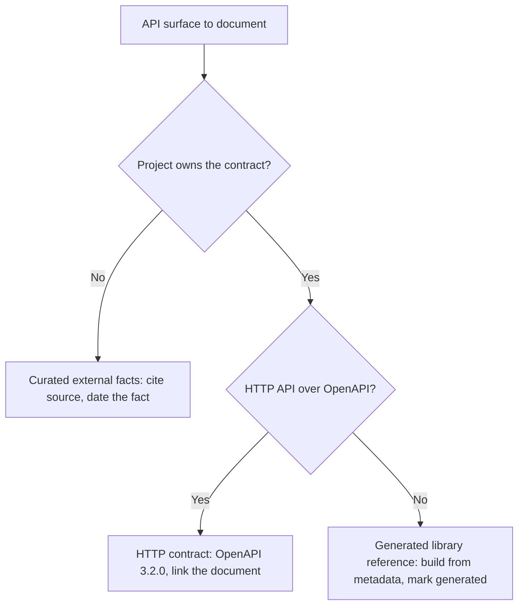

# [API_DOCUMENTATION]

API documentation is contract-backed reference: the machine-readable contract or generated symbol model is the source of truth, and prose links to it instead of duplicating it. This standard sorts an API surface into one of three profiles — owned HTTP contract, generated library reference, or curated external API facts — and sets the required structure, required content, cardinality, and evidence for each. Pick the profile first, because the source of truth and the proof obligation differ per profile.

## [1][USE_WHEN]

Apply this standard to an API surface that callers, generated clients, or agents consume:

- HTTP API contracts and OpenAPI descriptions the project owns;
- generated library reference built from source metadata and documentation comments;
- public symbol surfaces derived from assemblies or language metadata;
- curated external API, SDK, protocol, or vendor facts the project does not generate.

Route public symbol comment style alone, curated lookup facts that are not API contracts, and learning paths through API use to their owning standards by topic; the Boundaries section links each owner once.

## [2][SURFACE_PROFILES]

Classify the surface before writing, because the source of truth, the required sections, and the proof obligation all branch on the profile. One page documents one profile; a surface that spans two profiles splits into two pages that link at their boundary. Keep profile facts together and link generated artifacts rather than transcribing their bodies.

| [INDEX] | [PROFILE]                   | [SOURCE_TRUTH]         | [OWNS_CONTRACT] | [PRIMARY_PROOF]            |
| :-----: | :-------------------------- | :--------------------- | :-------------: | :------------------------- |
|   [1]   | HTTP contract               | maintained OpenAPI     |       Yes       | OpenAPI + contract tests   |
|   [2]   | Generated library reference | source or metadata     |       Yes       | generated output + command |
|   [3]   | Curated external facts      | official upstream docs |       No        | primary source + date      |

The HTTP-contract and generated-library profiles own a contract and must link the generated artifact rather than transcribe it. The curated-external profile never claims ownership over behavior it does not generate; it cites the upstream source and dates the fact.

## [3][CONTRACT_PRECEDENCE]

Resolve any conflict between profiles or between a contract and its prose by the source closest to the executing system:

1. Owned machine-readable contracts, generated reference output, and contract tests.
2. Source metadata, assemblies, XML documentation comments, and generator configuration.
3. Official specifications, standards, and vendor reference docs for external APIs.
4. Curated prose that explains examples, migration, policy, or design intent.

Curated prose must not fork a generated contract, a generated reference model, or an official external API source. When prose disagrees with the generated artifact, the artifact controls and the prose is corrected or deleted.

## [4][REQUIRED_STRUCTURE]

A conforming API page uses these H2 sections, in this order, for the page's profile. The template below is the starting point; the cardinality list states what is mandatory, what is optional, and what branches on the profile or on a documented feature. The structure keeps authentication, errors, versioning, evidence, boundaries, and review checks explicit.

```markdown template
# [API_SURFACE]

<One-sentence scope and the declared profile.>

## [1][PROFILE_SOURCE_TRUTH]

## [2][AUTHENTICATION_AUTHORIZATION]

## [3][CONVENTIONS]

## [4][OPERATIONS]

## [5][SCHEMAS]

## [6][ERRORS]

## [7][ASYNC_OPERATIONS]

## [8][VERSIONING_DEPRECATION]

## [9][EXAMPLES]

## [10][EVIDENCE]

## [11][BOUNDARIES]

## [12][REVIEW_CHECKLIST]

```

This is the section template for a new API page.

Section cardinality:

- `Profile and source of truth`: required, single; names the profile and the one source-of-truth artifact path.
- `Authentication and authorization`: required for HTTP-contract and curated-external profiles; optional for a generated-library page that exposes no auth surface.
- `Conventions`: required when the API paginates, filters, sorts, expands fields, enforces idempotency, or rate-limits; holds the API mechanics below.
- `Operations`: required, repeatable; links the generated contract and never transcribes its endpoint table.
- `Schemas`: required per operation that carries a request or response body; link the generated schema.
- `Errors`: required, single, for the HTTP-contract and curated-external profiles; carries the error model below.
- `Async operations`: required when any operation is long-running; omit the section entirely otherwise.
- `Versioning and deprecation`: required, single, or a one-line route to the owning support matrix.
- `Examples`: optional; present only beside a misuse-prone fact.
- `Evidence`: required when any documented fact can drift; single page-level block when one source and one trigger cover the page, otherwise attached per claim.
- `Boundaries`: required, single, one link per adjacent owner.
- `Review checklist`: required, single, and closes the page with the gates that prove the reference stayed contract-backed.

A generated-library page substitutes a per-symbol structure for `Operations`, `Schemas`, and `Errors`: each public type or member is the record, carrying the aspects listed under generated library reference requirements. It keeps `Profile and source of truth`, `Versioning and deprecation`, `Evidence`, `Boundaries`, and `Review checklist`.

## [5][VOLATILE_METADATA]

Surface the freshness handle in an opening metadata block when an indexer, retrieval store, or refresh workflow reads it, not as decoration. A curated-external page or a generated-library page carries the field that lets a refresh agent locate the staleness trigger and the source without parsing prose:

- `Last verified: YYYY-MM-DD` — required on a curated-external page; the date the external facts were last checked against upstream.
- `Review trigger:` — required on a curated-external page; the upstream event that makes the page stale, such as a vendor API version increment.
- `Generated from:` — required on a generated-library page that mirrors a generator; the source model, contract, or generation command.

Use the proof label casing unless a named machine consumer requires a different field shape, and map any machine field to its human-facing proof label so the fact reads the same in metadata and in the `Evidence` section.

## [6][AUTHENTICATION_AUTHORIZATION]

The `Authentication and authorization` H2 owns the auth surface for HTTP-contract and curated-external profiles; the API-mechanics section references it rather than restating it. Name the scheme concretely — bearer token, OAuth2 flow, API key, or mTLS — the scope or permission each non-public operation requires, and whether HTTPS is mandatory. State the scope per operation, not "auth required" in the abstract.

```markdown conceptual
## [1][AUTHENTICATION_AUTHORIZATION]

Scheme: OAuth2 client-credentials bearer token; HTTPS mandatory on every endpoint.
Token endpoint: `POST /oauth/token`, scopes minted per the catalog below.

| [INDEX] | [OPERATION]         | [REQUIRED_SCOPE] |
| :-----: | :------------------ | :--------------- |
|   [1]   | `POST /jobs`        | `jobs:write`     |
|   [2]   | `GET /jobs/{id}`    | `jobs:read`      |
|   [3]   | `DELETE /jobs/{id}` | `jobs:write`     |

Unauthenticated or under-scoped requests return `401` (missing or invalid token)
or `403` (valid token, insufficient scope).
```

## [7][HTTP_CONTRACT_REQUIREMENTS]

Use OpenAPI 3.2.0 for a new HTTP API contract unless a named consumer toolchain requires an older supported OpenAPI line, in which case record the consumer and its minimum version beside the `openapi` field. The 3.2.0 line is the current release; carry its freshness so the pin does not silently rot.

`Evidence:` OpenAPI Specification 3.2.0, `spec.openapis.org/oas/v3.2.0.html`. `Last verified:` 2026-06-04. `Review trigger:` OpenAPI publishes a 3.3 or later line.

Required contract content (each entry is required unless marked):

- `openapi` version and `info.title` plus `info.version` — required, one each.
- `operationId` — required, one stable value per operation, unique across the document.
- `servers` — required when the base URL is not derivable from the document host; repeatable per environment.
- `paths` and operations — required, repeatable; name the HTTP method per operation, including the 3.2 `query` method or `additionalOperations` where the operation uses a non-standard verb.
- `tags` — optional, repeatable; organize operations without replacing resource names.
- Request and response schemas, parameters, and request bodies — required per operation that carries them.
- Response status codes, media types, and error response schemas — required, at least one success status and one error status per operation.
- Security schemes and per-operation authorization requirements — required when any operation is non-public; repeatable.
- Examples for parameters, request bodies, responses, and errors whose shape is not derivable from the schema — required where derivation fails, repeatable.
- Versioning, lifecycle, and deprecation policy — required, one statement per contract.

When agents, generated clients, or automation consume the contract, descriptions carry caller-safe semantics so the consumer does not infer behavior from names alone:

- Operation descriptions state preconditions, authorization constraints, valid state transitions, idempotency, and the conditions under which to skip the operation.
- Parameter and request-body descriptions state units, ranges, defaults, mutually exclusive fields, required combinations, and unsafe values.
- Schema descriptions state invariants, lifecycle meaning, null-or-absent semantics, and generated-field behavior.
- Error descriptions state the failure cause, retry-or-abort guidance, and whether the caller can repair the request.

The following fragment shows the caller-safe shape an operation description carries; it is illustrative structure, not a runnable contract.

```yaml conceptual
paths:
  /jobs/{jobId}/cancel:
    post:
      operationId: cancelJob
      description: >
        Cancel a queued or running job. Precondition: job state is `queued` or
        `running`; a `completed` or `failed` job returns 409. Idempotent: a
        second call on an already-cancelled job returns 200. Authorization:
        caller holds `jobs:write` on the owning project.
      responses:
        "200": { description: Cancelled or already cancelled. }
        "409": { description: Terminal state; do not retry. Repairable: no. }
```

## [8][API_MECHANICS]

Document the cross-cutting concerns every professional HTTP API reference carries, because an agent infers retry, paging, and async behavior from these and not from operation names. This section applies to the HTTP-contract and curated-external profiles. The pagination, filtering, sorting, idempotency, and rate-limit mechanics live under `Conventions`; authentication and authorization live in the dedicated `Authentication and authorization` H2 that this section references rather than duplicates. Document each concern the API actually uses; omit a concern the API does not implement rather than asserting a default.

- Pagination: name the model and its exact parameters and envelope — cursor (`limit`, `starting_after`, `ending_before`), page-token (`page_size`, `page_token` in; `next_page_token` out), or `nextLink` — the top-level array field name, and the last-page signal.
- Filtering, sorting, and field expansion: name the parameters where the API supports them and state the evaluation order, which is `filter` then `sort` then `page` when all three apply.
- Idempotency: state which operations are idempotent by method, whether an idempotency-key header is required or optional, and the dedup window when one exists.
- Rate limiting: name the limit headers and the `429` retry signal, including `Retry-After`, where the API enforces limits.
- Async and long-running operations: document them in the `Async operations` section using the long-running-operation record below.

A single long-running-operation surface is one record read by field, so carry it as a definition block rather than a one-row table:

```text conceptual
Start: POST /exports returns 202 Accepted + Operation-Location header
Monitor: GET /operations/{id}; status ∈ NotStarted | Running | Succeeded | Failed | Canceled
Poll: client polls Operation-Location until a terminal status
Cancel: DELETE /operations/{id}; idempotent; returns 202 when accepted
Result: GET the resource named in the succeeded status monitor
Evidence: ../../api/openapi.yaml#/paths/~1exports
Last verified: 2026-06-04
```

## [9][ERROR_MODEL]

Document the error contract as structured content, because the error surface is the one an agent dispatches on most — retry, abort, or repair. The `Errors` section carries three required parts for the HTTP-contract and curated-external profiles:

- Status-code-to-meaning mapping: every status the API returns, including non-obvious codes such as `402` valid-but-declined and `409` terminal-state, mapped to its meaning for the caller.
- Machine-readable error body: the documented body shape — RFC 9457 `application/problem+json` members `type`, `title`, `status`, `detail`, `instance`, or a named typed envelope — so a client parses one shape across operations.
- Error catalog: one row per failure an agent dispatches on, naming the error type or code, its cause, whether the caller can repair the request, and the retry-or-abort guidance.

`Evidence:` RFC 9457 Problem Details for HTTP APIs, `rfc-editor.org/rfc/rfc9457.html`. `Last verified:` 2026-06-04.

The error catalog is a lookup table keyed by status and code; keep it within the table ceilings and split by status class when it exceeds them. The rows below are illustrative shape, not contract data; replace them with owner-verified rows in a real API document.

| [INDEX] | [HTTP] | [CODE]            | [CAUSE]         | [REPAIR] | [GUIDANCE]                |
| :-----: | -----: | :---------------- | :-------------- | :------- | :------------------------ |
|   [1]   |    402 | card_declined     | issuer declined | yes      | inspect `decline_code`    |
|   [2]   |    409 | resource_conflict | terminal state  | no       | do not retry              |
|   [3]   |    429 | rate_limited      | quota exceeded  | n/a      | retry after `Retry-After` |

## [10][GENERATED_LIBRARY_REFERENCE]

Generate library reference from source, assemblies, side-by-side XML documentation files, or equivalent language metadata; never hand-author a symbol table that forks the generated output. Mark the page or its sections `generated` and name the generation command, because a hand-edit to a generated mirror is a defect, not an update.

Public visible types and members document the following (each entry is required when the symbol carries that aspect):

- Purpose — required, one statement per public symbol.
- Type parameters — required per generic parameter.
- Parameter meaning, units, or caller obligations — required per parameter.
- Return values, effects, or typed failure channels — required, one per member.
- Property values — optional; document when the value carries a constraint a caller must respect.
- Domain constraints or examples — required where misuse is likely; optional otherwise.
- Thrown exceptions — required for each exception the member actually throws; do not list exceptions the member cannot raise.
- Cross-references — optional; include only when the target resolves.
- Inherited contract text — optional; carry it only when the inherited wording stays accurate for the deriving member.

A member that returns a typed result, an effect, a validation value, or a status object documents both the success and the failure channel through that return type, and does not imply a thrown exception the type does not raise.

## [11][CURATED_EXTERNAL_FACTS]

Use the curated-external profile when the project documents an API, SDK, protocol, or vendor surface it does not generate. Each curated fact carries proof that an agent can refresh, because the upstream source drifts independently of this repository.

- Cite the official specification, vendor docs, local generated metadata, or checked-in contract that proves the fact.
- Record the version or retrieval date for any fact that the vendor can change.
- Separate stable lookup facts from examples and migration notes so a reader refreshes the volatile fact without rereading prose.
- Link to the generated or official reference instead of copying a catalog.
- State the upstream owner and avoid claiming contract ownership over external behavior.

A single external endpoint is one record read by field; carry it as a definition block with the evidence and freshness fields beside the fact, not in a page-footer source dump:

```text conceptual
Endpoint: POST https://api.vendor.example/v2/tokens
Auth: Bearer service token, scope `tokens:mint`
Idempotency-Key: required header; vendor dedupes for 24 h
Owner: vendor.example platform team
Evidence: https://docs.vendor.example/v2/tokens
Last verified: 2026-06-04
Review trigger: vendor API version increments past v2
```

## [12][VERSIONING_DEPRECATION]

State versioning and deprecation as one explicit statement per contract, or route to the support matrix that owns the lifecycle dates. A reader must be able to tell from a conforming page whether an operation is deprecated and what replaces it. The statement names:

- the versioning scheme — date-based, semantic version, or header-negotiated;
- the deprecation signal emitted at use, such as a `Deprecation` or `Sunset` header or a response field;
- the removal window from deprecation to retirement;
- the replacement surface a caller migrates to.

Route the lifecycle dates and the broad support status to the support matrix rather than restating them; this section names the scheme and signal, and the support matrix owns when each version ends.

## [13][PROFILE_SELECTION_FLOW]

Choose the profile by ownership and generation, then apply that profile's required sections. The branch below renders the controlling decision so a reader sees the whole choice in one view.



## [14][NARRATIVE_BOUNDARY]

Narrative pages may explain authentication, versioning, examples, lifecycle, and operational constraints around an API. A narrative page links to the contract and does not duplicate the endpoint table, the schema, or the symbol list; the generated artifact stays the single source those pages point to.

## [15][EXAMPLES]

Misuse concentrates in three places: transcribing a generated contract into prose, asserting an exception a member cannot raise, and leaving the error surface as unstructured prose. The following pairs show the accepted shape against the rejected one.

A reference page points to the generated contract rather than copying it:

```markdown rejected
## [1][ENDPOINTS]

| [INDEX] | [METHOD] | [PATH]     | [AUTH] |
| :-----: | :------- | :--------- | :----- |
|   [1]   | POST     | /jobs      | bearer |
|   [2]   | GET      | /jobs/{id} | bearer |
```

```markdown template
## [1][ENDPOINTS]

The job API is defined by `<generated-openapi-path>`.
Regenerate it with `<contract-generation-command>`; do not edit the table by hand.
```

A member documents only the exceptions it raises:

```csharp rejected
/// <summary>Parse the token.</summary>
/// <exception cref="FormatException">When malformed.</exception>
/// <exception cref="ArgumentNullException">Never thrown; parser tolerates null.</exception>
public static Result<Token> Parse(string? raw);
```

```csharp conceptual
/// <summary>Parse the token. Returns a failure result on malformed input;
/// does not throw for null or malformed values.</summary>
/// <returns>Success carrying the token, or a typed parse failure.</returns>
public static Result<Token> Parse(string? raw);
```

The error surface is a catalog an agent dispatches on, not a paragraph:

```markdown rejected
## [1][ERRORS]

The API may return various errors. A 4xx means the request was bad and a 5xx
means the server failed. Retry when appropriate.
```

```markdown template
## [1][ERRORS]

Body shape: RFC 9457 `application/problem+json` (`type`, `title`, `status`, `detail`, `instance`).

| [INDEX] | [HTTP_STATUS] | [CODE]            | [CAUSE]        | [REPAIRABLE] | [GUIDANCE]                |
| :-----: | ------------: | :---------------- | :------------- | :----------- | :------------------------ |
|   [1]   |           409 | resource_conflict | terminal state | no           | do not retry              |
|   [2]   |           429 | rate_limited      | quota exceeded | n/a          | retry after `Retry-After` |
```

## [16][BOUNDARIES]

- [code-documentation.md](code-documentation.md) owns source-level public symbol comment style that the generated library reference consumes.
- [reference.md](reference.md) owns curated lookup facts that are not API contracts.
- [support-matrix.md](support-matrix.md) owns supported version, platform, and runtime statements and lifecycle dates that an API page cites rather than restates.
- [how-to.md](../task/how-to.md) owns the procedures that call an API.
- [tutorial.md](../learning/tutorial.md) owns learning paths through API use.
- [README.md](../README.md) owns document-type routing, placement, and lifecycle decisions for an API page.

## [17][REVIEW_CHECKLIST]

- [ ] The page declares one profile: HTTP contract, generated library reference, or curated external facts.
- [ ] The page carries the required H2 sections for its profile in the prescribed order.
- [ ] Curated-external and generated-library pages carry the prescribed metadata freshness fields.
- [ ] HTTP contracts use OpenAPI 3.2.0, or name the consumer toolchain that pins an older line, and the version pin carries a freshness trigger.
- [ ] HTTP contracts carry every required field with its stated cardinality: paths, operations, schemas, security, errors, examples, and lifecycle policy.
- [ ] Authentication, pagination, idempotency, rate limits, and filtering or sorting are documented wherever the API uses them, with concrete schemes and parameters.
- [ ] The `Errors` section carries a status-code mapping, a machine-readable error-body shape, and an error catalog with cause, repairability, and retry guidance.
- [ ] Async or long-running operations document the start, status-monitor enumeration, poll, and cancel behavior where the API has them.
- [ ] Versioning and deprecation state the scheme, the deprecation signal, the removal window, and the replacement, or route to the support matrix.
- [ ] Agent- or client-consumed descriptions state preconditions, state transitions, authorization constraints, repairability, and skip conditions.
- [ ] Generated contracts and reference output are linked, not transcribed.
- [ ] Generated library pages are marked `generated` and name the generation command.
- [ ] Library symbols document success, failure, and effect channels without claiming an exception the member cannot raise.
- [ ] Curated external facts cite a primary source, date the drift-prone fact, name the upstream owner, and avoid ownership claims.
- [ ] Each code block carries an intent label.
