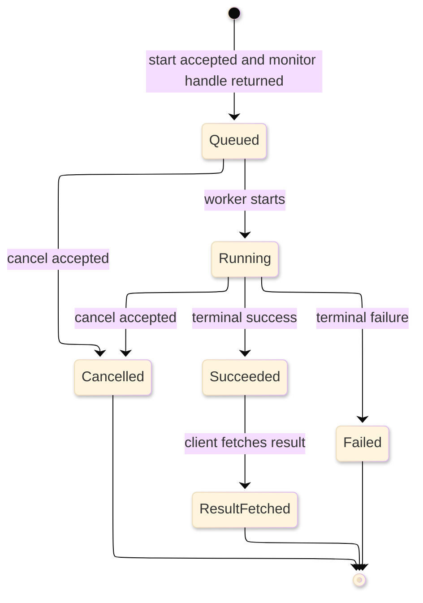

# [API_DOCUMENTATION]

API documentation is contract-backed reference for a callable surface. It names the source of truth, states what caller-facing facts prose may curate, and links generated or upstream artifacts instead of copying their catalogs. Pick one profile first, because an owned OpenAPI contract, a generated library reference, an external HTTP API fact sheet, and an external SDK or protocol fact sheet carry different structure and proof obligations.

## [1][USE_WHEN]

Apply this standard to an API surface that callers, generated clients, or agents consume:

- HTTP API contracts and OpenAPI descriptions the project owns;
- generated library reference built from source, metadata, assemblies, or source documentation;
- public symbol surfaces derived from generated reference output;
- curated external HTTP API facts the project does not generate;
- curated external SDK, protocol, or vendor API facts that are not HTTP endpoint catalogs.

Route source-level public symbol comment style to [code-documentation.md](code-documentation.md). Route lookup facts that are not callable API surfaces to [reference.md](reference.md), support status to [support-matrix.md](support-matrix.md), API procedures to [how-to.md](../task/how-to.md), and learning paths to [tutorial.md](../learning/tutorial.md).

## [2][CONTRACT_BASELINES]

API prose ranks below the contract or upstream source it describes. Resolve conflicts in this order:

1. Owned machine-readable contracts, generated reference output, contract tests, and generated clients.
2. Source metadata, assemblies, XML documentation comments, generator configuration, and source code.
3. Official specifications, standards, and vendor reference documentation.
4. Curated prose that explains local policy, examples, migration, or caller risk.

Curated prose must not fork a generated contract, generated reference model, or official external API source. If prose and the contract disagree, the contract controls and the prose is corrected or deleted.

OpenAPI contract baseline
    Source of truth: [OpenAPI Specification v3.2.0](https://spec.openapis.org/oas/v3.2.0.html).
    Last verified: 2026-06-04
    Review trigger: OpenAPI publishes a later stable line or a consuming toolchain pins another line.

Problem Details baseline
    Source of truth: [RFC 9457 Problem Details for HTTP APIs](https://www.rfc-editor.org/rfc/rfc9457.html).
    Last verified: 2026-06-04
    Review trigger: HTTP API error-format policy or RFC status changes.

HTTP deprecation signals
    Source of truth: [RFC 9745](https://www.rfc-editor.org/rfc/rfc9745) for `Deprecation` and [RFC 8594](https://www.rfc-editor.org/rfc/rfc8594.html) for `Sunset`.
    Last verified: 2026-06-04
    Review trigger: IETF deprecation or sunset header guidance changes.

## [3][PROFILES]

Choose one primary profile per page. Split the page when a second profile would force a different source of truth or required structure.

| [INDEX] | [PROFILE]                   | [SOURCE]      | [OWNER] | [PROOF]                     |
| :-----: | :-------------------------- | :------------ | :----: | :-------------------------- |
|   [1]   | Owned HTTP contract         | OpenAPI       |  yes   | generated contract + tests  |
|   [2]   | Generated library reference | source/meta   |  yes   | generated output + command  |
|   [3]   | External HTTP API facts     | upstream docs |   no   | primary source + freshness  |
|   [4]   | External SDK/protocol facts | upstream docs |   no   | primary source + freshness  |

Owned and generated profiles link the generated artifact and name the generation command. External profiles cite upstream proof beside each drift-prone fact and never imply local ownership of upstream behavior.

Use an API surface card when a page must anchor generated contracts, caller documentation, support policy, and task or learning paths without copying any of them:

```text template
Surface: `<callable surface name>`
Profile: Owned HTTP contract | Generated library reference | External HTTP API facts | External SDK or protocol facts
Source of truth: `<generated contract, generated reference, official upstream source, or metadata path>`
Why linked: `<one sentence naming the caller decision this link changes>`
Review trigger: `<contract, generator, upstream API, support, or caller-doc change>`
Generated from: `<generation command; omit when not generated>`
Consumer/toolchain: `<client, renderer, validator, or SDK version constraint; omit when not constrained>`
Routes: `<README, how-to, tutorial, support matrix, or other adjacent owner; omit untriggered routes>`
```

The card is optional. Add it only when two or more adjacent owner links change how a caller or agent uses the API page; otherwise keep the boundary links in `Boundaries`. A surface card links contract owners and adjacent docs; it never lists operations, symbols, or endpoint rows.

## [4][REQUIRED_STRUCTURE]

Use one profile record to choose the body, then publish only the headings that the profile triggers. The profile record is the contract; do not copy an empty full skeleton and leave optional headings behind.

- Owned HTTP contract: required `Contract source`, `Operations`, `Boundaries`, and `Review checklist`; conditional `Authorization`, `Conventions`, `Schemas`, `Errors`, `Async`, `Versioning`, `Examples`, and `Evidence`; omit `Symbols` and external `Facts`; prove with generated OpenAPI, contract tests, generated clients, and generation command.
- Generated library reference: required `Contract source`, `Generation`, `Symbols`, `Boundaries`, and `Review checklist`; conditional `Versioning`, `Examples`, and `Evidence`; omit HTTP-only sections; prove with generated output plus source, metadata, assembly, XML, TSDoc, docstring, or generator input.
- External HTTP API facts: required `Contract source`, `Facts`, `Boundaries`, and `Review checklist`; conditional `Authorization`, `Conventions`, `Errors`, `Versioning`, and `Examples`; omit owned `Operations`, generated `Schemas`, `Generation`, and `Symbols`; prove each drift-prone fact beside official upstream API, specification, version, or lifecycle truth.
- External SDK or protocol facts: required `Contract source`, `Facts`, `Boundaries`, and `Review checklist`; conditional `Versioning` and `Examples`; omit HTTP-only sections unless the SDK or protocol exposes an HTTP contract; prove each drift-prone fact beside official upstream SDK, protocol, vendor reference, or checked-in generated metadata.

Minimal skeleton:

```markdown template
# [API_SURFACE]

<Scope: one sentence naming the surface, profile, and controlling source.>

## [1][CONTRACT]

## [2][<PROFILE_BODY>]

## [N][BOUNDARIES]

## [N][REVIEW_CHECKLIST]
```

Section cardinality:

**Universal**
- Opening scope: required, single.
- `Contract source`: required, single; names the generated artifact, source model, or official upstream source.
- `Boundaries`: required, single.
- `Review checklist`: required, single.

**Profile body**
- `Operations`: required for owned HTTP contracts; link generated operations and do not transcribe the endpoint catalog.
- `Symbols`: required for generated-library reference; one record per public symbol family or link to generated output when the generator owns the catalog.
- `Facts`: required for external profiles; one or more curated fact groups.
- `Generation`: required for generated-library reference; omit otherwise.

**Conditional sections**
- `Authorization`: include only for HTTP surfaces with non-public operations.
- `Conventions`: include only for HTTP surfaces that implement pagination, filtering, sorting, expansion, rate limiting, idempotency keys, or long-running operations.
- `Schemas`: include only for operations with request or response bodies.
- `Errors`: include only for HTTP surfaces with an error contract.
- `Async`: include only when an operation is long-running.
- `Versioning`: include for contract lifecycle, deprecation, SDK version, or upstream API version facts; route support dates to [support-matrix.md](support-matrix.md) when support policy is the subject.
- `Examples`: include only beside a misuse-prone fact.
- `Evidence`: use page-level evidence only when one source and one trigger cover the page; otherwise proof stays beside each drift-prone fact.

## [5][HTTP_CONTRACTS]

Use OpenAPI 3.2.0 for a new owned HTTP API contract unless a named consumer toolchain requires an older supported OpenAPI line. When a consumer pins another line, record the consumer, its minimum supported version, and the freshness trigger beside the `openapi` field.

An owned HTTP contract carries these caller-safe facts in the generated contract, not as a hand-written parallel catalog:

- `openapi`, `info.title`, and `info.version`;
- stable, unique `operationId` values;
- `servers` when the base URL is not derivable from the document host;
- `paths`, HTTP methods, and operations, including the OpenAPI 3.2 Path Item Object's `query` method or `additionalOperations` only where the operation truly uses that extension;
- request and response schemas, parameters, request bodies, status codes, media types, and error response schemas;
- security schemes and per-operation authorization requirements for non-public operations;
- examples where schema alone cannot teach the shape;
- versioning, lifecycle, and deprecation policy.

Operation descriptions state preconditions, authorization constraints, valid state transitions, idempotency, and skip conditions. Parameter and schema descriptions state units, ranges, defaults, mutually exclusive fields, required combinations, null-or-absent semantics, generated-field behavior, and unsafe values. Error descriptions state cause, repairability, and retry-or-abort guidance.

Link generated operations with proof fields beside the operations section:

```markdown template
## [N][OPERATIONS]

Source of truth: `<generated-openapi-path>`.
Generated from: `<contract-generation-command>`.
Consumer/toolchain: `<validator, client generator, or docs renderer version constraint; omit when unconstrained>`.
Review trigger: OpenAPI source model, generator, or consumer toolchain changes.

Do not hand-copy the endpoint table. Link the generated operation group that owns each callable surface.
```

The rejected table below creates a second endpoint catalog that can drift away from the generated contract:

```markdown rejected
## [N][OPERATIONS]

| [INDEX] | [METHOD] | [PATH]     | [AUTH] |
| :-----: | :------- | :--------- | :----- |
|   [1]   | POST     | /jobs      | bearer |
|   [2]   | GET      | /jobs/{id} | bearer |
```

```yaml conceptual
paths:
  /jobs/{jobId}/cancel:
    post:
      operationId: cancelJob
      description: >
        Cancel a queued or running job. Precondition: job state is `queued` or
        `running`; a `completed` or `failed` job returns 409. Idempotent: a
        second call on an already-cancelled job returns 200. Authorization:
        caller holds `jobs:write` on the owning project.
      responses:
        "200":
          description: >
            Cancelled or already cancelled.
        "409":
          description: >
            Terminal state; do not retry. Repairable: no.
```

The fragment is conceptual: it teaches caller-safe description content and does not replace the generated OpenAPI document.

## [6][HTTP_MECHANICS]

Document only the HTTP mechanics the API actually implements. Do not import provider field names, ordering rules, or retry policies unless the contract proves them.

- Authorization: name the scheme, transport requirement, scope or permission per non-public operation, and the response for missing, invalid, or insufficient credentials.
- Pagination: name the API's actual model and fields. Cursor, page-token, offset-limit, and `nextLink` are illustrative patterns, not required vocabulary.
- Filtering, sorting, and expansion: name actual parameters and evaluation order only when the contract states the order.
- Idempotency: state which operations are idempotent by method or contract. Treat an `Idempotency-Key` header as provider-specific or provisional unless the owned contract or current upstream standard proves it.
- Rate limiting: name the limit headers and the `429` retry signal, including `Retry-After`, only where the API enforces them.
- Long-running operations: use an `Async` section with the record shape below.

```text template
Start: `<method> <path>` returns `<start-status>` plus `<contract-owned monitor handle, header, or field>`.
Monitor: `<method> <monitor-path>` returns `<contract-owned status enum>`.
Poll: client follows `<contract-owned monitor handle, header, or field>` until `<terminal statuses>`.
Cancel: `<method> <cancel-path>` is idempotent only where the contract states it.
Result: client fetches the resource named by the terminal success response.
Evidence: `<generated-contract-path>#<operation-anchor>`
Review trigger: OpenAPI generation output changes.
```

Use a lifecycle diagram only when an async or stateful API has enough transitions that a record alone hides caller obligations. The diagram below is conceptual; keep the async record as the text source of truth and place a text equivalent after every real diagram.



Text equivalent: the start operation returns a monitor handle, the client polls until `Succeeded`, `Failed`, or `Cancelled`, cancellation is valid only in contract-owned cancellable states, and the result is fetched only after `Succeeded`.

## [7][ERRORS]

Document the error contract as structured content because the error surface is what a caller dispatches on. For an HTTP API, `Errors` carries:

- status-code-to-meaning mapping for every status the API returns;
- machine-readable error body shape, such as RFC 9457 `application/problem+json` members `type`, `title`, `status`, `detail`, and `instance`, or a named typed envelope;
- error catalog keyed by the problem `type` URI or documented local error code a caller dispatches on, with cause, repairability, and retry-or-abort guidance.

For RFC 9457 bodies, `type` is the primary problem identifier. Use HTTP status for the transport class, treat the optional `status` member as advisory when it appears in the body, and never require callers to parse `detail` as machine-readable data.

The catalog is a lookup table when rows are homogeneous and short-celled. Split by status class when it exceeds table limits, and move row-specific qualifications to notes.

| [INDEX] | [HTTP] | [TYPE_OR_CODE]      | [CAUSE]         | [REPAIRABLE] | [GUIDANCE]                 |
| :-----: | :----- | :------------------ | :-------------- | :----------: | :------------------------- |
|   [1]   | 409    | `resource_conflict` | terminal state  |      no      | do not retry               |
|   [2]   | 429    | `rate_limited`      | quota exceeded  |     n/a      | honor `Retry-After`        |
|   [3]   | 503    | `service_unready`   | dependency down |      no      | retry with bounded backoff |

The table is conceptual shape. Replace every row with owner-verified error data in a real API page.

## [8][GENERATED_LIBRARY_REFERENCE]

Generate library reference from source, assemblies, side-by-side XML documentation, TSDoc, Python docstrings, or equivalent language metadata. Mark generated pages or sections as generated and name the generation command. A hand edit to a generated mirror is a defect; edit the source comment or generator input instead.

Use a generation record before symbol groups so an agent can refresh the page without guessing the generator:

```text template
Generated reference: `<output path or URL>`
Generated from: `<source path, assembly, metadata file, or documentation comments>`
Generation command: `<exact command, or proof gap when no command exists>`
Source comments: `<source-comment owner; omit when no source comments feed generation>`
Proof gap: `<human-reviewed match when no generator gate exists; omit when no gap exists>`
Review trigger: generator, source metadata, assembly, or public symbol change.
```

Public visible types and members document the following when the symbol carries that aspect:

- purpose, one statement per public symbol;
- type parameters, one per generic parameter;
- parameter meaning, units, or caller obligations;
- return values, effects, typed failure channels, or observable side effects;
- property value meaning when the value carries a caller constraint;
- domain constraints or examples where misuse is likely;
- thrown exceptions only where the member actually throws;
- cross-references only when the target resolves;
- inherited contract text only when the inherited wording remains accurate.

A member that returns a typed result, an effect, a validation value, or a status object documents success and failure through that return type. It must not imply a thrown exception that the type does not raise.

## [9][EXTERNAL_FACTS]

Use an external profile when the project curates facts about an API, SDK, protocol, or vendor surface it does not generate. Each fact carries proof the next maintainer can refresh.

- Cite the official specification, vendor docs, local generated metadata, or checked-in contract that proves the fact.
- Record the upstream version or retrieval date for facts the upstream can change.
- Separate stable lookup facts from examples and migration notes.
- Link to official or generated reference instead of copying a catalog.
- Name the upstream owner and avoid claiming contract ownership over external behavior.

External HTTP API facts may include authorization, mechanics, errors, and deprecation signals when upstream documents them. External SDK or protocol facts use fact groups instead of HTTP sections unless the SDK or protocol itself exposes an HTTP contract.

```text conceptual
Endpoint: `POST https://api.vendor.example/v2/tokens`
Auth: bearer service token with `tokens:mint`.
Idempotency: `Idempotency-Key` is required by this vendor for this endpoint.
Owner: vendor platform team.
Evidence: `<official vendor API reference URL>`.
Last verified: 2026-06-04
Review trigger: vendor API version increments past `v2`.
```

## [10][VERSIONING]

State versioning and deprecation as one explicit statement per contract, or route support dates to the support matrix. A conforming API page distinguishes:

- versioning scheme, such as date-based, semantic version, path version, or header-negotiated;
- deprecation notice, such as a `Deprecation` header or documented response field;
- sunset timestamp or retirement signal, such as a `Sunset` header where the API emits one;
- migration link or replacement surface;
- lifecycle dates and support entitlement, which belong in [support-matrix.md](support-matrix.md) when support policy is the subject.

RFC 9745 `Deprecation` communicates that the resource or feature is deprecated; it does not by itself change response behavior. RFC 8594 `Sunset` communicates a resource availability expectation or hint from the server; it is not a support guarantee unless a separate support policy says so.

Do not collapse deprecation, sunset, end of support, and removal into one status. Each answers a different caller question.

## [11][BOUNDARIES]

- [code-documentation.md](code-documentation.md) owns source-level public symbol comments that generated library reference consumes.
- [reference.md](reference.md) owns curated lookup facts that are not callable API contracts.
- [support-matrix.md](support-matrix.md) owns supported versions, compatibility bounds, lifecycle dates, and deprecation policy when support is the policy.
- [how-to.md](../task/how-to.md) owns procedures that call an API.
- [tutorial.md](../learning/tutorial.md) owns learning paths through API use.
- [README.md](../README.md) owns document-type routing, placement, and lifecycle decisions.

## [12][REVIEW_CHECKLIST]

- [ ] The page declares exactly one profile and uses that profile's structure.
- [ ] Generated contracts and generated reference output are linked, not transcribed.
- [ ] API surface cards appear only when adjacent owner links change caller or agent behavior.
- [ ] External facts cite primary upstream sources and carry freshness fields beside drift-prone claims.
- [ ] HTTP-only sections appear only for HTTP surfaces that actually expose the concern.
- [ ] OpenAPI pages use OpenAPI 3.2.0 or name the consumer/toolchain that pins another line.
- [ ] Authorization, pagination, idempotency, rate limits, filtering, sorting, and async behavior name actual contract fields rather than imported provider examples.
- [ ] Async diagrams appear only for stateful or long-running APIs and have a text equivalent plus contract evidence.
- [ ] Error documentation carries status mapping, body shape, and repairability or retry guidance.
- [ ] Versioning distinguishes deprecation notice, sunset or removal signal, migration target, and support lifecycle dates.
- [ ] Generated library references mark generated content and name the generation source.
- [ ] Library symbols document success, failure, effects, and real thrown exceptions without phantom throws.
- [ ] Every ordinary fenced block carries an intent label.
- [ ] Boundaries route adjacent concerns once and every relative link resolves.
