# [SUPPORT_MATRIX_STANDARDS]

A support matrix is policy-backed reference: it states which runtime, platform, version, feature, integration, or combination is supported now, what that status grants, what bounds qualify it, and what evidence refreshes it. It is not a roadmap, release note, migration guide, or recovery procedure. It answers "is this supported, under which conditions, and until when" in one scan.

## [1][USE_WHEN]

Use a support matrix when a reader compares support facts across rows:

- product, runtime, platform, host, toolchain, browser, device, or deployment support;
- component compatibility, version skew, dependency floors, and supported combinations;
- feature availability by plan, edition, runtime, API version, region, or integration;
- deprecation, removal, retirement, or migration status of a named surface.

Route future support intent to [roadmap.md](../explanation/roadmap.md), step-by-step migration to [how-to.md](../task/how-to.md), operational recovery to [runbook.md](../task/runbook.md), and ordinary lookup facts to [reference.md](reference.md).

## [2][LIFECYCLE_BASELINES]

Map imported lifecycle or compatibility concepts to their source instead of flattening them into local vocabulary.

endoflife.date lifecycle fields
    Source of truth: [endoflife.date API documentation](https://endoflife.date/docs/api/v1/).
    OpenAPI source: [endoflife.date API v1 OpenAPI](https://endoflife.date/docs/api/v1/openapi.yml).
    Last verified: 2026-06-04
    Review trigger: endoflife.date API field model or product source changes.

Microsoft lifecycle policy
    Source of truth: [Microsoft Lifecycle](https://learn.microsoft.com/en-us/lifecycle/), [Modern Policy](https://learn.microsoft.com/en-us/lifecycle/policies/modern), [Fixed Policy](https://learn.microsoft.com/en-us/lifecycle/policies/fixed), and [Lifecycle definitions](https://learn.microsoft.com/en-us/lifecycle/definitions).
    Last verified: 2026-06-04
    Review trigger: Microsoft lifecycle policy, phase definition, or product lifecycle page changes.

Kubernetes version skew
    Source of truth: [Kubernetes Version Skew Policy](https://kubernetes.io/releases/version-skew-policy/).
    Last verified: 2026-06-04
    Review trigger: Kubernetes supported-version, component-skew, or upgrade-order policy changes.

Local repository support truth
    Source of truth: manifests, lockfiles, generated contracts, compatibility checks, release metadata, and owner-local reference documents.
    Review trigger: package, runtime, host, platform, generated-contract, or compatibility-check change.

Do not invent local lifecycle semantics where upstream policy owns phase, date, support entitlement, or compatibility. When a generated compatibility check and prose disagree, the check controls.

When importing endoflife.date data, preserve upstream field names before mapping them to local display labels:

Boolean/date pairs: `isEoas`/`eoasFrom`, `isEol`/`eolFrom`, `isEoes`/`eoesFrom`, and `isDiscontinued`/`discontinuedFrom`.
Related fields: `isLts`, `ltsFrom`, `isMaintained`, `latest`, and `custom` when they affect a row.
Missing-value rule: preserve omitted fields, explicit `null`, false booleans, and not-announced dates as distinct facts.

## [3][PROFILES]

Choose one profile per matrix. Split the page when a second profile would force a different status vocabulary, axis set, source truth, or reading rule.

- Product lifecycle: release lines, support phases, lifecycle dates, retirement, and security posture.
- Runtime or platform support: operating systems, language runtimes, host versions, toolchains, browsers, devices, or deployment environments.
- Compatibility matrix: supported component combinations, version ranges, skew bounds, dependency intersections, and upgrade order where applicable.
- Feature availability: capabilities by plan, edition, runtime, platform, API version, region, or integration.
- API or feature deprecation: deprecated surfaces, replacements, warning signals, removal versions or dates, and migration targets.

Kubernetes-style skew fields apply only to skew-governed systems. Other compatibility profiles may use semantic-version ranges, peer-dependency bounds, API version windows, provider policy terms, or generated compatibility-check outputs as the controlling model.

## [4][SUPPORT_REGIME]

Name the support regime in `Scope`, because regime is a support precondition.

- Rolling or current-configured: support holds only while the surface stays current under the owner policy.
- Fixed-term: support holds for a fixed term independent of configuration, subject to published prerequisites.
- Intersection: support is derived from two or more co-governing lifecycles, usually the earliest controlling end date.
- Skew-governed: support is bounded by numeric component-version distance, direction, and upgrade order.
- Entitlement-gated: support depends on plan, edition, region, license, certification, or support program.

A matrix that mixes regimes states the regime per row or per section.

## [5][PLACEMENT]

Place the matrix where the owner that refreshes it first looks:

- Owner-local reference corpus when support truth belongs to one package, tool, or subsystem.
- Reference-adjacent matrix when support facts sit beside other lookup leaves.
- Shared support corpus such as `docs/support/<surface>.md` only when that corpus already exists or the change deliberately creates it.
- Package-local `SUPPORT.md` only when support truth is local to that one owner and the host convention expects that filename.

Do not create a shared support folder by implication inside this standard.

## [6][REQUIRED_STRUCTURE]

Use the universal structure, then insert profile-conditional sections only where triggered.

Universal template:

```markdown template
# [SURFACE_SUPPORT]

<Lead: name the supported surface, profile, support regime, and the single reader question the matrix answers.>

Source of truth: <owning policy, generated check, manifest, or contract>
Last verified: YYYY-MM-DD
Review trigger: <upstream release, policy update, manifest change, or compat-check change>
Owner: <refresh owner, when one exists>

## [1][SCOPE]

## [2][CONTROL]

## [3][STATUS_VOCABULARY]

## [4][MATRIX]

## [5][EXCLUSIONS]

## [6][BOUNDARIES]

## [7][REVIEW_CHECKLIST]
```

Conditional insertions:

```markdown template
## [N][LIFECYCLE_DATES]

## [N][READING_RULE]

## [N][COMPATIBILITY_BOUNDS]

## [N][DEPENDENCY_FLOORS]

## [N][LIMITATIONS]

## [N][DEPRECATIONS]

## [N][MIGRATION_PATHS]

## [N][EVIDENCE]
```

Section cardinality:

**Required universal**
- Opening lead and metadata: required, single; lead states the support question, and metadata carries `Source of truth`, `Last verified`, `Review trigger`, and `Owner` when one exists.
- Required sections: `Scope`, `Source truth`, `Status vocabulary`, `Matrix`, `Exclusions`, `Boundaries`, and `Review checklist`.
- Repeatable section: `Matrix`, one table or grouped subsection per profile axis.

**Conditional profile**
- `Lifecycle dates`: required for product-lifecycle and deprecation profiles.
- `Reading rule`: required for two-axis, intersection, or derived cells.
- `Compatibility bounds`: required for compatibility profiles.
- `Dependency floors`: required when support depends on upstream runtime, OS, toolchain, or host support.
- `Deprecations` and `Migration paths`: required when any row is deprecated, end-of-support, retired, removed, or has a replacement.
- `Limitations`: optional and repeatable for limited surfaces.

**Evidence and close**
- `Evidence`: page-level only when one source and trigger prove the whole matrix; otherwise attach evidence per row.
- `Boundaries`: required, single.
- `Review checklist`: required, single.

## [7][STATUS_VOCABULARY]

Define statuses by the exact fix classes and support channels they grant. Local labels are display labels; each row must carry `Upstream phase:` and `Phase grants:` when an upstream policy owns the terms.

Default labels:

- `Supported`: current supported state under the owner policy; exact fix classes come from `Upstream phase:` and `Phase grants:`.
- `Maintenance`: reduced support such as security fixes, critical bug fixes, or self-service support only, as the upstream phase defines.
- `Limited`: supported only for the stated capabilities, environments, entitlements, or bounds.
- `Deprecated`: present but discouraged and scheduled or eligible for removal under a stated policy.
- `End of support`: no ordinary fixes, security updates, or assisted support unless an explicit extended-support program says otherwise.
- `Retired`: removed or unavailable.
- `Unsupported`: not intended to work or outside the documented support contract.

Carry status through text, not color, icons, or badges alone. A status definition that names no fix classes or upstream mapping is non-conforming.

## [8][LIFECYCLE_DATES]

State lifecycle dates as distinct fields and preserve upstream precision. Do not collapse active support, end of life, extended support, end of availability support, end of engineering support, discontinued, maintained, LTS, or latest-release facts into one date when the source distinguishes them.

Common fields:

- End of active support: feature and ordinary bug-fix support stop, where the source publishes this date.
- End of life: all ordinary fixes stop, including security, where the source defines the term.
- End of extended support: extended program ends, where one exists.
- Unknown or undecided: encode explicitly as `still supported, date undecided`, `not announced`, or the source's own literal; never leave a blank cell.

```text conceptual
Release line: `example-runtime 8.x`
Status: Maintenance
Upstream phase: `<vendor maintenance phase>`
Phase grants: security fixes and critical bug fixes; no feature work.
Released: 2026-01
End of active support: 2027-01
End of life: 2028-01
End of extended support: n/a
Source of truth: `<vendor lifecycle page>`
Review trigger: vendor lifecycle page changes.
```

The record is fictional shape. Replace labels, phase grants, and dates with owner-verified lifecycle data.

Use a lifecycle or deprecation diagram only when transitions change reader action and cannot be scanned as clearly from records. The diagram below is conceptual; keep records as source of truth and place a text equivalent after every real diagram.

```mermaid
---
config:
  layout: elk
  look: neo
  theme: base
  elk:
    mergeEdges: false
    nodePlacementStrategy: BRANDES_KOEPF
    cycleBreakingStrategy: GREEDY_MODEL_ORDER
---
stateDiagram-v2
    accTitle: Support lifecycle transition
    accDescr: A surface moves from supported to maintenance or directly to deprecation, then end of support and retirement; migration guidance is recorded beside deprecated surfaces.
    [*] --> Supported
    Supported --> Maintenance: upstream phase changes
    Supported --> Deprecated: replacement announced
    Maintenance --> Deprecated: replacement announced
    state "End of support" as EndOfSupport
    Deprecated --> EndOfSupport: fixes stop
    EndOfSupport --> Retired: surface removed
    Retired --> [*]
```



Text equivalent: the support row remains `Supported` until the source phase changes, moves through `Maintenance` only when the source grants reduced fix classes, may move directly to `Deprecated` when a replacement or removal policy exists, reaches `End of support` when ordinary fixes stop, and becomes `Retired` only when the surface is unavailable. Migration guidance belongs in deprecated records, not in a lifecycle state.

## [9][MATRIX]

Use a table when row-and-column scanning is the clearest comparison and keep it inside the shared table ceiling. Use a definition block when one surface is read by field. Use grouped subsections when a row needs paragraph detail, nested proof, or migration explanation.

Each row must stand alone. Include the applicable field set:

- Surface: product, component, feature, integration, runtime, platform, API, or plan.
- Version or scope: version, release line, channel, edition, region, environment, or entitlement.
- Status: one term from the status vocabulary.
- Upstream phase: exact lifecycle or support phase from the source, when one exists.
- Key date: lifecycle or deprecation date when the profile owns dates.
- Supported capabilities and unsupported capabilities where status is partial.
- Compatibility bound, version range, or provider policy term for compatibility rows.
- Requirement: dependency, entitlement, certification, patch, or toolchain floor.
- Replacement: required when deprecated or removed.
- Evidence: source path, contract, command, generated check, or official policy link.

Do not copy a large generated or vendor-owned matrix when the official source is stronger. Publish only the local subset that changes reader decisions and link the controlling source.

When a table row needs proof, replacement, or migration detail too large for a cell, move that row to a record:

```text template
Surface: `<product, component, feature, runtime, platform, API, or plan>`
Version or scope: `<release line, version range, entitlement, or environment>`
Status: `<status vocabulary term>`
Upstream phase: `<source phase; omit when no upstream phase exists>`
Phase grants: `<fix classes or support channel>`
Key date: `<date, not announced, still supported, or n/a>`
Requirement: `<dependency, certification, or entitlement; omit when unconditional>`
Replacement: `<replacement surface; omit when no replacement exists>`
Evidence: `<manifest, generated check, official policy, or support source>`
Review trigger: `<upstream release, policy, generated check, or owner change>`
```

## [10][READING_RULE]

State the derivation rule for two-axis, intersection, or computed matrix cells immediately beside the table. Without it, the grid is ambiguous.

```text conceptual
Supported window: earlier of the two component end-of-life dates.
Incompatible pair: `n/a`.
Conditional support: numbered note beside the affected cell.
```

Cells stay atomic: date, status, compact marker, or `n/a`. Put conditional support in visible notes or footnotes, not prose inside a cell.

## [11][COMPATIBILITY_BOUNDS]

State compatibility bounds using the source model that governs the surface.

For skew-governed systems:

```text template
Component: `<component-name>`
Counterpart: `<component-or-control-plane-name>`
Skew bound: `<source-defined version distance>`
Direction: `<source-defined newer-or-older rule>`
Upgrade order: `<source-defined order>`
Skip rule: `<source-defined skip policy, when one exists>`
Mixed-version limit: `<source-defined rollout bound, when one exists>`
Named unsupported combination: `<source-defined unsupported pair, when one exists>`
Evidence: `<official skew policy or generated compatibility check>`
```

For non-skew systems, replace skew fields with the actual controlling model:

- semantic-version range such as `>=2.4 <3.0`;
- peer dependency floor and ceiling;
- API version window;
- provider certification matrix;
- generated compatibility-check result.

Never imply bidirectional or numeric skew support when the source uses another compatibility convention.

## [12][DEPENDENCY_FLOORS]

State dependency floors where support depends on an upstream runtime, OS, toolchain, host, or package. Each row names the minimum supported upstream version, any ceiling, the upstream end-of-life rule, and the controlling source. Local support never extends past the upstream's own end of life unless an explicit extended-support program is named and sourced.

## [13][EXCLUSIONS]

Enumerate unsupported configurations explicitly. The absence of a row is not proof of support or lack of support.

```text conceptual
Unsupported: `example-server 3.6` with clients older than `3.4`; bundled runtime on an end-of-life operating system; cross-region deployment under a single-region plan.
```

The examples are fictional unsupported cases. Replace them with owner-verified exclusions.

## [14][DEPRECATIONS]

Distinguish `Deprecated`, `End of support`, `Retired`, and `Unsupported`; they answer different reader questions. Render each deprecation as a definition block or per-item record, not a bullet list of fields.

Required fields:

- deprecated surface and first deprecated version or announcement date;
- current availability;
- warning signal emitted at use, where one exists;
- replacement surface;
- removal version or policy window;
- behavior change a caller observes;
- source truth for the removal decision.

```text conceptual
Surface: `legacy-example-endpoint v1`
Status: Deprecated
Available: still runs under `Deprecated` status.
Warning signal: deprecation notice in response metadata.
Replacement: `example-endpoint v2`
Removal: next major version, per documented policy window.
Behavior change: replacement changes the response shape named by the source policy.
Source of truth: `<vendor deprecation policy>`
Review trigger: vendor deprecation policy or release plan changes.
```

## [15][MIGRATION_PATHS]

Keep migration guidance decision-oriented. For each migration, name source surface, target surface, direct or staged path, prerequisites, known breaking changes, validation signal, and owning how-to. Put the step-by-step work in [how-to.md](../task/how-to.md) and operational recovery in [runbook.md](../task/runbook.md).

Use a migration anchor record when the support matrix links roadmap intent or a how-to without embedding the sequence:

```text template
Source surface: `<deprecated, limited, unsupported, or retired surface>`
Target surface: `<replacement; omit when no replacement exists>`
Support status: `<status vocabulary term>`
Validation signal: `<command, generated check, owner signoff, or proof gap>`
Why linked: `<one sentence naming the support decision this link changes>`
Review trigger: source support status, replacement, roadmap milestone, or migration guide changes.
Routes: `<roadmap, migration how-to, runbook, or support owner; omit untriggered routes>`
```

## [16][EVIDENCE]

Attach evidence to every support status beside the row or record it proves. Use a page-level evidence section only when one source and one trigger prove the whole matrix.

Good support evidence includes:

- local manifests, lockfiles, generated contracts, or compatibility-test output;
- official lifecycle, release, deprecation, migration, compatibility, or security policy;
- owner-maintained release notes, migration guides, security bulletins, and known limitations;
- generated conformance or certification matrices.

Use `Review trigger:` for the event that makes the fact stale. Use `Last verified:` when the source changes on a schedule or no better event exists.

## [17][BOUNDARIES]

- [reference.md](reference.md) owns support facts when support is one lookup fact among many.
- [api.md](api.md) owns generated or contract-backed API surface truth that support rows cite.
- [roadmap.md](../explanation/roadmap.md) owns future support intent and milestone exit proof.
- [how-to.md](../task/how-to.md) owns step-by-step migration procedures.
- [runbook.md](../task/runbook.md) owns operational recovery for support-impacting incidents.
- [README.md](../README.md) owns document-type routing, placement, and lifecycle.

## [18][REVIEW_CHECKLIST]

**Source and status**
- [ ] Opening lead and metadata carry the support question, source truth, freshness, review trigger, and owner where known.
- [ ] Scope names the surface, one profile, and the support regime.
- [ ] Status vocabulary defines only used statuses and maps each to upstream phase and fix classes.
- [ ] Imported lifecycle fields preserve upstream names, boolean and date pairs, and null or not-announced distinctions before local mapping.
- [ ] Imported lifecycle rows distinguish omitted, explicit null, false, and not-announced values where the source model distinguishes them.

**Matrix and bounds**
- [ ] Matrix rows stand alone and carry evidence.
- [ ] Exclusions enumerate unsupported configurations explicitly.
- [ ] Lifecycle profiles keep active support, end of life, extended support, retirement, discontinuation, maintained, LTS, and latest facts distinct where the source distinguishes them.
- [ ] Compatibility profiles use the correct source model: skew, semver range, dependency bounds, API window, provider policy, or generated check.
- [ ] Skew fields appear only for skew-governed systems and use source-defined component bounds.
- [ ] Dependency-floor rows state the upstream minimum and support ceiling.
- [ ] Unknown dates or undecided statuses are encoded explicitly.
- [ ] Conditional support uses visible notes or footnotes, never paragraph cells.
- [ ] Lifecycle, deprecation, or compatibility diagrams appear only where transitions or edges change reader action, and each diagram has a text equivalent.

**Deprecation and migration**
- [ ] Deprecation entries distinguish current availability, warning signal, replacement, removal, behavior change, and source truth.
- [ ] Migration anchors name source, target, roadmap or how-to owner, validation signal, and review trigger rather than embedding steps.
- [ ] Boundaries route adjacent concerns once and every relative link resolves.
