# [SUPPORT_MATRIX_STANDARDS]

A support matrix is policy-backed reference: it states which runtime, platform, version, feature, integration, or combination is supported now, what that status grants, what bounds qualify it, and what evidence refreshes it. It is not a roadmap, release note, migration guide, or recovery procedure. It answers "is this supported, under which conditions, and until when" in one scan.

## [1][USE_WHEN]

Use a support matrix when a reader compares support facts across rows:
- product, runtime, platform, host, toolchain, browser, device, or deployment support.
- component compatibility, version skew, dependency floors, and supported combinations.
- feature availability by plan, edition, runtime, API version, region, or integration.
- deprecation, removal, retirement, or migration status of a named surface.

Route future support intent to [roadmap.md](../explanation/roadmap.md), current codemap/path-state changes to [architecture.md](../explanation/architecture.md), step-by-step migration to [how-to.md](../task/how-to.md), operational recovery to [runbook.md](../task/runbook.md), and ordinary lookup facts to [reference.md](reference.md).

[AUTHORING_CONTRACT]:
- Agent use: choose one support profile and regime, declare the status vocabulary, then publish only support facts a reader can compare or act on.
- Required produced structure: lead, `Scope`, `Status vocabulary`, `Matrix`, `Exclusions`, `Boundaries`, and `Validation`, with profile-triggered lifecycle, bounds, dependency, limitation, deprecation, or migration sections inserted only when needed.
- Section cardinality: one support question per matrix; one status vocabulary; one or more matrix sets only when profile axes differ; conditional sections appear only when their rows consume them.
- Adjacent checks: check roadmap for future intent, architecture for current path-state or codemap changes, API/code documentation for contract-backed support, README for entry status, how-to for migration steps, runbook for operational recovery, and reference for ordinary lookup facts only when a row changes those reader actions.
- Maintenance triggers: update the matrix when a source lifecycle, support phase, compatibility bound, generated check, dependency floor, entitlement, host runtime, support row, deprecation warning, replacement, or migration route changes.

## [2][PROFILES]

Choose one profile per matrix. Split the page when a second profile would force a different status vocabulary, axis set, source model, or reading rule.

- Product lifecycle: release lines, support phases, lifecycle dates, retirement, and security posture.
- Runtime or platform support: operating systems, language runtimes, host versions, toolchains, browsers, devices, or deployment environments.
- Compatibility matrix: supported component combinations, version ranges, skew bounds, dependency intersections, and upgrade order where applicable.
- Feature availability: capabilities by plan, edition, runtime, platform, API version, region, or integration.
- API or feature deprecation: deprecated surfaces, replacements, warning signals, removal versions or dates, and migration targets.

Skew fields apply only to skew-governed systems. Other compatibility profiles may use semantic-version ranges, peer-dependency bounds, API version windows, provider policy terms, or generated compatibility-check outputs as the controlling model.

## [3][SUPPORT_REGIME]

Name the support regime in `Scope`, because regime is a support precondition.

- Rolling or current-configured: support holds only while the surface stays current under the route policy.
- Fixed-term: support holds for a fixed term independent of configuration, subject to published prerequisites.
- Intersection: support is derived from two or more co-governing lifecycles, usually the earliest controlling end date.
- Skew-governed: support is bounded by numeric component-version distance, direction, and upgrade order.
- Entitlement-gated: support depends on plan, edition, region, license, certification, or support program.

A matrix that mixes regimes states the regime per row or per section.

## [4][REQUIRED_STRUCTURE]

Use the universal structure, then insert profile-conditional sections only where triggered.

Use this universal template:

```markdown template
# [SURFACE_SUPPORT]

<Lead: name the supported surface, profile, support regime, and the single reader question the matrix answers.>

## [1][SCOPE]

## [2][STATUS_VOCABULARY]

## [3][MATRIX]

## [4][EXCLUSIONS]

## [5][BOUNDARIES]

## [6][VALIDATION]
```

Add these conditional sections only when the selected profile requires them:

```markdown template
## [N][LIFECYCLE_DATES]

## [N][READING_RULE]

## [N][COMPATIBILITY_BOUNDS]

## [N][DEPENDENCY_FLOORS]

## [N][LIMITATIONS]

## [N][DEPRECATIONS]

## [N][MIGRATION_PATHS]
```

Section cardinality uses these groups:

[REQUIRED_UNIVERSAL]:
- Opening lead: required, single; states the support question, profile, and regime.
- Required sections: `Scope`, `Status vocabulary`, `Matrix`, `Exclusions`, `Boundaries`, and `Validation`.
- Repeatable section: `Matrix`, one table or grouped subsection per profile axis.

[CONDITIONAL_PROFILE]:
- `Lifecycle dates`: required for product-lifecycle and deprecation profiles.
- `Reading rule`: required for two-axis, intersection, or derived cells.
- `Compatibility bounds`: required for compatibility profiles.
- `Dependency floors`: required when support depends on upstream runtime, OS, toolchain, or host support.
- `Deprecations` and `Migration paths`: required when any row is deprecated, end-of-support, retired, removed, or has a replacement.
- `Limitations`: optional and repeatable for limited surfaces.

[CLOSE]:
- `Boundaries`: required, single.
- `Validation`: required, single.

## [5][LIFECYCLE_BASELINES]

Map imported lifecycle or compatibility concepts to their source instead of flattening them into local vocabulary.

Use local manifests, lockfiles, generated contracts, compatibility checks, release records, and scope-local reference documents for repository support truth. Use imported lifecycle or compatibility values only when a maintained source route preserves the source fields before local mapping.

Apply [proof.md](../proof.md) to row-level proof and source-conflict handling. A visible source-model record is required when imported lifecycle data, generated compatibility checks, manifests, lockfiles, or maintained policy controls more than one row. Keep row-level proof for exceptions and rows refreshed independently.

Do not invent local lifecycle semantics where maintained policy carries phase, date, support entitlement, or compatibility. When a generated compatibility check and prose disagree, the check controls.

```text template
Support regime: `<rolling, fixed-term, intersection, skew-governed, entitlement-gated, or local generated>`
Evidence: `<source path, generated check, manifest, lockfile, maintained policy, or proof gap>`
Generated from: `<compatibility check, lifecycle import, manifest query, or omitted when manually sourced>`
Controlling source: `<maintained policy, manifest, lockfile, generated contract, support row, or maintained source>`
Proof gap: `<missing policy, unrun generated check, unavailable source, or omitted when proved>`
Last verified: YYYY-MM-DD
Review trigger: `<policy, lifecycle source, generated check, manifest, package, host, or support document changes>`
Imported fields: `<source fields preserved before local mapping; omit when not imported>`
Missing-value rule: `<how null, false, omitted, not announced, and unknown values are preserved>`
```

When importing lifecycle data, preserve upstream field names before mapping them to local display labels:
- Boolean/date pairs: preserve every source boolean/date pair before local mapping.
- Related fields: preserve every source support, maintenance, latest, or custom field when it affects a row.
- Missing-value rule: preserve omitted fields, explicit `null`, false booleans, not-announced dates, and not-applicable facts as distinct values. Use `—` for absent table cells, source literal `null` only for actual null, `false` only for actual false, `not announced` or source literal wording for unknown dates, and `n/a` only when the domain says the field does not apply.

In support matrices, `n/a` is support-specific: it means the support field does not apply to that surface, version, platform, entitlement, or derived cell. It is not a general synonym for domain `none`, blank data, unknown support, or an unrun proof gate.

## [6][STATUS_VOCABULARY]

Define statuses by the exact fix classes and support channels they grant. Local labels are display labels; each row must carry `Source phase:` and `Phase grants:` when a maintained policy carries the terms.

Use these default labels:
- `Supported`: current supported state under the route policy; exact fix classes come from `Source phase:` and `Phase grants:`.
- `Maintenance`: reduced support such as security fixes, critical bug fixes, or self-service support only, as the source phase defines.
- `Limited`: supported only for the stated capabilities, environments, entitlements, or bounds.
- `Deprecated`: present but discouraged and scheduled or eligible for removal under a stated policy.
- `End of support`: no ordinary fixes, security updates, or assisted support unless an explicit extended-support program says otherwise.
- `Retired`: removed or unavailable.
- `Unsupported`: not intended to work or outside the documented support contract.

Carry status through text, not color, icons, or badges alone. A status definition that names no fix classes or source mapping is non-conforming.

Status-definition records use this shape. Define only the statuses the produced matrix uses before the first row.

```text template
Status: `<display label>`
Local meaning: `<reader-facing meaning>`
Source phase: `<source phase; omit only when local support truth carries status>`
Phase grants: `<fix classes or support entitlement>`
Support channel: `<ordinary, security-only, self-service, extended, none, or local channel>`
Caller action: `<use, avoid, migrate, pin, upgrade, remove, or check support source>`
Removal behavior: `<when row remains, routes away, or is deleted>`
Route-away: `<roadmap, architecture, API, README, how-to, runbook, or reference body>`
Review trigger: `<policy, lifecycle, support channel, generated check, or compatibility bound changes>`
```

Support-display states: `Supported`, `Maintenance`, `Limited`, and `Deprecated` are active reader-decision states. `End of support`, `Retired`, and `Unsupported` are terminal reader-decision states. Remove a terminal row only when no README, architecture path-state row, API deprecation, roadmap dependency, migration how-to, runbook, or reference fact still consumes it.

These display states are support policy terms, not shared lifecycle tokens. Do not render them as `[ACTIVE]` or `[COMPLETE]`; use the exact support label in support rows and map to lifecycle only in an adjacent roadmap, README, or architecture record that declares the projection.

## [7][LIFECYCLE_DATES]

State lifecycle dates as distinct fields and preserve source precision. Do not collapse active support, end of life, extended support, end of availability support, end of engineering support, discontinued, maintained, LTS, or latest-release facts into one date when the source distinguishes them.

Use these common lifecycle fields:
- End of active support: feature and ordinary bug-fix support stop, where the source publishes this date.
- End of life: all ordinary fixes stop, including security, where the source defines the term.
- End of extended support: extended program ends, where one exists.
- Unknown or undecided: encode explicitly as `still supported, date undecided`, `not announced`, or the source's own literal; never leave a blank cell.

```text conceptual
Release line: `<runtime or framework line>`
Status: Supported
Source phase: compiler or runtime support source.
Phase grants: compile target for repository projects; no package-level runtime support claim.
Released: not recorded in repository support policy.
End of active support: not announced in this matrix.
End of life: not announced in this matrix.
End of extended support: n/a
Evidence: `<manifest or support policy>`
Controlling source: repository target-framework configuration or support policy.
Last verified: YYYY-MM-DD
Review trigger: target framework, SDK pin, or support policy changes.
```

The record is source-verified against the controlling manifest or support policy; publish upstream lifecycle dates only when a support document verifies the maintained lifecycle source beside the row.

Use a lifecycle or deprecation diagram only when transitions change reader action and cannot be scanned as clearly from records. The diagram below is conceptual; keep records as controlling source and place a text equivalent after every real diagram.

```mermaid
---
config:
  layout: elk
  look: neo
  theme: base
  elk:
    mergeEdges: false
    nodePlacementStrategy: BRANDES_KOEPF
    cycleBreakingStrategy: GREEDY_MODEL_ORDER
---
stateDiagram-v2
    accTitle: Support lifecycle transition
    accDescr: A surface moves from supported to maintenance or directly to deprecation, then end of support and retirement; migration guidance is recorded beside deprecated surfaces.
    [*] --> Supported
    Supported --> Maintenance: source phase changes
    Supported --> Deprecated: replacement announced
    Maintenance --> Deprecated: replacement announced
    state "End of support" as EndOfSupport
    Deprecated --> EndOfSupport: fixes stop
    EndOfSupport --> Retired: surface removed
    Retired --> [*]
```



Text equivalent: the support row remains `Supported` until the source phase changes, moves through `Maintenance` only when the source grants reduced fix classes, may move directly to `Deprecated` when a replacement or removal policy exists, reaches `End of support` when ordinary fixes stop, and becomes `Retired` only when the surface is unavailable. Migration guidance belongs in deprecated records, not in a lifecycle state.

## [8][MATRIX]

Use a table when row-and-column scanning is the clearest comparison and keep it inside the shared table ceiling. Use a definition block when one surface is read by field. Use grouped subsections when a row needs paragraph detail, nested proof, or migration explanation.

Each row must stand alone. Include the applicable field set by purpose:

[IDENTITY_STATUS]:
- `Surface`: product, component, feature, integration, runtime, platform, API, or plan.
- `Version or scope`: version, release line, channel, edition, region, environment, or entitlement.
- `Status`: one term from the status vocabulary.
- `Source phase`: exact lifecycle or support phase from the source, when one exists.
- `Key date`: lifecycle or deprecation date when the profile carries dates.

[CONSTRAINT_PROOF]:
- `Supported capabilities`: capabilities covered when status is partial.
- `Unsupported capabilities`: capabilities excluded when status is partial.
- `Compatibility bound`: version range or provider policy term for compatibility rows.
- `Requirement`: dependency, entitlement, certification, patch, or toolchain floor.
- `Replacement`: required when deprecated or removed.
- `Basis when needed`: source path, contract, command, generated check, or maintained policy link.

Do not copy a large generated or source-maintained matrix when a maintained source is stronger. Publish only the local subset that changes reader decisions and link the controlling source.

An accepted matrix shows the comparison axis, support condition, explicit unknowns, and proof stub without turning cells into paragraphs. Use `[CONDITION]` for the shortest support condition; promote the row to a record when source phase, phase grants, requirement, replacement, or proof needs separate fields.

```markdown conceptual
| [INDEX] | [SURFACE]             | [SCOPE]         | [STATUS]  | [CONDITION]           | [KEY_DATE]      | [BASIS]               |
| :-----: | :-------------------- | :-------------- | :-------- | :-------------------- | :-------------- | :-------------------- |
|   [1]   | `<surface>`           | `<scope>`       | Supported | `<support condition>` | not announced   | `<maintained source>` |
|   [2]   | `<integration>`       | `<environment>` | Limited   | `<source condition>`  | still supported | `<source manifest>`   |
|   [3]   | `<generated surface>` | `<metadata>`    | Supported | `<source key>`        | not announced   | `<generated check>`   |
```

Notes: `not announced` and `still supported` are explicit values, not blank cells. Row-level proof belongs beside the row note or promoted record: `Evidence: <policy, generated check, or command>` and `Review trigger: <release line, policy, entitlement, or generated-check change>`.

When a table row needs proof, replacement, or migration detail too large for a cell, move that row to a record:

```text template
Surface: `<product, component, feature, runtime, platform, API, or plan>`
Version or scope: `<release line, version range, entitlement, or environment>`
Status: `<status vocabulary term>`
Source phase: `<source phase; omit when no source phase exists>`
Phase grants: `<fix classes or support channel>`
Key date: `<date, not announced, still supported, or n/a>`
Requirement: `<dependency, certification, or entitlement; omit when unconditional>`
Replacement: `<replacement surface; omit when no replacement exists>`
Evidence: `<source path, generated check, command, contract, or maintained policy>`
Controlling source: `<source path, manifest, generated contract, or maintained policy>`
Proof gap: `<missing source, unrun check, unavailable policy, or omitted when proved>`
Review trigger: `<release, policy, compatibility, entitlement, or generated-check change>`
Route-away: `<README, API, roadmap, migration how-to, runbook, or support document body; omit untriggered routes>`
```

## [9][READING_RULE]

State the derivation rule for two-axis, intersection, or computed matrix cells immediately beside the table. Without it, the grid is ambiguous.

```text conceptual
Supported window: earlier of the two component end-of-life dates.
Incompatible pair: `n/a`.
Conditional support: row-owned record beside the affected row.
```

Cells stay atomic: date, status, compact marker, or `n/a`. Put conditional support in row-owned records, not prose inside a cell.

## [10][COMPATIBILITY_BOUNDS]

State compatibility bounds using the source model that governs the surface. For skew-governed systems, use this template:

```text template
Component: `<component-name>`
Counterpart: `<component-or-control-plane-name>`
Skew bound: `<source-defined version distance>`
Direction: `<source-defined newer-or-older rule>`
Upgrade order: `<source-defined order>`
Skip rule: `<source-defined skip policy, when one exists>`
Mixed-version limit: `<source-defined rollout bound, when one exists>`
Named unsupported combination: `<source-defined unsupported pair, when one exists>`
```

For non-skew systems, replace skew fields with the actual controlling model:
- semantic-version range such as `>=2.4 <3.0`.
- peer dependency floor and ceiling.
- API version window.
- provider certification matrix.
- generated compatibility-check result.

Never imply bidirectional or numeric skew support when the source uses another compatibility convention.

## [11][DEPENDENCY_FLOORS]

State dependency floors where support depends on an upstream runtime, OS, toolchain, host, or package. Each row names the minimum supported upstream version, any ceiling, and the upstream end-of-life rule. Local support never extends past the upstream's own end of life unless an explicit extended-support program is named and sourced.

## [12][EXCLUSIONS]

Enumerate unsupported configurations explicitly. The absence of a row is not proof of support or lack of support.

```text conceptual
Unsupported: treating an unsupported platform package as a runtime dependency; using host-specific collection semantics as generic lists; resolving host API symbols without maintained metadata.
```

The examples are maintained-source exclusion shapes. Publish only exclusions proven by a support map, usage guide, or generated API metadata.

## [13][DEPRECATIONS]

Distinguish `Deprecated`, `End of support`, `Retired`, and `Unsupported`; they answer different reader questions. Render each deprecation as a definition block or per-item record, not a bullet list of fields.

[REQUIRED_FIELDS]:
- deprecated surface and first deprecated version or announcement date.
- current availability.
- warning signal emitted at use, where one exists.
- replacement surface.
- removal version or policy window.
- behavior change a caller observes.
- source or policy behind the removal decision.

```text conceptual
Surface: `<deprecated surface>`.
Status: Deprecated
Available: replaced by `<replacement surface>`.
Warning signal: maintained support policy or contract marks the surface deprecated.
Replacement: `<replacement surface>`.
Removal: remove stale references when the maintained support source marks the surface retired.
Behavior change: callers use the replacement surface for the same reader action.
Evidence: current support policy, API contract, or proof gap.
Controlling source: maintained support or API contract.
Proof gap: missing support source or omitted when proved.
Last verified: YYYY-MM-DD
Review trigger: command surface, generated API contract, support policy, or migration route changes.
```

## [14][MIGRATION_PATHS]

Keep migration guidance decision-oriented. For each migration, name source surface, target surface, direct or staged path, prerequisites, known breaking changes, evidence signal, and controlling how-to. Put the step-by-step work in [how-to.md](../task/how-to.md) and operational recovery in [runbook.md](../task/runbook.md).

Use a migration anchor record when the support matrix links roadmap intent, API deprecation, README status, or a how-to without embedding the sequence:

```text template
Source surface: `<deprecated, limited, unsupported, or retired surface>`
Target surface: `<replacement; omit when no replacement exists>`
Support status: `<status vocabulary term>`
Changed fact: `<support row or lifecycle fact that changed>`
Consumed by: `<API, architecture, README, roadmap, migration how-to, runbook, or support matrix>`
Use in this document: `<reader decision the support matrix changes>`
Evidence: `<command, generated check, source inspection, or proof gap>`
Update when: `<source support status, compatibility bound, generated check, replacement, or migration path changes>`
Close when: `<target is adopted, source is removed, or consuming document routes away the migration>`
Route-away: `<step-by-step migration, API catalog, README body, roadmap sequence, or runbook recovery body>`
```

## [15][PLACEMENT]

Place the matrix where the source path or generated artifact that refreshes it first points:
- Scope-local reference corpus when support truth belongs to one package, tool, or subsystem.
- Reference-adjacent matrix when support facts sit beside other lookup leaves.
- Shared support corpus such as `docs/support/<surface>.md` only when that corpus already exists or the change deliberately creates it.
- Package-local `SUPPORT.md` only when support truth is local to that one source area and the host convention expects that filename.

Do not create a shared support folder by implication inside this standard.

## [16][BOUNDARIES]

[REFERENCE_ROUTES]:
- [reference.md](reference.md) carries support facts when support is one lookup fact among many.
- [architecture.md](../explanation/architecture.md) carries current codemap/path-state changes caused by support, deprecation, compatibility, or retirement rows.
- [api.md](api.md) carries generated or contract-backed API surface truth that support rows cite.
- [code-documentation.md](code-documentation.md) carries public symbol semantics when support or deprecation changes caller-visible source comments.

[PLANNING_TASK_ROUTES]:
- [roadmap.md](../explanation/roadmap.md) carries future support intent and milestone exit proof.
- [how-to.md](../task/how-to.md) carries step-by-step migration procedures.
- [runbook.md](../task/runbook.md) carries operational recovery for support-impacting incidents.
- [README.md](../README.md) carries document-type routing, placement, and lifecycle.

Package graph states are adoption states, not support statuses by default. A support matrix may consume package state only when it maps the row to support regime, source phase, fix classes, support channel, compatibility bounds, replacement, and removal behavior.

## [17][VALIDATION]

Use this verification checklist by group:

[SOURCE_STATUS]:
- [ ] Opening lead carries the support question, profile, and regime.
- [ ] Scope names the surface, one profile, and the support regime.
- [ ] Status vocabulary defines only used statuses and maps each to source phase and fix classes.
- [ ] Imported lifecycle values preserve source names, boolean and date pairs, and null or not-announced distinctions before local mapping.
- [ ] Imported lifecycle rows distinguish omitted, explicit null, false, and not-announced values where the source model distinguishes them.

[MATRIX_ROWS]:
- [ ] Matrix rows stand alone and carry claim-level proof through [proof.md](../proof.md) when needed.
- [ ] Exclusions enumerate unsupported configurations explicitly.
- [ ] Lifecycle profiles keep active support, end of life, extended support, retirement, discontinuation, maintained, LTS, and latest facts distinct where the source distinguishes them.
- [ ] Compatibility profiles use the correct source model: skew, semver range, dependency bounds, API window, provider policy, or generated check.
- [ ] Skew fields appear only for skew-governed systems and use source-defined component bounds.
- [ ] Dependency-floor rows state the source minimum and support ceiling.

[BOUNDS_DIAGRAMS]:
- [ ] Unknown dates or undecided statuses are encoded explicitly.
- [ ] Conditional support uses row-owned records, never paragraph cells.
- [ ] Lifecycle, deprecation, or compatibility diagrams appear only where transitions or edges change reader action, and each diagram has a text equivalent.

[DEPRECATION_MIGRATION]:
- [ ] Deprecation entries distinguish current availability, warning signal, replacement, removal, behavior change, and the policy behind removal.
- [ ] Migration anchors name source, target, roadmap or how-to route, and `Evidence` rather than embedding steps.
- [ ] Boundaries route adjacent concerns once and every relative link resolves.
