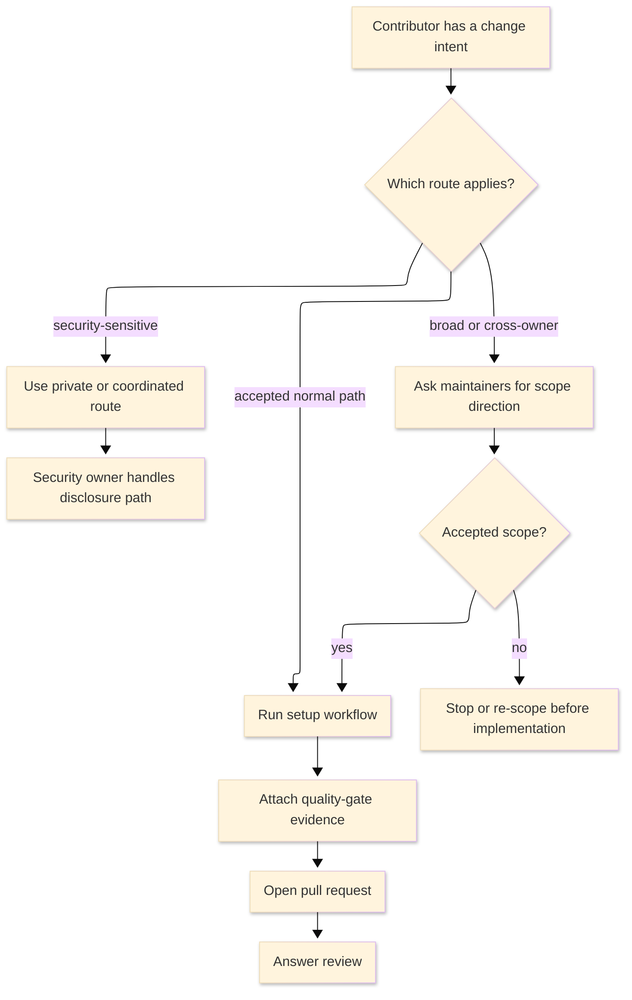

# [CONTRIBUTING_STANDARDS]

A contributing guide tells a prospective contributor which contribution paths the project accepts, how normal changes move from intent to review, what evidence proves the work, and how pull requests converge. It is a contributor workflow document, not an onboarding course, architecture map, gate taxonomy, incident route, governance policy, support policy, or security-disclosure policy. Keep adjacent concerns in their owners and link them only at the boundary.

## [1][USE_WHEN]

Use a contributing guide when readers need accepted contribution paths, normal-change workflow, quality-gate evidence, pull-request evidence, review-collaboration rules, or security-report routing. Do not use it for role readiness, incident response, gate taxonomy, governance authority, support status, or vulnerability-disclosure policy. Route those by topic to onboarding, runbook, test-strategy, support-matrix, and maintained governance or security policy when one exists; otherwise require maintainer consultation before the contributor acts.

## [2][CONTRIBUTION_BASELINES]

Anchor contribution conventions to current project policy first and primary platform conventions second. A guide may mention a host surface, commit format, sign-off, code of conduct, license, contribution location, review ladder, or security route only when repository configuration, host settings, or maintained policy proves the project uses it.

Use external contribution conventions as placement and syntax constraints, not as project obligations. GitHub contributing-guideline conventions allow `CONTRIBUTING` files in repository root, `.github/`, or `docs/`, and GitHub surfaces the selected file during issue and pull-request creation plus the repository contribution surfaces. GitHub default community-health files are fallbacks for repositories that lack their own file of that type, using `.github/`, root, then `docs` precedence; do not treat an organization default as cloned repository truth.

Conventional Commits 1.0.0 permits `<type>[optional scope][!]: <description>`, optional body, and optional footers. A project may enforce that convention or a stricter subset only when repository configuration or maintained policy proves it. DCO supplies the certification text, `git commit --signoff` supplies the trailer behavior, and the project must prove whether every commit requires `Signed-off-by`.

A normal contributing guide routes vulnerability reports to the maintained security policy, enabled private vulnerability-reporting channel, or coordinated disclosure route. If no route is documented, it tells reporters to ask maintainers for the preferred security contact without publishing exploit details.

Claim an enforced convention only from repository truth: host settings, branch-protection rules, required checks, workflow files, commit linting, sign-off checks, pull-request templates, issue templates, or maintained policy documents. Do not import a `feat:` or `fix:` prefix rule, a `Signed-off-by` line, a contribution location, response-time promise, branch-protection claim, or security-reporting path from external examples alone.

Host-only facts require host or policy confirmation. Branch protection, required checks, default branch, fork policy, pull-request templates, issue templates, CODEOWNERS, DCO enforcement, commit-lint enforcement, security-route availability, and review authority do not exist as contributor obligations until repository configuration, host API output, or maintained policy proves them. If that confirmation is unavailable during authoring, state the missing policy or configuration and omit the obligation from the contributor workflow.

## [3][WAYS_CONTRIBUTE]

A contributing guide carries one row per accepted, reviewable contribution path. Each row names the contributor intent, entry artifact, prerequisite when one gates action, and scope bound, so a contributor picks the correct first action without reading the whole guide. Remove paths the project does not accept or cannot review; do not leave empty rows, speculative routes, or maturity-based variants.

Use this path-row shape; fill it only with project-accepted paths:

```markdown template
| [INDEX] | [PATH]      | [INTENT]             | [ENTRY_ARTIFACT] | [PREREQUISITE]                 | [SCOPE_BOUND]          |
| :-----: | :---------- | :------------------- | :--------------- | :----------------------------- | :--------------------- |
|   [1]   | <path name> | <contributor intent> | <entry artifact> | <prerequisite, or `—` if none> | <accepted-scope bound> |
```

Required path fields per row: contributor intent, entry artifact, and scope bound. The prerequisite field is required when an action is gated and marked `—` only when no prerequisite exists. Route broad, expensive, compatibility-breaking, governance, security-sensitive, or cross-owner work to maintainer consultation before the contributor spends implementation effort.

`Non-code` is a path only when maintainers can review the work. It may include reproduction cases, design feedback, accessibility fixes, translations, reviews, examples, and release notes when the project maintains those routes.

Use a decision table for path selection only when two or more independent conditions jointly choose the entry artifact. A single signal-to-artifact mapping belongs in prose beside the path table, not in a table that duplicates it.

Use this route shape when the guide needs to distinguish normal contribution, security-sensitive work, and consultation before implementation. Render the branch when all three routes matter, because the security and consultation paths are route-away decisions rather than slower versions of the normal pull-request path:



Text equivalent: normal changes choose an accepted contribution path, run setup, attach gate evidence, open a pull request, and answer review. Security-sensitive changes use the private or coordinated route before public detail. Broad or cross-owner work gets maintainer scope direction before implementation, then either joins the normal path or stops before contributor effort is wasted.

Show a near-miss only when authors tend to publish vague path bounds. Keep the example focused on the fields that teach the distinction:

```markdown conceptual
INTENT: land fix
PREREQUISITE: local gate
SCOPE_BOUND: self-contained; no break
```

```markdown rejected
INTENT: quick fixes
PREREQUISITE: a little prep
SCOPE_BOUND: comfortable changes
```

## [4][REQUIRED_STRUCTURE]

The published guide uses a required base plus conditional additions. Each `##` heading is a standalone retrieval unit; renumber headings in document order after inserting or omitting conditional sections.

```markdown template
# [CONTRIBUTING]

<Lead: accepted contribution surface and the highest-risk contribution boundary.>

## [1][SCOPE]

## [2][WAYS_CONTRIBUTE]

## [3][SETUP_WORKFLOW]

## [4][QUALITY_GATES]

## [5][PULL_REQUESTS]

## [6][REVIEW]

## [7][SECURITY_REPORTS]

## [8][BOUNDARIES]

## [9][REVIEW_CHECKLIST]

```

Conditional additions:

```markdown template
## [N][BEFORE_YOU_START]

## [N][DOCUMENTATION_CHANGES]

## [N][GETTING_HELP]

```

Section cardinality:

| [INDEX] | [SECTION]             | [CARDINALITY]            | [CARRIES]                                                                     |
| :-----: | :-------------------- | :----------------------- | :---------------------------------------------------------------------------- |
|   [1]   | Scope                 | Required, one            | Accepted contribution surface and topics routed elsewhere                     |
|   [2]   | Ways to contribute    | Required, one            | One path table row per accepted path                                          |
|   [3]   | Setup and workflow    | Required, one            | Commands to reach a first-gate-passing tree, then the enforced workflow facts |
|   [4]   | Quality gates         | Required, one            | Contributor-facing results for maintained gates                               |
|   [5]   | Pull requests         | Required, one            | Required and conditional review details                                       |
|   [6]   | Review                | Required, one            | Collaboration rules and conditional review profiles                           |
|   [7]   | Security reports      | Required, one            | Private vulnerability route                                                   |
|   [8]   | Boundaries            | Required, one            | Adjacent owners for routed-away content                                       |
|   [9]   | Review checklist      | Required, one            | Verification gates for the published guide                                    |
|  [10]   | Before you start      | Conditional, zero or one | Conduct, license, sign-off, discussion, account, or agreement prerequisites   |
|  [11]   | Documentation changes | Conditional, zero or one | When docs travel with changed truth                                           |
|  [12]   | Getting help          | Conditional, zero or one | Contribution blockers only                                                    |

Omit a conditional or optional section when its condition is absent or when one directly linked owner document fully replaces it. Omit a placeholder rather than publishing it empty. Do not keep template instructions, maintainer notes, or speculative routes in the published guide.

## [5][SCOPE_RULES]

`Scope` states what the project accepts before it teaches any workflow. It carries the accepted contribution surface, the public or private entry route for each surface, and the topics the guide deliberately routes away.

Minimum content:

- accepted contribution surfaces the project can review;
- explicit non-contribution topics such as role readiness, incident response, gate taxonomy, support policy, governance authority, and vulnerability disclosure;
- the owner route for each excluded topic, or maintainer consultation when no maintained owner exists;
- the highest-risk boundary, such as security-sensitive, breaking, or cross-owner work requiring direction first.

Do not publish broad encouragement without a reviewable path. A contribution guide that invites work the project cannot review creates contributor waste and maintainer ambiguity.

## [6][BEFORE_YOU_START]

State the conduct, license, sign-off, and prerequisite facts a contributor must accept before opening any path. Carry the route and the acceptance action, not the policy body.

- Link the code of conduct and state that contribution implies acceptance, when the project enforces one.
- Name the contribution license or sign-off requirement, when one governs the change: the inbound license, the `Signed-off-by` Developer Certificate of Origin line, or the contributor-license-agreement route.
- State how to add a sign-off with `git commit --signoff` only when the project requires DCO sign-off.
- Name required accounts, permissions, or contributor agreements only when they gate contribution.
- Link the discussion or maintainer-contact channel for questions that are not yet a contribution.

Do not embed prerequisite knowledge, first-task guidance, shadowing, or role readiness here; route those to onboarding. Do not embed the full code-of-conduct text, license body, DCO body, or contributor-license-agreement. Route each to its maintained owner.

## [7][SETUP_WORKFLOW]

Setup states the commands a contributor on the normal path runs to reach a working tree that passes the first gate; it carries nothing else. Link deeper onboarding, architecture, build, or platform material instead of embedding it. A setup command that was not checked during guide maintenance stays provisional beside the command, using the claim-level rules in [proof.md](../proof.md).

Workflow states each enforced fact the contributor must follow:

1. How to find an issue to take or how to propose new work.
2. Whether to fork, branch from the default branch, or request write access.
3. The branch, commit, changeset, or pull-request-title discipline the project enforces.
4. Any commit-message convention, such as Conventional Commits `<type>[optional scope][!]: <description>`, only when the project enforces it.
5. How to keep one change to one concern so review stays tractable.
6. When generated files, dependency-manifest updates, screenshots, artifacts, or docs must travel with the code.
7. How to recover or ask for help when setup or a gate fails.

State each branch condition before its action: `If <signal>, do <action>`. Do not claim continuous integration, required status checks, branch protection, maintainer response time, commit-convention enforcement, sign-off enforcement, or automation behavior unless repository or host configuration proves it.

## [8][QUALITY_GATES]

Quality gates name the runnable command or review gate that proves a contributor's change and the result to attach. State the contributor-facing result per change family so a contributor can run the maintained gate and report gaps without learning the whole gate taxonomy.

The change-family-to-gate mapping is repository truth, not prose to invent here. Use a placeholder template unless the owning repository proves concrete commands:

```markdown template
| [INDEX] | [CHANGE]        | [GATE]                                       | [RESULT_TO_REPORT]          | [KNOWN_GAP]             |
| :-----: | :-------------- | :------------------------------------------- | :-------------------------- | :---------------------- |
|   [1]   | <change family> | <runnable command or maintained review gate> | <command/status and result> | <unrun or failing gate> |
```

Required gate fields per row: change family, gate, result to report, and known gap. Point every gate at a current runnable command or maintained quality document; state honestly when a gate is a human review rather than an executable command, and never assert a gate passed unless it ran in the change or a current status check proves it. Route gate taxonomy, gate ownership, flake policy, escalation thresholds, and portfolio-level proof to [test-strategy.md](../explanation/test-strategy.md) or the maintained quality owner.

Show a gap in the row where the contributor reports a result, not in a separate apology paragraph:

```markdown conceptual
| [INDEX] | [CHANGE]        | [GATE]                        | [RESULT_TO_REPORT]            | [KNOWN_GAP]                              |
| :-----: | :-------------- | :---------------------------- | :---------------------------- | :--------------------------------------- |
|   [1]   | Markdown update | `git diff --check -- <paths>` | [PASS] no whitespace drift    | none                                     |
|   [2]   | Runtime change  | maintained integration review | [SKIP] reviewer access needed | unrun: owner must run protected scenario |
```

Delete the gate table when no maintained gate or review owner exists. A polished table of unproved commands is filler, not contributor guidance.

## [9][DOCUMENTATION_CHANGES]

Include `Documentation changes` when contributions can alter documentation truth: code behavior, configuration, generated contracts, user-visible behavior, support status, or operational procedure. Route a new or changed document through the standards index by topic, then through the matching document-type standard; this guide carries the trigger, not the style guide, architecture map, API catalog, or release history.

When the contribution guide asks contributors to update adjacent documentation, use a short handoff record instead of a loose link or copied section:

```markdown template
Changed truth: <code behavior, configuration, generated contract, operational procedure, or support fact>
Doc owner: <architecture, roadmap, how-to, runbook, reference, support matrix, or none>
Contributor action: <update existing doc, create routed doc, or state no maintained owner>
```

This record is required only when documentation travels with the change. It makes the contributor state what changed, who owns the durable document, and what proves the doc update, without turning `CONTRIBUTING` into the adjacent document.

## [10][PULL_REQUESTS]

A pull request is accepted for review when its body carries the review details below. Missing required results are a request-changes condition, not a reviewer nicety. Render the always-required self-check as a checklist so the definition of done is asserted, not implied:

- [ ] Summary of one to three sentences states the change and its motivation.
- [ ] Commands, checks, status checks, or review gates run are attached with results.
- [ ] Known gaps are stated plainly or marked `none`: unrun checks, follow-up work, reviewer-access needs.
- [ ] Single concern; unrelated changes are excluded.
- [ ] Commit-message or title convention is satisfied, when the project enforces one.
- [ ] Sign-off (`Signed-off-by`) is present on every commit, when the project requires it.

Attach these fields when their trigger applies:

| [INDEX] | [TRIGGER]                                           | [FIELD]                                                            |
| :-----: | :-------------------------------------------------- | :----------------------------------------------------------------- |
|   [1]   | Review routes by area                               | Paths, owners, or areas touched                                    |
|   [2]   | Visual, runtime, operational, or user-facing change | Screenshots, recordings, logs, generated artifacts, or repro steps |
|   [3]   | Existing direction governs the change               | Link to the governing issue, discussion, design, or decision       |

State an unrun gate as unrun rather than implying it passed. Update the pull request body when run results, scope, or risk change during review.

Use a pull-request body template when the host template does not already provide one:

```markdown template
Summary: <one to three sentences naming the change and motivation>

- <command, status check, or review gate>: <result>

Known gaps: <none, or unrun/failing gate with reason and owner>

Scope: <paths, areas, or owners touched; one concern only>

Required self-check:
- [ ] Run results are attached or the gap is stated.
- [ ] Unrelated changes are excluded.
- [ ] Enforced title, commit, or sign-off policy is satisfied, when repository policy requires it.
```

## [11][REVIEW]

Review guidance defines how contributors and maintainers collaborate so a thread converges. Apply these rules to every review:

- Keep technical discussion public unless it carries sensitive information.
- Answer each review comment with a change, a question, or a reasoned disagreement; silence is not a response.
- Keep unrelated changes out of the contribution.
- Re-state run results, scope, or risk in the pull request body when any of them changes.

When the project runs a maintained review or triage ladder, describe only the contributor-facing profile signal and policy link. Approval authority, branch protection, merge conditions, and governance policy belong to the maintained repository policy owner. Omit the profile table entirely when the project runs a single flat review path or when no maintained policy proves the profiles.

```markdown template
| [INDEX] | [PROFILE]      | [TRIGGER]               | [POLICY_LINK]                   | [CONTRIBUTOR_ACTION]        |
| :-----: | :------------- | :---------------------- | :------------------------------ | :-------------------------- |
|   [1]   | <profile name> | <review-routing signal> | <maintained review-policy link> | <contributor-facing action> |
```

Required profile fields per row: trigger, policy link, and contributor action.

## [12][GETTING_HELP]

Include `Getting help` only for contribution blockers that prevent a contributor from completing a reviewable path: setup command failure, missing permission, unclear owner, inaccessible required gate, or a review question that needs maintainer direction. Link the maintained discussion or maintainer-contact route only when the project publishes one. Do not use this section for user support, onboarding, governance questions, incident response, or vulnerability reports; route those topics to their owners.

## [13][SECURITY_REPORTS]

Route every vulnerability report to the project's maintained security policy, enabled private vulnerability-reporting channel, or coordinated vulnerability-reporting channel, and keep that route out of the normal issue and pull-request flow. When no coordinated route is documented, instruct reporters to ask maintainers for the preferred security contact without publishing exploit details.

Carry only the private route and no policy body. Do not embed a `SECURITY.md` template, disclosure timeline, bounty promise, supported-version policy, advisory workflow, embargo rule, or response-time claim; those belong to the security-policy owner.

## [14][FORMAT_CHOICES]

- Use the path table only for accepted contribution paths the project can review.
- Use the quality-gate table only when each row has a maintained command or review gate and a known-gap column.
- Use the pull-request checklist and template for asserted completion, run results, and known gaps.
- Use a decision table only when independent conditions jointly choose the entry artifact; otherwise use the compact route shape or route-selection flowchart in `Ways to contribute`.
- Use a documentation handoff record only when a contribution changes adjacent documentation truth.
- Keep security routing as prose or a short route record, not a public vulnerability-disclosure policy.

## [15][BOUNDARIES]

- [README.md](../README.md) owns document-type routing, the reader-need map, placement, and lifecycle for new and changed docs.
- [runbook.md](runbook.md) owns operational symptom-to-fix procedures, rollback, escalation, communication, and evidence capture.
- [onboarding.md](../learning/onboarding.md) owns role readiness, first safe tasks, shadowing, and sign-off for contributors, maintainers, and operators.
- [proof.md](../proof.md) owns evidence strength and claim-level reporting for workflows, enforced conventions, sign-off, pull requests, and unrun gates.
- [test-strategy.md](../explanation/test-strategy.md) owns gate taxonomy, gate ownership, gate cost, flake policy, and portfolio-level evidence.
- [support-matrix.md](../reference/support-matrix.md) owns supported versions, platforms, runtimes, deprecation, and end-of-support facts.
- Maintained governance and security-policy documents carry authority, disclosure, support-window, and advisory policy when they exist; otherwise this guide routes those topics to maintainer consultation without becoming the policy body.

## [16][REVIEW_CHECKLIST]

**Scope and policy**
- [ ] Placement is discoverable by the hosting platform or explicitly routed from the repository entrypoint.
- [ ] No CI, status-check, branch-protection, merge-condition, response-time, sign-off, security, approver, CODEOWNERS, template, DCO, or commit-convention claim appears without host, repository, or maintained-policy confirmation.
- [ ] `Scope` states accepted contribution surfaces and route-away topics before workflow details.

**Workflow and results**
- [ ] Every accepted contribution path has intent, `ENTRY_ARTIFACT`, and `SCOPE_BOUND`.
- [ ] Conduct, license, and sign-off prerequisites are linked, not embedded, when the project enforces them.
- [ ] Setup commands either have current run results beside the claim or state the unrun gate.
- [ ] Workflow states each enforced fact, including any commit or title convention, and writes conditions before actions.
- [ ] Each quality-gate row names a runnable command or maintained review gate, the result to report, and how to state gaps.
- [ ] Pull-request required fields use the checklist form and mark unrun gates honestly.
- [ ] The contribution route is shown as prose or a flowchart with text equivalent, and security or consultation routes do not collapse into the normal pull-request path.

**Structure and examples**
- [ ] Review rules keep normal collaboration public and require every comment to receive a response.
- [ ] Documentation-change triggers route new docs through the standards corpus by topic and use the handoff record when docs travel with the change.
- [ ] `Getting help` appears only for contribution blockers and routes support, onboarding, incidents, governance, and security reports elsewhere.
- [ ] Security reporting points to a private or coordinated route without becoming a security-policy template.
- [ ] Format choices match their purpose: path and gate tables are proved, PR completion is a checklist, and security routing is not a policy body.
- [ ] Tables answer comparison, lookup, or decision questions and do not duplicate prose.
- [ ] Examples are single-purpose, non-duplicative, and cannot be mistaken for default project policy.
