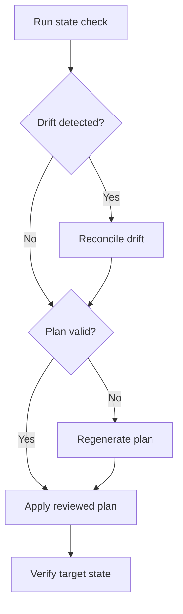

# [HOW_STANDARDS]

A how-to guide carries one competent reader through one practical goal or problem to an observable outcome. Lead with the outcome, keep only the actions and judgment points needed to reach it, and close with outcome evidence rather than command completion. The reader already knows the domain and exercises judgment; the guide supplies the usable route, not teaching, background, operational recovery, or a lookup catalog.

## [1][USE_WHEN]

Write a how-to guide when every condition holds:

- the reader can already act in the domain and needs the reliable path, not instruction;
- the document drives exactly one repeatable task or problem with a named outcome;
- the outcome is observable, so the guide can end on a check that proves it;
- background, concepts, option catalogs, operational recovery, and support facts can live elsewhere and be named here, not embedded.

Route a first-success learning path, an operational symptom response, a contribution workflow, an API surface, supported-version facts, or a conceptual explanation to its own type. The README corpus map resolves the reader need to a type; this standard owns the how-to type only.

## [2][CANONICAL_SOURCE]

This standard operationalizes the Diataxis how-to guide. A how-to is goal-oriented action for an already-competent user who knows what they want to achieve. Its structure follows the user's work, keeps focus on one goal, links explanation and reference instead of embedding them, and phrases unavoidable branches as conditional imperatives. The rules below add agent-facing structure, conditional section discipline, and claim-level proof.

Source of truth: [Diataxis how-to guide documentation](https://diataxis.fr/how-to-guides/).
Last verified: 2026-06-04.
Review trigger: Diataxis how-to guidance changes.

## [3][SECTION_RULES]

A how-to guide has a required core and conditional support. The required core is `# [HOW_TASK]`, the metadata block, `## [1][GOAL]`, `## [2][PROCEDURE]`, and `## [3][VERIFICATION]`. Conditional sections appear only when the task consumes the fact or action they carry, and every inserted conditional section renumbers in document order.

- `Prerequisites` appears when the task consumes access, target context, tools, versions, prepared artifacts, or explicit permissions the reader can confirm before starting.
- `Rollback` appears when the task changes state; if no reverse action exists, the section states that fact and routes recovery to a runbook by topic.
- `Troubleshooting` appears only for task-local failures with concrete recovery that returns the reader to the same path.
- `Boundaries` appears when an adjacent maintained document carries what this guide deliberately excludes.
- `Review checklist` appears in a published guide only when a named review workflow consumes reader-visible verification gates.

Do not classify guides by project maturity, product size, or broad task family. Required and conditional sections derive from the work the reader must perform and the proof the outcome requires.

## [4][REQUIRED_STRUCTURE]

Use the section set below; each `##` heading is a standalone retrieval unit a reader may open out of order. The base template includes only universal sections, so agents do not publish empty conditional headings. Add conditional sections from the second template only when their trigger applies, and renumber headings in document order.

```markdown template
<!-- source-only: how-to base template; add conditional sections only when their triggers apply -->
# [HOW_TASK]

Last verified: YYYY-MM-DD
Review trigger: <command, flag, schema, target, or contract change>

## [1][GOAL]

## [2][PROCEDURE]

## [3][VERIFICATION]

```

Conditional additions:

```markdown template
## [N][PREREQUISITES]

## [N][ROLLBACK]

## [N][TROUBLESHOOTING]

## [N][BOUNDARIES]

## [N][REVIEW_CHECKLIST]

```

Section cardinality:

**Required**
- `Last verified`, `Review trigger` (one each): the metadata block, one `label: value` per line; add `Owner` when more than one role maintains the guide.
- `Goal` (one paragraph): names the single task outcome in the reader's terms.
- `Procedure` (repeatable steps): a logical sequence ordered by dependency, reader flow, setup context, or judgment sequence.
- `Verification` (one block): proves the outcome named in `Goal` and states whether the path ran or which proof gap remains.

**Conditional**
- `Prerequisites` (zero or one): access, target context, tools, versions, prepared artifacts, or permissions this task consumes and nothing more, as a definition block with one record per line.
- `Rollback` (zero or one): required when the task changes state; carries the reverse action and the check that confirms the reverse, or states that no reverse exists and routes recovery.
- `Troubleshooting` (repeatable entries): only task-local failure modes with actionable recovery, as a record per failure mode.
- `Boundaries` (zero or one): one link per adjacent owner when an adjacent maintained document carries what this guide deliberately excludes.
- `Review checklist` (zero or one): reader-visible verification gates only when a named review workflow consumes them.

Omit a conditional section when the condition is absent. Do not publish empty placeholders, generic readiness text, reference inventories, broad recovery branches, or author-review scaffolding to make the template look complete.

## [5][SCOPE_RULES]

- Solve one task per guide and state its outcome in the title and `Goal`.
- Start and end where a competent reader starts and ends; do not re-teach setup the reader already owns.
- List only prerequisites this task consumes; name broader environment setup by topic and route it elsewhere.
- Keep action and necessary judgment in the guide; move concepts, API catalogs, option inventories, broad failure analysis, and support facts to their owning types and name them by topic.
- Carry one primary successful path. Add branches only for unavoidable judgment points, state the decision condition, and rejoin when possible; split broad variants into separate guides.

## [6][PREREQUISITES_RULES]

A prerequisite is a record the reader scans and confirms before starting, so render `Prerequisites` as a definition block with one `label: value` per line, never as a paragraph and never as a one-row table. Each record names a concrete, checkable fact, not a vague readiness claim:

- `Access`: the named role, permission, credential, or scope, with the surface it grants on.
- `Target context`: the named environment, host, directory, document, or resource the task acts on.
- `Tools`: the named CLI, package, service, or UI plus the minimum version the procedure assumes, with the version as a numeral the reader can compare.
- `Prepared artifact`: the named file, object, plan, or input the procedure consumes.

State what the reader confirms, not how they obtain it; route environment setup the reader must perform first to its own guide by topic. A prerequisite the reader cannot observe before starting is a procedure step, not a prerequisite.

```markdown conceptual
Access: release role on the target environment
Target context: staging environment for the checkout service
Tools: deployment CLI 2.4 or newer; environment access configured
Prepared artifact: reviewed deployment plan at `./deploy-plan.lock`
```

## [7][PROCEDURE_RULES]

**Step order**
- Number steps as the default procedure form; order may follow dependency, reader flow, setup context, or judgment sequence.
- Use peer bullets only inside a step or for genuinely independent checks whose order does not affect the reader's path.
- Combine actions that share a place and yield one logical result; split a step that changes place or produces a separately verifiable result.
- Link a repeated sub-procedure to its canonical guide instead of copying it.

**Step wording**
- Open each step with an imperative verb and an input-neutral UI verb, so the step holds across mouse, keyboard, command, and automation surfaces.
- State the place of action before the action when the tool, shell, host, directory, UI, or document is not obvious from the prior step.
- State a gating condition before the action it controls as a conditional imperative: `If <signal>, <action>`.
- State the expected result of a step when the reader needs that signal to proceed, so the reader confirms progress without running the full `Verification` block.
- Mark an optional step with a leading `Optional:` and mark an irreversible step with a leading `Irreversible:` so the reader sees the stakes before acting.

When the task uses a command, show the accepted command in a fenced block with an intent label. Include a rejected near-miss only when it prevents a likely, material error. A real guide uses `copy-safe` only for a command that runs as written; the illustrative accepted shape below is `conceptual`, and the near-miss is `rejected`:

```bash conceptual
# Apply the reviewed plan to the named target.

deployctl apply --target staging --plan ./deploy-plan.lock
```

```bash rejected
# Omits the target and reviewed plan, so the command falls back to defaults.

deployctl apply
```

For a forking procedure, use prose or a numbered branch first. Use a decision table when independent conditions jointly choose an action; use Mermaid only when the branch and rejoin are easier to follow visually than as steps or a decision table.

```markdown conceptual
| [INDEX] | [DRIFT_DETECTED] | [PLAN_VALID] | [ACTION]                 |
| :-----: | :--------------- | :----------- | :----------------------- |
|   [1]   | no               | yes          | apply reviewed plan      |
|   [2]   | yes              | yes          | reconcile, then apply    |
|   [3]   | any              | no           | regenerate plan first    |
```

## [8][VERIFICATION_ROLLBACK_RULES]

End on a `Verification` block that observes the `Goal` outcome, not that a command exited zero. Bind the check to the task's actual outcome: setup proves convergence to the target state, mutation proves the new state, and read-only work proves the artifact, reading, or export shape. State each expected result beside the check that produces it, with `Evidence:` naming the command, query, dashboard, generated artifact, UI path, or review gate that proves it.

Render `Verification` as a checklist when the outcome carries several independently observable conditions:

```markdown conceptual
## [3][VERIFICATION]

- [ ] State check reports the checkout service at the requested revision — Evidence: `deployctl status --service checkout --target staging`
- [ ] Readiness probe returns ready within the rollout window — Evidence: checkout readiness dashboard
```

For a state-changing task, give `Rollback` the reverse action, its expected result, and its own check. When no reverse exists, say so and route recovery to a runbook by topic:

```markdown conceptual
## [N][ROLLBACK]

Reverse action: restore the previous approved plan with `deployctl restore --target staging --from previous-approved`.
Expected result: the target environment reports the previous revision.
Verification: `deployctl status --target staging` shows the previous revision and readiness is restored.
```

```markdown conceptual
## [N][ROLLBACK]

Reverse action: none; this task permanently exports and publishes the artifact.
Recovery route: use the publication rollback runbook if the published artifact is wrong.
```

A how-to guide claims a path works, so the path must have been run or its gaps stated. Separate the path execution from outcome proof:

```markdown conceptual
Executed path: `deployctl apply --target staging --plan ./deploy-plan.lock` ran against the documented target.
Outcome evidence: `deployctl status --service checkout --target staging` reported the requested revision and readiness returned inside the rollout window.
Last verified: 2026-06-04
Review trigger: deployment CLI flags, target naming, readiness signal, or plan-lock schema change.
```

State an unrun step honestly: mark it provisional and name the gate that would prove it, rather than asserting a path that was not executed.

```markdown conceptual
Proof gap: the publish step was reviewed but not executed; prove it by running `<publish command>` against `<target>` and checking `<outcome signal>`.
```

## [9][TROUBLESHOOTING_RULES]

Keep `Troubleshooting` to failure modes that block this task and have a concrete recovery; route operational recovery, escalation, and incident evidence to a runbook by topic. A failure-mode set is finite and scannable, so render each entry as a record carrying its signal, cause, and recovery, never as a flat paragraph:

- `Signal`: the observable symptom the reader sees — an error string, a failed check, or a wrong reading.
- `Cause`: the condition that produced the signal, when known.
- `Recovery`: the concrete action that returns the reader to the path, or the route to the owning runbook when recovery exceeds this task.

Render each entry as a `### [N.M][SYMPTOM]` H3 whose body carries the fields one `label: value` per line:

```markdown conceptual
### [N.M][TARGET_NOT_FOUND]

Signal: `error: target "staging" not found in ./deploy-plan.lock`
Cause: the plan was generated against a different target than the one named in `--target`.
Recovery: regenerate the plan against the named target, then re-run the apply step.
```

A symptom-to-recovery set with three or more entries is a lookup the reader scans by signal; render it as a record per entry or a lookup table keyed on the signal:

```markdown conceptual
| [INDEX] | [SIGNAL]      | [CAUSE]            | [RECOVERY]                  |
| :-----: | :------------ | :----------------- | :-------------------------- |
|   [1]   | target absent | wrong target plan  | regenerate plan for target  |
|   [2]   | drift         | manual divergence  | reconcile, then rerun apply |
|   [3]   | timeout       | short probe window | wait window, then re-check  |
```

## [10][FORMAT_CHOICES]

- Use a numbered list for the procedure, peer bullets only for independent observations inside a step, and a fenced labeled block for every command or copyable artifact.
- Use a definition block for the metadata block and for `Prerequisites` records that a reader scans or updates per line, not a one-row table.
- Use a checklist for multi-condition verification and keep inline proof fields after an em dash.
- Use a table only for genuine row-and-column lookup such as signal-to-recovery entries; the table ceiling lives in [information-structure.md](../information-structure.md), and an oversized lookup splits by natural axis.
- For a forking procedure, choose between prose, a decision table, and a Mermaid `flowchart` by the triggers [information-structure.md](../information-structure.md) owns; keep a linear procedure as a numbered list.

A forking procedure renders its decision and rejoin as a flowchart only when the branch is easier to follow visually than as steps or a decision table:



The text equivalent is the same branch: run a state check, reconcile drift only when drift exists, regenerate an invalid plan, apply the reviewed plan, and verify the target state.

## [11][BOUNDARIES]

**Task documents**
- [runbook.md](runbook.md) owns operational symptom response, recovery, escalation, rollback under incident pressure, communication, and incident evidence; a how-to performs normal tasks and routes operational recovery there.
- [contributing.md](contributing.md) owns contribution workflow, review collaboration, and pull-request evidence.
- [tutorial.md](../learning/tutorial.md) teaches a first-success path and owns learning ramps; a how-to completes a task for a reader who can already act.

**Shared standards**
- [proof.md](../proof.md) owns evidence strength, proof gaps, and the freshness fields a verification step cites.
- [information-structure.md](../information-structure.md) owns container, table, record, decision-table, checklist, diagram form, and the intent-label vocabulary this guide applies to fenced blocks.
- This guide owns the leading step markers `Optional:` and `Irreversible:` because they change how a how-to reader acts before a step.
- [style-guide.md](../style-guide.md) owns imperative and input-neutral phrasing and the conditional-imperative form this guide requires of procedure steps.
- [README.md](../README.md) owns reader-need classification, document-type choice, placement, and lifecycle; route a draft that serves another reader need there.

## [12][REVIEW_CHECKLIST]

**Scope**
- [ ] H1 uses a bracketed semantic task label and `Goal` names one observable outcome.
- [ ] The metadata block carries `Last verified` and `Review trigger`.
- [ ] Conditional sections appear only when the task consumes their facts or actions.
- [ ] Adjacent owners are named by topic in prose and linked once each only in `Boundaries` when adjacent maintained owners exist.

**Procedure**
- [ ] Prerequisites are a definition block of checkable access, context, versioned-tool, or prepared-artifact records, listing only what this task consumes.
- [ ] Procedure steps are imperative, input-neutral, ordered by reader flow, condition-first, and place-clear.
- [ ] Optional and irreversible steps carry their leading markers when present.
- [ ] Every fenced block carries one intent label.

**Proof**
- [ ] Verification proves the outcome, states each expected result, and cites claim-level evidence.
- [ ] The path was run or a `Proof gap:` field states the unrun gate that would prove it.
- [ ] State-changing guides carry `Rollback` with a reverse check, or state that no reverse exists and route recovery to a runbook by topic.
- [ ] Troubleshooting is task-local, rendered as signal-cause-recovery records, and actionable.
