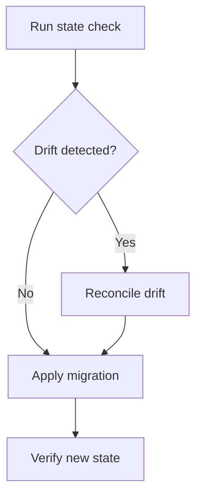

# How-to standards

A how-to guide drives one competent reader through one repeatable task to a verifiable outcome. Lead with the task outcome, keep only the action that reaches it, and end with a check that proves the outcome rather than command completion. The reader already knows the domain and exercises judgment; the guide supplies the exact path, not teaching, background, or a lookup catalog.

## Use when

Write a how-to guide when every condition holds:

- the reader can already act in the domain and needs the reliable path, not instruction;
- the document drives exactly one repeatable task with a named outcome;
- the outcome is observable, so the guide can end on a check that proves it;
- background, concepts, option catalogs, and support facts can live elsewhere and be named here, not embedded.

Route a first-success learning path, an operational symptom response, a contribution workflow, an API surface, supported-version facts, or a conceptual explanation to its own type. The README corpus map resolves the reader need to a type; this standard owns the how-to type only.

## Canonical source

This standard operationalizes the Diataxis how-to guide. A how-to is a sequence of actions addressed to an already-competent user who knows what they want to do; its fundamental structure is a sequence with logical ordering in time; it maintains focus on one goal and links to explanation and reference rather than embedding either; and it phrases branches as conditional imperatives. The rules below add the agent-facing structure, profile discipline, and claim-level proof that the framework leaves to the author.

`Source of truth:` Diataxis how-to guide documentation (`https://diataxis.fr/how-to-guides/`); 2025-2026 practitioner conventions for prerequisites-first, per-stage expected outcomes, verification checks, and rollback with post-rollback verification. `Last verified:` 2026-06-04. `Review trigger:` Diataxis how-to guidance changes.

## Task profiles

A how-to task carries one of three profiles. The profile sets which optional sections become required and which proof the guide must end on. Pick exactly one profile per guide; a task that spans two profiles is two guides.

| Profile | Triggering task | Required beyond base | Outcome proof | Rollback section |
| --- | --- | --- | --- | --- |
| Idempotent setup | Configure, install, provision, or wire a component to a target state | `Prerequisites` lists access and target context | Re-running converges to the same state and the state check passes | Omit; safe to re-run |
| Mutating action | Deploy, release, migrate, or change durable state once | `Prerequisites` lists access; `Procedure` marks the irreversible step | State after the action matches the intended new state | Required: state the reverse action and its check |
| Read or inspect | Query, render, export, or diagnose without changing state | None beyond base | The produced artifact or reading matches the expected shape | Omit; no state changed |

Base sections (`# How to <task>`, the metadata block, `## Goal`, `## Procedure`, `## Verification`) are required for every profile. A mutating-action guide that cannot state a reverse action must say so and route the reverse path to a runbook by topic rather than leave rollback silent.

## Required structure

Use the section set below; each `##` heading is a standalone retrieval unit a reader may open out of order. Order them so the outcome leads, prerequisites precede procedure, and the proof closes the path.

```markdown
<!-- copy-safe — how-to skeleton; fill the metadata block and every base section -->
# How to <task>

Last verified: YYYY-MM-DD
Review trigger: <command, flag, schema, target, or contract change>

## Goal
## Prerequisites
## Procedure
## Verification
## Rollback
## Troubleshooting
## Boundaries
```

Section cardinality:

- `Last verified`, `Review trigger` (required, one each): the metadata block, one `label: value` per line; add `Owner` when more than one role maintains the guide.
- `Goal` (required, one paragraph): names the single task outcome in the reader's terms.
- `Prerequisites` (required for setup and mutating profiles, optional for read profile): access, target context, and tools this task needs and nothing more, as a definition block with one record per line.
- `Procedure` (required, repeatable steps): ordered when order changes the result, otherwise a single peer block.
- `Verification` (required, one block): proves the outcome named in `Goal`.
- `Rollback` (required for mutating profile, omitted otherwise): the reverse action and the check that confirms the reverse.
- `Troubleshooting` (optional, repeatable entries): only task-local failure modes with actionable recovery, as a record per failure mode.
- `Boundaries` (optional): one link per adjacent owner when an adjacent maintained document carries what this guide deliberately excludes.

Omit an optional section rather than publishing it empty.

## Scope rules

- Solve one task per guide and state its outcome in the title and `Goal`.
- Start and end where a competent reader starts and ends; do not re-teach setup the reader already owns.
- List only prerequisites this task consumes; name broader environment setup by topic and route it elsewhere.
- Keep action in the guide; move concepts, API catalogs, option inventories, and broad failure analysis to their owning types and name them by topic.
- Carry exactly one accessible successful path. Admit a judgment point only when real work forks: state the decision condition, give each branch, then rejoin the single path.

## Prerequisites rules

A prerequisite is a record the reader scans and confirms before starting, so render `Prerequisites` as a definition block with one `label: value` per line, never as a paragraph and never as a one-row table. Each record names a concrete, checkable fact, not a vague readiness claim:

- Access: the named role, permission, credential, or scope, with the surface it grants on.
- Target context: the named environment, host, directory, or resource the task acts on.
- Tools and versions: the named CLI, package, or service plus the minimum version the procedure assumes, with the version as a numeral the reader can compare.

State what the reader confirms, not how they obtain it; route environment setup the reader must perform first to its own guide by topic. A prerequisite the reader cannot observe before starting is a procedure step, not a prerequisite.

```markdown conceptual
Access: `deploy` role on the staging cluster
Target context: staging cluster, `checkout` namespace
Tools: `rasm` CLI 2.4 or newer; cluster access configured
```

## Procedure rules

- Number steps when order changes the result; use peer bullets when steps are independent.
- Open each step with an imperative verb and an input-neutral UI verb, so the step holds across mouse, keyboard, and command surfaces.
- State the place of action before the action when the tool, shell, host, directory, or document is not obvious from the prior step.
- State a gating condition before the action it controls as a conditional imperative: `If <signal>, <action>`.
- State the expected result of a step when the reader needs that signal to proceed, so the reader confirms progress without running the full `Verification` block.
- Mark an optional step with a leading `Optional:` and mark an irreversible step with a leading `Irreversible:` so the reader sees the stakes before acting.
- Combine actions that share a place and yield one logical result; split a step that changes place or produces a separately verifiable result.
- Link a repeated sub-procedure to its canonical guide instead of copying it.
- Show one accepted command and, where a near-miss is a likely error, one rejected command, each in a fenced block with an intent label.

Label every fenced block with one intent so the reader knows whether to run it. The accepted command is `copy-safe`; the near-miss is `rejected`:

```bash
# copy-safe — apply the pinned migration to the named target
rasm migrate apply --target staging --plan ./plan.lock
```

```bash
# rejected — omits the target and the pinned plan, so it migrates the default host
rasm migrate apply
```

## Verification and rollback rules

- End on a `Verification` block that observes the `Goal` outcome, not that a command exited zero.
- Bind the check to the profile: setup proves convergence to the target state, mutating action proves the new state, read profile proves the artifact or reading shape.
- State each expected result beside the check that produces it, with `Evidence:` naming the command, query, dashboard, or generated artifact that proves it.
- For the mutating profile, give `Rollback` the reverse action, its expected result, and its own check; when no reverse exists, say so and route recovery to a runbook by topic.

Render `Verification` as a checklist when the outcome carries several independently observable conditions, so the reader asserts and confirms each rather than reading proof back as prose. Each item names the check and its expected result:

```markdown conceptual
## Verification
- [ ] State check reports `checkout` at the new revision. Evidence: `rasm state get --service checkout`
- [ ] Health probe returns ready within the rollout window. Evidence: `checkout` readiness dashboard
```

## Troubleshooting rules

Keep `Troubleshooting` to failure modes that block this task and have a concrete recovery; route operational recovery, escalation, and incident evidence to a runbook by topic. A failure-mode set is a finite enumerable set, so render each entry as a record carrying its signal, cause, and recovery, never as a flat paragraph:

- Signal: the observable symptom the reader sees — an error string, a failed check, or a wrong reading.
- Cause: the condition that produced the signal, when known.
- Recovery: the concrete action that returns the reader to the path, or the route to the owning runbook when recovery exceeds this task.

Render each entry as a `### <symptom>` H3 whose body carries the three fields as one `label: value` per line:

```markdown conceptual
### Migration apply reports a target mismatch

Signal: `error: target "staging" not found in plan ./plan.lock`
Cause: the plan was generated against a different cluster than the one named in `--target`.
Recovery: regenerate the plan against the named target, then re-run the apply step.
```

A symptom-to-recovery set with three or more entries is a lookup the reader scans by signal; render it as a record per entry or a lookup table keyed on the signal, so the reader finds the matching row without reading prose:

```markdown conceptual
| Signal | Cause | Recovery |
| --- | --- | --- |
| `target "staging" not found` | Plan built against another cluster | Regenerate the plan against the named target, then re-apply |
| `revision drift detected` | A manual change diverged from the plan | Reconcile drift, then re-run the apply step |
| `readiness timed out` | Probe window shorter than the rollout | Wait for the rollout window, then re-check readiness |
```

## Proof obligation

A how-to guide claims a path works, so the path must have been run or its gaps stated. Attach claim-level evidence to drift-prone facts and name the freshness trigger:

```markdown conceptual
Evidence: `rasm migrate apply --target staging --plan ./plan.lock` run 2026-06-04
Last verified: 2026-06-04
Review trigger: migrate CLI flags or the plan-lock schema change
```

State an unrun step honestly: mark it provisional and name the gate that would prove it, rather than asserting a path that was not executed.

## Format choices

- Use a numbered list for the ordered procedure, peer bullets for independent steps, and a fenced labeled block for every command.
- Use a definition block for the metadata block and for `Prerequisites` records that a reader scans or updates per line, not a one-row table.
- Use a table only for a genuine row-and-column lookup such as the profile selector above; the table ceiling lives in information-structure.md (tables), and a selector that outgrows it splits by profile.
- For a forking procedure, choose between a decision table and a Mermaid `flowchart` by the triggers information-structure.md owns (decision and lookup tables; Mermaid and C4); keep a linear procedure as a numbered list.

A forking mutating-action procedure renders its decision and rejoin as a flowchart:



## Boundaries

- [runbook.md](runbook.md) owns operational symptom response, recovery, escalation, and incident evidence; a how-to performs normal tasks and routes operational recovery there.
- [contributing.md](contributing.md) owns contribution workflow, review collaboration, and pull-request evidence.
- [tutorial.md](../learning/tutorial.md) teaches a first-success path and owns learning ramps; a how-to completes a task for a reader who can already act.
- [proof.md](../proof.md) owns evidence strength and the freshness fields a verification step cites.
- [information-structure.md](../information-structure.md) owns container, table, record, decision-table, checklist, and diagram form; this guide binds those forms to sections but does not redefine them.
- [formatting.md](../formatting.md) owns the intent-label vocabulary (`copy-safe`, `rejected`, `conceptual`) and the status-marker vocabulary (`Optional:`, `Irreversible:`) this guide applies to fenced blocks and steps.
- [style-guide.md](../style-guide.md) owns imperative and input-neutral phrasing and the conditional-imperative form this guide requires of procedure steps.
- [README.md](../README.md) owns reader-need classification, document-type choice, placement, and lifecycle; route a draft that serves another reader need there.

## Review checklist

- [ ] Title starts with `How to` and `Goal` names one observable outcome.
- [ ] The metadata block carries `Last verified` and `Review trigger`.
- [ ] Exactly one task profile is chosen and its required sections are present.
- [ ] Prerequisites are a definition block of checkable access, context, and versioned-tool records, listing only what this task consumes.
- [ ] Procedure steps are imperative, input-neutral, ordered only where order matters, condition-first, and place-clear.
- [ ] Optional and irreversible steps carry their leading markers.
- [ ] Every fenced block carries one intent label.
- [ ] Verification proves the profile's outcome, states each expected result, and cites claim-level evidence.
- [ ] Mutating-action guides carry a `Rollback` with a reverse check, or route recovery to a runbook by topic.
- [ ] Troubleshooting is task-local, rendered as signal-cause-recovery records, and actionable.
- [ ] Adjacent owners are named by topic in prose and linked once each only in `Boundaries`.
