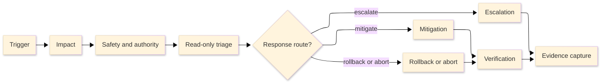
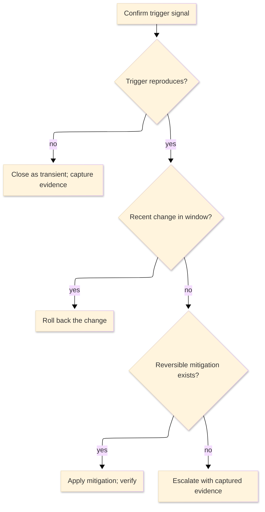

# [RUNBOOK_STANDARDS]

A runbook drives a responder from an observable operational symptom to triage, mitigation, rollback or abort, escalation, recovery verification, and evidence capture under pressure. Lead with the trigger and impact. Keep read-only observation ahead of state change, state acting authority before risky action, and end every state-changing step on a check that proves recovery or containment rather than command completion.

The responder acts during an active operational condition, so the page supplies the exact response path, not background, severity governance, normal-task instruction, or a postmortem template. Local incident process owns severity names, response clocks, acting authority, communication cadence, escalation thresholds, and profile tie-breakers. This standard uses SRE and incident-response authorities as external sources for response shape, not as a universal severity taxonomy.

## [1][USE_WHEN]

Write a runbook when every condition holds:

- the starting point is an observable operational symptom a responder can name;
- a responder needs safe triage and mitigation, not normal-task instruction;
- rollback, abort, acting authority, or escalation criteria change what the responder does next;
- response evidence must be captured for handoff or later review.

Route normal repeatable work, contribution workflow, severity and command-role governance, postmortem authoring, gate policy, support-status facts, and topology background to their owning types. The README corpus map resolves the reader need to a type by topic; this standard owns the runbook type only.

## [2][RESPONSE_BASELINES]

Use external incident-response authorities for durable response principles, and use local operational truth for the values a responder invokes during an incident. Neither Google SRE nor PagerDuty supplies this repository's severity names, authority model, escalation thresholds, response clocks, communication cadence, or profile tie-breakers.

Google SRE incident-response guidance supports clear roles, communication, working records, impact assessment before or alongside mitigation, and mitigation before full root cause is known. PagerDuty incident-response guidance separates preparation, during-incident work, after-incident work, roles, escalation, communication, and severity or process examples.

PagerDuty product docs tie priority and urgency to incidents, tie severity to alerts, and document Dynamic Notifications as a severity-to-urgency mapping for alert-created incidents. A local incident process must map priority, urgency, and alert-severity behavior into any response profile it uses.

Local incident-process documents, policies, or operations corpora own profile names, severity or priority terms, response clocks, acting authority, escalation thresholds, communication requirements, and evidence requirements. A runbook uses those values only when the local corpus maintains them.

## [3][RESPONSE_PROFILE]

A runbook declares the local response profile in `## [1][TRIGGER]`. The profile comes from the maintained incident process, not from this standard's vocabulary. It must resolve the impact class, response clock, acting authority, escalation threshold, communication requirement, and evidence requirement before the responder mutates state.

Profile fields:

- `Impact class`: the local severity, priority, maintenance, or response class that decides urgency.
- `Response clock`: acknowledgement, mitigation, update, or abort timing the responder must honor.
- `Acting authority`: the role allowed to act, plus any second-person approval or break-glass requirement.
- `Escalation threshold`: the observable condition that raises severity, changes owner, or blocks mutation.
- `Communication requirement`: the audience, channel, cadence, and status fields when stakeholders must be updated.
- `Evidence requirement`: artifacts the responder must preserve for handoff, audit, or later review.

Render the profile as a definition block in the published runbook so the responder can verify authority before mutation:

```markdown template
Impact class: <local severity, priority, maintenance, or response class>
Response clock: <acknowledgement, mitigation, update, or abort timing>
Acting authority: <role allowed to act; approval or break-glass requirement>
Escalation threshold: <observable condition that raises profile, changes owner, or blocks mutation>
Communication requirement: <audience, channel, cadence, and status fields, or `none`>
Evidence requirement: <artifacts to preserve for handoff, audit, or review>
```

If the responder cannot choose between local profiles from the observable impact, apply the maintained local incident-process tie-breaker. If no maintained tie-breaker exists, stop mutation and escalate for profile assignment with captured evidence; do not import PagerDuty's or another provider's severity default as local policy.

When no maintained incident-process source exists, publish the gap as a profile blocker, not as an invented local profile:

```markdown conceptual
Incident-process source: provisional: no maintained local source
Impact class: provisional; responder cannot assign profile from maintained policy.
Response clock: provisional; escalate for assignment before mutation.
Acting authority: blocked until owner confirms authority.
Escalation threshold: missing maintained profile or tie-breaker.
Evidence requirement: capture trigger, impact, triage checks, and blocked action.
```

The response path is a reusable route, not a substitute for the required template. Show it when the runbook needs the responder to see where mutation, rollback, escalation, verification, and evidence fit in the same path:



The text equivalent is: start from the observable trigger, state impact, confirm safety and authority, run read-only triage, choose mitigation, rollback, or escalation from local profile rules, verify recovery or containment, and capture evidence for handoff or review. `Escalation` is always present; only its triggering criteria vary by local profile. A runbook whose response has no reversible mitigation says so in `Rollback or abort` and requires escalation before any irreversible action.

## [4][PLACEMENT]

Place a runbook where a responder under pressure first looks:

- Shared operational runbook: `docs/runbooks/<symptom-or-system>.md`.
- Owner-local runbook: `{owner}/runbooks/<symptom-or-system>.md`, or the nearest maintained operations corpus for that owner.
- Service-local emergency procedure: beside the service only when local credentials, dashboards, deployment tools, or ownership make a shared page slower to reach during response.

Write one canonical runbook per operational trigger. When two runbooks share a triage or mitigation path, link the canonical one by topic rather than copy the path into both.

## [5][REQUIRED_STRUCTURE]

Use the section set below; each `##` heading is a standalone retrieval unit a responder may open out of order. The base template includes response-critical universal sections, including evidence capture, so agents do not publish empty profile-gated headings. Add conditional sections from the second template only when their trigger applies, and renumber headings in document order.

```markdown template
# [RECOVER_OBSERVABLE_SYMPTOM]

## [1][TRIGGER]

Owner: <owning role or team>
Response profile: <local incident-process profile>
Incident-process source: <maintained local source, or `provisional: no maintained local source`>

## [2][IMPACT]

## [3][SAFETY_PREREQUISITES]

## [4][TRIAGE]

## [5][MITIGATION]

## [6][ESCALATION]

## [7][VERIFICATION]

## [8][EVIDENCE_CAPTURE]

## [9][BOUNDARIES]

## [10][REVIEW_CHECKLIST]

```

Conditional additions:

```markdown template
## [N][ROLLBACK_ABORT]

## [N][COMMUNICATION]

## [N][FOLLOW_UP_CLEANUP]

```

Section cardinality:

**Required response frame**
- `Trigger` (required, one): the observable signal, owner, response profile, and incident-process source the responder uses to confirm authority and policy before mutation.
- `Impact` (required, one): affected surface and user or business effect.
- `Safety and prerequisites` (required, one): response-critical access, acting authority, tools, known-good restore points, and evidence-preservation constraints only.

**Required response path**
- `Triage` (required, ordered, repeatable checks): read-only observation, each check followed by its expected signal and its branch.
- `Mitigation` (required, repeatable actions or explicit no-safe-mutation record): bounded containment or state-changing response actions, each paired with expected result and verification; when no safe mutation exists, state that and route to escalation with captured evidence.
- `Escalation` (required for every profile): the observable threshold and owning role.
- `Verification` (required, one): recovery or containment check.
- `Evidence capture` (required, repeatable entries): artifacts to preserve, storage or handoff path, and known gaps; depth and storage expectations may vary by local response profile.
- `Boundaries` (required, one): one link per adjacent owner for what this runbook deliberately excludes.
- `Review checklist` (required, one): verification gates for the published runbook.

**Conditional and optional sections**
- `Rollback or abort` (conditional, zero or one): required when any action changes state, increases risk, is irreversible, the response profile requires an abort point, or rollback failure changes escalation; carries reverse action and its check, or an explicit statement that no reverse exists.
- `Communication` (conditional, zero or one): required when the local profile demands stakeholder updates; carries audience, channel, cadence, status fields, and update owner.
- `Follow-up cleanup` (optional, repeatable): safety-restoring steps after recovery; not a postmortem.

Omit an optional section rather than publishing it empty. `Follow-up cleanup` restores the system to a safe steady state after recovery and is not a postmortem template.

## [6][CONTENT_REQUIREMENTS]

A runbook must carry the concrete facts a cold responder needs, not prose that gestures at them. Each base section has a minimum content bar:

**Trigger context**
- `Trigger`: the exact alert name, failed check, query, or user-impact phrasing that starts the runbook, plus the local response profile. State the observable, not the cause.
- `Impact`: the named affected surface and the user or business effect — error rate, latency breach, tenant scope, data-integrity symptom, or security signal — in concrete terms a responder can confirm.
- `Safety and prerequisites`: the exact access roles, acting authority, break-glass path, dashboard URLs or identifiers, diagnostic tools, known-good backup or build identifier, evidence-preservation rule, and safe execution context. List only prerequisites consumed during this response.

**Response path**
- `Triage`: per check, the exact command, dashboard, query, or UI path; the expected signal; and the branch as `If <signal>, do <action>`. A check the responder cannot execute without further lookup states the judgment input instead of a literal command.
- `Mitigation`: per action, the mitigation class it belongs to, the exact command or path, the expected result, and the verification check that confirms it. If no safe mutation exists, the section carries `Safe mutation: none`, the evidence captured, and the escalation route instead of inventing an action.
- `Rollback or abort`: the reverse command and its check, the abort point for a maintenance window, or the plain statement that no reverse exists with the escalation it forces.
- `Escalation`: the observable threshold, the owning role or team, and the escalation message contents.
- `Communication`: the audience, channel or status page, update cadence, update owner, and status-update fields.

**Closure**
- `Verification`: the customer-visible, system-visible, and operator-visible signals that prove recovery, named with the metric and threshold each must reach.
- `Evidence capture`: the named artifacts, storage or handoff location, and known gaps.

State a concrete metric and threshold wherever recovery, impact, escalation, or abort turns on one — error rate below the alert threshold, latency under the stated budget, queue depth back to baseline — never a bare health or recovery adjective.

A `## [5][MITIGATION]` step often collapses to weak prose, so an authored step carries class, command, expected result, and verification check as named lines. The accepted step is falsifiable; the rejected step hides the recovery condition:

```markdown conceptual
1. Rollback — recent deployment correlates with the error-rate spike.
   Class: rollback.
   Command: `deployctl rollback --service checkout --target last-known-good`
   Expected result: the pre-change build is live on all checkout instances within two minutes.
   Verify: the checkout error-rate dashboard falls below the 0.5% alert threshold and holds for five minutes.
```

```markdown rejected
1. Roll back the checkout deploy.
   Command: `deployctl rollback --service checkout`
   Expected result: checkout recovers.
```

When the only safe response is escalation, keep `Mitigation` explicit and non-invented:

```markdown conceptual
Safe mutation: none; no maintained rollback, drain, or isolation path applies to this data-integrity signal.
Captured evidence: alert ID, affected tenant list, failed consistency query, and last successful reconciliation timestamp.
Escalation route: data owner on-call with evidence attached; do not mutate until authority confirms the recovery path.
```

A `## [4][TRIAGE]` check carries the same density — command, expected signal, and branch:

```markdown conceptual
1. Confirm the trigger: `metricsctl query checkout.error_rate --window 15m`.
   Expected signal: checkout 5xx rate is above the 0.5% alert threshold.
   If the rate is below threshold, close as transient and capture the metrics snapshot; if at or above threshold, proceed to step 2.
```

## [7][SCOPE_RULES]

- Start from an observable trigger: alert name, failed check, user-impact report, queue depth, breached latency or error budget, data-integrity symptom, deployment failure, or security signal.
- Name the affected surface and the user or business impact before any procedure.
- Keep the runbook on recovery or safe escalation; carry no concept teaching, topology background, normal-task guide, or lookup catalog.
- List only prerequisites consumed during response: access, acting authority, permissions, break-glass path, dashboards, diagnostic tools, known-good backups, evidence-preservation constraints, and a safe execution context.
- Name background, architecture, API catalogs, contact directories, severity models, communications policy, and postmortem templates by topic; route them to their owners rather than embed them.

When topology, owner boundaries, or supported-version truth changes what the responder does, carry one operational handoff record at the triage or mitigation step that consumes it:

```markdown template
Adjacent owner: <architecture, support matrix, reference, or incident-process path>
Response use: <blast-radius boundary, owner route, supported target, or safe-action constraint>
Responder action: <check, route, or mutation decision this runbook performs>
Route-away: <topology map, lifecycle table, lookup catalog, or policy body that stays in the adjacent owner>
```

Omit the handoff for background-only links. Include it only when the adjacent owner changes triage order, safe action, escalation owner, or verification.

## [8][TRIAGE_RULES]

- Put every read-only observation before the first state-changing action.
- Order checks by decision value: confirm the trigger, estimate impact, isolate the failing component, identify recent changes, then choose mitigation, rollback, or escalation.
- Give the exact command, dashboard, query, or UI path when the responder can execute it during the incident without further lookup; when a step needs case-specific judgment, state the judgment input instead of a literal command.
- State the expected signal after each material check, so the responder can read the result without prior context.
- Write each branch as a condition before its action: `If <signal>, do <action>`.
- Preserve evidence before any action that can destroy logs, counters, traces, screenshots, or other volatile state.

Render triage as an ordered check sequence, not flat prose. A numbered list carries each check, its expected signal, and its branch, because order changes the result. When triage forks on two or more independent signals that jointly select mitigation, rollback, or escalation, render the selection as a decision table whose left columns are the signals and whose right column is the action:

```markdown template
| [INDEX] | [RECENT_CHANGE_WINDOW] | [REVERSIBLE_MITIGATION_EXISTS] | [ACTION]                                                |
| :-----: | :--------------------- | :----------------------------: | :------------------------------------------------------ |
|   [1]   | yes                    |               —                | Roll back the change; verify error rate below threshold |
|   [2]   | no                     |              yes               | Apply drain or restart; verify recovery signal          |
|   [3]   | no                     |               no               | Escalate with captured evidence; do not mutate          |
```

## [9][MITIGATION_ROLLBACK_ABORT]

**Mitigation selection**
- Prefer reversible, bounded, low-blast-radius actions before any broad or capacity-removing change.
- Prefer locally supported mitigation classes that restore service before full root cause is known; examples include drain traffic, roll back a recent change, restart a failing component, add capacity, throttle load, or route around a failing dependency.
- Reach for a custom domain action only when no locally supported general mitigation fits the symptom.
- Give a fallback or escalation path for the case where primary tooling is unavailable.
- State `Safe mutation: none` when no local mitigation is proven, and escalate with captured evidence rather than filling the section with a generic action.

**Execution safety**
- State who may perform a risky action when acting authority is gated by the local response profile or by access.
- Pair each state-changing action with its expected result and the check that confirms it.
- Mark an automated action safe to run only when it is idempotent or guarded by an explicit precondition stated in the step.
- State the rollback or abort criterion before any action that can worsen impact, hide evidence, increase load, change data, or remove capacity.

**Abort and contradiction**
- When rollback is impossible, say so plainly and require escalation before the irreversible action.
- When a rollback alone cannot restore correctness — data corruption, a partially applied migration, or persisted bad state — say so and route to the recovery path rather than implying rollback is sufficient.
- Stop and return to triage or escalate with captured evidence when a verification signal contradicts the assumed cause.

The mitigation table is an example lookup shape, not an external taxonomy or default catalog. Do not copy these rows into a published runbook unless the local operational corpus supports the action and the row carries local evidence:

| [INDEX] | [MITIGATION] | [USE_WHEN]                    | [REVERSIBLE]             | [VERIFY]                         |
| :-----: | :----------- | :---------------------------- | :----------------------- | :------------------------------- |
|   [1]   | Drain        | bugged element; shiftable     | yes                      | drained element error rate falls |
|   [2]   | Rollback     | recent change introduced      | yes, unless data changed | pre-change signal returns        |
|   [3]   | Restart      | wedged; no bad change         | yes                      | readiness check meets threshold  |
|   [4]   | Add capacity | saturation or capacity impact | yes                      | saturation returns to baseline   |

## [10][ESCALATION_RULES]

Escalation criteria must be observable, and the local response profile decides the threshold. State the condition that raises impact class, changes owner, or blocks mutation:

**Impact and ownership**
- impact threshold breached;
- time-in-incident threshold passed without recovery;
- ownership unclear;
- customer-facing outage;

**Authority and tooling**
- acting authority missing;
- required access or break-glass path missing;
- primary tooling unavailable;
- no maintained incident-process profile or tie-breaker exists;

**Safety and verification**
- rollback failed or is unavailable;
- suspected security compromise;
- data-loss risk;
- verification signal contradicts the assumed cause.

Name the role or owning team, not an individual, unless the operational corpus requires a named duty contact. State the escalation message contents: trigger, impact, profile, hypothesis, actions taken, evidence captured, and the next unsafe or blocked step.

Use a message template when the runbook requires escalation:

```markdown template
Trigger: <alert, check, query, or user-impact signal>
Impact: <affected surface and confirmed user or business effect>
Profile: <local response profile, or `provisional: assignment needed`>
Hypothesis: <current working cause, or `unknown`>
Actions taken: <triage and mitigation attempted, with results>
Evidence captured: <artifacts and storage or handoff path>
Blocked or unsafe next step: <action awaiting authority, access, or owner decision>
```

## [11][COMMUNICATION_RULES]

A runbook states communication when the local response profile requires stakeholder updates while the incident is open. Communication is not a postmortem and not the escalation message; it is the running status update.

- Name the audience and channel: incident channel, status page, internal liaison, customer liaison, or owner-defined route.
- State the update cadence by local profile and the trigger that ends updates.
- Give the status-update fields: current impact, what is confirmed, action in progress, next checkpoint time, and whether escalation is active.
- Name the role accountable for updates, not an individual, and route who declares the all-clear to the communication-policy owner when that policy exists.

Render cadence and audience as a definition block or a small decision table keyed on local profile, not as a paragraph the responder must parse mid-incident.

Use a status-update template when communication is required:

```markdown template
Audience: <incident channel, status page, liaison, or owner-defined route>
Channel: <where the update is posted>
Cadence: <local profile cadence or next checkpoint>
Current impact: <confirmed user or business effect>
Confirmed: <facts established by triage>
Action in progress: <mitigation, rollback, escalation, or investigation>
Next checkpoint: <time or condition for the next update>
Escalation active: yes | no
Update owner: <role accountable for updates>
```

## [12][VERIFICATION_EVIDENCE_RULES]

- Prove recovery or containment, not that a command exited zero.
- Include customer-visible, system-visible, and operator-visible signals when all three change independently; name only the signals that move for this trigger.
- State the metric and threshold each signal must reach, so a responder reads recovery as a falsifiable fact rather than a judgment call.
- Capture alert IDs, timeline anchors, dashboards, commands, logs, traces, deploy or change IDs, ticket or incident links, screenshots, and known gaps.
- Name where evidence is stored when the corpus has a maintained incident record, ticket, object store, or audit path.
- Mark unavailable checks honestly rather than implying they ran.

Render evidence capture as repeatable records so responders can hand off without reconstructing prose:

```markdown template
Artifact: <alert ID, dashboard snapshot, command output, log, trace, screenshot, incident link, or ticket>
Where stored: <incident record, object store, ticket, handoff channel, or `gap: no maintained storage path`>
Owner: <role accountable for preserving or attaching it>
Known gap: <none, unavailable check, missing access, or unrun check>
```

A runbook claims a recovery path works, so keep the verification details beside the drift-prone step under [proof.md](../proof.md) instead of adding a page-wide stamp.

State an unrun or manual-only check as a review gate rather than asserting a path that was not executed during the last verification.

## [13][FORMAT_CHOICES]

- Use a definition block for responder-facing context, one `label: value` per line, not a one-row table.
- Use a numbered list for `Triage` and `Mitigation`, since order changes the result; use peer bullets only for independent observations within one check.
- Use a decision table for a triage fork on two or more independent signals, and a lookup table only for locally supported mitigation classes; keep each within the table ceiling that [information-structure.md](../information-structure.md) owns and split by profile or system when it grows past that.
- Fence every command, dashboard query, or copyable artifact and mark its intent: `copy-safe` for a step the responder runs as written, `template` for a fill-in template, `conceptual` for a shape the responder studies, `output-only` for an expected signal, and `rejected` for a near-miss shown to prevent a destructive mistake.
- Use a Mermaid `flowchart` only when response routing or triage forks on multiple signals and the branch logic is hard to follow as a numbered list or decision table; keep a linear triage path as a numbered list.

A multi-signal triage decision renders its conceptual branch-and-route shape as a flowchart when the decision table cannot hold the sequence:



The text equivalent is the same branch: confirm the trigger, close transient signals, roll back recent changes, apply reversible mitigation when available, and escalate with evidence when no reversible mitigation exists.

Show one accepted command and, where a near-miss is a likely destructive error, one rejected command, each fenced and labeled:

```bash conceptual
# Roll the named service back to the last known-good build.

deployctl rollback --service checkout --target last-known-good
```

```bash rejected
# Omits the service and target, so it falls back to defaults.

deployctl rollback
```

## [14][MAINTENANCE]

Review a runbook when its trigger, service owner, dashboard, alert rule, command, dependency, topology, rollback path, escalation path, acting authority, communication cadence, incident-process profile, local incident-process source, or automation changes. Update it from real incidents when a responder had to invent a check, skip a stale step, ask for hidden context, or perform an undocumented mitigation. Delete or merge a runbook whose trigger no longer exists rather than keep it as a stale alias.

## [15][BOUNDARIES]

**Task and reference owners**
- [how-to.md](how-to.md) owns normal repeatable tasks for a competent reader; a runbook responds to an operational symptom and routes normal work there.
- [contributing.md](contributing.md) owns contribution workflow, review collaboration, and pull-request evidence.
- [test-strategy.md](../explanation/test-strategy.md) owns gate policy, gate ownership, and flaky-test handling.
- [support-matrix.md](../reference/support-matrix.md) owns supported versions, platforms, runtimes, deprecation, and end-of-support facts.
- [architecture.md](../explanation/architecture.md) owns topology, structure, and the lookup background a runbook names but does not embed.

**Standards and incident-process owners**
- [proof.md](../proof.md) owns evidence strength, freshness, and claim-level evidence details.
- [README.md](../README.md) owns reader-need classification, document-type choice, placement, and lifecycle; it is not an incident-process owner.
- Maintained local incident-process, communication-policy, incident-review, and postmortem corpora own severity governance, cadence, acting authority, retrospective analysis, and postmortem templates when they exist. When no maintained local incident-process source exists, profile-dependent fields are provisional or blocked and the runbook must escalate before mutation.

## [16][REVIEW_CHECKLIST]

**Trigger and profile**
- [ ] Title and `## [1][TRIGGER]` start from an observable symptom.
- [ ] `## [1][TRIGGER]` carries `Owner`, `Response profile`, and `Incident-process source`.
- [ ] The response profile comes from local incident-process truth and states impact class, response clock, acting authority, escalation threshold, communication requirement, and evidence requirement where they apply.
- [ ] If no maintained incident-process source or tie-breaker exists, profile-dependent mutation is blocked or provisional and escalation is required.

**Triage and action**
- [ ] `## [2][IMPACT]` and the affected surface precede any procedure.
- [ ] Safety prerequisites are response-critical only and name exact access, acting authority, tools, restore points, and evidence-preservation constraints.
- [ ] `## [4][TRIAGE]` is read-only, ordered ahead of `## [5][MITIGATION]`, and renders multi-signal forks as a decision table or flowchart.
- [ ] Each mitigation step names its locally supported mitigation class and pairs an expected result with a recovery check, or `Mitigation` states `Safe mutation: none` with captured evidence and escalation route.
- [ ] Risky actions carry acting authority plus rollback or abort criteria before the action, and rollback-insufficient cases route to recovery.
- [ ] Escalation criteria are observable and name a role, with contents to send.
- [ ] `## [N][COMMUNICATION]` appears when the local profile requires it and states audience, cadence, status fields, and update owner.

**Closure and structure**
- [ ] Verification names a metric and threshold for each recovery signal, not a bare health or recovery adjective.
- [ ] Evidence capture is explicit and tied to a storage location, handoff path, or stated known gap.
- [ ] Every ordinary fenced block carries one intent label.
- [ ] Adjacent owners are named by topic in prose and linked once each only in `Boundaries`.
- [ ] Operational handoff records appear only when adjacent architecture, support, reference, or incident-process truth changes triage, safe action, escalation, or verification.
