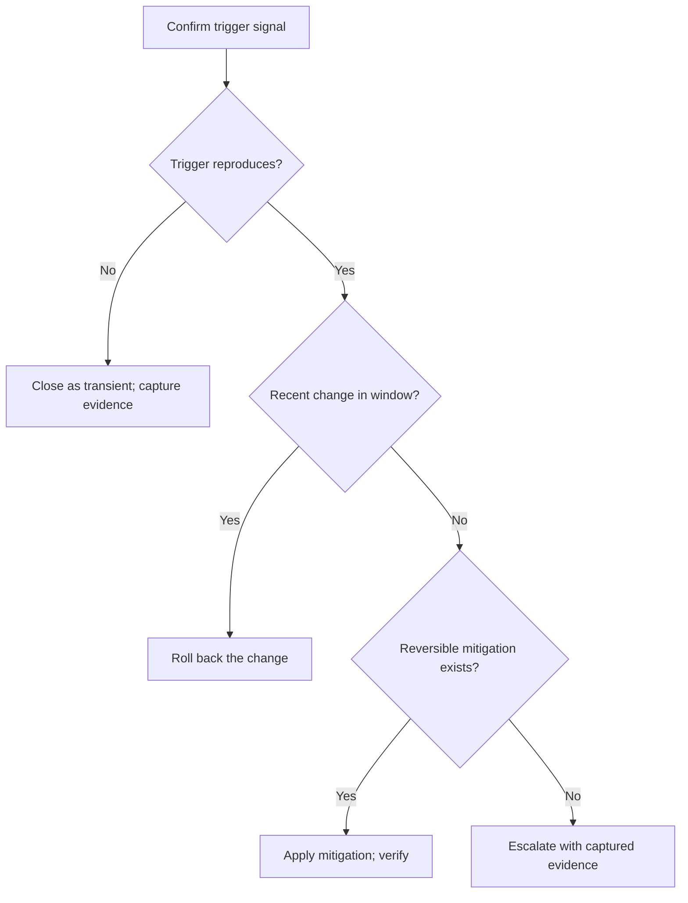

# [RUNBOOK_STANDARDS]

A runbook drives a responder from an observable operational symptom to triage, mitigation, rollback, escalation, recovery verification, and evidence capture under pressure. Lead with the trigger and impact, keep read-only observation ahead of any state change, and end every state-changing step on a check that proves recovery or containment rather than command completion. The responder acts during an active incident, so the page supplies the exact path, not background, severity governance, or a postmortem template. The canonical professional standard for this type is the Google SRE generic-mitigation model — mitigate before full root cause is known, using a closed menu of drain, rollback, restart, and add-capacity actions — and the PagerDuty incident-response model — impact-based severity with a single acting authority, escalation matrix, and a status-update cadence. Anchor every runbook to that standard: a responder who has never seen the system must execute it under pressure without further lookup.

`Source of truth:` Google SRE Workbook (incident-response, on-call) and SRE Book (emergency-response); PagerDuty incident-response documentation and severity-classification guidance. `Last verified:` 2026-06-04. `Review trigger:` SRE or PagerDuty incident-response guidance changes.

## [1][USE_WHEN]

Write a runbook when every condition holds:

- the starting point is an observable operational symptom a responder can name;
- a responder needs safe triage and mitigation, not normal-task instruction;
- rollback, abort, or escalation criteria change what the responder does next;
- response evidence must be captured for handoff or later review.

Route normal repeatable work, contribution workflow, severity and command-role governance, postmortem authoring, gate policy, support-status facts, and topology background to their owning types. The README corpus map resolves the reader need to a type by topic; this standard owns the runbook type only.

## [2][SEVERITY_PROFILES]

A runbook declares its severity-profile rule in `## [1][TRIGGER]`. The profile sets the response clock, who may act, and which sections become required. A trigger that can resolve to two profiles by impact stays one runbook, but the active profile is an invocation field chosen from the table when response begins. The impact-to-severity mapping itself is incident-process truth, named here and owned elsewhere. When the responder cannot tell which profile applies, treat the symptom as the higher severity and downgrade later with captured evidence; the middle of an incident is not the time to debate a profile boundary.

| [INDEX] | [PROFILE]         | [IMPACT]              | [CLOCK]           | [AUTH]        | [PLUS]                  | [ESCALATE]          |
| :-----: | :---------------- | :-------------------- | :---------------- | :------------ | :---------------------- | :------------------ |
|   [1]   | `sev-critical`    | outage/loss/security  | immediate         | on-call       | rollback/comms/evidence | outage/loss/failure |
|   [2]   | `sev-major`       | degraded/budget/cap   | ack window        | on-call scope | rollback, comms         | budget/time breach  |
|   [3]   | `sev-minor`       | contained/pre-failure | next biz/escalate | owning team   | base only               | higher threshold    |
|   [4]   | `sev-maintenance` | planned + abort point | scheduled window  | change owner  | rollback/abort          | abort/overrun       |

Base sections (`# [RECOVER_OBSERVABLE_SYMPTOM]`, the metadata block, `## [1][TRIGGER]`, `## [2][IMPACT]`, `## [3][SAFETY_PREREQUISITES]`, `## [4][TRIAGE]`, `## [5][MITIGATION]`, `## [7][ESCALATION]`, `## [9][VERIFICATION]`) are required for every profile; `## [7][ESCALATION]` is always present, and only its triggering criteria vary by profile as the table's right column states. A `sev-critical` runbook whose trigger has no reversible mitigation must say so in `## [6][ROLLBACK_ABORT]` and require escalation before any irreversible action, not leave rollback silent.

For `sev-critical`, the on-call responder may act; risky actions need a named second.

## [3][PLACEMENT]

Place a runbook where a responder under pressure first looks:

- Shared operational runbook: `docs/runbooks/<symptom-or-system>.md`.
- Owner-local runbook: `{owner}/runbooks/<symptom-or-system>.md`, or the nearest maintained operations corpus for that owner.
- Service-local emergency procedure: beside the service only when local credentials, dashboards, deployment tools, or ownership make a shared page slower to reach during response.

Write one canonical runbook per operational trigger. When two runbooks share a triage or mitigation path, link the canonical one by topic rather than copy the path into both.

## [4][REQUIRED_STRUCTURE]

Use the section set below; each `##` heading is a standalone retrieval unit a responder may open out of order. Order them so impact precedes procedure and read-only triage precedes any mutation.

```markdown template
<!-- source-only: runbook template; fill the metadata block and every base section -->
# [RECOVER_OBSERVABLE_SYMPTOM]

Owner: <owning role or team>
Severity profile: <sev-critical | sev-major | sev-minor | sev-maintenance>
Last verified: YYYY-MM-DD
Review trigger: <alert, dependency, topology, tool, or owner change>

## [1][TRIGGER]

## [2][IMPACT]

## [3][SAFETY_PREREQUISITES]

## [4][TRIAGE]

## [5][MITIGATION]

## [6][ROLLBACK_ABORT]

## [7][ESCALATION]

## [8][COMMUNICATION]

## [9][VERIFICATION]

## [10][EVIDENCE_CAPTURE]

## [11][FOLLOW_UP_CLEANUP]

## [12][BOUNDARIES]

## [13][REVIEW_CHECKLIST]

```

Section cardinality:

- `Owner`, `Severity profile`, `Last verified`, `Review trigger` (required, one each): the metadata block, one `label: value` per line.
- `Trigger` (required, one): the observable signal and the declared severity profile.
- `Impact` (required, one): affected surface and user or business effect.
- `Safety and prerequisites` (required, one): response-critical access, tools, and known-good restore points only.
- `Triage` (required, ordered, repeatable checks): read-only observation, each check followed by its expected signal and its branch.
- `Mitigation` (required, repeatable actions): state-changing steps, each paired with expected result and its verification.
- `Rollback or abort` (required for `sev-critical`, `sev-major`, and `sev-maintenance`; optional for `sev-minor`): reverse action and its check, or an explicit statement that no reverse exists.
- `Escalation` (required for every profile; criteria differ by profile): the observable threshold and the owning role.
- `Communication` (required for `sev-critical` and `sev-major`; optional otherwise): who is notified, on what cadence, and the status-update contents.
- `Verification` (required, one): proof of recovery or containment.
- `Evidence to capture` (required for `sev-critical`; recommended otherwise, repeatable entries): the artifacts to preserve and their storage location.
- `Follow-up cleanup` (optional, repeatable): safety-restoring steps after recovery; not a postmortem.
- `Boundaries` (required, one): one link per adjacent owner for what this runbook deliberately excludes.
- `Review checklist` (required, one): verification gates for the published runbook.

Omit an optional section rather than publishing it empty. `Follow-up cleanup` restores the system to a safe steady state after recovery and is not a postmortem template.

## [5][CONTENT_REQUIREMENTS]

A runbook must carry the concrete facts a cold responder needs, not prose that gestures at them. Each base section has a minimum content bar:

- `Trigger`: the exact alert name, failed check, query, or user-impact phrasing that starts the runbook, plus the declared severity profile. State the observable, not the cause.
- `Impact`: the named affected surface and the user or business effect — error rate, latency breach, tenant scope, or data-integrity symptom — in concrete terms a responder can confirm.
- `Safety and prerequisites`: the exact access roles, break-glass path, dashboard URLs or identifiers, diagnostic tools, known-good backup or build identifier, and the safe execution context. List only prerequisites consumed during this response.
- `Triage`: per check, the exact command, dashboard, query, or UI path; the expected signal; and the branch as `If <signal>, do <action>`. A check the responder cannot execute without further lookup states the judgment input instead of a literal command.
- `Mitigation`: per action, the generic-mitigation class it belongs to (drain, rollback, restart, add capacity, or a named domain action), the exact command or path, the expected result, and the verification check that confirms it.
- `Rollback or abort`: the reverse command and its check, the abort point for a maintenance window, or the plain statement that no reverse exists with the escalation it forces.
- `Escalation`: the observable threshold, the owning role or team, and the escalation message contents.
- `Communication`: the audience, the channel or status page, the update cadence, and the status-update fields.
- `Verification`: the customer-visible, system-visible, and operator-visible signals that prove recovery, named with the metric and threshold each must reach.
- `Evidence to capture`: the named artifacts and their storage location or handoff path.

State a concrete metric and threshold wherever recovery, severity, or escalation turns on one — error rate below the alert threshold, latency under the stated budget, queue depth back to baseline — never an unquantified "healthy" or "recovered."

A `## [5][MITIGATION]` step is the field set most often collapsed to prose, so an authored step carries its class, command, expected result, and verification check as four named lines. An accepted step and a rejected near-miss show the bar:

```markdown conceptual
1. Rollback — the checkout deploy in the incident window is the recent change.
   Command: `rasm deploy rollback --service checkout --to last-known-good`
   Expected result: the pre-change build (`build-2026-05-29`) is live on all checkout pods within two minutes.
   Verify: the checkout error-rate dashboard falls below the 0.5% alert threshold and holds for five minutes.
```

```markdown rejected
1. Roll back the checkout deploy.
   Command: `rasm deploy rollback --service checkout --to last-known-good`
   Expected result: checkout recovers.
```

A `## [4][TRIAGE]` check carries the same density — command, expected signal, and branch on one line each:

```markdown conceptual
1. Confirm the trigger: `rasm metrics checkout --window 15m`.
   Expected signal: checkout 5xx rate above the 0.5% alert threshold.
   If the rate is below threshold, close as transient and capture the metrics snapshot; if at or above, proceed to step 2.
```

## [6][SCOPE_RULES]

- Start from an observable trigger: alert name, failed check, user-impact report, queue depth, breached latency or error budget, data-integrity symptom, deployment failure, or security signal.
- Name the affected surface and the user or business impact before any procedure.
- Keep the runbook on recovery or safe escalation; carry no concept teaching, topology background, or lookup catalog.
- List only prerequisites consumed during response: access, permissions, break-glass path, dashboards, diagnostic tools, known-good backups, and a safe execution context.
- Name background, architecture, API catalogs, contact directories, severity models, communications policy, and postmortem templates by topic; route them to their owners rather than embed them.

## [7][TRIAGE_RULES]

- Put every read-only observation before the first state-changing action.
- Order checks by decision value: confirm the trigger, estimate impact, isolate the failing component, identify recent changes, then choose mitigation, rollback, or escalation.
- Give the exact command, dashboard, query, or UI path when the responder can execute it during the incident without further lookup; when a step needs case-specific judgment, state the judgment input instead of a literal command.
- State the expected signal after each material check, so the responder can read the result without prior context.
- Write each branch as a condition before its action: `If <signal>, do <action>`.
- Preserve evidence before any action that can destroy logs, counters, traces, screenshots, or other volatile state.

Render triage as a status-tagged or ordered check sequence, not flat prose. A numbered list carries each check, its expected signal, and its branch, because order changes the result. When triage forks on two or more independent signals that jointly select mitigation, rollback, or escalation, render the selection as a decision table whose left columns are the signals and whose right column is the action:

```markdown template
| [INDEX] | [RECENT_CHANGE_WINDOW] | [REVERSIBLE_MITIGATION_EXISTS] | [ACTION]                                                |
| :-----: | :--------------------- | :----------------------------: | :------------------------------------------------------ |
|   [1]   | Yes                    |               —                | Roll back the change; verify error rate below threshold |
|   [2]   | No                     |              Yes               | Apply drain or restart; verify recovery signal          |
|   [3]   | No                     |               No               | Escalate with captured evidence; do not mutate          |
```

## [8][MITIGATION_ROLLBACK_ABORT]

- Prefer reversible, bounded, low-blast-radius actions before any broad or capacity-removing change.
- Prefer a generic mitigation that restores service before full root cause is known: drain traffic away from the failing element, roll back the recent change, restart the failing component, or add capacity. Reach for a custom action only when no generic mitigation fits the symptom.
- State who may perform a risky action when acting authority is gated by the severity profile or by access.
- Pair each state-changing action with its expected result and the check that confirms it.
- Mark an automated action safe to run only when it is idempotent or guarded by an explicit precondition stated in the step.
- Give a fallback or escalation path for the case where primary tooling is unavailable.
- State the rollback or abort criterion before any action that can worsen impact, hide evidence, increase load, change data, or remove capacity.
- When rollback is impossible, say so plainly and require escalation before the irreversible action.
- When a rollback alone cannot restore correctness — data corruption, a partially applied migration, or persisted bad state — say so and route to the recovery path rather than implying rollback is sufficient.
- Stop and return to triage or escalate with captured evidence when a verification signal contradicts the assumed cause.

The generic-mitigation menu is the canonical starting set; name the menu as a lookup so a responder selects an action by symptom rather than improvising:

| [INDEX] | [MITIGATION] | [USE_WHEN]                 | [REVERSIBLE]             | [VERIFY]                         |
| :-----: | :----------- | :------------------------- | :----------------------- | :------------------------------- |
|   [1]   | Drain        | bugged element; shiftable  | yes                      | drained element error rate falls |
|   [2]   | Rollback     | recent change introduced   | yes, unless data changed | pre-change signal returns        |
|   [3]   | Restart      | wedged; no bad change      | yes                      | component returns healthy        |
|   [4]   | Add capacity | saturation/capacity impact | yes                      | saturation returns to baseline   |

## [9][ESCALATION_RULES]

Escalation criteria must be observable, and the criteria differ by severity profile. State the threshold that raises severity or hands off:

- impact threshold breached;
- time-in-incident threshold passed without recovery;
- ownership unclear;
- rollback failed or is unavailable;
- required access or break-glass path missing;
- suspected security compromise;
- data-loss risk;
- customer-facing outage;
- primary tooling unavailable.

Name the role or owning team, not an individual, unless the operational corpus requires a named duty contact. State the escalation message contents: trigger, impact, hypothesis, actions taken, evidence captured, and the next unsafe or blocked step.

## [10][COMMUNICATION_RULES]

A `sev-critical` or `sev-major` runbook states how the responder keeps stakeholders informed while the incident is open, because silence during an outage is itself an impact. Communication is not a postmortem and not the escalation message; it is the running status update.

- Name the audience and the channel: incident channel, status page, internal liaison, or customer liaison as the corpus defines them.
- State the update cadence by profile: how often a `sev-critical` incident posts a status update, and the trigger that ends updates.
- Give the status-update fields: current impact, what is confirmed, the action in progress, the next checkpoint time, and whether escalation is active.
- Name the role accountable for updates, not an individual, and route who declares the all-clear.

Render the cadence and audience as a definition block or a small decision table keyed on profile, not as a paragraph the responder must parse mid-incident.

## [11][VERIFICATION_EVIDENCE_RULES]

- Prove recovery or containment, not that a command exited zero.
- Include customer-visible, system-visible, and operator-visible signals when all three change independently; name only the signals that move for this trigger.
- State the metric and threshold each signal must reach, so a responder reads recovery as a falsifiable fact rather than a judgment call.
- Capture alert IDs, timeline anchors, dashboards, commands, logs, traces, deploy or change IDs, ticket or incident links, screenshots, and known gaps.
- Name where evidence is stored when the corpus has a maintained incident record, ticket, object store, or audit path.
- Mark unavailable proof honestly rather than implying a check ran.

A runbook claims a recovery path works, so attach claim-level evidence to drift-prone steps and name the freshness trigger:

```markdown template
Evidence: `rasm deploy rollback --service checkout --to last-known-good` and the
checkout error-rate dashboard returning below the alert threshold
Last verified: 2026-06-04
Review trigger: deploy CLI flags, the rollback target alias, or the alert rule change
```

State an unrun or manual-only check as a review gate rather than asserting a path that was not executed during the last verification.

## [12][FORMAT_CHOICES]

- Use a definition block for the metadata block, one `label: value` per line, not a one-row table.
- Use a numbered list for `Triage` and `Mitigation`, since order changes the result; use peer bullets only for independent observations within one check.
- Use a decision table for a triage fork on two or more independent signals, and a lookup table for the generic-mitigation menu; keep each within the table ceiling that [information-structure.md](../information-structure.md) owns and split by profile or system when it grows past that.
- Use the severity-profile table above for the genuine row-and-column lookup; keep any added table within the same ceiling.
- Fence every command, dashboard query, or copyable artifact and mark its intent: `copy-safe` for a step the responder runs as written, `template` for a fill-in template, `conceptual` for a shape the responder studies, `output-only` for an expected signal, and `rejected` for a near-miss shown to prevent a destructive mistake.
- Use a Mermaid `flowchart` only when triage forks on multiple signals and the branch logic is hard to follow as a numbered list or decision table; keep a linear triage path as a numbered list.

A multi-signal triage decision renders its branch-and-route shape as a flowchart when the decision table cannot hold the sequence:



The text equivalent is the same branch: confirm the trigger, close transient signals, roll back recent changes, apply reversible mitigation when available, and escalate with evidence when no reversible mitigation exists.

Show one accepted command and, where a near-miss is a likely destructive error, one rejected command, each fenced and labeled:

```bash conceptual
# Roll the named service back to the last known-good build.

rasm deploy rollback --service checkout --to last-known-good
```

```bash rejected
# Omits the service and target, so it rolls back the default host.

rasm deploy rollback
```

## [13][MAINTENANCE]

Review a runbook when its trigger, service owner, dashboard, alert rule, command, dependency, topology, rollback path, escalation path, communication cadence, or automation changes. Update it from real incidents when a responder had to invent a check, skip a stale step, ask for hidden context, or perform an undocumented mitigation. Delete or merge a runbook whose trigger no longer exists rather than keep it as a stale alias.

## [14][BOUNDARIES]

- [how-to.md](how-to.md) owns normal repeatable tasks for a competent reader; a runbook responds to an operational symptom and routes normal work there.
- [contributing.md](contributing.md) owns contribution workflow, review collaboration, and pull-request evidence.
- [test-strategy.md](../explanation/test-strategy.md) owns gate policy, gate ownership, and flaky-test handling.
- [support-matrix.md](../reference/support-matrix.md) owns supported versions, platforms, runtimes, deprecation, and end-of-support facts.
- [architecture.md](../explanation/architecture.md) owns topology, structure, and the lookup background a runbook names but does not embed.
- [proof.md](../proof.md) owns evidence strength and the freshness fields a verification step cites.
- [README.md](../README.md) owns reader-need classification, document-type choice, placement, severity-governance routing, and lifecycle; route a draft that serves another reader need there.

## [15][REVIEW_CHECKLIST]

- [ ] Title and `## [1][TRIGGER]` start from an observable symptom.
- [ ] The metadata block carries `Owner`, `Severity profile`, `Last verified`, and `Review trigger`.
- [ ] Exactly one severity profile is declared and its required sections are present.
- [ ] `## [2][IMPACT]` and the affected surface precede any procedure.
- [ ] Safety prerequisites are response-critical only and name exact access, tools, and restore points.
- [ ] `## [4][TRIAGE]` is read-only, ordered ahead of `## [5][MITIGATION]`, and renders multi-signal forks as a decision table or flowchart.
- [ ] Each mitigation step names its generic-mitigation class and pairs an expected result with a recovery check.
- [ ] Risky actions carry rollback or abort criteria stated before the action, and rollback-insufficient cases route to recovery.
- [ ] Escalation criteria are observable and name a role, with contents to send.
- [ ] `## [8][COMMUNICATION]` states audience, cadence, and status fields for `sev-critical` and `sev-major`.
- [ ] Verification names a metric and threshold for each recovery signal, not an unquantified "healthy."
- [ ] Evidence capture is explicit and tied to a storage location or handoff.
- [ ] Every fenced block carries one intent label.
- [ ] Adjacent owners are named by topic in prose and linked once each only in `Boundaries`.
