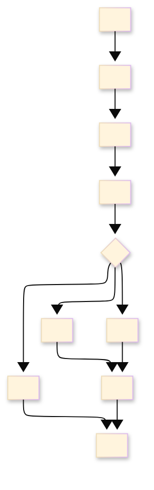

# [RUNBOOK_STANDARDS]

A runbook drives a responder from an observable operational symptom to triage, mitigation, rollback or abort, escalation, recovery verification, and evidence capture under pressure. Lead with the trigger and impact. Keep read-only observation ahead of state change, state mutation permission before risky action, and end every state-changing step on a check that proves recovery or containment rather than command completion.

The responder acts during an active operational condition, so the page supplies the exact response path, not background, severity routing, normal-task instruction, or a postmortem template. Local incident process carries severity names, response clocks, mutation permission, communication cadence, escalation thresholds, and profile tie-breakers. This standard carries response shape, not a universal severity taxonomy.

## [1][USE_WHEN]

Write a runbook when every condition holds:
- the starting point is an observable operational symptom a responder can name;
- a responder needs safe triage and mitigation, not normal-task instruction;
- rollback, abort, mutation permission, or escalation criteria change what the responder does next;
- response evidence must be captured for handoff or later review.

Route normal repeatable work, contribution workflow, severity and command policy, postmortem authoring, gate policy, support-status facts, and topology background to their controlling types. The README corpus map resolves the reader need to a type by topic; this standard carries the runbook type only.

[AUTHORING_CONTRACT]:
- Agent use: start from one observable symptom, prove the local response profile or block mutation, then write the shortest safe triage-to-recovery path.
- Required produced structure: `Trigger`, `Impact`, `Safety prerequisites`, read-only `Triage`, `Mitigation`, `Escalation`, `Verification`, `Evidence capture`, and `Boundaries`.
- Section cardinality: required response sections appear once; rollback/abort, communication, and follow-up cleanup appear only when they change responder action.
- Adjacent checks: check architecture, API/code documentation, support matrix, reference, test strategy, how-to, contributing, onboarding, README, roadmap, and incident-process docs only when they change triage, safe mutation, escalation, verification, or evidence capture.
- Maintenance triggers: update the runbook when trigger, impact surface, permission, dashboard, command, endpoint, support target, API behavior, runtime adapter behavior, rollback path, escalation route, communication cadence, or evidence location changes.

Opening order is fixed for task standards: route and use contract first, produced structure second, cardinality third, then baselines, examples, and local patterns. Do not let response diagrams or profile examples define section order implicitly.

## [2][RESPONSE_BASELINES]

Use local operational truth for the values a responder invokes during an incident. A runbook must provide a clear response path, communication route, working record, impact assessment, mitigation path, and verification rule. A local incident process must map any provider terms into local response profiles before a runbook can use them.

Local incident-process documents, policies, or operations corpora carry profile names, severity or priority terms, response clocks, mutation permission, escalation thresholds, communication requirements, and evidence requirements. A runbook uses those values only when the local corpus maintains them. If no maintained local source exists, profile-dependent mutation is blocked until a source assigns mutation permission.

## [3][RESPONSE_PROFILE]

A runbook declares the local response profile in `## [1][TRIGGER]`. The profile comes from the maintained incident process, not from this standard's vocabulary. It must resolve the impact class, response clock, mutation permission, escalation threshold, communication requirement, and evidence requirement before the responder mutates state.

Render the profile as a definition block in the published runbook so the responder can verify permission before mutation:

```markdown template
Impact class: <local severity, priority, maintenance, or response class>
Response clock: <acknowledgement, mitigation, update, or abort timing>
Mutation permission: <source-confirmed mutation, required permission, or break-glass requirement>
Escalation threshold: <observable condition that raises profile, changes response path, or blocks mutation>
Communication requirement: <reader, channel, cadence, and status fields, or `none`>
Evidence requirement: <artifacts to preserve for handoff, audit, or review>
```

The literal value `none` is allowed only for runbook fields where the domain truly permits no obligation: communication requirement, safe mutation, rollback route, follow-up cleanup, or a local profile field whose maintained incident-process source defines `none`. Do not use `none` as filler for unknown escalation, missing evidence, absent proof, or unverified permission; use a proof gap or blocker instead.

If the responder cannot choose between local profiles from the observable impact, apply the maintained local incident-process tie-breaker. If no maintained tie-breaker exists, stop mutation and escalate for profile assignment with captured evidence; do not import a provider severity default as local policy.

When no maintained incident-process source exists, publish the gap as a profile blocker, not as an invented local profile:

```markdown conceptual
Incident-process source: provisional: no maintained local source
Impact class: provisional; responder cannot assign profile from maintained policy.
Response clock: provisional; escalate for assignment before mutation.
Mutation permission: blocked until the incident-process source confirms mutation permission.
Escalation threshold: missing maintained profile or tie-breaker.
Evidence requirement: capture trigger, impact, triage checks, and blocked action.
```

The response path diagram is optional. Use it only when the runbook needs the responder to see where mutation, rollback, escalation, verification, and evidence fit in one path:



Text equivalent: start from the observable trigger, state impact, confirm safety and permission, run read-only triage, choose mitigation, rollback, or escalation from local profile rules, verify recovery or containment, and capture evidence for handoff or review. `Escalation` is always present; only its triggering criteria vary by local profile.

## [4][PLACEMENT]

Place a runbook where a responder under pressure first looks:
- Shared operational runbook: `docs/runbooks/<symptom-or-system>.md`.
- Scope-local runbook: `<source-area>/runbooks/<symptom-or-system>.md`, or the nearest maintained operations corpus for that source area.
- Service-local emergency procedure: beside the service only when local credentials, dashboards, deployment tools, or source placement make a shared page slower to reach during response.

Write one canonical runbook per operational trigger. When two runbooks share a triage or mitigation path, link the canonical one by topic rather than copy the path into both.

## [5][REQUIRED_STRUCTURE]

Use the section set below; each `##` heading is a standalone retrieval unit a responder may open out of order. The base template includes response-critical universal sections, including evidence capture, so agents do not publish empty profile-gated headings. Add conditional sections only when their trigger applies, and renumber headings in document order.

```markdown template
# [RECOVER_OBSERVABLE_SYMPTOM]

## [1][TRIGGER]

Escalation path: <source, contact path, or procedure for escalation and permission>
Response profile: <local incident-process profile>
Incident-process source: <maintained local source, or `provisional: no maintained local source`>

## [2][IMPACT]

## [3][SAFETY_PREREQUISITES]

## [4][TRIAGE]

## [5][MITIGATION]

## [6][ESCALATION]

## [7][VERIFICATION]

## [8][EVIDENCE_CAPTURE]

## [9][BOUNDARIES]
```

Add these conditional sections only when their trigger applies:

```markdown template
## [N][ROLLBACK_ABORT]

## [N][COMMUNICATION]

## [N][FOLLOW_UP_CLEANUP]

```

Required sections carry response-critical facts: `Trigger` names the observable signal, escalation path, response profile, and incident-process source; `Impact` names the affected surface and user-visible, data-integrity, security, support, or operator-visible effect; `Safety prerequisites` names response-critical access, mutation permission, tools, restore points, and evidence-preservation constraints only; `Triage` is ordered read-only observation; `Mitigation` carries bounded response actions or `Safe mutation: none`; `Escalation` states observable thresholds and path; `Verification` proves recovery or containment; `Evidence capture` preserves handoff artifacts; `Boundaries` routes adjacent standards.

Runbook trigger/profile fields are stable: `Trigger`, `Impact class`, `Response clock`, `Mutation permission`, `Escalation threshold`, `Communication requirement`, and `Evidence requirement`. Use those exact labels before local fields, and do not rename `Trigger` to symptom, signal, incident, or alert in the record surface.

Conditional sections appear only when they change responder action: `Rollback or abort` is required when any action changes state, increases risk, is irreversible, the response profile requires an abort point, or rollback failure changes escalation; `Communication` is required when the local profile demands reader updates; `Follow-up cleanup` restores safe steady state after recovery and is not a postmortem. Omit an optional section rather than publishing it empty.

## [6][CONTENT_REQUIREMENTS]

A runbook must carry the concrete facts a cold responder needs, not prose that gestures at them:

[ENTRY_CONTEXT]:
- `Trigger`: exact alert name, failed check, query, or user-impact phrasing that starts the runbook, plus local response profile. State the observable, not the cause.
- `Impact`: named affected surface and user-visible, data-integrity, security, support, or operator-visible effect — error rate, latency breach, tenant scope, data-integrity symptom, or security signal — in terms a responder can confirm.
- `Safety prerequisites`: exact access requirement, mutation permission, break-glass path, dashboard URLs or identifiers, diagnostic tools, known-good backup or build identifier, evidence-preservation rule, and safe execution context consumed during response.

[RESPONSE_PATH]:
- `Triage`: per check, the command, dashboard, query, UI path, or judgment input; expected signal; and branch as `If <signal>, do <action>`.
- `Mitigation`: per action, the locally supported mitigation class, command or path, expected result, and verification check. If no safe mutation exists, the section carries `Safe mutation: none`, captured evidence, and escalation route.
- `Rollback or abort`: reverse command and check, abort point for a maintenance window, or statement that no reverse exists with the escalation it forces.
- `Escalation`: observable threshold, escalation path, and message contents.
- `Communication`: reader, channel or status page, update cadence, and status-update fields.

[CLOSURE_HANDOFF]:
- `Verification`: customer-visible, system-visible, and operator-visible signals that prove recovery, named with each metric and threshold.
- `Evidence capture`: named artifacts, storage or handoff location, and known gaps.

State a concrete metric and threshold wherever recovery, impact, escalation, or abort turns on one — error rate below the alert threshold, latency under the stated budget, queue depth back to baseline — never a bare health or recovery adjective.

## [7][ACTION_PATTERNS]

Triage and mitigation steps carry command, expected signal, and branch or verification in the step body. This density prevents command-only instructions that hide the recovery condition:

```markdown conceptual
1. Confirm the trigger: `<health-check-command>`.
    Expected signal: the returned machine envelope reports a runtime adapter, endpoint, or host-runtime failure instead of the healthy status.
    If the adapter is healthy, close this runbook as the wrong symptom and capture the run identifier; if the failure remains, proceed to step 2.
```

```markdown conceptual
1. Re-run the smallest affected runtime scenario after the adapter reconnects.
    Class: verification after mitigation.
    Known-good target: the scenario path recorded in the failing runtime evidence.
    Command: `<verify-command> <scenario-or-replay-path>`
    Expected result: the returned machine envelope names the scenario report directory and no first failure.
    Verify: the same scenario passes twice without a stale endpoint-state warning.
```

When the only safe response is escalation, keep `Mitigation` explicit and non-invented:

```markdown conceptual
Safe mutation: none; no maintained rollback, drain, or isolation path applies to this data-integrity signal.
Evidence: alert ID, affected tenant list, failed consistency query, and last successful reconciliation timestamp.
Escalation route: data recovery source with evidence attached; do not mutate until the response source confirms the recovery path.
```

Avoid generic mitigation catalogs. A published runbook may list mitigation classes only when the local operational corpus proves those classes for this trigger and each row carries local evidence. Otherwise, state the one supported action, or state `Safe mutation: none`.

## [8][SCOPE_RULES]

Runbook scope follows these rules:
- Start from an observable trigger: alert name, failed check, user-impact report, queue depth, breached latency or error budget, data-integrity symptom, deployment failure, or security signal.
- Name the affected surface and user-visible, data-integrity, security, support, or operator-visible impact before any procedure.
- Keep the runbook on recovery or safe escalation; carry no concept teaching, topology background, normal-task guide, or lookup catalog.
- List only prerequisites consumed during response: access, mutation permission, break-glass path, dashboards, diagnostic tools, known-good backups, evidence-preservation constraints, and a safe execution context.
- Name background, architecture, API catalogs, contact directories, severity models, communications policy, and postmortem templates by topic; route them to their routes rather than embed them.

When adjacent truth changes what the responder does, carry one operational handoff record at the triage or mitigation step that consumes it:

```markdown template
Changed fact: <blast-radius boundary, response path, supported target, safe-action constraint, API behavior, gate policy, or verification signal>
Consumed by: <triage step, mitigation step, escalation rule, verification check, or evidence packet>
Use in this document: <check, route, mutation decision, escalation, or verification this runbook performs>
Update when: <adjacent source fact, command path, support target, API behavior, gate policy, or incident-process source changes>
Close when: <runbook consumes the fact, the trigger retires, or the adjacent standard routes it away>
Route-away: <topology map, lifecycle table, lookup catalog, normal task, agent ramp, contributor workflow, or policy body that stays in the adjacent standard>
```

Omit the handoff for background-only links. Include it only when adjacent truth changes triage order, safe action, escalation route, verification, or responder routing. Do not use the record to decorate every topology link.

## [9][TRIAGE_RULES]

Triage follows these rules:
- Put every read-only observation before the first state-changing action.
- Order checks by decision value: confirm the trigger, estimate impact, isolate the failing component, identify recent changes, then choose mitigation, rollback, or escalation.
- Give the exact command, dashboard, query, or UI path when the responder can execute it during the incident without further lookup; when a step needs case-specific judgment, state the judgment input instead of a literal command.
- State the expected signal after each material check, so the responder can read the result without prior context.
- Write each branch as a condition before its action: `If <signal>, do <action>`.
- Preserve evidence before any action that can destroy logs, counters, traces, screenshots, or other volatile state.

Render triage as an ordered check sequence, not flat prose. When triage forks on two or more independent signals that jointly select mitigation, rollback, or escalation, render the selection as a decision table whose left columns are the signals and whose right column is the action:

```markdown template
| [INDEX] | [RECENT_CHANGE_WINDOW] | [REVERSIBLE_MITIGATION_EXISTS] | [ACTION]                    |
| :-----: | :--------------------: | :----------------------------: | :-------------------------- |
|   [1]   |          Yes           |               —                | roll back; verify threshold |
|   [2]   |           No           |              Yes               | mitigate; verify recovery   |
|   [3]   |           No           |               No               | escalate; no mutation       |
```

Use a Mermaid `flowchart` only when the branch sequence and rejoin are harder to follow as a numbered list or decision table; do not publish both a decision table and a diagram for the same triage branch.

## [10][MITIGATION_ROLLBACK_ABORT]

Mitigation, rollback, and abort rules split into these groups:

[MITIGATION_SELECTION]:
- Prefer reversible, bounded, low-blast-radius actions before any broad or capacity-removing change.
- Prefer locally supported mitigation classes that restore service before full root cause is known.
- Reach for a custom domain action only when no locally supported general mitigation fits the symptom.
- Give a fallback or escalation path for the case where primary tooling is unavailable.
- State `Safe mutation: none` when no local mitigation is proven, and escalate with captured evidence rather than filling the section with a generic action.

[EXECUTION_SAFETY]:
- State who may perform a risky action when mutation permission is gated by the local response profile or by access.
- Pair each state-changing action with its expected result and the check that confirms it.
- Mark an automated action safe to run only when it is idempotent or guarded by an explicit precondition stated in the step.
- State the rollback or abort criterion before any action that can worsen impact, hide evidence, increase load, change data, or remove capacity.

[ABORT_CONTRADICTION]:
- When rollback is impossible, say so plainly and require escalation before the irreversible action.
- When a rollback alone cannot restore correctness — data corruption, a partially applied migration, or persisted bad state — say so and route to the recovery path rather than implying rollback is sufficient.
- Stop and return to triage or escalate with captured evidence when a verification signal contradicts the assumed cause.

`Mitigation` is required because every runbook must state the safe response route. `Rollback or abort` is conditional because only state-changing, risky, irreversible, or profile-gated actions need a separate reverse path, abort point, or explicit no-reverse statement.

## [11][ESCALATION_EVIDENCE]

Escalation criteria must be observable, and the local response profile decides the threshold. State the condition that raises impact class, changes response path, or blocks mutation: impact threshold breached, time-in-incident threshold passed without recovery, response path unclear, mutation permission missing, required access unavailable, primary tooling unavailable, rollback failed, security compromise suspected, data-loss risk present, or verification contradicting the assumed cause.

Name the escalation path, not an individual, unless the operational corpus requires a named duty contact. State the escalation message contents: trigger, impact, profile, hypothesis, actions taken, evidence captured, and the next unsafe or blocked step.

Communication appears only in the conditional `Communication` section when the local response profile requires reader updates while the incident is open. It is the running status update, not a postmortem and not the escalation message. Name reader, channel, cadence, current impact, confirmed facts, action in progress, next checkpoint, and escalation state.

Evidence capture is always required. Capture alert IDs, timeline anchors, dashboards, commands, logs, traces, deploy or change IDs, ticket or incident links, screenshots, known gaps, and storage or handoff path when the corpus maintains one.

Close criteria are part of `Verification`, not this section. A runbook closes only when the recovery or containment signal meets the stated threshold, no unsafe next step remains unresolved, and the evidence packet names the captured artifacts or the known gap.

Use one packet when escalation, communication, or handoff needs several fields; omit untriggered fields rather than publishing separate forms for each concern:

```markdown template
Trigger: <alert, check, query, or user-impact signal>
Impact: <affected surface and confirmed user-visible, data-integrity, security, support, or operator-visible effect>
Profile: <local response profile, or `provisional: assignment needed`>
Hypothesis: <current working cause, or `unknown`>
Actions taken: <triage and mitigation attempted, with results>
Evidence: <artifacts and storage or handoff path>
Blocked or unsafe next step: <action awaiting permission, access, or escalation decision; omit when not blocked>
Communication: <reader, channel, cadence, and next checkpoint; omit when profile requires none>
Gap: <none, unavailable check, missing access, or unrun check>
```

A runbook claims a recovery path works, so keep the verification details beside the drift-prone step under [proof.md](../proof.md) instead of adding a page-wide stamp. State an unrun or manual-only check as a review gate rather than asserting a path that was not executed during the last verification.

## [12][FORMAT_CHOICES]

Choose the smallest response form that preserves responder action:
- Use a definition block for responder-facing context, one `label: value` per line, not a one-row table.
- Use numbered lists for `Triage` and `Mitigation`, since order changes the result; use peer bullets only for independent observations within one check.
- Use a decision table for a triage fork on two or more independent signals, and a lookup table only for locally supported facts proven for this trigger.
- Fence standalone commands, dashboard queries, or copyable artifacts and mark intent: `copy-safe` for a step the responder runs as written, `template` for a fill-in template, `conceptual` for a shape the responder studies, `output-only` for an expected signal, and `rejected` for a near-miss shown to prevent a destructive mistake. Keep a short command inline when it is one field inside a step record that also carries expected result, verification, and rejection context.
- Use a Mermaid `flowchart` only when response routing or triage forks on multiple signals and the branch logic is hard to follow as a numbered list or decision table; keep a linear triage path as a numbered list.
- Do not duplicate the same branch as prose, decision table, and diagram. Assign one representation to carry the decision and let nearby prose state the invariant or consequence.

Show one step record that carries the accepted command and the rejected near-miss when the near-miss is a likely destructive error. The command alone is not the runbook step; the known-good target, expected result, and verification are part of the safety contract:
Command: `<verify-command> <specific-target>`
Rejected near-miss: `<verify-command>`
Reason: no target, so the responder cannot prove which runtime behavior was checked.

## [13][MAINTENANCE]

Review a runbook when its trigger, service path, dashboard, alert rule, command, dependency, API behavior, public symbol behavior, topology, supported target, rollback path, escalation path, mutation permission, communication cadence, incident-process profile, local incident-process source, gate policy, README emergency route, contribution workflow, agent ramp, or automation changes. Update it from real incidents when a responder had to invent a check, skip a stale step, ask for hidden context, perform an undocumented mitigation, or discover that verification no longer proves recovery. Delete or merge a runbook whose trigger no longer exists rather than keep it as a stale alias.

## [14][BOUNDARIES]

These adjacent standards own routed material:

[TASK_REFERENCE]:
- [how-to.md](how-to.md) carries normal repeatable tasks for a competent reader; a runbook responds to an operational symptom and routes normal work there.
- [contributing.md](contributing.md) carries contribution workflow, review collaboration, and pull-request evidence.
- [test-strategy.md](../explanation/test-strategy.md) carries gate policy, gate routing, and flaky-test handling.
- [support-matrix.md](../reference/support-matrix.md) carries supported versions, platforms, runtimes, deprecation, and end-of-support facts.
- [architecture.md](../explanation/architecture.md) carries topology, structure, and the lookup background a runbook names but does not embed.

[STANDARD_SOURCES]:
- [proof.md](../proof.md) carries evidence strength, freshness, and claim-level evidence details.
- [README.md](../README.md) carries reader-need classification, document-type choice, placement, and lifecycle; it is not an incident-process source.
- Maintained local incident-process, communication-policy, incident-review, and postmortem corpora carry severity routing, cadence, mutation permission, retrospective analysis, and postmortem templates when they exist. When no maintained local incident-process source exists, profile-dependent fields are provisional or blocked and the runbook must escalate before mutation.

## [15][VALIDATION]

Use this verification checklist by group:

[TRIGGER_PROFILE]:
- [ ] Title and `## [1][TRIGGER]` start from an observable symptom.
- [ ] `## [1][TRIGGER]` carries `Escalation path`, `Response profile`, and `Incident-process source`.
- [ ] The response profile comes from local incident-process truth and states impact class, response clock, mutation permission, escalation threshold, communication requirement, and evidence requirement where they apply.
- [ ] If no maintained incident-process source or tie-breaker exists, profile-dependent mutation is blocked or provisional and escalation is required.

[TRIAGE_ACTION]:
- [ ] `## [2][IMPACT]` and the affected surface precede any procedure.
- [ ] Safety prerequisites are response-critical only and name exact access, mutation permission, tools, restore points, and evidence-preservation constraints.
- [ ] `## [4][TRIAGE]` is read-only, ordered ahead of `## [5][MITIGATION]`, and renders multi-signal forks as a decision table or one flowchart.
- [ ] Each mitigation step names its locally supported mitigation class and pairs an expected result with a recovery check, or `Mitigation` states `Safe mutation: none` with captured evidence and escalation route.
- [ ] Risky actions carry mutation permission plus rollback or abort criteria before the action, and rollback-insufficient cases route to recovery.
- [ ] Escalation criteria are observable and name a path, with contents to send.
- [ ] `## [N][COMMUNICATION]` appears only when the local profile requires it and states reader, cadence, and status fields.

[CLOSURE_STRUCTURE]:
- [ ] Verification names a metric and threshold for each recovery signal, not a bare health or recovery adjective.
- [ ] Evidence capture is explicit and tied to a storage location, handoff path, or stated known gap.
- [ ] Every ordinary fenced block carries one intent label.
- [ ] Adjacent routes are named by topic in prose and linked once each only in `Boundaries`.
- [ ] Operational handoff records appear only when adjacent API, code-documentation, README, architecture, support, roadmap, reference, test-strategy, how-to, onboarding, contributing, or incident-process truth changes triage, safe action, escalation, verification, or responder routing.
- [ ] Maintenance triggers cover operational sources, adjacent standards, permission, communication, automation, and real-incident misses.
