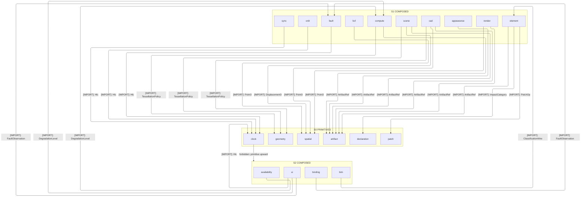
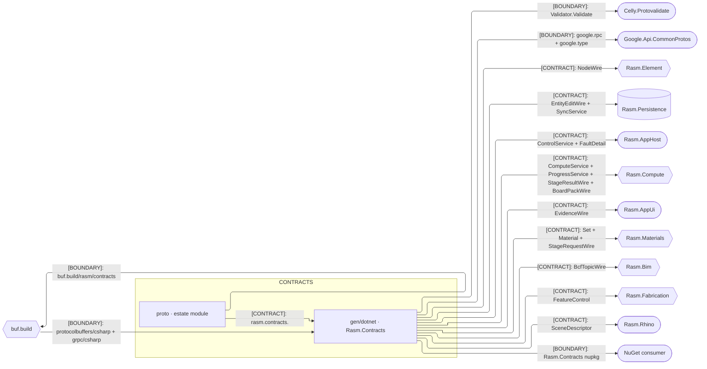
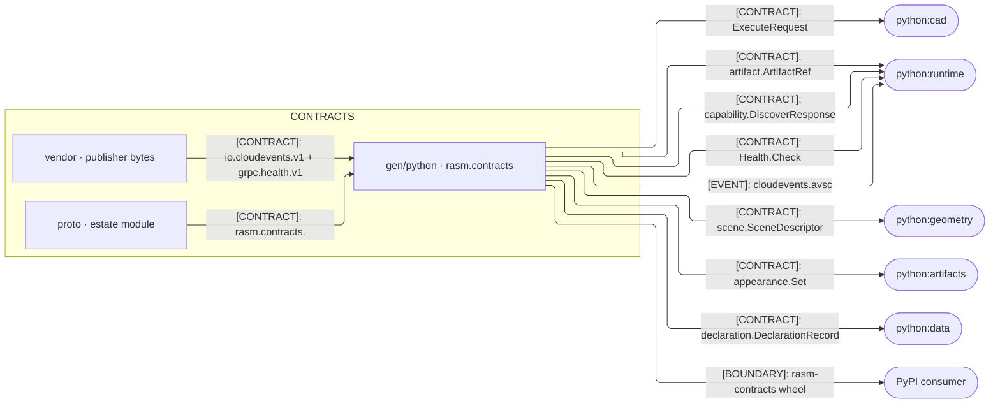
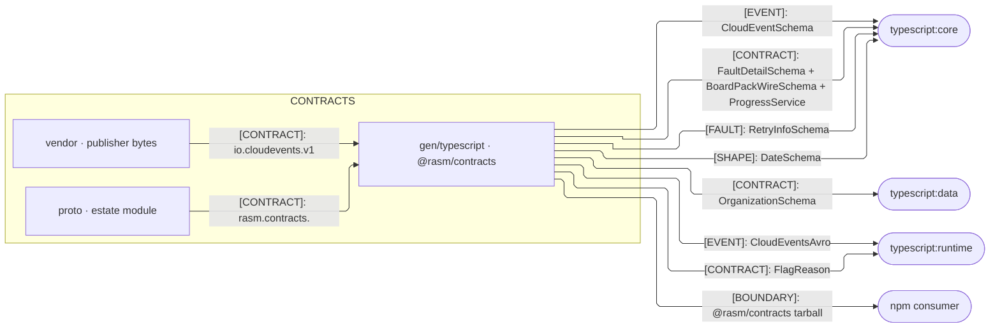
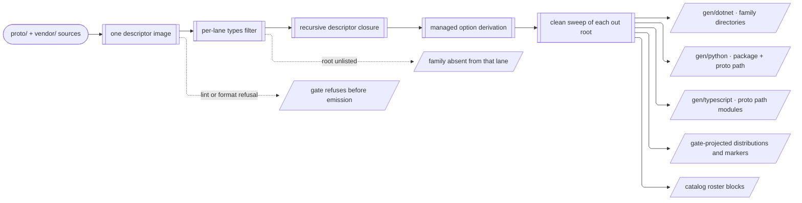

# [CONTRACTS_ARCHITECTURE]

`contracts` maps the estate's one wire corpus onto one descriptor image and three swept emissions: `proto/` defines, `vendor/` freezes, `manifest.json` registers, `conformance/` proves, and `gen/` alone is generated — every file beneath it dies on the next `assay contracts generate`, and everything above it is authored or a manifest. `contracts` owns no domain model, decodes nothing, and validates nothing; each consumer admits generated values at its own boundary, and a peer branch reaches another only through a registered case.

## [01]-[DOMAIN_MAP]

```text
contracts/
├── manifest.json                 # Wire registry: entries, cases, authority, definition, actors, readiness, fingerprinted assets
├── manifest.schema.json          # JSON Schema derived byte-for-byte from the assay msgspec manifest model
├── buf.yaml                      # Gate axis: the named estate module, the unnamed publisher modules, deps, and lint carves
├── buf.gen.yaml                  # Generation axis: one repo-root input, managed derivation, one plugin row per emission target
├── package.json · tsconfig.json  # @rasm/contracts identity; ./* exports gen/typescript sources, tsc --build lands dist
├── pyproject.toml                # rasm-contracts identity; uv_build module root gen/python, rasm.contracts a PEP 420 portion
├── Rasm.Contracts.csproj         # Rasm.Contracts identity; default items off, Compile over gen/dotnet alone, the nx name pin
├── proto/                        # Estate buf module buf.build/rasm/contracts; buf.md fronts it on the BSR
│   └── rasm/contracts/           # One package rasm.contracts.<family> per directory; tails end on the lanes emitting the family
│       ├── appearance/           # Set and Material over OpenPBR, texture packs, HDRI environments · dotnet python typescript
│       ├── artifact/             # ArtifactRef content handle and the ArtifactService fetch and put pair · dotnet python typescript
│       ├── availability/         # CommandAvailability verdicts keyed on the Compute degradation level · dotnet typescript
│       ├── bcf/                  # BCF topic, comment, and viewpoint wires carrying camera, clipping, visibility · dotnet typescript
│       ├── benchmark/            # BenchmarkClaimWire rungs and metrics beside the host fingerprint measured on · dotnet typescript
│       ├── bim/                  # ModelDiffWire element-change shapes over the Element aspect vocabulary · dotnet typescript
│       ├── binding/              # External-binding state with its coerced-value and write-outcome pair · dotnet typescript
│       ├── cad/                  # CadService execute and tessellate over exact-modeling operations and types · python
│       ├── capability/           # DescriptorPinWire cost estimates and the discovery request-response pair · dotnet python typescript
│       ├── clock/                # Hlc hybrid logical stamp every stamped family imports · dotnet python typescript
│       ├── board/                # BoardPackWire dashboard-and-reliability pack with its indicator, panel, burn, and severity enums · dotnet typescript
│       ├── compute/              # ComputeService tessellate, ControlService degradation and drain, ProgressService watch stream · dotnet python typescript
│       ├── crdt/                 # CrdtOpWire register, set, counter, sequence, and presence operation arms · dotnet python typescript
│       ├── credential/           # CredentialPublicWire public half carrying its certificate chain · dotnet typescript
│       ├── declaration/          # DeclarationRecord EPD registry, module, and impact-cell vocabulary · dotnet python typescript
│       ├── element/              # Graph nodes, entity edits, property values, substance, evidence · dotnet typescript
│       ├── event/                # CloudEvents Extensions attribute bag the estate mints over the envelope · dotnet python typescript
│       ├── fabrication/          # FeatureControl datum, segment, and zone vocabulary for machining features · dotnet python
│       ├── fault/                # FaultDetail whose FaultRecovery elects terminal, transient, or RetryInfo · dotnet python typescript
│       ├── feature/              # FlagVerdictWire flag decision with its reason vocabulary · dotnet typescript
│       ├── geometry/             # TessellationPolicy every request and evidence surface naming tolerance shares · dotnet python
│       ├── organization/         # Organization entity tree carrying per-view overrides · dotnet python typescript
│       ├── parity/               # Backend provider capability and artifact-role rows the parity gate reads · dotnet python typescript
│       ├── patch/                # PatchOp RFC 6902 arms the element edit stream carries · dotnet typescript
│       ├── render/               # GeometryResidency meshlet streams beside viewpoint and section-box wires · dotnet typescript
│       ├── scan/                 # GaussianSplatScan splat capture with its format vocabulary · dotnet python
│       ├── scene/                # SceneDescriptor sited sun, photometry, and shading state for a lit scene · dotnet python
│       ├── spatial/              # Point, direction, frame, and curve primitives every geometric family imports · dotnet python typescript
│       ├── stage/                # StageRequestWire and StageResultWire photo-to-PBR inference crossing with its stage, grant, provider, and plane enums · dotnet
│       ├── sync/                 # SyncService pull, push, transfer-set, and checkout over op-log frames beside the SyncCursorWire pair · dotnet
│       └── ui/                   # Command gate, control posture, layout program, evidence timeline · dotnet typescript
├── vendor/<publisher>/           # Frozen publisher bytes — proto module, license, conformance corpus — byte-identical under every lane
├── conformance/<seam>/           # Proof VECTORS a verified case fingerprints: specimens, expected facts, native containers
└── gen/                          # Buf and the gate sweep every generated emission and projected distribution on each run
    ├── dotnet/<Family>/          # protocolbuffers/csharp and grpc/csharp under base_namespace=Rasm.Contracts; family is the directory
    ├── python/rasm/contracts/    # protoc-gen-py and protoc-gen-connectrpc at package and proto path; py.typed and avsc projected
    └── typescript/               # protoc-gen-es at <proto path>_pb.ts; cloudevents_avro.ts projected beside its descriptor
```

## [02]-[STRATA]

`contracts` holds no branch rank: each emission seats at its consuming branch as an admitted import root, and the ladder below ranks the corpus descriptor DAG every emission carries whole. Imports point down, `buf lint` refuses a cycle, and each lane's tree is a consequence of root selection over this one DAG.



- S0 primitives — `artifact`, `clock`, `declaration`, `geometry`, `patch`, and `spatial` import no estate family and ground every rank above.
- S0 law — `clock` and `spatial` carry the widest fan-in, so a field-number move on either re-emits most of every lane's tree at once.
- S0: `benchmark`, `board`, `capability`, `credential`, `event`, `fabrication`, `feature`, `organization`, `parity`, `scan`, `stage` import none.
- S1 composed — every S1 family reaches exactly one rank down, and `cad` is the one family a single lane emits.
- S1 law — `cad`, `compute`, and `scene` pull `TessellationPolicy` from `geometry`, so tolerance vocabulary keeps one owner and no caller copy forms.
- S2 composed — `availability`, `bim`, and `binding` reach S0 only through an S1 owner; `ui` alone adds the S0 `clock` stamp ordering its timeline.
- S2 law — `ui` alone folds two S1 owners — `compute` and `fault` — into one command and evidence surface.
- S0 closure law — `geometry`, `patch`, and `spatial` enter every lane by closure alone, so dropping the root reaching one deletes it.
- `Rasm.Contracts` seats in the .NET branch as one assembly import root, never a stratum: `ProjectReference` inside, `PackageReference` outside.
- `rasm.contracts` seats in the Python branch as PEP 420 import-root portions under `gen/python`, never a stratum: the uv member installs them.
- `@rasm/contracts` seats in the TypeScript branch as one `workspace:*` import root, never a stratum: `./*` resolves each module path.

## [03]-[SEAMS]

Three fences partition one registry by counterpart language. Every corpus-to-emission edge is `[CONTRACT]`, every generated-symbol crossing to a consumer is `[CONTRACT]` spelled from the emission, a publisher-asset crossing is `[EVENT]`, and runtime packages, remote emitters, installers, and the BSR are `[BOUNDARY]`. Each edge collapses every contract between its endpoints at that kind; the consuming folder's own seam registry enumerates the full family.







Peer emissions draw no seam between one another: the three lanes are branches of one generation spine at `[04]-[INTERNAL]`. Publisher bytes cross with their exact resource — `io.cloudevents.v1` lands as generated messages beside the untouched `cloudevents.avsc` a consumer parses rather than transcribes, and `grpc.health.v1` lands as messages beside Connect stubs.

## [04]-[INTERNAL]

```mermaid
---
config:
  layout: elk
  flowchart:
    curve: linear
    padding: 25
---
flowchart LR
    accTitle: Contracts gate spine
    accDescr: How check, generate, and publish share one lane fan under one lease, and where generate commits and publish pushes past the clean verdict.
    Check([assay contracts check]) e1@--> Probe[[plugin probe]]
    Generate([assay contracts generate]) e2@--> Probe
    Publish([assay contracts publish]) e3@--> Resolve[[resolve the main-label commit]]
    Resolve e4@--> Probe
    Probe e5@--> Build[[buf build · bared image]]
    Build e6@--> Lint[[buf lint]]
    Lint e7@--> Format[[buf format --diff over proto/ alone]]
    Format e8@--> Scratch[[buf generate into scratch]]
    Scratch e9@--> Audit[[manifest audit · schema, disk, anchors, derivations, rosters, image]]
    Audit e10@--> Fresh[[byte diff · scratch against committed gen/]]
    Fresh e11@--> Verdict([clean])
    Fresh e12@-->|"generate"| Commit[[commit roots, projections, rosters, schemas under one journal]]
    Verdict e13@-->|"publish"| Reresolve[[re-resolve the unchanged commit]]
    Reresolve e14@--> Push[[buf push --exclude-unnamed --label main]]
    Probe f1@-.->|"plugin missing"| Refused[/gate refuses/]
    Audit f2@-.->|"finding"| Refused
    Fresh f3@-.->|"committed tree stale"| Refused
    Reresolve f4@-.->|"commit moved or label missing"| Refused
```

One descriptor image feeds every lane, and one gate proves every lane. Buf resolves the `libs/contracts` input from the repo root, filters the image per plugin row against that lane's `types:` roster, expands the recursive descriptor closure, derives managed options over that closure, sweeps each `gen/<lane>` out root, and writes the tree; assay then projects the gate-owned distributions beneath the swept roots and rewrites each catalog's roster block from the same image, so an emission and its published grammar cannot disagree.





- One workspace input and one image: every plugin row filters the same descriptor image, so two lanes never disagree on a field number or a rule.
- Root selection rules each lane, never file selection: a `types:` row names a message, method, or service, and Buf expands what that root reaches.
- Managed derivation runs once over the closure; publisher paths ride `managed.disable`, so upstream options survive in each embedded descriptor.
- Sweep-then-project keeps one entrypoint canonical: Buf clears every out root, assay projects distributions and markers back, hand edits die.
- `check` is a local estate proof reaching no registry; `generate` commits through one recovery journal under the same lease; `publish` alone pushes.
- Publish custody is two-resolve: the default-label commit resolves before the gate and re-resolves unchanged just before the irreversible push.

## [05]-[ROUTING]

| [INDEX] | [CHANGE]                    | [OWNER_SURFACE]                          | [SHAPE_OF_THE_EDIT]                                           |
| :-----: | :-------------------------- | :--------------------------------------- | :------------------------------------------------------------ |
|  [01]   | new wire family             | `proto/rasm/contracts/<family>/`         | one package directory declaring `rasm.contracts.<family>`     |
|  [02]   | new lane consumer of a root | `buf.gen.yaml`                           | one `types:` row on that lane's message emitter               |
|  [03]   | new service a lane binds    | `buf.gen.yaml`                           | one method row on that lane's service emitter                 |
|  [04]   | new emission target         | `buf.gen.yaml` + `.api/`                 | one plugin row writing `gen/<target>` and one catalog         |
|  [05]   | new publisher module        | `buf.yaml` + `buf.gen.yaml` + `vendor/`  | one unnamed module row, its carve, one `managed.disable` path |
|  [06]   | publisher asset re-pin      | `vendor/<publisher>/` + `manifest.json`  | new bytes, re-recorded count and SHA-256, regenerate          |
|  [07]   | new registry case           | `manifest.json`                          | one case: authority, definition, actors, readiness            |
|  [08]   | verified proof vectors      | `conformance/<seam>/`                    | vectors keyed by entry id, fingerprinted on the case          |
|  [09]   | remote emitter pin          | `buf.gen.yaml`                           | one `remote:` version beside its `revision`                   |
|  [10]   | local emitter pin           | `pnpm-workspace.yaml` / `pyproject.toml` | one pin moved with the runtime its emission imports           |
|  [11]   | generated runtime row       | that language's central manifest         | one central row paired with the emission manifest row         |

## [06]-[BOUNDARIES]

- `contracts` owns the registry, the estate protos, the frozen publisher bytes, the proof vectors, and the three emissions; no hand code lands here.
- Corpus sources own wire shape, field numbers, and compatibility; reserved ordinals there are the only record of a collapsed field.
- `buf.gen.yaml` owns which families each lane emits: an unlisted root, and everything only it reached, vanish from that lane on the next run.
- Consumers own bounded parsing, rule evaluation, domain admission, and transport binding; every emission ships rules and never a verdict.
- Owned case families ride a oneof at their composition site, so no corpus message declares `google.protobuf.Any` and no payload slot survives.
- Publisher packages keep their package-shipped owners wherever a lane has one; root selection and `managed.disable` both leave them untouched.
- Each emission manifest owns one distribution identity, and workspace and external consumption resolve that same emission.
- Body admission and artifact custody home at `python:runtime/transport`; the emission carries the descriptors they read and none of their code.
- Compatibility is the corpus emission's: a wire change lands in `proto/`, every lane regenerates, and no runtime descriptor diff stands beside it.

## [07]-[REGISTRY]

`manifest.json` registers every process or publisher wire boundary once, same-language process crossings included, and binds each atomic case to one authority class, one machine-resolved definition, its literal actors, and one readiness state. Assay's msgspec model is the grammar, `manifest.schema.json` derives from it, and every cross-field invariant lives in the audit rows.

| [INDEX] | [AUTHORITY]      | [OWES_THE_VALUE]                                          | [ADMITS]                                                 |
| :-----: | :--------------- | :-------------------------------------------------------- | :------------------------------------------------------- |
|  [01]   | `infrastructure` | two or more independent minters, each from its own inputs | corpus definition alone; an unlisted branch owes no mint |
|  [02]   | `domain`         | exactly one semantic producer                             | the exact producer named; peers decode and re-encode     |
|  [03]   | `application`    | an application or external client outside every branch    | a public typed input beside every ingress it names       |
|  [04]   | `publisher`      | an immutable upstream publisher of the definition bytes   | frozen local source, immutable origin, license, SHA-256  |

| [INDEX] | [DEFINITION] | [RESOLVES]                                                                                       |
| :-----: | :----------- | :----------------------------------------------------------------------------------------------- |
|  [01]   | `proto`      | one message FQN and framing off the built image; RPC actors bind the method and direction        |
|  [02]   | `cloudevent` | the CloudEvents protobuf envelope under one application event-type discriminant                  |
|  [03]   | `law`        | one repo cluster `path#[NN]-[CLUSTER]` for a framing seam the type system cannot hold            |
|  [04]   | `publisher`  | the exact publisher format, local source, and immutable upstream origin; publisher cases alone   |
|  [05]   | `schema`     | a DERIVED `json-strict-bundle` from `proto:<fqn>` or `msgspec:<type>`, only for a real evaluator |

| [INDEX] | [ORACLE]               | [PROVES]                                                                                     |
| :-----: | :--------------------- | :------------------------------------------------------------------------------------------- |
|  [01]   | `semantic-conformance` | one specimen decodes to one typed expected-facts asset                                       |
|  [02]   | `semantic-roundtrip`   | protobuf decode, normalized encode, and second decode preserve the value and refuse unknowns |
|  [03]   | `value-parity`         | one independently minted specimen per declared minter decodes to one typed expected value    |
|  [04]   | `external-digest`      | exact non-Protobuf external bytes are the contract                                           |
|  [05]   | `publisher-digest`     | immutable publisher bytes match their recorded upstream custody                              |

- `definition` owns decoder routing and entry `id` derives the `conformance/` directory; neither coordinate repeats on an asset or an actor.
- Every actor binds one live fence and one literal symbol via `anchor` and `coordinate`, then declares `generated`, `package`, or `proof` custody.
- Actor `direction` is `message` or one of the four RPC halves; an RPC actor also binds one exact service method.
- Generated actors alone elect public Buf roots, and descriptor support closure stays generated rather than hand-rostered.
- Readiness is `blocked` — decision-complete authority and actors with exact unmet executable evidence, no vectors — or `verified` with one oracle.
- Every asset records `path`, `role`, `bytes`, and a tagged `xxh128` or `sha256` fingerprint; a publisher asset requires SHA-256.
- Value-parity specimens carry `minter` as `actor_key(minter)` — anchor at coordinate — and expected assets carry their typed `facts_format`.
- Specimen `distributions` rows name where the gate projects its bytes into an emission; only publisher-owned evidence distributes.
- Publisher custody records the immutable repository commit, upstream path, local source, colocated Apache-2.0 license, and license SHA-256.
- Native HDF5 and Matrix Market laws decode through their official readers into typed facts; they are estate contracts, never publisher custody.

## [08]-[ROOT_SELECTION]

- Each lane declares its own root set, so a family exists in a lane only where that lane's emitter lists a root reaching it.
- `cad` is the standing witness one way: Python carries `CadService` and its operation vocabulary, and no C# or TypeScript directory exists for it.
- `ControlService` runs the other way — degradation and drain are C#-only roots — and `grpc.health.v1` generates for Python alone.
- C# and TypeScript elect `ProgressService`; C# alone elects `SyncService` and `stage` for its same-branch process crossings.
- Roots elected in two lanes land the same closure in both, so a shape two lanes emit meets its peer only through the manifest case that binds it.
- Generated trees bind the corpus proto path as their import path in every lane, so a source move re-spells every consumer's import in one pass.
- Descriptors travel with the symbols, which is what lets a consumer evaluate corpus-authored rules without holding the corpus.
