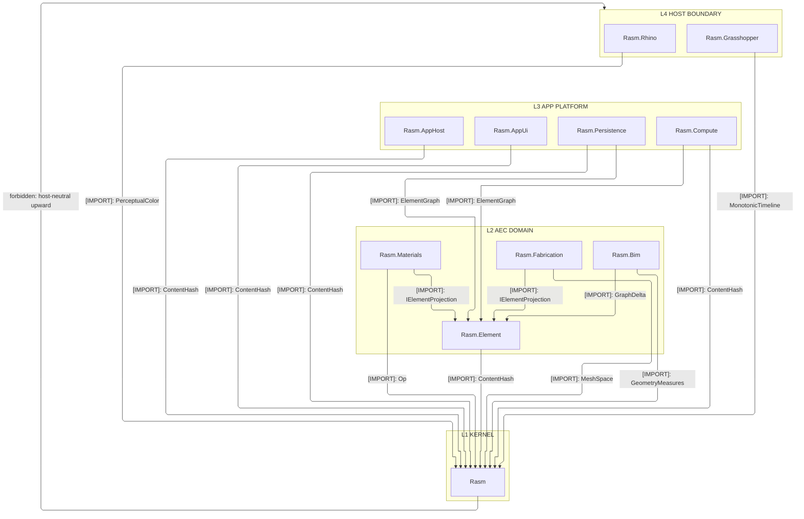
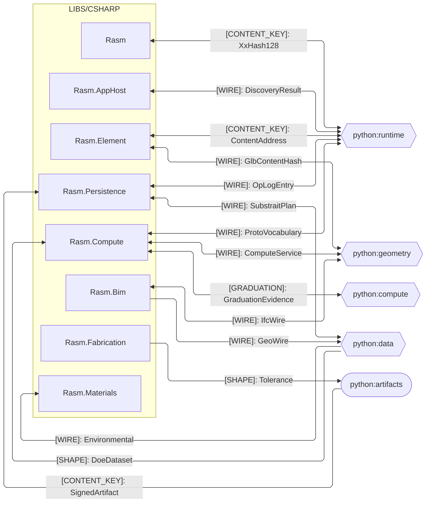
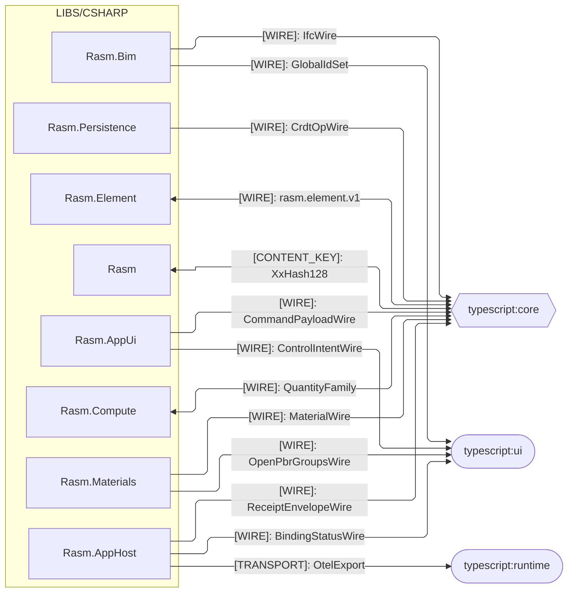
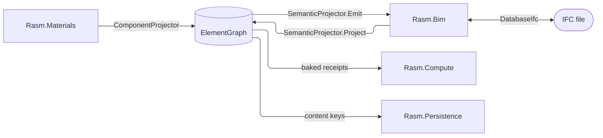
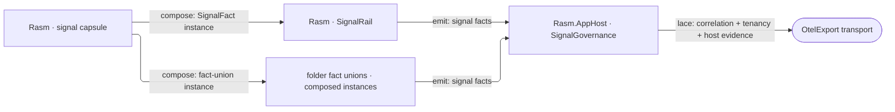

# [CSHARP_BRANCH_ARCHITECTURE]

`libs/csharp` orders the C# packages across the strata under one acyclic, upward-only reference graph: the `Rasm` kernel at the base, the AEC domain and app platform above it, the host boundary at the leaf. Each package's interior is its own architecture's charter; the branch roster, the cross-runtime seams, the cross-package flow spines, and the stratum-permission law are the branch grain.

## [01]-[DOMAIN_MAP]

```text codemap
libs/csharp/
├── Rasm/              # [KERNEL]         RhinoCommon-aware geometry and numeric kernel
├── Rasm.Element/      # [AEC_DOMAIN]     Lowest AEC element seam onto the one ElementGraph
├── Rasm.Materials/    # [AEC_DOMAIN]     Host-neutral profiles, appearance, and construction
├── Rasm.Bim/          # [AEC_DOMAIN]     Host-neutral BIM object model and IFC/glTF/STEP exchange
├── Rasm.Fabrication/  # [AEC_DOMAIN]     Host-neutral fabrication and detailing
├── Rasm.AppHost/      # [APP_PLATFORM]   Runtime spine and app-platform composition root
├── Rasm.Compute/      # [APP_PLATFORM]   Measured tensor, model, and solver execution
├── Rasm.Persistence/  # [APP_PLATFORM]   Durable element, query, and version stores
├── Rasm.AppUi/        # [APP_PLATFORM]   Avalonia product UI shell
├── Rasm.Rhino/        # [HOST_BOUNDARY]  RhinoCommon host APIs; references only Rasm
└── Rasm.Grasshopper/  # [HOST_BOUNDARY]  GH2 host APIs; references only Rasm
```

Planning-scoped packages carry a `.planning/` scaffold of index docs and design pages; `Rasm.Rhino` and `Rasm.Grasshopper` add a folder `.api/` tier over their host assemblies (RhinoCommon + Eto; Grasshopper2 + Eto).

## [02]-[STRATA]

- L1 `Rasm` — references no sibling and carries every stratum above it.
- Shared-machinery homing: a mechanism serving multiple packages homes at the LOWEST stratum every consumer references; a shared owner homed above a consumer's reach manufactures per-folder twins and is the named strata defect.
- L2 AEC domain — `Rasm.Element` references only `Rasm` and mints the one `ElementGraph` seam; the peers (`Rasm.Materials`, `Rasm.Bim`, `Rasm.Fabrication`) reference `{Rasm, Rasm.Element}`, never a peer — alignment travels seam contracts and the content-keyed wire.
- L3 app platform — `Rasm.AppHost` references only `Rasm`, a PORT peer decoding Persistence shapes without a downward reference; `Rasm.Persistence` references `{Rasm, Rasm.Element}` and persists the `ElementGraph` as system of record; `Rasm.Compute` reads it one-way; `Rasm.AppUi` references downward only and aligns with peers by contract, never by reference.
- L4 host boundary — `Rasm.Rhino` and `Rasm.Grasshopper` reference only `Rasm` and enter at the host app root; no host-neutral package references them.



## [03]-[SEAMS]

Every cross-runtime seam is data-bearing: the peer decodes the content-keyed wire without re-minting. Each edge freezes the single load-bearing contract at its partner grain, spelled verbatim from the owning package page; companion wires fold to the package pages, which enumerate the per-shape bytes. Two fences partition by peer runtime. Graduation crosses one seam: python's `HandoffAxis` names the forward receipt axis, and C# owns the reverse evidence envelope as `GraduationEvidence`, python-spelled `EvidenceBundle`.





## [04]-[INTERNAL]

`Rasm.Element`, `Rasm.Materials`, and `Rasm.Bim` meet at one seam — the `ElementGraph`: Element owns what a thing IS, Materials what a thing is MADE OF, Bim what a thing MEANS in IFC. Materials seeds and projects components onto the graph, Bim lowers foreign IFC onto it and re-authors IFC off it, and every cross-package fact travels as graph content — neither projector reaches into the other.



Two projection surfaces, both declared in `Rasm.Element`, are the only cross-package contracts: `IElementProjection` (Materials' `ComponentProjector`, Bim's `SemanticProjector`) and `IGraphConstraint` (Bim's `IfcLegality`, rejecting an illegal delta at composition time). Owners mint their own identity at their own seam — Materials the deterministic Type node, Bim the per-ingest rooted id — and nothing re-mints a peer's.

Materials carries IFC names only as neutral `IfcBinding` row data; Bim never re-derives section geometry or material data; Element never carries a fact only one projector understands. A consumer that needs the thing reads the graph; a consumer that needs the IFC meaning reads Bim's projection; nothing reads across. A canonical seam surface changes only through an explicit brief entry naming the owner and the migration.

Signal crosses the strata on one fabric: the OTel-free signal capsule is kernel L1 vocabulary every stratum composes as instances, per-folder fact unions are the only legitimate per-folder signal types, and the app platform alone laces OTel, correlation, tenancy, and host evidence over the composed surface — telemetry leaves the branch opaque on the `[TRANSPORT]` seam.



Exact per-stage wiring lives on the owning implementation pages.

## [05]-[ROUTING]

Every extension lands on a canonical owner — a row where possible, a compiler-forced arm on the one dispatch site otherwise. Each owner's page carries the full growth law; this table routes and never restates it.

| [INDEX] | [CHANGE]                    | [OWNER_SURFACE]                          | [SHAPE_OF_THE_EDIT]                         |
| :-----: | :-------------------------- | :--------------------------------------- | :------------------------------------------ |
|  [01]   | new component family        | `ComponentFamily` + one seed page        | one policy row + seed row table             |
|  [02]   | new section shape           | `SectionProfile` + `SectionSolver.Solve` | one union arm + one dispatch arm            |
|  [03]   | new IFC entity or category  | emitter + `ClassIntroductions`           | regenerate + one overlay row                |
|  [04]   | new property or detail      | `DetailSchema`                           | one schema row                              |
|  [05]   | new relation semantics      | sub-kind rows or `Generic` attributes    | one row or attribute convention             |
|  [06]   | new quantity or dimension   | `QuantityRow`, `Dimension`               | one mint row or member                      |
|  [07]   | new fault or band           | owning `*Fault` union + `FaultBand`      | one union case or one registry row          |
|  [08]   | new seam participant        | `IElementProjection` + `FaultBand`       | one projector + one band row                |
|  [09]   | new folder signal surface   | the folder's composed capsule instance   | one fact case, point row, or instrument row |
|  [10]   | new capsule mechanism       | kernel signal capsule (`Rasm`)           | one member on the one mechanism             |
|  [11]   | new OTel wiring or exporter | `Rasm.AppHost` `SignalGovernance`        | one governance row; lacing stays L3         |

## [06]-[ADMISSION_POLICY]

Root `Directory.Packages.props` owns NuGet package admission and central version pins; per-package `.csproj` manifests stay label-grouped by owner and carry no versions. Host assemblies (RhinoCommon, Grasshopper2, Eto) enter only through the host-boundary packages' folder `.api/` tiers; no host-neutral package names a host assembly.
