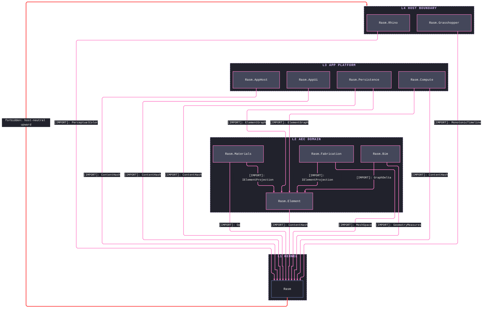
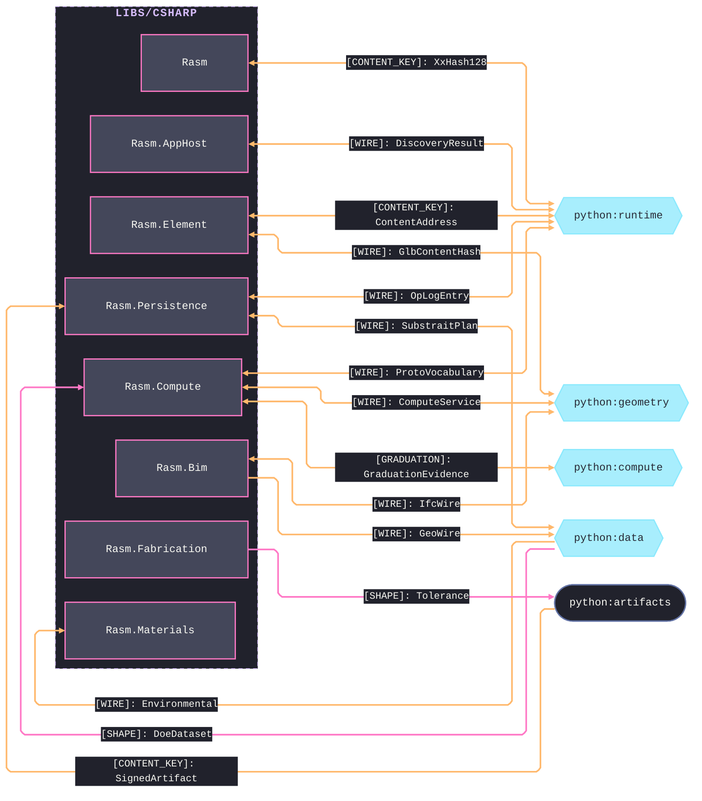
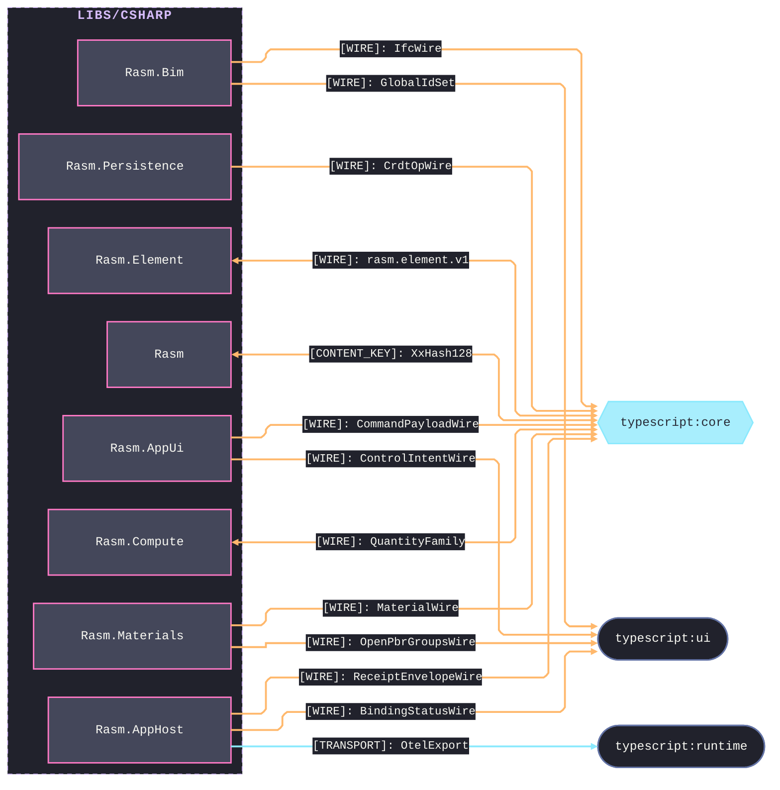

# [CSHARP_BRANCH_ARCHITECTURE]

`libs/csharp` orders the C# packages across the strata under one acyclic, upward-only reference graph: the `Rasm` kernel at the base, the AEC domain and app platform above it, the host boundary at the leaf. Each package's interior is its own architecture's charter; the branch roster, the cross-runtime seams, and the stratum-permission law are the branch grain.

## [01]-[PACKAGE_ROSTER]

```text codemap
libs/csharp/
├── Rasm/              # [KERNEL]        RhinoCommon-aware geometry and numeric kernel
├── Rasm.Element/      # [AEC_DOMAIN]    Lowest AEC element seam onto the one ElementGraph
├── Rasm.Materials/    # [AEC_DOMAIN]    Host-neutral profiles, appearance, and construction
├── Rasm.Bim/          # [AEC_DOMAIN]    Host-neutral BIM object model and IFC/glTF/STEP exchange
├── Rasm.Fabrication/  # [AEC_DOMAIN]    Host-neutral fabrication and detailing
├── Rasm.AppHost/      # [APP_PLATFORM]  Runtime spine and app-platform composition root
├── Rasm.Compute/      # [APP_PLATFORM]  Measured tensor, model, and solver execution
├── Rasm.Persistence/  # [APP_PLATFORM]  Durable element, query, and version stores
├── Rasm.AppUi/        # [APP_PLATFORM]  Avalonia product UI shell
├── Rasm.Rhino/        # [HOST_BOUNDARY] RhinoCommon host APIs; references only Rasm
└── Rasm.Grasshopper/  # [HOST_BOUNDARY] GH2 host APIs; references only Rasm
```

Planning-scoped packages carry a `.planning/` scaffold of index docs and design pages; `Rasm.Element` is the lowest AEC seam the AEC peers and app-platform stores depend up on. `Rasm.Rhino` and `Rasm.Grasshopper` add a folder `.api/` tier over their host assemblies (RhinoCommon + Eto; Grasshopper2 + Eto) and reference only the `Rasm` kernel.

## [02]-[STRATA]

- L1 `Rasm` — references no sibling and carries every stratum above it.
- L2 AEC domain — `Rasm.Element` references only `Rasm` and mints the one `ElementGraph` seam; the peers (`Rasm.Materials`, `Rasm.Bim`, `Rasm.Fabrication`) reference `{Rasm, Rasm.Element}`, never a peer — alignment travels seam contracts and the content-keyed wire.
- L3 app platform — `Rasm.AppHost` references only `Rasm`, a PORT peer decoding Persistence shapes without a downward reference; `Rasm.Persistence` references `{Rasm, Rasm.Element}` and persists the `ElementGraph` as system of record; `Rasm.Compute` reads it one-way; `Rasm.AppUi` references downward only and aligns with peers by contract, never by reference.
- L4 host boundary — `Rasm.Rhino` and `Rasm.Grasshopper` reference only `Rasm` and enter at the host app root; no host-neutral package references them.



## [03]-[SEAMS]

Every cross-runtime seam is data-bearing: the peer decodes the content-keyed wire without re-minting. Each edge freezes the single load-bearing contract at its partner grain, spelled verbatim from the owning package page; companion wires fold to the package pages, which enumerate the per-shape bytes. Two fences partition by peer runtime. Graduation crosses one seam: python's `HandoffAxis` names the forward receipt axis, and C# owns the reverse evidence envelope as `GraduationEvidence`, python-spelled `EvidenceBundle`.





Owning package pages enumerate the per-shape bytes; each diagram edge is the single load-bearing contract at its partner grain.

## [04]-[ADMISSION_POLICY]

Root `Directory.Packages.props` owns NuGet package admission and central version pins; per-package `.csproj` manifests stay label-grouped by owner and carry no versions. Host assemblies (RhinoCommon, Grasshopper2, Eto) enter only through the host-boundary packages' folder `.api/` tiers; no host-neutral package names a host assembly.
