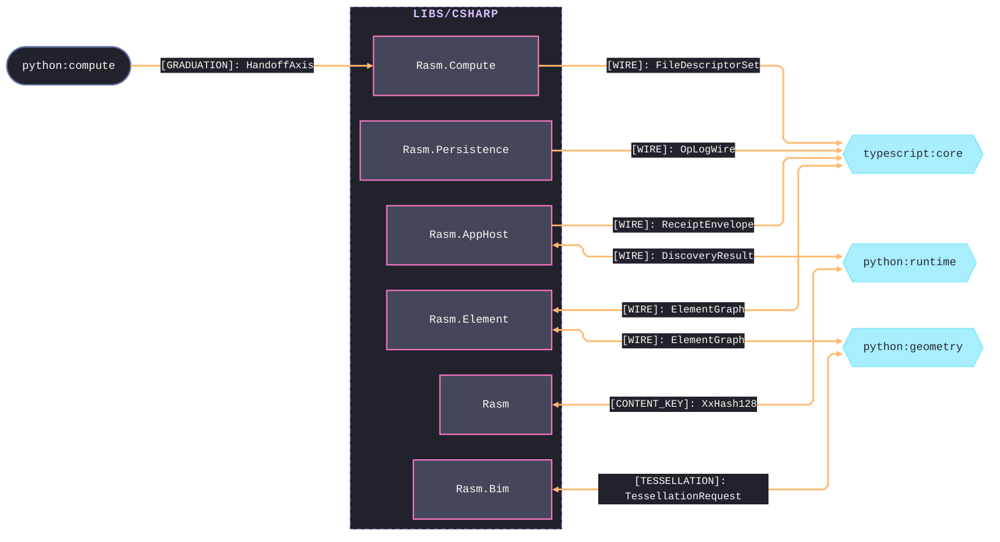
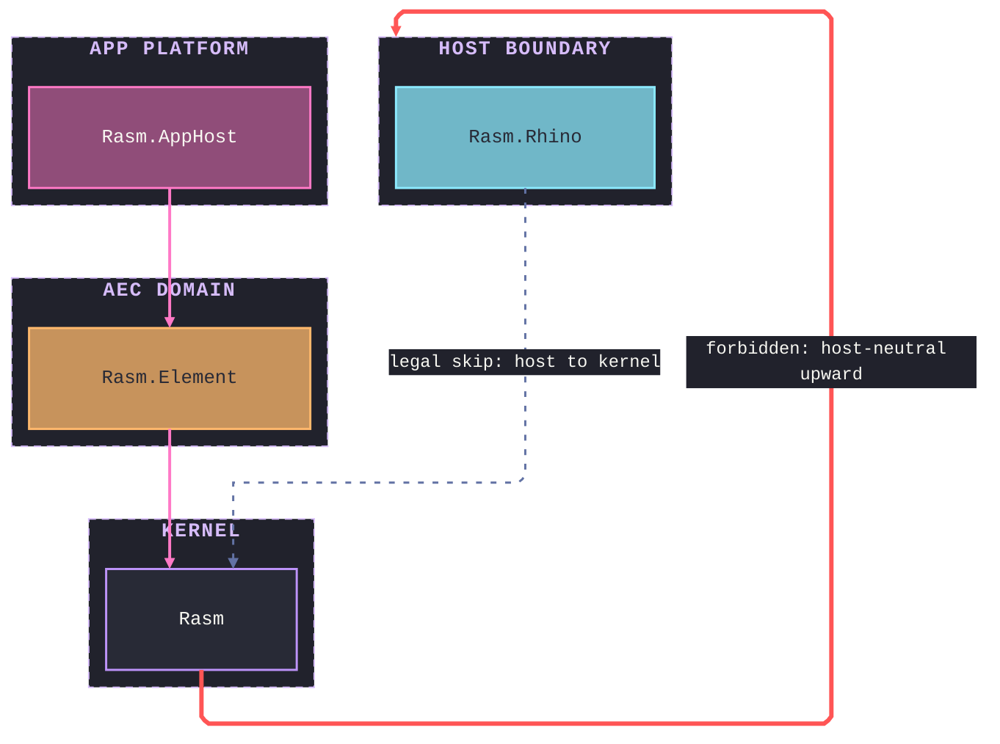

# [CSHARP_BRANCH_ARCHITECTURE]

`libs/csharp` orders the C# packages across the strata under one acyclic, upward-only reference graph: the `Rasm` kernel at the base, the AEC domain and app platform above it, the host boundary at the leaf. Each package's interior is its own architecture's charter; the branch roster, the cross-runtime seams, and the stratum-permission law are the branch grain.

## [01]-[PACKAGE_ROSTER]

```text codemap
libs/csharp/
├── Rasm/              # [KERNEL]        RhinoCommon-aware geometry and numeric kernel
├── Rasm.Element/      # [AEC_DOMAIN]    Lowest AEC element seam onto the one ElementGraph
├── Rasm.Materials/    # [AEC_DOMAIN]    Host-neutral profiles, appearance, and construction
├── Rasm.Bim/          # [AEC_DOMAIN]    Host-neutral BIM object model and IFC/glTF/STEP exchange
├── Rasm.Fabrication/  # [AEC_DOMAIN]    Host-neutral fabrication and detailing
├── Rasm.AppHost/      # [APP_PLATFORM]  Runtime spine and app-platform composition root
├── Rasm.Compute/      # [APP_PLATFORM]  Measured tensor, model, and solver execution
├── Rasm.Persistence/  # [APP_PLATFORM]  Durable element, query, and version stores
├── Rasm.AppUi/        # [APP_PLATFORM]  Avalonia product UI shell
├── Rasm.Rhino/        # [HOST_BOUNDARY] RhinoCommon host APIs; references only Rasm
└── Rasm.Grasshopper/  # [HOST_BOUNDARY] GH2 host APIs; references only Rasm
```

Planning-scoped packages carry a `.planning/` scaffold of four index docs and design pages; `Rasm.Element` is the lowest AEC seam the AEC peers and app-platform stores depend up on. `Rasm.Rhino` and `Rasm.Grasshopper` add a folder `.api/` tier over their host assemblies (RhinoCommon + Eto; Grasshopper2 + Eto) and reference only the `Rasm` kernel.

## [02]-[SEAMS]



Every cross-runtime seam is data-bearing: the peer decodes the content-keyed wire without re-minting. Owning package pages enumerate the per-shape bytes; each diagram edge is the single load-bearing contract at its partner grain.

## [03]-[DEPENDENCY_DIRECTION]

Dependency is strictly upward through the strata, acyclic, with the kernel at the base, `Rasm.AppHost` the app-platform composition root, and the host shells at the leaf. Downward references are legal including skips; no host-neutral package references a host-boundary package.



- KERNEL: `Rasm` references no sibling and carries every stratum above it.
- AEC seam: `Rasm.Element` references only `Rasm`, names no IFC or provider package; the AEC peers and app-platform stores reference it.
- AEC peers: each references `{Rasm, Rasm.Element}`, never a peer, never upward; alignment travels seam contracts and the content-keyed wire.
- APP-PLATFORM root: `Rasm.AppHost` references only `Rasm`; a PORT peer decoding Persistence shapes without a downward `Rasm.Persistence` reference.
- APP-PLATFORM stores: `Rasm.Persistence` references `{Rasm, Rasm.Element}` and persists the `ElementGraph`; `Rasm.Compute` reads it one-way.
- APP-PLATFORM leaves: `Rasm.Compute` and `Rasm.AppUi` reference downward only; `Rasm.AppUi` stays pure-UI, no AEC-domain or host-boundary reference.
- HOST-BOUNDARY: `Rasm.Rhino` and `Rasm.Grasshopper` reference only `Rasm` and enter at the host app root; no host-neutral package references them.
