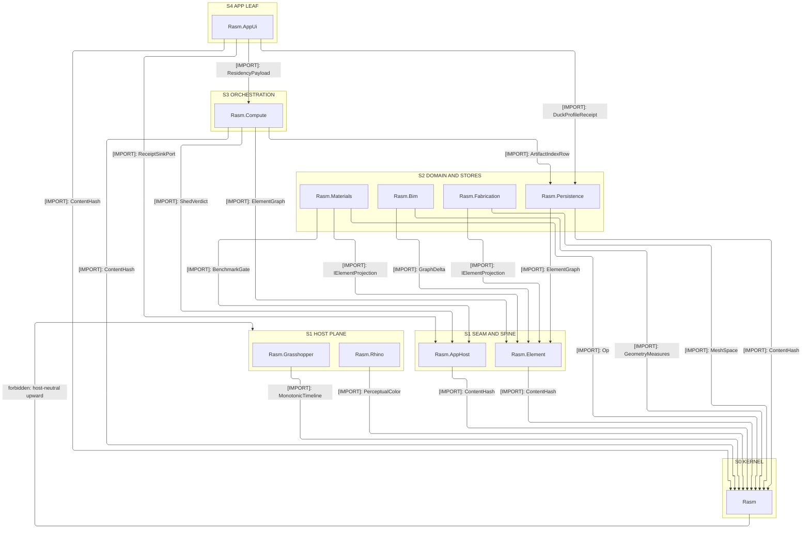
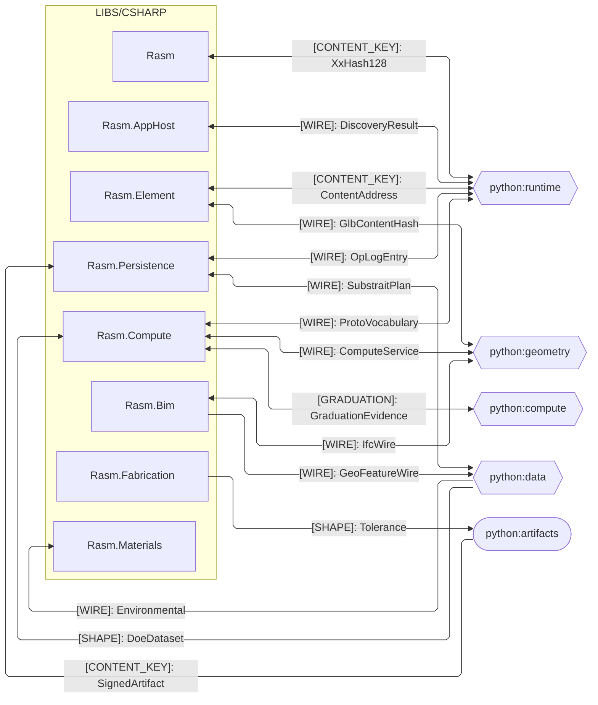
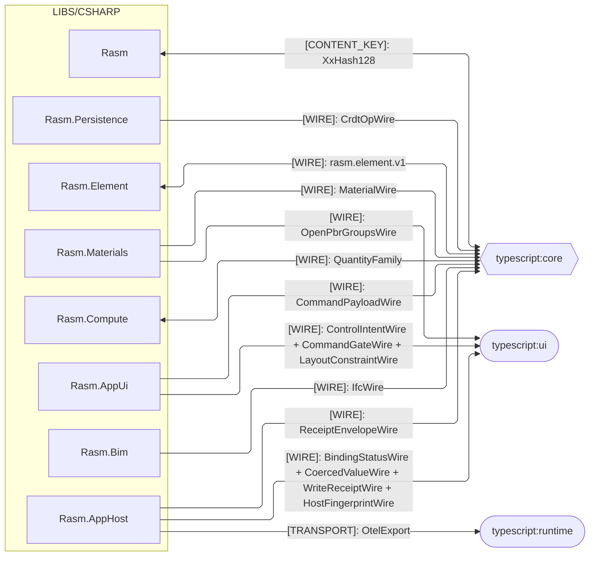
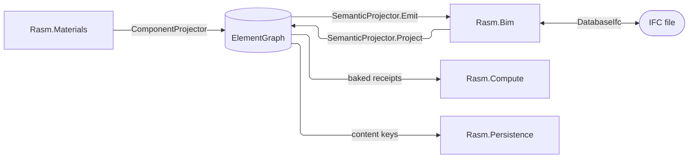
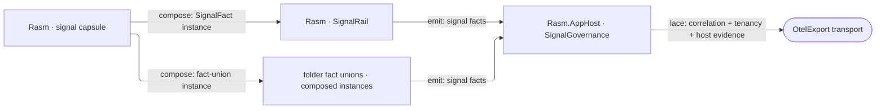

# [CSHARP_BRANCH_ARCHITECTURE]

`libs/csharp` orders the C# packages across the strata under one acyclic, upward-only reference graph: the `Rasm` kernel at the base, the seam and runtime spine above it, the AEC domain and stores over those, and orchestration under the app-platform leaf, with the host boundary a plane-distinct pair beside the spine. Each package's interior is its own architecture's charter; the branch roster, the cross-runtime seams, the cross-package flow spines, and the stratum-permission law are the branch grain.

## [01]-[DOMAIN_MAP]

```text codemap
libs/csharp/
├── Rasm/              # [KERNEL]         RhinoCommon-aware geometry and numeric kernel
├── Rasm.Element/      # [AEC_DOMAIN]     Lowest AEC element seam onto the one ElementGraph
├── Rasm.Materials/    # [AEC_DOMAIN]     Host-neutral profiles, appearance, and construction
├── Rasm.Bim/          # [AEC_DOMAIN]     Host-neutral BIM object model and IFC/glTF/STEP exchange
├── Rasm.Fabrication/  # [AEC_DOMAIN]     Host-neutral fabrication and detailing
├── Rasm.AppHost/      # [APP_PLATFORM]   Runtime spine and app-platform composition root
├── Rasm.Compute/      # [APP_PLATFORM]   Measured tensor, model, and solver execution
├── Rasm.Persistence/  # [APP_PLATFORM]   Durable element, query, and version stores
├── Rasm.AppUi/        # [APP_PLATFORM]   Avalonia product UI shell
├── Rasm.Generation/   # [APP_PLATFORM]   Layout, generation, and assembly orchestration onto kernel geometry
├── Rasm.Rhino/        # [HOST_BOUNDARY]  RhinoCommon host APIs; references only Rasm
└── Rasm.Grasshopper/  # [HOST_BOUNDARY]  GH2 host APIs; references only Rasm
```

Planning-scoped packages carry a `.planning/` scaffold of index docs and design pages; `Rasm.Rhino` and `Rasm.Grasshopper` add a folder `.api/` tier over their host assemblies (RhinoCommon + Eto; Grasshopper2 + Eto). `Rasm.Generation` is the branch's one target package — it turns a sited occurrence, inherited generative data, construction primitives, and bond/layout policy into kernel geometry; the map seats it, `libs/.planning/planning-targets.md` registers it, and its folder lands with its first design page.

## [02]-[STRATA]

Rank is reference depth, not domain family: two packages share a rank only when neither reaches the other, so the app platform spreads across four ranks rather than wearing one label. Domain charter and rank are orthogonal — `[01]-[DOMAIN_MAP]` names the family a package serves, this table names what it may reference.

- S0 kernel — `Rasm` references no sibling and carries every rank above it.
- S1 seam — `Rasm.Element` references only `Rasm` and mints the one `ElementGraph` seam.
- S1 spine — `Rasm.AppHost` references only `Rasm` and PORT-decodes store shapes without a downward reference.
- S1 law — the seam and the spine never reference each other, so a package composes either alone.
- S1 host plane — `Rasm.Rhino` and `Rasm.Grasshopper` reference only `Rasm`, sit outside the host-neutral graph, and enter at the host app root.
- S1 host law — bake stays at the host boundary, no host-neutral package references it, and the two boundaries never reference each other.
- S2 domain — `Rasm.Bim`, `Rasm.Fabrication`, and `Rasm.Materials` reference `{Rasm, Rasm.Element}`.
- S2 benchmark — `Rasm.Materials` adds `Rasm.AppHost` for its stamped benchmark receipt alone.
- S2 stores — `Rasm.Persistence` references `{Rasm, Rasm.Element}` and persists the `ElementGraph` as system of record.
- S2 law — S2 members never reference each other; alignment travels seam contracts and the content-keyed wire.
- S3 reads — `Rasm.Compute` references `{Rasm, Rasm.Element, Rasm.AppHost, Rasm.Persistence}` and reads the system of record one-way.
- S3 generation — `Rasm.Generation` depends up on the kernel, the seam, and the AEC peers, and nothing references it downward.
- S3 law — the two S3 members never reference each other, and generation composes the kernel's geometry operations rather than owning primitives.
- S4 leaf — `Rasm.AppUi` references `{Rasm, Rasm.AppHost, Rasm.Compute, Rasm.Persistence}` and stays the consuming leaf, never the composition root.
- S5 app shell — `apps/<host>/<Plugin>/` shells seat outside `libs/csharp` and compose the app platform with the host boundary.
- S5 shell law — composition-root surfaces home at the app shell; a package blocked on the shell waits rather than pulling composition down.


```mermaid
---
config:
  layout: elk
  flowchart:
    curve: linear
    padding: 25
---
flowchart TB
    accTitle: C# branch package reference strata
    accDescr: Five host-neutral ranks from the app-platform leaf down to the kernel beside a plane-distinct host boundary at the seam rank — every reference edge downward and solid, labeled edges naming one sourced type, no edge inside any rank, and one forbidden host-neutral upward edge.
    subgraph S4["S4 APP LEAF"]
        AppUi[Rasm.AppUi]
    end
    subgraph S3["S3 ORCHESTRATION"]
        Compute[Rasm.Compute]
    end
    subgraph S2["S2 DOMAIN AND STORES"]
        Bim[Rasm.Bim]
        Materials[Rasm.Materials]
        Fabrication[Rasm.Fabrication]
        Persistence[Rasm.Persistence]
    end
    subgraph S1["S1 SEAM AND SPINE"]
        Element[Rasm.Element]
        AppHost[Rasm.AppHost]
    end
    subgraph HOST["S1 HOST PLANE"]
        Rhino[Rasm.Rhino]
        Grasshopper[Rasm.Grasshopper]
    end
    subgraph S0["S0 KERNEL"]
        Rasm[Rasm]
    end
    Rhino -->|"[IMPORT]: PerceptualColor"| Rasm
    Grasshopper -->|"[IMPORT]: MonotonicTimeline"| Rasm
    Element -->|"[IMPORT]: ContentHash"| Rasm
    AppHost -->|"[IMPORT]: ContentHash"| Rasm
    Persistence -->|"[IMPORT]: ElementGraph"| Element
    Persistence -->|"[IMPORT]: ContentHash"| Rasm
    Materials -->|"[IMPORT]: IElementProjection"| Element
    Materials -->|"[IMPORT]: Op"| Rasm
    Materials -->|"[IMPORT]: BenchmarkGate"| AppHost
    Bim -->|"[IMPORT]: GraphDelta"| Element
    Bim -->|"[IMPORT]: GeometryMeasures"| Rasm
    Fabrication -->|"[IMPORT]: IElementProjection"| Element
    Fabrication -->|"[IMPORT]: MeshSpace"| Rasm
    Compute -->|"[IMPORT]: ElementGraph"| Element
    Compute -->|"[IMPORT]: ContentHash"| Rasm
    Compute -->|"[IMPORT]: ShedVerdict"| AppHost
    Compute -->|"[IMPORT]: ArtifactIndexRow"| Persistence
    AppUi -->|"[IMPORT]: ContentHash"| Rasm
    AppUi -->|"[IMPORT]: ReceiptSinkPort"| AppHost
    AppUi -->|"[IMPORT]: ResidencyPayload"| Compute
    AppUi -->|"[IMPORT]: DuckProfileReceipt"| Persistence
    Rasm -->|"forbidden: host-neutral upward"| HOST
```

## [03]-[SEAMS]

Every cross-runtime seam is data-bearing: the peer decodes the contract-conforming wire without re-minting. Each edge freezes the single load-bearing contract at its partner grain, spelled verbatim from the owning package page; per-shape byte detail folds to the package pages. Two fences partition by peer runtime. Graduation crosses one seam: python's `HandoffAxis` names the forward receipt axis, and C# spells the reverse evidence envelope `GraduationEvidence` against python's `EvidenceBundle`.


```mermaid
---
config:
  layout: elk
  flowchart:
    curve: linear
    padding: 25
---
flowchart LR
    accTitle: C# branch python seam registry
    accDescr: C# packages exchanging kinded contract shapes with the python packages — data-bearing kinds and shape contracts as labeled edges — bidirectional peers as hexagons, one-way sources and sinks as stadiums.
    subgraph csharp[LIBS/CSHARP]
        Rasm[Rasm]
        Element[Rasm.Element]
        Bim[Rasm.Bim]
        Materials[Rasm.Materials]
        Fabrication[Rasm.Fabrication]
        AppHost[Rasm.AppHost]
        Compute[Rasm.Compute]
        Persistence[Rasm.Persistence]
    end
    PyRuntime{{python:runtime}}
    PyGeometry{{python:geometry}}
    PyCompute{{python:compute}}
    PyData{{python:data}}
    PyArtifacts([python:artifacts])
    Rasm <-->|"[CONTENT_KEY]: XxHash128"| PyRuntime
    Element <-->|"[WIRE]: GlbContentHash"| PyGeometry
    Element <-->|"[CONTENT_KEY]: ContentAddress"| PyRuntime
    Bim <-->|"[WIRE]: IfcWire"| PyGeometry
    Bim -->|"[WIRE]: GeoFeatureWire"| PyData
    PyData -->|"[WIRE]: Environmental"| Materials
    Fabrication -->|"[SHAPE]: Tolerance"| PyArtifacts
    AppHost <-->|"[WIRE]: DiscoveryResult"| PyRuntime
    Compute <-->|"[WIRE]: ComputeService"| PyGeometry
    Compute <-->|"[WIRE]: ProtoVocabulary"| PyRuntime
    Compute <-->|"[GRADUATION]: GraduationEvidence"| PyCompute
    PyData -->|"[SHAPE]: DoeDataset"| Compute
    Persistence <-->|"[WIRE]: OpLogEntry"| PyRuntime
    PyArtifacts -->|"[CONTENT_KEY]: SignedArtifact"| Persistence
    Persistence <-->|"[WIRE]: SubstraitPlan"| PyData
```


```mermaid
---
config:
  layout: elk
  flowchart:
    curve: linear
    padding: 25
---
flowchart LR
    accTitle: C# branch typescript seam registry
    accDescr: C# packages producing kinded wires the typescript core, runtime, and ui domains decode — data-bearing wires and the telemetry transport edge, labeled per kind — bidirectional peers as hexagons, one-way sinks as stadiums.
    subgraph csharp[LIBS/CSHARP]
        Rasm[Rasm]
        Element[Rasm.Element]
        Compute[Rasm.Compute]
        Persistence[Rasm.Persistence]
        Bim[Rasm.Bim]
        Materials[Rasm.Materials]
        AppUi[Rasm.AppUi]
        AppHost[Rasm.AppHost]
    end
    TsCore{{typescript:core}}
    TsUi([typescript:ui])
    TsRuntime([typescript:runtime])
    Rasm <-->|"[CONTENT_KEY]: XxHash128"| TsCore
    Element <-->|"[WIRE]: rasm.element.v1"| TsCore
    Compute <-->|"[WIRE]: QuantityFamily"| TsCore
    Persistence -->|"[WIRE]: CrdtOpWire"| TsCore
    Bim -->|"[WIRE]: IfcWire"| TsCore
    Materials -->|"[WIRE]: MaterialWire"| TsCore
    AppUi -->|"[WIRE]: CommandPayloadWire"| TsCore
    AppHost -->|"[WIRE]: ReceiptEnvelopeWire"| TsCore
    Materials -->|"[WIRE]: OpenPbrGroupsWire"| TsUi
    AppUi -->|"[WIRE]: ControlIntentWire + CommandGateWire + LayoutConstraintWire"| TsUi
    AppHost -->|"[WIRE]: BindingStatusWire + CoercedValueWire + WriteReceiptWire + HostFingerprintWire"| TsUi
    AppHost -->|"[TRANSPORT]: OtelExport"| TsRuntime
```

## [04]-[INTERNAL]

`Rasm.Element`, `Rasm.Materials`, and `Rasm.Bim` meet at one seam — the `ElementGraph`: Element owns what a thing IS, Materials what a thing is MADE OF, Bim what a thing MEANS in IFC. Materials seeds and projects components onto the graph, Bim lowers foreign IFC onto it and re-authors IFC off it, and every cross-package fact travels as graph content — neither projector reaches into the other.


```mermaid
---
config:
  layout: elk
  flowchart:
    curve: linear
    padding: 25
---
flowchart LR
    accTitle: AEC triad projection spine
    accDescr: Materials and Bim projecting onto the one ElementGraph seam, Bim exchanging IFC files, and the app-platform packages consuming the graph by receipt and content key.
    Materials[Rasm.Materials]
    Bim[Rasm.Bim]
    Graph[(ElementGraph)]
    Ifc([IFC file])
    Compute[Rasm.Compute]
    Persistence[Rasm.Persistence]
    Materials e1@-->|"ComponentProjector"| Graph
    Bim e2@-->|"SemanticProjector.Project"| Graph
    Graph e3@-->|"SemanticProjector.Emit"| Bim
    Bim e4@<-->|"DatabaseIfc"| Ifc
    Graph e5@-->|"baked receipts"| Compute
    Graph e6@-->|"content keys"| Persistence
```

Two projection surfaces, both declared in `Rasm.Element`, are the only cross-package contracts: `IElementProjection` (Materials' `ComponentProjector`, Bim's `SemanticProjector`) and `IGraphConstraint` (Bim's `IfcLegality`, rejecting an illegal delta at composition time). Owners mint their own identity at their own seam — Materials the deterministic Type node, Bim the per-ingest rooted id — and nothing re-mints a peer's.

Materials carries IFC names only as neutral `IfcBinding` row data; Bim never re-derives section geometry or material data; Element never carries a fact only one projector understands. Consumers needing the thing read the graph; consumers needing the IFC meaning read Bim's projection; nothing reads across. Canonical seam surfaces change only through an explicit brief entry naming the owner and the migration.

Signal crosses the strata on one fabric: the OTel-free signal capsule is kernel S0 vocabulary every stratum composes as instances, per-folder fact unions are the only legitimate per-folder signal types, and the app platform alone laces OTel, correlation, tenancy, and host evidence over the composed surface — telemetry leaves the branch opaque on the `[TRANSPORT]` seam.


```mermaid
---
config:
  layout: elk
  flowchart:
    curve: linear
    padding: 25
---
flowchart LR
    accTitle: C# branch signal fabric spine
    accDescr: The kernel signal capsule composing as its own kernel rail and as per-folder fact-union instances, both emitting signal facts into the AppHost governance lacing, and the laced series leaving on the OtelExport transport seam.
    Capsule[Rasm · signal capsule]
    KernelRail[Rasm · SignalRail]
    Folders[folder fact unions · composed instances]
    Governance[Rasm.AppHost · SignalGovernance]
    Egress([OtelExport transport])
    Capsule e1@-->|"compose: SignalFact instance"| KernelRail
    Capsule e2@-->|"compose: fact-union instance"| Folders
    KernelRail e3@-->|"emit: signal facts"| Governance
    Folders e4@-->|"emit: signal facts"| Governance
    Governance e5@-->|"lace: correlation + tenancy + host evidence"| Egress
```

Exact per-stage wiring lives on the owning implementation pages.

## [05]-[ROUTING]

Every extension lands on a canonical owner — a row where possible, a compiler-forced arm on the one dispatch site otherwise. Each owner's page carries the full growth law; this table routes and never restates it.

| [INDEX] | [CHANGE]                    | [OWNER_SURFACE]                          | [SHAPE_OF_THE_EDIT]                         |
| :-----: | :-------------------------- | :--------------------------------------- | :------------------------------------------ |
|  [01]   | new component family        | `ComponentFamily` + one seed page        | one policy row + seed row table             |
|  [02]   | new section shape           | `SectionProfile` + `SectionSolver.Solve` | one union arm + one dispatch arm            |
|  [03]   | new IFC entity or category  | emitter + `ClassIntroductions`           | regenerate + one overlay row                |
|  [04]   | new property or detail      | `DetailSchema`                           | one schema row                              |
|  [05]   | new relation semantics      | sub-kind rows or `Generic` attributes    | one row or attribute convention             |
|  [06]   | new quantity or dimension   | `QuantityRow`, `Dimension`               | one mint row or member                      |
|  [07]   | new fault or band           | owning `*Fault` union + `FaultBand`      | one union case or one registry row          |
|  [08]   | new seam participant        | `IElementProjection` + `FaultBand`       | one projector + one band row                |
|  [09]   | new folder signal surface   | the folder's composed capsule instance   | one fact case, point row, or instrument row |
|  [10]   | new capsule mechanism       | kernel signal capsule (`Rasm`)           | one member on the one mechanism             |
|  [11]   | new OTel wiring or exporter | `Rasm.AppHost` `SignalGovernance`        | one governance row; lacing stays S2         |

## [06]-[ADMISSION_POLICY]

Root `Directory.Packages.props` owns NuGet admission as one `PackageVersion` row per package; each `.csproj` carries the bare `PackageReference`, label-grouped by owner and versionless. Every admission moves its whole touch-point set together: central row, consuming `.csproj` reference, folder `README.md` registry card, and owning `.api` tier.

Root `Directory.Build.props` owns every host-assembly `Reference` and its `HintPath`, resolved from one overridable host-bundle path property and gated by the RhinoCommon-, Grasshopper-, and host-UI-aware flags project classification sets. Each `.csproj` names host NAMESPACES as `Using` rows and never the assembly, so classification drives the reference and a host package carries no manifest row; `System.Drawing.Common` alone holds both a central row and a gated host reference. `Rasm` is RhinoCommon-aware by charter and the host boundaries add Grasshopper2 and Eto; folder `.api/` tiers catalog those surfaces rather than admitting them, and no package outside the gated set carries a host-aware flag.
