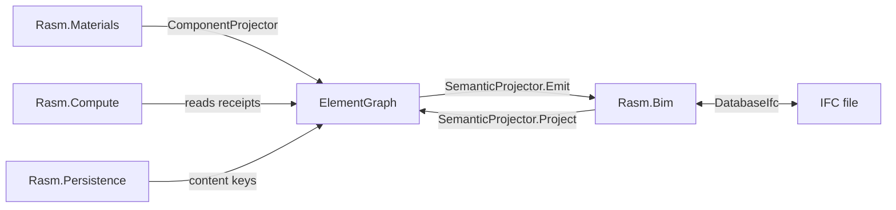

# [COMPONENT_SYSTEM]

`Rasm.Element`, `Rasm.Materials`, and `Rasm.Bim` form one three-way system: Element owns what a thing IS, Materials owns what a thing is MADE OF, and Bim owns what a thing MEANS in IFC. Every extension — a new family, a new section shape, a new IFC category, a new property — is a row or a compiler-forced arm on one of a small set of canonical owners, never a new class hierarchy, a new switch, or a parallel vocabulary. This page carries the model and the extension recipes; the per-package design pages carry the fences.

## [01]-[TRIAD]

The three packages meet at one seam: the `ElementGraph`. Materials seeds and projects components onto it, Bim raises IFC files onto it and lowers it back to IFC, and neither package reaches into the other — every cross-package fact travels as graph content. The conceptual flow:

Direction is load-bearing. Materials carries IFC names only as neutral `IfcBinding` row data, never as a vocabulary; Bim never re-derives section geometry or material data; Element never carries a fact that only one projector understands. The two projection surfaces — both declared in `Rasm.Element` — are the only cross-package contracts: `IElementProjection` (Materials' `ComponentProjector`, Bim's `SemanticProjector`) and `IGraphConstraint` (Bim's `IfcLegality`). A consumer that needs the thing reads the graph; a consumer that needs the IFC meaning reads Bim's projection; nothing reads across.

## [02]-[THING_MODEL]

A thing is a `Node` in the `ElementGraph` — host-neutral, IFC-neutral, identity-minted through one kernel `XxHash128` regime (seed zero, one hasher) with 3 mints. An occurrence `Object` gets a sortable Guid-v7 placement id (`NodeId.Rooted` — two identical placements stay distinct things); a Type `Object` gets the deterministic hash of its `Representations`-excluded seed (`NodeId.RootedType` — identical components deduplicate to one Type); every other node gets the content hash of its full canonical bytes, so identical content is the same node everywhere and any content change is a new identity.

[NODE_ANATOMY]:
- Identity: content mints derive from `ToCanonicalBytes` — every collection in the encoding is count-prefixed and self-delimiting, so the byte stream is injective.
- Properties: typed `PropertyValue` entries in `PropertyBag` sets; seam-shared names come from Element's `DetailSchema` rows, never local strings.
- Quantities: SI-coerced `MeasureValue` entries quantized to `Header.Tolerance` in the canonical bytes; seam-typed mints flow through `QuantityRow` rows so quantity names, dimensions, and SI scales stay byte-stable.
- Classifications: `Classification("ifc", code)` plus `PredefinedType` carry the IFC binding as neutral data — the seam holds codes, never entity rosters.
- Relations: edges in the closed 5-kind `Relationship` algebra plus `Generic`; `ComposeKind` carries composition semantics (ordered nesting rides a `Generic` ordinal attribute, not a typed-case change).

Type and occurrence are one mechanism, not two models. A Type node derives its `NodeId.RootedType` from the representation-excluded seed (designation, classification, predefined type), an occurrence binds to it through one `Assign` edge (`TypeDefinition` kind, authored by the projector that mints the Type), and the `Bake` fold resolves inheritance — occurrence facts first, Type facts second — into the derived `Element`, the one flat read every consumer sees, never a stored record. Adding a fact to a Type is therefore one write that every occurrence inherits.

The graph's change model is `GraphDelta`: content-addressed diffs whose canonical bytes obey the same injective encoding. Persistence stores nodes and deltas by content key; nothing in the triad re-mints identity.

The triad's error rail is one registry: every `*Fault` union reads its `Code` from the `FaultBand` `[SmartEnum<int>]` registry in `Rasm.Element` — one row per band with an `Owner` column (Component 2300, Generation 2350 reserved, Geometry 2400, Material 2450, Projection 2470, Element 2500, Bim 2600, Fabrication 2700) — and a duplicate band integer fails at type initialization.

## [03]-[MATERIALS_PLANE]

Materials answers what a thing is made of and how it is realized, and its whole design is family-as-data: one polymorphic component owner whose variation lives in rows, not types.

[MATERIALS_OWNERS]:
- `ComponentFamily`: THE policy row. One smart-enum row per family (masonry, CMU, steel, timber, glazing, reinforcement, fastener, connector, joint, panel) carrying `ComponentClass`, `DetailLane`, and the admission, cross-nominal, and seed-fold delegates. A family is a row, never a subclass; its `IfcBinding` is seed-computed per component row from the family's own token vocabulary, never stored on the family.
- `SectionProfile`: the closed section algebra — one 21-arm union covering every admitted cross-section, constructed only through each arm's railed `Of` (invalid dimensions fault, never throw). Geometry lives here; family rows admit arms through their admission predicate.
- `SectionSolver` and `ComputedSection`: one solver's exhaustive `Solve` dispatch lowers any `Sectioned` row's profile to the one computed-section receipt (20 columns, order frozen at the seam); `Layered` and `Nominal` are unsectioned by design and fault loudly; consumers read the receipt through the Op-free `graph.SectionOf`, never the solver.
- `ComponentCatalogue` and `ComponentRow`: the runtime catalogue folds every family's seed rows into one fail-loud lookup surface (`Of`/`Lookup`), so "what components exist" is one fold over data; `ComponentRow.Sectioned` pins section membership as row data.
- `ComponentDetail`: the seed-time bag constructor. Family detail bags write through `DetailSchema` rows so every property name is seam vocabulary.
- `SectionCapacity`: the closed 5-case capacity union (`RcInteraction`, `RcElastic`, `SteelLrfd`, `TimberEc5`, `MasonryCompression`); one polymorphic `Check(Demand)` folds any applied action to the typed `Utilisation` verdict — a new family's capacity is one case plus one `Check` arm, never a per-section-type check family.

Seed rows are DATA with sourcing law: a value is REFLECTED (emitted from a machine-readable schema) over DELEGATED (computed by an admitted vendor factory) over AUTHORED (restated verbatim where no producer exists), and every column carries provenance — VENDOR, DEFINED, or PUBLISHED. A hand-written value where a producer exists is a defect.

`ComponentProjector : IElementProjection` is the plane's one exit: it captures components onto the graph — mints deterministic Type nodes through `NodeId.RootedType`, seeds their bags, authors the occurrence-to-Type `Assign` edges, and lowers computed sections through `QuantityRow`-minted seam quantities. Materials owns no IFC names beyond the `IfcBinding` data on its rows.

## [04]-[BIM_PLANE]

Bim is the sole IFC semantic authority, and its vocabulary is reflected. An offline emitter reflects the `IfcClass` vocabulary from the GeometryGym schema assembly with one committed row per entity and per-token `PredefinedRow` schema spans, then applies `ClassIntroductions`, `AbstractSupertypes`, `Retirements`, `DomainRoots`, and `DomainOverrides`. Regenerating the vocabulary re-runs the emitter; hand edits to generated output are defects.

[BIM_OWNERS]:
- `IfcClass`: the generated vocabulary — one row per entity carrying domain, schema span, `Instantiable`, and its `PredefinedRow` token spans; `Resolve`/`Canonical` fold ingress strings onto rows, and the per-token `AdmitPredefined` gates egress. IFC entities exist as vocabulary rows here and nowhere else.
- `SemanticProjector : IElementProjection`: both halves of the IFC seam — `Project` raises a captured `DatabaseIfc` into a `GraphDelta`, and `Emit` lowers the `ElementGraph` back to IFC by reading `Classification("ifc", code)` and `PredefinedType` through the vocabulary. Ordered nests lower to `IfcRelNests` with `RelatedObjects` order taken from the `Generic` ordinal attribute.
- `IfcLegality : IGraphConstraint`: IFC-semantic legality as composition-time graph constraints — containment, void, type-material, and the two vocabulary arms (roster membership, predefined-token validity) reject a bad delta before it lands; the schema-span rank gate runs at egress inside `AdmitPredefined`.
- Pset egress: property sets lower from the graph's generic property bags; standard-Pset naming decisions live here and only here.
- IDS: specifications lower onto the `ElementSet`/`ElementPredicate` query algebra; `ifctester` verdicts arrive as `IdsVerdict` rows and reconcile through `IdsAudit.Reconcile`; the live `ifc` tooling inspects and tessellates but never re-authors semantics.

## [05]-[EXTENSION_RECIPES]

Every extension lands on a canonical owner — a row where possible, a compiler-forced arm on the one dispatch site otherwise. If an extension seems to need a new class hierarchy, a new switch, or a second vocabulary, the extension is being done wrong — find the owning surface below.

| [INDEX] | [CHANGE]                   | [OWNER_SURFACE]                          | [SHAPE_OF_THE_EDIT]                |
| :-----: | :------------------------- | :--------------------------------------- | :--------------------------------- |
|  [01]   | new component family       | `ComponentFamily` + one seed page        | one policy row + seed row table    |
|  [02]   | new section shape          | `SectionProfile` + `SectionSolver.Solve` | one union arm + one dispatch arm   |
|  [03]   | new IFC entity or category | emitter + `ClassIntroductions`           | regenerate + one overlay row       |
|  [04]   | new property or detail     | `DetailSchema`                           | one schema row                     |
|  [05]   | new relation semantics     | `Relationship.Generic` attributes        | one attribute convention           |
|  [06]   | new quantity or dimension  | `QuantityRow`, `Dimension`               | one mint row or member             |
|  [07]   | new fault or band          | owning `*Fault` union + `FaultBand`      | one union case or one registry row |
|  [08]   | new seam participant       | `IElementProjection` + `FaultBand`       | one projector + one band row       |

[NEW_FAMILY]:
- Edit: add one `ComponentFamily` row (class, lane, admission predicate, cross-nominal selector, `Rows` fold) in Materials `Component/component.md` and author the seed page as a sibling `Component/<family>.md` — policy smart-enums, the standards-data row table with per-column provenance, the `Rows` fold constructing through `Component.Of` inside `Traverse`, seed-computed `IfcBinding` from the family's own token vocabulary, and seed-time `ComponentDetail` bags through `DetailSchema`.
- Ripple: the catalogue fold, the solver, the projectors, and the IFC egress pick the family up from the row — zero code-surface edits; the Materials `README.md` index and `ARCHITECTURE.md` codemap gain the seed page and the family count.
- Exit: `ComponentCatalogue.Of` folds the family's rows fail-loud, and every seed `IfcBinding` pair passes the emitter stamp audit.
- Retire: the inverse — delete the row and its seed page together; no other identity forks, because no mint reads the family roster.
- Rejected: a family class, a per-family switch arm anywhere, a family-named entry point, or IFC entity names minted outside `IfcBinding`.

[NEW_SECTION_SHAPE]:
- Edit: one `SectionProfile` arm with its railed `Of` validation, plus the compiler-forced `SectionSolver.Solve` arm (its perimeter builder and closed-form supplement), both in Materials `Component/component.md`; the shared 20-column `Admit` lift is unchanged.
- Ripple: families admit the arm by listing it; nothing else changes.
- Rejected: a per-family section record, a second solver, or a new receipt shape — `ComputedSection`'s 20 columns and order are seam-frozen.

[NEW_IFC_CATEGORY]:
- Edit: a new entity arrives with a GeometryGym pin bump — add its `ClassIntroductions` overlay row in Bim `Model/elements.md` and regenerate; class-level introduction facts are overlay-sourced for the whole roster, so a new entity is never a zero-touch diff, and a missing introduction fails the emit. A schema correction is one `AbstractSupertypes`, `Retirements`, or `DomainOverrides` row. Bind things to it with a seed-computed `IfcBinding` on the component row or `Classification("ifc", code)` on the node.
- Ripple: the emitter's stamp audit fails the emit when any Materials `IfcBinding` pair misses the roster, so a mistyped stamp dies at design time.
- Rejected: hand edits to generated vocabulary, IFC entity names in Materials or Element, or a seam-side entity roster.

[NEW_DETAIL_ROW]:
- Edit: one `DetailSchema` row in Element `Properties/property.md`; bag constructors reference it at seed time.
- Ripple: the property round-trips through the generic Pset ingress and egress with no per-row projector mapping; a standard-Pset name for it is a Bim egress decision.
- Rejected: local `PropertyName` strings, per-family property records, or projector-side name minting.

[NEW_RELATION_SEMANTICS]:
- Edit: an attribute convention on `Relationship.Generic` (the ordered-nest ordinal is the exemplar), documented where the consuming projector reads it.
- Rejected: a new typed edge case — the 5-kind algebra and edge canonical bytes are canonical; a typed case is a branch-level amendment.

[NEW_FAULT]:
- Edit: a new failure is one case on the owning `*Fault` union — `Code` stays the band read. A new fault surface is one `FaultBand` registry row in Element `Projection/fault.md`; duplicate band integers fail at type initialization.
- Rejected: ad-hoc code integers, cross-band reuse, or a second registry.

[NEW_SEAM_PARTICIPANT]:
- Edit: the joining package implements `IElementProjection` (and `IGraphConstraint` where it owns composition legality), claims one `FaultBand` row, and moves every cross-package fact as graph content — `Rasm.Generation` enters exactly this way on the reserved 2350 band.
- Rejected: a third seam interface, direct reads into a peer package, or re-minting identity.

## [06]-[INVARIANTS]

These surfaces are canonical; changing one requires an explicit brief entry naming the owner and migration:
- Canonical bytes: `ToCanonicalBytes` layouts, the count-prefix law, the seed-zero single hasher — any change forks every content key.
- The edge algebra: 5 kinds plus `Generic`, edge byte layout, and the Type seed's representation exclusion.
- Seam wire names and shapes: `ProfileRef`/`ProfileSet`, `SectionProperties`, `ComputedSection` (20 columns and order), `MaterialWire`, `DetailSchema` rows, quantity names and scales.
- Seam neutrality: the graph carries `Classification("ifc", code)` and `PredefinedType`, never IFC entity types.
- The two projection interfaces: `IElementProjection` and `IGraphConstraint` are the only cross-package contracts.

## [07]-[BOUNDARIES]

- `Rasm.Bim` alone authors IFC semantics; live IFC tooling inspects, tessellates, and validates, never writes the model.
- `Rasm.Materials` alone owns family, section, and material data; Bim and Compute consume its receipts by reference.
- `Rasm.Element` alone owns identity, properties, relations, and deltas; projectors read and capture, never re-mint.
- `Rasm.Compute` reads `ComputedSection` through the Op-free `graph.SectionOf`, lifts capacity receipts, and folds `Utilisation` verdicts; design-check logic that needs member context lives in Compute, never in Materials.
- `Rasm.Persistence` stores by content key; it never interprets graph semantics.
