# [COMPONENT_SYSTEM]

`Rasm.Element`, `Rasm.Materials`, and `Rasm.Bim` form one three-way system: Element owns what a thing IS, Materials owns what a thing is MADE OF, and Bim owns what a thing MEANS in IFC. Every extension — a new family, a new section shape, a new IFC category, a new property — is a row or a compiler-forced arm on a canonical owner, never a new class hierarchy, a new switch, or a parallel vocabulary. This page carries the cross-package paradigm, the seam contracts, and the owner routing; each folder's design pages carry the fences and the growth law.

## [01]-[TRIAD]

Three packages meet at one seam: the `ElementGraph`. Materials seeds and projects components onto it, Bim lowers foreign IFC onto it and re-authors IFC off it, and neither package reaches into the other — every cross-package fact travels as graph content.

```mermaid
---
config:
  theme: base
  look: classic
  layout: elk
  flowchart:
    curve: linear
    padding: 25
  themeVariables:
    darkMode: true
    fontFamily: "SF Mono, Menlo, Cascadia Mono, Segoe UI Mono, Consolas, monospace"
    useGradient: false
    dropShadow: "none"
    background: "#282A36"
    primaryColor: "#44475A"
    primaryTextColor: "#F8F8F2"
    primaryBorderColor: "#BD93F9"
    lineColor: "#FF79C6"
    textColor: "#F8F8F2"
    clusterBkg: "#21222C"
    clusterBorder: "#D6BCFA"
    edgeLabelBackground: "#21222C"
    labelBackgroundColor: "#21222C"
    titleColor: "#D6BCFA"
  themeCSS: ".nodeLabel{font-size:13px;font-weight:500}.edgeLabel{font-size:12px;font-weight:500}.cluster-label .nodeLabel{font-size:13.5px;font-weight:700;letter-spacing:.08em}.edge-thickness-normal{stroke-width:2px}.edge-thickness-thick{stroke-width:3px}.edge-pattern-dashed,.edge-pattern-dotted{stroke-width:1.5px;stroke-dasharray:4 6}.node rect,.node circle,.node polygon,.node path,.node .outer-path{stroke-width:1.5px;filter:none!important}.cluster rect{stroke-width:1px!important;stroke-dasharray:5 4!important;filter:none!important}.marker path{transform:scale(.8);transform-origin:5px 5px}.marker circle{transform:scale(.48);transform-origin:5px 5px}.edgeLabel rect{transform-box:fill-box;transform-origin:center;transform:scale(1.1,1.2)}"
---
flowchart LR
    accTitle: Component-system triad seam flow
    accDescr: Materials and Bim projecting onto the one ElementGraph seam, Bim exchanging IFC files, and the app-platform packages consuming the graph by receipt and content key.
    Materials[Rasm.Materials]
    Bim[Rasm.Bim]
    Graph[(ElementGraph)]
    Ifc([IFC file])
    Compute[Rasm.Compute]
    Persistence[Rasm.Persistence]
    Materials e1@-->|"ComponentProjector"| Graph
    Bim e2@-->|"SemanticProjector.Project"| Graph
    Graph e3@-->|"SemanticProjector.Emit"| Bim
    Bim e4@<-->|"DatabaseIfc"| Ifc
    Graph e5@-->|"baked receipts"| Compute
    Graph e6@-->|"content keys"| Persistence
    classDef primary fill:#44475A,stroke:#FF79C6,color:#F8F8F2
    classDef data fill:#FFB86CBF,stroke:#FFB86C,color:#282A36
    classDef annotation fill:#21222C,stroke:#6272A4,color:#F8F8F2
    class Materials,Bim primary
    class Graph data
    class Ifc,Compute,Persistence annotation
    class e1,e2,e3,e4,e5,e6 primary
```

## [02]-[THING_MODEL]

A thing is a `Node` in the `ElementGraph` — host-neutral, IFC-neutral, under one kernel `XxHash128` seed-zero regime with two `ObjectKind`-keyed seedings beside the one placement mint: an occurrence `Object` gets a sortable Guid-v7 placement id (`NodeId.Rooted` — two identical placements stay distinct things); a Type `Object` gets the deterministic hash of its seed with the volatile `Representations` and secondary `Classifications` excluded (`NodeId.RootedType` — identical components deduplicate to one Type, and a later geometry attach or classification stamp never re-keys); every other node gets the content hash of its full canonical bytes, so identical content is the same node everywhere and any content change is a new identity.

[NODE_ANATOMY]:
- Identity: content mints derive from `ToCanonicalBytes` — every collection count-prefixed and self-delimiting, so the byte stream is injective.
- Properties: typed `PropertyValue` entries; seam-shared names come from Element's `DetailSchema` rows, never local strings.
- Quantities: SI-coerced `MeasureValue` entries quantized to `Header.Tolerance`; typed mints flow through `QuantityRow` rows.
- Classifications: `Classification("ifc", code)` plus `PredefinedType` carry the IFC binding as neutral data — codes, never entity rosters.
- Relations: edges in the closed `Relationship` algebra plus `Generic`; semantics live on sub-kind rows, nest order on the `Compose` edge's `Ordinal`.

Type and occurrence are one mechanism, not two models. Materials mints the Type node, the occurrence binds to it through one `Assign` edge (`TypeDefinition` kind), and the memoized `Bake` fold resolves inheritance — occurrence facts first, Type facts second — into the derived `Element`, the one flat read every consumer sees, never a stored record. Adding a fact to a Type is one write every occurrence inherits. The change model is `GraphDelta`: content-addressed diffs under the same injective encoding, stored by Persistence by content key; nothing in the triad re-mints identity.

The triad's error rail is one registry: every `*Fault` union reads its `Code` from the `FaultBand` `[SmartEnum<int>]` registry, one row per band with its `Owner` and the allocation/reservation split on the `Mirror` column, a duplicate band integer failing at type initialization. The registry is the sole home of the band integers.

## [03]-[SEAM_CONTRACTS]

Two projection surfaces — both declared in `Rasm.Element` — are the only cross-package contracts: `IElementProjection` (Materials' `ComponentProjector`, Bim's `SemanticProjector`) and `IGraphConstraint` (Bim's `IfcLegality`, rejecting an illegal delta at composition time). The owner mints its own identity at its own seam — Materials mints deterministic Type nodes, Bim mints per-ingest rooted ids — and nothing re-mints a peer's. Materials carries IFC names only as neutral `IfcBinding` row data, never as a vocabulary; Bim never re-derives section geometry or material data; Element never carries a fact only one projector understands. A consumer that needs the thing reads the graph; a consumer that needs the IFC meaning reads Bim's projection; nothing reads across.

## [04]-[ROUTING]

Every extension lands on a canonical owner — a row where possible, a compiler-forced arm on the one dispatch site otherwise. Each owner's page carries the full growth law; this table routes and never restates it. An extension that seems to need a new class hierarchy, a new switch, or a second vocabulary is being done wrong — find the owning surface.

| [INDEX] | [CHANGE]                   | [OWNER_SURFACE]                          | [SHAPE_OF_THE_EDIT]                |
| :-----: | :------------------------- | :--------------------------------------- | :--------------------------------- |
|  [01]   | new component family       | `ComponentFamily` + one seed page        | one policy row + seed row table    |
|  [02]   | new section shape          | `SectionProfile` + `SectionSolver.Solve` | one union arm + one dispatch arm   |
|  [03]   | new IFC entity or category | emitter + `ClassIntroductions`           | regenerate + one overlay row       |
|  [04]   | new property or detail     | `DetailSchema`                           | one schema row                     |
|  [05]   | new relation semantics     | sub-kind rows or `Generic` attributes    | one row or attribute convention    |
|  [06]   | new quantity or dimension  | `QuantityRow`, `Dimension`               | one mint row or member             |
|  [07]   | new fault or band          | owning `*Fault` union + `FaultBand`      | one union case or one registry row |
|  [08]   | new seam participant       | `IElementProjection` + `FaultBand`       | one projector + one band row       |

## [05]-[INVARIANTS]

These surfaces are canonical; changing one requires an explicit brief entry naming the owner and migration:
- Canonical bytes: `ToCanonicalBytes` layouts, the count-prefix law, the seed-zero single hasher — any change forks every content key.
- The edge algebra, its byte layout, and the Type seed's `Representations`-and-`Classifications` exclusion.
- Seam wire names: `ProfileRef`/`ProfileSet`, `SectionProperties`, the frozen `ComputedSection` receipt, `MaterialWire`, `DetailSchema` rows.
- Seam neutrality: the graph carries `Classification("ifc", code)` and `PredefinedType`, never IFC entity types.
- The two projection interfaces: `IElementProjection` and `IGraphConstraint` are the only cross-package contracts.

## [06]-[BOUNDARIES]

- `Rasm.Bim` alone authors IFC semantics; live IFC tooling inspects, tessellates, and validates, never writes the model.
- `Rasm.Materials` alone owns family, section, and material data; Bim and Compute consume its receipts by reference.
- `Rasm.Element` alone owns identity, properties, relations, and deltas; projectors read and capture, never re-mint.
- `Rasm.Compute` reads `SectionProperties` through the Op-free `graph.SectionOf`; `Utilisation` folds and member checks are Compute's.
- `Rasm.Persistence` stores by content key; it never interprets graph semantics.
