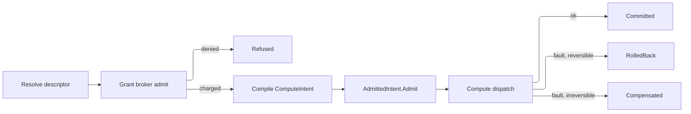

# [APPHOST_CAPABILITY_REGISTRY]

Rasm.AppHost mints one self-describing operation catalog for the suite: every canonical op surface contributes a typed `CapabilityDescriptor` carrying effect class, idempotency, cost model, and permission shape, the registry folds those rows into a shape-discriminated discovery surface, a command algebra wraps any invocation in commit-or-rollback over the Compute `ComputeIntent` rail, a scoped grant broker meters admission against an object-set x op-class x classification x ceiling x window algebra, and one codegen surface emits identical command shapes for C#, TypeScript, and Python.

`ComputeIntent`/`AdmittedIntent.Admit`, `WorkLane`, the `CostModel` cousins, `TenantContext`, `DegradationLevel`, `ReceiptSinkPort`, `InstrumentSet`, and `DataClassification` arrive settled, and no eighth port is minted.

## [01]-[INDEX]

- [02]-[DESCRIPTOR_AXIS]: Self-describing op rows encoding effect class, idempotency, cost, and permission shape.
- [03]-[DISCOVERY_FOLD]: Frozen registry with shape-discriminated discovery queries over descriptor rows.
- [04]-[COMMAND_ALGEBRA]: Commit-or-rollback intent transaction over the `Compute` dispatch rail.
- [05]-[GRANT_BROKER]: Scoped grant algebra covering consent, elevation, cost metering, and dry-run policy simulation.
- [06]-[SDK_CODEGEN]: C#/TS/Python command-shape emission off one descriptor source.
- [07]-[TS_PROJECTION]: Descriptor catalog and command-envelope wire shapes the dashboard consumes.

## [02]-[DESCRIPTOR_AXIS]

- Owner: `EffectClass` `[SmartEnum<string>]` five-row effect taxonomy under the `ComparerAccessors.StringOrdinal` accessor; `Idempotency` `[SmartEnum<string>]` four-row repeat-safety vocabulary; `CostUnit` `[SmartEnum<string>]` the metered-resource axis; `CostModel` per-descriptor cost record; `PermissionShape` the object-set × op-class scope record; `CapabilityDescriptor` the self-describing op row; `DescriptorReceipt` the per-registration projection.
- Cases: 5 effect rows — pure, read, write, external, irreversible — in escalating side-effect severity; 4 idempotency rows — idempotent, keyed, single-shot, non-idempotent; each cost-unit row carries its metering key and UCUM code.
- Entry: `CapabilityDescriptor.Of(string surface, string op, EffectClass effect, Idempotency idempotency, CostModel cost, PermissionShape permission, Func<CommandArguments, Fin<ComputeIntent>> compile)` materializes one row whose id is the `{surface}.{op}` join, binding the descriptor to the `ComputeIntent` it compiles to; `Describe(IServiceCollection services, Seq<string> surfaces, params ReadOnlySpan<CapabilityDescriptor> rows)` admits one complete descriptor snapshot across every surface it names through the `Contributors` fan-in registration, so a peer spanning four surface keys replaces all four in one call and a surface named with no row retires whole.
- Auto: each canonical op surface — `TensorOpFamily`, `ModelIdentity`, `ComputeEndpoint`, `QuantityFamily`, `SolverPluginContract` — projects its rows into descriptors at composition through one `Project` fold per surface so the catalog is generated from the op surfaces, never hand-listed, and a hand-authored op divorced from a descriptor (a free command method, a per-op MCP tool definition, a hand-written SDK client method) is the deleted form — the worked `TensorProjection.Project` fence is the one shape every surface follows, the worked `ModelProjection.Project` fence the model-draw instance whose `CostModel.Variable` closes over the composition-built `TiktokenTokenizer` and prices the prompt in `CostUnit.ModelTokens` through `CountTokens(prompt)` so a model draw is grant-priced and ceiling-gated before the provider sees a token (the per-call post-hoc `ChatResponse.Usage` charge at `#REASONING_LOOP` reconciles against this same `ModelTokens` axis the descriptor pre-prices), the sandbox `SolverPluginContract.Descriptors` projection the plugin-contract instance; the `Permission.Classification` field rides the `DataClassification` taxonomy so an op touching classified state declares it on the descriptor and the broker reads it before admission; `Cost.Estimate` projects a static pre-flight cost from the argument shape so a dry run prices the command before any byte moves — a `CpuMillis` tensor draw prices off the payload element count, a `ModelTokens` model draw off the air-gapped embedded-vocab token count, never a `chars/4` heuristic; observability spend rows derive their instrument units from `CostUnit.Ucum`; the `rasm.apphost.capability.roster` census projects off the frozen catalog's own surface index at `#DISCOVERY_FOLD` `CapabilityRegistry.Mount`, so `Describe` stays a registration fold carrying no measurement rail outward and a mid-composition snapshot never publishes a partial count.
- Receipt: `DescriptorReceipt` — descriptor id, effect key, idempotency key, estimated cost vector, permission scope hash, `Instant`.
- Packages: Thinktecture.Runtime.Extensions, LanguageExt.Core, NodaTime, Microsoft.ML.Tokenizers, BCL inbox
- Growth: one descriptor row absorbs a new op — the effect, idempotency, cost, and permission are column values on the row, never a parallel op-metadata table; a new effect class is one `EffectClass` row, a new metered resource one `CostUnit` row carrying its UCUM code, a new cost shape one `CostModel` field; zero new surface.
- Boundary: the descriptor is the suite's only op-metadata owner — a per-op attribute scatter, a hand-kept command list, and a second cost table are the deleted forms; the descriptor never carries the op's body, only its self-description and the `compile` projection to a `ComputeIntent`, so the registry stays metadata and the execution stays on the Compute dispatch rail; `EffectClass.Irreversible` forces the command algebra onto the saga-compensation path because no rollback restores the prior state, and `EffectClass.Pure`/`Read` admit without a grant when the broker's read-floor policy permits; `Idempotency` is the same vocabulary `HopIdempotency` carries at the transport edge, re-keyed for op-level repeat safety, so a keyed command and a keyed hop share one repeat-safety semantic, never two; the estimated cost vector traces to `CostUnit` rows and the descriptor's `CostModel`, never an inline literal; descriptor ids are `nameof`-derived op symbols joined with the owning surface key, never free literals.

```csharp signature

[SmartEnum<string>]
[KeyMemberEqualityComparer<ComparerAccessors.StringOrdinal, string>]
[KeyMemberComparer<ComparerAccessors.StringOrdinal, string>]
public sealed partial class EffectClass {
    public static readonly EffectClass Pure = new("pure", rank: 0, reversible: true);
    public static readonly EffectClass Read = new("read", rank: 1, reversible: true);
    public static readonly EffectClass Write = new("write", rank: 2, reversible: true);
    public static readonly EffectClass External = new("external", rank: 3, reversible: false);
    public static readonly EffectClass Irreversible = new("irreversible", rank: 4, reversible: false);

    public int Rank { get; }
    public bool Reversible { get; }
}

[SmartEnum<string>]
[KeyMemberEqualityComparer<ComparerAccessors.StringOrdinal, string>]
[KeyMemberComparer<ComparerAccessors.StringOrdinal, string>]
public sealed partial class Idempotency {
    public static readonly Idempotency Idempotent = new("idempotent");
    public static readonly Idempotency Keyed = new("keyed");
    public static readonly Idempotency SingleShot = new("single-shot");
    public static readonly Idempotency NonIdempotent = new("non-idempotent");
}

[SmartEnum<string>]
[KeyMemberEqualityComparer<ComparerAccessors.StringOrdinal, string>]
[KeyMemberComparer<ComparerAccessors.StringOrdinal, string>]
public sealed partial class CostUnit {
    public static readonly CostUnit CpuMillis = new("cpu-millis", "ms");
    public static readonly CostUnit WallMillis = new("wall-millis", "ms");
    public static readonly CostUnit BytesEgress = new("bytes-egress", "By");
    public static readonly CostUnit ModelTokens = new("model-tokens", "{token}");
    public static readonly CostUnit Calls = new("calls", "{call}");

    public string Ucum { get; }
}

public readonly record struct CostVector(HashMap<CostUnit, long> Units) {
    public static readonly CostVector Zero = new(HashMap<CostUnit, long>.Empty);
    public CostVector Add(CostVector other) =>
        new(other.Units.Fold(Units, static (acc, kv) => acc.AddOrUpdate(kv.Key, existing => existing + kv.Value, kv.Value)));
    public long Of(CostUnit unit) => Units.Find(unit).IfNone(0L);
}

public sealed record CostModel(CostVector Fixed, Func<CommandArguments, CostVector> Variable) {
    public static readonly CostModel Free = new(CostVector.Zero, static _ => CostVector.Zero);
    public CostVector Estimate(CommandArguments arguments) => Fixed.Add(Variable(arguments));
}

public sealed record PermissionShape(
    FrozenSet<string> ObjectSet,
    EffectClass OpClass,
    DataClassification Classification) {
    public static readonly PermissionShape Open = new(FrozenSet<string>.Empty, EffectClass.Read, DataClassification.Operational);
    public string ScopeHash => $"{OpClass.Key}:{Classification.Key}:{string.Join(',', ObjectSet.Order(StringComparer.Ordinal))}";
}

public sealed record CommandArguments(JsonElement Payload, TenantContext Tenant, CorrelationId Correlation);

public sealed record CapabilityDescriptor(
    string Id,
    string Surface,
    EffectClass Effect,
    Idempotency Idempotency,
    CostModel Cost,
    PermissionShape Permission,
    Func<CommandArguments, Fin<ComputeIntent>> Compile) {
    public static CapabilityDescriptor Of(string surface, string op, EffectClass effect, Idempotency idempotency, CostModel cost, PermissionShape permission, Func<CommandArguments, Fin<ComputeIntent>> compile) =>
        new($"{surface}.{op}", surface, effect, idempotency, cost, permission, compile);

    public DescriptorReceipt Receipt(CommandArguments arguments, Instant at) =>
        new(Id, Effect.Key, Idempotency.Key, Cost.Estimate(arguments), Permission.ScopeHash, at);
}

public readonly record struct DescriptorReceipt(
    string Descriptor,
    string Effect,
    string Idempotency,
    CostVector Estimated,
    string ScopeHash,
    Instant At);

public static class DescriptorSurface {
    // Sweeping the caller's key set rather than the rows' own surfaces is what makes the empty snapshot
    // expressible: rows alone cannot name a surface that retired to nothing. Plain instance registration
    // carries the rows because TryAddEnumerable dedups by implementation type, which is CapabilityDescriptor
    // for every instance row, and would silently drop all but the first.
    public static IServiceCollection Describe(IServiceCollection services, Seq<string> surfaces, params ReadOnlySpan<CapabilityDescriptor> rows) {
        var replaced = surfaces.ToFrozenSet(StringComparer.Ordinal);
        var swept = toSeq(services.Where(prior => prior.ImplementationInstance is CapabilityDescriptor stale && replaced.Contains(stale.Surface)).ToArray())
            .Fold(services, static (current, dead) => (current.Remove(dead), current).Item2);
        return Iterable<CapabilityDescriptor>.FromSpan(rows).ToSeq()
            .Fold(swept, static (current, row) => (current.AddSingleton(typeof(CapabilityDescriptor), row), current).Item2);
    }
}

public static class TensorProjection {
    // One Describe call carries the whole surface roster, so the snapshot replacement is complete per admission.
    public static IServiceCollection Project(IServiceCollection services, Func<TensorOpFamily, JsonElement, Fin<ComputeIntent>> compileOf) =>
        DescriptorSurface.Describe(services, Seq(nameof(TensorOpFamily)), [.. TensorOpFamily.Items.AsIterable().Map(family => Row(family, compileOf))]);

    static CapabilityDescriptor Row(TensorOpFamily family, Func<TensorOpFamily, JsonElement, Fin<ComputeIntent>> compileOf) =>
        CapabilityDescriptor.Of(
            surface: nameof(TensorOpFamily),
            op: family.Key,
            effect: EffectClass.Pure,
            idempotency: Idempotency.Idempotent,
            cost: new CostModel(
                Fixed: new CostVector(HashMap((CostUnit.Calls, 1L))),
                Variable: static args => new CostVector(HashMap(
                    (CostUnit.CpuMillis, args.Payload.GetProperty("elements").GetInt64())))),
            permission: new PermissionShape(FrozenSet<string>.Empty, EffectClass.Pure, DataClassification.Operational),
            compile: args => compileOf(family, args.Payload));
}

public static class ModelProjection {
    // CostUnit.ModelTokens integrates here: a model-draw descriptor's CostModel.Variable closes over the
    // one composition-built TiktokenTokenizer and prices the prompt in tokens, so CostModel.Estimate (which
    // GrantBroker.Admit and Simulate both call) grant-prices and ceiling-gates a model draw BEFORE the provider
    // sees a token. ModelIdentity carries one descriptor per admitted model name, and composition builds the
    // air-gapped CreateForModel/CreateForEncoding embedded-vocab tokenizer once per encoding as one shared
    // thread-safe instance — never per-request, never a chars/4 heuristic.
    public static IServiceCollection Project(IServiceCollection services, Seq<string> models, TiktokenTokenizer tokenizer, Func<string, JsonElement, Fin<ComputeIntent>> compileOf) =>
        DescriptorSurface.Describe(services, Seq(nameof(ModelIdentity)), [.. models.Map(model => Row(model, tokenizer, compileOf))]);

    static CapabilityDescriptor Row(string model, TiktokenTokenizer tokenizer, Func<string, JsonElement, Fin<ComputeIntent>> compileOf) =>
        CapabilityDescriptor.Of(
            surface: nameof(ModelIdentity),
            op: model,
            effect: EffectClass.External,
            idempotency: Idempotency.NonIdempotent,
            cost: new CostModel(
                Fixed: new CostVector(HashMap((CostUnit.Calls, 1L))),
                Variable: args => new CostVector(HashMap(
                    (CostUnit.ModelTokens, (long)tokenizer.CountTokens(args.Payload.GetProperty("prompt").GetString() ?? string.Empty))))),
            permission: new PermissionShape(FrozenSet.Create(model), EffectClass.External, DataClassification.Operational),
            compile: args => compileOf(model, args.Payload));

    // Air-gapped embedded-vocab construction at composition — gpt-4o/gpt-5/o-series resolve o200k_base,
    // gpt-4/gpt-3.5/text-embedding-3 resolve cl100k_base; both vocabs ship as referenced *.Data.* assemblies
    // so the pre-flight price never touches the network. A draw exceeding the model context window trims the
    // prompt to the window through GetIndexByTokenCount rather than re-encoding in a loop.
    public static TiktokenTokenizer ForModel(string modelName) => TiktokenTokenizer.CreateForModel(modelName);
    public static TiktokenTokenizer ForEncoding(string encodingName) => TiktokenTokenizer.CreateForEncoding(encodingName);
}
```

## [03]-[DISCOVERY_FOLD]

- Owner: `CapabilityRegistry` the frozen descriptor catalog with the alternate-lookup probe and the roster-census mount; `DiscoveryQuery` `[Union]` the shape-discriminated query family; `DiscoveryResult` the matched-descriptor projection.
- Cases: `ById(string Id)`, `BySurface(string Surface)`, `ByEffect(EffectClass Effect)`, `Permitting(DegradationLevel Level)`, `ByIntent(string Intent)`, `All` — one polymorphic discovery entrypoint discriminates on the query value, never a `GetById`/`GetBySurface`/`List` proliferation; `ByIntent` is the semantic arm — the embedding-rank delegate `Agent/reasoning#SEMANTIC_DISCOVERY` binds at composition ranks descriptors by intent similarity, and an unbound index answers empty rather than faulting.
- Entry: `Discover(DiscoveryQuery query)` returns `Seq<DiscoveryResult>` — the single discovery operation folds the query case over the frozen catalog; `Resolve(string id)` returns `Option<CapabilityDescriptor>` through the ordinal alternate-lookup; `Mount(InstrumentSet set)` returns `Fin<Unit>` — the composition's roster proof, folding the frozen surface index onto the keyed `rasm.apphost.capability.roster` family after `InstrumentFan.Mount` has already proved every contributed board pack against that same set, so this leg carries the one descriptor claim a port cannot: a registry fan-in the mount fold never sees.
- Auto: the registry freezes the descriptor fan-in into one `FrozenDictionary<string, CapabilityDescriptor>` at composition and a `Lookup<string, CapabilityDescriptor>` index by surface so a surface query reads one bucket; `Permitting` folds the level's retained capability set against each descriptor's `EffectClass` so a degraded host advertises only the ops it can still serve, deleting a parallel per-level command list; the roster census IS that surface index counted, so `Mount` writes the whole live truth in one traversal and the pulled-gate refusal — an unmounted or scalar-mounted family — lands on the composition root while the descriptor set is still editable.
- Receipt: `DiscoveryResult` — descriptor id, surface, effect key, idempotency key, estimated cost vector for the empty argument shape, permission scope hash.
- Packages: Rasm (kernel `InstrumentSet`), Thinktecture.Runtime.Extensions, LanguageExt.Core, BCL inbox
- Growth: one query case absorbs a new discovery axis; a new index is one frozen projection over the catalog, never a second registry; a new roster dimension is one column on the census projection the one `Mount` write carries; zero new surface.
- Boundary: the registry is read-only after the composition freeze — a runtime descriptor mutation is the deleted form, mirroring the composition-root `MakeReadOnly` law; the census homes here rather than at the admission fold because the count is a projection of the frozen catalog and never an accumulated cell — a per-`Describe` push publishes a mid-composition partial, forks the truth across the native and federated snapshot sites, and manufactures a measurement rail a registration fold structurally cannot carry outward; `Permitting` reads `DegradationLevel.Retains` as settled vocabulary and maps each `EffectClass` to its gating `Capability` (write maps to `StoreWrite`, external to `RemoteCompute`, read to `StoreRead`) so discovery and the runtime degradation rail share one capability semantic; the discovery surface is the projection the MCP `tools/list`, the SDK codegen, and the dashboard command palette all read, so a new consumer reads the same fold and never re-enumerates the descriptor fan-in.

```csharp signature
[Union(ConversionFromValue = ConversionOperatorsGeneration.None)]
public abstract partial record DiscoveryQuery {
    private DiscoveryQuery() { }
    public sealed record ById(string Id) : DiscoveryQuery;
    public sealed record BySurface(string Surface) : DiscoveryQuery;
    public sealed record ByEffect(EffectClass Effect) : DiscoveryQuery;
    public sealed record Permitting(DegradationLevel Level) : DiscoveryQuery;
    public sealed record ByIntent(string Intent) : DiscoveryQuery;
    public sealed record All : DiscoveryQuery;
}

public readonly record struct DiscoveryResult(
    string Descriptor,
    string Surface,
    string Effect,
    string Idempotency,
    CostVector Estimated,
    string ScopeHash);

public sealed class CapabilityRegistry {
    readonly FrozenDictionary<string, CapabilityDescriptor> byId;
    readonly ILookup<string, CapabilityDescriptor> bySurface;
    readonly FrozenDictionary<string, CapabilityDescriptor>.AlternateLookup<ReadOnlySpan<char>> probe;

    // Composition binds the semantic index as a delegate — reasoning's embedding rank over the frozen
    // catalog, intent text to ranked descriptor ids. Unbound answers empty; discovery never faults on intent.
    readonly Option<Func<string, Seq<string>>> byIntent;

    public CapabilityRegistry(IEnumerable<CapabilityDescriptor> rows, Option<Func<string, Seq<string>>> intentRank = default) {
        var rowSet = rows.ToArray();
        byId = rowSet.ToFrozenDictionary(static row => row.Id, StringComparer.Ordinal);
        bySurface = rowSet.ToLookup(static row => row.Surface, StringComparer.Ordinal);
        probe = byId.GetAlternateLookup<ReadOnlySpan<char>>();
        byIntent = intentRank;
    }

    public Option<CapabilityDescriptor> Resolve(string id) =>
        probe.TryGetValue(id, out var row) ? Optional(row) : None;

    // TraverseM aborts on the first refusal by design: every surface writes one keyed family, so a refusal
    // is that ONE family unmounted or mounted scalar, and accumulating the same defect once per surface
    // buries the fact under its own repetition.
    public Fin<Unit> Mount(InstrumentSet set) =>
        toSeq(bySurface)
            .TraverseM(group => set.Level(HostInstruments.CapabilityRoster, group.Key, (long)group.Count()))
            .As()
            .Map(static _ => unit);

    public Seq<DiscoveryResult> Discover(DiscoveryQuery query) =>
        Project(query.Switch(
            byId: q => Resolve(q.Id).ToSeq(),
            bySurface: q => bySurface[q.Surface].ToSeq(),
            byEffect: q => byId.Values.Where(row => row.Effect == q.Effect).ToSeq(),
            permitting: q => byId.Values.Where(row => q.Level.Permits(Gate(row.Effect))).ToSeq(),
            byIntent: q => byIntent.Match(
                Some: rank => rank(q.Intent).Map(Resolve).Somes().ToSeq(),
                None: () => Seq<CapabilityDescriptor>()),
            all: _ => byId.Values.ToSeq()));

    static Capability Gate(EffectClass effect) => effect.Switch(
        pure: static () => Capability.LocalCompute,
        read: static () => Capability.StoreRead,
        write: static () => Capability.StoreWrite,
        external: static () => Capability.RemoteCompute,
        irreversible: static () => Capability.StoreWrite);

    // Fixed alone prices an empty argument shape: Variable over a default JsonElement throws on every
    // payload-reading estimator, and discovery mints no ambient identity to feed one.
    static Seq<DiscoveryResult> Project(Seq<CapabilityDescriptor> rows) =>
        rows.Map(static row => new DiscoveryResult(
            row.Id, row.Surface, row.Effect.Key, row.Idempotency.Key,
            row.Cost.Fixed,
            row.Permission.ScopeHash));
}
```

## [04]-[COMMAND_ALGEBRA]

- Owner: `CommandTxn` `[Union]` the transaction disposition; `CommandFault` `[Union]` fault family deriving its codes through `FaultBand.Command`; `CommandReceipt` the per-command evidence record; `CommandAlgebra` the static commit-or-rollback surface threading a descriptor invocation through the grant broker and onto the Compute dispatch rail.
- Cases: transaction dispositions Committed | RolledBack | Compensated | Refused; `CommandFault` = Text | NotFound | GrantDenied | CompileRejected | ExecutionFaulted | CompensationFailed | MacroIncomplete — the last the transcript-to-macro completeness refusal `Agent/reasoning#REPLAYABLE_TRANSCRIPT` mints when a tool call's exact receipt never joined.
- Entry: `Run(CommandRuntime runtime, string descriptorId, CommandArguments arguments)` returns `IO<CommandReceipt>` — the algebra resolves the descriptor, brokers the grant, compiles the `ComputeIntent`, admits it through `AdmittedIntent.Admit`, dispatches it, and commits or rolls back; `Batch(CommandRuntime runtime, Seq<(string Id, CommandArguments Args)> commands)` runs an all-or-nothing intent group folding each command's compensation in reverse on the first failure.
- Auto: a reversible-effect command captures no compensation and the rollback is the absence of commit; an `EffectClass.Irreversible` command requires a compensation descriptor declared on the runtime and rolls forward through it, never a phantom undo; the dispatch lands through the Compute `SubstrateSelection.Dispatch` rail so the command algebra owns the transaction boundary while Compute owns substrate selection and execution, never a second dispatcher; `Run` marks once before descriptor resolution and every refusal, commit, rollback, and compensation receipt computes elapsed time from that mark; every disposition mints one `CommandReceipt` fanned through `ReceiptSinkPort.Send` under the `Rasm.AppHost` package key and the `InstrumentFan.CommandKind` kind, so admission counts and per-unit grant spend project off the one command envelope — the broker's charge rides `CommandReceipt.Charged` and needs no parallel grant envelope.
- Receipt: `CommandReceipt` — descriptor id, transaction disposition, charged cost vector, `SelectionReceipt` of the dispatched intent, elapsed `Duration`, correlation id, tenant.
- Packages: LanguageExt.Core, NodaTime, Thinktecture.Runtime.Extensions, BCL inbox (the Compute `ComputeIntent`/`AdmittedIntent.Admit`/`SelectionReceipt` rail composes by reference — the declared `[WIRE_VOCABULARY]` ledger row, Compute the owner, this algebra the decoder, never a reversed CLR dependency)
- Growth: one transaction disposition is one `CommandTxn` case breaking every consumer arm; one fault is one `CommandFault` case; a new compensation strategy is one column on the descriptor runtime, never a second algebra; zero new surface.
- Boundary: the command algebra is the only commit-or-rollback owner for op invocation — a per-op transaction helper and a hand-rolled saga loop are the deleted forms; the `Batch` group is an intent transaction, not a database transaction — durable atomicity stays the Persistence execution strategy and the algebra composes the Compute intent group, so the two transaction concerns never merge; the grant brokerage at `GRANT_BROKER` runs before compile so a denied command never compiles a `ComputeIntent` and never charges cost; the compensation runs under the same `CancelScope` the forward command derived, so a drain-interrupted rollback escalates through the conductor rather than orphaning; `CommandTxn.Compensated` carries the compensation's own receipt so the evidence stream records the roll-forward, never a silent swallow.

```csharp signature
[Union(ConversionFromValue = ConversionOperatorsGeneration.None)]
public abstract partial record CommandTxn {
    private CommandTxn() { }
    public sealed record Committed(SelectionReceipt Dispatch) : CommandTxn;
    public sealed record RolledBack(string Reason) : CommandTxn;
    public sealed record Compensated(SelectionReceipt Forward, SelectionReceipt Compensation) : CommandTxn;
    public sealed record Refused(CommandFault Fault) : CommandTxn;
}

[Union]
public abstract partial record CommandFault : Expected, IValidationError<CommandFault> {
    private CommandFault(string detail, int code) : base(detail, code, None) { }
    public static CommandFault Create(string message) => new Text(message);
    public sealed record Text : CommandFault { public Text(string detail) : base(detail, FaultBand.Command.Code(0)) { } }
    public sealed record NotFound : CommandFault { public NotFound(string detail) : base(detail, FaultBand.Command.Code(1)) { } }
    public sealed record GrantDenied : CommandFault { public GrantDenied(string detail) : base(detail, FaultBand.Command.Code(2)) { } }
    public sealed record CompileRejected : CommandFault { public CompileRejected(string detail) : base(detail, FaultBand.Command.Code(3)) { } }
    public sealed record ExecutionFaulted : CommandFault { public ExecutionFaulted(string detail) : base(detail, FaultBand.Command.Code(4)) { } }
    public sealed record CompensationFailed : CommandFault { public CompensationFailed(string detail) : base(detail, FaultBand.Command.Code(5)) { } }
    public sealed record MacroIncomplete : CommandFault { public MacroIncomplete(string detail) : base(detail, FaultBand.Command.Code(6)) { } }
}

public sealed record CommandReceipt(
    string Descriptor,
    CommandTxn Txn,
    CostVector Charged,
    Option<SelectionReceipt> Dispatch,
    Duration Elapsed,
    CorrelationId Correlation,
    TenantContext Tenant,
    Instant At);

public sealed record CommandRuntime(
    CapabilityRegistry Registry,
    GrantBroker Broker,
    Func<AdmittedIntent, IO<SelectionReceipt>> Dispatch,
    Func<string, Option<string>> CompensationOf,
    ClockPolicy Clocks,
    ReceiptSinkPort Sink,
    JsonSerializerOptions Wire,
    CancelScope Spine);

public static class CommandAlgebra {
    public static IO<CommandReceipt> Run(CommandRuntime runtime, string descriptorId, CommandArguments arguments) =>
        from mark in IO.lift(runtime.Clocks.Mark)
        from receipt in runtime.Registry.Resolve(descriptorId).Match(
            Some: descriptor => Brokered(runtime, descriptor, arguments, mark),
            None: () => Mint(runtime, descriptorId, new CommandTxn.Refused(new CommandFault.NotFound(descriptorId)), CostVector.Zero, None, arguments, mark))
        select receipt;

    static IO<CommandReceipt> Brokered(CommandRuntime runtime, CapabilityDescriptor descriptor, CommandArguments arguments, long mark) =>
        runtime.Broker.Admit(descriptor, arguments, dryRun: false).Match(
            Succ: charged => Dispatch(runtime, descriptor, arguments, charged, mark),
            Fail: fault => Mint(runtime, descriptor.Id, new CommandTxn.Refused(new CommandFault.GrantDenied(fault.Message)), CostVector.Zero, None, arguments, mark));

    static IO<CommandReceipt> Dispatch(CommandRuntime runtime, CapabilityDescriptor descriptor, CommandArguments arguments, CostVector charged, long mark) =>
        descriptor.Compile(arguments).Match(
            Succ: intent =>
                from admitted in IO.lift(() => AdmittedIntent.Admit(intent, Spec(descriptor), arguments.Correlation, runtime.Spine, runtime.Clocks.Clock, runtime.Clocks.Time))
                from receipt in admitted.Match(
                    Succ: ok => runtime.Dispatch(ok)
                        .Map(dispatched => new CommandTxn.Committed(dispatched) as CommandTxn)
                        | @catch<IO, CommandTxn>(static _ => true, error => Compensate(runtime, descriptor, arguments, error)),
                    Fail: error => IO.pure<CommandTxn>(new CommandTxn.Refused(new CommandFault.CompileRejected(error.Message))))
                from minted in Mint(runtime, descriptor.Id, receipt, charged, Dispatched(receipt), arguments, mark)
                select minted,
            Fail: error => Mint(runtime, descriptor.Id, new CommandTxn.Refused(new CommandFault.CompileRejected(error.Message)), CostVector.Zero, None, arguments, mark));

    static IO<CommandTxn> Compensate(CommandRuntime runtime, CapabilityDescriptor descriptor, CommandArguments arguments, Error forward) =>
        descriptor.Effect.Reversible
            ? IO.pure<CommandTxn>(new CommandTxn.RolledBack(forward.Message))
            : runtime.CompensationOf(descriptor.Id).Match(
                Some: compId => runtime.Registry.Resolve(compId).Match(
                    Some: comp => comp.Compile(arguments).Match(
                        Succ: intent => IO.lift(() => AdmittedIntent.Admit(intent, Spec(comp), arguments.Correlation, runtime.Spine, runtime.Clocks.Clock, runtime.Clocks.Time))
                            .Bind(admitted => admitted.Match(
                                Succ: ok => runtime.Dispatch(ok).Map(done => new CommandTxn.Compensated(SelectionReceipt.None, done) as CommandTxn),
                                Fail: error => IO.pure<CommandTxn>(new CommandTxn.Refused(new CommandFault.CompensationFailed(error.Message))))),
                        Fail: error => IO.pure<CommandTxn>(new CommandTxn.Refused(new CommandFault.CompensationFailed(error.Message)))),
                    None: () => IO.pure<CommandTxn>(new CommandTxn.Refused(new CommandFault.CompensationFailed(compId)))),
                None: () => IO.pure<CommandTxn>(new CommandTxn.Refused(new CommandFault.CompensationFailed(descriptor.Id))));

    public static IO<Seq<CommandReceipt>> Batch(CommandRuntime runtime, Seq<(string Id, CommandArguments Args)> commands) =>
        commands.FoldM(Seq<CommandReceipt>(), (acc, command) =>
            Run(runtime, command.Id, command.Args).Bind(receipt =>
                receipt.Txn is CommandTxn.Committed
                    ? IO.pure(acc.Add(receipt))
                    : Unwind(runtime, acc).Map(unwound => unwound.Add(receipt)))).As();

    static IO<Seq<CommandReceipt>> Unwind(CommandRuntime runtime, Seq<CommandReceipt> committed) =>
        committed.Rev().TraverseM(receipt =>
            runtime.CompensationOf(receipt.Descriptor).Match(
                Some: compId => Run(runtime, compId, new CommandArguments(default, receipt.Tenant, receipt.Correlation)),
                None: () => IO.pure(receipt))).As();

    static ComputeIntent.Spec Spec(CapabilityDescriptor descriptor) =>
        new(DeadlineClass.HopTotal, WorkLane.Interactive, AllocationClass.Pooled, CachePolicy.None);

    static Option<SelectionReceipt> Dispatched(CommandTxn txn) => txn switch {
        CommandTxn.Committed c => Some(c.Dispatch),
        CommandTxn.Compensated c => Some(c.Forward),
        _ => None,
    };

    static IO<CommandReceipt> Mint(CommandRuntime runtime, string descriptor, CommandTxn txn, CostVector charged, Option<SelectionReceipt> dispatch, CommandArguments arguments, long mark) =>
        from at in IO.lift(() => runtime.Clocks.Now)
        let receipt = new CommandReceipt(descriptor, txn, charged, dispatch, runtime.Clocks.Elapsed(mark), arguments.Correlation, arguments.Tenant, at)
        from _ in runtime.Sink.Send(arguments.Correlation, arguments.Tenant, TelemetrySource.AppHost.Key, InstrumentFan.CommandKind, JsonSerializer.SerializeToElement(receipt, runtime.Wire))
        select receipt;
}
```



## [05]-[GRANT_BROKER]

- Owner: `GrantScope` the object-set × op-class × classification × cost-ceiling × time-window scope record; `Consent` `[Union]` the elevation-request disposition; `Budget` the per-scope live-metering cell; `DistributedBudget` the cross-process fenced-store seam the broker debits a durable per-tenant budget through; `GrantFault` `[Union]` fault family deriving its codes through `FaultBand.Grant`; `GrantBroker` the static admission-and-metering surface.
- Cases: consent dispositions Granted | Elevated | Denied | Expired; `GrantFault` = Text | OutOfScope | CeilingExceeded | WindowClosed | ConsentRequired | Fenced.
- Entry: `Admit(CapabilityDescriptor descriptor, CommandArguments arguments, bool dryRun)` returns `Fin<CostVector>` — the broker resolves the holder's `GrantScope`, evaluates the descriptor's `PermissionShape` against it through the typed `GrantScope.Covers` value-object predicate, prices the command through `CostModel.Estimate`, charges the budget under the cost ceiling, and returns the charged vector or the typed denial; `Simulate(CapabilityDescriptor descriptor, Seq<(string Id, CommandArguments Args)> plan)` returns `Seq<(string Id, Fin<CostVector>)>` — the dry-run simulation runs the identical decision-and-pricing fold priced against the live budget without charging it.
- Auto: the permission decision is the deterministic `GrantScope.Covers` fold — the object-set × op-class × classification predicate is a typed value-object method, never an ambient role flag or a scattered per-op check; a `dryRun: true` admission decides and prices but never mutates the budget, so the dry-run sim and the live charge share one decision-and-pricing fold and differ only by the charge step; the cost ceiling is a `CostVector` so each metered resource caps independently — a command under the call ceiling but over the bytes-egress ceiling is denied on bytes-egress with the offending unit named; the time window is two NodaTime `Instant` bounds the `Interval` carries so a grant outside its window resolves `Expired` and re-admits only on renewal, never a silent extension; when a `DistributedBudget` seam is bound a live charge debits through `Debit` carrying the cost AND the scope `Ceiling` as per-`CostUnit` primitives under the store's VECTOR fenced compare-and-decrement (`WHERE token >= held AND balance_i >= debit_i ∀i`), so every unit's ceiling check executes INSIDE the one atomic store write and a tenant's cost ceiling is enforced fleet-wide per unit because two nodes presenting fresh tokens cannot both overshoot any unit (the store serializes the debits and rejects the second), rather than per-process; the AppHost gates the ceiling outside the fenced write ONLY for a `dryRun` pre-flight pricing off `Spent` (which never touches the store), so the live gate is always the atomic store-side check, foreclosing the read-then-write TOCTOU a multi-node per-process gate opens, and a stale-token debit fails `Fenced`; with no seam bound the broker debits the per-process `Cell` exactly as before, so the durable quota is an opt-in backing the one broker entry consumes, never a parallel meter.
- Receipt: the broker's charge is the `CommandReceipt.Charged` vector the command algebra carries; the decision rides the consent transition's one `SpineLog` event in the 1000-1099 EVENT stride (`FaultBand.SpineEvents`) — no parallel grant receipt.
- Packages: Rasm (kernel `ContentHash.Of`), LanguageExt.Core, NodaTime, Thinktecture.Runtime.Extensions, BCL inbox
- Growth: one consent disposition is one `Consent` case; one scope dimension is one `GrantScope` column beside one `PermissionShape` field the `Covers` fold reads; a new metered resource rides the `CostUnit` axis already; cross-process metering is the one `DistributedBudget` seam, never a second meter; zero new surface.
- Boundary: the broker is the suite's only permission-and-cost owner — a per-op permission check, an ambient role flag, a second cost meter, and a quota service beside `GrantBroker` are the deleted forms; the broker owns permission, cost, consent, budget, and window as one fold, reading the descriptor's declared `PermissionShape` and never re-deriving the op's effect; the `GrantScope` keys by `TenantContext.TenantId` so a multi-tenant host meters each tenant's budget independently against one broker, never a per-tenant broker instance; the cross-process quota is a Persistence ripple, not an AppHost owner — the `DistributedBudget` seam debits under the STORE-validated fence — the decoded `Runtime/time#FENCING_TOKEN` carrier presents the store-issued generation and the store's row-CAS predicate is the authoritative reject-lower — so two nodes racing a debit cannot double-spend, and the durable per-tenant `Budget` cell and the fenced debit ledger land under the `TenantId` RLS predicate as the branch `ONE_FENCED_LEASE_STORE` Persistence leg, consumed at the seam and landing in parallel; the model-governance `Charge`, the plugin `GrantHandle` charge, and the operator call all debit against this one durable budget so a multi-node identity plane cannot let a tenant exceed its ceiling N-fold; `Consent.Elevated` is the consent-elevation path — a command the standing scope denies raises an elevation request the operator approves, landing a wider transient `GrantScope` with its own window, never a standing privilege grant; the cost model integrates the live-metering identity-versus-quota seam at health-and-degradation, so a budget-exhausted tenant degrades to `ReadOnly` through the same degradation rail rather than a parallel throttle.

```csharp signature
public sealed record GrantScope(
    TenantId Tenant,
    FrozenSet<string> ObjectSet,
    FrozenSet<EffectClass> OpClasses,
    FrozenSet<DataClassification> Classifications,
    CostVector Ceiling,
    Interval Window) {
    public bool Covers(PermissionShape shape, Instant now) =>
        Window.Contains(now)
        && OpClasses.Contains(shape.OpClass)
        && (Classifications.Count == 0 || Classifications.Contains(shape.Classification))
        && (ObjectSet.Count == 0 || shape.ObjectSet.IsSubsetOf(ObjectSet));
}

[Union(ConversionFromValue = ConversionOperatorsGeneration.None)]
public abstract partial record Consent {
    private Consent() { }
    public sealed record Granted(GrantScope Scope) : Consent;
    public sealed record Elevated(GrantScope Scope, string Approver, Instant At) : Consent;
    public sealed record Denied(string Reason) : Consent;
    public sealed record Expired(Instant ClosedAt) : Consent;
}

[Union]
public abstract partial record GrantFault : Expected, IValidationError<GrantFault> {
    private GrantFault(string detail, int code) : base(detail, code, None) { }
    public static GrantFault Create(string message) => new Text(message);
    public sealed record Text : GrantFault { public Text(string detail) : base(detail, FaultBand.Grant.Code(0)) { } }
    public sealed record OutOfScope : GrantFault { public OutOfScope(string detail) : base(detail, FaultBand.Grant.Code(1)) { } }
    public sealed record CeilingExceeded : GrantFault { public CeilingExceeded(string unit, long over) : base($"{unit}:+{over}", FaultBand.Grant.Code(2)) => Unit = unit; public string Unit { get; } }
    public sealed record WindowClosed : GrantFault { public WindowClosed(string detail) : base(detail, FaultBand.Grant.Code(3)) { } }
    public sealed record ConsentRequired : GrantFault { public ConsentRequired(string detail) : base(detail, FaultBand.Grant.Code(4)) { } }
    public sealed record Fenced : GrantFault { public Fenced(string detail) : base(detail, FaultBand.Grant.Code(5)) { } }
}

// Persistence owns the fleet-wide budget behind this decode-only PORT (ONE_FENCED_LEASE_STORE, TenantId
// RLS): each debit crosses DOWN as per-CostUnit PRIMITIVES — unit STRING key to long amount, the smart-enum
// mapped at this boundary — riding the store's VECTOR fenced compare-and-decrement
// (WHERE token >= held AND balance_i >= debit_i FOR EVERY unit i), so every metered unit's ceiling is
// enforced INSIDE the one atomic store write and two nodes with fresh tokens cannot both overshoot ANY
// unit. The store-issued token generation flows store->AppHost ONLY (Token reads it, Debit returns the
// advanced generation); no AppHost type crosses down and the store's rejection decodes at the seam
// binding as GrantFault.CeilingExceeded (the store's per-unit exhaustion) or GrantFault.Fenced (the
// store's LeaseFenced). With no seam bound the broker debits the per-process Cell — one backing, never
// a second meter.
public sealed record DistributedBudget(
    Func<TenantId, Fin<HashMap<string, long>>> Spent,
    Func<TenantId, ulong, HashMap<string, long>, HashMap<string, long>, Fin<ulong>> Debit,
    Func<TenantId, Fin<ulong>> Token);

public sealed record GrantBroker(
    Atom<HashMap<TenantId, (GrantScope Scope, CostVector Spent)>> Cell,
    Func<TenantContext, Option<GrantScope>> ScopeOf,
    ClockPolicy Clocks,
    Option<DistributedBudget> Distributed = default) {
    public Fin<CostVector> Admit(CapabilityDescriptor descriptor, CommandArguments arguments, bool dryRun) {
        var now = Clocks.Now;
        var cost = descriptor.Cost.Estimate(arguments);
        return ScopeOf(arguments.Tenant).ToFin(new GrantFault.ConsentRequired(descriptor.Id))
            .Bind(scope => scope.Window.Contains(now) ? Fin.Succ(scope) : Fin.Fail<GrantScope>(new GrantFault.WindowClosed(descriptor.Id)))
            .Bind(scope => scope.Covers(descriptor.Permission, now) ? Fin.Succ(scope) : Fin.Fail<GrantScope>(new GrantFault.OutOfScope(descriptor.Permission.ScopeHash)))
            .Bind(scope => Charge(arguments.Tenant.TenantId, scope, cost, dryRun));
    }

    public Seq<(string Id, Fin<CostVector>)> Simulate(CapabilityDescriptor descriptor, Seq<(string Id, CommandArguments Args)> plan) =>
        plan.Map(step => (step.Id, Admit(descriptor, step.Args, dryRun: true)));

    Fin<CostVector> Charge(TenantId tenant, GrantScope scope, CostVector cost, bool dryRun) =>
        Distributed.Match(
            Some: store => FencedCharge(store, tenant, scope, cost, dryRun),
            None: () => LocalCharge(tenant, scope, cost, dryRun));

    Fin<CostVector> LocalCharge(TenantId tenant, GrantScope scope, CostVector cost, bool dryRun) =>
        Cell.Value.Find(tenant).Map(static row => row.Spent).IfNone(CostVector.Zero).Add(cost) is var next
            ? Ceiling(scope, next).Match(
                Some: cap => Fin.Fail<CostVector>(new GrantFault.CeilingExceeded(cap.Unit, cap.Over)),
                None: () => { if (!dryRun) ignore(Cell.Swap(map => map.AddOrUpdate(tenant, _ => (scope, next), (scope, next)))); return Fin.Succ(cost); })
            : Fin.Fail<CostVector>(new GrantFault.Text(tenant.ToString()));

    // Fleet-wide debit: a dry run prices off the decoded durable spent and gates the ceiling AppHost-side
    // without touching the store; a live charge delegates the whole per-unit ceiling to the store's atomic
    // VECTOR fenced compare-and-decrement — the debit and ceiling cross as unit-keyed primitives, the store
    // rejects the second overshooting node inside the one transaction, and a stale token fails Fenced (the
    // AppHost-side ceiling check is never the live gate, foreclosing the multi-node TOCTOU).
    Fin<CostVector> FencedCharge(DistributedBudget store, TenantId tenant, GrantScope scope, CostVector cost, bool dryRun) =>
        dryRun
            ? from spent in store.Spent(tenant)
              from _ceiling in CeilingWire(scope, spent, cost).Match(
                  Some: cap => Fin.Fail<CostVector>(new GrantFault.CeilingExceeded(cap.Unit, cap.Over)),
                  None: () => Fin.Succ(cost))
              select cost
            : store.Token(tenant)
                .Bind(held => store.Debit(tenant, held, Wire(cost), Wire(scope.Ceiling)))
                .Map(_ => cost);

    // Boundary mapping flattens the smart enum: CostVector becomes unit STRING keys over long amounts.
    static HashMap<string, long> Wire(CostVector vector) =>
        vector.Units.AsIterable().Fold(HashMap<string, long>(), static (map, row) => map.Add(row.Key.Key, row.Value));

    static Option<(string Unit, long Over)> Ceiling(GrantScope scope, CostVector next) =>
        scope.Ceiling.Units.AsIterable()
            .Filter(cap => next.Of(cap.Key) > cap.Value)
            .Head
            .Map(cap => (cap.Key.Key, next.Of(cap.Key) - cap.Value));

    static Option<(string Unit, long Over)> CeilingWire(GrantScope scope, HashMap<string, long> spent, CostVector cost) =>
        scope.Ceiling.Units.AsIterable()
            .Filter(cap => spent.Find(cap.Key.Key).IfNone(0L) + cost.Of(cap.Key) > cap.Value)
            .Head
            .Map(cap => (cap.Key.Key, spent.Find(cap.Key.Key).IfNone(0L) + cost.Of(cap.Key) - cap.Value));
}
```

## [06]-[SDK_CODEGEN]

- Owner: `SdkTarget` `[SmartEnum<string>]` the three language emission targets; `SdkArtifact` the emitted-source projection; `SdkCodegen` the static emission fold over the registry.
- Cases: 3 targets — csharp, typescript, python — each carrying its command-shape renderer and idiomatic call form.
- Entry: `Emit(CapabilityRegistry registry, SdkTarget target)` returns `SdkArtifact` — one fold projects every descriptor row into a typed command method for the target language; the identical descriptor source drives all three, so the command shapes are provably identical across languages.
- Auto: each target renders the descriptor's `PermissionShape`, `EffectClass`, and `CostModel.Estimate` as the method's documented contract so a generated SDK method self-describes its effect and cost; the wire payload shape is the `JsonSchemaExporter` schema the descriptor's `CommandArguments` resolves through `SuiteContracts.Schema`, so the TS and Python types derive from the same schema the C# binder reads, never a hand-mirrored shape; the codegen reads the discovery fold, so a new descriptor row regenerates all three SDKs with no per-language edit.
- Receipt: `SdkArtifact` — target key, emitted source text, descriptor count, schema digest.
- Packages: Thinktecture.Runtime.Extensions, LanguageExt.Core, BCL inbox
- Growth: one target row absorbs a new language; a new call form is one renderer column on the row; zero new surface.
- Boundary: the codegen is the only polyglot SDK owner — a hand-written client in any language is the deleted form, the same deletion the `connect-es` and `schema-derived TS` tooling rows carry at Runtime/ports#TS_PROJECTION; the C# target emits the same `CommandArguments`/`CommandReceipt` shapes the command algebra runs, the TS target binds through the existing `ReceiptEnvelopeWire`, and the Python target binds through the companion seam the suite already owns, so codegen rides the existing wire contracts and mints no fourth wire shape; the emitted source is a build artifact, never a runtime surface, so the codegen runs at SDK-bootstrap and the registry stays the single descriptor source for all three branches; the TS schema export the codegen reads is the same `SuiteContracts.Schema`/`JsonSchemaExporter` projection at Runtime/ports#WIRE_LAW, so the descriptor-diff evolution gate is one verdict across the suite — `Rasm.Compute/Runtime/wire#FAULT_PROJECTION` `ContractGuard.AdditiveOnly` gates peer-attach (the discovery `Compatible` delegate), store-open, and this SDK schema export identically, an additive descriptor field admits on every consumer while a breaking field reshape rejects on all three through the one classifier, never a per-surface compatibility check beside it.

```csharp signature
[SmartEnum<string>]
[KeyMemberEqualityComparer<ComparerAccessors.StringOrdinal, string>]
[KeyMemberComparer<ComparerAccessors.StringOrdinal, string>]
public sealed partial class SdkTarget {
    public static readonly SdkTarget CSharp = new("csharp", extension: ".cs", Csharp);
    public static readonly SdkTarget TypeScript = new("typescript", extension: ".ts", Typescript);
    public static readonly SdkTarget Python = new("python", extension: ".py", Python);

    public string Extension { get; }

    [UseDelegateFromConstructor]
    public partial string Render(DiscoveryResult descriptor);

    static string Csharp(DiscoveryResult d) =>
        $"public IO<CommandReceipt> {Method(d)}(CommandArguments arguments) => CommandAlgebra.Run(runtime, \"{d.Descriptor}\", arguments);";

    static string Typescript(DiscoveryResult d) =>
        $"{Method(d)}(args: CommandArguments): Promise<ReceiptEnvelopeWire<CapabilityCommandReceiptWire>> {{ return this.run(\"{d.Descriptor}\", args); }}";

    static string Python(DiscoveryResult d) =>
        $"def {Method(d)}(self, args: CommandArguments) -> CommandReceipt: return self._run(\"{d.Descriptor}\", args)";

    static string Method(DiscoveryResult d) => d.Descriptor.Replace('.', '_');
}

public sealed record SdkArtifact(SdkTarget Target, string Source, int Descriptors, string SchemaDigest);

public static class SdkCodegen {
    public static SdkArtifact Emit(CapabilityRegistry registry, SdkTarget target) {
        var rows = registry.Discover(new DiscoveryQuery.All());
        var body = string.Join('\n', rows.Map(target.Render));
        var digest = ContentHash.Of(Encoding.UTF8.GetBytes(body)).ToString("x32");
        return new SdkArtifact(target, body, rows.Count, digest);
    }
}
```

## [07]-[TS_PROJECTION]

- Owner: `CapabilityDescriptorWire`, `CapabilityCommandReceiptWire`, `DiscoveryResultWire` — the descriptor catalog and command-envelope wire shapes; per-record wire payloads ride the existing `ReceiptEnvelopeWire` and bind here as `TPayload`.
- Entry: the descriptor catalog crosses as the `DiscoveryResultWire[]` the dashboard command palette ingests, and the command receipt reconstructs through the existing `ReceiptEnvelopeWire<CapabilityCommandReceiptWire>`; the SDK codegen TS target emits methods over these same shapes.
- Packages: BCL inbox
- Growth: one wire-member row per new descriptor or receipt field; the transaction disposition crosses as a literal-discriminated union; zero new surface.
- Boundary: effect, idempotency, and cost-unit keys cross as their smart-enum string keys; the cost vector crosses as a record of unit-keyed numbers; the transaction disposition reconstructs in TS as a literal-discriminated union on the disposition kind, mirroring the `CommandTxn` union cases; `scopeHash` crosses as the deterministic permission-scope string so the dashboard groups commands by scope without re-deriving the permission shape.

```ts signature
type EffectClassKey = "pure" | "read" | "write" | "external" | "irreversible";
type IdempotencyKey = "idempotent" | "keyed" | "single-shot" | "non-idempotent";
type CostUnitKey = "cpu-millis" | "wall-millis" | "bytes-egress" | "model-tokens" | "calls";

type CostVectorWire = Readonly<Record<CostUnitKey, number>>;

interface DiscoveryResultWire {
  readonly descriptor: string;
  readonly surface: string;
  readonly effect: EffectClassKey;
  readonly idempotency: IdempotencyKey;
  readonly estimated: CostVectorWire;
  readonly scopeHash: string;
}

interface CapabilityCommandReceiptWire {
  readonly descriptor: string;
  readonly txn:
    | { readonly kind: "committed"; readonly dispatch: string }
    | { readonly kind: "rolled-back"; readonly reason: string }
    | { readonly kind: "compensated"; readonly forward: string; readonly compensation: string }
    | { readonly kind: "refused"; readonly fault: string };
  readonly charged: CostVectorWire;
  readonly elapsed: string;
  readonly correlation: string;
}
```

## [08]-[RESEARCH]

<!-- source-only: research row template:
[TOKEN]-[OPEN|BLOCKED]: <exact question>; <verification route>.
[SPLIT_MEMBER]-[OPEN]: does `shape-core` expose `split_all`; verify against the member rail.
-->

(none)
