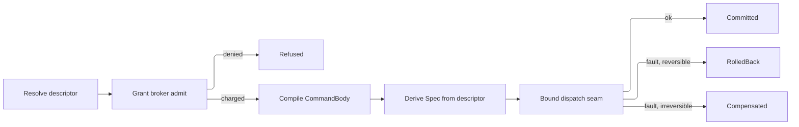

# [APPHOST_CAPABILITY_REGISTRY]

Rasm.AppHost mints one self-describing operation catalog for the suite: every canonical op surface contributes a typed `CapabilityDescriptor` carrying effect class, idempotency, cost model, and permission shape, the registry folds those rows into a shape-discriminated discovery surface, a command algebra wraps any invocation in commit-or-rollback over one composition-bound dispatch seam, a scoped grant broker meters admission against an object-set x op-class x classification x ceiling x window algebra, and one codegen surface emits identical command shapes for C#, TypeScript, and Python.

This page DECLARES the dispatch vocabulary the executing strata compose: `SubscriptionPolicy` the observer cadence a reporting op admits, `Spec` the whole dispatch posture, `CommandBody` the compiled op request, and `DispatchReceipt` the decoded execution evidence. The spine holds no downward reference — Compute admission adopts this `Spec` whole onto its `ComputeIntent` and resolves the three posture KEYS the record carries through its own generated `Validate`/`TryGet` onto its `Fin` rail, and the intent record itself never crosses up. `WorkLane`, the `CostModel` cousins, `TenantContext`, `DegradationLevel`, `ReceiptSinkPort`, `InstrumentSet`, and `DataClassification` arrive settled, and no eighth port is minted.

## [01]-[INDEX]

- [02]-[DESCRIPTOR_AXIS]: Self-describing op rows encoding effect class, idempotency, cost, and permission shape.
- [03]-[DISCOVERY_FOLD]: Frozen registry with shape-discriminated discovery queries over descriptor rows.
- [04]-[COMMAND_ALGEBRA]: Commit-or-rollback intent transaction over the one composition-bound dispatch seam.
- [05]-[GRANT_BROKER]: Scoped grant algebra covering consent, elevation, cost metering, and dry-run policy simulation.
- [06]-[SDK_CODEGEN]: C#/TS/Python command-shape emission off one descriptor source.
- [07]-[TS_PROJECTION]: Descriptor catalog and command-envelope wire shapes the dashboard consumes.

## [02]-[DESCRIPTOR_AXIS]

- Owner: `EffectClass` `[SmartEnum<string>]` five-row effect taxonomy under the `ComparerAccessors.StringOrdinal` accessor; `Idempotency` `[SmartEnum<string>]` four-row repeat-safety vocabulary; `CostUnit` `[SmartEnum<string>]` the metered-resource axis; `CostVector` the per-unit metering algebra every cost, ceiling, and balance rides; `SubscriptionPolicy` the observer-cadence record the progress column carries; `CostModel` per-descriptor cost record; `PermissionShape` the object-set × op-class scope record; `CapabilityDescriptor` the self-describing op row; `DescriptorReceipt` the per-registration projection.
- Cases: 5 effect rows — pure, read, write, external, irreversible — in escalating side-effect severity; 4 idempotency rows — idempotent, keyed, single-shot, non-idempotent; each cost-unit row carries its metering key and UCUM code; 3 named cadence rows — immediate, interactive, wire — over the same three-threshold carrier a caller composes freely.
- Entry: `CapabilityDescriptor.Of(string surface, string op, EffectClass effect, Idempotency idempotency, CostModel cost, PermissionShape permission, Option<SubscriptionPolicy> progress, Func<CommandArguments, Fin<CommandBody>> compile)` materializes one row whose id is the `{surface}.{op}` join, binding the descriptor to the `CommandBody` it compiles to; `Describe(IServiceCollection services, Seq<string> surfaces, params ReadOnlySpan<CapabilityDescriptor> rows)` admits one complete descriptor snapshot across every surface it names through the `Contributors` fan-in registration, so a peer spanning four surface keys replaces all four in one call and a surface named with no row retires whole.
- Auto: each canonical op surface — `TensorOpFamily`, `ModelIdentity`, `ComputeEndpoint`, `QuantityFamily`, `SolverPluginContract` — projects its rows into descriptors at composition through one `Project` fold per surface so the catalog is generated from the op surfaces, never hand-listed, and a hand-authored op divorced from a descriptor (a free command method, a per-op MCP tool definition, a hand-written SDK client method) is the deleted form — the worked `TensorProjection.Project` fence is the one shape every surface follows, the worked `ModelProjection.Project` fence the model-draw instance whose `CostModel.Variable` closes over the composition-built `TiktokenTokenizer` and prices the prompt in `CostUnit.ModelTokens` through `CountTokens(prompt)` so a model draw is grant-priced and ceiling-gated before the provider sees a token (the per-call post-hoc `ChatResponse.Usage` charge at `#REASONING_LOOP` reconciles against this same `ModelTokens` axis the descriptor pre-prices), the sandbox `SolverPluginContract.Descriptors` projection the plugin-contract instance; the `Permission.Classification` field rides the `DataClassification` taxonomy so an op touching classified state declares it on the descriptor and the broker reads it before admission; the `Progress` field is the op's progress-report admission and `COMMAND_ALGEBRA` seats it verbatim on the `Spec` progress column, where the executing stratum's `ProgressCell.Mint` reads it as the only leaf-mint gate — a `None` row structurally has no cell for its producer to advance, so an op that reports declares its cadence once at its projection instead of at each dispatch; `Cost.Estimate` projects a static pre-flight cost from the argument shape so a dry run prices the command before any byte moves — a `CpuMillis` tensor draw prices off the payload element count, a `ModelTokens` model draw off the air-gapped embedded-vocab token count, never a `chars/4` heuristic; observability spend rows derive their instrument units from `CostUnit.Ucum`; the `rasm.apphost.capability.roster` census projects off the frozen catalog's own surface index at `#DISCOVERY_FOLD` `CapabilityRegistry.Mount`, so `Describe` stays a registration fold carrying no measurement rail outward and a mid-composition snapshot never publishes a partial count.
- Receipt: `DescriptorReceipt` — descriptor id, effect key, idempotency key, estimated cost vector, permission scope hash, `Instant`.
- Packages: Rasm (kernel `ContentHash.Of`), Thinktecture.Runtime.Extensions, LanguageExt.Core, NodaTime, Microsoft.ML.Tokenizers, BCL inbox
- Growth: one descriptor row absorbs a new op — the effect, idempotency, cost, permission, and progress admission are column values on the row, never a parallel op-metadata table; a new effect class is one `EffectClass` row, a new metered resource one `CostUnit` row carrying its UCUM code, a new cost shape one `CostModel` field, a new metering operation one `CostVector` member; zero new surface.
- Boundary: `CostVector` is the one metering algebra — a cost, a scope ceiling, a remaining balance, and a charged receipt vector are four readings of the same per-unit shape, so its subtraction floors each unit at zero and its sufficiency probe answers the offending unit, and a hand-folded per-unit arithmetic at any call site is the deleted form that let one vector read as spend at one end of a seam and as balance at the other; the descriptor is the suite's only op-metadata owner — a per-op attribute scatter, a hand-kept command list, and a second cost table are the deleted forms; the descriptor never carries the op's body, only its self-description and the `compile` projection to a `CommandBody`, so the registry stays metadata and the execution stays on the one composition-bound dispatch seam; `EffectClass.Irreversible` forces the command algebra onto the saga-compensation path because no rollback restores the prior state, and `EffectClass.Pure`/`Read` admit without a grant when the broker's read-floor policy permits; `Idempotency` and the transport edge's `HopIdempotency` stay two typed owners whose row sets are disjoint — `NonIdempotent` exists only op-side where no dedup key does, `MethodDerived` only hop-side as HTTP-method-derived safety with no op-level meaning — and the `Keyed` row is what carries one meaning on both layers, never one type serving both edges; `SubscriptionPolicy` declares here because the descriptor's progress column is the one seat a surface answers its reporting posture at, while the `Due` delivery predicate over a mark pair belongs to the stratum that owns the mark and lands there as an extension member — the cadence is the declaration and the delivery decision is the consumer's, so neither side re-derives the other; the estimated cost vector traces to `CostUnit` rows and the descriptor's `CostModel`, never an inline literal; descriptor ids are `nameof`-derived op symbols joined with the owning surface key, never free literals; the progress column carries no default so every projection answers it and each `None` states its ground at the row, because a defaulted column declares a reporting posture no surface chose and a cadence re-derived at dispatch fabricates the policy the owning surface withheld.

```csharp signature

[SmartEnum<string>]
[KeyMemberEqualityComparer<ComparerAccessors.StringOrdinal, string>]
[KeyMemberComparer<ComparerAccessors.StringOrdinal, string>]
public sealed partial class EffectClass {
    public static readonly EffectClass Pure = new("pure", rank: 0, reversible: true);
    public static readonly EffectClass Read = new("read", rank: 1, reversible: true);
    public static readonly EffectClass Write = new("write", rank: 2, reversible: true);
    public static readonly EffectClass External = new("external", rank: 3, reversible: false);
    public static readonly EffectClass Irreversible = new("irreversible", rank: 4, reversible: false);

    public int Rank { get; }
    public bool Reversible { get; }
}

[SmartEnum<string>]
[KeyMemberEqualityComparer<ComparerAccessors.StringOrdinal, string>]
[KeyMemberComparer<ComparerAccessors.StringOrdinal, string>]
public sealed partial class Idempotency {
    public static readonly Idempotency Idempotent = new("idempotent");
    public static readonly Idempotency Keyed = new("keyed");
    public static readonly Idempotency SingleShot = new("single-shot");
    public static readonly Idempotency NonIdempotent = new("non-idempotent");
}

[SmartEnum<string>]
[KeyMemberEqualityComparer<ComparerAccessors.StringOrdinal, string>]
[KeyMemberComparer<ComparerAccessors.StringOrdinal, string>]
public sealed partial class CostUnit {
    public static readonly CostUnit CpuMillis = new("cpu-millis", "ms");
    public static readonly CostUnit WallMillis = new("wall-millis", "ms");
    public static readonly CostUnit BytesEgress = new("bytes-egress", "By");
    public static readonly CostUnit ModelTokens = new("model-tokens", "{token}");
    public static readonly CostUnit Calls = new("calls", "{call}");

    public string Ucum { get; }
}

// The observer-cadence axis a reporting op admits: three thresholds and three named rows, declared here
// because the descriptor's progress column is the one seat that answers whether an op reports at all.
// The `Due` delivery predicate over a mark pair is the CONSUMING stratum's — it reads that stratum's own
// progress mark and lands there as an `extension(SubscriptionPolicy)` member — so this owner holds the
// cadence values and never the delivery decision, and neither side re-derives the other.
public sealed record SubscriptionPolicy(Duration MinInterval, double MinFraction, long MinSegments) {
    public static readonly SubscriptionPolicy Immediate = new(Duration.Zero, 0d, 0L);
    public static readonly SubscriptionPolicy Interactive = new(Duration.FromMilliseconds(100), 0.01d, 64L);
    public static readonly SubscriptionPolicy Wire = new(Duration.FromMilliseconds(250), 0.05d, 256L);
}

public readonly record struct CostVector(HashMap<CostUnit, long> Units) {
    public static readonly CostVector Zero = new(HashMap<CostUnit, long>.Empty);

    public CostVector Add(CostVector other) =>
        new(other.Units.Fold(Units, static (acc, kv) => acc.AddOrUpdate(kv.Key, existing => existing + kv.Value, kv.Value)));

    // Per-unit floor at zero belongs to the OWNER, never to a caller: remaining balances are non-negative by
    // construction and every refusal fires ahead of the draw that would cross under, so the clamp is structural
    // rather than defensive — hand-folding this subtraction at one call site is what let one vector read as
    // spend on one rail and as balance on the other.
    public CostVector Subtract(CostVector other) =>
        new(other.Units.Fold(Units, static (acc, kv) => acc.AddOrUpdate(kv.Key, existing => long.Max(existing - kv.Value, 0L), 0L)));

    public long Of(CostUnit unit) => Units.Find(unit).IfNone(0L);

    // Sufficiency over the DRAW's units, ordinal-ordered so a multi-unit overshoot names one unit run to run.
    // Units this vector never carries read zero — exactly what the store's absent ledger row answers, and why
    // a scope ceiling naming no row for a unit its commands meter refuses that unit on first draw.
    public Option<(string Unit, long Over)> Shortfall(CostVector draw) =>
        toSeq(draw.Units.AsIterable().OrderBy(static row => row.Key.Key, StringComparer.Ordinal))
            .Filter(row => row.Value > Of(row.Key))
            .Head
            .Map(row => (row.Key.Key, row.Value - Of(row.Key)));
}

public sealed record CostModel(CostVector Fixed, Seq<CostModel.VariableCost> Variable) {
    public sealed record VariableCost(CostUnit Unit, Func<CommandArguments, long> Estimate);

    public static readonly CostModel Free = Constant(CostVector.Zero);

    public static CostModel Constant(CostVector fixedCost) =>
        new(fixedCost, Seq<VariableCost>());

    public static CostModel Of(CostVector fixedCost, params ReadOnlySpan<VariableCost> variable) =>
        new(fixedCost, Iterable<VariableCost>.FromSpan(variable).ToSeq());

    public static VariableCost Per(CostUnit unit, Func<CommandArguments, long> estimate) =>
        new(unit, estimate);

    public FrozenSet<CostUnit> Units =>
        (toSeq(Fixed.Units.Keys) + Variable.Map(static row => row.Unit)).ToFrozenSet();

    public CostVector Estimate(CommandArguments arguments) =>
        Variable.Fold(Fixed, (total, row) =>
            total.Add(new CostVector(HashMap((row.Unit, row.Estimate(arguments))))));
}

public sealed record PermissionShape(
    FrozenSet<string> ObjectSet,
    EffectClass OpClass,
    DataClassification Classification) {
    public static readonly PermissionShape Open = new(FrozenSet<string>.Empty, EffectClass.Read, DataClassification.Operational);

    // The scope identity is a CONTENT KEY, never a rendered join: an object set of any width addresses to
    // the same thirty-two characters, so the wire column is bounded and the dashboard's grouping key stays
    // stable as a scope widens. The kernel's ordered-chunk overload IS the canonicalization — op class,
    // classification, then the ordinal-ordered object set — so a raw interpolation whose separator any
    // member value could contain, and whose length the ceiling never bounds, is the deleted form.
    public string ScopeHash => ContentHash.Of(this, static (shape, chunks) => {
        chunks.Append(Encoding.UTF8.GetBytes(shape.OpClass.Key));
        chunks.Append(Encoding.UTF8.GetBytes(shape.Classification.Key));
        foreach (var entry in shape.ObjectSet.Order(StringComparer.Ordinal))
            chunks.Append(Encoding.UTF8.GetBytes(entry));
    }).ToString("x32");
}

// Round is the MRTR retry identity — the opaque RequestState a client echoes when it retries one logical
// call — so the brokered dispatch keys its pre-flight off it and a retry round never re-asks or re-charges;
// None is a single-round call, and every non-MCP front door constructs it absent.
public sealed record CommandArguments(JsonElement Payload, TenantContext Tenant, CorrelationId Correlation, Option<string> Round = default);

// Progress is the op's report admission, carried as the exact Option<SubscriptionPolicy> the Spec column takes:
// COMMAND_ALGEBRA seats it verbatim, the executing stratum's ProgressCell.Mint gates the leaf cell on it, and a
// None row leaves its producer no cell to advance. The column has no default so a projection cannot drop the
// coordinate silently.
public sealed record CapabilityDescriptor(
    string Id,
    string Surface,
    EffectClass Effect,
    Idempotency Idempotency,
    CostModel Cost,
    PermissionShape Permission,
    Option<SubscriptionPolicy> Progress,
    Func<CommandArguments, Fin<CommandBody>> Compile) {
    public static CapabilityDescriptor Of(string surface, string op, EffectClass effect, Idempotency idempotency, CostModel cost, PermissionShape permission, Option<SubscriptionPolicy> progress, Func<CommandArguments, Fin<CommandBody>> compile) =>
        new($"{surface}.{op}", surface, effect, idempotency, cost, permission, progress, compile);

    public DescriptorReceipt Receipt(CommandArguments arguments, Instant at) =>
        new(Id, Effect.Key, Idempotency.Key, Cost.Estimate(arguments), Permission.ScopeHash, at);
}

public readonly record struct DescriptorReceipt(
    string Descriptor,
    string Effect,
    string Idempotency,
    CostVector Estimated,
    string ScopeHash,
    Instant At);

public static class DescriptorSurface {
    // Sweeping the caller's key set rather than the rows' own surfaces is what makes the empty snapshot
    // expressible: rows alone cannot name a surface that retired to nothing. Plain instance registration
    // carries the rows because TryAddEnumerable dedups by implementation type, which is CapabilityDescriptor
    // for every instance row, and would silently drop all but the first.
    public static IServiceCollection Describe(IServiceCollection services, Seq<string> surfaces, params ReadOnlySpan<CapabilityDescriptor> rows) {
        var replaced = surfaces.ToFrozenSet(StringComparer.Ordinal);
        // Both legs advance the SAME collection — IServiceCollection is an IList a registration mutates in
        // place — so the fold carries the mutated instance forward rather than pairing the call with the
        // pre-call value and projecting the pair's second element, which discards the registration whole and
        // leaves the entire descriptor fan-in reading empty at the freeze. The sweep needs the statement form
        // only because Remove answers a bool; AddSingleton already answers the collection.
        var swept = toSeq(services.Where(prior => prior.ImplementationInstance is CapabilityDescriptor stale && replaced.Contains(stale.Surface)).ToArray())
            .Fold(services, static (current, dead) => { current.Remove(dead); return current; });
        return Iterable<CapabilityDescriptor>.FromSpan(rows).ToSeq()
            .Fold(swept, static (current, row) => current.AddSingleton(typeof(CapabilityDescriptor), row));
    }
}

public static class TensorProjection {
    // One Describe call carries the whole surface roster, so the snapshot replacement is complete per admission.
    public static IServiceCollection Project(IServiceCollection services, Func<TensorOpFamily, JsonElement, Fin<CommandBody>> compileOf) =>
        DescriptorSurface.Describe(services, Seq(nameof(TensorOpFamily)), [.. TensorOpFamily.Items.AsIterable().Map(family => Row(family, compileOf))]);

    static CapabilityDescriptor Row(TensorOpFamily family, Func<TensorOpFamily, JsonElement, Fin<CommandBody>> compileOf) =>
        CapabilityDescriptor.Of(
            surface: nameof(TensorOpFamily),
            op: family.Key,
            effect: EffectClass.Pure,
            idempotency: Idempotency.Idempotent,
            cost: CostModel.Of(
                new CostVector(HashMap((CostUnit.Calls, 1L))),
                CostModel.Per(CostUnit.CpuMillis, static args => args.Payload.GetProperty("elements").GetInt64())),
            permission: new PermissionShape(FrozenSet<string>.Empty, EffectClass.Pure, DataClassification.Operational),
            // A tensor draw is one shot over a bounded operand span: it publishes no interior stage, so no cell
            // is minted rather than one minted to sit at Queued until the terminal mark.
            progress: None,
            compile: args => compileOf(family, args.Payload));
}

public static class ModelProjection {
    // CostUnit.ModelTokens integrates here: a model-draw descriptor's CostModel.Variable closes over the
    // one composition-built TiktokenTokenizer and prices the prompt in tokens, so CostModel.Estimate (which
    // GrantBroker.Admit and Simulate both call) grant-prices and ceiling-gates a model draw BEFORE the provider
    // sees a token. ModelIdentity carries one descriptor per admitted model name, and composition builds the
    // air-gapped CreateForModel/CreateForEncoding embedded-vocab tokenizer once per encoding as one shared
    // thread-safe instance — never per-request, never a chars/4 heuristic.
    public static IServiceCollection Project(IServiceCollection services, Seq<string> models, TiktokenTokenizer tokenizer, Func<string, JsonElement, Fin<CommandBody>> compileOf) =>
        DescriptorSurface.Describe(services, Seq(nameof(ModelIdentity)), [.. models.Map(model => Row(model, tokenizer, compileOf))]);

    static CapabilityDescriptor Row(string model, TiktokenTokenizer tokenizer, Func<string, JsonElement, Fin<CommandBody>> compileOf) =>
        CapabilityDescriptor.Of(
            surface: nameof(ModelIdentity),
            op: model,
            effect: EffectClass.External,
            idempotency: Idempotency.NonIdempotent,
            cost: CostModel.Of(
                new CostVector(HashMap((CostUnit.Calls, 1L))),
                CostModel.Per(CostUnit.ModelTokens,
                    args => (long)tokenizer.CountTokens(args.Payload.GetProperty("prompt").GetString() ?? string.Empty))),
            permission: new PermissionShape(FrozenSet.Create(model), EffectClass.External, DataClassification.Operational),
            // The generative lane advances its cell to ProgressPhase.Streaming carrying the running token count,
            // so a model draw that mints no cell strands that producer: the wire cadence is what a token stream
            // published over the server-stream seam can honestly sustain.
            progress: Some(SubscriptionPolicy.Wire),
            compile: args => compileOf(model, args.Payload));

    // Air-gapped embedded-vocab construction at composition — gpt-4o/gpt-5/o-series resolve o200k_base,
    // gpt-4/gpt-3.5/text-embedding-3 resolve cl100k_base; both vocabs ship as referenced *.Data.* assemblies
    // so the pre-flight price never touches the network. A draw exceeding the model context window trims the
    // prompt to the window through GetIndexByTokenCount rather than re-encoding in a loop.
    public static TiktokenTokenizer ForModel(string modelName) => TiktokenTokenizer.CreateForModel(modelName);
    public static TiktokenTokenizer ForEncoding(string encodingName) => TiktokenTokenizer.CreateForEncoding(encodingName);
}
```

## [03]-[DISCOVERY_FOLD]

- Owner: `CapabilityRegistry` the frozen descriptor catalog with the alternate-lookup probe and the roster-census mount; `DiscoveryQuery` `[Union]` the shape-discriminated query family; `DiscoveryResult` the matched-descriptor projection.
- Cases: `ById(string Id)`, `BySurface(string Surface)`, `ByEffect(EffectClass Effect)`, `Permitting(DegradationLevel Level)`, `ByIntent(string Intent)`, `All` — one polymorphic discovery entrypoint discriminates on the query value, never a `GetById`/`GetBySurface`/`List` proliferation; `ByIntent` is the semantic arm — the embedding-rank delegate `Agent/reasoning#SEMANTIC_DISCOVERY` binds at composition ranks descriptors by intent similarity, and an unbound index answers empty rather than faulting.
- Entry: `Discover(DiscoveryQuery query)` returns `Seq<DiscoveryResult>` — the single discovery operation folds the query case over the frozen catalog; `Resolve(string id)` returns `Option<CapabilityDescriptor>` through the ordinal alternate-lookup; `Mount(InstrumentSet set)` returns `Fin<Unit>` — the composition's roster proof, folding the frozen surface index onto the keyed `rasm.apphost.capability.roster` family after `InstrumentFan.Mount` has already proved every contributed board pack against that same set, so this leg carries the one descriptor claim a port cannot: a registry fan-in the mount fold never sees.
- Auto: the registry freezes the descriptor fan-in into one `FrozenDictionary<string, CapabilityDescriptor>` at composition and a `Lookup<string, CapabilityDescriptor>` index by surface so a surface query reads one bucket; `Permitting` folds the level's retained capability set against each descriptor's `EffectClass` so a degraded host advertises only the ops it can still serve, deleting a parallel per-level command list, and an `Irreversible` row carries the extra floor its class earns — no rollback restores the prior state, so a host that has shed anything in the write path stops advertising it while ordinary writes still serve; the roster census IS that surface index counted, so `Mount` writes each surface's count in one traversal and the pulled-gate refusal — an unmounted or scalar-mounted family — aborts on the first offending surface while the descriptor set is still editable, one mis-mounted family being the whole defect and a per-surface repetition of it burying the fact under itself; every entry keys on its surface because the column is required and the descriptor id interpolates it, so this family declares a key it always carries and the kernel's untagged arm stays unreachable here by construction.
- Receipt: `DiscoveryResult` — descriptor id, surface, effect key, idempotency key, estimated cost vector for the empty argument shape, permission scope hash.
- Packages: Rasm (kernel `InstrumentSet`), Thinktecture.Runtime.Extensions, LanguageExt.Core, BCL inbox
- Growth: one query case absorbs a new discovery axis; a new index is one frozen projection over the catalog, never a second registry; a new roster dimension is one column on the census projection the one `Mount` write carries; zero new surface.
- Boundary: the registry is read-only after the composition freeze — a runtime descriptor mutation is the deleted form, mirroring the composition-root `MakeReadOnly` law; the census homes here rather than at the admission fold because the count is a projection of the frozen catalog and never an accumulated cell — a per-`Describe` push publishes a mid-composition partial, forks the truth across the native and federated snapshot sites, and manufactures a measurement rail a registration fold structurally cannot carry outward; `Permitting` reads `DegradationLevel.Retains` as settled vocabulary and maps each `EffectClass` to its gating `Capability` (write maps to `StoreWrite`, external to `RemoteCompute`, read to `StoreRead`) so discovery and the runtime degradation rail share one capability semantic; the discovery surface is the projection the MCP `tools/list`, the SDK codegen, and the dashboard command palette all read, so a new consumer reads the same fold and never re-enumerates the descriptor fan-in.

```csharp signature
[Union(ConversionFromValue = ConversionOperatorsGeneration.None)]
public abstract partial record DiscoveryQuery {
    private DiscoveryQuery() { }
    public sealed record ById(string Id) : DiscoveryQuery;
    public sealed record BySurface(string Surface) : DiscoveryQuery;
    public sealed record ByEffect(EffectClass Effect) : DiscoveryQuery;
    public sealed record Permitting(DegradationLevel Level) : DiscoveryQuery;
    public sealed record ByIntent(string Intent) : DiscoveryQuery;
    public sealed record All : DiscoveryQuery;
}

public readonly record struct DiscoveryResult(
    string Descriptor,
    string Surface,
    string Effect,
    string Idempotency,
    CostVector Estimated,
    Seq<string> Units,
    string ScopeHash);

public sealed class CapabilityRegistry {
    readonly FrozenDictionary<string, CapabilityDescriptor> byId;
    readonly ILookup<string, CapabilityDescriptor> bySurface;
    readonly FrozenDictionary<string, CapabilityDescriptor>.AlternateLookup<ReadOnlySpan<char>> probe;

    // Composition binds the semantic index as a delegate — reasoning's embedding rank over the frozen
    // catalog, intent text to ranked descriptor ids. Unbound answers empty; discovery never faults on intent.
    readonly Option<Func<string, Seq<string>>> byIntent;

    public CapabilityRegistry(IEnumerable<CapabilityDescriptor> rows, Option<Func<string, Seq<string>>> intentRank = default) {
        var rowSet = rows.ToArray();
        byId = rowSet.ToFrozenDictionary(static row => row.Id, StringComparer.Ordinal);
        bySurface = rowSet.ToLookup(static row => row.Surface, StringComparer.Ordinal);
        probe = byId.GetAlternateLookup<ReadOnlySpan<char>>();
        byIntent = intentRank;
    }

    public Option<CapabilityDescriptor> Resolve(string id) =>
        probe.TryGetValue(id, out var row) ? Optional(row) : None;

    // TraverseM aborts on the first refusal by design: every surface writes one keyed family, so a refusal
    // is that ONE family unmounted or mounted scalar, and accumulating the same defect once per surface
    // buries the fact under its own repetition. Every entry carries its key, because `Surface` is a required
    // column the descriptor id interpolates: this family's untagged arm reaches no descriptor, and a
    // whole-catalog count written there doubles the population its per-surface entries already carry.
    public Fin<Unit> Mount(InstrumentSet set) =>
        toSeq(bySurface)
            .TraverseM(group => set.Level(HostInstruments.CapabilityRoster, (long)group.Count(), Some(group.Key)))
            .As()
            .Map(static _ => unit);

    public Seq<DiscoveryResult> Discover(DiscoveryQuery query) =>
        Project(query.Switch(
            byId: q => Resolve(q.Id).ToSeq(),
            bySurface: q => bySurface[q.Surface].ToSeq(),
            byEffect: q => byId.Values.Where(row => row.Effect == q.Effect).ToSeq(),
            permitting: q => byId.Values.Where(row => Admits(q.Level, row.Effect)).ToSeq(),
            byIntent: q => byIntent.Match(
                Some: rank => rank(q.Intent).Map(Resolve).Somes().ToSeq(),
                None: () => Seq<CapabilityDescriptor>()),
            all: _ => byId.Values.ToSeq()));

    // An irreversible op is not an ordinary write: mapping it onto the plain write gate advertises the one
    // class a degraded host can least afford to attempt, so it additionally demands an unshed write path.
    static bool Admits(DegradationLevel level, EffectClass effect) =>
        level.Permits(Gate(effect))
        && (effect != EffectClass.Irreversible || (level.Permits(Capability.StoreWrite) && level.Permits(Capability.RemoteCompute)));

    static Capability Gate(EffectClass effect) => effect.Switch(
        pure: static () => Capability.LocalCompute,
        read: static () => Capability.StoreRead,
        write: static () => Capability.StoreWrite,
        external: static () => Capability.RemoteCompute,
        irreversible: static () => Capability.StoreWrite);

    // Fixed alone prices an empty argument shape: Variable over a default JsonElement throws on every
    // payload-reading estimator, and discovery mints no ambient identity to feed one.
    static Seq<DiscoveryResult> Project(Seq<CapabilityDescriptor> rows) =>
        rows.Map(static row => new DiscoveryResult(
            row.Id, row.Surface, row.Effect.Key, row.Idempotency.Key,
            row.Cost.Fixed,
            toSeq(row.Cost.Units.Map(static unit => unit.Key).Order(StringComparer.Ordinal)),
            row.Permission.ScopeHash));
}
```

## [04]-[COMMAND_ALGEBRA]

- Owner: `CommandBody` the compiled op request; `Spec` the whole dispatch posture, carrying the executing stratum's allocation, cache, and substrate vocabularies as their smart-enum KEYS; `DispatchReceipt` the decoded execution evidence; `CommandTxn` `[Union]` the transaction disposition; `CommandFault` `[Union]` fault family deriving its codes through `FaultBand.Command`; `CommandReceipt` the per-command evidence record; `CommandAlgebra` the static commit-or-rollback surface threading a descriptor invocation through the grant broker and onto the one bound dispatch seam.
- Cases: transaction dispositions Committed | RolledBack | Compensated | Refused; `CommandFault` = Text | NotFound | GrantDenied | CompileRejected | ExecutionFaulted | CompensationFailed | MacroIncomplete | Vetoed — `MacroIncomplete` the transcript-to-macro completeness refusal `Agent/reasoning#REPLAYABLE_TRANSCRIPT` mints when a tool call's exact receipt never joined, `Vetoed` the admission refusal `Agent/runtime#DISPATCH_FRONT_DOOR` mints through `Refuse` for a command the hook rail declined ahead of the transaction.
- Entry: `Run(CommandRuntime runtime, string descriptorId, CommandArguments arguments)` returns `IO<CommandReceipt>` — the algebra resolves the descriptor, brokers the grant, compiles the `CommandBody`, derives the `Spec` from the resolved row, hands the pair to the bound dispatch, and commits or rolls back; `Refuse(CommandRuntime runtime, string descriptorId, CommandFault fault, CommandArguments arguments)` returns `IO<CommandReceipt>` — the one mint for a disposition decided ahead of the transaction, so an admission gate's refusal rides the same envelope and the same fan a dispatched command's does; `Batch(CommandRuntime runtime, Seq<(string Id, CommandArguments Args)> commands)` runs an all-or-nothing intent group folding each command's compensation in reverse on the first failure, each unwind re-priced off the original argument payload.
- Auto: a reversible-effect command captures no compensation and the rollback is the absence of commit; an `EffectClass.Irreversible` command requires a compensation descriptor declared on the runtime and rolls forward through it, never a phantom undo; the dispatch lands through the ONE `CommandRuntime.Dispatch` seam the composition root binds — the root holds each executing stratum's reference and this algebra holds none, so the transaction boundary is this owner's while substrate selection and execution stay the stratum's, and a second dispatcher, a stratum type on this page's rail, or a federated arm beside the seam are three spellings of one deleted form; the `Spec` this algebra builds is DERIVED from the resolved descriptor and carries no literal: its progress admission crosses verbatim, so the forward command and its compensation both dispatch under the reporting posture their descriptors declared and `ProgressCell.Mint` refuses a cell to every op that declared none, and that same admission selects the `WorkLane` — a declared posture is the long-running witness, so a streaming op takes the throughput lane and a silent one the interactive lane — with the `DeadlineClass` following from the lane through the `Runtime/laneguard#LANE_GUARD` `LaneClass` rank binding, so no op names a lane, no seat names a deadline, and a whole-model fold can no longer ride an interactive lane on a transport hop's budget; `Run` marks once before descriptor resolution and every refusal, commit, rollback, and compensation receipt computes elapsed time from that mark; every disposition mints one `CommandReceipt` fanned through `ReceiptSinkPort.Send` under the `Rasm.AppHost` package key and the `InstrumentFan.CommandKind` kind, so admission counts and per-unit grant spend project off the one command envelope — the broker's charge rides `CommandReceipt.Charged` and needs no parallel grant envelope.
- Receipt: `CommandReceipt` — descriptor id, transaction disposition, charged cost vector, `DispatchReceipt` of the dispatched body, elapsed `Duration`, correlation id, tenant.
- Packages: LanguageExt.Core, NodaTime, Thinktecture.Runtime.Extensions, BCL inbox
- Growth: one transaction disposition is one `CommandTxn` case breaking every consumer arm; one fault is one `CommandFault` case; a new compensation strategy is one column on the descriptor runtime, never a second algebra; zero new surface.
- Boundary: the command algebra is the only commit-or-rollback owner for op invocation — a per-op transaction helper and a hand-rolled saga loop are the deleted forms; the `Batch` group is an intent transaction, not a database transaction — durable atomicity stays the Persistence execution strategy and the algebra composes the command group, so the two transaction concerns never merge; the dispatch seam is a BOUND DELEGATE, not an imported entrypoint — the executing stratum's intent record, its admission gate, and its selection receipt all stay behind it while this spine declares the request and PORT-decodes the `DispatchReceipt`, so the spine holds no downward CLR reference and one `Spec` re-spelled at a consumer is the second deleted form; the allocation, cache, and substrate columns cross as their smart-enum KEYS because those three vocabularies belong to the stratum that executes — a typed column inverts the strata direction for a roster the consumer already holds, so the consumer admits each key through its own generated `Validate`/`TryGet` onto its `Fin` rail and carries the resolved rows on its admitted intent, an unknown key refusing at the one gate that can name it; the default posture keys spell once as constants on this record and a key literal repeated at a `Posture` arm is the deleted form, because the executing roster can retire a row without breaking a literal spelled anywhere else; the grant brokerage at `GRANT_BROKER` runs before compile so a denied command never compiles a `CommandBody` and never charges cost; the compensation runs under the same `CancelScope` the forward command derived, so a drain-interrupted rollback escalates through the conductor rather than orphaning; `CommandTxn.Compensated` carries the compensation's own receipt so the evidence stream records the roll-forward, never a silent swallow.

```csharp signature
// --- [TYPES] ----------------------------------------------------------------------------
// The op body a descriptor compiles to: the descriptor NORMALIZES its arguments into the canonical payload
// its owning surface declared, and the bound dispatch is what an executing stratum makes of the pair. The
// body names a surface, an op, and a payload and nothing of the stratum, so the request crosses down as
// this spine's own declaration while the evidence crosses back as a decoded DispatchReceipt.
public sealed record CommandBody(string Surface, string Op, JsonElement Payload);

// The dispatch posture every command carries, declared HERE because every column on it is an App-platform
// decision: the deadline class, the work lane, the allocation and cache posture, the byte and element caps,
// the forced substrate, and the progress admission the owning surface answered. Three of those columns name
// vocabularies the EXECUTING stratum owns, so they cross as smart-enum KEYS rather than types — a typed
// column here would be a downward reference to a roster the consumer already holds, and the consumer's own
// admission is the only seat that can name an unknown key. The executing stratum's admission adopts this
// record WHOLE onto its own intent and resolves the three keys through its generated Validate/TryGet onto
// its Fin rail; a second Spec spelling at the consumer drifts one column at a time and the drift then reads
// as a policy no surface chose.
public sealed record Spec(
    DeadlineClass Deadline,
    WorkLane Lane,
    string Allocation,
    string Cache,
    Option<(Duration Allotted, string Provenance)> Budget = default,
    Option<long> ByteCap = default,
    Option<long> ElementCap = default,
    Option<string> Forced = default,
    Option<SubscriptionPolicy> Progress = default) {
    // The two default posture keys spell ONCE, on the record that carries the column: a key re-spelled at
    // each Posture arm is a literal the executing roster can retire without breaking anything on this page,
    // which is exactly the drift the key-crossing buys nothing against unless the spelling has one seat.
    public const string PooledAllocation = "pooled-memory";
    public const string BypassCache = "bypass";
}

[Union(ConversionFromValue = ConversionOperatorsGeneration.None)]
public abstract partial record CommandTxn {
    private CommandTxn() { }
    public sealed record Committed(DispatchReceipt Dispatch) : CommandTxn;
    public sealed record RolledBack(string Reason) : CommandTxn;
    // The forward leg of a compensated transaction produced no receipt BY CONSTRUCTION — it is compensated
    // because it faulted — so the row carries the fault's own reason beside the roll-forward evidence rather
    // than a sentinel receipt standing in for a dispatch that never returned one.
    public sealed record Compensated(string Reason, DispatchReceipt Compensation) : CommandTxn;
    public sealed record Refused(CommandFault Fault) : CommandTxn;
}

[Union]
public abstract partial record CommandFault : Expected, IValidationError<CommandFault> {
    private CommandFault(string detail, int code) : base(detail, code, None) { }
    public static CommandFault Create(string message) => new Text(message);
    public sealed record Text : CommandFault { public Text(string detail) : base(detail, FaultBand.Command.Code(0)) { } }
    public sealed record NotFound : CommandFault { public NotFound(string detail) : base(detail, FaultBand.Command.Code(1)) { } }
    public sealed record GrantDenied : CommandFault { public GrantDenied(string detail) : base(detail, FaultBand.Command.Code(2)) { } }
    public sealed record CompileRejected : CommandFault { public CompileRejected(string detail) : base(detail, FaultBand.Command.Code(3)) { } }
    public sealed record ExecutionFaulted : CommandFault { public ExecutionFaulted(string detail) : base(detail, FaultBand.Command.Code(4)) { } }
    public sealed record CompensationFailed : CommandFault { public CompensationFailed(string detail) : base(detail, FaultBand.Command.Code(5)) { } }
    public sealed record MacroIncomplete : CommandFault { public MacroIncomplete(string detail) : base(detail, FaultBand.Command.Code(6)) { } }
    // An admission gate ahead of the transaction refuses commands this algebra never sees, so the veto needs
    // its own cause rather than borrowing a grant denial the broker never issued.
    public sealed record Vetoed : CommandFault { public Vetoed(string detail) : base(detail, FaultBand.Command.Code(7)) { } }
}

// --- [MODELS] ---------------------------------------------------------------------------
// Dispatch evidence decoded at the seam: the executing stratum's own selection receipt projected as the
// executor key that ran it, the selection identity it chose, and the duration it measured. This spine
// declares the shape and decodes the value, so no stratum receipt type reaches the command envelope.
public readonly record struct DispatchReceipt(string Executor, string Selection, Duration Elapsed);

// `Dispatch` tails the positional list carrying `= default`: the suite's `OmitAbsent` modifier drops an absent
// `Option<T>` at write, so a slot without a default reads back wire-required under
// `RespectRequiredConstructorParameters` and fails the decode of the very payload this producer emitted. The
// default answers the omitted property; every construction below still answers the slot explicitly.
public sealed record CommandReceipt(
    string Descriptor,
    CommandTxn Txn,
    CostVector Charged,
    Duration Elapsed,
    CorrelationId Correlation,
    TenantContext Tenant,
    Instant At,
    Option<DispatchReceipt> Dispatch = default);

// --- [SERVICES] -------------------------------------------------------------------------
// Dispatch is the ONE seam every command body crosses, bound once at the composition root: its native arm
// admits the body onto the compute rail, its federated arm sends the peer call, and both answer the same
// decoded receipt on the same typed rail. The root is where the executing references legally live, so a
// front door added at either end is a binding, never a second entry on this surface.
public sealed record CommandRuntime(
    CapabilityRegistry Registry,
    GrantBroker Broker,
    Func<CommandBody, Spec, CommandArguments, IO<Fin<DispatchReceipt>>> Dispatch,
    Func<string, Option<string>> CompensationOf,
    ClockPolicy Clocks,
    ReceiptSinkPort Sink,
    JsonSerializerOptions Wire,
    CancelScope Spine);

public static class CommandAlgebra {
    // The ONE refusal mint outside Run, for the one disposition Run cannot produce: a command an admission
    // gate refused ahead of the transaction never reaches this algebra, and evidence minted anywhere else
    // rides a different envelope through a different fan, which makes the gate's decisions invisible to every
    // consumer that reads command evidence.
    public static IO<CommandReceipt> Refuse(CommandRuntime runtime, string descriptorId, CommandFault fault, CommandArguments arguments) =>
        from mark in IO.lift(runtime.Clocks.Mark)
        from receipt in Mint(runtime, descriptorId, new CommandTxn.Refused(fault), CostVector.Zero, None, arguments, mark)
        select receipt;

    public static IO<CommandReceipt> Run(CommandRuntime runtime, string descriptorId, CommandArguments arguments) =>
        from mark in IO.lift(runtime.Clocks.Mark)
        from receipt in runtime.Registry.Resolve(descriptorId).Match(
            Some: descriptor => Brokered(runtime, descriptor, arguments, mark),
            None: () => Mint(runtime, descriptorId, new CommandTxn.Refused(new CommandFault.NotFound(descriptorId)), CostVector.Zero, None, arguments, mark))
        select receipt;

    static IO<CommandReceipt> Brokered(CommandRuntime runtime, CapabilityDescriptor descriptor, CommandArguments arguments, long mark) =>
        runtime.Broker.Admit(descriptor, arguments, dryRun: false).Match(
            Succ: charged => Dispatch(runtime, descriptor, arguments, charged, mark),
            Fail: fault => Mint(runtime, descriptor.Id, new CommandTxn.Refused(new CommandFault.GrantDenied(fault.Message)), CostVector.Zero, None, arguments, mark));

    // The compile refusal and the dispatch refusal are ONE typed rail: the seam answers Fin, so a faulted
    // execution folds to the compensation arm as a value rather than as a raised error a blanket catch
    // re-types, and no exception ever carries a domain disposition on this path.
    static IO<CommandReceipt> Dispatch(CommandRuntime runtime, CapabilityDescriptor descriptor, CommandArguments arguments, CostVector charged, long mark) =>
        descriptor.Compile(arguments).Match(
            Succ: body =>
                from dispatched in runtime.Dispatch(body, Posture(descriptor), arguments)
                from txn in dispatched.Match(
                    Succ: receipt => IO.pure<CommandTxn>(new CommandTxn.Committed(receipt)),
                    Fail: error => Compensate(runtime, descriptor, arguments, error))
                from minted in Mint(runtime, descriptor.Id, txn, charged, Dispatched(txn), arguments, mark)
                select minted,
            Fail: error => Mint(runtime, descriptor.Id, new CommandTxn.Refused(new CommandFault.CompileRejected(error.Message)), CostVector.Zero, None, arguments, mark));

    static IO<CommandTxn> Compensate(CommandRuntime runtime, CapabilityDescriptor descriptor, CommandArguments arguments, Error forward) =>
        descriptor.Effect.Reversible
            ? IO.pure<CommandTxn>(new CommandTxn.RolledBack(forward.Message))
            : runtime.CompensationOf(descriptor.Id).Match(
                Some: compId => runtime.Registry.Resolve(compId).Match(
                    Some: comp => comp.Compile(arguments).Match(
                        Succ: body => runtime.Dispatch(body, Posture(comp), arguments).Map(done => done.Match(
                            Succ: receipt => new CommandTxn.Compensated(forward.Message, receipt) as CommandTxn,
                            Fail: error => new CommandTxn.Refused(new CommandFault.CompensationFailed(error.Message)))),
                        Fail: error => IO.pure<CommandTxn>(new CommandTxn.Refused(new CommandFault.CompensationFailed(error.Message)))),
                    None: () => IO.pure<CommandTxn>(new CommandTxn.Refused(new CommandFault.CompensationFailed(compId)))),
                None: () => IO.pure<CommandTxn>(new CommandTxn.Refused(new CommandFault.CompensationFailed(descriptor.Id))));

    // The group threads each step's OWN arguments forward, because an unwind re-prices its compensation
    // through the same CostModel.Estimate the forward leg ran: every payload-reading estimator on the plane
    // reads a property off the element, so a default JsonElement stood in for the payload throws on the
    // first read and faults the rollback at exactly the moment the transaction must close.
    public static IO<Seq<CommandReceipt>> Batch(CommandRuntime runtime, Seq<(string Id, CommandArguments Args)> commands) =>
        commands.FoldM(Seq<(CommandReceipt Receipt, CommandArguments Args)>(), (acc, command) =>
            Run(runtime, command.Id, command.Args).Bind(receipt =>
                receipt.Txn is CommandTxn.Committed
                    ? IO.pure(acc.Add((receipt, command.Args)))
                    : Unwind(runtime, acc).Map(unwound => unwound.Add((receipt, command.Args)))))
            .Map(static rows => rows.Map(static row => row.Receipt)).As();

    static IO<Seq<(CommandReceipt Receipt, CommandArguments Args)>> Unwind(CommandRuntime runtime, Seq<(CommandReceipt Receipt, CommandArguments Args)> committed) =>
        committed.Rev().TraverseM(step =>
            runtime.CompensationOf(step.Receipt.Descriptor).Match(
                Some: compId => Run(runtime, compId, step.Args).Map(done => (done, step.Args)),
                None: () => IO.pure((step.Receipt, step.Args)))).As();

    // Every column of the Spec derives from the descriptor; none is a literal. The progress admission crosses
    // verbatim onto the column ProgressCell.Mint gates the leaf cell on, so the report posture the owning surface
    // declared is what the Compute lane honours and this seat re-derives no cadence of its own — and that SAME
    // column selects the lane, because a declared progress posture IS the long-running witness: a surface that
    // publishes interior stages is announcing work a caller must watch, which is throughput work, while a surface
    // publishing none answers inside one interaction. The deadline then follows the lane through the
    // `Runtime/laneguard#LANE_GUARD` `LaneClass` binding rather than being named here, so this seat holds no
    // deadline vocabulary at all. The retired pair of literals — `DeadlineClass.HopTotal` beside
    // `WorkLane.Interactive` for EVERY brokered command — dispatched a whole-model solver-plugin fold onto a
    // sixteen-slot latency lane under a transport hop's thirty-second budget, a misprice no op could correct
    // because no op names either column.
    static Spec Posture(CapabilityDescriptor descriptor) =>
        (descriptor.Progress.IsSome ? WorkLane.Background : WorkLane.Interactive) switch {
            var lane => new(lane.Attempt, lane, Spec.PooledAllocation, Spec.BypassCache, Progress: descriptor.Progress),
        };

    // A compensated transaction reports the ROLL-FORWARD receipt, the only dispatch that returned one.
    static Option<DispatchReceipt> Dispatched(CommandTxn txn) => txn switch {
        CommandTxn.Committed c => Some(c.Dispatch),
        CommandTxn.Compensated c => Some(c.Compensation),
        _ => None,
    };

    static IO<CommandReceipt> Mint(CommandRuntime runtime, string descriptor, CommandTxn txn, CostVector charged, Option<DispatchReceipt> dispatch, CommandArguments arguments, long mark) =>
        from at in IO.lift(() => runtime.Clocks.Now)
        let receipt = new CommandReceipt(descriptor, txn, charged, runtime.Clocks.Elapsed(mark), arguments.Correlation, arguments.Tenant, at, dispatch)
        from _ in runtime.Sink.Send(arguments.Correlation, arguments.Tenant, TelemetrySource.AppHost.Key, InstrumentFan.CommandKind, JsonSerializer.SerializeToElement(receipt, runtime.Wire))
        select receipt;
}
```



## [05]-[GRANT_BROKER]

- Owner: `GrantScope` the object-set × op-class × classification × cost-ceiling × time-window scope record; `Consent` `[Union]` the holder's standing disposition, which IS the scope resolution; `Budget` the per-tenant scope-and-balance cell; `DistributedBudget` the cross-process fenced-store seam the broker opens, debits, and credits a durable per-tenant balance through; `GrantFault` `[Union]` fault family deriving its codes through `FaultBand.Grant`; `GrantBroker` the static admission-and-metering surface.
- Cases: consent dispositions Granted | Elevated | Denied | Expired; `GrantFault` = Text | OutOfScope | CeilingExceeded | WindowClosed | ConsentRequired | Fenced.
- Law: the metered vector is REMAINING BALANCE per unit on both rails and never cumulative spend — sufficiency is `remaining >= cost`, decided inside the store's atomic vector compare-and-decrement on the fenced rail and against the cell's own vector on the local one, so no ceiling crosses a debit and `CeilingExceeded` names the unit the draw overdraws; spend is the DERIVED reading `Ceiling - Remaining` and is stored nowhere, while `rasm.apphost.grant.spend.<unit>` keeps its producer per command off `CommandReceipt.Charged`; the ceiling's one write-side role is GRANTING a scope's opening balance at `Open`, which makes a scope's ceiling the complete roster of units its commands may meter — a unit the ceiling omits carries a zero balance and refuses on first draw, at the store exactly as here.
- Entry: `Open(GrantScope scope)` returns `Fin<CostVector>` — the ONE seeding entry, taken by the surface that mints a `Granted` or `Elevated` disposition and by every window renewal: it grants the scope's ceiling onto the ledger through the `Credit` arrow whose `ON CONFLICT` establishes an absent unit row, and seats the cell at the granted balance; `Admit(CapabilityDescriptor descriptor, CommandArguments arguments, bool dryRun)` returns `Fin<CostVector>` — the broker folds the holder's `Consent` to a `GrantScope` (a granted or elevated disposition yields its scope, a denied one the `ConsentRequired` refusal, an expired one the `WindowClosed` refusal, so the disposition family is the resolution rather than a vocabulary nothing reads), evaluates the descriptor's `PermissionShape` against it through the typed `GrantScope.Covers` value-object predicate, prices the command through `CostModel.Estimate`, draws the price from the tenant's remaining balance, and returns the charged vector or the typed denial; `Simulate(CapabilityRegistry registry, Seq<(string Id, CommandArguments Args)> plan)` returns `Seq<(string Id, Fin<CostVector>)>` — the dry-run simulation resolves EACH step's own descriptor and runs the identical decision-and-pricing fold against the live balance without drawing on it, so a mixed plan prices every row against the row's own cost model; `Refund(TenantContext tenant, CostVector charged)` returns `Fin<CostVector>` — the compensating return, folding through the same `Distributed`-bound-or-local split `Charge` takes, resolving no consent and evaluating no ceiling because a scope that closed between the charge and the unwind must never strand the tenant's balance.
- Auto: the permission decision is the deterministic `GrantScope.Covers` fold — the object-set × op-class × classification predicate is a typed value-object method, never an ambient role flag or a scattered per-op check; a `dryRun: true` admission decides and prices but never moves the balance, so the dry-run sim and the live charge share one decision-and-pricing fold and differ only by the draw; sufficiency is ONE predicate over ONE vector, `CostVector.Shortfall` reading the draw against the remaining balance and naming the first offending unit ordinally, so a command inside its call balance but over its bytes-egress balance is denied on bytes-egress and the two near-twin ceiling folds the spend reading demanded are gone; the time window is two NodaTime `Instant` bounds the `Interval` carries so a grant outside its window resolves `Expired` and re-admits only on renewal, never a silent extension; when a `DistributedBudget` seam is bound a live charge debits through `Debit` carrying the cost vector ALONE under the coordination `BudgetDebit` case's one-field vector fenced compare-and-decrement (`WHERE token >= held AND balance_i >= debit_i ∀i`), so every unit's sufficiency executes INSIDE the one atomic store write and a tenant's allowance holds fleet-wide per unit because two nodes presenting fresh tokens cannot both overshoot any unit (the store serializes the debits and rejects the second), rather than per-process; the generation each fenced write presents is the `BudgetToken` tenant-scoped read (`Token`), the one generation source the `Wire/outbox#DISPATCH_SWEEP` watermark advance also composes rather than minting a second; the AppHost gates sufficiency outside the fenced write ONLY for a `dryRun` pre-flight, which prices off the vector the last fenced write itself ANSWERED and falls back to the `BudgetLoad` read (`Remaining`) only for a tenant this process has not yet written, because a fresh read beside a write that already reported its balance separates neither staleness from concurrency — so the live gate is always the atomic store-side check, foreclosing the read-then-write TOCTOU a multi-node per-process gate opens, and a stale-token debit fails `Fenced`; `Open` and `Refund` both ride `Credit` under the `BudgetCredit` vector increment — same unit-keyed primitives, same generation, the sufficiency term dropped and the sign flipped — so an opening grant and a saga unwind add to the balance on the rail the debit took, neither clamps, and return idempotency is the unwind's own rather than the meter's; with no seam bound the broker opens, debits, and credits the per-process `Cell`, whose miss seeds from the resolved ceiling because that cell IS the whole ledger there, so the durable quota is an opt-in backing the one broker entry consumes, never a parallel meter.
- Receipt: the broker's charge is the `CommandReceipt.Charged` vector the command algebra carries; the decision rides the consent transition's one `SpineLog` event in the 1000-1099 EVENT stride (`FaultBand.SpineEvents`) — no parallel grant receipt.
- Packages: Rasm (kernel `ContentHash.Of`), LanguageExt.Core, NodaTime, Thinktecture.Runtime.Extensions, BCL inbox
- Growth: one consent disposition is one `Consent` case; one scope dimension is one `GrantScope` column beside one `PermissionShape` field the `Covers` fold reads; a new metered resource rides the `CostUnit` axis already and a new balance operation lands on `CostVector` at `DESCRIPTOR_AXIS`; cross-process metering is the one `DistributedBudget` seam whose `Credit` arrow carries the opening grant and the compensating return alike, never a second meter; zero new surface.
- Boundary: the broker is the suite's only permission-and-cost owner — a per-op permission check, an ambient role flag, a second cost meter, and a quota service beside `GrantBroker` are the deleted forms; the broker owns permission, cost, consent, balance, and window as one fold, reading the descriptor's declared `PermissionShape` and never re-deriving the op's effect; the `GrantScope` keys by `TenantContext.TenantId` so a multi-tenant host meters each tenant's balance independently against one broker, never a per-tenant broker instance; the cross-process quota is a Persistence ripple, not an AppHost owner — the `DistributedBudget` seam opens, debits, and credits under the STORE-validated fence — the `BudgetToken` read presents the store-issued generation and the store's row-CAS predicate is the authoritative reject-lower — so two nodes racing a debit cannot double-spend, and the durable per-tenant `Budget` cell and the fenced ledger land under the `TenantId` RLS predicate as the branch `ONE_FENCED_LEASE_STORE` Persistence leg, consumed at the seam and landing in parallel; a refund CAN land a balance above the resolved scope's ceiling and that reading is legal, because the ceiling bounds what an `Open` grants and never what a balance may hold — the one case that produces it is a refund whose scope narrowed after the charge, and returning it whole is what keeps the meter from swallowing budget the tenant spent, while the narrowed scope still refuses every draw its `Covers` fold excludes and its next `Open` grants only the smaller allowance; the model-governance `Charge`, the plugin `GrantHandle` charge, and the operator call all debit against this one durable balance so a multi-node identity plane cannot let a tenant exceed its allowance N-fold, and the `Runtime/orchestration#STEP_EXECUTOR` saga unwind is `Refund`'s caller so every compensated step returns its own charged vector to the same ledger; `Consent.Elevated` is the consent-elevation path — a command the standing scope denies raises an elevation request the operator approves, landing a wider transient `GrantScope` with its own window and its own `Open`, never a standing privilege grant; the cost model integrates the live-metering identity-versus-quota seam at health-and-degradation, so an exhausted tenant degrades to `ReadOnly` through the same degradation rail rather than a parallel throttle.

```csharp signature
public sealed record GrantScope(
    TenantId Tenant,
    FrozenSet<string> ObjectSet,
    FrozenSet<EffectClass> OpClasses,
    FrozenSet<DataClassification> Classifications,
    CostVector Ceiling,
    Interval Window) {
    public bool Covers(PermissionShape shape, Instant now) =>
        Window.Contains(now)
        && OpClasses.Contains(shape.OpClass)
        && (Classifications.Count == 0 || Classifications.Contains(shape.Classification))
        && (ObjectSet.Count == 0 || shape.ObjectSet.IsSubsetOf(ObjectSet));
}

[Union(ConversionFromValue = ConversionOperatorsGeneration.None)]
public abstract partial record Consent {
    private Consent() { }
    public sealed record Granted(GrantScope Scope) : Consent;
    public sealed record Elevated(GrantScope Scope, string Approver, Instant At) : Consent;
    public sealed record Denied(string Reason) : Consent;
    public sealed record Expired(Instant ClosedAt) : Consent;
}

[Union]
public abstract partial record GrantFault : Expected, IValidationError<GrantFault> {
    private GrantFault(string detail, int code) : base(detail, code, None) { }
    public static GrantFault Create(string message) => new Text(message);
    public sealed record Text : GrantFault { public Text(string detail) : base(detail, FaultBand.Grant.Code(0)) { } }
    public sealed record OutOfScope : GrantFault { public OutOfScope(string detail) : base(detail, FaultBand.Grant.Code(1)) { } }
    public sealed record CeilingExceeded : GrantFault { public CeilingExceeded(string unit, long over) : base($"{unit}:+{over}", FaultBand.Grant.Code(2)) => Unit = unit; public string Unit { get; } }
    public sealed record WindowClosed : GrantFault { public WindowClosed(string detail) : base(detail, FaultBand.Grant.Code(3)) { } }
    public sealed record ConsentRequired : GrantFault { public ConsentRequired(string detail) : base(detail, FaultBand.Grant.Code(4)) { } }
    public sealed record Fenced : GrantFault { public Fenced(string detail) : base(detail, FaultBand.Grant.Code(5)) { } }
}

// Persistence owns the fleet-wide ledger behind this decode-only PORT (ONE_FENCED_LEASE_STORE, TenantId
// RLS): every crossing is per-CostUnit PRIMITIVES — unit STRING key to long amount, smart-enum mapped at
// this boundary — and every amount is a REMAINING BALANCE. `Remaining` reads BudgetLoad, `Token` reads
// BudgetToken, `Debit` rides BudgetDebit's ONE-FIELD vector fenced compare-and-decrement (WHERE token >=
// held AND balance_i >= debit_i FOR EVERY unit i), so sufficiency is decided INSIDE one atomic store write
// and no ceiling crosses this seam at all — two nodes with fresh tokens cannot both overshoot ANY unit.
// `Credit` rides BudgetCredit, that same statement family with the sufficiency term dropped and the sign
// flipped, and its ON CONFLICT establishes an absent row: granting an opening balance and returning a
// charge are one write shape, which is why no fifth arrow seeds. Both write arrows answer the store's OWN
// post-write receipt, advanced generation BESIDE the balance vector, so no caller re-reads what the write
// already reported: dropping that vector is exactly what forced a second round trip whose difference from
// that write names neither staleness nor a concurrent writer. Generation flows store->AppHost only, no
// AppHost type crosses down, and the store's rejection decodes at the seam binding as
// GrantFault.CeilingExceeded (per-unit exhaustion) or GrantFault.Fenced (the store's LeaseFenced).
public sealed record DistributedBudget(
    Func<TenantId, Fin<HashMap<string, long>>> Remaining,
    Func<TenantId, ulong, HashMap<string, long>, Fin<(ulong Generation, HashMap<string, long> Balances)>> Debit,
    Func<TenantId, ulong, HashMap<string, long>, Fin<(ulong Generation, HashMap<string, long> Balances)>> Credit,
    Func<TenantId, Fin<ulong>> Token);

// Per-tenant metering cell as a NAMED row, not an inline tuple, because the scope and its running balance
// travel together through every charge arm and a tuple names neither half at the seam that reads it. ONE
// vector, ONE polarity, both rails: under a bound seam `Remaining` mirrors the store's last fenced answer
// and under no seam it IS the meter, so the pre-flight prices off the same slot the live draw advances and
// BudgetLoad serves only a tenant this process has not yet written. Spend derives and stores nowhere —
// `rasm.apphost.grant.spend.<unit>` projects per command off CommandReceipt.Charged, so the series keeps
// its producer without a second stored fact free to drift from this one.
public sealed record Budget(GrantScope Scope, CostVector Remaining) {
    public CostVector Spent => Scope.Ceiling.Subtract(Remaining);
}

public sealed record GrantBroker(
    Atom<HashMap<TenantId, Budget>> Cell,
    Func<TenantContext, Consent> ConsentOf,
    ClockPolicy Clocks,
    Option<DistributedBudget> Distributed = default) {
    // Seeding is the ceiling's ONE write-side role and it happens HERE, where a scope comes into being —
    // grant, elevation, window renewal — never on a charge. On the fenced rail the credit's own ON CONFLICT
    // establishes a unit row the ledger lacks, so seeding an absent unit and topping up a present one are one
    // write; on the local rail the process cell IS the whole ledger, so the seat is the seed. Each open GRANTS
    // its ceiling rather than assigning the balance to it, which is what makes a renewal a fresh allowance and
    // a narrowed scope a smaller next grant instead of a clawback against budget already returned.
    public Fin<CostVector> Open(GrantScope scope) =>
        Distributed.Match(
            Some: store => store.Token(scope.Tenant)
                .Bind(held => store.Credit(scope.Tenant, held, Wire(scope.Ceiling)))
                .Map(granted => Seat(scope.Tenant, Some(scope), granted.Balances))
                .Map(_ => scope.Ceiling),
            None: () => Hold(scope.Tenant, Opened(scope), scope.Ceiling, dryRun: false));

    // Consent disposition IS the scope resolution: granted and elevated each yield a scope, denied and
    // expired each yield the refusal their case already names, so the four rows are total over this one fold
    // and no second consent evaluation exists beside it.
    public Fin<CostVector> Admit(CapabilityDescriptor descriptor, CommandArguments arguments, bool dryRun) {
        var now = Clocks.Now;
        var cost = descriptor.Cost.Estimate(arguments);
        return ConsentOf(arguments.Tenant).Switch(
                granted: static g => Fin.Succ(g.Scope),
                elevated: static e => Fin.Succ(e.Scope),
                denied: d => Fin.Fail<GrantScope>(new GrantFault.ConsentRequired(d.Reason)),
                expired: x => Fin.Fail<GrantScope>(new GrantFault.WindowClosed(x.ClosedAt.ToString())))
            .Bind(scope => scope.Window.Contains(now) ? Fin.Succ(scope) : Fin.Fail<GrantScope>(new GrantFault.WindowClosed(descriptor.Id)))
            .Bind(scope => scope.Covers(descriptor.Permission, now) ? Fin.Succ(scope) : Fin.Fail<GrantScope>(new GrantFault.OutOfScope(descriptor.Permission.ScopeHash)))
            .Bind(scope => Charge(arguments.Tenant.TenantId, scope, cost, dryRun));
    }

    // Each step prices against ITS OWN descriptor: a plan is a mixed sequence of ids, so pricing every row
    // against one caller-supplied descriptor reports a number no step in the plan would ever be charged.
    public Seq<(string Id, Fin<CostVector>)> Simulate(CapabilityRegistry registry, Seq<(string Id, CommandArguments Args)> plan) =>
        plan.Map(step => (step.Id, registry.Resolve(step.Id).Match(
            Some: descriptor => Admit(descriptor, step.Args, dryRun: true),
            None: () => Fin.Fail<CostVector>(new GrantFault.OutOfScope(step.Id)))));

    // Compensation RETURNS what the forward leg charged, so this entry resolves no consent and evaluates no
    // ceiling: a scope that closed between the charge and the unwind must never strand a tenant's balance,
    // and returning budget can refuse nothing an admission would have caught. Neither rail clamps the credit
    // — return idempotency belongs to the unwind, and a clamp on one rail alone was the asymmetry the two
    // polarities hid. Split is the charge's own: one bound seam credits the store, none returns to the cell.
    public Fin<CostVector> Refund(TenantContext tenant, CostVector charged) =>
        Distributed.Match(
            Some: store => FencedReturn(store, tenant.TenantId, charged),
            None: () => LocalReturn(tenant.TenantId, charged));

    Fin<CostVector> Charge(TenantId tenant, GrantScope scope, CostVector cost, bool dryRun) =>
        Distributed.Match(
            Some: store => FencedCharge(store, tenant, scope, cost, dryRun),
            None: () => LocalCharge(tenant, scope, cost, dryRun));

    // Cell miss seeds from the RESOLVED ceiling, because on this rail the process cell is the whole ledger
    // and a tenant no charge has touched opens at its scope's full allowance. Refusal fires ahead of the
    // draw, so the decrement below can never cross zero and the vector's own floor is a guarantee rather
    // than a rescue.
    Fin<CostVector> LocalCharge(TenantId tenant, GrantScope scope, CostVector cost, bool dryRun) =>
        Cell.Value.Find(tenant).Map(static row => row.Remaining).IfNone(scope.Ceiling) switch {
            var remaining => remaining.Shortfall(cost).Match(
                Some: gap => Fin.Fail<CostVector>(new GrantFault.CeilingExceeded(gap.Unit, gap.Over)),
                None: () => Hold(tenant, new Budget(scope, remaining.Subtract(cost)), cost, dryRun)),
        };

    // One mutation on the local rail sits in its own member, so the decision fold above stays a pure
    // expression and a dry run differs from a live charge by exactly this call and nothing else.
    Fin<CostVector> Hold(TenantId tenant, Budget held, CostVector cost, bool dryRun) {
        if (!dryRun) ignore(Cell.Swap(map => map.AddOrUpdate(tenant, _ => held, held)));
        return Fin.Succ(cost);
    }

    Budget Opened(GrantScope scope) =>
        Cell.Value.Find(scope.Tenant).Match(
            Some: row => new Budget(scope, row.Remaining.Add(scope.Ceiling)),
            None: () => new Budget(scope, scope.Ceiling));

    // Fleet-wide debit: a dry run gates the shortfall AppHost-side off the mirrored balance and writes
    // nothing; a live charge delegates the whole per-unit sufficiency to the store's atomic vector fenced
    // compare-and-decrement, whose predicate IS `balance >= amount` — so the debit crosses as the cost
    // vector alone and the scope's ceiling has nothing to say at this seam. Store-side, the second
    // overshooting node is rejected inside one transaction and a stale token fails Fenced; this AppHost
    // gate is never the live one, which is what forecloses the multi-node TOCTOU.
    Fin<CostVector> FencedCharge(DistributedBudget store, TenantId tenant, GrantScope scope, CostVector cost, bool dryRun) =>
        dryRun
            ? from remaining in Remaining(store, tenant)
              from _gate in remaining.Shortfall(cost).Match(
                  Some: gap => Fin.Fail<CostVector>(new GrantFault.CeilingExceeded(gap.Unit, gap.Over)),
                  None: () => Fin.Succ(cost))
              select cost
            : store.Token(tenant)
                .Bind(held => store.Debit(tenant, held, Wire(cost)))
                .Map(debited => Seat(tenant, Some(scope), debited.Balances))
                .Map(_ => cost);

    // Fenced return rides the store's OWN generation, so a credit is serialized against a concurrent debit
    // by the same fence that debit takes and lands on the balance the store holds, never on a vector this
    // process read before the race. Post-credit balances seat the cell exactly as a debit's do.
    Fin<CostVector> FencedReturn(DistributedBudget store, TenantId tenant, CostVector charged) =>
        store.Token(tenant)
            .Bind(held => store.Credit(tenant, held, Wire(charged)))
            .Map(credited => Seat(tenant, None, credited.Balances))
            .Map(_ => charged);

    // Local return ADDS the charge back to the balance it left, the exact inverse of the draw and the same
    // shape the store's credit takes. Absent row means this process metered nothing to return.
    Fin<CostVector> LocalReturn(TenantId tenant, CostVector charged) =>
        Cell.Value.Find(tenant).Match(
            Some: row => Hold(tenant, row with { Remaining = row.Remaining.Add(charged) }, charged, dryRun: false),
            None: () => Fin.Fail<CostVector>(new GrantFault.Text(tenant.ToString())));

    // Pre-flight reads the vector the last fenced write ANSWERED and falls back to BudgetLoad only for a
    // tenant this process has not yet written: a fresh read beside a write that already reported its
    // balance separates neither staleness from a concurrent writer.
    Fin<CostVector> Remaining(DistributedBudget store, TenantId tenant) =>
        Cell.Value.Find(tenant).Match(
            Some: row => Fin.Succ(row.Remaining),
            None: () => store.Remaining(tenant).Map(Decode));

    // One seat for all three fenced verbs. Refund carries no scope — it corrects a reading some charge
    // established — so an unmetered tenant seats nothing rather than minting a row off a scope this call
    // never resolved.
    Unit Seat(TenantId tenant, Option<GrantScope> scope, HashMap<string, long> balances) =>
        ignore(Cell.Swap(map => map.Find(tenant).Match(
            Some: row => map.AddOrUpdate(tenant, _ => row with { Remaining = Decode(balances) }, row),
            None: () => scope.Match(
                Some: resolved => map.Add(tenant, new Budget(resolved, Decode(balances))),
                None: () => map))));

    // Boundary mapping, both directions at the one edge that crosses: CostVector flattens to unit STRING
    // keys over long amounts, and a decoded key the CostUnit roster no longer carries drops, because the
    // ledger outlives a retired unit and this host meters only the roster it holds.
    static HashMap<string, long> Wire(CostVector vector) =>
        vector.Units.AsIterable().Fold(HashMap<string, long>(), static (map, row) => map.Add(row.Key.Key, row.Value));

    static CostVector Decode(HashMap<string, long> wire) =>
        new(wire.AsIterable().Fold(HashMap<CostUnit, long>(), static (map, row) =>
            CostUnit.TryGet(row.Key, out var unit) ? map.Add(unit, row.Value) : map));
}
```

## [06]-[SDK_CODEGEN]

- Owner: `SdkTarget` `[SmartEnum<string>]` the three language emission targets; `DescriptorPin` the canonical descriptor-set document and its content address — the frozen preimage the `capability-descriptor` seam registers at `tests/contracts/MANIFEST.md` `[02.12]-[CAPABILITY_DESCRIPTOR]`, this section being that seam's named producer; `SdkArtifact` the emitted-source projection; `SdkCodegen` the static emission fold over the registry.
- Cases: 3 targets — csharp, typescript, python — each carrying its command-shape renderer and idiomatic call form.
- Entry: `DescriptorPin.Of(registry, wire)` mints the fixed-field document and its content address.
- Entry: `SdkCodegen.Emit(registry, pin, target)` renders one target from the same ordinal catalog and stamped pin digest.
- Auto: every row embeds the `SuiteContracts.Schema` values for `CommandArguments` input and `CommandReceipt` output.
- Auto: descriptor rows, cost-unit keys, and fields use ordinal or fixed order before the document is addressed.
- Auto: `units` is the complete `CostModel.Units` roster, never the keys present in one estimate.
- Receipt: `DescriptorPin` — the canonical document, its content address, and the pinned row count; `SdkArtifact` — target key, emitted source text, descriptor count, and the PIN's digest, because a digest computed over emitted source addresses the renderer rather than the contract and three targets then disagree on one catalog by construction.
- Packages: Thinktecture.Runtime.Extensions, LanguageExt.Core, BCL inbox
- Growth: one target row absorbs a new language; a new call form is one renderer column on the row; a new pinned coordinate is one field on the canonical row the pin writes; zero new surface.
- Boundary: generated targets bind the producer's `CommandArguments` and `CommandReceipt` schemas without a second wire shape.
- Boundary: peers grade the pin directly; generated source is a build artifact and never a descriptor owner.
- Boundary: `ContractGuard.AdditiveOnly` classifies the same `SuiteContracts.Schema` export for every consumer.

```csharp signature
[SmartEnum<string>]
[KeyMemberEqualityComparer<ComparerAccessors.StringOrdinal, string>]
[KeyMemberComparer<ComparerAccessors.StringOrdinal, string>]
public sealed partial class SdkTarget {
    public static readonly SdkTarget CSharp = new("csharp", extension: ".cs", Csharp);
    public static readonly SdkTarget TypeScript = new("typescript", extension: ".ts", Typescript);
    public static readonly SdkTarget Python = new("python", extension: ".py", Python);

    public string Extension { get; }

    [UseDelegateFromConstructor]
    public partial string Render(DiscoveryResult descriptor);

    static string Csharp(DiscoveryResult d) =>
        $"public IO<CommandReceipt> {Method(d)}(CommandArguments arguments) => CommandAlgebra.Run(runtime, \"{d.Descriptor}\", arguments);";

    static string Typescript(DiscoveryResult d) =>
        $"{Method(d)}(args: CommandArguments): Promise<CommandReceipt> {{ return this.run(\"{d.Descriptor}\", args); }}";

    static string Python(DiscoveryResult d) =>
        $"def {Method(d)}(self, args: CommandArguments) -> CommandReceipt: return self._run(\"{d.Descriptor}\", args)";

    static string Method(DiscoveryResult d) => d.Descriptor.Replace('.', '_');
}

public sealed record SdkArtifact(SdkTarget Target, string Source, int Descriptors, string SchemaDigest);

// The PINNED descriptor set: one canonical JSON document over the frozen catalog carrying, per ordinal-ordered
// row, the id, surface, effect key, idempotency key, scope key, ordinal-ordered cost units, and the exported
// input and output schemas. This document is the frozen preimage the shape digest addresses — without it the digest
// names a catalog nothing can re-derive, and a peer holding a mismatching digest learns only that something
// changed. Canonicalization is the whole contract: fixed field order and ordinal row and unit order make the
// address independent of registration order, so two hosts carrying one catalog agree on bytes.
public sealed record DescriptorPin(string Document, string Digest, int Descriptors) {
    public static DescriptorPin Of(CapabilityRegistry registry, JsonSerializerOptions wire) {
        var rows = toSeq(registry.Discover(new DiscoveryQuery.All()).OrderBy(static row => row.Descriptor, StringComparer.Ordinal));
        var input = SuiteContracts.Schema(wire, typeof(CommandArguments));
        var output = SuiteContracts.Schema(wire, typeof(CommandReceipt));
        using var bytes = new MemoryStream();
        using (var json = new Utf8JsonWriter(bytes)) {
            json.WriteStartArray();
            rows.Iter(row => {
                json.WriteStartObject();
                json.WriteString("descriptor", row.Descriptor);
                json.WriteString("surface", row.Surface);
                json.WriteString("effect", row.Effect);
                json.WriteString("idempotency", row.Idempotency);
                json.WriteString("scope", row.ScopeHash);
                json.WritePropertyName("units");
                json.WriteStartArray();
                row.Units.Iter(json.WriteStringValue);
                json.WriteEndArray();
                json.WritePropertyName("input");
                input.WriteTo(json, wire);
                json.WritePropertyName("output");
                output.WriteTo(json, wire);
                json.WriteEndObject();
            });
            json.WriteEndArray();
        }
        var document = bytes.ToArray();
        return new(Encoding.UTF8.GetString(document), ContentHash.Of(document).ToString("x32"), rows.Count);
    }

}

public static class SdkCodegen {
    // Every target renders the SAME ordinal-ordered rows the pin addressed and stamps the pin's digest, so a
    // cross-language shape disagreement is impossible by construction rather than by convention. The rows come
    // from the frozen catalog and the identity from the pin, because a digest re-derived per target addresses
    // three renderings of one contract and proves agreement between none of them.
    public static SdkArtifact Emit(CapabilityRegistry registry, DescriptorPin pin, SdkTarget target) =>
        toSeq(registry.Discover(new DiscoveryQuery.All()).OrderBy(static row => row.Descriptor, StringComparer.Ordinal)) is var rows
            ? new SdkArtifact(target, string.Join('\n', rows.Map(target.Render)), pin.Descriptors, pin.Digest)
            : new SdkArtifact(target, string.Empty, 0, pin.Digest);
}
```

## [07]-[TS_PROJECTION]

- Owner: `CapabilityDescriptorWire` projects each canonical pin row, and `DescriptorPinWire` carries the addressed document.
- Owner: `DiscoveryResultWire` projects live discovery rows.
- Entry: peers grade `DescriptorPinWire`; generated methods bind its `CommandArguments` input and `CommandReceipt` output schemas.
- Packages: BCL inbox
- Growth: one wire-member row per new descriptor or discovery field; zero new surface.
- Boundary: smart-enum keys cross as strings, and discovery cost vectors cross as unit-keyed numbers.
- Boundary: the pin row carries canonical input and output schemas; discovery alone carries per-argument estimates.

```ts signature
type EffectClassKey = "pure" | "read" | "write" | "external" | "irreversible";
type IdempotencyKey = "idempotent" | "keyed" | "single-shot" | "non-idempotent";
type CostUnitKey = "cpu-millis" | "wall-millis" | "bytes-egress" | "model-tokens" | "calls";

type CostVectorWire = Readonly<Record<CostUnitKey, number>>;

interface DiscoveryResultWire {
  readonly descriptor: string;
  readonly surface: string;
  readonly effect: EffectClassKey;
  readonly idempotency: IdempotencyKey;
  readonly estimated: CostVectorWire;
  readonly units: readonly CostUnitKey[];
  readonly scopeHash: string;
}

// The pinned row, field-for-field with the canonical document DescriptorPin.Of writes: fixed field order and
// ordinal row and unit order are what let a peer re-derive the digest from the bytes it decoded rather than
// trusting the name. The unit array carries KEYS alone — the pin addresses the contract, and an estimated
// amount is a per-argument measurement no two hosts would agree on.
interface CapabilityDescriptorWire {
  readonly descriptor: string;
  readonly surface: string;
  readonly effect: EffectClassKey;
  readonly idempotency: IdempotencyKey;
  readonly scope: string;
  readonly units: readonly CostUnitKey[];
  readonly input: unknown;
  readonly output: unknown;
}

// The document crosses as the canonical TEXT, not as a re-serialized array: the digest addresses those exact
// bytes, and a consumer that parses to rows and re-writes them hashes its own writer's spacing instead. The
// row type above is what that text parses to once the peer has already agreed on the address.
interface DescriptorPinWire {
  readonly document: string;
  readonly digest: string;
  readonly descriptors: number;
}

```

## [08]-[RESEARCH]

<!-- source-only: research row template:
[TOKEN]-[OPEN|BLOCKED]: <exact question>; <verification route>.
[SPLIT_MEMBER]-[OPEN]: does `shape-core` expose `split_all`; verify against the member rail.
-->

(none)
